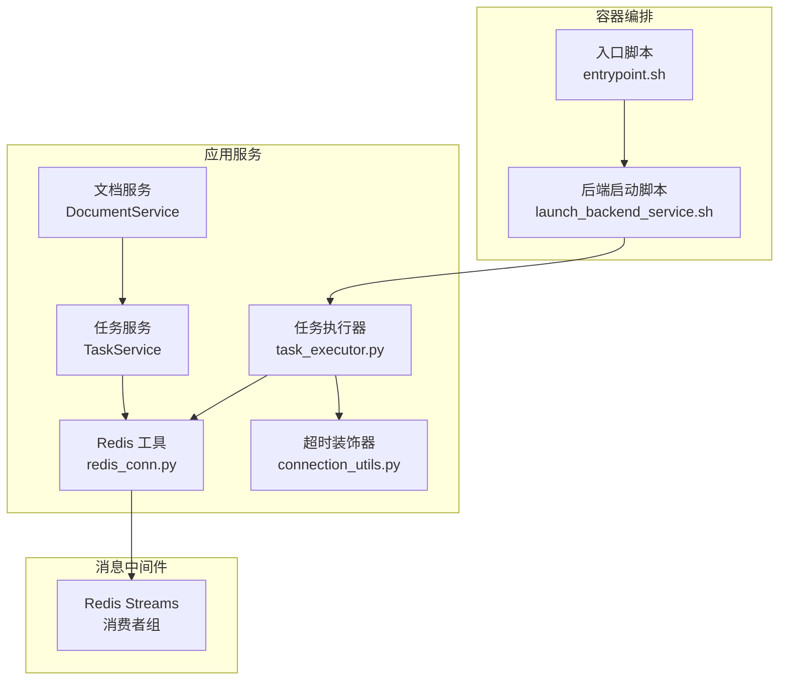
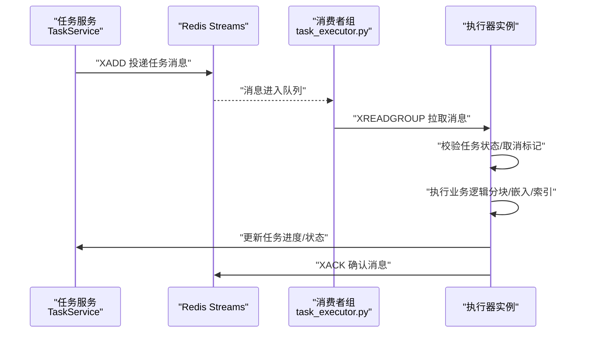
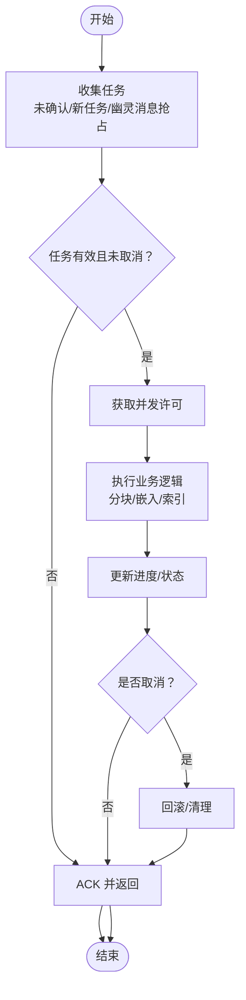
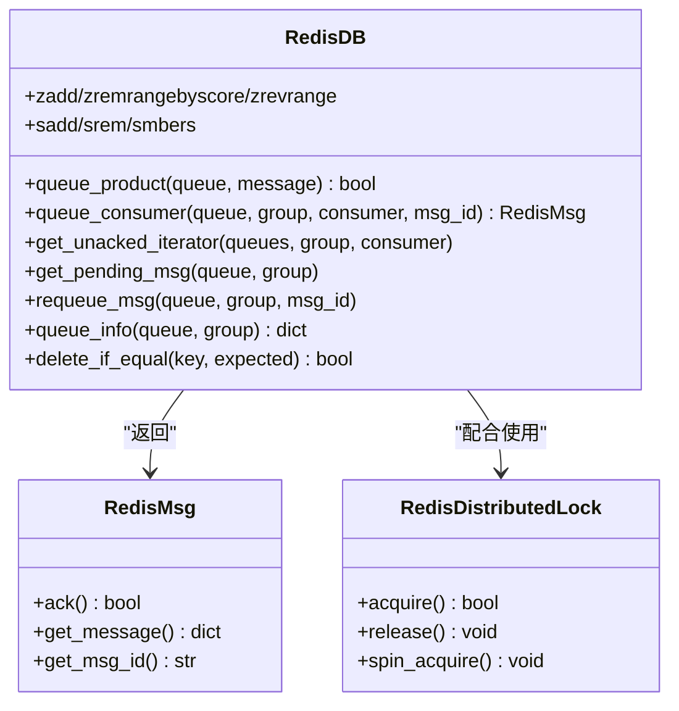
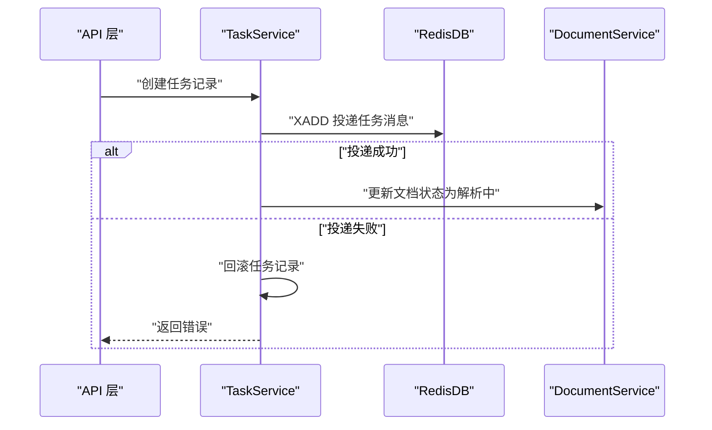
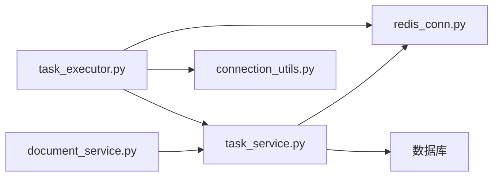

# 异步任务与消息队列

<cite>
**本文引用的文件**
- [task_executor.py](file://rag/svr/task_executor.py)
- [redis_conn.py](file://rag/utils/redis_conn.py)
- [task_service.py](file://api/db/services/task_service.py)
- [document_service.py](file://api/db/services/document_service.py)
- [entrypoint.sh](file://docker/entrypoint.sh)
- [launch_backend_service.sh](file://docker/launch_backend_service.sh)
- [connection_utils.py](file://common/connection_utils.py)
- [config.py](file://admin/server/config.py)
</cite>

## 目录
1. [简介](#简介)
2. [项目结构](#项目结构)
3. [核心组件](#核心组件)
4. [架构总览](#架构总览)
5. [详细组件分析](#详细组件分析)
6. [依赖分析](#依赖分析)
7. [性能考量](#性能考量)
8. [故障排查指南](#故障排查指南)
9. [结论](#结论)
10. [附录](#附录)

## 简介
本文件面向异步任务与消息队列主题，围绕 RAGFlow 的实际实现，系统化阐述以下内容：
- 异步任务的设计模式：任务队列管理、任务调度策略、任务状态跟踪
- 消息队列集成方案：以 Redis Streams 为核心的消费者组消费模型
- 任务执行器设计与实现：任务分发、并发控制、失败重试、超时处理、优雅关闭
- 信号处理与进程间通信：信号捕获、进程同步、优雅关闭
- 后台任务监控与管理：进度跟踪、异常处理、性能监控、资源清理
- 分布式任务处理：任务分片、结果聚合、去重机制、幂等性保证

## 项目结构
RAGFlow 的异步任务与消息队列相关代码主要分布在以下模块：
- 服务端任务执行器：负责从消息队列拉取任务、执行业务逻辑、更新进度与状态
- Redis 工具层：封装 Redis Streams 的生产/消费、消费者组管理、待确认消息处理
- 任务服务层：负责任务建模、进度更新、取消标记、队列投递
- 文档服务层：汇总任务进度、计算整体运行状态
- 容器启动脚本：统一编排任务执行器实例、信号处理与进程管理
- 超时装饰器：为关键异步操作提供超时保护

**图表来源**
- [task_executor.py](file://rag/svr/task_executor.py)
- [redis_conn.py](file://rag/utils/redis_conn.py)
- [task_service.py](file://api/db/services/task_service.py)
- [document_service.py](file://api/db/services/document_service.py)
- [entrypoint.sh](file://docker/entrypoint.sh)
- [launch_backend_service.sh](file://docker/launch_backend_service.sh)
- [connection_utils.py](file://common/connection_utils.py)

**章节来源**
- [task_executor.py](file://rag/svr/task_executor.py)
- [redis_conn.py](file://rag/utils/redis_conn.py)
- [task_service.py](file://api/db/services/task_service.py)
- [document_service.py](file://api/db/services/document_service.py)
- [entrypoint.sh](file://docker/entrypoint.sh)
- [launch_backend_service.sh](file://docker/launch_backend_service.sh)
- [connection_utils.py](file://common/connection_utils.py)

## 核心组件
- 任务执行器（task_executor.py）
  - 基于 asyncio 的事件循环，通过 Redis Streams 消费任务
  - 使用消费者组（XREADGROUP）实现多实例负载均衡
  - 采用信号处理与优雅关闭，结合心跳上报与过期清理
  - 并发限制与限流：任务并发、分块并发、嵌入并发、存储并发
  - 进度回调与取消检测，支持分页任务与特殊任务类型
- Redis 工具（redis_conn.py）
  - 封装 RedisDB 类，提供队列生产/消费、消费者组创建、未确认消息迭代
  - 提供待确认消息查询、消息重新入队、消费者组信息查询
  - 提供分布式锁工具类，支持自旋获取
- 任务服务（task_service.py）
  - 任务建模与查询、批量插入、进度更新规则
  - 队列投递：先写 Redis，再更新文档状态，确保幂等与一致性
  - 取消标记：基于 Redis 键标记，执行器周期检测
  - 数据流任务与知识图谱任务的队列投递
- 文档服务（document_service.py）
  - 聚合任务进度，计算文档整体运行状态与排队长度提示
  - 统计知识库维度的任务状态分布
- 超时装饰器（connection_utils.py）
  - 为同步/异步函数提供超时保护，支持多次尝试与自定义超时行为
- 容器编排（entrypoint.sh、launch_backend_service.sh）
  - 启动多个任务执行器实例，支持参数化工作数量与范围
  - 信号捕获与子进程管理，实现优雅关闭与重试

**章节来源**
- [task_executor.py](file://rag/svr/task_executor.py)
- [redis_conn.py](file://rag/utils/redis_conn.py)
- [task_service.py](file://api/db/services/task_service.py)
- [document_service.py](file://api/db/services/document_service.py)
- [connection_utils.py](file://common/connection_utils.py)
- [entrypoint.sh](file://docker/entrypoint.sh)
- [launch_backend_service.sh](file://docker/launch_backend_service.sh)

## 架构总览
RAGFlow 的异步任务架构以 Redis Streams 为核心，形成“生产者-消费者组-执行器”的解耦闭环：
- 生产者：任务服务在数据库中生成任务记录后，向 Redis 指定队列投递消息
- 消费者组：多个任务执行器实例组成消费者组，实现消息的水平扩展与容错
- 执行器：每个执行器实例独立消费消息，执行具体业务逻辑，更新进度与状态

**图表来源**
- [task_service.py](file://api/db/services/task_service.py)
- [redis_conn.py](file://rag/utils/redis_conn.py)
- [task_executor.py](file://rag/svr/task_executor.py)

**章节来源**
- [task_service.py](file://api/db/services/task_service.py)
- [redis_conn.py](file://rag/utils/redis_conn.py)
- [task_executor.py](file://rag/svr/task_executor.py)

## 详细组件分析

### 任务执行器（task_executor.py）
- 任务收集与去重
  - 优先消费当前消费者未确认消息，确保断线重连后的消息不丢失
  - 若无未确认消息，则轮询多个队列拉取新任务
  - 支持“幽灵消息”抢占：当其他实例长时间未确认时，当前实例可抢占其消息
- 任务执行与并发控制
  - 任务并发上限、分块并发、嵌入并发、存储并发均通过信号量控制
  - 对关键步骤（如嵌入、索引）设置超时保护
- 进度跟踪与取消
  - 通过回调函数更新任务进度与消息，支持分页任务的消息格式
  - 周期性检查取消标记，若被取消则抛出异常并回滚或清理
- 心跳与健康检查
  - 定期上报心跳，包含待处理/滞后任务数、完成/失败任务数、当前处理中的任务列表
  - 清理过期心跳与失效执行器实例，保持消费者组健康
- 优雅关闭与信号处理
  - 注册 SIGINT/SIGTERM 处理函数，设置停止事件并等待任务结束
  - 使用信号触发内存快照与追踪，便于问题定位

**图表来源**
- [task_executor.py](file://rag/svr/task_executor.py)

**章节来源**
- [task_executor.py](file://rag/svr/task_executor.py)

### Redis 工具（redis_conn.py）
- 队列操作
  - 生产：XADD 投递 JSON 消息体
  - 消费：XREADGROUP 拉取指定消费者组的消息，自动创建消费者组
  - 未确认迭代：遍历当前消费者未确认消息，保证重启后不丢消息
  - 待确认查询与重新入队：支持查询 Pending 列表与消息重入队
  - 队列信息：查询消费者组 Pending/Lag 等指标
- 分布式锁
  - 基于 Redis 的 RedLock 思想，提供原子删除与获取能力
  - 支持自旋获取，适用于清理任务执行器实例等场景

**图表来源**
- [redis_conn.py](file://rag/utils/redis_conn.py)

**章节来源**
- [redis_conn.py](file://rag/utils/redis_conn.py)

### 任务服务（task_service.py）
- 任务建模与查询
  - 提供按任务 ID 查询、按文档查询、按文档集合查询等接口
  - 任务进度更新遵循平台差异与并发安全策略
- 队列投递与幂等
  - 先写 Redis，再更新文档状态；若 Redis 写入失败则回滚数据库并报错
  - 通过任务摘要（digest）与页面范围匹配，实现任务复用与去重
- 取消机制
  - 通过 Redis 键标记任务取消，执行器周期检测并终止
- 数据流与知识图谱任务
  - 支持数据流任务与 RAPTOR/GraphRAG/MindMap 等后续任务的队列投递

**图表来源**
- [task_service.py](file://api/db/services/task_service.py)
- [redis_conn.py](file://rag/utils/redis_conn.py)

**章节来源**
- [task_service.py](file://api/db/services/task_service.py)

### 文档服务（document_service.py）
- 进度聚合与状态计算
  - 汇总单文档下所有任务的进度、消息与优先级，计算整体运行状态
  - 提供排队长度提示，增强用户感知
- 统计与报表
  - 按知识库统计处理中/已完成/失败/取消/下载数，支撑运维监控

**章节来源**
- [document_service.py](file://api/db/services/document_service.py)

### 超时装饰器（connection_utils.py）
- 为同步与异步函数提供超时保护，支持多次尝试与自定义超时行为
- 在关键 I/O 或外部调用处使用，避免阻塞导致的资源占用

**章节来源**
- [connection_utils.py](file://common/connection_utils.py)

### 容器编排（entrypoint.sh、launch_backend_service.sh）
- 启动多个任务执行器实例，支持固定数量或范围参数化
- 信号捕获与子进程管理，实现优雅关闭与失败重试
- 通过环境变量与参数控制各组件启停

**章节来源**
- [entrypoint.sh](file://docker/entrypoint.sh)
- [launch_backend_service.sh](file://docker/launch_backend_service.sh)

## 依赖分析
- 组件耦合
  - 任务执行器强依赖 Redis 工具与任务服务；弱依赖文档服务用于状态聚合
  - 任务服务依赖 Redis 工具进行消息投递，依赖数据库进行状态持久化
- 外部依赖
  - Redis：Streams、消费者组、有序集合、集合、键空间等
  - 存储：MinIO（通过 settings.STORAGE_IMPL），用于图片/文件上传
  - 数据库：Peewee ORM，用于任务与文档状态管理
- 潜在环路
  - 当前实现未发现直接循环依赖；执行器与服务层职责清晰分离

**图表来源**
- [task_executor.py](file://rag/svr/task_executor.py)
- [redis_conn.py](file://rag/utils/redis_conn.py)
- [task_service.py](file://api/db/services/task_service.py)
- [document_service.py](file://api/db/services/document_service.py)
- [connection_utils.py](file://common/connection_utils.py)

**章节来源**
- [task_executor.py](file://rag/svr/task_executor.py)
- [redis_conn.py](file://rag/utils/redis_conn.py)
- [task_service.py](file://api/db/services/task_service.py)
- [document_service.py](file://api/db/services/document_service.py)
- [connection_utils.py](file://common/connection_utils.py)

## 性能考量
- 并发与限流
  - 通过信号量控制任务并发、分块并发、嵌入并发与存储并发，避免资源争用
  - 建议根据硬件配置调整 MAX_CONCURRENT_* 参数，平衡吞吐与稳定性
- I/O 优化
  - 批量插入与批量上传：分批处理减少内存峰值与网络往返
  - 图片/文件上传使用线程池执行，避免阻塞事件循环
- 超时与重试
  - 关键步骤设置超时，防止长时间阻塞；失败重试与异常日志记录
- 进度与可观测性
  - 心跳上报与 Pending/Lag 指标，便于评估队列积压与处理能力
  - 文档服务聚合进度与排队提示，提升用户体验

## 故障排查指南
- 任务长时间未完成
  - 检查 Redis 消费者组 Pending/Lag 指标，确认是否存在堆积
  - 查看执行器日志中的“幽灵消息抢占”与“未确认消息迭代”路径
- 任务被意外取消
  - 检查 Redis 中是否存在对应取消键，确认取消流程是否正确
- 执行器崩溃或离线
  - 检查心跳清理逻辑是否正常，确认过期时间与清理间隔合理
- 资源耗尽或内存泄漏
  - 观察内存使用阈值与 GC 行为，必要时降低并发或增加阈值
- 信号与优雅关闭
  - 确认 SIGINT/SIGTERM 处理函数已注册，停止事件能正确传播

**章节来源**
- [task_executor.py](file://rag/svr/task_executor.py)
- [redis_conn.py](file://rag/utils/redis_conn.py)
- [task_service.py](file://api/db/services/task_service.py)
- [document_service.py](file://api/db/services/document_service.py)

## 结论
RAGFlow 的异步任务与消息队列体系以 Redis Streams 为基础，结合消费者组与事件驱动模型，实现了高可用、可扩展的任务处理流水线。通过严格的进度跟踪、取消机制、超时保护与优雅关闭，系统在复杂业务场景下具备良好的稳定性与可观测性。建议在生产环境中结合监控指标与告警策略，持续优化并发参数与资源配额。

## 附录
- 配置项与环境变量
  - MAX_CONCURRENT_TASKS、MAX_CONCURRENT_CHUNK_BUILDERS、MAX_CONCURRENT_EMBEDDINGS、MAX_CONCURRENT_MINIO：控制并发
  - WORKER_HEARTBEAT_TIMEOUT：心跳过期阈值
  - TRACE_MALLOC_ENABLED：启用内存追踪
  - MACOS：平台差异化进度更新策略
- 管理与运维
  - 通过容器启动脚本统一管理执行器实例数量与生命周期
  - 使用管理员服务配置任务执行器健康检查与服务发现

**章节来源**
- [task_executor.py](file://rag/svr/task_executor.py)
- [entrypoint.sh](file://docker/entrypoint.sh)
- [launch_backend_service.sh](file://docker/launch_backend_service.sh)
- [config.py](file://admin/server/config.py)