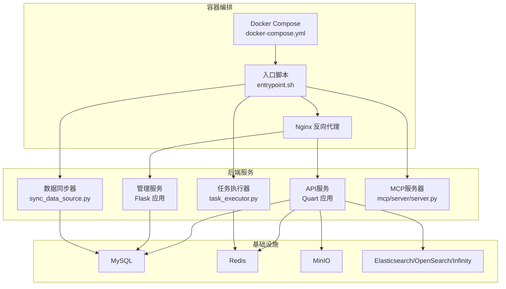
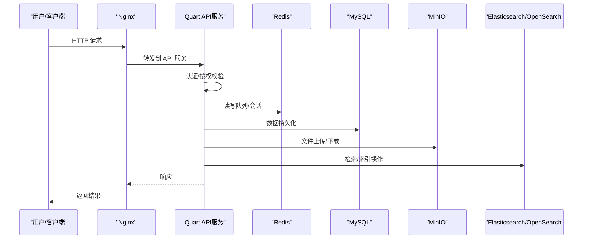
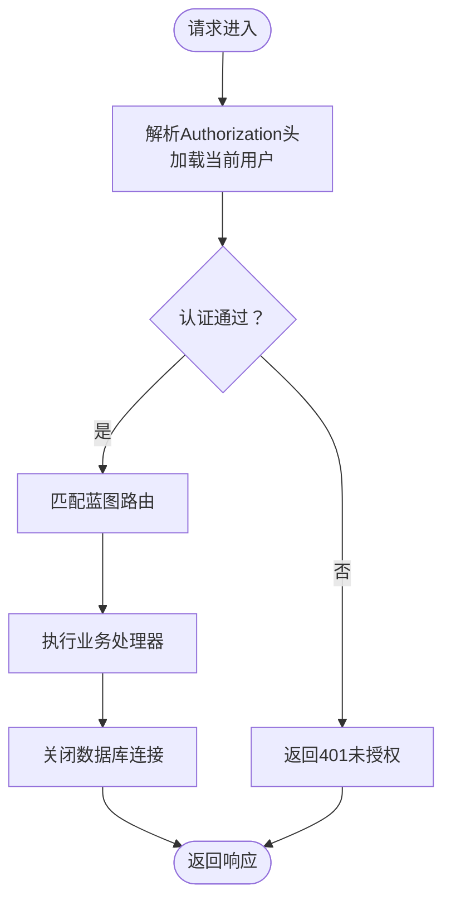
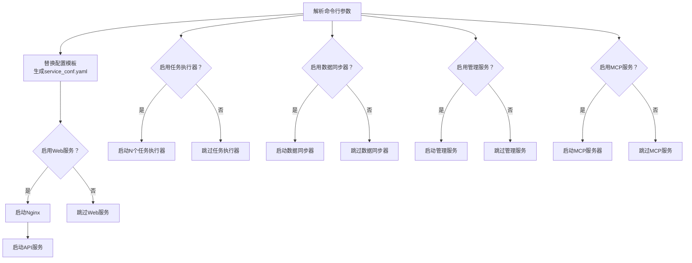
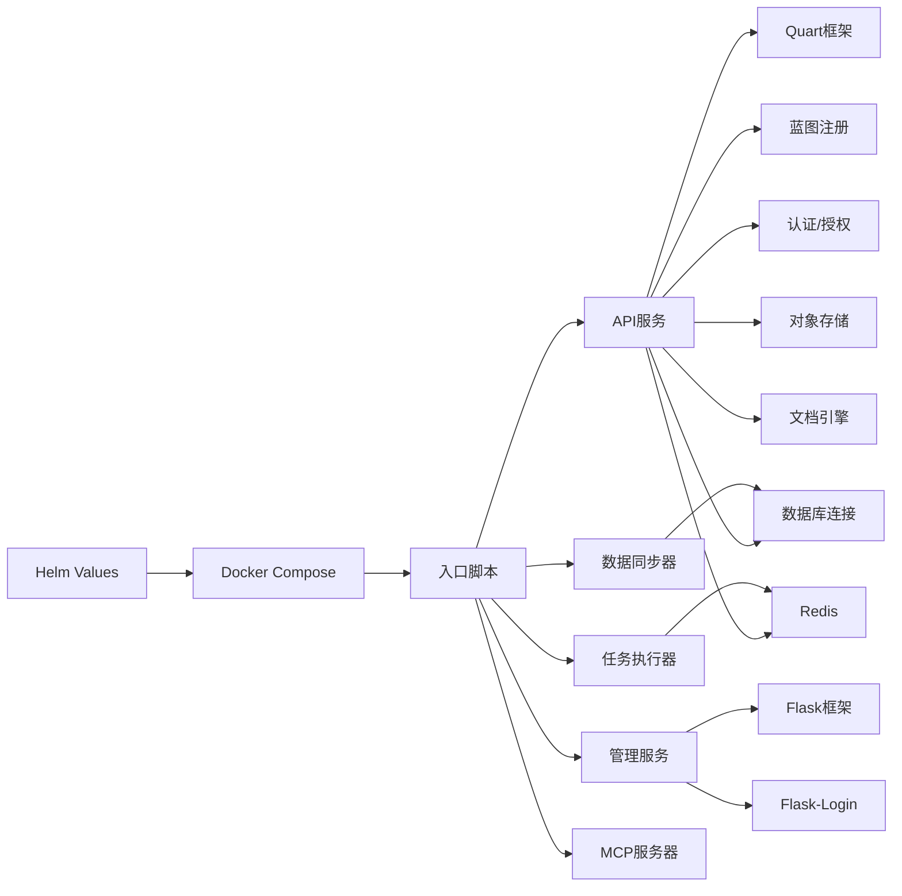
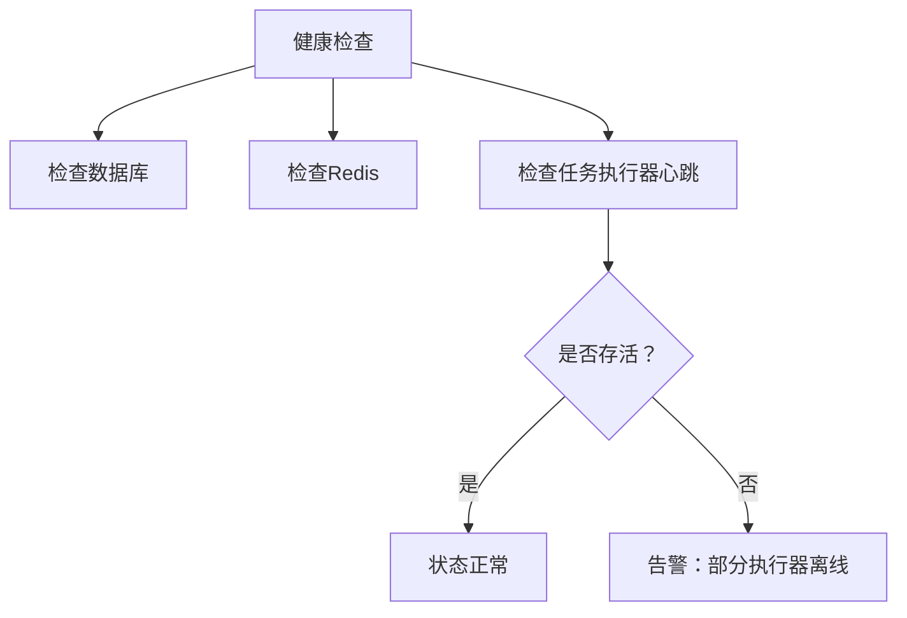

# 微服务架构设计

<cite>
**本文档引用的文件**
- [api/ragflow_server.py](file://api/ragflow_server.py)
- [api/apps/__init__.py](file://api/apps/__init__.py)
- [api/apps/api_app.py](file://api/apps/api_app.py)
- [common/settings.py](file://common/settings.py)
- [admin/server/admin_server.py](file://admin/server/admin_server.py)
- [docker/docker-compose.yml](file://docker/docker-compose.yml)
- [docker/entrypoint.sh](file://docker/entrypoint.sh)
- [docker/launch_backend_service.sh](file://docker/launch_backend_service.sh)
- [conf/service_conf.yaml](file://conf/service_conf.yaml)
- [api/utils/health_utils.py](file://api/utils/health_utils.py)
- [api/apps/sdk/agents.py](file://api/apps/sdk/agents.py)
- [helm/values.yaml](file://helm/values.yaml)
</cite>

## 目录
1. [引言](#引言)
2. [项目结构](#项目结构)
3. [核心组件](#核心组件)
4. [架构总览](#架构总览)
5. [详细组件分析](#详细组件分析)
6. [依赖关系分析](#依赖关系分析)
7. [性能考虑](#性能考虑)
8. [故障排查指南](#故障排查指南)
9. [结论](#结论)
10. [附录](#附录)

## 引言
本文件面向微服务架构设计，基于仓库中的Flask/FastAPI相关实现，系统性阐述服务拆分原则、服务间通信机制、负载均衡策略、服务注册与发现、健康检查与故障转移、熔断器模式、API网关设计、监控与追踪、部署与扩缩容、以及数据一致性与事务处理方案。文档以实际源码为依据，辅以图示帮助读者快速建立对整体架构的认知。

## 项目结构
该项目采用多进程/多容器的混合部署方式，核心后端服务通过入口脚本统一编排，容器编排使用Docker Compose与Helm Chart。API层基于Quart（异步WSGI）提供REST接口，管理后台服务基于Flask，数据库与中间件通过配置文件集中管理。

**图表来源**
- [docker/docker-compose.yml:1-133](file://docker/docker-compose.yml#L1-L133)
- [docker/entrypoint.sh:220-273](file://docker/entrypoint.sh#L220-L273)
- [api/ragflow_server.py:148-157](file://api/ragflow_server.py#L148-L157)
- [admin/server/admin_server.py:70-85](file://admin/server/admin_server.py#L70-L85)

**章节来源**
- [docker/docker-compose.yml:1-133](file://docker/docker-compose.yml#L1-L133)
- [docker/entrypoint.sh:1-273](file://docker/entrypoint.sh#L1-L273)
- [conf/service_conf.yaml:1-159](file://conf/service_conf.yaml#L1-L159)

## 核心组件
- API服务（Quart）：负责对外HTTP接口、认证授权、路由注册、错误处理与连接清理。
- 管理服务（Flask）：提供后台管理界面与认证初始化。
- 任务执行器：基于Redis队列的任务消费者，支持范围/固定数量启动。
- 数据同步器：数据源同步组件，保障外部数据接入的一致性。
- MCP服务器：可选的工具调用协议服务端，便于扩展外部工具能力。
- 配置中心：集中式配置文件与环境变量，驱动运行时行为。

**章节来源**
- [api/ragflow_server.py:1-157](file://api/ragflow_server.py#L1-L157)
- [api/apps/__init__.py:1-320](file://api/apps/__init__.py#L1-L320)
- [admin/server/admin_server.py:1-85](file://admin/server/admin_server.py#L1-L85)
- [docker/entrypoint.sh:182-273](file://docker/entrypoint.sh#L182-L273)
- [conf/service_conf.yaml:1-159](file://conf/service_conf.yaml#L1-L159)

## 架构总览
系统采用“入口脚本统一编排 + 多进程服务 + 容器化部署”的模式。入口脚本根据参数启用/禁用各子服务，并通过模板替换生成最终配置；Docker Compose/Helm定义网络、存储与服务暴露；API服务通过蓝图动态注册模块路由；管理服务独立运行；任务执行器与数据同步器作为后台工作者持续运行。

**图表来源**
- [docker/entrypoint.sh:220-273](file://docker/entrypoint.sh#L220-L273)
- [api/ragflow_server.py:148-157](file://api/ragflow_server.py#L148-L157)
- [api/apps/__init__.py:95-142](file://api/apps/__init__.py#L95-L142)
- [conf/service_conf.yaml:1-159](file://conf/service_conf.yaml#L1-L159)

## 详细组件分析

### API服务（Quart）
- 路由与蓝图：动态扫描并注册各业务模块蓝图，支持SDK与API路径差异化前缀。
- 认证与授权：基于Header中的访问令牌加载当前用户，支持API Token与用户态双重校验。
- 错误处理：全局异常捕获与标准化响应。
- 连接管理：请求结束时关闭数据库连接，避免连接泄漏。

**图表来源**
- [api/apps/__init__.py:95-142](file://api/apps/__init__.py#L95-L142)
- [api/apps/__init__.py:285-320](file://api/apps/__init__.py#L285-L320)

**章节来源**
- [api/apps/__init__.py:1-320](file://api/apps/__init__.py#L1-L320)

### 管理服务（Flask）
- 登录管理：集成Flask-Login，初始化默认管理员账户。
- 配置加载：从配置文件加载服务配置，支持运行时注入。
- 端口与线程：监听固定端口，单进程多线程模式。

**章节来源**
- [admin/server/admin_server.py:1-85](file://admin/server/admin_server.py#L1-L85)

### 任务执行器与数据同步器
- 启动策略：入口脚本支持按范围或固定数量启动多个任务执行器实例。
- 自愈机制：每个子进程在退出后自动重启，提升可用性。
- 队列与心跳：通过Redis进行消息队列与心跳上报，配合健康检查。

**章节来源**
- [docker/entrypoint.sh:182-273](file://docker/entrypoint.sh#L182-L273)
- [api/utils/health_utils.py:166-184](file://api/utils/health_utils.py#L166-L184)

### 入口脚本与容器编排
- 参数化启动：支持禁用Web服务、任务执行器、数据同步器、启用MCP/管理服务等。
- 配置模板：将模板文件中的环境变量替换为最终配置文件。
- 多进程守护：每个组件在循环中启动，确保异常退出后的自恢复。

**图表来源**
- [docker/entrypoint.sh:66-149](file://docker/entrypoint.sh#L66-L149)
- [docker/entrypoint.sh:154-173](file://docker/entrypoint.sh#L154-L173)
- [docker/entrypoint.sh:220-273](file://docker/entrypoint.sh#L220-L273)

**章节来源**
- [docker/entrypoint.sh:1-273](file://docker/entrypoint.sh#L1-L273)

### 配置中心与运行时设置
- 集中式配置：通过YAML模板与环境变量组合生成最终配置。
- 运行时设置：加载数据库、存储、文档引擎、LLM工厂等运行参数。
- 加密存储：可选的加密存储实现，增强敏感数据保护。

**章节来源**
- [conf/service_conf.yaml:1-159](file://conf/service_conf.yaml#L1-L159)
- [common/settings.py:169-396](file://common/settings.py#L169-L396)

## 依赖关系分析

**图表来源**
- [api/apps/__init__.py:1-320](file://api/apps/__init__.py#L1-L320)
- [admin/server/admin_server.py:1-85](file://admin/server/admin_server.py#L1-L85)
- [docker/entrypoint.sh:182-273](file://docker/entrypoint.sh#L182-L273)
- [docker/docker-compose.yml:1-133](file://docker/docker-compose.yml#L1-L133)
- [helm/values.yaml:182-258](file://helm/values.yaml#L182-L258)

**章节来源**
- [api/apps/__init__.py:1-320](file://api/apps/__init__.py#L1-L320)
- [admin/server/admin_server.py:1-85](file://admin/server/admin_server.py#L1-L85)
- [docker/docker-compose.yml:1-133](file://docker/docker-compose.yml#L1-L133)
- [helm/values.yaml:182-258](file://helm/values.yaml#L182-L258)

## 性能考虑
- 超时配置：针对大模型推理场景，调整响应与请求体超时时间，避免短超时导致的失败。
- 并行与GPU：检测CUDA设备数量，合理利用GPU加速。
- 内存与缓存：通过jemalloc预加载与内存池优化，降低分配开销。
- 批量与并发：嵌入批量大小、文件批量大小等参数，平衡吞吐与延迟。

**章节来源**
- [api/apps/__init__.py:69-73](file://api/apps/__init__.py#L69-L73)
- [common/settings.py:352-361](file://common/settings.py#L352-L361)
- [docker/launch_backend_service.sh:32-33](file://docker/launch_backend_service.sh#L32-L33)

## 故障排查指南
- 健康检查：通过Redis集合与有序集合维护任务执行器心跳，定期巡检服务存活状态。
- 等待就绪：提供HTTP健康检查等待脚本，确保依赖服务可用后再启动。
- 日志与信号：统一初始化根日志器，捕获中断信号优雅停机，释放会话与锁。

**图表来源**
- [api/utils/health_utils.py:187-198](file://api/utils/health_utils.py#L187-L198)
- [api/utils/health_utils.py:166-184](file://api/utils/health_utils.py#L166-L184)

**章节来源**
- [api/utils/health_utils.py:159-198](file://api/utils/health_utils.py#L159-L198)
- [api/ragflow_server.py:69-75](file://api/ragflow_server.py#L69-L75)
- [sandbox/scripts/wait-for-it-http.sh:1-31](file://sandbox/scripts/wait-for-it-http.sh#L1-L31)

## 结论
该架构以入口脚本为核心编排点，结合Docker Compose/Helm实现容器化与多进程守护，API层采用Quart提供高并发异步能力，管理服务与任务执行器/数据同步器形成完整的后台工作流。通过集中式配置与健康检查机制，系统具备良好的可运维性与弹性。建议在生产环境中进一步完善服务注册与发现、API网关、分布式追踪与告警体系，以满足更复杂的微服务治理需求。

## 附录

### 服务拆分原则
- 按业务域划分：如知识库、对话、文件、用户、权限等模块独立成服务或路由。
- 单一职责：每个服务聚焦特定领域，避免交叉耦合。
- 数据边界：围绕聚合根划分数据边界，减少跨服务事务。

### 服务间通信机制
- 同步调用：内部服务间通过HTTP/HTTPS直连，适用于低延迟场景。
- 异步消息：任务执行器通过Redis队列解耦耗时任务，提高吞吐。

**章节来源**
- [api/apps/__init__.py:250-282](file://api/apps/__init__.py#L250-L282)
- [docker/entrypoint.sh:255-270](file://docker/entrypoint.sh#L255-L270)

### 负载均衡策略
- Nginx反向代理：统一入口，支持静态资源与后端服务转发。
- 多实例部署：通过容器编排横向扩展，结合健康检查实现自动摘除不健康实例。

**章节来源**
- [docker/docker-compose.yml:31-36](file://docker/docker-compose.yml#L31-L36)
- [docker/entrypoint.sh:220-230](file://docker/entrypoint.sh#L220-L230)

### 服务注册与发现、健康检查、故障转移与熔断
- 注册与发现：建议引入服务注册中心（如Consul/Nacos），服务启动时注册，客户端通过服务名调用。
- 健康检查：基于HTTP/Redis心跳，定期探测实例状态。
- 故障转移：当实例不可用时，自动切换至其他可用实例。
- 熔断器：在下游异常增多时触发熔断，快速失败并降级，防止雪崩。

[本节为通用微服务治理建议，不直接对应具体源码]

### API网关设计与实现
- 请求路由：根据URL前缀将请求转发至对应服务。
- 限流控制：基于Redis令牌桶实现细粒度限流。
- 鉴权验证：支持Token、Basic Auth等多种鉴权方式。

**章节来源**
- [api/apps/sdk/agents.py:262-303](file://api/apps/sdk/agents.py#L262-L303)

### 监控与追踪
- 分布式链路追踪：建议集成OpenTelemetry，采集请求跨度信息。
- 性能指标：Prometheus抓取指标，Grafana可视化。
- 异常告警：基于日志与指标规则触发告警。

[本节为通用监控建议，不直接对应具体源码]

### 部署与扩缩容最佳实践
- 容器化：使用Docker镜像与Compose/Helm部署，确保环境一致。
- 自动伸缩：基于CPU/内存/队列长度等指标实现HPA。
- 资源调度：合理设置requests/limits，避免资源争抢。

**章节来源**
- [helm/values.yaml:182-258](file://helm/values.yaml#L182-L258)
- [docker/docker-compose.yml:100-107](file://docker/docker-compose.yml#L100-L107)

### 服务间数据一致性与事务处理
- 最终一致性：通过事件驱动与补偿机制实现跨服务数据一致。
- Saga模式：长事务拆分为多个本地事务，失败时执行补偿。
- 两阶段提交：仅在强一致且可控范围内使用，避免性能瓶颈。

[本节为通用事务处理建议，不直接对应具体源码]