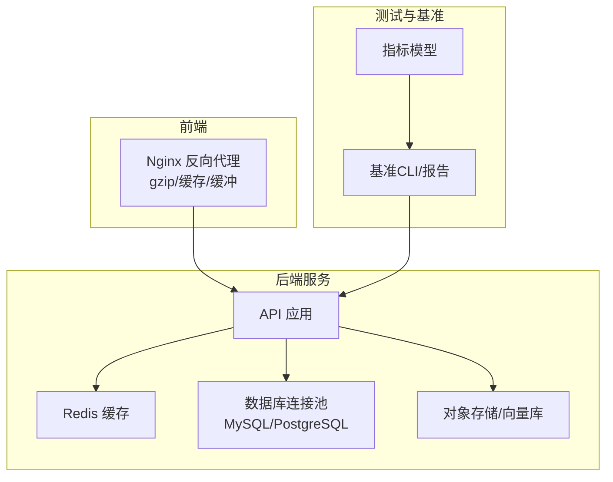
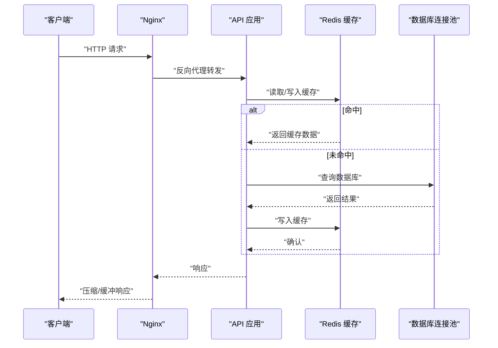
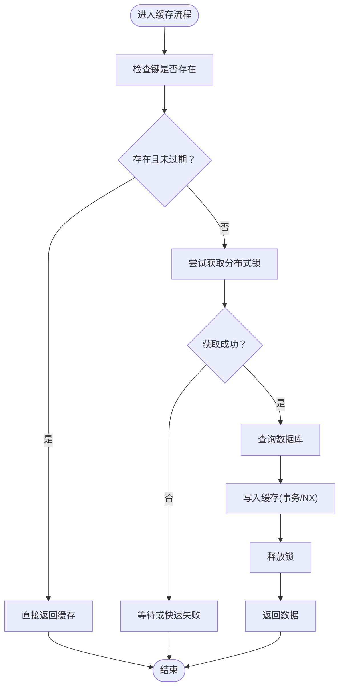
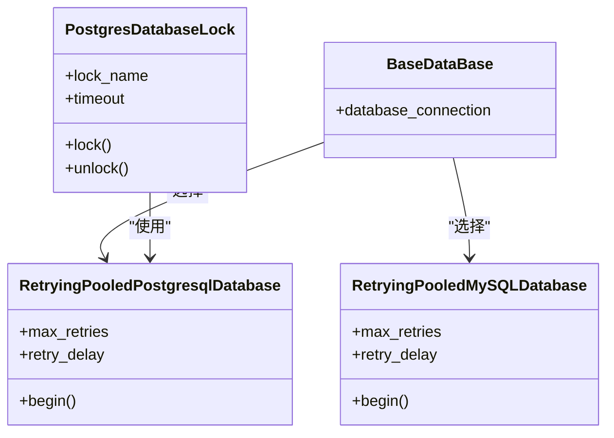
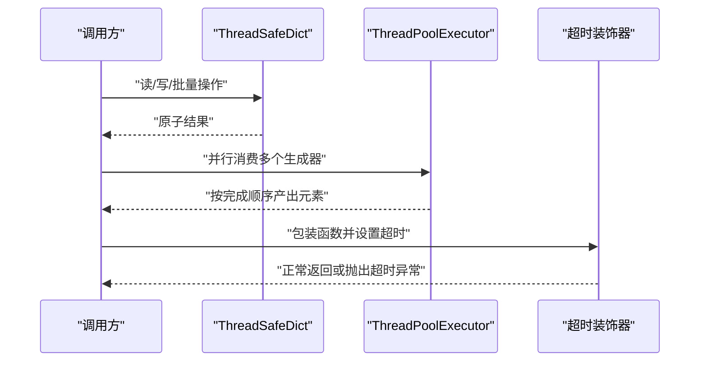
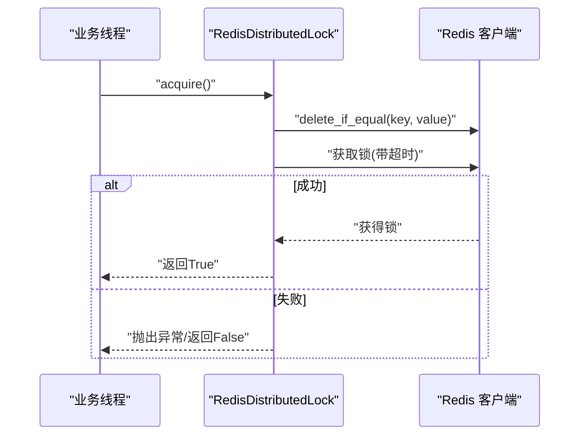
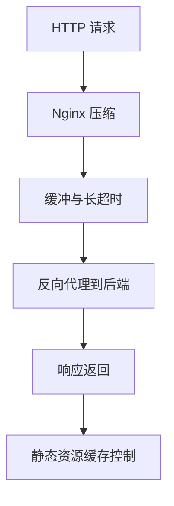
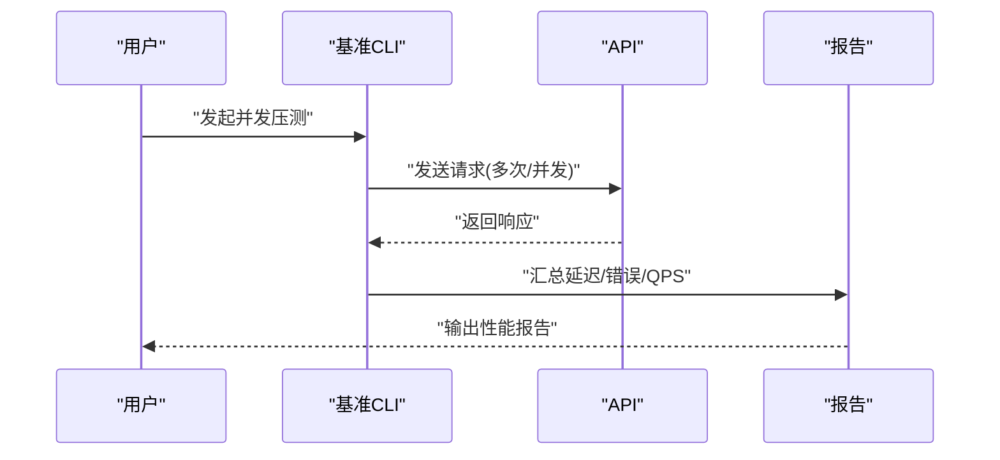
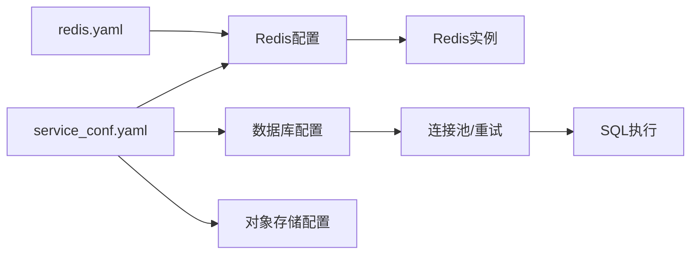

# 性能优化策略

<cite>
**本文引用的文件**
- [redis_conn.py](file://rag/rag/utils/redis_conn.py)
- [redis.yaml](file://helm/templates/redis.yaml)
- [cache_file_svr.py](file://rag/rag/svr/cache_file_svr.py)
- [db_models.py](file://api/db/db_models.py)
- [db_utils.py](file://api/db/db_utils.py)
- [service_conf.yaml](file://conf/service_conf.yaml)
- [http_client.py](file://admin/client/http_client.py)
- [ragflow_client.py](file://admin/client/ragflow_client.py)
- [proxy.conf](file://docker/nginx/proxy.conf)
- [ragflow.conf](file://docker/nginx/ragflow.conf)
- [util_threadpool_concurrency.py](file://common/data_source/util_threadpool_concurrency.py)
- [metrics.py](file://test/benchmark/metrics.py)
- [cli.py](file://test/benchmark/cli.py)
- [report.py](file://test/benchmark/report.py)
- [common.py](file://test/testcases/test_web_api/common.py)
- [mcp_tool_call_conn.py](file://common/mcp_tool_call_conn.py)
- [llm_service.py](file://api/db/services/llm_service.py)
- [memory_message_service.py](file://api/db/joint_services/memory_message_service.py)
- [messages.py](file://memory/services/messages.py)
- [connection_utils.py](file://common/connection_utils.py)
</cite>

## 目录
1. [简介](#简介)
2. [项目结构](#项目结构)
3. [核心组件](#核心组件)
4. [架构总览](#架构总览)
5. [详细组件分析](#详细组件分析)
6. [依赖关系分析](#依赖关系分析)
7. [性能考量](#性能考量)
8. [故障排查指南](#故障排查指南)
9. [结论](#结论)
10. [附录](#附录)

## 简介
本文件面向RAGFlow项目的性能优化策略，系统性梳理并总结缓存、数据库、内存与并发、网络以及性能监控与分析等关键领域的工程实践。内容以仓库现有实现为依据，结合代码级分析与可视化图示，帮助读者快速理解并落地优化方案。

## 项目结构
RAGFlow后端采用Python服务（FastAPI风格路由）与多模块协作的组织方式：缓存层基于Redis；数据库层通过Peewee连接池封装MySQL/PostgreSQL；存储层支持多种对象存储；前端通过Nginx进行静态资源与反向代理；测试与基准工具提供性能度量能力。

图表来源
- [ragflow.conf:1-34](file://docker/nginx/ragflow.conf#L1-L34)
- [proxy.conf:1-12](file://docker/nginx/proxy.conf#L1-L12)
- [service_conf.yaml:1-159](file://conf/service_conf.yaml#L1-L159)
- [redis_conn.py:114-145](file://rag/rag/utils/redis_conn.py#L114-L145)
- [db_models.py:404-420](file://api/db/db_models.py#L404-L420)

章节来源
- [service_conf.yaml:1-159](file://conf/service_conf.yaml#L1-L159)
- [redis_conn.py:114-145](file://rag/rag/utils/redis_conn.py#L114-L145)
- [db_models.py:404-420](file://api/db/db_models.py#L404-L420)
- [ragflow.conf:1-34](file://docker/nginx/ragflow.conf#L1-L34)
- [proxy.conf:1-12](file://docker/nginx/proxy.conf#L1-L12)

## 核心组件
- 缓存子系统：Redis连接、分布式锁、令牌桶限流Lua脚本、队列与原子操作、健康检查与信息采集。
- 数据库子系统：连接池封装、重试与指数退避、事务与锁、批量插入与分页查询。
- 并发与线程安全：线程安全字典、线程池并行生成器、超时装饰器、同步/异步混合执行。
- 网络与传输：Nginx压缩与缓冲、HTTP会话与连接复用、客户端压测工具与QPS统计。
- 性能监控与分析：采样与统计模型、基准报告、慢请求日志辅助。

章节来源
- [redis_conn.py:85-116](file://rag/rag/utils/redis_conn.py#L85-L116)
- [redis_conn.py:119-168](file://rag/rag/utils/redis_conn.py#L119-L168)
- [redis_conn.py:494-516](file://rag/rag/utils/redis_conn.py#L494-L516)
- [db_models.py:298-320](file://api/db/db_models.py#L298-L320)
- [db_models.py:323-391](file://api/db/db_models.py#L323-L391)
- [db_utils.py:26-51](file://api/db/db_utils.py#L26-L51)
- [util_threadpool_concurrency.py:16-116](file://common/data_source/util_threadpool_concurrency.py#L16-L116)
- [connection_utils.py:35-98](file://common/connection_utils.py#L35-L98)
- [http_client.py:74-134](file://admin/client/http_client.py#L74-L134)
- [ragflow_client.py:1480-1504](file://admin/client/ragflow_client.py#L1480-L1504)
- [metrics.py:6-68](file://test/benchmark/metrics.py#L6-L68)
- [cli.py:506-544](file://test/benchmark/cli.py#L506-L544)
- [report.py:83-105](file://test/benchmark/report.py#L83-L105)

## 架构总览
下图展示从Nginx到后端API、缓存与数据库的关键交互路径，并标注性能相关配置点。

图表来源
- [ragflow.conf:1-34](file://docker/nginx/ragflow.conf#L1-L34)
- [proxy.conf:1-12](file://docker/nginx/proxy.conf#L1-L12)
- [redis_conn.py:182-203](file://rag/rag/utils/redis_conn.py#L182-L203)
- [db_models.py:404-420](file://api/db/db_models.py#L404-L420)

## 详细组件分析

### 缓存策略与实现
- Redis连接与健康检查：统一初始化参数（主机、端口、DB、认证），注册Lua脚本，提供健康检查与运行信息采集。
- 缓存穿透防护：键存在性检查与NX原子写入，避免空值穿透；配合短过期时间与预热策略。
- 缓存一致性：事务写入与管道操作，确保多步骤更新的一致性；分布式锁保障互斥更新。
- 缓存雪崩预防：动态过期时间、随机抖动、热点键分散与多副本。
- 限流与削峰：令牌桶Lua脚本，原子计数与过期控制。
- 文件缓存预热：后台扫描与事务写入，降低首次访问延迟。

图表来源
- [redis_conn.py:173-203](file://rag/rag/utils/redis_conn.py#L173-L203)
- [redis_conn.py:337-348](file://rag/rag/utils/redis_conn.py#L337-L348)
- [redis_conn.py:494-516](file://rag/rag/utils/redis_conn.py#L494-L516)
- [cache_file_svr.py:41-55](file://rag/rag/svr/cache_file_svr.py#L41-L55)

章节来源
- [redis_conn.py:114-145](file://rag/rag/utils/redis_conn.py#L114-L145)
- [redis_conn.py:173-203](file://rag/rag/utils/redis_conn.py#L173-L203)
- [redis_conn.py:337-348](file://rag/rag/utils/redis_conn.py#L337-L348)
- [redis_conn.py:494-516](file://rag/rag/utils/redis_conn.py#L494-L516)
- [cache_file_svr.py:41-55](file://rag/rag/svr/cache_file_svr.py#L41-L55)

### 数据库性能优化
- 连接池与重试：封装MySQL/PostgreSQL连接池，内置重试与指数退避，自动处理断连与临时错误。
- 事务与锁：PostgreSQL建议性锁封装，带重试装饰器，避免死锁与超时。
- 批量操作：批量插入按批次执行，支持冲突保留字段，显著降低往返开销。
- 查询优化：分页查询、排序字段规范化、表达式构建器减少手写SQL风险。

图表来源
- [db_models.py:298-320](file://api/db/db_models.py#L298-L320)
- [db_models.py:323-391](file://api/db/db_models.py#L323-L391)
- [db_models.py:463-491](file://api/db/db_models.py#L463-L491)
- [db_models.py:404-420](file://api/db/db_models.py#L404-L420)

章节来源
- [db_models.py:298-320](file://api/db/db_models.py#L298-L320)
- [db_models.py:323-391](file://api/db/db_models.py#L323-L391)
- [db_models.py:422-461](file://api/db/db_models.py#L422-L461)
- [db_models.py:463-491](file://api/db/db_models.py#L463-L491)
- [db_utils.py:26-51](file://api/db/db_utils.py#L26-L51)

### 内存管理与垃圾回收优化
- 线程安全容器：线程安全字典，基于锁的原子操作，适合共享状态的并发读写。
- 并行生成器：线程池并行消费多个生成器，提高吞吐但需注意提前停止可能产生的“额外执行”。
- 超时控制：通用超时装饰器，支持同步与异步函数，可注入超时回调或异常类型。
- 记忆容量控制：消息内存服务按FIFO策略删除旧消息，维持上限，防止无限增长。

图表来源
- [util_threadpool_concurrency.py:16-116](file://common/data_source/util_threadpool_concurrency.py#L16-L116)
- [connection_utils.py:35-98](file://common/connection_utils.py#L35-L98)
- [memory_message_service.py:194-203](file://api/db/joint_services/memory_message_service.py#L194-L203)
- [messages.py:217-250](file://memory/services/messages.py#L217-L250)

章节来源
- [util_threadpool_concurrency.py:16-116](file://common/data_source/util_threadpool_concurrency.py#L16-L116)
- [connection_utils.py:35-98](file://common/connection_utils.py#L35-L98)
- [memory_message_service.py:194-203](file://api/db/joint_services/memory_message_service.py#L194-L203)
- [messages.py:217-250](file://memory/services/messages.py#L217-L250)

### 并发控制与线程安全
- 分布式锁：基于Redis RedLock思想，先清理同值再尝试获取，支持自旋获取，保障跨进程互斥。
- 同步/异步混合：在服务层桥接同步与异步，通过线程与事件循环协调，避免阻塞。
- MCP流式连接：异步客户端会话初始化与任务处理，带超时保护与取消处理。

图表来源
- [redis_conn.py:494-516](file://rag/rag/utils/redis_conn.py#L494-L516)
- [mcp_tool_call_conn.py:89-112](file://common/mcp_tool_call_conn.py#L89-L112)
- [llm_service.py:334-378](file://api/db/services/llm_service.py#L334-L378)

章节来源
- [redis_conn.py:494-516](file://rag/rag/utils/redis_conn.py#L494-L516)
- [mcp_tool_call_conn.py:89-112](file://common/mcp_tool_call_conn.py#L89-L112)
- [llm_service.py:334-378](file://api/db/services/llm_service.py#L334-L378)

### 网络性能优化
- Nginx压缩与缓冲：开启gzip、设置压缩级别与类型、启用缓冲与长读写超时，降低带宽占用。
- HTTP连接复用：客户端使用Session保持连接，减少握手开销；支持多次迭代测量总耗时。
- 压缩与缓存：静态资源设置长期缓存与expires，显著降低重复请求。

图表来源
- [ragflow.conf:6-11](file://docker/nginx/ragflow.conf#L6-L11)
- [ragflow.conf:29-33](file://docker/nginx/ragflow.conf#L29-L33)
- [proxy.conf:4-12](file://docker/nginx/proxy.conf#L4-L12)
- [http_client.py:91-134](file://admin/client/http_client.py#L91-L134)

章节来源
- [ragflow.conf:6-11](file://docker/nginx/ragflow.conf#L6-L11)
- [ragflow.conf:29-33](file://docker/nginx/ragflow.conf#L29-L33)
- [proxy.conf:4-12](file://docker/nginx/proxy.conf#L4-L12)
- [http_client.py:91-134](file://admin/client/http_client.py#L91-L134)

### 性能监控与分析
- 指标模型：聊天与检索样本类，计算首Token延迟与总延迟，便于端到端性能评估。
- 基准报告：聚合统计（均值、最小、P50/P90/P95）、QPS、成功率与失败数。
- 测试辅助：Web API测试工具记录请求ID、耗时与响应体，便于问题定位。

图表来源
- [metrics.py:6-68](file://test/benchmark/metrics.py#L6-L68)
- [cli.py:506-544](file://test/benchmark/cli.py#L506-L544)
- [report.py:83-105](file://test/benchmark/report.py#L83-L105)
- [common.py:460-483](file://test/testcases/test_web_api/common.py#L460-L483)

章节来源
- [metrics.py:6-68](file://test/benchmark/metrics.py#L6-L68)
- [cli.py:506-544](file://test/benchmark/cli.py#L506-L544)
- [report.py:83-105](file://test/benchmark/report.py#L83-L105)
- [common.py:460-483](file://test/testcases/test_web_api/common.py#L460-L483)

## 依赖关系分析
- 配置驱动：服务配置集中于YAML，包含数据库、Redis、对象存储等关键参数，便于统一管理与部署。
- Helm模板：Redis容器通过命令行参数限制内存与淘汰策略，适配小内存环境下的缓存稳定性。
- 组件耦合：缓存与数据库通过统一的连接池与重试机制解耦；并发控制通过分布式锁与线程池实现。

图表来源
- [service_conf.yaml:1-159](file://conf/service_conf.yaml#L1-L159)
- [redis.yaml:60-63](file://helm/templates/redis.yaml#L60-L63)

章节来源
- [service_conf.yaml:1-159](file://conf/service_conf.yaml#L1-L159)
- [redis.yaml:60-63](file://helm/templates/redis.yaml#L60-L63)

## 性能考量
- 缓存层
  - 使用NX原子写入与短过期，缓解缓存穿透与雪崩。
  - Lua令牌桶脚本实现细粒度限流，避免突发流量击穿。
  - 后台文件缓存预热，降低冷启动成本。
- 数据库层
  - 连接池+重试+指数退避，提升稳定性与可用性。
  - 批量插入与冲突保留字段，减少往返与冲突处理成本。
  - 分页查询与表达式构建器，降低SQL复杂度与错误率。
- 并发与内存
  - 线程安全容器与并行生成器，平衡吞吐与资源消耗。
  - 超时装饰器与锁机制，避免长时间阻塞与死锁。
- 网络
  - Nginx压缩与缓冲、静态资源缓存，显著降低带宽与CPU。
  - 客户端Session复用与多次迭代统计，提升压测准确性。
- 监控
  - 样本指标与报告模板，形成闭环的性能度量体系。

## 故障排查指南
- 缓存不可用
  - 检查Redis健康检查与信息采集接口，确认连接参数与认证。
  - 关注分布式锁清理与获取逻辑，避免“幽灵锁”。
- 数据库断连
  - 观察重试装饰器日志与退避间隔，必要时调整最大重试次数与初始延迟。
  - 对PostgreSQL锁操作使用with_retry装饰器，捕获超时与不存在异常。
- 并发问题
  - 使用线程安全容器替代非线程安全结构，避免竞态。
  - 对长时间操作添加超时装饰器，防止线程泄漏。
- 网络异常
  - 检查Nginx gzip与缓冲配置，确认长超时与大缓冲区设置。
  - 客户端压测时关注QPS与失败率，定位瓶颈环节。
- 监控缺失
  - 在关键路径埋点采样指标，结合报告模板输出性能报表。
  - Web API测试工具记录请求ID与耗时，便于回溯定位。

章节来源
- [redis_conn.py:147-168](file://rag/rag/utils/redis_conn.py#L147-L168)
- [redis_conn.py:494-516](file://rag/rag/utils/redis_conn.py#L494-L516)
- [db_models.py:298-320](file://api/db/db_models.py#L298-L320)
- [db_models.py:463-491](file://api/db/db_models.py#L463-L491)
- [util_threadpool_concurrency.py:16-116](file://common/data_source/util_threadpool_concurrency.py#L16-L116)
- [connection_utils.py:35-98](file://common/connection_utils.py#L35-L98)
- [ragflow.conf:6-11](file://docker/nginx/ragflow.conf#L6-L11)
- [proxy.conf:4-12](file://docker/nginx/proxy.conf#L4-L12)
- [metrics.py:6-68](file://test/benchmark/metrics.py#L6-L68)
- [common.py:460-483](file://test/testcases/test_web_api/common.py#L460-L483)

## 结论
RAGFlow在缓存、数据库、并发与网络等方面已具备较为完善的工程化能力：Redis原子操作与Lua脚本保障缓存一致性与限流；数据库连接池与重试机制提升稳定性；线程安全容器与并行生成器平衡吞吐与资源；Nginx压缩与缓冲降低网络负载；基准工具与报告模板形成闭环监控。建议在生产环境中结合容量规划与持续压测，进一步细化过期策略、索引设计与连接池参数，以获得更稳健的性能表现。

## 附录
- 配置要点
  - 数据库：最大连接数、stale超时、包大小等参数需与实例规格匹配。
  - Redis：内存上限与淘汰策略需根据业务场景调整，避免频繁驱逐。
- 最佳实践
  - 缓存：热点键多副本、过期时间随机抖动、预热策略。
  - 数据库：慢查询分析、索引覆盖、批量写入、只读分离。
  - 并发：锁粒度最小化、避免阻塞操作、超时与熔断。
  - 网络：CDN静态资源、连接池复用、压缩与缓存头。
  - 监控：端到端延迟、错误率、资源使用率、容量预警。