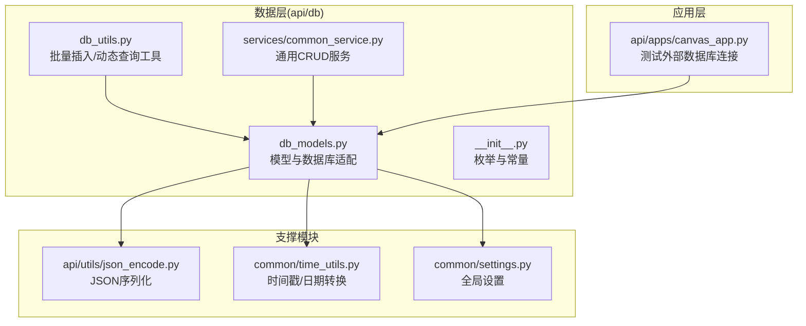
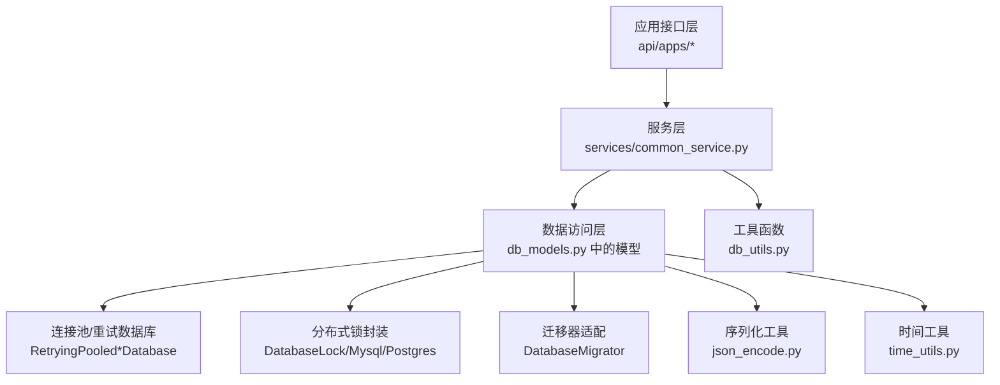
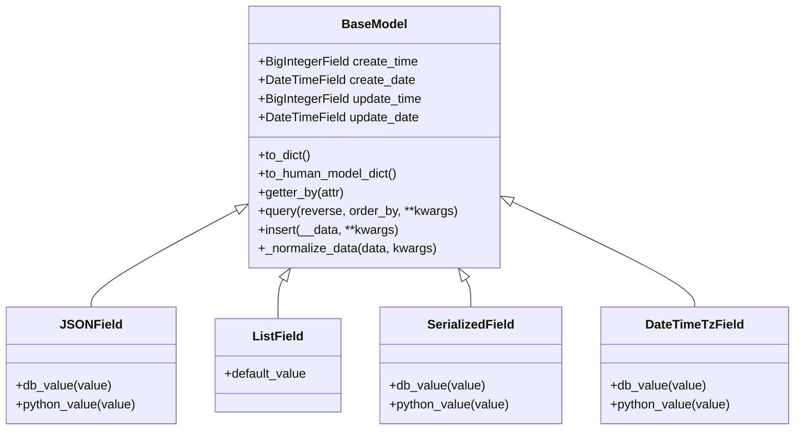
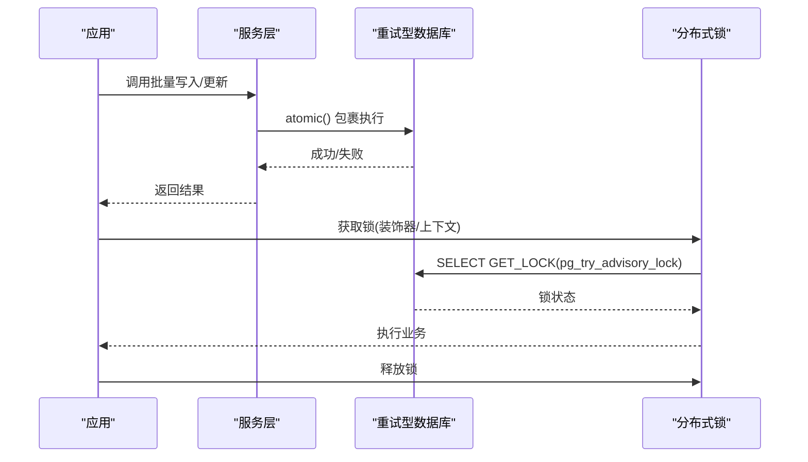
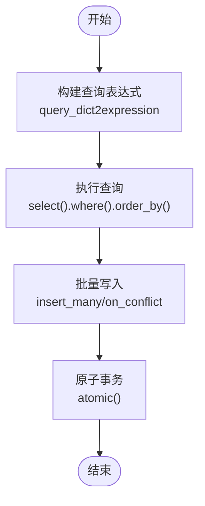
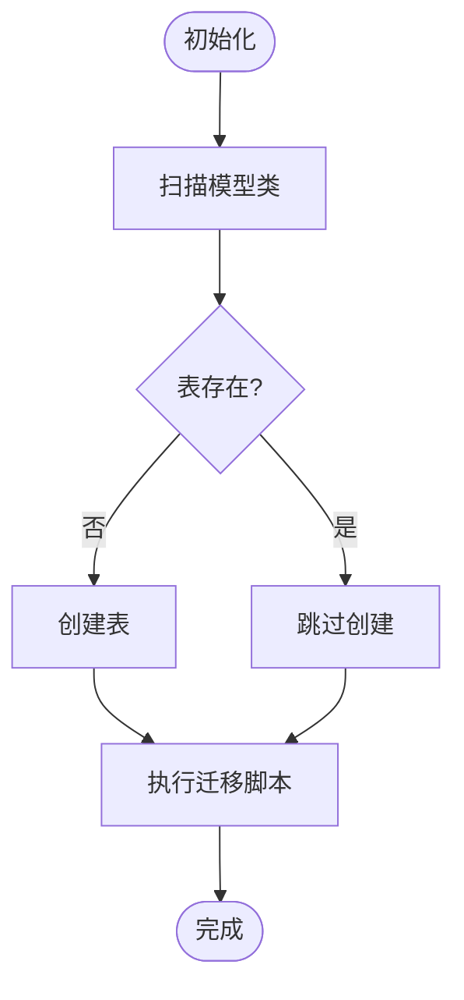
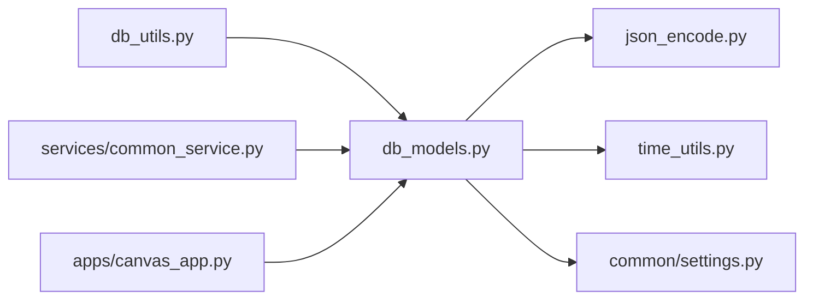

# 数据库设计与ORM

<cite>
**本文引用的文件**
- [api/db/db_models.py](file://api/db/db_models.py)
- [api/db/db_utils.py](file://api/db/db_utils.py)
- [api/db/services/common_service.py](file://api/db/services/common_service.py)
- [api/db/__init__.py](file://api/db/__init__.py)
- [api/utils/json_encode.py](file://api/utils/json_encode.py)
- [common/time_utils.py](file://common/time_utils.py)
- [common/settings.py](file://common/settings.py)
- [api/apps/canvas_app.py](file://api/apps/canvas_app.py)
</cite>

## 目录
1. [简介](#简介)
2. [项目结构](#项目结构)
3. [核心组件](#核心组件)
4. [架构总览](#架构总览)
5. [详细组件分析](#详细组件分析)
6. [依赖分析](#依赖分析)
7. [性能考虑](#性能考虑)
8. [故障排查指南](#故障排查指南)
9. [结论](#结论)
10. [附录](#附录)

## 简介
本文件面向数据库设计与ORM使用，系统性梳理项目中基于Peewee ORM的数据层设计与实现，涵盖模型定义、字段类型选择、关系映射、事务与并发控制、数据访问层模式（Repository、DTO、查询对象）、性能优化策略以及数据库迁移与版本管理最佳实践。文档以代码为依据，结合图示帮助读者快速理解并落地到实际开发中。

## 项目结构
数据层主要位于 api/db 目录，包含模型定义、工具函数、通用服务类以及枚举常量；同时配合通用工具模块完成时间戳处理、序列化编码等支撑功能。

图表来源
- [api/db/db_models.py](file://api/db/db_models.py)
- [api/db/db_utils.py](file://api/db/db_utils.py)
- [api/db/services/common_service.py](file://api/db/services/common_service.py)
- [api/db/__init__.py](file://api/db/__init__.py)
- [api/utils/json_encode.py](file://api/utils/json_encode.py)
- [common/time_utils.py](file://common/time_utils.py)
- [common/settings.py](file://common/settings.py)
- [api/apps/canvas_app.py](file://api/apps/canvas_app.py)

章节来源
- [api/db/db_models.py](file://api/db/db_models.py)
- [api/db/db_utils.py](file://api/db/db_utils.py)
- [api/db/services/common_service.py](file://api/db/services/common_service.py)
- [api/db/__init__.py](file://api/db/__init__.py)
- [api/utils/json_encode.py](file://api/utils/json_encode.py)
- [common/time_utils.py](file://common/time_utils.py)
- [common/settings.py](file://common/settings.py)
- [api/apps/canvas_app.py](file://api/apps/canvas_app.py)

## 核心组件
- 基础模型与数据库适配：统一时间戳字段、自动规范化数据、重试型连接池数据库、分布式锁封装、迁移器适配。
- 字段类型体系：JSON/列表/序列化字段、长文本字段、时区感知日期时间字段、复合主键支持。
- 通用服务层：Repository风格的CRUD封装、批量写入、条件过滤、分页与排序。
- 工具函数：批量插入、动态查询表达式构建、分页查询。
- 枚举与常量：角色、权限、序列化类型、任务类型等。

章节来源
- [api/db/db_models.py](file://api/db/db_models.py)
- [api/db/db_utils.py](file://api/db/db_utils.py)
- [api/db/services/common_service.py](file://api/db/services/common_service.py)
- [api/db/__init__.py](file://api/db/__init__.py)

## 架构总览
整体采用“模型-服务-应用”三层结构，模型负责表结构与字段语义，服务层提供Repository风格的CRUD与批量操作，应用层通过接口调用服务并返回结果。

图表来源
- [api/db/db_models.py](file://api/db/db_models.py)
- [api/db/db_utils.py](file://api/db/db_utils.py)
- [api/db/services/common_service.py](file://api/db/services/common_service.py)
- [api/utils/json_encode.py](file://api/utils/json_encode.py)
- [common/time_utils.py](file://common/time_utils.py)

## 详细组件分析

### 模型与字段设计
- 统一时间戳字段：在基础模型中提供 create_time/update_time 与 create_date/update_date 的索引字段，便于高效排序与范围查询。
- 自动规范化：在插入/更新时自动填充时间戳，并将时间戳转换为日期字段，减少业务侧重复逻辑。
- 复合主键：部分模型使用复合主键，确保唯一性与关联稳定性。
- JSON/列表/序列化字段：支持复杂结构存储，序列化类型可选JSON或Pickle，兼顾可读性与灵活性。
- 长文本字段：根据数据库类型选择合适的长文本类型，避免存储限制。
- 时区感知日期时间：提供DateTimeTzField，统一序列化/反序列化行为，避免时区问题。

图表来源
- [api/db/db_models.py](file://api/db/db_models.py)

章节来源
- [api/db/db_models.py](file://api/db/db_models.py)

### 事务与并发控制
- 连接池与重试：封装了MySQL与PostgreSQL的重试型连接池数据库，对执行异常、连接丢失进行指数退避重试，保障高可用。
- 分布式锁：提供MySQL与PostgreSQL的分布式锁封装，支持装饰器/上下文方式加解锁，用于跨进程/线程的资源互斥。
- 事务边界：批量写入与多条更新均在原子块内执行，降低并发冲突概率。

图表来源
- [api/db/db_models.py](file://api/db/db_models.py)
- [api/db/services/common_service.py](file://api/db/services/common_service.py)

章节来源
- [api/db/db_models.py](file://api/db/db_models.py)
- [api/db/services/common_service.py](file://api/db/services/common_service.py)

### 数据访问层模式
- Repository模式：CommonService提供统一的CRUD接口，屏蔽具体ORM细节，子类仅需指定model即可复用。
- DTO与查询对象：通过to_human_model_dict与query_dict2expression等方法，将人类可读字段名与查询表达式解耦，便于前端传参与后端解析。
- 批量操作：bulk_insert_into_db与insert_many支持大体量数据的高效写入，内置冲突处理与分批提交。

图表来源
- [api/db/db_utils.py](file://api/db/db_utils.py)
- [api/db/services/common_service.py](file://api/db/services/common_service.py)

章节来源
- [api/db/db_utils.py](file://api/db/db_utils.py)
- [api/db/services/common_service.py](file://api/db/services/common_service.py)

### 数据库迁移与版本管理
- 迁移器适配：根据数据库类型选择MySQL或PostgreSQL迁移器，统一迁移入口。
- 列变更：提供添加列、修改列类型、重命名列的封装，兼容重复执行场景。
- 初始化表：扫描所有继承自DataBaseModel的类，按需创建表并执行迁移脚本。

图表来源
- [api/db/db_models.py](file://api/db/db_models.py)

章节来源
- [api/db/db_models.py](file://api/db/db_models.py)

### 外部数据库连接测试
- 应用层提供测试外部数据库连接的接口，支持MySQL/MariaDB、Postgres、MSSQL、IBM DB2、Trino等类型，便于运维验证连通性。

章节来源
- [api/apps/canvas_app.py](file://api/apps/canvas_app.py)

## 依赖分析
- 模型层依赖：统一依赖于BaseModel与DataBaseModel，后者绑定DB连接；序列化依赖json_encode工具；时间依赖time_utils。
- 服务层依赖：依赖DB连接上下文与重试装饰器；批量写入依赖连接池数据库类型判断。
- 工具层依赖：查询表达式依赖运算符集合；批量写入依赖时间工具。

图表来源
- [api/db/db_models.py](file://api/db/db_models.py)
- [api/db/db_utils.py](file://api/db/db_utils.py)
- [api/db/services/common_service.py](file://api/db/services/common_service.py)
- [api/utils/json_encode.py](file://api/utils/json_encode.py)
- [common/time_utils.py](file://common/time_utils.py)
- [common/settings.py](file://common/settings.py)
- [api/apps/canvas_app.py](file://api/apps/canvas_app.py)

章节来源
- [api/db/db_models.py](file://api/db/db_models.py)
- [api/db/db_utils.py](file://api/db/db_utils.py)
- [api/db/services/common_service.py](file://api/db/services/common_service.py)
- [api/utils/json_encode.py](file://api/utils/json_encode.py)
- [common/time_utils.py](file://common/time_utils.py)
- [common/settings.py](file://common/settings.py)
- [api/apps/canvas_app.py](file://api/apps/canvas_app.py)

## 性能考虑
- 连接池与重试：合理设置最大重试次数与退避延迟，避免瞬时抖动放大；在高并发场景下建议限制单实例连接数与超时时间。
- 索引策略：基础模型已为主键与常用查询字段建立索引，建议针对高频过滤/排序字段补充复合索引。
- 查询优化：优先使用索引字段进行过滤与排序；避免N+1查询，尽量批量加载关联数据。
- 批量写入：使用insert_many与on_conflict策略减少往返开销；注意分批大小与内存占用平衡。
- 序列化成本：JSON序列化较Pickle更易维护，但体积略大；对超大对象建议压缩或拆分存储。

## 故障排查指南
- 连接丢失/超时：检查重试型数据库的max_retries与retry_delay配置；确认网络与数据库负载。
- 死锁/锁等待：使用分布式锁避免竞争；必要时调整业务顺序，减少长事务持有时间。
- 迁移失败：关注重复列/类型不匹配等错误；对不可跳过的异常记录日志并人工介入。
- 时间字段异常：确认DateTimeTzField的序列化/反序列化路径，避免时区偏差导致的排序错乱。

章节来源
- [api/db/db_models.py](file://api/db/db_models.py)
- [api/db/services/common_service.py](file://api/db/services/common_service.py)

## 结论
本项目在数据层采用了清晰的分层与抽象：以Peewee为基础，结合重试型连接池、分布式锁与统一模型规范，实现了稳定可靠的数据库访问能力。通过Repository风格的服务层与工具函数，进一步降低了业务复杂度。配合完善的迁移与版本管理机制，能够满足生产环境的演进需求。建议在后续实践中持续完善索引策略、监控与告警，以获得更优的性能与可观测性。

## 附录
- 关键枚举与常量：用户角色、租户权限、序列化类型、文件类型、画布分类、流水线任务类型等，便于在模型与服务层统一使用。
- 最佳实践清单
  - 明确主键与外键约束，必要时引入复合主键保证一致性。
  - 对高频字段建立索引，避免全表扫描。
  - 使用批量写入与原子事务，减少锁竞争。
  - 采用JSON/序列化字段存储半结构化数据，注意版本兼容。
  - 通过迁移器统一管理结构变更，保留幂等与可回滚能力。

章节来源
- [api/db/__init__.py](file://api/db/__init__.py)