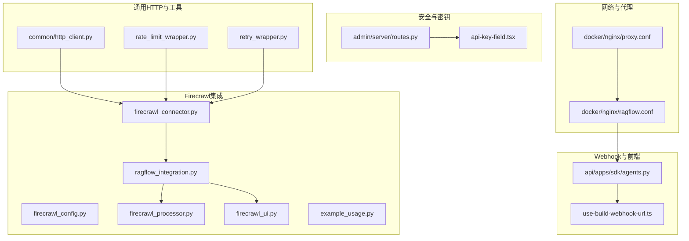
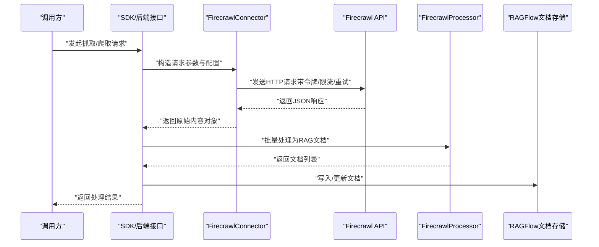
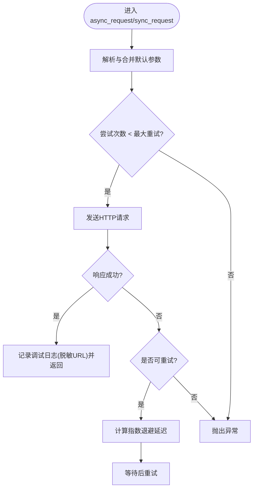
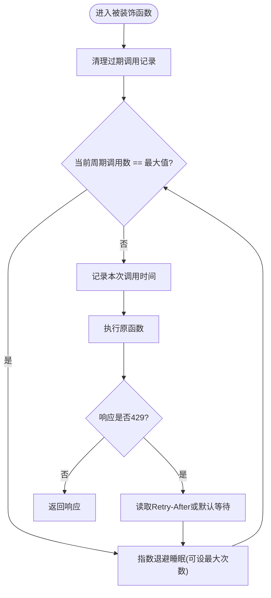
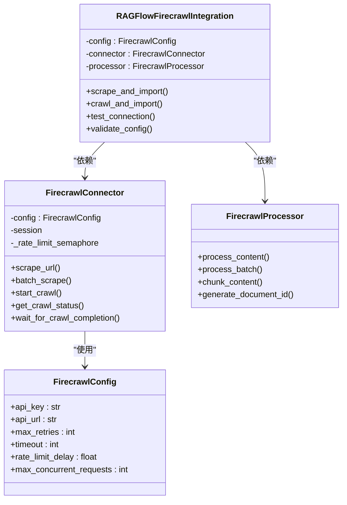
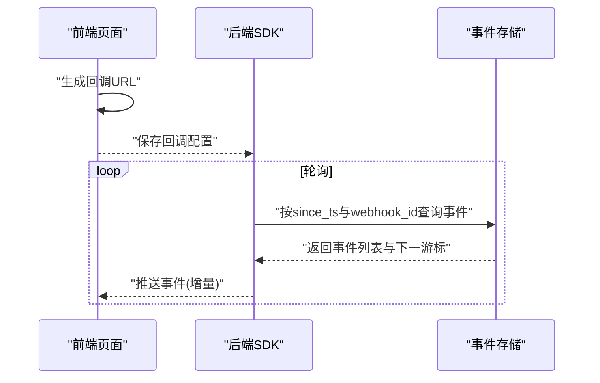
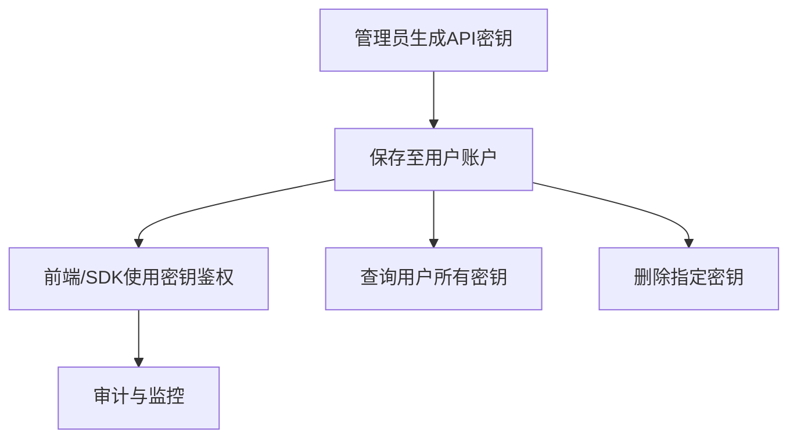
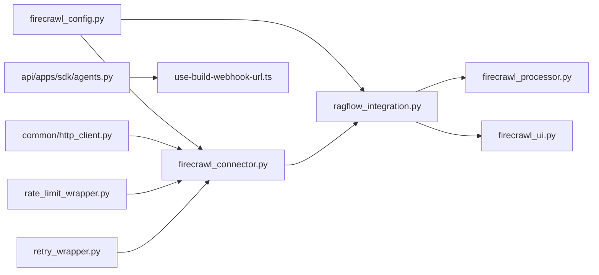

# API集成

<cite>
**本文引用的文件**
- [common/http_client.py](file://common/http_client.py)
- [common/data_source/cross_connector_utils/rate_limit_wrapper.py](file://common/data_source/cross_connector_utils/rate_limit_wrapper.py)
- [common/data_source/cross_connector_utils/retry_wrapper.py](file://common/data_source/cross_connector_utils/retry_wrapper.py)
- [intergrations/firecrawl/firecrawl_connector.py](file://intergrations/firecrawl/firecrawl_connector.py)
- [intergrations/firecrawl/ragflow_integration.py](file://intergrations/firecrawl/ragflow_integration.py)
- [intergrations/firecrawl/firecrawl_config.py](file://intergrations/firecrawl/firecrawl_config.py)
- [intergrations/firecrawl/firecrawl_processor.py](file://intergrations/firecrawl/firecrawl_processor.py)
- [intergrations/firecrawl/firecrawl_ui.py](file://intergrations/firecrawl/firecrawl_ui.py)
- [intergrations/firecrawl/example_usage.py](file://intergrations/firecrawl/example_usage.py)
- [api/apps/sdk/agents.py](file://api/apps/sdk/agents.py)
- [web/src/pages/agent/hooks/use-build-webhook-url.ts](file://web/src/pages/agent/hooks/use-build-webhook-url.ts)
- [web/src/pages/agent/form/components/api-key-field.tsx](file://web/src/pages/agent/form/components/api-key-field.tsx)
- [admin/server/routes.py](file://admin/server/routes.py)
- [test/testcases/test_web_api/test_api_app/test_api_tokens.py](file://test/testcases/test_web_api/test_api_app/test_api_tokens.py)
- [test/benchmark/report.py](file://test/benchmark/report.py)
- [docker/nginx/ragflow.conf](file://docker/nginx/ragflow.conf)
- [docker/nginx/proxy.conf](file://docker/nginx/proxy.conf)
- [common/settings.py](file://common/settings.py)
</cite>

## 目录
1. [简介](#简介)
2. [项目结构](#项目结构)
3. [核心组件](#核心组件)
4. [架构总览](#架构总览)
5. [详细组件分析](#详细组件分析)
6. [依赖分析](#依赖分析)
7. [性能考量](#性能考量)
8. [故障排查指南](#故障排查指南)
9. [结论](#结论)
10. [附录](#附录)

## 简介
本指南面向开发者，系统化讲解RAGFlow中的API集成功能与最佳实践，覆盖以下主题：
- HTTP客户端设计与实现：请求构建、响应处理、错误管理、日志脱敏与安全
- 速率限制与重试机制：指数退避、并发控制、服务端限流适配
- 性能优化：超时设置、连接池、请求压缩、缓存策略
- 第三方API集成案例：Firecrawl网页抓取与导入流程
- Webhook与事件通知：回调URL、事件过滤、幂等性
- 安全考虑：API密钥管理、请求签名、数据加密
- 测试与监控：接口基准测试、错误统计与报告

## 项目结构
围绕API集成的关键目录与文件如下：
- 通用HTTP客户端与工具：common/http_client.py、common/data_source/cross_connector_utils/*
- Firecrawl集成：intergrations/firecrawl/*
- Webhook与前端：api/apps/sdk/agents.py、web/src/pages/agent/*
- 安全与密钥管理：admin/server/routes.py、web/src/pages/agent/form/components/api-key-field.tsx
- 基准测试与监控：test/benchmark/report.py
- 反向代理与网络层：docker/nginx/*

**图表来源**
- [common/http_client.py:1-258](file://common/http_client.py#L1-L258)
- [common/data_source/cross_connector_utils/rate_limit_wrapper.py:1-126](file://common/data_source/cross_connector_utils/rate_limit_wrapper.py#L1-L126)
- [common/data_source/cross_connector_utils/retry_wrapper.py:1-88](file://common/data_source/cross_connector_utils/retry_wrapper.py#L1-L88)
- [intergrations/firecrawl/firecrawl_connector.py:1-263](file://intergrations/firecrawl/firecrawl_connector.py#L1-L263)
- [intergrations/firecrawl/ragflow_integration.py:1-176](file://intergrations/firecrawl/ragflow_integration.py#L1-L176)
- [intergrations/firecrawl/firecrawl_config.py:1-80](file://intergrations/firecrawl/firecrawl_config.py#L1-L80)
- [intergrations/firecrawl/firecrawl_processor.py:1-276](file://intergrations/firecrawl/firecrawl_processor.py#L1-L276)
- [intergrations/firecrawl/firecrawl_ui.py:1-260](file://intergrations/firecrawl/firecrawl_ui.py#L1-L260)
- [intergrations/firecrawl/example_usage.py:1-262](file://intergrations/firecrawl/example_usage.py#L1-L262)
- [api/apps/sdk/agents.py:860-910](file://api/apps/sdk/agents.py#L860-L910)
- [web/src/pages/agent/hooks/use-build-webhook-url.ts:1-8](file://web/src/pages/agent/hooks/use-build-webhook-url.ts#L1-L8)
- [admin/server/routes.py:505-541](file://admin/server/routes.py#L505-L541)
- [web/src/pages/agent/form/components/api-key-field.tsx:1-32](file://web/src/pages/agent/form/components/api-key-field.tsx#L1-L32)
- [docker/nginx/ragflow.conf:1-34](file://docker/nginx/ragflow.conf#L1-L34)
- [docker/nginx/proxy.conf:1-12](file://docker/nginx/proxy.conf#L1-L12)

**章节来源**
- [common/http_client.py:1-258](file://common/http_client.py#L1-L258)
- [intergrations/firecrawl/firecrawl_connector.py:1-263](file://intergrations/firecrawl/firecrawl_connector.py#L1-L263)
- [api/apps/sdk/agents.py:860-910](file://api/apps/sdk/agents.py#L860-L910)

## 核心组件
- 通用异步/同步HTTP客户端：提供默认超时、重定向、代理、重试与指数退避、敏感URL脱敏日志等能力
- 速率限制与重试工具：装饰器与包装器，支持周期内最大调用数、指数退避、服务端429响应处理
- Firecrawl集成：连接器、处理器、UI、配置与示例使用，覆盖单URL抓取、批量抓取、网站爬取、结果处理与分块
- Webhook与事件：后端SDK中对webhook事件轮询与过滤，前端生成回调URL
- 安全与密钥：管理员端API密钥生成、查询、删除；前端表单字段与权限控制
- 性能与监控：反向代理压缩与缓冲配置；基准测试报告输出

**章节来源**
- [common/http_client.py:119-244](file://common/http_client.py#L119-L244)
- [common/data_source/cross_connector_utils/rate_limit_wrapper.py:18-126](file://common/data_source/cross_connector_utils/rate_limit_wrapper.py#L18-L126)
- [common/data_source/cross_connector_utils/retry_wrapper.py:16-88](file://common/data_source/cross_connector_utils/retry_wrapper.py#L16-L88)
- [intergrations/firecrawl/ragflow_integration.py:15-176](file://intergrations/firecrawl/ragflow_integration.py#L15-L176)
- [intergrations/firecrawl/firecrawl_processor.py:32-276](file://intergrations/firecrawl/firecrawl_processor.py#L32-L276)
- [api/apps/sdk/agents.py:860-910](file://api/apps/sdk/agents.py#L860-L910)
- [admin/server/routes.py:505-541](file://admin/server/routes.py#L505-L541)

## 架构总览
下图展示从RAGFlow到外部服务（以Firecrawl为例）的完整调用链路，以及Webhook事件在系统内的流转。

**图表来源**
- [intergrations/firecrawl/ragflow_integration.py:25-64](file://intergrations/firecrawl/ragflow_integration.py#L25-L64)
- [intergrations/firecrawl/firecrawl_connector.py:79-106](file://intergrations/firecrawl/firecrawl_connector.py#L79-L106)
- [intergrations/firecrawl/firecrawl_processor.py:188-200](file://intergrations/firecrawl/firecrawl_processor.py#L188-L200)

## 详细组件分析

### HTTP客户端与错误管理
- 设计要点
  - 默认超时、重定向、最大重定向次数、最大重试次数、回退因子、代理、User-Agent
  - 同步与异步双实现，统一参数与行为
  - 敏感URL参数脱敏与OAuth端点识别，避免日志泄露
  - 指数退避延迟计算
- 错误处理
  - 请求异常捕获并记录，达到最大重试后抛出
  - 非敏感URL时记录状态码与耗时，敏感URL仅记录占位信息

**图表来源**
- [common/http_client.py:119-184](file://common/http_client.py#L119-L184)
- [common/http_client.py:187-244](file://common/http_client.py#L187-L244)

**章节来源**
- [common/http_client.py:27-36](file://common/http_client.py#L27-L36)
- [common/http_client.py:58-88](file://common/http_client.py#L58-L88)
- [common/http_client.py:119-184](file://common/http_client.py#L119-L184)
- [common/http_client.py:187-244](file://common/http_client.py#L187-L244)

### 速率限制与重试机制
- 通用速率限制
  - 周期内最大调用数、指数退避睡眠、最大睡眠次数
  - 429场景自动读取Retry-After或默认等待时间
- 重试包装器
  - 支持最大重试、基础延迟、最大延迟、回退因子、抖动
  - 统一日志记录与异常抛出

**图表来源**
- [common/data_source/cross_connector_utils/rate_limit_wrapper.py:18-114](file://common/data_source/cross_connector_utils/rate_limit_wrapper.py#L18-L114)
- [common/data_source/cross_connector_utils/retry_wrapper.py:16-88](file://common/data_source/cross_connector_utils/retry_wrapper.py#L16-L88)

**章节来源**
- [common/data_source/cross_connector_utils/rate_limit_wrapper.py:18-114](file://common/data_source/cross_connector_utils/rate_limit_wrapper.py#L18-L114)
- [common/data_source/cross_connector_utils/retry_wrapper.py:16-88](file://common/data_source/cross_connector_utils/retry_wrapper.py#L16-L88)

### Firecrawl集成实现
- 连接器
  - aiohttp会话、Bearer令牌、User-Agent、ClientTimeout
  - 信号量并发控制、固定延迟限流、429指数退避重试
  - 单URL抓取、批量抓取、启动/查询/等待爬取任务
- 处理器
  - 清洗内容、提取标题/描述/语言、生成文档ID、构建元数据
  - 将多格式内容转为RAGFlow文档，支持分块策略
- 集成入口
  - 批量抓取与导入、网站爬取与导入、UI Schema、配置校验、连通性测试
- 示例
  - 展示单URL、批量、内容分块、错误处理与配置校验

**图表来源**
- [intergrations/firecrawl/firecrawl_config.py:11-80](file://intergrations/firecrawl/firecrawl_config.py#L11-L80)
- [intergrations/firecrawl/firecrawl_connector.py:41-263](file://intergrations/firecrawl/firecrawl_connector.py#L41-L263)
- [intergrations/firecrawl/firecrawl_processor.py:32-276](file://intergrations/firecrawl/firecrawl_processor.py#L32-L276)
- [intergrations/firecrawl/ragflow_integration.py:15-176](file://intergrations/firecrawl/ragflow_integration.py#L15-L176)

**章节来源**
- [intergrations/firecrawl/firecrawl_connector.py:41-263](file://intergrations/firecrawl/firecrawl_connector.py#L41-L263)
- [intergrations/firecrawl/firecrawl_processor.py:32-276](file://intergrations/firecrawl/firecrawl_processor.py#L32-L276)
- [intergrations/firecrawl/ragflow_integration.py:15-176](file://intergrations/firecrawl/ragflow_integration.py#L15-L176)
- [intergrations/firecrawl/example_usage.py:12-262](file://intergrations/firecrawl/example_usage.py#L12-L262)

### Webhook与事件通知
- 回调URL生成：前端根据当前主机与路径动态拼装Webhook地址
- 事件轮询：后端SDK按时间戳与webhook ID轮询事件，支持过滤与完成标记
- 安全与鉴权：前端表单支持多种鉴权方式与执行模式，便于配置回调安全策略

**图表来源**
- [web/src/pages/agent/hooks/use-build-webhook-url.ts:3-7](file://web/src/pages/agent/hooks/use-build-webhook-url.ts#L3-L7)
- [api/apps/sdk/agents.py:860-910](file://api/apps/sdk/agents.py#L860-L910)

**章节来源**
- [web/src/pages/agent/hooks/use-build-webhook-url.ts:1-8](file://web/src/pages/agent/hooks/use-build-webhook-url.ts#L1-L8)
- [api/apps/sdk/agents.py:860-910](file://api/apps/sdk/agents.py#L860-L910)

### 安全与API密钥管理
- 密钥生命周期：管理员端支持生成、查询、删除用户API密钥
- 前端输入：密码域输入API Key，配合权限与鉴权策略
- 系统级安全：全局密钥生成与配置加载，结合认证开关

**图表来源**
- [admin/server/routes.py:505-541](file://admin/server/routes.py#L505-L541)
- [web/src/pages/agent/form/components/api-key-field.tsx:15-31](file://web/src/pages/agent/form/components/api-key-field.tsx#L15-L31)

**章节来源**
- [admin/server/routes.py:505-541](file://admin/server/routes.py#L505-L541)
- [web/src/pages/agent/form/components/api-key-field.tsx:1-32](file://web/src/pages/agent/form/components/api-key-field.tsx#L1-L32)
- [test/testcases/test_web_api/test_api_app/test_api_tokens.py:33-61](file://test/testcases/test_web_api/test_api_app/test_api_tokens.py#L33-L61)

## 依赖分析
- Firecrawl集成依赖于配置、连接器、处理器与UI模块，形成清晰的分层
- 通用HTTP客户端与速率限制/重试工具可复用于其他外部服务接入
- Webhook事件处理依赖后端SDK与前端URL生成逻辑

**图表来源**
- [intergrations/firecrawl/firecrawl_config.py:11-80](file://intergrations/firecrawl/firecrawl_config.py#L11-L80)
- [intergrations/firecrawl/firecrawl_connector.py:41-263](file://intergrations/firecrawl/firecrawl_connector.py#L41-L263)
- [intergrations/firecrawl/ragflow_integration.py:15-176](file://intergrations/firecrawl/ragflow_integration.py#L15-L176)
- [intergrations/firecrawl/firecrawl_processor.py:32-276](file://intergrations/firecrawl/firecrawl_processor.py#L32-L276)
- [intergrations/firecrawl/firecrawl_ui.py:18-260](file://intergrations/firecrawl/firecrawl_ui.py#L18-L260)
- [common/http_client.py:119-244](file://common/http_client.py#L119-L244)
- [common/data_source/cross_connector_utils/rate_limit_wrapper.py:18-114](file://common/data_source/cross_connector_utils/rate_limit_wrapper.py#L18-L114)
- [common/data_source/cross_connector_utils/retry_wrapper.py:16-88](file://common/data_source/cross_connector_utils/retry_wrapper.py#L16-L88)
- [api/apps/sdk/agents.py:860-910](file://api/apps/sdk/agents.py#L860-L910)
- [web/src/pages/agent/hooks/use-build-webhook-url.ts:1-8](file://web/src/pages/agent/hooks/use-build-webhook-url.ts#L1-L8)

**章节来源**
- [intergrations/firecrawl/firecrawl_connector.py:41-263](file://intergrations/firecrawl/firecrawl_connector.py#L41-L263)
- [intergrations/firecrawl/ragflow_integration.py:15-176](file://intergrations/firecrawl/ragflow_integration.py#L15-L176)
- [common/http_client.py:119-244](file://common/http_client.py#L119-L244)

## 性能考量
- 超时与重试
  - 使用通用HTTP客户端默认超时与指数退避，避免雪崩效应
  - 对外部服务建议在上层增加业务级超时与熔断策略
- 并发控制
  - Firecrawl连接器采用信号量限制并发，避免触发外部限流
  - 速率限制延迟可调，平衡吞吐与合规
- 连接池与代理
  - 反向代理开启gzip压缩与缓冲，提升静态资源与长连接传输效率
  - 代理层设置较长读写超时，适配长任务与大文件
- 缓存策略
  - 结果缓存与去重（如文档ID生成）减少重复抓取
  - 文档分块策略可结合检索需求调整块大小与重叠

**章节来源**
- [common/http_client.py:27-36](file://common/http_client.py#L27-L36)
- [intergrations/firecrawl/firecrawl_connector.py:48-49](file://intergrations/firecrawl/firecrawl_connector.py#L48-L49)
- [intergrations/firecrawl/firecrawl_processor.py:202-259](file://intergrations/firecrawl/firecrawl_processor.py#L202-L259)
- [docker/nginx/ragflow.conf:6-11](file://docker/nginx/ragflow.conf#L6-L11)
- [docker/nginx/proxy.conf:7-11](file://docker/nginx/proxy.conf#L7-L11)

## 故障排查指南
- HTTP客户端常见问题
  - 日志脱敏：确认敏感URL不会泄露参数，必要时使用脱敏URL
  - 重试失败：检查最大重试次数与回退因子，定位网络波动或外部服务异常
- Firecrawl集成
  - 连接测试：通过连通性测试快速判断API Key与服务可用性
  - 爬取失败：关注429与指数退避，适当提高rate_limit_delay或降低并发
  - 内容处理：清洗与分块失败时，检查内容格式与正则表达式
- Webhook事件
  - 回调URL：确认前端生成逻辑与部署域名一致
  - 事件缺失：检查轮询起始时间戳与webhook ID映射
- 安全与密钥
  - 密钥管理：通过管理员接口验证生成/删除流程
  - 鉴权失败：核对前端表单字段与后端鉴权策略

**章节来源**
- [common/http_client.py:58-88](file://common/http_client.py#L58-L88)
- [intergrations/firecrawl/ragflow_integration.py:114-141](file://intergrations/firecrawl/ragflow_integration.py#L114-L141)
- [intergrations/firecrawl/firecrawl_connector.py:87-105](file://intergrations/firecrawl/firecrawl_connector.py#L87-L105)
- [api/apps/sdk/agents.py:860-910](file://api/apps/sdk/agents.py#L860-L910)
- [admin/server/routes.py:505-541](file://admin/server/routes.py#L505-L541)
- [web/src/pages/agent/form/components/api-key-field.tsx:15-31](file://web/src/pages/agent/form/components/api-key-field.tsx#L15-L31)

## 结论
RAGFlow的API集成功能以通用HTTP客户端为基础，辅以速率限制与重试工具，提供了稳健的外部服务接入能力。Firecrawl集成展示了从抓取、处理到导入的完整闭环，具备良好的扩展性与可维护性。结合Webhook事件机制、安全密钥管理与性能优化策略，可在生产环境中实现高可靠、高性能的API集成。

## 附录
- 开发者最佳实践清单
  - 明确超时与重试边界，避免无限重试
  - 使用信号量与固定延迟控制并发，遵守外部服务速率限制
  - 对敏感URL进行脱敏日志处理
  - 在UI层提供配置校验与帮助文案
  - 通过连通性测试与基准测试持续验证集成质量