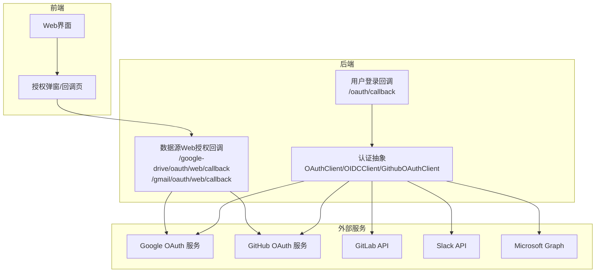
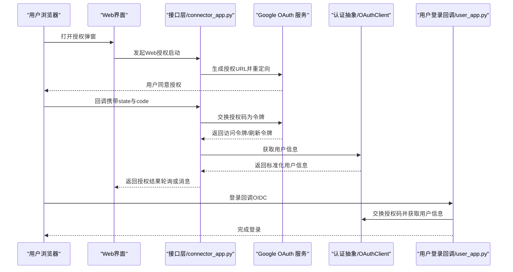
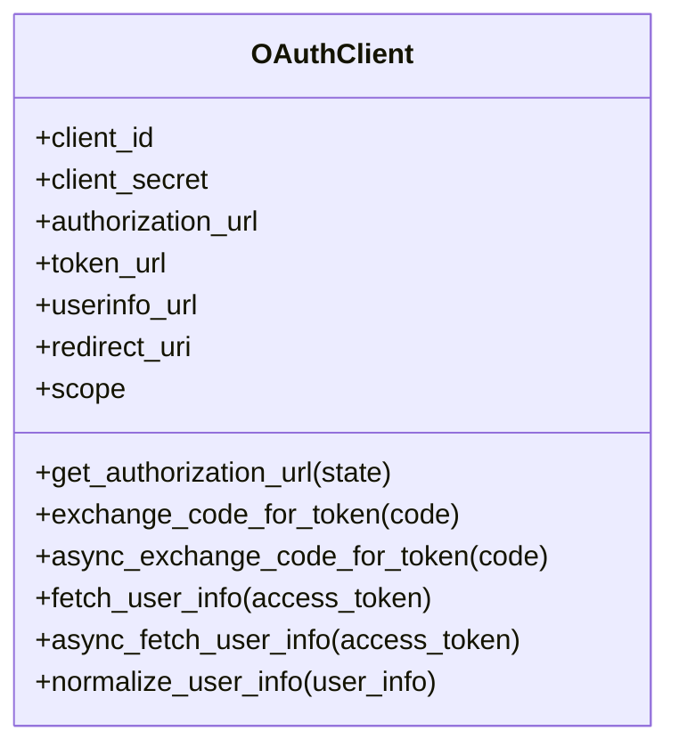
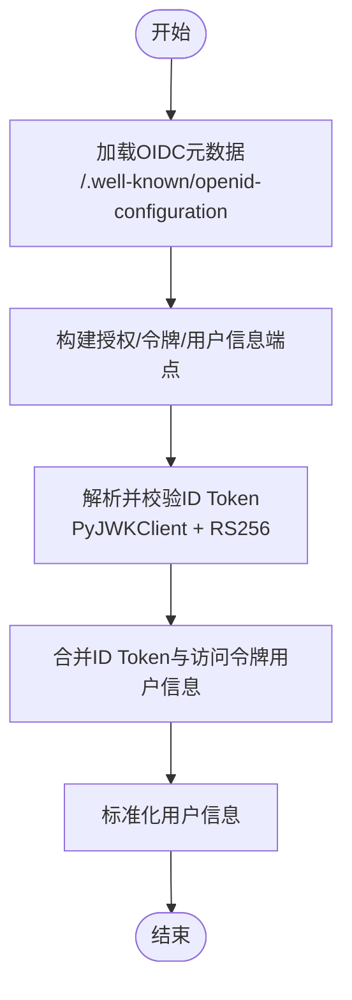
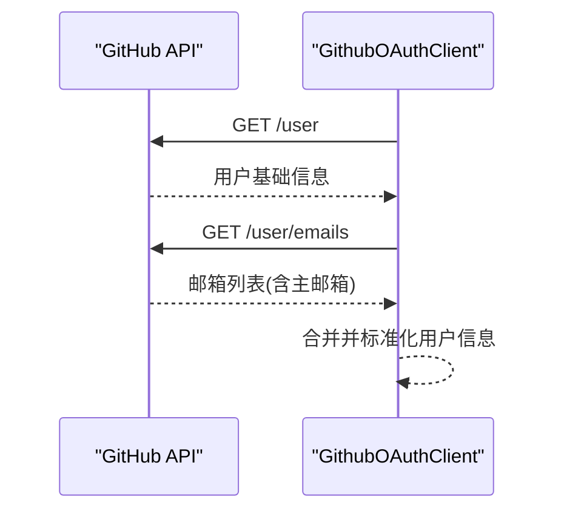
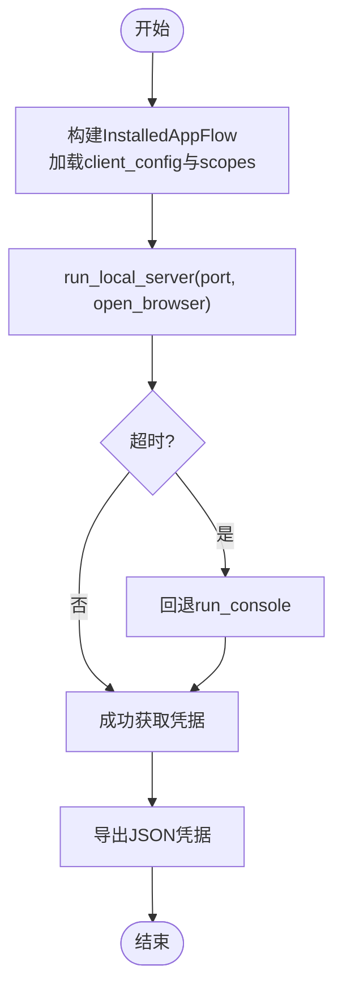
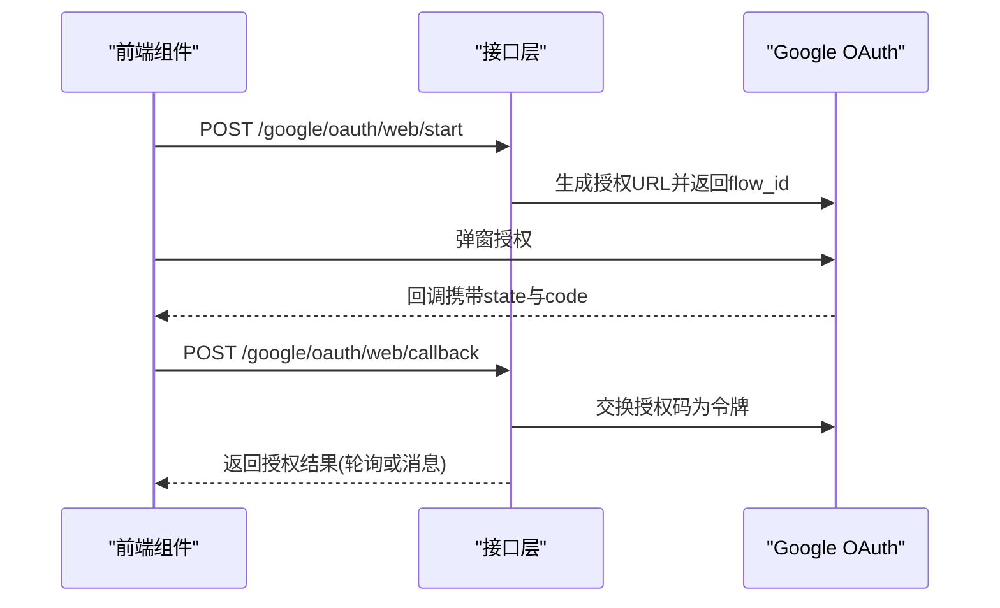
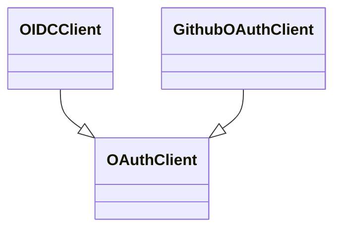

# OAuth认证与授权

<cite>
**本文引用的文件**
- [api/apps/auth/__init__.py](file://api/apps/auth/__init__.py)
- [api/apps/auth/oauth.py](file://api/apps/auth/oauth.py)
- [api/apps/auth/oidc.py](file://api/apps/auth/oidc.py)
- [api/apps/auth/github.py](file://api/apps/auth/github.py)
- [common/data_source/google_util/oauth_flow.py](file://common/data_source/google_util/oauth_flow.py)
- [api/apps/connector_app.py](file://api/apps/connector_app.py)
- [api/apps/user_app.py](file://api/apps/user_app.py)
- [test/testcases/test_web_api/test_connector_app/test_connector_oauth_contract.py](file://test/testcases/test_web_api/test_connector_app/test_connector_oauth_contract.py)
- [common/data_source/gitlab_connector.py](file://common/data_source/gitlab_connector.py)
- [common/data_source/slack_connector.py](file://common/data_source/slack_connector.py)
- [common/data_source/teams_connector.py](file://common/data_source/teams_connector.py)
- [web/src/pages/user-setting/data-source/component/google-drive-token-field.tsx](file://web/src/pages/user-setting/data-source/component/google-drive-token-field.tsx)
- [web/src/pages/user-setting/data-source/component/gmail-token-field.tsx](file://web/src/pages/user-setting/data-source/component/gmail-token-field.tsx)
- [web/src/pages/user-setting/data-source/constant/index.tsx](file://web/src/pages/user-setting/data-source/constant/index.tsx)
</cite>

## 目录
1. [简介](#简介)
2. [项目结构](#项目结构)
3. [核心组件](#核心组件)
4. [架构总览](#架构总览)
5. [详细组件分析](#详细组件分析)
6. [依赖关系分析](#依赖关系分析)
7. [性能考量](#性能考量)
8. [故障排查指南](#故障排查指南)
9. [结论](#结论)
10. [附录](#附录)

## 简介
本文件系统性梳理 RAGFlow 中的 OAuth 认证与授权机制，覆盖以下方面：
- OAuth 2.0 协议在系统中的实现：授权码流程、客户端凭证流程、刷新令牌机制等核心概念
- Google OAuth 的实现细节：认证流程、令牌管理、作用域控制
- GitHub、GitLab、Bitbucket 等代码托管平台的 OAuth 集成方案及差异
- Microsoft Teams 和 Slack 等企业协作平台的 OAuth 实现与权限配置
- 安全最佳实践：令牌存储、传输加密、权限最小化
- 调试方法与常见问题解决方案

## 项目结构
RAGFlow 的 OAuth 相关能力主要分布在如下模块：
- 后端认证抽象与通用客户端：api/apps/auth
- 平台特定实现：GitHub、OIDC（自动发现）
- 数据源侧的 OAuth 流程：Google 本地服务器流、GitLab 私有令牌、Slack Bot Token、Teams 应用凭据
- Web 前端交互：弹窗授权、状态轮询、结果回传
- 接口层：用户登录回调、数据源 Web 授权回调

**图表来源**
- [api/apps/auth/oauth.py:31-152](file://api/apps/auth/oauth.py#L31-L152)
- [api/apps/auth/oidc.py:22-108](file://api/apps/auth/oidc.py#L22-L108)
- [api/apps/auth/github.py:21-89](file://api/apps/auth/github.py#L21-L89)
- [api/apps/user_app.py:192-228](file://api/apps/user_app.py#L192-L228)
- [api/apps/connector_app.py:202-374](file://api/apps/connector_app.py#L202-L374)

**章节来源**
- [api/apps/auth/__init__.py:17-40](file://api/apps/auth/__init__.py#L17-L40)
- [api/apps/auth/oauth.py:31-152](file://api/apps/auth/oauth.py#L31-L152)
- [api/apps/auth/oidc.py:22-108](file://api/apps/auth/oidc.py#L22-L108)
- [api/apps/auth/github.py:21-89](file://api/apps/auth/github.py#L21-L89)
- [api/apps/connector_app.py:202-374](file://api/apps/connector_app.py#L202-L374)
- [api/apps/user_app.py:192-228](file://api/apps/user_app.py#L192-L228)

## 核心组件
- OAuthClient：统一的 OAuth 2.0 客户端抽象，支持授权码交换、用户信息获取、用户信息标准化
- OIDCClient：基于 OAuthClient 扩展，支持 OIDC 元数据发现、ID Token 解析与校验
- GithubOAuthClient：针对 GitHub 的适配，处理多邮箱场景与用户名规范化
- Google OAuth 流程：本地服务器流、超时控制、浏览器/控制台回退策略
- 数据源连接器：GitLab 私有令牌、Slack Bot Token、Teams 应用凭据

**章节来源**
- [api/apps/auth/oauth.py:21-152](file://api/apps/auth/oauth.py#L21-L152)
- [api/apps/auth/oidc.py:22-108](file://api/apps/auth/oidc.py#L22-L108)
- [api/apps/auth/github.py:21-89](file://api/apps/auth/github.py#L21-L89)
- [common/data_source/google_util/oauth_flow.py:52-122](file://common/data_source/google_util/oauth_flow.py#L52-L122)
- [common/data_source/gitlab_connector.py:181-185](file://common/data_source/gitlab_connector.py#L181-L185)
- [common/data_source/slack_connector.py:497-527](file://common/data_source/slack_connector.py#L497-L527)
- [common/data_source/teams_connector.py:37-65](file://common/data_source/teams_connector.py#L37-L65)

## 架构总览
下图展示从用户发起授权到后端完成令牌交换与用户信息获取的整体流程。

**图表来源**
- [api/apps/connector_app.py:202-374](file://api/apps/connector_app.py#L202-L374)
- [api/apps/user_app.py:192-228](file://api/apps/user_app.py#L192-L228)
- [api/apps/auth/oauth.py:65-126](file://api/apps/auth/oauth.py#L65-L126)
- [api/apps/auth/oidc.py:88-103](file://api/apps/auth/oidc.py#L88-L103)

## 详细组件分析

### OAuthClient 抽象与流程
- 授权 URL 生成：拼接 client_id、redirect_uri、response_type、可选 scope 与 state
- 授权码交换：使用 authorization_code + client_id + client_secret + redirect_uri 请求令牌端点
- 用户信息获取：以 Bearer 方式请求 userinfo 端点，随后进行标准化（邮箱、用户名、昵称、头像）
- 异步版本：提供 async 变体，便于高并发场景

**图表来源**
- [api/apps/auth/oauth.py:31-152](file://api/apps/auth/oauth.py#L31-L152)

**章节来源**
- [api/apps/auth/oauth.py:48-152](file://api/apps/auth/oauth.py#L48-L152)

### OIDCClient：自动发现与ID Token校验
- 自动发现：通过 issuer 加载 /.well-known/openid-configuration，更新授权、令牌、用户信息端点与 JWKS
- ID Token 校验：使用 PyJWKClient 从 JWKS 提取签名密钥，验证签名校验、audience、issuer 等
- 用户信息合并：优先解析 ID Token 中的声明，再叠加访问令牌获取的用户信息

**图表来源**
- [api/apps/auth/oidc.py:46-108](file://api/apps/auth/oidc.py#L46-L108)

**章节来源**
- [api/apps/auth/oidc.py:22-108](file://api/apps/auth/oidc.py#L22-L108)

### GithubOAuthClient：GitHub 专用适配
- 默认 scope 与端点：使用 GitHub 授权与令牌端点，强制 user:email
- 用户信息增强：先获取用户基础信息，再请求 /user/emails 获取主邮箱
- 用户名与头像：从响应中提取 login、name、avatar_url

**图表来源**
- [api/apps/auth/github.py:35-89](file://api/apps/auth/github.py#L35-L89)

**章节来源**
- [api/apps/auth/github.py:21-89](file://api/apps/auth/github.py#L21-L89)

### Google OAuth：本地服务器流与超时控制
- 本地服务器流：使用 InstalledAppFlow 启动本地端口授权，支持自定义端口与浏览器开关
- 超时控制：线程内执行并在超时后抛出异常；支持环境变量覆盖超时时间
- 浏览器失败回退：若本地服务器失败，回退至控制台授权
- 作用域覆盖：允许通过环境变量覆盖默认作用域，避免因权限不足导致流程中断

**图表来源**
- [common/data_source/google_util/oauth_flow.py:52-122](file://common/data_source/google_util/oauth_flow.py#L52-L122)

**章节来源**
- [common/data_source/google_util/oauth_flow.py:10-122](file://common/data_source/google_util/oauth_flow.py#L10-L122)

### 数据源 OAuth 集成方案

#### GitHub
- 使用 OAuth 2.0 授权码流程，scope 为 user:email
- 用户信息通过 /user 与 /user/emails 获取并合并

**章节来源**
- [api/apps/auth/github.py:21-89](file://api/apps/auth/github.py#L21-L89)

#### GitLab
- 使用私有令牌（private_token）作为凭据，无需 OAuth
- 通过官方 SDK 进行鉴权与资源访问

**章节来源**
- [common/data_source/gitlab_connector.py:181-185](file://common/data_source/gitlab_connector.py#L181-L185)

#### Slack
- 使用 Bot Token 作为凭据，无需 OAuth
- 通过 WebClient 进行 API 调用与权限校验

**章节来源**
- [common/data_source/slack_connector.py:497-527](file://common/data_source/slack_connector.py#L497-L527)

#### Microsoft Teams
- 使用 MSAL Confidentail Client，通过 client_id + client_secret + tenant_id 获取访问令牌
- 使用 Office365 Graph Client 进行资源访问

**章节来源**
- [common/data_source/teams_connector.py:37-65](file://common/data_source/teams_connector.py#L37-L65)

### Web 授权回调与前端交互
- 接口层：/google-drive/oauth/web/callback 与 /gmail/oauth/web/callback 处理授权回调，校验 state，交换授权码并缓存结果
- 前端：弹窗授权完成后，通过 postMessage 或轮询方式获取授权结果
- 用户登录回调：/oauth/callback 在 OIDC 模式下解析 ID Token 并完成登录

**图表来源**
- [api/apps/connector_app.py:202-374](file://api/apps/connector_app.py#L202-L374)
- [web/src/pages/user-setting/data-source/component/google-drive-token-field.tsx:146-174](file://web/src/pages/user-setting/data-source/component/google-drive-token-field.tsx#L146-L174)
- [web/src/pages/user-setting/data-source/component/gmail-token-field.tsx:149-174](file://web/src/pages/user-setting/data-source/component/gmail-token-field.tsx#L149-L174)

**章节来源**
- [api/apps/connector_app.py:202-374](file://api/apps/connector_app.py#L202-L374)
- [web/src/pages/user-setting/data-source/component/google-drive-token-field.tsx:126-171](file://web/src/pages/user-setting/data-source/component/google-drive-token-field.tsx#L126-L171)
- [web/src/pages/user-setting/data-source/component/gmail-token-field.tsx:129-174](file://web/src/pages/user-setting/data-source/component/gmail-token-field.tsx#L129-L174)

## 依赖关系分析
- 统一入口：api/apps/auth/__init__.py 提供工厂方法，根据配置类型选择 OAuthClient、OIDCClient 或 GithubOAuthClient
- 继承关系：OIDCClient 与 GithubOAuthClient 均继承自 OAuthClient，扩展各自特性
- 外部依赖：jwt（ID Token 校验）、msal（Teams）、slack_sdk（Slack）、gitlab（GitLab）、google_auth_oauthlib（Google）

**图表来源**
- [api/apps/auth/oauth.py:31-152](file://api/apps/auth/oauth.py#L31-L152)
- [api/apps/auth/oidc.py:22-108](file://api/apps/auth/oidc.py#L22-L108)
- [api/apps/auth/github.py:21-89](file://api/apps/auth/github.py#L21-L89)

**章节来源**
- [api/apps/auth/__init__.py:22-40](file://api/apps/auth/__init__.py#L22-L40)

## 性能考量
- 异步请求：OAuthClient 提供异步变体，降低阻塞风险
- 超时控制：Google OAuth 流程支持超时控制，避免长时间占用线程
- 批量与分页：各数据源连接器采用批量与分页策略，减少网络往返
- 缓存与轮询：Web 授权结果通过 Redis 缓存，前端定时轮询，降低实时性压力

[本节为通用指导，不直接分析具体文件]

## 故障排查指南
- 授权回调缺失参数
  - 现象：回调 URL 缺少 state 或 code
  - 处理：检查 redirect_uri 配置与 state 校验逻辑
  - 参考
    - [api/apps/connector_app.py:312-359](file://api/apps/connector_app.py#L312-L359)
    - [test/testcases/test_web_api/test_connector_app/test_connector_oauth_contract.py:88-92](file://test/testcases/test_web_api/test_connector_app/test_connector_oauth_contract.py#L88-L92)

- 授权码交换失败
  - 现象：交换授权码时报错
  - 处理：确认 client_id/client_secret、redirect_uri、grant_type 正确；检查网络与外部服务可用性
  - 参考
    - [api/apps/auth/oauth.py:65-88](file://api/apps/auth/oauth.py#L65-L88)
    - [api/apps/connector_app.py:296-300](file://api/apps/connector_app.py#L296-L300)

- ID Token 校验失败
  - 现象：ID Token 解析或签名校验异常
  - 处理：确认 JWKS 可达、算法为 RS256、audience 与 issuer 匹配
  - 参考
    - [api/apps/auth/oidc.py:60-86](file://api/apps/auth/oidc.py#L60-L86)

- Google OAuth 超时
  - 现象：本地服务器流超时
  - 处理：调整超时时间、允许控制台回退、关闭浏览器弹窗尝试
  - 参考
    - [common/data_source/google_util/oauth_flow.py:20-49](file://common/data_source/google_util/oauth_flow.py#L20-L49)
    - [common/data_source/google_util/oauth_flow.py:73-96](file://common/data_source/google_util/oauth_flow.py#L73-L96)

- Slack 权限不足
  - 现象：channels:read 或 groups:read 缺失
  - 处理：在 Slack 应用中添加必要 scope 并重新授权
  - 参考
    - [common/data_source/slack_connector.py:616-621](file://common/data_source/slack_connector.py#L616-L621)

- Teams 凭据错误
  - 现象：401/403
  - 处理：核对 tenant_id、client_id、client_secret；确认应用权限
  - 参考
    - [common/data_source/teams_connector.py:57-65](file://common/data_source/teams_connector.py#L57-L65)

**章节来源**
- [api/apps/connector_app.py:312-359](file://api/apps/connector_app.py#L312-L359)
- [test/testcases/test_web_api/test_connector_app/test_connector_oauth_contract.py:88-92](file://test/testcases/test_web_api/test_connector_app/test_connector_oauth_contract.py#L88-L92)
- [api/apps/auth/oauth.py:65-88](file://api/apps/auth/oauth.py#L65-L88)
- [api/apps/auth/oidc.py:60-86](file://api/apps/auth/oidc.py#L60-L86)
- [common/data_source/google_util/oauth_flow.py:20-49](file://common/data_source/google_util/oauth_flow.py#L20-L49)
- [common/data_source/slack_connector.py:616-621](file://common/data_source/slack_connector.py#L616-L621)
- [common/data_source/teams_connector.py:57-65](file://common/data_source/teams_connector.py#L57-L65)

## 结论
RAGFlow 在后端提供了统一的 OAuth 抽象与平台适配，结合前端弹窗与回调机制，实现了从 Google、GitHub 到 Teams、Slack 等多种外部服务的安全接入。通过 OIDC 自动发现与 ID Token 校验，系统在保证安全性的同时具备良好的扩展性。建议在生产环境中严格遵循最小权限原则、启用传输加密与安全存储，并完善超时与重试策略以提升稳定性。

[本节为总结性内容，不直接分析具体文件]

## 附录

### OAuth 2.0 核心概念映射
- 授权码流程：适用于 Web 应用与需要长期有效令牌的场景
- 客户端凭证流程：适用于服务到服务调用（如 Teams 应用凭据）
- 刷新令牌机制：通过后端缓存与轮询，避免前端暴露敏感令牌

**章节来源**
- [api/apps/auth/oauth.py:65-111](file://api/apps/auth/oauth.py#L65-L111)
- [api/apps/auth/oidc.py:88-103](file://api/apps/auth/oidc.py#L88-L103)
- [common/data_source/teams_connector.py:47-61](file://common/data_source/teams_connector.py#L47-L61)

### 安全最佳实践清单
- 传输加密：所有 OAuth 通信使用 HTTPS
- 令牌存储：后端缓存令牌，前端仅持有临时状态与轮询结果
- 权限最小化：按需申请 scope，避免过度授权
- 超时与重试：合理设置超时与重试策略，防止长时间占用
- 日志与审计：记录授权关键事件，但避免输出敏感信息

[本节为通用指导，不直接分析具体文件]