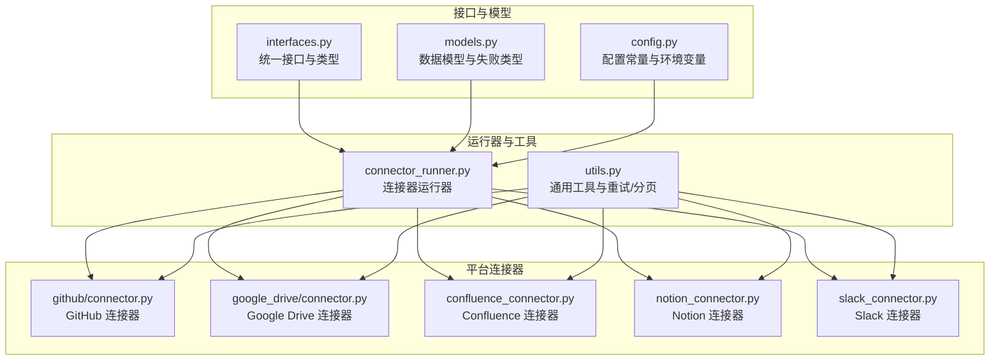
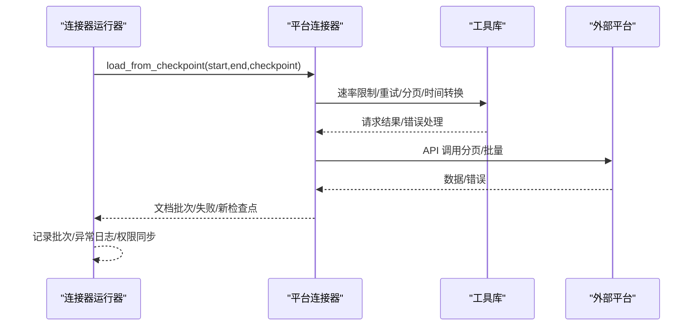
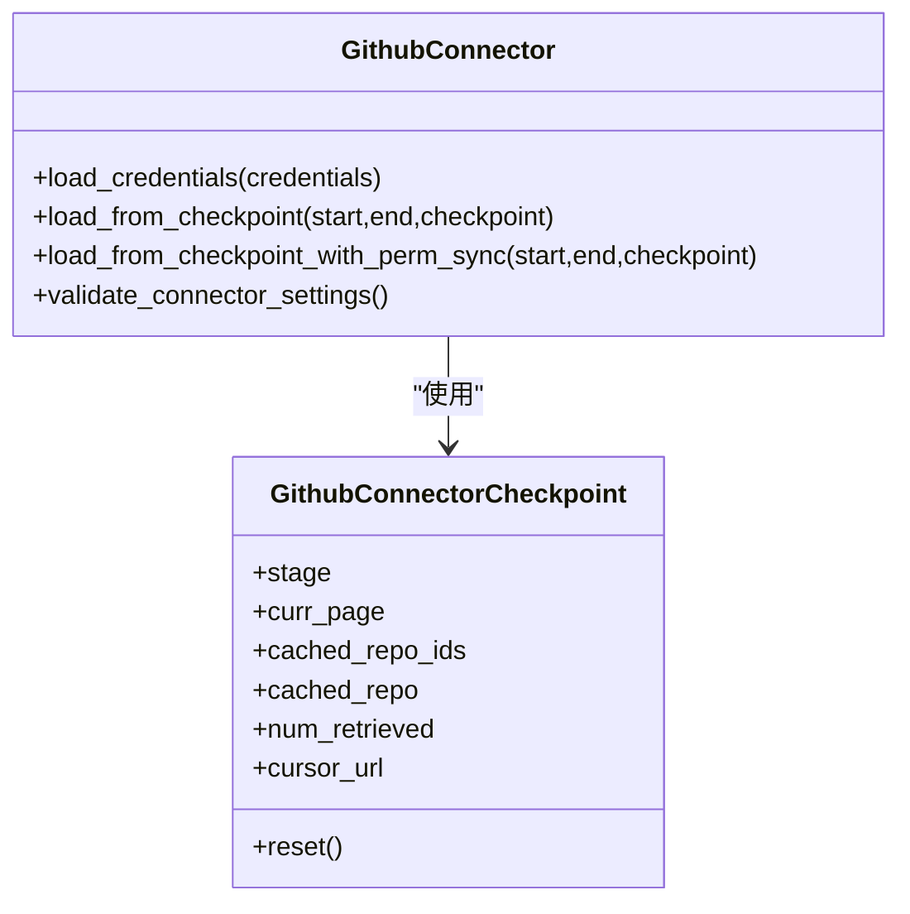
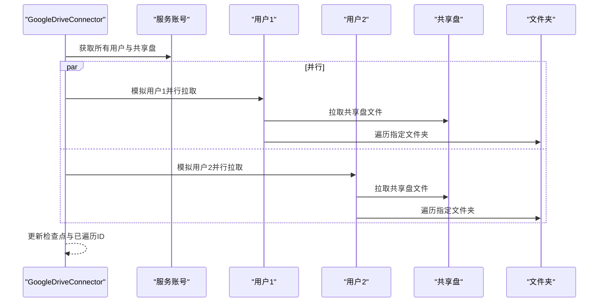
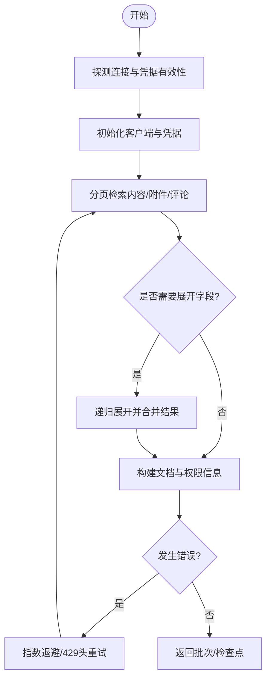
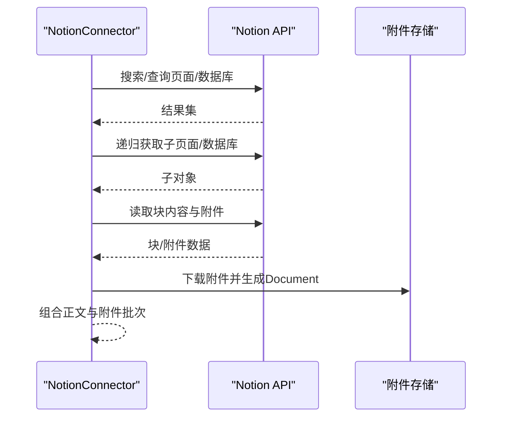
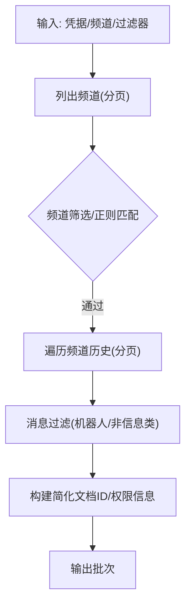
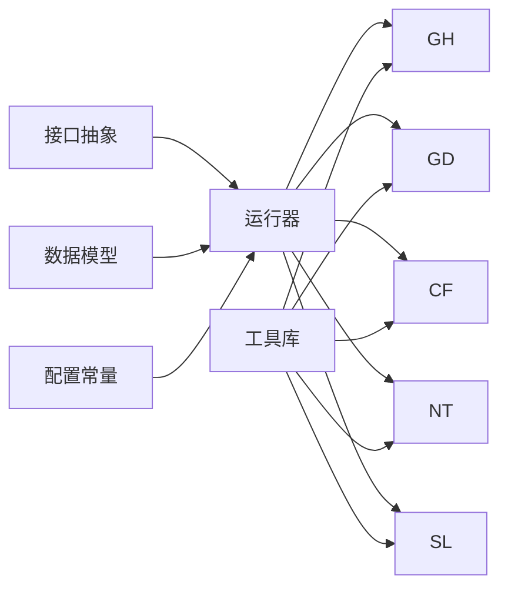

# 外部集成

<cite>
**本文引用的文件**
- [common/data_source/interfaces.py](file://common/data_source/interfaces.py)
- [common/data_source/models.py](file://common/data_source/models.py)
- [common/data_source/config.py](file://common/data_source/config.py)
- [common/data_source/connector_runner.py](file://common/data_source/connector_runner.py)
- [common/data_source/utils.py](file://common/data_source/utils.py)
- [common/data_source/github/connector.py](file://common/data_source/github/connector.py)
- [common/data_source/google_drive/connector.py](file://common/data_source/google_drive/connector.py)
- [common/data_source/confluence_connector.py](file://common/data_source/confluence_connector.py)
- [common/data_source/notion_connector.py](file://common/data_source/notion_connector.py)
- [common/data_source/slack_connector.py](file://common/data_source/slack_connector.py)
</cite>

## 目录
1. [简介](#简介)
2. [项目结构](#项目结构)
3. [核心组件](#核心组件)
4. [架构总览](#架构总览)
5. [详细组件分析](#详细组件分析)
6. [依赖关系分析](#依赖关系分析)
7. [性能考量](#性能考量)
8. [故障排查指南](#故障排查指南)
9. [结论](#结论)
10. [附录](#附录)

## 简介
本指南面向需要在系统中集成外部数据源（如 Google Drive、Confluence、Notion、GitHub、Slack 等）的开发者与运维人员。文档围绕统一接口抽象、连接池与并发控制、错误处理与重试、OAuth 授权流程、API 集成最佳实践、自定义数据源扩展、Webhook 与事件通知、以及集成测试与验证方法展开，帮助读者快速、安全、稳定地完成外部集成功能的开发与上线。

## 项目结构
外部集成功能主要集中在 common/data_source 目录下，采用“接口抽象 + 具体连接器实现 + 工具与配置”的分层组织方式：
- 接口与模型：定义统一的连接器接口、检查点、文档与失败信息等核心类型。
- 连接器运行器：封装批次化、异常日志、权限同步等通用逻辑。
- 各平台连接器：针对不同外部平台的具体实现。
- 工具与配置：统一的速率限制、重试、分页、时间转换、Blob 存储等工具函数与配置常量。

图表来源
- [common/data_source/interfaces.py:1-420](file://common/data_source/interfaces.py#L1-L420)
- [common/data_source/models.py:1-314](file://common/data_source/models.py#L1-L314)
- [common/data_source/config.py:1-303](file://common/data_source/config.py#L1-L303)
- [common/data_source/connector_runner.py:1-217](file://common/data_source/connector_runner.py#L1-L217)
- [common/data_source/utils.py:1-800](file://common/data_source/utils.py#L1-L800)
- [common/data_source/github/connector.py:1-973](file://common/data_source/github/connector.py#L1-L973)
- [common/data_source/google_drive/connector.py:1-1258](file://common/data_source/google_drive/connector.py#L1-L1258)
- [common/data_source/confluence_connector.py:1-2107](file://common/data_source/confluence_connector.py#L1-L2107)
- [common/data_source/notion_connector.py:1-656](file://common/data_source/notion_connector.py#L1-L656)
- [common/data_source/slack_connector.py:1-665](file://common/data_source/slack_connector.py#L1-L665)

章节来源
- [common/data_source/interfaces.py:1-420](file://common/data_source/interfaces.py#L1-L420)
- [common/data_source/models.py:1-314](file://common/data_source/models.py#L1-L314)
- [common/data_source/config.py:1-303](file://common/data_source/config.py#L1-L303)
- [common/data_source/connector_runner.py:1-217](file://common/data_source/connector_runner.py#L1-L217)
- [common/data_source/utils.py:1-800](file://common/data_source/utils.py#L1-L800)

## 核心组件
- 统一接口抽象
  - Load/Poll/Credentials/Slim/Checkpointed 等接口，确保不同平台连接器具备一致的生命周期与能力边界。
  - 支持权限同步接口，便于在索引过程中同步外部系统的访问控制信息。
- 检查点与批次化
  - ConnectorRunner 封装了批次化输出、异常日志、权限同步开关、时间窗口过滤等通用逻辑。
  - CheckpointOutputWrapper 将连接器返回的生成器规范化为“文档/失败/检查点”三元组输出。
- 数据模型与失败类型
  - Document、SlimDocument、ConnectorFailure 等模型，统一描述文档、简化文档与失败信息。
- 配置与常量
  - REQUEST_TIMEOUT_SECONDS、Redis 锁、各平台 API 限制、下载阈值、链接转换策略等集中配置。

章节来源
- [common/data_source/interfaces.py:21-420](file://common/data_source/interfaces.py#L21-L420)
- [common/data_source/models.py:88-155](file://common/data_source/models.py#L88-L155)
- [common/data_source/config.py:16-303](file://common/data_source/config.py#L16-L303)
- [common/data_source/connector_runner.py:91-217](file://common/data_source/connector_runner.py#L91-L217)
- [common/data_source/connector_runner.py:46-89](file://common/data_source/connector_runner.py#L46-L89)

## 架构总览
外部集成功能通过“统一接口 + 平台连接器 + 运行器 + 工具库”的架构实现，核心流程如下：
- 加载凭据与初始化：各平台连接器实现 load_credentials，读取环境变量或凭据提供器中的密钥。
- 批次化拉取：ConnectorRunner 调用连接器的 load_from_checkpoint 或 poll_source，按批次产出 Document 列表。
- 权限同步：当 include_permissions 为真时，调用带权限同步的接口，产出包含 ExternalAccess 的文档。
- 错误处理与重试：统一的速率限制与重试策略在工具库中实现，平台连接器按需使用。
- 检查点持久化：每次迭代返回新的检查点，用于断点续跑与幂等。

图表来源
- [common/data_source/connector_runner.py:119-196](file://common/data_source/connector_runner.py#L119-L196)
- [common/data_source/utils.py:109-235](file://common/data_source/utils.py#L109-L235)
- [common/data_source/github/connector.py:740-791](file://common/data_source/github/connector.py#L740-L791)
- [common/data_source/google_drive/connector.py:740-795](file://common/data_source/google_drive/connector.py#L740-L795)
- [common/data_source/confluence_connector.py:653-710](file://common/data_source/confluence_connector.py#L653-L710)
- [common/data_source/notion_connector.py:560-605](file://common/data_source/notion_connector.py#L560-L605)
- [common/data_source/slack_connector.py:545-574](file://common/data_source/slack_connector.py#L545-L574)

## 详细组件分析

### GitHub 连接器
- 功能特性
  - 支持拉取仓库的 Issue 与 Pull Request，按更新时间过滤，支持游标分页回退策略。
  - 提供权限同步能力，基于仓库级 ExternalAccess 产出文档。
  - 带有速率限制重试与异常处理，避免因 API 限额导致中断。
- 关键实现
  - CheckpointedConnectorWithPermSyncGH：实现带权限同步的检查点加载。
  - 游标分页回退：当出现“大集合不支持页参数”错误时自动切换到游标分页。
  - 速率限制处理：捕获 RateLimitExceededException 并延时重试。
- 使用建议
  - 设置 GITHUB_CONNECTOR_BASE_URL 可对接企业版 GitHub。
  - 合理设置 include_issues/include_prs 控制拉取范围。
  - 在权限同步场景下启用 include_permissions，以获得更精确的访问控制信息。

图表来源
- [common/data_source/github/connector.py:413-800](file://common/data_source/github/connector.py#L413-L800)

章节来源
- [common/data_source/github/connector.py:1-973](file://common/data_source/github/connector.py#L1-L973)

### Google Drive 连接器
- 功能特性
  - 支持共享盘、我的驱动、共享给我的文件、指定文件夹等多种拉取模式。
  - 服务账号模式下可多用户并行模拟，提升吞吐。
  - 支持权限同步，产出包含 ExternalAccess 的文档。
- 关键实现
  - CheckpointedConnectorWithPermSync：实现带权限同步的检查点加载。
  - 多阶段爬取：My Drive → Shared Drive → Folder，每个阶段维护 Completion Map。
  - 并发与限流：通过线程池与每阶段页数限制控制资源占用。
- 使用建议
  - 服务账号模式下会自动枚举组织内用户并并行拉取，注意合理设置 MAX_DRIVE_WORKERS。
  - 对于大量文件夹，建议使用“指定文件夹”模式以减少重复遍历。

图表来源
- [common/data_source/google_drive/connector.py:508-599](file://common/data_source/google_drive/connector.py#L508-L599)

章节来源
- [common/data_source/google_drive/connector.py:1-1258](file://common/data_source/google_drive/connector.py#L1-L1258)

### Confluence 连接器
- 功能特性
  - 自定义 Confluence 客户端，增强 CQL 查询与分页处理，支持云版与服务器版差异。
  - 提供凭据动态刷新与分布式锁，保障多实例下的凭据一致性。
  - 支持权限同步，基于空间与用户组构建 ExternalAccess。
- 关键实现
  - OnyxConfluence：封装认证、探测、重试与分页，自动处理 429/403 等错误。
  - 分页策略：支持偏移分页与游标分页，遇到 500 时逐条回退恢复。
  - 用户与组权限：支持从云版/服务器版获取用户与组信息，构建权限映射。
- 使用建议
  - 云版使用 OAuth Access Token，服务器版使用 Personal Access Token。
  - 合理设置 CONFLUENCE_TIMEZONE_OFFSET 与同步缓冲时间，避免漏采。

图表来源
- [common/data_source/confluence_connector.py:653-710](file://common/data_source/confluence_connector.py#L653-L710)
- [common/data_source/confluence_connector.py:498-684](file://common/data_source/confluence_connector.py#L498-L684)

章节来源
- [common/data_source/confluence_connector.py:1-2107](file://common/data_source/confluence_connector.py#L1-L2107)

### Notion 连接器
- 功能特性
  - 支持页面与数据库的递归索引，块级内容解析与富文本抽取。
  - 支持文件/图片/表格等附件下载与转存，生成 Document。
  - 提供时间窗口轮询与批量输出。
- 关键实现
  - LoadConnector/PollConnector：支持一次性加载与按时间轮询。
  - 递归索引：根据根页面或数据库递归遍历子页面与子数据库。
  - 附件处理：下载附件并生成独立 Document，同时保留正文片段。
- 使用建议
  - 开启递归索引时，建议设置根页面 ID 以控制范围。
  - 注意 Notion API 速率限制，必要时降低批量大小。

图表来源
- [common/data_source/notion_connector.py:546-605](file://common/data_source/notion_connector.py#L546-L605)

章节来源
- [common/data_source/notion_connector.py:1-656](file://common/data_source/notion_connector.py#L1-L656)

### Slack 连接器
- 功能特性
  - 支持公共/私有频道筛选、正则匹配、消息过滤（机器人/非信息类）。
  - 提供简化文档 ID 流与权限同步接口，便于快速索引。
  - 内置分页与重试策略，适配 Slack SDK 的重试处理器。
- 关键实现
  - SlimConnectorWithPermSync：提供简化文档 ID 输出。
  - 分页与过滤：统一的分页包装器与默认消息过滤规则。
  - 凭据校验：通过 auth_test 与 conversations_list 验证令牌与权限。
- 使用建议
  - 确保令牌具有 channels:read（及 groups:read 私有频道）权限。
  - 使用正则或白名单限定频道范围，避免无界扫描。

图表来源
- [common/data_source/slack_connector.py:420-460](file://common/data_source/slack_connector.py#L420-L460)
- [common/data_source/slack_connector.py:575-638](file://common/data_source/slack_connector.py#L575-L638)

章节来源
- [common/data_source/slack_connector.py:1-665](file://common/data_source/slack_connector.py#L1-L665)

## 依赖关系分析
- 组件耦合
  - 连接器实现依赖统一接口与模型，耦合度低，易于扩展新平台。
  - 运行器对具体平台无感知，仅依赖接口契约，提升复用性。
- 外部依赖
  - 各平台 SDK（如 GitHub、Slack SDK、Atlassian Confluence 客户端）。
  - 通用网络库与重试/分页工具。
- 循环依赖
  - 当前结构清晰，未发现循环导入；新增连接器应遵循接口契约，避免反向依赖。

图表来源
- [common/data_source/interfaces.py:1-420](file://common/data_source/interfaces.py#L1-L420)
- [common/data_source/models.py:1-314](file://common/data_source/models.py#L1-L314)
- [common/data_source/config.py:1-303](file://common/data_source/config.py#L1-L303)
- [common/data_source/connector_runner.py:1-217](file://common/data_source/connector_runner.py#L1-L217)
- [common/data_source/utils.py:1-800](file://common/data_source/utils.py#L1-L800)

章节来源
- [common/data_source/interfaces.py:1-420](file://common/data_source/interfaces.py#L1-L420)
- [common/data_source/connector_runner.py:1-217](file://common/data_source/connector_runner.py#L1-L217)
- [common/data_source/utils.py:1-800](file://common/data_source/utils.py#L1-L800)

## 性能考量
- 并发与限流
  - Google Drive：通过 MAX_DRIVE_WORKERS 控制并行用户数量；每阶段页数限制避免过度 API 调用。
  - GitHub：速率限制异常触发延时重试，必要时降级为游标分页。
  - Slack：内置重试处理器与快速客户端，降低首响应延迟。
- 批次化与内存
  - ConnectorRunner 将文档批次化输出，避免单批过大导致内存峰值。
  - 下载阈值与分块读取（DOWNLOAD_CHUNK_SIZE）控制大文件传输开销。
- 时间窗口与增量
  - 各连接器均支持时间窗口过滤，结合检查点实现增量同步，减少全量扫描成本。

章节来源
- [common/data_source/google_drive/connector.py:45-49](file://common/data_source/google_drive/connector.py#L45-L49)
- [common/data_source/github/connector.py:46-62](file://common/data_source/github/connector.py#L46-L62)
- [common/data_source/slack_connector.py:17-20](file://common/data_source/slack_connector.py#L17-L20)
- [common/data_source/config.py:115-118](file://common/data_source/config.py#L115-L118)
- [common/data_source/connector_runner.py:119-168](file://common/data_source/connector_runner.py#L119-L168)

## 故障排查指南
- 常见错误与定位
  - 429/Rate limit：统一通过 _handle_http_error 与 wrap_request_to_handle_ratelimiting 处理，检查 Retry-After 头与指数退避。
  - 403 Forbidden：Confluence 服务器版在限流时可能返回 403，按固定次数重试。
  - 无效/过期凭据：Slack 验证 auth_test 与 scopes；Notion/GitHub/Confluence 均提供显式校验逻辑。
  - 权限不足：Slack 缺少 channels:read；GitHub 需要仓库访问权限；Google Drive 需要 Drive API 访问。
- 日志与追踪
  - ConnectorRunner 捕获异常并记录本地变量快照，便于定位上下文。
  - 各平台连接器在关键步骤打印调试信息（如游标分页、阶段切换）。
- 解决方案
  - 速率限制：降低批量大小、增加重试间隔、启用检查点断点续跑。
  - 权限问题：核对 scopes 与共享设置；服务账号需正确配置域管理员权限。
  - 网络波动：启用 SDK 内建重试或统一的重试包装器。

章节来源
- [common/data_source/utils.py:112-158](file://common/data_source/utils.py#L112-L158)
- [common/data_source/utils.py:205-235](file://common/data_source/utils.py#L205-L235)
- [common/data_source/slack_connector.py:575-638](file://common/data_source/slack_connector.py#L575-L638)
- [common/data_source/notion_connector.py:606-645](file://common/data_source/notion_connector.py#L606-L645)
- [common/data_source/github/connector.py:793-800](file://common/data_source/github/connector.py#L793-L800)
- [common/data_source/connector_runner.py:196-217](file://common/data_source/connector_runner.py#L196-L217)

## 结论
通过统一接口抽象、严格的检查点与批次化处理、完善的错误与重试机制，以及针对各平台的专用实现，系统实现了对主流外部数据源的高效、安全与可扩展集成。建议在生产环境中结合时间窗口与权限同步，配合监控与日志，持续优化批量大小与并发策略，确保稳定与高性能。

## 附录

### OAuth 认证与授权机制
- GitHub
  - 使用个人访问令牌或自定义 base_url；支持服务端/企业版。
- Google Drive
  - 支持 OAuth 与服务账号两种模式；服务账号模式自动枚举用户并并行拉取。
- Confluence
  - 云版使用 OAuth Access Token；服务器版使用 Personal Access Token；支持动态凭据刷新与缓存。
- Notion
  - 使用 Integration Token；支持根页面递归索引。
- Slack
  - 使用 Bot Token；验证 scopes 与工作区连接。

章节来源
- [common/data_source/github/connector.py:429-446](file://common/data_source/github/connector.py#L429-L446)
- [common/data_source/google_drive/connector.py:193-213](file://common/data_source/google_drive/connector.py#L193-L213)
- [common/data_source/confluence_connector.py:126-194](file://common/data_source/confluence_connector.py#L126-L194)
- [common/data_source/notion_connector.py:555-558](file://common/data_source/notion_connector.py#L555-L558)
- [common/data_source/slack_connector.py:497-528](file://common/data_source/slack_connector.py#L497-L528)

### API 集成最佳实践
- 请求限流
  - 使用统一的速率限制与重试包装器，尊重第三方服务的 Retry-After。
- 重试机制
  - 指数退避 + 固定上限；对 429/403/网络异常分别处理。
- 超时处理
  - REQUEST_TIMEOUT_SECONDS 统一超时；SDK 快速客户端用于快速探测。
- 分页与增量
  - 统一分页包装器；结合时间窗口与检查点实现增量同步。

章节来源
- [common/data_source/config.py:16-303](file://common/data_source/config.py#L16-L303)
- [common/data_source/utils.py:109-235](file://common/data_source/utils.py#L109-L235)
- [common/data_source/connector_runner.py:119-168](file://common/data_source/connector_runner.py#L119-L168)

### 自定义数据源开发指南
- 实现步骤
  - 定义连接器类，继承统一接口（如 CheckpointedConnector、SlimConnectorWithPermSync）。
  - 实现 load_credentials、load_from_checkpoint/poll_source、validate_connector_settings。
  - 使用工具库进行分页、重试、时间转换与权限同步。
  - 在 ConnectorRunner 中注册并按批次产出 Document。
- 最佳实践
  - 明确检查点结构与阶段状态，保证幂等与断点续跑。
  - 对高风险 API 调用添加超时与重试，避免阻塞。
  - 提供详细的 validate_connector_settings，尽早暴露配置问题。

章节来源
- [common/data_source/interfaces.py:21-420](file://common/data_source/interfaces.py#L21-L420)
- [common/data_source/connector_runner.py:91-196](file://common/data_source/connector_runner.py#L91-L196)
- [common/data_source/utils.py:579-599](file://common/data_source/utils.py#L579-L599)

### Webhook 与事件通知机制
- 现状说明
  - 当前代码库未提供通用 Webhook 接收与事件路由模块。
- 建议方案
  - 在 API 层新增 Webhook 接收端点，解析事件并触发对应连接器的增量拉取。
  - 使用检查点与时间窗口确保事件去重与顺序处理。
  - 结合队列/消息中间件实现异步解耦与重试。

[本节为概念性指导，不直接对应具体源码文件]

### 集成测试与验证
- 单元测试
  - 针对分页、重试、时间转换、权限映射等关键路径编写单元测试。
- 端到端测试
  - 使用真实或模拟的第三方服务，覆盖完整拉取流程与错误分支。
- 性能压测
  - 在受控环境下调整批量大小与并发度，评估吞吐与稳定性。
- 验证清单
  - 凭据有效性、权限范围、速率限制应对、错误恢复、检查点断点续跑。

[本节为通用实践建议，不直接对应具体源码文件]