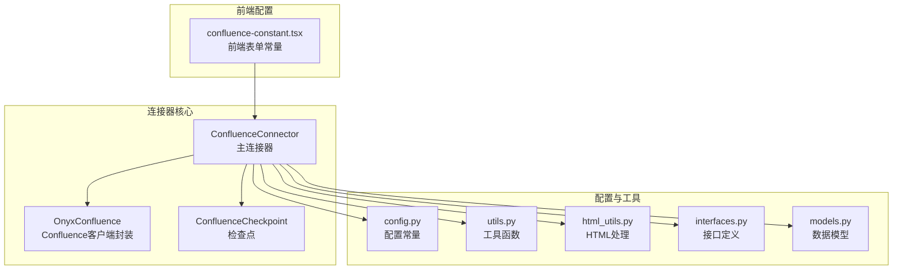
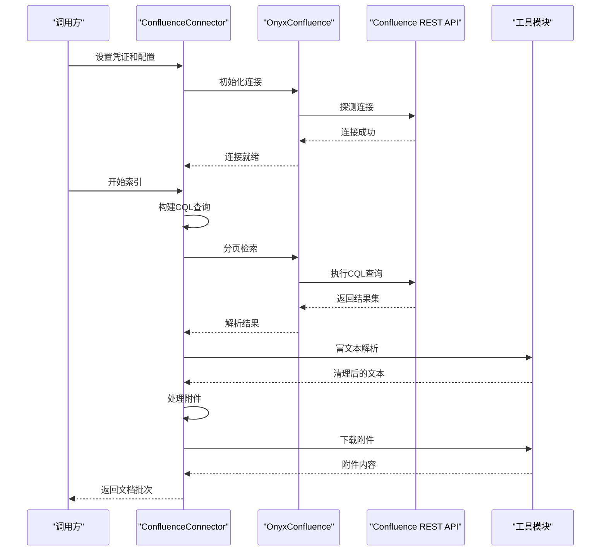
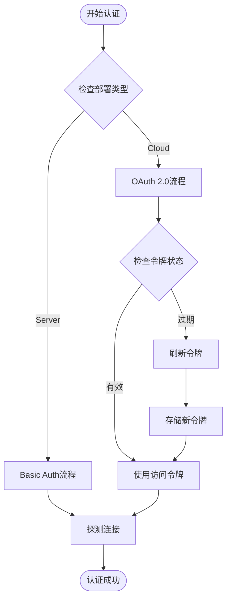
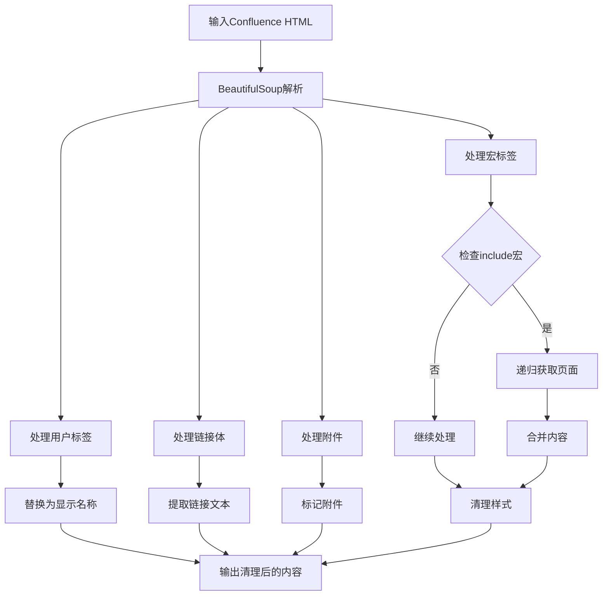
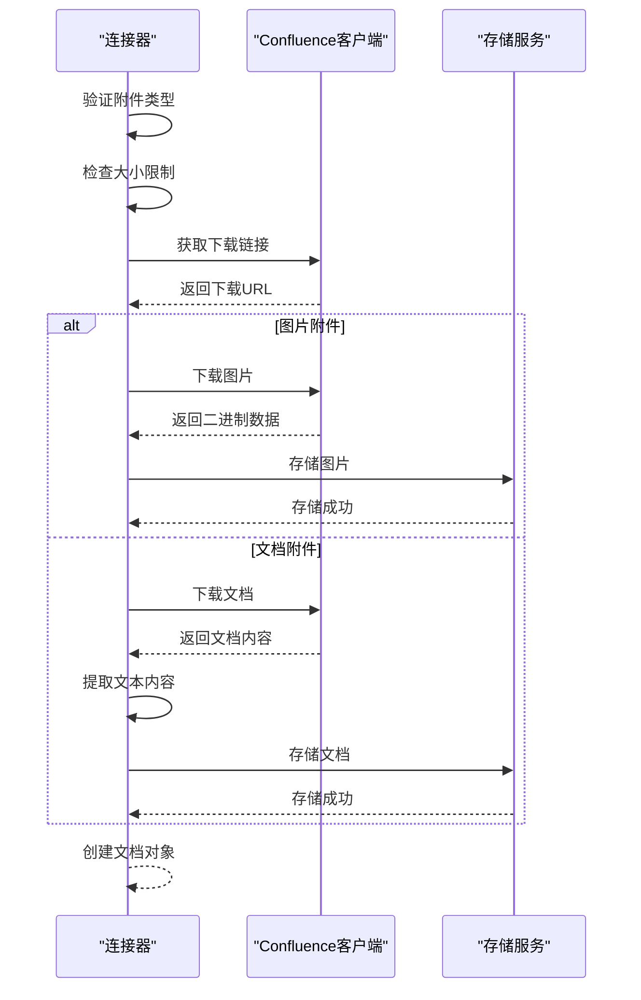
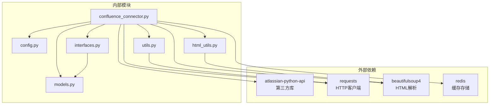

# Confluence连接器

<cite>
**本文档引用的文件**
- [confluence_connector.py](file://common/data_source/confluence_connector.py)
- [config.py](file://common/data_source/config.py)
- [interfaces.py](file://common/data_source/interfaces.py)
- [utils.py](file://common/data_source/utils.py)
- [html_utils.py](file://common/data_source/html_utils.py)
- [models.py](file://common/data_source/models.py)
- [exceptions.py](file://common/data_source/exceptions.py)
- [confluence-constant.tsx](file://web/src/pages/user-setting/data-source/constant/confluence-constant.tsx)
</cite>

## 目录
1. [简介](#简介)
2. [项目结构](#项目结构)
3. [核心组件](#核心组件)
4. [架构概览](#架构概览)
5. [详细组件分析](#详细组件分析)
6. [依赖关系分析](#依赖关系分析)
7. [性能考量](#性能考量)
8. [故障排除指南](#故障排除指南)
9. [结论](#结论)
10. [附录](#附录)

## 简介
本文件为RAGFlow项目中Atlassian Confluence连接器的详细实现文档。该连接器负责从Confluence（包括Cloud和Server/Data Center）拉取空间、页面、博客文章、附件等内容，并将其转换为统一的文档格式供后续处理。文档重点涵盖以下方面：
- Atlassian Confluence REST API的集成方式，包括Basic Auth和OAuth认证机制
- 空间、页面、博客文章等不同内容类型的获取和解析方法
- Confluence特有的富文本格式处理，包括宏、表格、附件、版本历史等元素的提取和转换
- 增量同步机制，如何处理页面更新和删除事件
- 配置参数说明和使用示例，包括服务器URL、认证凭据、空间过滤等
- 与Confluence权限系统的交互处理和数据安全考虑

## 项目结构
Confluence连接器位于common/data_source目录下，核心文件包括：
- confluence_connector.py：连接器主实现，包含OnyxConfluence客户端封装、CQL查询、分页、富文本解析、附件处理、权限同步等功能
- config.py：连接器配置常量，如分页限制、时间缓冲、附件大小阈值、OAuth客户端信息等
- interfaces.py：连接器接口定义，包括凭证提供者、检查点、Slim文档等抽象
- utils.py：通用工具函数，如令牌刷新、超时执行、URL构建、附件类型验证等
- html_utils.py：HTML解析和格式化工具，将Confluence富文本转换为纯文本
- models.py：数据模型定义，如Document、SlimDocument、ExternalAccess等
- exceptions.py：连接器相关异常类
- web前端常量：前端表单字段定义，用于配置连接器参数



**图表来源**
- [confluence_connector.py:1275-1427](file://common/data_source/confluence_connector.py#L1275-L1427)
- [config.py:144-303](file://common/data_source/config.py#L144-L303)
- [interfaces.py:203-420](file://common/data_source/interfaces.py#L203-L420)

**章节来源**
- [confluence_connector.py:1-2107](file://common/data_source/confluence_connector.py#L1-L2107)
- [config.py:1-303](file://common/data_source/config.py#L1-L303)

## 核心组件
本节深入分析连接器的核心组件及其职责。

### OnyxConfluence客户端封装
OnyxConfluence是对第三方atlassian-python-api库的封装，提供了以下增强功能：
- 自定义CQL方法支持复杂查询
- 统一的速率限制处理和错误重试机制
- 动态凭证管理，支持OAuth刷新和Redis缓存
- 分页URL恢复机制，处理500错误时逐项重试
- 特定于Confluence的扩展字段处理

关键特性：
- 支持Confluence Cloud和Server/Data Center两种部署模式
- 内置OAuth 2.0刷新令牌机制
- 提供探测连接和初始化连接的方法
- 实现了动态属性拦截，自动包装所有Confluence方法

**章节来源**
- [confluence_connector.py:63-441](file://common/data_source/confluence_connector.py#L63-L441)

### ConfluenceConnector主连接器
ConfluenceConnector实现了完整的索引流程，包括：
- 凭证设置和验证
- CQL查询构建（支持空间、页面ID、递归索引）
- 分页检索和批量处理
- 富文本解析和附件提取
- 增量同步和检查点管理
- 权限同步（Slim文档）

主要功能模块：
- 页面检索：支持按空间、页面ID或自定义CQL查询
- 评论处理：提取页面评论并合并到文档内容
- 附件处理：支持图片和文档附件的下载和内容提取
- 时间过滤：基于最后修改时间的增量同步
- 路径构建：生成语义标识符，避免重复文档

**章节来源**
- [confluence_connector.py:1275-1843](file://common/data_source/confluence_connector.py#L1275-L1843)

### 富文本解析引擎
富文本解析是连接器的核心能力之一，负责将Confluence的富文本转换为纯文本：
- 用户标签替换：将ri:user标签替换为显示名称
- 宏处理：处理include宏，递归获取被包含页面的内容
- 链接文本提取：将ac:link-body转换为可读文本
- 附件标记：将ri:attachment标记为占位符
- HTML清理：使用BeautifulSoup进行结构化解析和格式化

**章节来源**
- [confluence_connector.py:910-1022](file://common/data_source/confluence_connector.py#L910-L1022)
- [html_utils.py:66-220](file://common/data_source/html_utils.py#L66-L220)

### 附件处理系统
附件处理系统支持多种文件类型：
- 图片附件：直接存储为二进制数据，供后续图像分析
- 文档附件：提取文本内容，支持多种文档格式
- 大小控制：通过配置阈值限制附件大小
- 类型验证：仅处理受支持的文件类型

**章节来源**
- [confluence_connector.py:1144-1272](file://common/data_source/confluence_connector.py#L1144-L1272)
- [utils.py:1060-1075](file://common/data_source/utils.py#L1060-L1075)

## 架构概览
连接器采用分层架构设计，确保高内聚低耦合：



**图表来源**
- [confluence_connector.py:1398-1427](file://common/data_source/confluence_connector.py#L1398-L1427)
- [confluence_connector.py:1788-1843](file://common/data_source/confluence_connector.py#L1788-L1843)

## 详细组件分析

### 认证与凭证管理
连接器支持两种认证方式：

#### Basic Auth（个人访问令牌）
适用于Confluence Server/Data Center：
- 使用用户名和访问令牌进行认证
- 支持静态和动态凭证提供者
- 自动探测和初始化连接

#### OAuth 2.0（Confluence Cloud）
适用于Confluence Cloud：
- 使用OAuth 2.0授权码流程
- 自动刷新访问令牌
- 支持云实例ID识别



**图表来源**
- [confluence_connector.py:206-298](file://common/data_source/confluence_connector.py#L206-L298)
- [confluence_connector.py:324-348](file://common/data_source/confluence_connector.py#L324-L348)

**章节来源**
- [confluence_connector.py:126-194](file://common/data_source/confluence_connector.py#L126-L194)
- [utils.py:988-1021](file://common/data_source/utils.py#L988-L1021)

### CQL查询构建与执行
连接器使用CQL（Confluence Query Language）进行内容检索：

#### 查询构建策略
- 默认查询：type=page
- 空间过滤：space='SPACE_KEY'
- 页面ID过滤：id='PAGE_ID' 或祖先过滤（递归索引）
- 标签过滤：label not in ('label1','label2')
- 时间过滤：lastmodified范围查询

#### 分页机制
- 支持偏移分页和游标分页
- 自动处理空结果和边界情况
- 错误恢复：遇到500错误时逐项重试
- 检查点保存：断点续传支持

**章节来源**
- [confluence_connector.py:1431-1482](file://common/data_source/confluence_connector.py#L1431-L1482)
- [confluence_connector.py:498-648](file://common/data_source/confluence_connector.py#L498-L648)

### 富文本处理详解
富文本处理是连接器的核心能力，涉及多种Confluence特有元素：

#### 宏处理
- include宏：递归获取被包含页面内容
- 参数清理：移除宏样式参数
- 递归保护：防止循环引用

#### 用户标签处理
- ri:user标签：替换为显示名称
- 支持accountId和userkey两种标识
- 缓存机制：避免重复查询用户信息

#### 链接和附件处理
- ac:link-body：提取链接显示文本
- ri:attachment：标记为附件占位符
- HTML结构化输出：保持内容层次



**图表来源**
- [confluence_connector.py:946-1022](file://common/data_source/confluence_connector.py#L946-L1022)

**章节来源**
- [confluence_connector.py:910-1022](file://common/data_source/confluence_connector.py#L910-L1022)
- [html_utils.py:66-160](file://common/data_source/html_utils.py#L66-L160)

### 附件处理流程
附件处理分为两个阶段：

#### 预处理阶段
- 类型验证：检查媒体类型是否受支持
- 大小检查：超过阈值的附件跳过
- 图片处理：根据配置决定是否下载

#### 下载和提取阶段
- 构建下载链接：区分Cloud和Server的URL格式
- 下载内容：支持二进制和文本内容
- 文档提取：对非图片文件进行内容提取



**图表来源**
- [confluence_connector.py:1144-1272](file://common/data_source/confluence_connector.py#L1144-L1272)

**章节来源**
- [confluence_connector.py:1144-1272](file://common/data_source/confluence_connector.py#L1144-L1272)
- [utils.py:1060-1075](file://common/data_source/utils.py#L1060-L1075)

### 增量同步机制
连接器支持基于时间戳的增量同步：

#### 时间过滤策略
- 起始时间：支持时间缓冲区，避免边界问题
- 结束时间：默认当前时间
- 时区处理：支持自定义时区偏移

#### 检查点管理
- 断点续传：保存下一页URL
- 进度跟踪：记录已处理的文档数量
- 异常恢复：失败后从检查点继续

#### 删除检测
- 最后修改时间：通过lastmodified字段判断更新
- 删除处理：未在新查询中出现的文档视为删除

**章节来源**
- [confluence_connector.py:1368-1384](file://common/data_source/confluence_connector.py#L1368-L1384)
- [confluence_connector.py:1814-1843](file://common/data_source/confluence_connector.py#L1814-L1843)

### 权限同步系统
连接器支持权限同步，用于确定文档的外部访问权限：

#### 权限数据收集
- 页面级权限：从restrictions字段获取
- 空间级权限：从空间配置获取
- 继承权限：从祖先页面继承

#### 外部访问模型
- ExternalAccess：包含外部用户邮箱、组ID和公开状态
- 权限上限：防止权限集合过大
- 性能优化：批量处理和缓存机制

**章节来源**
- [confluence_connector.py:1922-2022](file://common/data_source/confluence_connector.py#L1922-L2022)
- [models.py:9-66](file://common/data_source/models.py#L9-L66)

## 依赖关系分析



**图表来源**
- [confluence_connector.py:12-18](file://common/data_source/confluence_connector.py#L12-L18)
- [utils.py:23-34](file://common/data_source/utils.py#L23-L34)

### 关键依赖关系
- atlassian-python-api：Confluence REST API的主要客户端
- requests：HTTP请求处理，包括速率限制和重试
- beautifulsoup4：HTML解析和清理
- redis：凭证缓存和分布式锁
- 自定义工具模块：令牌刷新、URL构建、类型验证

**章节来源**
- [confluence_connector.py:12-49](file://common/data_source/confluence_connector.py#L12-L49)

## 性能考量
连接器在设计时充分考虑了性能和可靠性：

### 并发与批处理
- 批量处理：默认批大小为2，可配置
- 并行下载：附件下载支持并发执行
- 内存管理：流式处理大文件，避免内存溢出

### 速率限制与重试
- 指数退避：HTTP 429和403错误采用指数退避策略
- 最大重试次数：防止无限重试
- 超时控制：全局超时和连接超时双重保障

### 缓存策略
- 用户信息缓存：避免重复查询用户详情
- 凭证缓存：Redis缓存OAuth令牌
- 分页缓存：检查点持久化

## 故障排除指南

### 常见认证问题
- 401错误：检查用户名和访问令牌是否正确
- 403错误：确认用户权限和空间访问权限
- OAuth过期：检查刷新令牌是否有效

### 连接问题
- 探测失败：验证wiki_base URL和网络连通性
- 速率限制：调整请求频率和重试策略
- 超时问题：增加超时时间和重试次数

### 数据处理问题
- 富文本解析错误：检查HTML结构完整性
- 附件下载失败：验证下载链接和文件权限
- 内存不足：减小批处理大小和附件大小阈值

**章节来源**
- [confluence_connector.py:2024-2058](file://common/data_source/confluence_connector.py#L2024-L2058)
- [utils.py:112-158](file://common/data_source/utils.py#L112-L158)

## 结论
RAGFlow的Confluence连接器提供了完整的企业级文档索引解决方案，具有以下特点：
- 全面的认证支持：同时支持Basic Auth和OAuth 2.0
- 强大的内容处理能力：支持富文本、宏、附件等多种元素
- 高效的增量同步：基于时间戳的增量索引
- 可靠的错误处理：完善的重试和恢复机制
- 良好的性能表现：并发处理和缓存优化

该连接器为企业知识管理提供了坚实的技术基础，能够满足大规模文档索引和权限控制的需求。

## 附录

### 配置参数说明

#### 基础配置
- wiki_base：Confluence实例的基础URL
- is_cloud：是否为Cloud部署
- index_mode：索引模式（全部、空间、页面）
- space：空间键（当index_mode为space时必需）
- page_id：页面ID（当index_mode为page时必需）
- index_recursively：是否递归索引子页面

#### 认证配置
- confluence_username：用户名
- confluence_access_token：访问令牌
- OAuth客户端信息：client_id和client_secret

#### 高级配置
- CONFLUENCE_CONNECTOR_LABELS_TO_SKIP：跳过的标签列表
- CONFLUENCE_TIMEZONE_OFFSET：时区偏移（小时）
- CONFLUENCE_SYNC_TIME_BUFFER_SECONDS：时间缓冲（秒）
- CONFLUENCE_CONNECTOR_ATTACHMENT_SIZE_THRESHOLD：附件大小阈值（字节）

**章节来源**
- [confluence-constant.tsx:4-121](file://web/src/pages/user-setting/data-source/constant/confluence-constant.tsx#L4-L121)
- [config.py:144-235](file://common/data_source/config.py#L144-L235)

### 使用示例

#### 基本页面索引
```python
# 设置连接器
connector = ConfluenceConnector(
    wiki_base="https://your-domain.atlassian.net",
    is_cloud=True,
    space="YOUR_SPACE_KEY"
)

# 设置凭证
credentials_provider = StaticCredentialsProvider(
    None,
    DocumentSource.CONFLUENCE,
    {
        "confluence_username": "your-email@example.com",
        "confluence_access_token": "your-access-token"
    }
)
connector.set_credentials_provider(credentials_provider)

# 开始索引
for doc in load_all_docs_from_checkpoint_connector(connector, start, end):
    print(doc.id)
```

#### 递归页面索引
```python
# 递归索引特定页面及其子页面
connector = ConfluenceConnector(
    wiki_base="https://your-domain.atlassian.net",
    is_cloud=True,
    page_id="12345",
    index_recursively=True
)
```

#### 自定义CQL查询
```python
# 使用自定义CQL查询
connector = ConfluenceConnector(
    wiki_base="https://your-domain.atlassian.net",
    is_cloud=True,
    cql_query="type=page and space='YOUR_SPACE' and labels='important'"
)
```