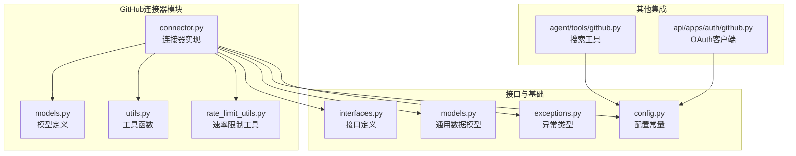
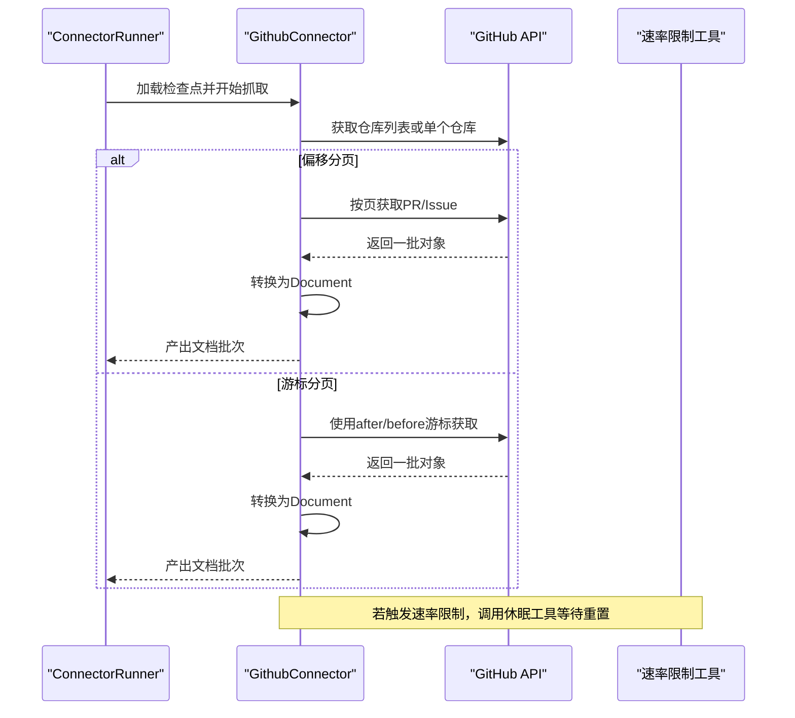
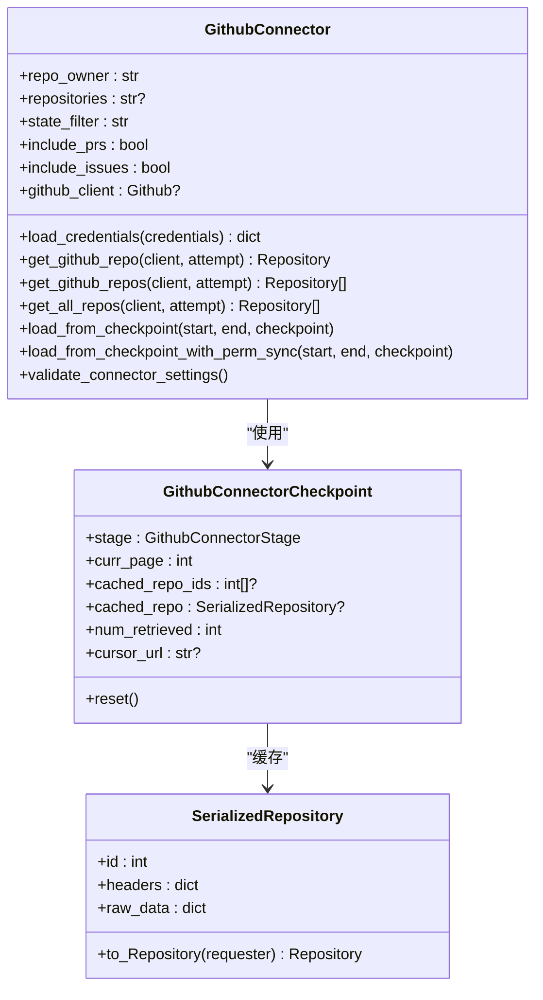
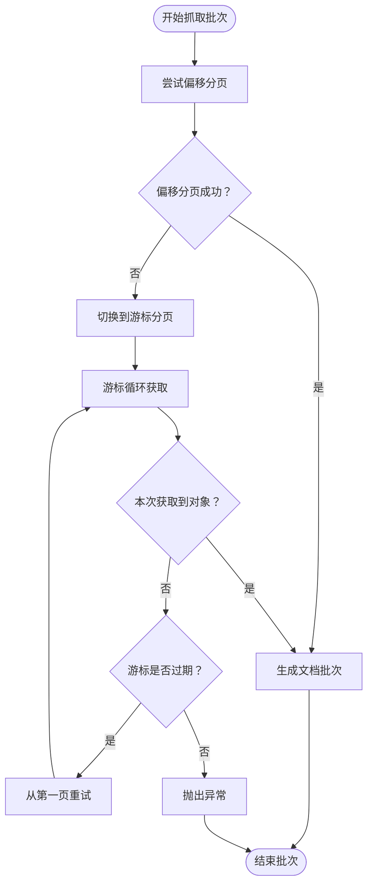
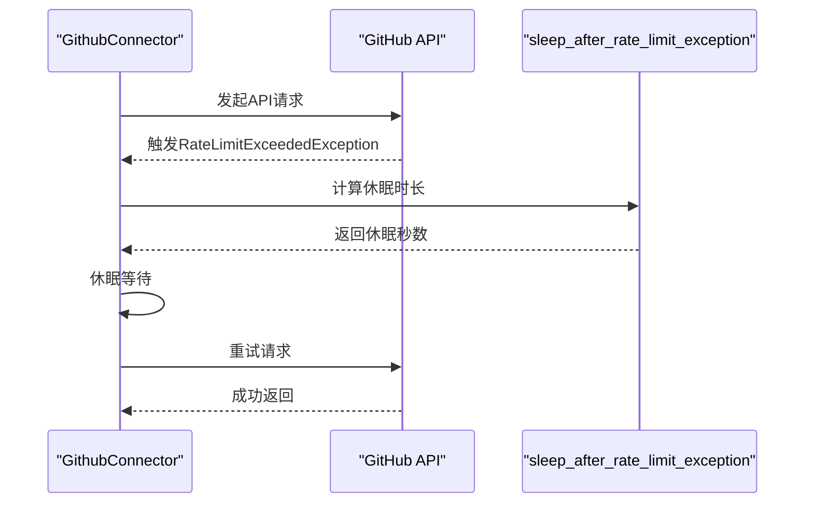
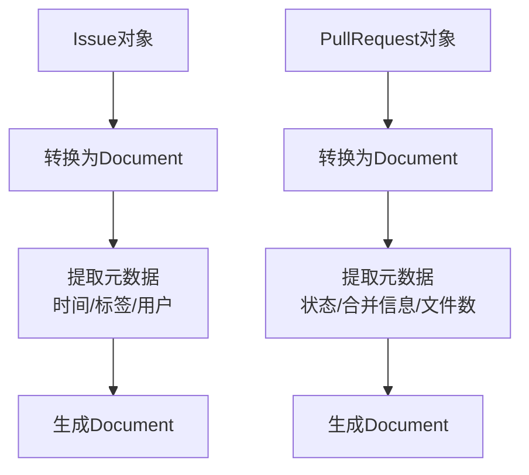
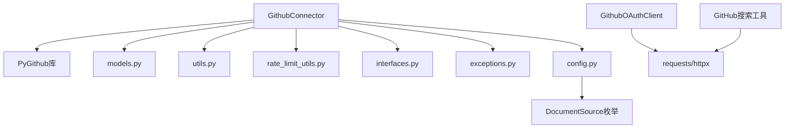

# GitHub连接器

<cite>
**本文档引用的文件**
- [common/data_source/github/connector.py](file://common/data_source/github/connector.py)
- [common/data_source/github/models.py](file://common/data_source/github/models.py)
- [common/data_source/github/utils.py](file://common/data_source/github/utils.py)
- [common/data_source/github/rate_limit_utils.py](file://common/data_source/github/rate_limit_utils.py)
- [common/data_source/interfaces.py](file://common/data_source/interfaces.py)
- [common/data_source/models.py](file://common/data_source/models.py)
- [common/data_source/config.py](file://common/data_source/config.py)
- [common/data_source/exceptions.py](file://common/data_source/exceptions.py)
- [agent/tools/github.py](file://agent/tools/github.py)
- [api/apps/auth/github.py](file://api/apps/auth/github.py)
</cite>

## 目录
1. [简介](#简介)
2. [项目结构](#项目结构)
3. [核心组件](#核心组件)
4. [架构概览](#架构概览)
5. [详细组件分析](#详细组件分析)
6. [依赖关系分析](#依赖关系分析)
7. [性能考虑](#性能考虑)
8. [故障排除指南](#故障排除指南)
9. [结论](#结论)
10. [附录](#附录)

## 简介
本文件为GitHub连接器的详细实现文档，涵盖以下关键方面：
- GitHub API集成：基于PyGithub库的REST API使用方式与认证机制
- 分页机制：支持偏移分页与游标分页两种策略，自动回退处理
- 速率限制：基于GitHub API速率限制的智能休眠与重试
- 资源类型：代码仓库、问题（Issues）、拉取请求（Pull Requests）等的获取与解析
- 数据模型转换：Issue/Pull Request到文档格式的映射、Markdown内容处理、元数据提取
- 配置参数：认证令牌、仓库选择、状态过滤、权限同步等
- 错误处理与性能优化：异常分类、重试策略、时间范围过滤等

## 项目结构
GitHub连接器位于数据源模块中，采用分层设计：
- 连接器实现：负责与GitHub API交互、分页、速率限制处理、资源转换
- 模型定义：序列化仓库对象、通用文档模型、检查点模型
- 工具函数：外部访问权限获取、仓库反序列化
- 速率限制工具：基于API返回的重置时间进行休眠
- 接口与异常：统一的连接器接口、检查点协议、异常类型
- 配置常量：文档来源枚举、GitHub基础URL等

**图表来源**
- [common/data_source/github/connector.py:1-973](file://common/data_source/github/connector.py#L1-L973)
- [common/data_source/github/models.py:1-17](file://common/data_source/github/models.py#L1-L17)
- [common/data_source/github/utils.py:1-44](file://common/data_source/github/utils.py#L1-L44)
- [common/data_source/github/rate_limit_utils.py:1-24](file://common/data_source/github/rate_limit_utils.py#L1-L24)
- [common/data_source/interfaces.py:1-420](file://common/data_source/interfaces.py#L1-L420)
- [common/data_source/models.py:1-314](file://common/data_source/models.py#L1-L314)
- [common/data_source/config.py:1-303](file://common/data_source/config.py#L1-L303)
- [common/data_source/exceptions.py:1-30](file://common/data_source/exceptions.py#L1-L30)
- [agent/tools/github.py:1-105](file://agent/tools/github.py#L1-L105)
- [api/apps/auth/github.py:1-89](file://api/apps/auth/github.py#L1-L89)

**章节来源**
- [common/data_source/github/connector.py:1-973](file://common/data_source/github/connector.py#L1-L973)
- [common/data_source/github/models.py:1-17](file://common/data_source/github/models.py#L1-L17)
- [common/data_source/github/utils.py:1-44](file://common/data_source/github/utils.py#L1-L44)
- [common/data_source/github/rate_limit_utils.py:1-24](file://common/data_source/github/rate_limit_utils.py#L1-L24)
- [common/data_source/interfaces.py:1-420](file://common/data_source/interfaces.py#L1-L420)
- [common/data_source/models.py:1-314](file://common/data_source/models.py#L1-L314)
- [common/data_source/config.py:1-303](file://common/data_source/config.py#L1-L303)
- [common/data_source/exceptions.py:1-30](file://common/data_source/exceptions.py#L1-L30)
- [agent/tools/github.py:1-105](file://agent/tools/github.py#L1-L105)
- [api/apps/auth/github.py:1-89](file://api/apps/auth/github.py#L1-L89)

## 核心组件
- GithubConnector：主连接器类，实现检查点驱动的增量抓取，支持PR与Issue两类资源
- GithubConnectorCheckpoint：检查点模型，记录阶段、页码、游标URL、已检索数量等
- SerializedRepository：仓库序列化模型，便于在检查点间持久化
- rate limit工具：根据GitHub API返回的重置时间进行安全休眠
- 文档转换函数：将Issue/Pull Request转换为统一的Document模型
- 外部访问权限：提供仓库级外部访问信息（默认私有）
- 验证逻辑：对仓库存在性、可访问性、权限范围进行验证

**章节来源**
- [common/data_source/github/connector.py:413-925](file://common/data_source/github/connector.py#L413-L925)
- [common/data_source/github/models.py:8-17](file://common/data_source/github/models.py#L8-L17)
- [common/data_source/github/rate_limit_utils.py:10-24](file://common/data_source/github/rate_limit_utils.py#L10-L24)
- [common/data_source/github/utils.py:11-44](file://common/data_source/github/utils.py#L11-L44)
- [common/data_source/models.py:88-101](file://common/data_source/models.py#L88-L101)

## 架构概览
GitHub连接器采用分层架构：
- 认证层：使用个人访问令牌（PAT）通过PyGithub进行认证
- API层：调用GitHub REST API获取仓库、问题、拉取请求
- 分页层：优先使用偏移分页，遇到“大数据集”错误时自动切换到游标分页
- 速率限制层：捕获速率限制异常，按重置时间休眠后重试
- 转换层：将API响应转换为统一的Document模型
- 检查点层：支持断点续传，记录当前进度与状态

**图表来源**
- [common/data_source/github/connector.py:158-218](file://common/data_source/github/connector.py#L158-L218)
- [common/data_source/github/rate_limit_utils.py:10-24](file://common/data_source/github/rate_limit_utils.py#L10-L24)

**章节来源**
- [common/data_source/github/connector.py:529-740](file://common/data_source/github/connector.py#L529-L740)

## 详细组件分析

### 连接器类（GithubConnector）
- 初始化参数：仓库所有者、仓库名称（支持逗号分隔多仓库）、状态过滤、是否包含PR/Issue
- 认证加载：使用Token认证，支持自定义基础URL（用于GitHub Enterprise）
- 仓库获取：支持单仓库、多仓库、全组织/用户仓库三种模式
- 抓取流程：PR阶段 → Issue阶段 → 切换仓库 → 继续下一批
- 时间范围过滤：按updated_at进行前后边界控制，避免遗漏
- 权限同步：可选获取仓库外部访问权限（默认私有）

**图表来源**
- [common/data_source/github/connector.py:413-427](file://common/data_source/github/connector.py#L413-L427)
- [common/data_source/github/connector.py:380-398](file://common/data_source/github/connector.py#L380-L398)
- [common/data_source/github/models.py:8-17](file://common/data_source/github/models.py#L8-L17)

**章节来源**
- [common/data_source/github/connector.py:413-800](file://common/data_source/github/connector.py#L413-L800)

### 分页与回退机制
- 偏移分页：每页最多100条，使用get_page(page_num)获取
- 游标分页：当出现“大数据集不支持偏移分页”的错误时，自动切换到after/before游标分页
- 回退策略：若游标过期且未获取到任何对象，则从第一页重新尝试
- 检查点更新：游标分页时持续更新cursor_url与已检索数量，确保断点续传

**图表来源**
- [common/data_source/github/connector.py:99-156](file://common/data_source/github/connector.py#L99-L156)
- [common/data_source/github/connector.py:158-218](file://common/data_source/github/connector.py#L158-L218)

**章节来源**
- [common/data_source/github/connector.py:99-218](file://common/data_source/github/connector.py#L99-L218)

### 速率限制处理
- 捕获RateLimitExceededException异常
- 读取GitHub API的core.reset时间，计算剩余秒数并额外加1分钟缓冲
- 休眠至重置时间后自动重试，最多重试5次

**图表来源**
- [common/data_source/github/connector.py:189-199](file://common/data_source/github/connector.py#L189-L199)
- [common/data_source/github/rate_limit_utils.py:10-24](file://common/data_source/github/rate_limit_utils.py#L10-L24)

**章节来源**
- [common/data_source/github/connector.py:158-218](file://common/data_source/github/connector.py#L158-L218)
- [common/data_source/github/rate_limit_utils.py:10-24](file://common/data_source/github/rate_limit_utils.py#L10-L24)

### 资源转换与文档模型
- Issue转换：提取标题、正文、标签、创建/更新/关闭时间、用户信息等，扩展名为.md
- Pull Request转换：提取标题、描述、合并状态、提交数、变更文件数、标签、时间戳等
- 元数据标准化：统一时间字段为UTC且带时区信息，确保索引一致性
- 失败处理：单个对象转换失败不影响整体流程，记录ConnectorFailure

**图表来源**
- [common/data_source/github/connector.py:319-371](file://common/data_source/github/connector.py#L319-L371)
- [common/data_source/github/connector.py:239-311](file://common/data_source/github/connector.py#L239-L311)

**章节来源**
- [common/data_source/github/connector.py:239-371](file://common/data_source/github/connector.py#L239-L371)
- [common/data_source/models.py:88-101](file://common/data_source/models.py#L88-L101)

### 验证与配置
- 设置验证：检查凭证是否加载、repo_owner是否提供
- 仓库验证：支持单仓库、多仓库、全仓库三种模式；对不存在或无权限的情况给出明确错误
- OAuth配置：提供GitHub OAuth客户端，支持获取用户信息与邮箱
- 搜索工具：提供基于REST API的仓库搜索能力（非连接器核心）

**章节来源**
- [common/data_source/github/connector.py:793-925](file://common/data_source/github/connector.py#L793-L925)
- [api/apps/auth/github.py:21-89](file://api/apps/auth/github.py#L21-L89)
- [agent/tools/github.py:57-105](file://agent/tools/github.py#L57-L105)

## 依赖关系分析
- 内部依赖：连接器依赖模型、工具、速率限制工具、接口与异常定义
- 外部依赖：PyGithub库（GitHub API封装）、requests（搜索工具）、httpx（异步OAuth）
- 配置依赖：环境变量GITHUB_CONNECTOR_BASE_URL用于企业版自定义域名

**图表来源**
- [common/data_source/github/connector.py:12-44](file://common/data_source/github/connector.py#L12-L44)
- [common/data_source/config.py:41-66](file://common/data_source/config.py#L41-L66)
- [api/apps/auth/github.py:17-32](file://api/apps/auth/github.py#L17-L32)
- [agent/tools/github.py:20-22](file://agent/tools/github.py#L20-L22)

**章节来源**
- [common/data_source/github/connector.py:1-44](file://common/data_source/github/connector.py#L1-L44)
- [common/data_source/config.py:244-244](file://common/data_source/config.py#L244-L244)

## 性能考虑
- 分页批量大小：每页100条，平衡吞吐与内存占用
- 速率限制缓冲：额外1分钟缓冲，降低重试成本
- 时间范围过滤：按updated_at过滤，减少无效数据传输
- 断点续传：检查点持久化，避免重复抓取
- 游标分页回退：在大集合场景下保证稳定性

[本节为通用性能指导，无需特定文件引用]

## 故障排除指南
常见错误与处理：
- 凭证缺失：检查是否正确加载github_access_token
- 仓库不存在：确认repo_owner与仓库名拼写，检查权限范围
- 权限不足：确保令牌具有访问目标仓库的权限
- 速率限制：等待core.reset时间后重试，或降低并发
- 游标过期：系统会自动回退到偏移分页，若仍失败请检查网络与API状态

**章节来源**
- [common/data_source/github/connector.py:883-920](file://common/data_source/github/connector.py#L883-L920)
- [common/data_source/exceptions.py:4-30](file://common/data_source/exceptions.py#L4-L30)

## 结论
GitHub连接器提供了稳定、可扩展的GitHub资源抓取能力，具备完善的分页与速率限制处理、断点续传与错误恢复机制。通过统一的文档模型输出，能够高效地将Issue与Pull Request转化为知识库可用的数据。

[本节为总结性内容，无需特定文件引用]

## 附录

### 配置参数说明
- 认证
  - github_access_token：个人访问令牌（PAT）
  - GITHUB_CONNECTOR_BASE_URL：GitHub企业版基础URL（可选）
- 仓库选择
  - repo_owner：组织或用户名
  - repositories：仓库名，支持逗号分隔的多仓库
- 行为控制
  - state_filter：状态过滤（如open、closed、all）
  - include_prs/include_issues：是否包含PR/Issue
- 时间范围
  - start/end：Unix时间戳，用于增量抓取

**章节来源**
- [common/data_source/github/connector.py:414-427](file://common/data_source/github/connector.py#L414-L427)
- [common/data_source/config.py:244-244](file://common/data_source/config.py#L244-L244)

### 使用示例（概念性）
- 初始化连接器：设置repo_owner与repositories，加载github_access_token
- 执行验证：调用validate_connector_settings确保配置有效
- 启动抓取：使用ConnectorRunner配合检查点进行增量抓取
- 处理结果：遍历产出的Document与ConnectorFailure

**章节来源**
- [common/data_source/github/connector.py:932-973](file://common/data_source/github/connector.py#L932-L973)