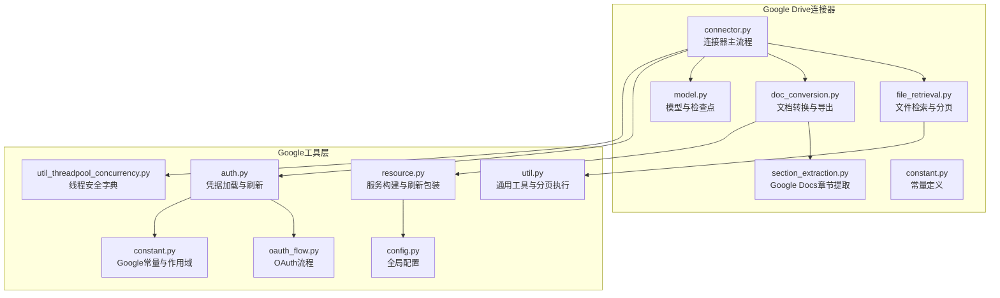
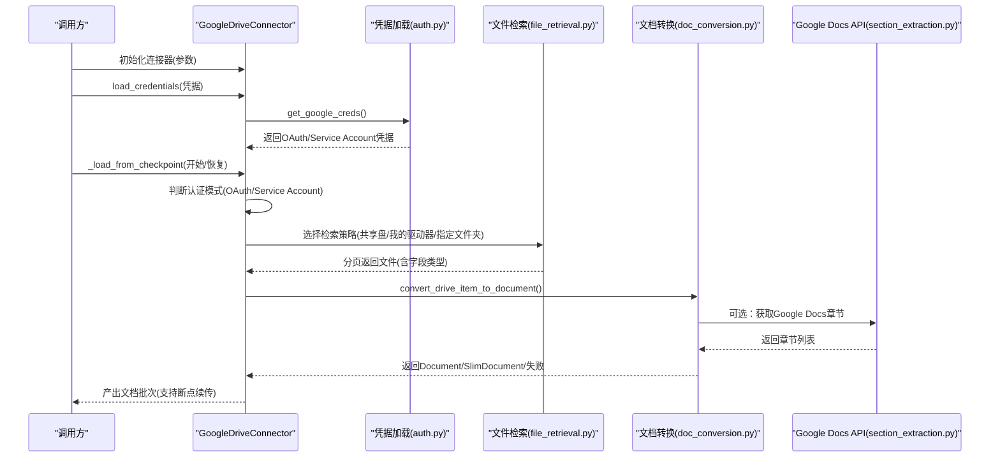
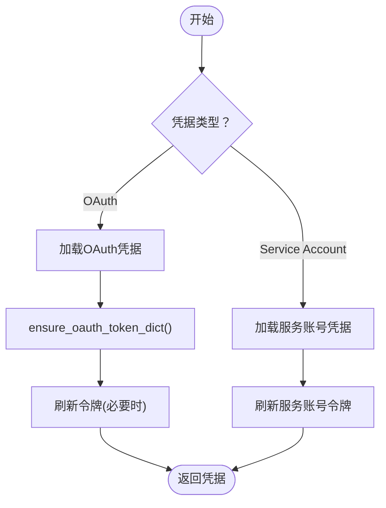
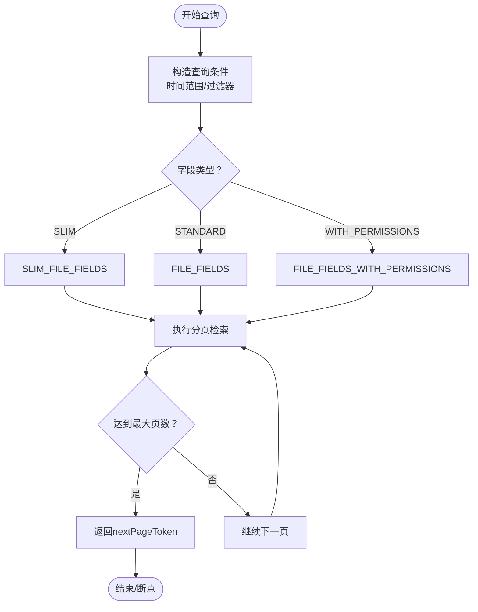
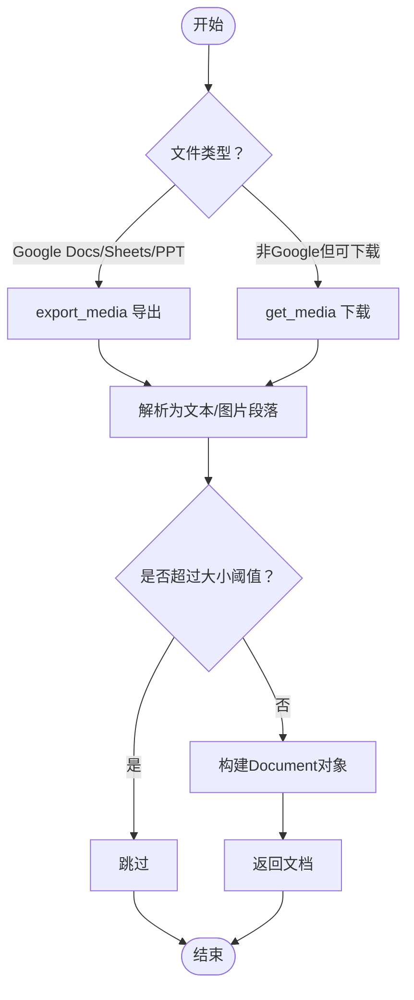
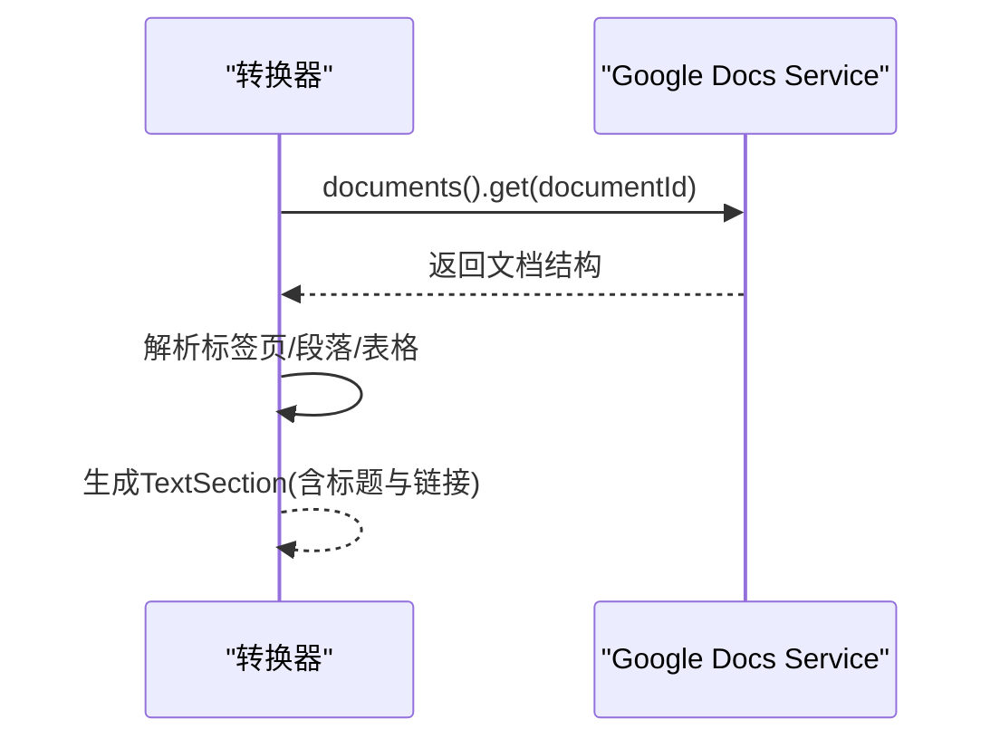
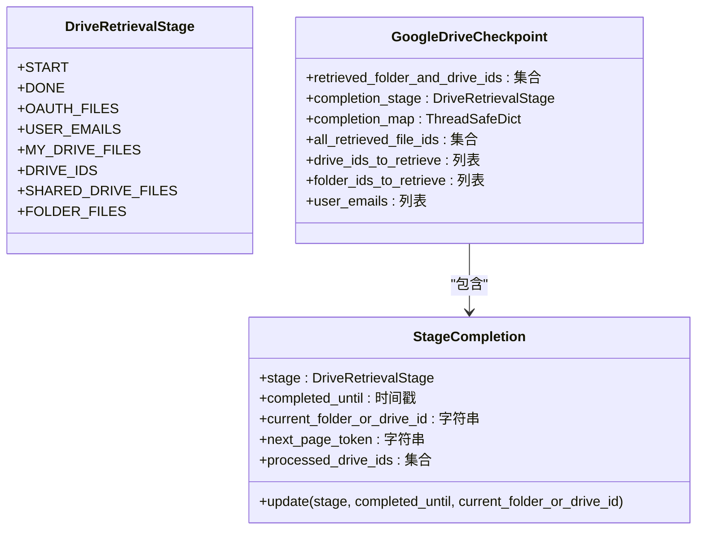
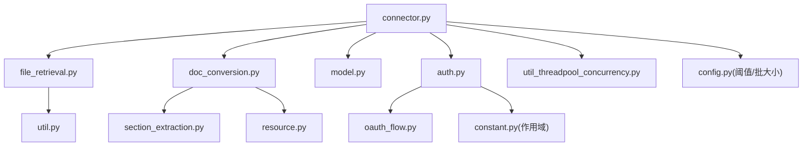

# Google Drive连接器

<cite>
**本文档引用的文件**
- [connector.py](file://common/data_source/google_drive/connector.py)
- [doc_conversion.py](file://common/data_source/google_drive/doc_conversion.py)
- [file_retrieval.py](file://common/data_source/google_drive/file_retrieval.py)
- [section_extraction.py](file://common/data_source/google_drive/section_extraction.py)
- [model.py](file://common/data_source/google_drive/model.py)
- [constant.py](file://common/data_source/google_drive/constant.py)
- [auth.py](file://common/data_source/google_util/auth.py)
- [oauth_flow.py](file://common/data_source/google_util/oauth_flow.py)
- [resource.py](file://common/data_source/google_util/resource.py)
- [util.py](file://common/data_source/google_util/util.py)
- [util_threadpool_concurrency.py](file://common/data_source/google_util/util_threadpool_concurrency.py)
- [config.py](file://common/data_source/config.py)
- [constant.py](file://common/data_source/google_util/constant.py)
</cite>

## 目录
1. [简介](#简介)
2. [项目结构](#项目结构)
3. [核心组件](#核心组件)
4. [架构总览](#架构总览)
5. [详细组件分析](#详细组件分析)
6. [依赖关系分析](#依赖关系分析)
7. [性能考虑](#性能考虑)
8. [故障排除指南](#故障排除指南)
9. [结论](#结论)
10. [附录](#附录)

## 简介
本文件为Google Drive连接器的详细实现文档，涵盖以下关键主题：
- Google Drive API与Google Docs API的集成方式
- OAuth认证流程与权限范围配置
- 文档格式转换机制：从Google Docs原生格式到标准文档格式
- 文件检索策略：文件夹遍历、文件类型过滤、共享文件处理
- Google特有文档结构处理：表格、图表、嵌入内容的提取与转换
- 配置参数说明与使用示例：API密钥、权限范围、批量处理等
- 大量文件场景下的性能优化与错误恢复策略

## 项目结构
Google Drive连接器位于common/data_source/google_drive目录下，围绕“检索-转换-索引”的主流程组织代码：
- 连接器入口与控制流：connector.py
- 文件检索与分页：file_retrieval.py
- 文档转换与导出：doc_conversion.py
- Google Docs API章节提取：section_extraction.py
- 模型与检查点：model.py
- 常量定义：constant.py
- Google工具层：auth.py、oauth_flow.py、resource.py、util.py、util_threadpool_concurrency.py
- 全局配置：config.py

**图示来源**
- [connector.py:112-767](file://common/data_source/google_drive/connector.py#L112-L767)
- [file_retrieval.py:1-347](file://common/data_source/google_drive/file_retrieval.py#L1-L347)
- [doc_conversion.py:1-608](file://common/data_source/google_drive/doc_conversion.py#L1-L608)
- [section_extraction.py:1-184](file://common/data_source/google_drive/section_extraction.py#L1-L184)
- [model.py:1-145](file://common/data_source/google_drive/model.py#L1-L145)
- [auth.py:1-158](file://common/data_source/google_util/auth.py#L1-L158)
- [oauth_flow.py:1-122](file://common/data_source/google_util/oauth_flow.py#L1-L122)
- [resource.py:1-121](file://common/data_source/google_util/resource.py#L1-L121)
- [util.py:1-226](file://common/data_source/google_util/util.py#L1-L226)
- [util_threadpool_concurrency.py:1-142](file://common/data_source/google_util/util_threadpool_concurrency.py#L1-L142)
- [config.py:196-232](file://common/data_source/config.py#L196-L232)
- [constant.py:1-104](file://common/data_source/google_util/constant.py#L1-L104)

**章节来源**
- [connector.py:112-767](file://common/data_source/google_drive/connector.py#L112-L767)
- [file_retrieval.py:1-347](file://common/data_source/google_drive/file_retrieval.py#L1-L347)
- [doc_conversion.py:1-608](file://common/data_source/google_drive/doc_conversion.py#L1-L608)
- [section_extraction.py:1-184](file://common/data_source/google_drive/section_extraction.py#L1-L184)
- [model.py:1-145](file://common/data_source/google_drive/model.py#L1-L145)
- [auth.py:1-158](file://common/data_source/google_util/auth.py#L1-L158)
- [oauth_flow.py:1-122](file://common/data_source/google_util/oauth_flow.py#L1-L122)
- [resource.py:1-121](file://common/data_source/google_util/resource.py#L1-L121)
- [util.py:1-226](file://common/data_source/google_util/util.py#L1-L226)
- [util_threadpool_concurrency.py:1-142](file://common/data_source/google_util/util_threadpool_concurrency.py#L1-L142)
- [config.py:196-232](file://common/data_source/config.py#L196-L232)
- [constant.py:1-104](file://common/data_source/google_util/constant.py#L1-L104)

## 核心组件
- GoogleDriveConnector：连接器主体，负责凭据加载、用户模拟、阶段化检索、检查点管理与并行生成。
- 文件检索模块：封装Drive API查询、分页、时间范围过滤、文件/文件夹过滤。
- 文档转换模块：根据文件类型选择下载或导出路径，支持Google Docs/Sheets/Slides原生导出与多格式解析。
- Google Docs章节提取：基于Google Docs API获取文档结构，按标题分割段落，提取表格文本。
- 模型与检查点：定义检索阶段、完成状态、检查点序列化与线程安全存储。
- 工具层：凭据加载与刷新、OAuth流程、服务构建与自动刷新、通用分页执行与字符串清理。

**章节来源**
- [connector.py:112-767](file://common/data_source/google_drive/connector.py#L112-L767)
- [file_retrieval.py:1-347](file://common/data_source/google_drive/file_retrieval.py#L1-L347)
- [doc_conversion.py:1-608](file://common/data_source/google_drive/doc_conversion.py#L1-L608)
- [section_extraction.py:1-184](file://common/data_source/google_drive/section_extraction.py#L1-L184)
- [model.py:1-145](file://common/data_source/google_drive/model.py#L1-L145)
- [auth.py:1-158](file://common/data_source/google_util/auth.py#L1-L158)
- [resource.py:1-121](file://common/data_source/google_util/resource.py#L1-L121)
- [util.py:1-226](file://common/data_source/google_util/util.py#L1-L226)

## 架构总览
连接器采用“阶段化+检查点+并行生成”的架构，支持OAuth与服务账号两种认证模式，并针对共享盘、我的驱动器、指定文件夹等场景进行差异化处理。

**图示来源**
- [connector.py:740-795](file://common/data_source/google_drive/connector.py#L740-L795)
- [auth.py:37-127](file://common/data_source/google_util/auth.py#L37-L127)
- [file_retrieval.py:182-346](file://common/data_source/google_drive/file_retrieval.py#L182-L346)
- [doc_conversion.py:511-566](file://common/data_source/google_drive/doc_conversion.py#L511-L566)
- [section_extraction.py:16-39](file://common/data_source/google_drive/section_extraction.py#L16-L39)

## 详细组件分析

### 认证与OAuth流程
- 支持OAuth与服务账号两种认证方式，凭据通过get_google_creds统一加载与刷新。
- OAuth流程通过ensure_oauth_token_dict触发本地服务器或控制台授权，支持环境变量覆盖作用域与超时。
- 凭据中敏感字段（client_id/client_secret）在持久化前会被清洗，避免泄露。

**图示来源**
- [auth.py:37-127](file://common/data_source/google_util/auth.py#L37-L127)
- [oauth_flow.py:107-121](file://common/data_source/google_util/oauth_flow.py#L107-L121)

**章节来源**
- [auth.py:1-158](file://common/data_source/google_util/auth.py#L1-L158)
- [oauth_flow.py:1-122](file://common/data_source/google_util/oauth_flow.py#L1-L122)
- [constant.py:8-20](file://common/data_source/google_util/constant.py#L8-L20)

### 文件检索策略
- 字段类型枚举：SLIM/STANDARD/WITH_PERMISSIONS，分别对应最小元数据、标准元数据、含权限详情。
- 查询构造：支持时间范围过滤、垃圾箱过滤、共享盘聚合查询、文件夹/快捷方式过滤。
- 分页与并发：execute_paginated_retrieval_with_max_pages限制每轮页数，避免长时间占用；对403/404可选择跳过继续。
- 特殊场景：
  - 共享盘：get_files_in_shared_drive，支持缓存文件夹以减少后续遍历成本。
  - 我的驱动器：get_all_files_in_my_drive_and_shared，支持“仅自己拥有”与“包含共享给我”两种模式。
  - 指定文件夹：crawl_folders_for_files递归遍历，维护已遍历集合避免重复。

**图示来源**
- [file_retrieval.py:32-104](file://common/data_source/google_drive/file_retrieval.py#L32-L104)
- [util.py:59-115](file://common/data_source/google_util/util.py#L59-L115)

**章节来源**
- [file_retrieval.py:1-347](file://common/data_source/google_drive/file_retrieval.py#L1-L347)
- [util.py:1-226](file://common/data_source/google_util/util.py#L1-L226)

### 文档格式转换机制
- 类型识别与导出：
  - Google Docs/Sheets/Slides：优先使用export接口导出为纯文本或目标格式，再转为标准文本段落。
  - 其他类型：根据扩展名或MIME类型选择下载或解析路径。
- 图像处理：默认跳过图像，可通过allow_images启用；PDF中的嵌入图像会作为独立图片段落输出。
- 大小阈值：受GOOGLE_DRIVE_CONNECTOR_SIZE_THRESHOLD控制，超过阈值的文件被跳过。
- 多用户重试：当出现401/403/404等权限相关错误时，尝试多个检索者邮箱，直至成功或穷尽。

**图示来源**
- [doc_conversion.py:222-286](file://common/data_source/google_drive/doc_conversion.py#L222-L286)
- [doc_conversion.py:418-509](file://common/data_source/google_drive/doc_conversion.py#L418-L509)
- [config.py:196-198](file://common/data_source/config.py#L196-L198)

**章节来源**
- [doc_conversion.py:1-608](file://common/data_source/google_drive/doc_conversion.py#L1-L608)
- [config.py:196-198](file://common/data_source/config.py#L196-L198)

### Google Docs章节提取
- 使用Google Docs API获取文档结构，支持多标签页。
- 按标题样式识别段落，构建带链接的章节文本，支持表格文本抽取。
- 链接构建：基于文档ID与标题ID生成可点击的编辑链接。

**图示来源**
- [section_extraction.py:16-39](file://common/data_source/google_drive/section_extraction.py#L16-L39)
- [section_extraction.py:145-183](file://common/data_source/google_drive/section_extraction.py#L145-L183)

**章节来源**
- [section_extraction.py:1-184](file://common/data_source/google_drive/section_extraction.py#L1-L184)

### 检查点与阶段化控制
- 阶段枚举：START/DONE/OAUTH_FILES/USER_EMAILS/MY_DRIVE_FILES/DRIVE_IDS/SHARED_DRIVE_FILES/FOLDER_FILES。
- 完成状态：记录每个用户的阶段、截止时间戳、当前文件夹/驱动器ID、下一页令牌、已处理驱动器ID集合。
- 检查点：序列化completion_map与已检索文件集合，支持断点续跑。

**图示来源**
- [model.py:40-145](file://common/data_source/google_drive/model.py#L40-L145)

**章节来源**
- [model.py:1-145](file://common/data_source/google_drive/model.py#L1-L145)
- [util_threadpool_concurrency.py:16-142](file://common/data_source/google_util/util_threadpool_concurrency.py#L16-L142)

### 并发与服务构建
- 服务构建：get_drive_service/get_google_docs_service/get_admin_service，支持服务账号模拟用户与OAuth直接访问。
- 自动刷新：RefreshableDriveObject包装execute，捕获RefreshError后自动刷新凭据并重试。
- 并行生成：parallel_yield用于多用户/多驱动器并发拉取，结合MAX_DRIVE_WORKERS限制并发度。

**章节来源**
- [resource.py:30-92](file://common/data_source/google_util/resource.py#L30-L92)
- [connector.py:508-598](file://common/data_source/google_drive/connector.py#L508-L598)

## 依赖关系分析

**图示来源**
- [connector.py:20-43](file://common/data_source/google_drive/connector.py#L20-L43)
- [file_retrieval.py:1-13](file://common/data_source/google_drive/file_retrieval.py#L1-L13)
- [doc_conversion.py:1-19](file://common/data_source/google_drive/doc_conversion.py#L1-L19)
- [section_extraction.py:1-6](file://common/data_source/google_drive/section_extraction.py#L1-L6)
- [model.py:1-7](file://common/data_source/google_drive/model.py#L1-L7)
- [auth.py:9-18](file://common/data_source/google_util/auth.py#L9-L18)
- [oauth_flow.py:6-7](file://common/data_source/google_util/oauth_flow.py#L6-L7)
- [constant.py:8-20](file://common/data_source/google_util/constant.py#L8-L20)
- [resource.py:1-11](file://common/data_source/google_util/resource.py#L1-L11)
- [util.py:1-14](file://common/data_source/google_util/util.py#L1-L14)
- [util_threadpool_concurrency.py:1-8](file://common/data_source/google_util/util_threadpool_concurrency.py#L1-L8)
- [config.py:196-203](file://common/data_source/config.py#L196-L203)

**章节来源**
- [connector.py:1-120](file://common/data_source/google_drive/connector.py#L1-L120)
- [file_retrieval.py:1-30](file://common/data_source/google_drive/file_retrieval.py#L1-L30)
- [doc_conversion.py:1-20](file://common/data_source/google_drive/doc_conversion.py#L1-L20)
- [section_extraction.py:1-10](file://common/data_source/google_drive/section_extraction.py#L1-L10)
- [model.py:1-10](file://common/data_source/google_drive/model.py#L1-L10)
- [auth.py:1-20](file://common/data_source/google_util/auth.py#L1-L20)
- [oauth_flow.py:1-10](file://common/data_source/google_util/oauth_flow.py#L1-L10)
- [constant.py:1-10](file://common/data_source/google_util/constant.py#L1-L10)
- [resource.py:1-10](file://common/data_source/google_util/resource.py#L1-L10)
- [util.py:1-10](file://common/data_source/google_util/util.py#L1-L10)
- [util_threadpool_concurrency.py:1-10](file://common/data_source/google_util/util_threadpool_concurrency.py#L1-L10)
- [config.py:196-203](file://common/data_source/config.py#L196-L203)

## 性能考虑
- 并发控制：通过MAX_DRIVE_WORKERS限制同时模拟的用户数量，避免过度请求导致配额耗尽。
- 分页与断点：每阶段限制最大页数，遇到断点返回nextPageToken，确保长时间任务可恢复。
- 缓存策略：共享盘与我的驱动器检索时预缓存文件夹ID，减少后续遍历开销。
- 大小阈值：GOOGLE_DRIVE_CONNECTOR_SIZE_THRESHOLD限制单文件大小，避免内存与带宽压力。
- 错误容忍：对403/404可选择继续，提高整体成功率；对429/5xx进行重试与退避。

[本节为通用性能建议，不直接分析具体文件]

## 故障排除指南
- 权限不足/作用域缺失：当抛出包含特定错误字符串的异常时，转换为PermissionError，需检查Google Cloud Console中的OAuth作用域配置。
- 令牌刷新失败：RefreshError触发凭据刷新重试；若仍失败，检查OAuth凭据有效性与网络连通性。
- 403/404错误：对文件下载与访问权限问题进行多用户重试；若持续出现，检查共享设置与文件夹权限。
- 超时与配额：对超时与429进行重试；必要时降低并发或增大超时阈值。

**章节来源**
- [connector.py:356-367](file://common/data_source/google_drive/connector.py#L356-L367)
- [doc_conversion.py:496-508](file://common/data_source/google_drive/doc_conversion.py#L496-L508)
- [util.py:146-157](file://common/data_source/google_util/util.py#L146-L157)
- [constant.py:47-49](file://common/data_source/google_util/constant.py#L47-L49)

## 结论
该连接器通过清晰的阶段化设计、完善的检查点机制与灵活的认证支持，实现了对Google Drive与Google Docs的高效集成。其并发控制、分页与缓存策略在大规模数据场景下具备良好可扩展性；权限与错误处理机制则提升了稳定性与可维护性。配合合理的配置参数，可在不同部署环境下实现稳定、可控的文档索引。

[本节为总结性内容，不直接分析具体文件]

## 附录

### 配置参数与使用示例
- 认证方式
  - OAuth：通过ensure_oauth_token_dict完成授权，支持本地服务器与控制台回退；作用域由GOOGLE_SCOPES定义，可通过GOOGLE_OAUTH_SCOPE_OVERRIDE覆盖。
  - 服务账号：从服务账号密钥加载凭据并刷新，支持with_subject模拟用户。
- 关键环境变量
  - GOOGLE_OAUTH_SCOPE_OVERRIDE：自定义OAuth作用域列表
  - GOOGLE_OAUTH_FLOW_TIMEOUT_SECS：OAuth流程超时秒数
  - GOOGLE_OAUTH_OPEN_BROWSER/GOOGLE_OAUTH_ALLOW_CONSOLE_FALLBACK：控制浏览器弹窗与控制台回退
  - GOOGLE_OAUTH_LOCAL_SERVER_PORT：本地服务器端口
  - GOOGLE_DRIVE_CONNECTOR_SIZE_THRESHOLD：文件大小阈值（字节）
  - MAX_DRIVE_WORKERS：并发工作线程数
  - CONTINUE_ON_CONNECTOR_FAILURE：连接器失败时是否继续
- 连接器初始化参数
  - include_shared_drives/include_my_drives/include_files_shared_with_me：控制检索范围
  - shared_drive_urls/my_drive_emails/shared_folder_urls：指定共享盘/我的驱动器/文件夹URL
  - specific_user_emails：限定特定用户邮箱
  - batch_size：索引批次大小（继承自INDEX_BATCH_SIZE）

**章节来源**
- [oauth_flow.py:10-26](file://common/data_source/google_util/oauth_flow.py#L10-L26)
- [auth.py:107-121](file://common/data_source/google_util/auth.py#L107-L121)
- [constant.py:8-20](file://common/data_source/google_util/constant.py#L8-L20)
- [config.py:196-232](file://common/data_source/config.py#L196-L232)
- [connector.py:112-173](file://common/data_source/google_drive/connector.py#L112-L173)