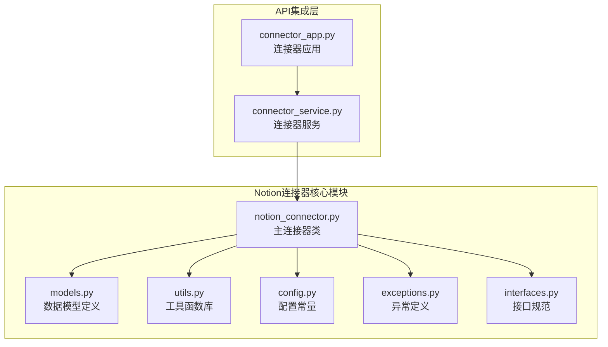
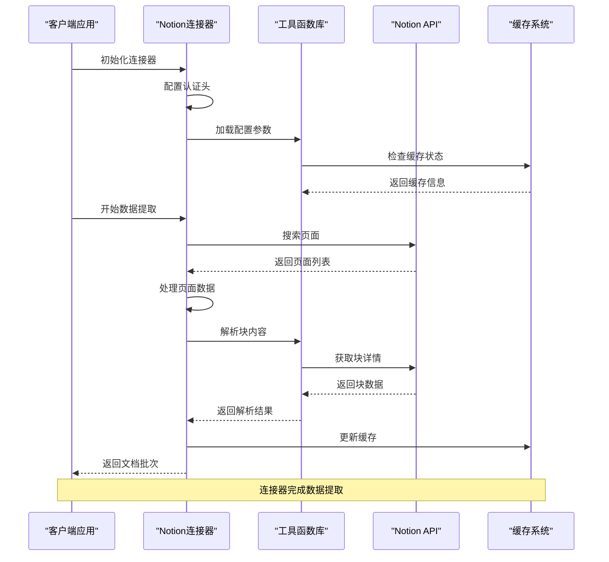
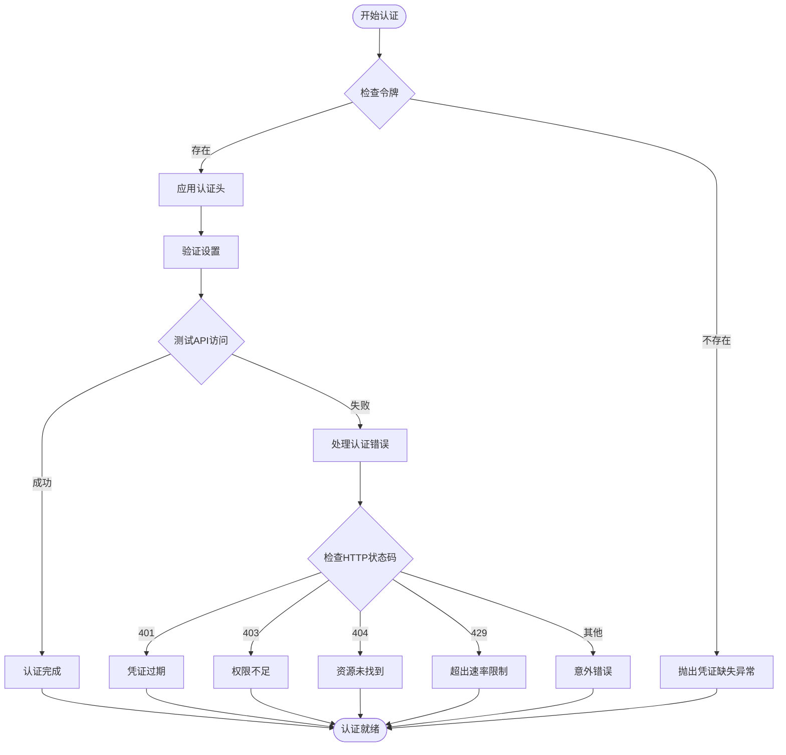
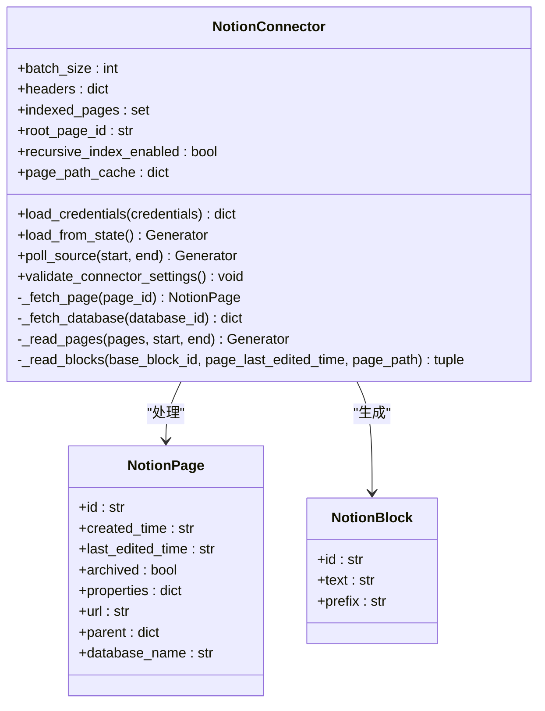
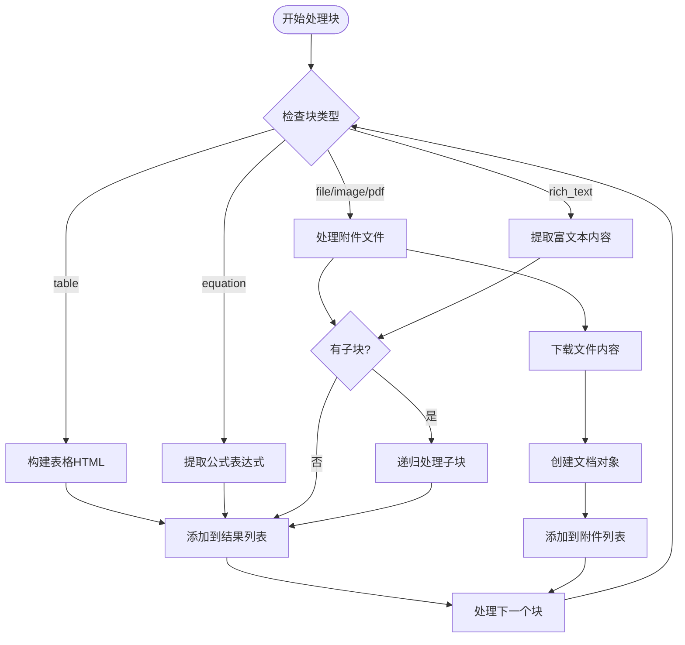
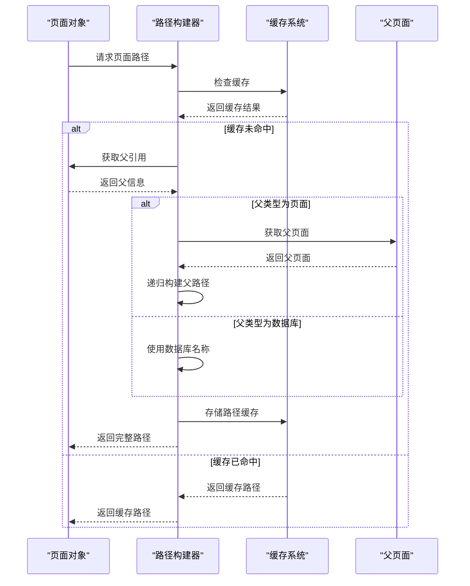
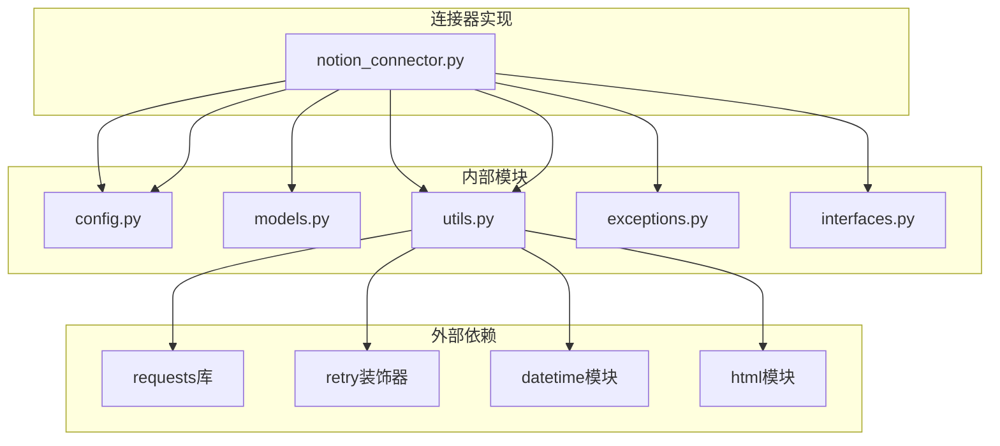

# Notion连接器

<cite>
**本文档引用的文件**
- [notion_connector.py](file://common/data_source/notion_connector.py)
- [models.py](file://common/data_source/models.py)
- [config.py](file://common/data_source/config.py)
- [utils.py](file://common/data_source/utils.py)
- [exceptions.py](file://common/data_source/exceptions.py)
- [interfaces.py](file://common/data_source/interfaces.py)
- [connector_service.py](file://api/db/services/connector_service.py)
- [connector_app.py](file://api/apps/connector_app.py)
</cite>

## 目录
1. [简介](#简介)
2. [项目结构](#项目结构)
3. [核心组件](#核心组件)
4. [架构概览](#架构概览)
5. [详细组件分析](#详细组件分析)
6. [依赖关系分析](#依赖关系分析)
7. [性能考虑](#性能考虑)
8. [故障排除指南](#故障排除指南)
9. [结论](#结论)
10. [附录](#附录)

## 简介

Notion连接器是RAGFlow系统中用于从Notion平台提取和索引内容的核心组件。该连接器实现了完整的Notion Integration API集成功能，支持OAuth认证流程和API密钥配置，能够深度解析Notion的核心概念如数据库、页面、块（Block）等，并提供强大的块级内容处理能力。

该连接器采用现代化的设计模式，支持递归页面索引、批量处理、错误重试机制和性能优化策略。通过统一的接口设计，它能够无缝集成到RAGFlow的数据源生态系统中，为用户提供从Notion平台获取高质量文档内容的能力。

## 项目结构

Notion连接器位于RAGFlow项目的common/data_source目录下，采用模块化设计，主要包含以下关键文件：



**图表来源**
- [notion_connector.py:1-656](file://common/data_source/notion_connector.py#L1-L656)
- [models.py:1-314](file://common/data_source/models.py#L1-L314)
- [utils.py:1-1286](file://common/data_source/utils.py#L1-L1286)

**章节来源**
- [notion_connector.py:1-656](file://common/data_source/notion_connector.py#L1-L656)
- [models.py:1-314](file://common/data_source/models.py#L1-L314)

## 核心组件

### NotionConnector类

NotionConnector是连接器的核心实现类，继承自LoadConnector和PollConnector接口，提供了完整的Notion数据提取功能。

**主要特性：**
- 支持递归页面索引和批量处理
- 实现了完整的OAuth认证流程
- 提供块级内容解析和转换
- 支持数据库和页面的统一处理
- 具备错误处理和重试机制

**关键属性：**
- `batch_size`: 批处理大小，默认使用INDEX_BATCH_SIZE配置
- `headers`: HTTP请求头，包含Notion API版本信息
- `indexed_pages`: 已索引页面集合，防止重复处理
- `root_page_id`: 根页面ID，用于递归索引
- `recursive_index_enabled`: 是否启用递归索引
- `page_path_cache`: 页面路径缓存，优化层级结构构建

**章节来源**
- [notion_connector.py:46-70](file://common/data_source/notion_connector.py#L46-L70)

### 数据模型

连接器使用了专门的数据模型来表示Notion的内容结构：

**NotionPage模型**：表示Notion页面对象，包含页面的基本信息、属性和父引用
**NotionBlock模型**：表示Notion块对象，包含块ID、文本内容和前缀信息  
**NotionSearchResponse模型**：表示Notion搜索API的响应结构
**Document模型**：通用文档模型，用于输出标准化的文档格式

**章节来源**
- [models.py:177-207](file://common/data_source/models.py#L177-L207)

## 架构概览

Notion连接器采用分层架构设计，确保了良好的可维护性和扩展性：



**图表来源**
- [notion_connector.py:560-580](file://common/data_source/notion_connector.py#L560-L580)
- [utils.py:813-829](file://common/data_source/utils.py#L813-L829)

**章节来源**
- [notion_connector.py:546-580](file://common/data_source/notion_connector.py#L546-L580)

## 详细组件分析

### 认证与配置管理

Notion连接器支持多种认证方式，但主要使用API密钥进行身份验证：



**图表来源**
- [notion_connector.py:606-645](file://common/data_source/notion_connector.py#L606-L645)

**章节来源**
- [notion_connector.py:555-559](file://common/data_source/notion_connector.py#L555-L559)
- [notion_connector.py:606-645](file://common/data_source/notion_connector.py#L606-L645)

### 页面与数据库处理

连接器能够智能区分和处理页面与数据库两种不同的Notion对象：



**图表来源**
- [notion_connector.py:46-69](file://common/data_source/notion_connector.py#L46-L69)
- [models.py:177-195](file://common/data_source/models.py#L177-L195)

**章节来源**
- [notion_connector.py:96-118](file://common/data_source/notion_connector.py#L96-L118)
- [notion_connector.py:136-167](file://common/data_source/notion_connector.py#L136-L167)

### 块级内容处理机制

Notion连接器实现了复杂的块级内容处理逻辑，能够解析各种类型的块并转换为统一的文本格式：



**图表来源**
- [notion_connector.py:311-434](file://common/data_source/notion_connector.py#L311-L434)
- [notion_connector.py:278-310](file://common/data_source/notion_connector.py#L278-L310)

**章节来源**
- [notion_connector.py:311-434](file://common/data_source/notion_connector.py#L311-L434)
- [notion_connector.py:278-310](file://common/data_source/notion_connector.py#L278-L310)

### 层级结构处理

连接器提供了智能的层级结构处理能力，能够将嵌套的页面结构转换为扁平化的文档结构：



**图表来源**
- [notion_connector.py:448-475](file://common/data_source/notion_connector.py#L448-L475)

**章节来源**
- [notion_connector.py:448-475](file://common/data_source/notion_connector.py#L448-L475)

## 依赖关系分析

Notion连接器的依赖关系体现了清晰的分层架构：



**图表来源**
- [notion_connector.py:11-43](file://common/data_source/notion_connector.py#L11-L43)
- [utils.py:1-35](file://common/data_source/utils.py#L1-L35)

**章节来源**
- [notion_connector.py:11-43](file://common/data_source/notion_connector.py#L11-L43)

### 配置参数详解

连接器支持多种配置参数来控制行为：

**环境变量配置：**
- `NOTION_CONNECTOR_DISABLE_RECURSIVE_PAGE_LOOKUP`: 禁用递归页面查找
- `REQUEST_TIMEOUT_SECONDS`: 请求超时时间（默认60秒）
- `INDEX_BATCH_SIZE`: 索引批处理大小（默认2）

**运行时参数：**
- `batch_size`: 批处理大小
- `recursive_index_enabled`: 是否启用递归索引
- `root_page_id`: 根页面ID

**章节来源**
- [config.py:119-122](file://common/data_source/config.py#L119-L122)
- [config.py:103](file://common/data_source/config.py#L103)
- [config.py:17](file://common/data_source/config.py#L17)

## 性能考虑

Notion连接器在设计时充分考虑了性能优化：

### 批处理策略
- 默认批处理大小为2，平衡内存使用和网络效率
- 支持动态调整批处理大小以适应不同场景
- 使用生成器模式避免一次性加载大量数据

### 缓存机制
- 页面路径缓存：避免重复查询父页面信息
- 已索引页面集合：防止重复处理相同页面
- 文件下载缓存：减少重复的文件下载操作

### 错误处理与重试
- 自动重试机制：对临时性错误进行自动重试
- 指数退避算法：避免对Notion API造成过大压力
- 超时控制：合理设置请求超时时间

### 内存管理
- 流式处理：逐批处理数据，避免内存溢出
- 及时释放资源：使用上下文管理器确保资源正确释放
- 对象复用：重用解析器和其他昂贵对象

## 故障排除指南

### 常见问题及解决方案

**认证相关问题：**
- 401错误：检查API密钥是否正确配置
- 403错误：确认用户具有足够的权限访问目标页面
- 404错误：验证页面ID或数据库ID的有效性

**性能相关问题：**
- 429错误：实现指数退避和限流策略
- 超时错误：增加REQUEST_TIMEOUT_SECONDS环境变量值
- 内存不足：减小INDEX_BATCH_SIZE配置

**数据处理问题：**
- 页面循环引用：连接器会自动检测并处理循环引用
- 不支持的块类型：跳过不支持的块类型并记录警告
- 编码问题：自动检测和处理不同的文本编码

**章节来源**
- [notion_connector.py:629-644](file://common/data_source/notion_connector.py#L629-L644)
- [exceptions.py:4-30](file://common/data_source/exceptions.py#L4-L30)

### 调试技巧

1. **启用详细日志**：检查连接器的日志输出以了解处理过程
2. **验证API访问**：使用简单的API调用来测试连接性
3. **检查网络连接**：确保能够访问Notion API端点
4. **监控资源使用**：观察内存和CPU使用情况

## 结论

Notion连接器是一个功能完整、设计精良的数据提取组件，它成功地解决了从Notion平台获取和索引内容的复杂需求。通过采用现代化的架构设计、完善的错误处理机制和性能优化策略，该连接器为RAGFlow系统提供了可靠的Notion内容集成能力。

其核心优势包括：
- 完整的Notion Integration API支持
- 智能的块级内容处理机制
- 灵活的递归页面索引功能
- 高效的缓存和批处理策略
- 丰富的错误处理和调试能力

随着RAGFlow生态系统的不断发展，Notion连接器将继续演进，为用户提供更加稳定和高效的Notion内容集成体验。

## 附录

### 使用示例

**基本配置：**
```python
# 设置环境变量
export NOTION_INTEGRATION_TOKEN="your_integration_token"
export NOTION_ROOT_PAGE_ID="your_root_page_id"

# 创建连接器实例
connector = NotionConnector(
    batch_size=2,
    recursive_index_enabled=True,
    root_page_id="your_root_page_id"
)

# 加载凭证
connector.load_credentials({
    "notion_integration_token": os.environ.get("NOTION_INTEGRATION_TOKEN")
})
```

**高级配置：**
```python
# 禁用递归索引
connector = NotionConnector(
    recursive_index_enabled=False
)

# 自定义批处理大小
connector = NotionConnector(
    batch_size=10
)
```

### API参考

**主要方法：**
- `load_credentials()`: 加载认证凭证
- `load_from_state()`: 从状态加载数据
- `poll_source()`: 轮询更新的数据
- `validate_connector_settings()`: 验证连接器设置

**返回类型：**
- `GenerateDocumentsOutput`: 文档生成器输出
- `NotionPage`: Notion页面对象
- `NotionBlock`: Notion块对象
- `Document`: 标准化文档对象