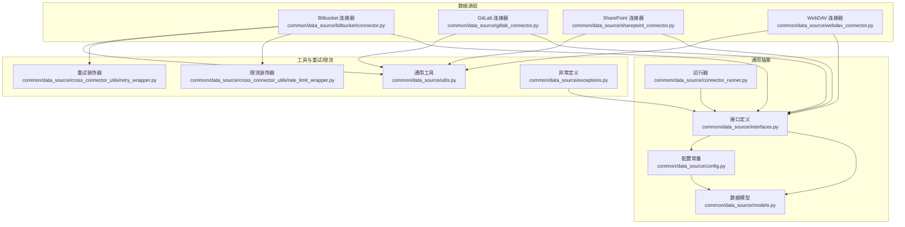
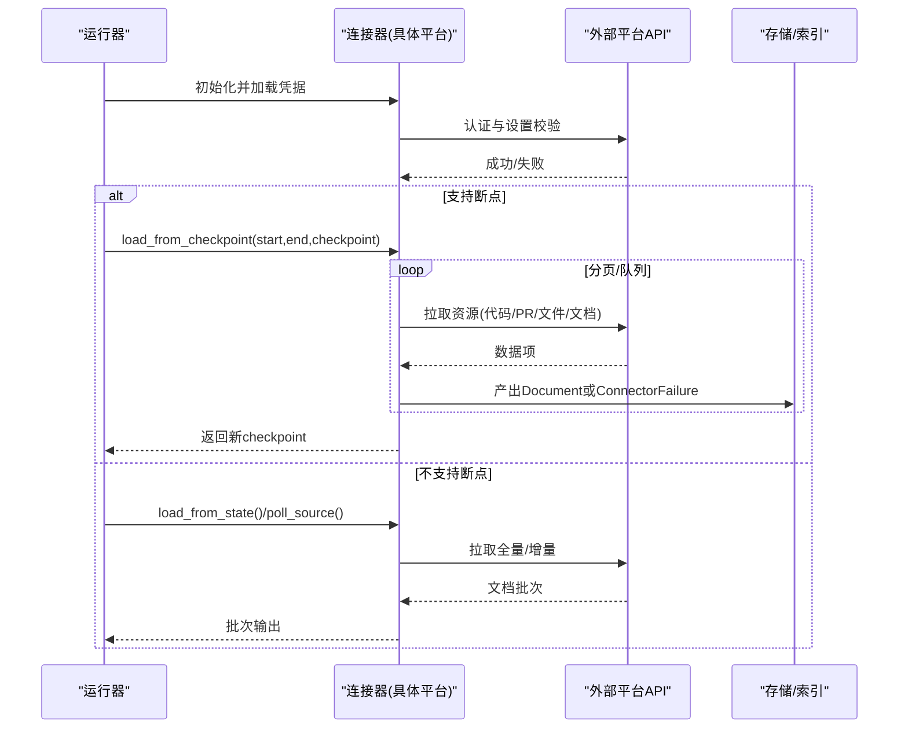
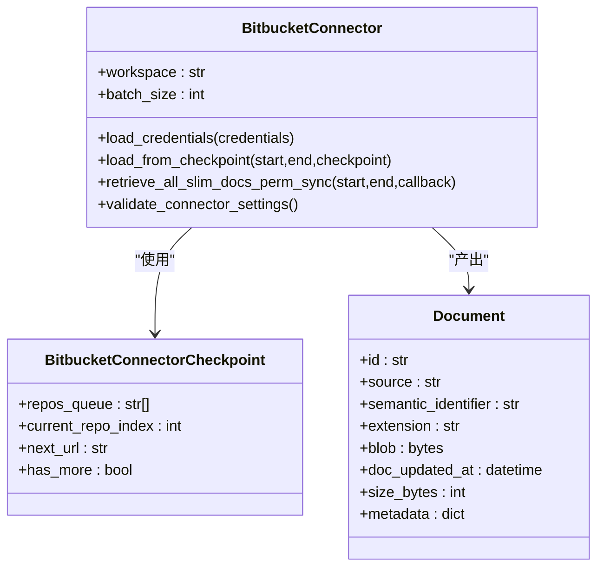
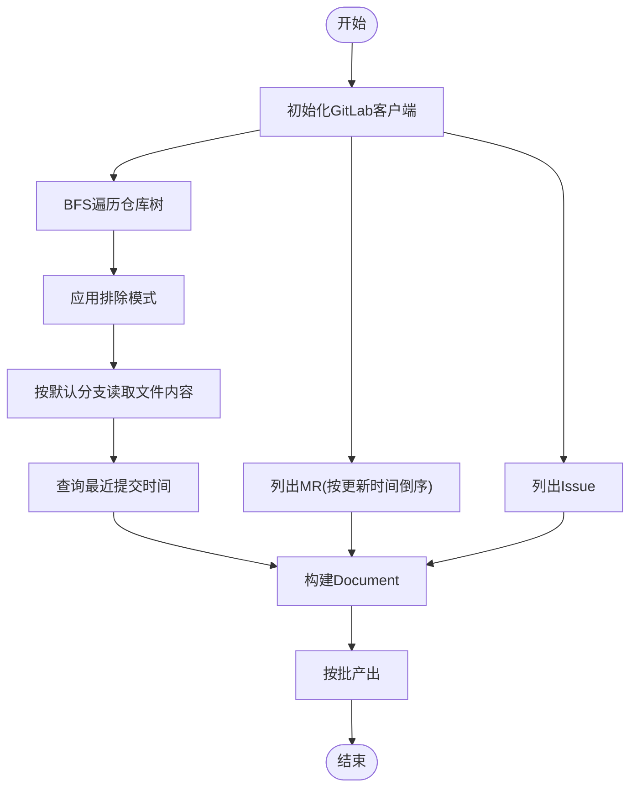
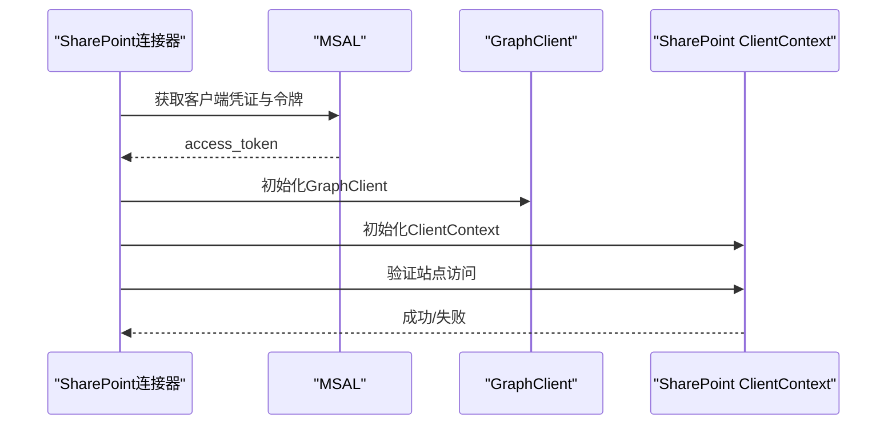
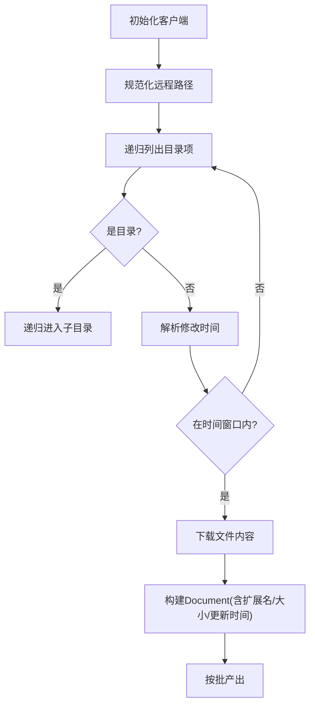
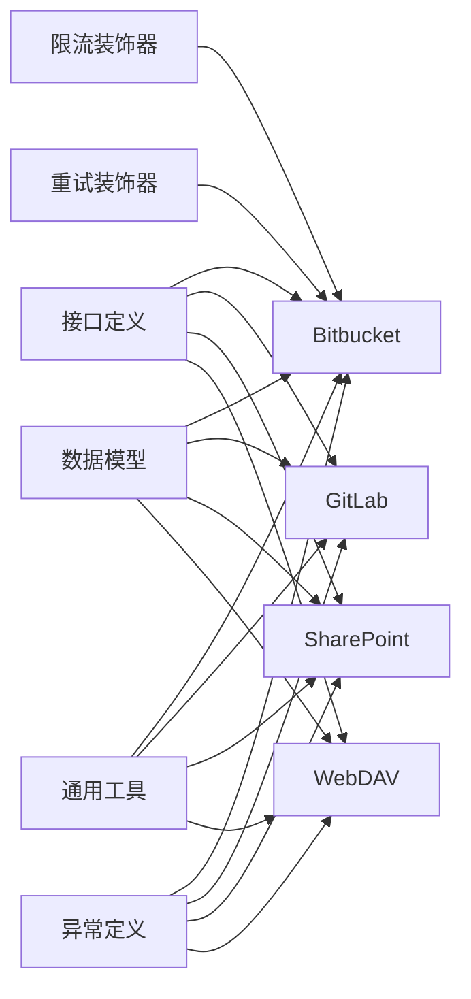

# 协作平台连接器

<cite>
**本文引用的文件**
- [common/data_source/bitbucket/connector.py](file://common/data_source/bitbucket/connector.py)
- [common/data_source/bitbucket/utils.py](file://common/data_source/bitbucket/utils.py)
- [common/data_source/gitlab_connector.py](file://common/data_source/gitlab_connector.py)
- [common/data_source/sharepoint_connector.py](file://common/data_source/sharepoint_connector.py)
- [common/data_source/webdav_connector.py](file://common/data_source/webdav_connector.py)
- [common/data_source/config.py](file://common/data_source/config.py)
- [common/data_source/interfaces.py](file://common/data_source/interfaces.py)
- [common/data_source/models.py](file://common/data_source/models.py)
- [common/data_source/connector_runner.py](file://common/data_source/connector_runner.py)
- [common/data_source/exceptions.py](file://common/data_source/exceptions.py)
- [common/data_source/utils.py](file://common/data_source/utils.py)
- [common/data_source/cross_connector_utils/rate_limit_wrapper.py](file://common/data_source/cross_connector_utils/rate_limit_wrapper.py)
- [common/data_source/cross_connector_utils/retry_wrapper.py](file://common/data_source/cross_connector_utils/retry_wrapper.py)
</cite>

## 目录
1. [简介](#简介)
2. [项目结构](#项目结构)
3. [核心组件](#核心组件)
4. [架构总览](#架构总览)
5. [详细组件分析](#详细组件分析)
6. [依赖关系分析](#依赖关系分析)
7. [性能考量](#性能考量)
8. [故障排查指南](#故障排查指南)
9. [结论](#结论)
10. [附录](#附录)

## 简介
本文件面向协作平台连接器的实现与使用，聚焦于 Bitbucket、GitLab、SharePoint、WebDAV 四类平台的 API 集成方式，系统阐述以下内容：
- 代码仓库、版本控制、文档库、文件夹结构等协作概念的获取与解析方法
- 平台特有权限模型的处理与访问控制规则的继承与转换
- 文件版本管理与变更历史的处理机制
- 配置参数说明与使用示例（服务器配置、认证方式、同步策略）
- 大型代码库与文档库的性能优化策略

## 项目结构
协作平台连接器位于 common/data_source 下，采用按平台分目录的组织方式，并通过统一接口与模型进行抽象，便于扩展与复用。

**图表来源**
- [common/data_source/bitbucket/connector.py:58-388](file://common/data_source/bitbucket/connector.py#L58-L388)
- [common/data_source/gitlab_connector.py:161-340](file://common/data_source/gitlab_connector.py#L161-L340)
- [common/data_source/sharepoint_connector.py:21-121](file://common/data_source/sharepoint_connector.py#L21-L121)
- [common/data_source/webdav_connector.py:23-401](file://common/data_source/webdav_connector.py#L23-L401)
- [common/data_source/interfaces.py:21-420](file://common/data_source/interfaces.py#L21-L420)
- [common/data_source/models.py:88-314](file://common/data_source/models.py#L88-L314)
- [common/data_source/config.py:41-303](file://common/data_source/config.py#L41-L303)
- [common/data_source/connector_runner.py:91-217](file://common/data_source/connector_runner.py#L91-L217)
- [common/data_source/cross_connector_utils/rate_limit_wrapper.py:18-126](file://common/data_source/cross_connector_utils/rate_limit_wrapper.py#L18-L126)
- [common/data_source/cross_connector_utils/retry_wrapper.py:16-88](file://common/data_source/cross_connector_utils/retry_wrapper.py#L16-L88)

**章节来源**
- [common/data_source/config.py:41-66](file://common/data_source/config.py#L41-L66)
- [common/data_source/interfaces.py:21-103](file://common/data_source/interfaces.py#L21-L103)
- [common/data_source/models.py:88-155](file://common/data_source/models.py#L88-L155)

## 核心组件
- 接口体系：统一抽象加载、轮询、检查点、权限同步等能力，确保不同平台连接器的一致行为契约。
- 数据模型：Document/SlimDocument/ConnectorCheckpoint/ExternalAccess 等，支撑文档元数据、权限信息与断点恢复。
- 工具与策略：重试与限流装饰器、时间解析、文件类型判定、批量生成等，提升稳定性与性能。
- 运行器：封装断点迭代、批次聚合、异常日志化，简化上层调用。

**章节来源**
- [common/data_source/interfaces.py:21-103](file://common/data_source/interfaces.py#L21-L103)
- [common/data_source/models.py:88-155](file://common/data_source/models.py#L88-L155)
- [common/data_source/connector_runner.py:91-217](file://common/data_source/connector_runner.py#L91-L217)
- [common/data_source/cross_connector_utils/retry_wrapper.py:16-88](file://common/data_source/cross_connector_utils/retry_wrapper.py#L16-L88)
- [common/data_source/cross_connector_utils/rate_limit_wrapper.py:18-84](file://common/data_source/cross_connector_utils/rate_limit_wrapper.py#L18-L84)

## 架构总览
下图展示各连接器与通用抽象之间的交互关系，以及断点与权限同步的关键流程。

**图表来源**
- [common/data_source/connector_runner.py:119-195](file://common/data_source/connector_runner.py#L119-L195)
- [common/data_source/interfaces.py:21-103](file://common/data_source/interfaces.py#L21-L103)
- [common/data_source/models.py:130-155](file://common/data_source/models.py#L130-L155)

## 详细组件分析

### Bitbucket 连接器
- 能力概览
  - 基于工作区/项目/仓库维度枚举拉取 Pull Requests
  - 支持断点续传与分页，按时间窗口过滤
  - 提供精简文档 ID 列表用于权限同步
  - 统一映射为 Document，包含作者、评审人、分支、状态等元信息
- 关键实现要点
  - 断点模型：repos_queue、current_repo_index、next_url
  - 参数构建：时间范围查询、状态集合、字段裁剪
  - 分页迭代：基于 next URL 的可恢复遍历
  - 权限同步：retrieve_all_slim_docs_perm_sync 输出精简文档 ID
- 错误处理
  - 凭据缺失、过期、权限不足、意外状态码均抛出结构化异常

**图表来源**
- [common/data_source/bitbucket/connector.py:44-90](file://common/data_source/bitbucket/connector.py#L44-L90)
- [common/data_source/bitbucket/connector.py:182-256](file://common/data_source/bitbucket/connector.py#L182-L256)
- [common/data_source/models.py:88-101](file://common/data_source/models.py#L88-L101)

**章节来源**
- [common/data_source/bitbucket/connector.py:58-388](file://common/data_source/bitbucket/connector.py#L58-L388)
- [common/data_source/bitbucket/utils.py:181-288](file://common/data_source/bitbucket/utils.py#L181-L288)
- [common/data_source/exceptions.py:4-30](file://common/data_source/exceptions.py#L4-L30)

### GitLab 连接器
- 能力概览
  - 支持 MR、Issue、代码文件三类对象的增量/全量抓取
  - 使用 BFS 遍历仓库树以避免递归深度问题
  - 增量窗口过滤：基于更新时间与提交历史
  - 可选排除路径模式（如 CI/日志）
- 关键实现要点
  - 客户端初始化：私有令牌 + 服务地址
  - 代码文件：按默认分支读取内容，优先使用最近一次提交时间作为更新时间
  - MR/Issue：统一映射为 Document，保留状态、类型、链接等元信息
- 性能与稳定性
  - 批量生成器与队列驱动，降低内存占用
  - 严格的时间窗口过滤，减少重复同步

**图表来源**
- [common/data_source/gitlab_connector.py:218-305](file://common/data_source/gitlab_connector.py#L218-L305)
- [common/data_source/gitlab_connector.py:97-154](file://common/data_source/gitlab_connector.py#L97-L154)

**章节来源**
- [common/data_source/gitlab_connector.py:161-340](file://common/data_source/gitlab_connector.py#L161-L340)
- [common/data_source/utils.py:508-511](file://common/data_source/utils.py#L508-L511)

### SharePoint 连接器
- 能力概览
  - 使用 MSAL 获取访问令牌，同时建立 Graph 与 SharePoint 客户端
  - 提供站点验证、轮询、断点加载与权限同步接口占位
- 当前状态
  - 示例化实现，核心业务逻辑（实际拉取与权限同步）留空，便于后续扩展

**图表来源**
- [common/data_source/sharepoint_connector.py:21-121](file://common/data_source/sharepoint_connector.py#L21-L121)

**章节来源**
- [common/data_source/sharepoint_connector.py:21-121](file://common/data_source/sharepoint_connector.py#L21-L121)

### WebDAV 连接器
- 能力概览
  - 支持用户名/密码认证，递归列出远程路径下的文件
  - 基于修改时间的增量过滤，支持大小阈值限制
  - 将文件内容下载为字节流，构建 Document
- 关键实现要点
  - 路径规范化与尾部斜杠处理
  - 修改时间解析兼容多种格式
  - 同名文件相对路径语义化标识
  - 设置是否允许图片处理的开关

**图表来源**
- [common/data_source/webdav_connector.py:93-167](file://common/data_source/webdav_connector.py#L93-L167)
- [common/data_source/webdav_connector.py:168-272](file://common/data_source/webdav_connector.py#L168-L272)

**章节来源**
- [common/data_source/webdav_connector.py:23-401](file://common/data_source/webdav_connector.py#L23-L401)

## 依赖关系分析
- 统一接口与模型
  - 所有连接器遵循 LoadConnector/PollConnector/CheckpointedConnector 等接口，保证行为一致性
  - Document/SlimDocument/ConnectorCheckpoint/ExternalAccess 等模型贯穿各平台
- 通用工具与策略
  - 重试与限流装饰器为 Bitbucket 提供透明的稳定性保障
  - 时间解析、文件类型判定、编码检测等工具被多平台共享
- 异常体系
  - 结构化异常类型覆盖凭据缺失、过期、权限不足、意外状态等

**图表来源**
- [common/data_source/interfaces.py:21-103](file://common/data_source/interfaces.py#L21-L103)
- [common/data_source/models.py:88-155](file://common/data_source/models.py#L88-L155)
- [common/data_source/cross_connector_utils/rate_limit_wrapper.py:18-84](file://common/data_source/cross_connector_utils/rate_limit_wrapper.py#L18-L84)
- [common/data_source/cross_connector_utils/retry_wrapper.py:16-88](file://common/data_source/cross_connector_utils/retry_wrapper.py#L16-L88)
- [common/data_source/utils.py:508-511](file://common/data_source/utils.py#L508-L511)
- [common/data_source/exceptions.py:4-30](file://common/data_source/exceptions.py#L4-L30)

**章节来源**
- [common/data_source/interfaces.py:21-103](file://common/data_source/interfaces.py#L21-L103)
- [common/data_source/models.py:88-155](file://common/data_source/models.py#L88-L155)
- [common/data_source/exceptions.py:4-30](file://common/data_source/exceptions.py#L4-L30)

## 性能考量
- 批量与分页
  - 统一批处理大小（INDEX_BATCH_SIZE），降低内存峰值与网络往返
  - Bitbucket/GitLab/WebDAV 均采用分页/队列驱动，避免一次性加载全部数据
- 增量同步
  - 基于时间窗口过滤（updated_at/修改时间），仅同步变更
  - GitLab 优先使用最近提交时间，提高准确性
- 限流与重试
  - Bitbucket 使用速率限制与指数退避重试，避免触发平台限流
- 大文件与体积控制
  - WebDAV 支持大小阈值，超过阈值跳过，防止内存溢出
  - S3/Blob 存储读取带上限流与分块读取
- 并发与线程池
  - 通用工具提供并发执行框架，可在适配场景中引入（需结合平台 API 特性）

**章节来源**
- [common/data_source/config.py:102-104](file://common/data_source/config.py#L102-L104)
- [common/data_source/bitbucket/utils.py:83-125](file://common/data_source/bitbucket/utils.py#L83-L125)
- [common/data_source/webdav_connector.py:306-361](file://common/data_source/webdav_connector.py#L306-L361)
- [common/data_source/utils.py:349-380](file://common/data_source/utils.py#L349-L380)

## 故障排查指南
- 凭据与认证
  - 缺失凭据：抛出 ConnectorMissingCredentialError
  - 凭据过期/无效：抛出 CredentialExpiredError
  - 权限不足：抛出 InsufficientPermissionsError
  - 其他异常：抛出 UnexpectedValidationError 或 ConnectorValidationError
- 常见症状与定位
  - Bitbucket：429/5xx 触发重试；401/403 明确报错；检查 email/api_token 与 workspace 权限
  - GitLab：私有令牌与项目可见性；状态过滤与时间窗口导致的空结果
  - SharePoint：MSAL 获取令牌失败或 Graph/SharePoint 客户端初始化异常
  - WebDAV：路径不存在/不可读、认证失败、修改时间解析失败
- 日志与诊断
  - 运行器捕获异常并记录局部变量，便于快速定位上下文
  - 验证接口对真实行为路径进行测试（如 WebDAV 的 ls 行为）

**章节来源**
- [common/data_source/exceptions.py:4-30](file://common/data_source/exceptions.py#L4-L30)
- [common/data_source/connector_runner.py:196-217](file://common/data_source/connector_runner.py#L196-L217)
- [common/data_source/bitbucket/connector.py:304-347](file://common/data_source/bitbucket/connector.py#L304-L347)
- [common/data_source/gitlab_connector.py:187-217](file://common/data_source/gitlab_connector.py#L187-L217)
- [common/data_source/sharepoint_connector.py:63-78](file://common/data_source/sharepoint_connector.py#L63-L78)
- [common/data_source/webdav_connector.py:306-361](file://common/data_source/webdav_connector.py#L306-L361)

## 结论
本实现以统一接口与模型为核心，围绕 Bitbucket、GitLab、SharePoint、WebDAV 提供了可扩展、可恢复、可增量的连接器方案。通过重试与限流、时间窗口过滤、批量处理与体积控制等策略，兼顾了正确性与性能。未来可在 SharePoint 等平台完善业务拉取与权限同步逻辑，进一步增强生态覆盖。

## 附录

### 配置参数与使用示例

- 通用配置
  - 请求超时：REQUEST_TIMEOUT_SECONDS（秒）
  - 索引批大小：INDEX_BATCH_SIZE
  - 大文件阈值：BLOB_STORAGE_SIZE_THRESHOLD（字节）
  - 图像类型白名单/黑名单：IMAGE_MIME_TYPES、EXCLUDED_IMAGE_TYPES
  - 文件扩展类型判定：OnyxExtensionType（Plain/Document/Multimedia）

- Bitbucket
  - 凭据：bitbucket_email、bitbucket_api_token
  - 配置：workspace、repositories（逗号分隔）、projects（逗号分隔）、batch_size
  - 行为：按时间窗口枚举 PR，支持断点续传与权限同步

- GitLab
  - 凭据：gitlab_url、gitlab_access_token
  - 配置：project_owner、project_name、batch_size、state_filter、include_mrs、include_issues、include_code_files
  - 行为：BFS 遍历仓库树，增量过滤 MR/Issue/代码文件

- SharePoint
  - 凭据：tenant_id、client_id、client_secret、site_url
  - 行为：MSAL 获取令牌，Graph/SharePoint 客户端初始化与站点验证

- WebDAV
  - 凭据：username、password
  - 配置：base_url、remote_path、batch_size
  - 行为：递归列出并下载文件，按修改时间与大小阈值过滤

**章节来源**
- [common/data_source/config.py:17-104](file://common/data_source/config.py#L17-L104)
- [common/data_source/bitbucket/connector.py:71-90](file://common/data_source/bitbucket/connector.py#L71-L90)
- [common/data_source/gitlab_connector.py:162-179](file://common/data_source/gitlab_connector.py#L162-L179)
- [common/data_source/sharepoint_connector.py:29-58](file://common/data_source/sharepoint_connector.py#L29-L58)
- [common/data_source/webdav_connector.py:26-51](file://common/data_source/webdav_connector.py#L26-L51)