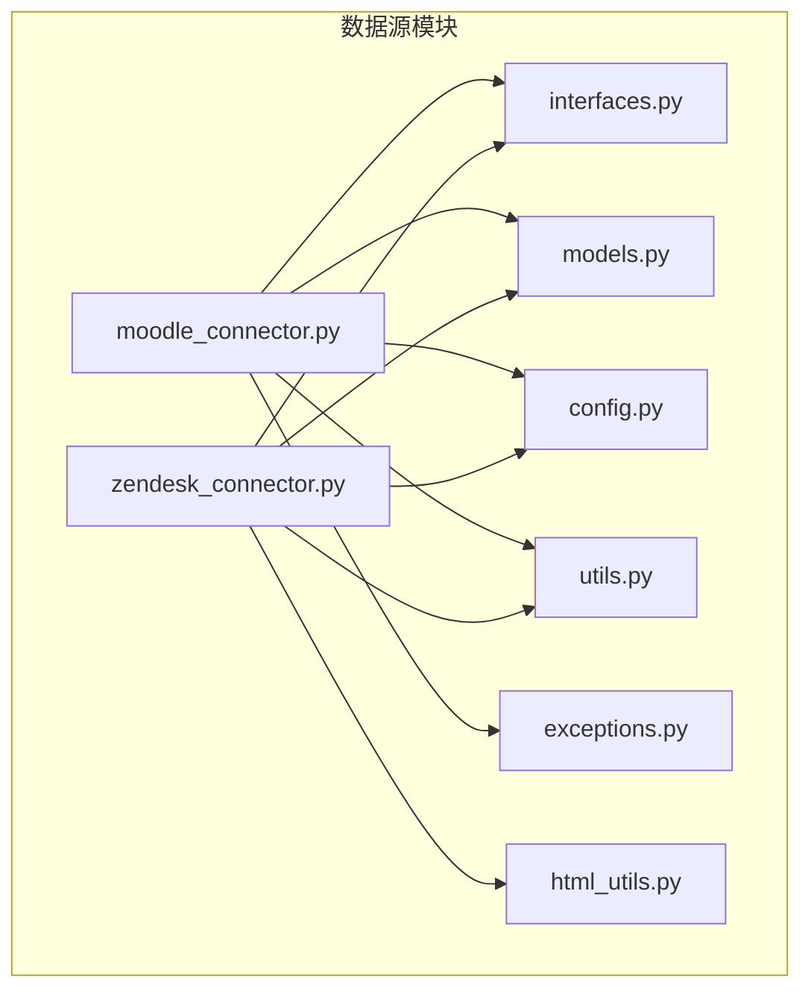
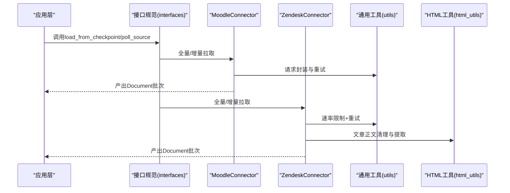
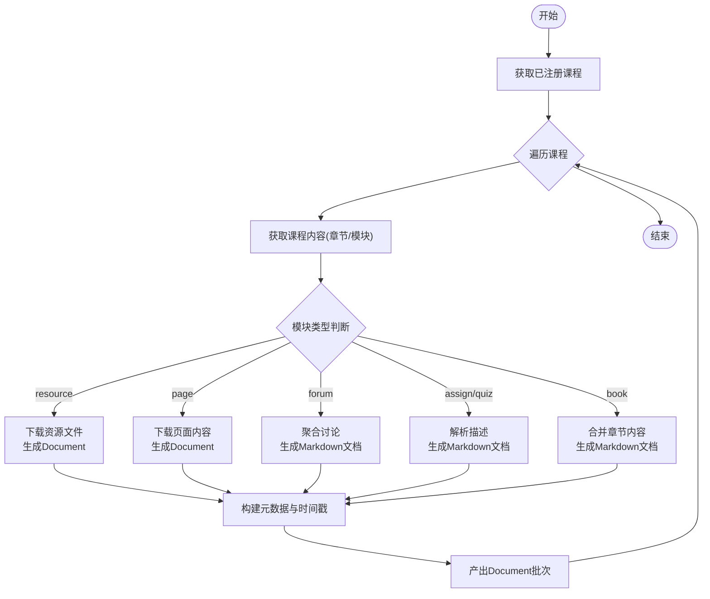
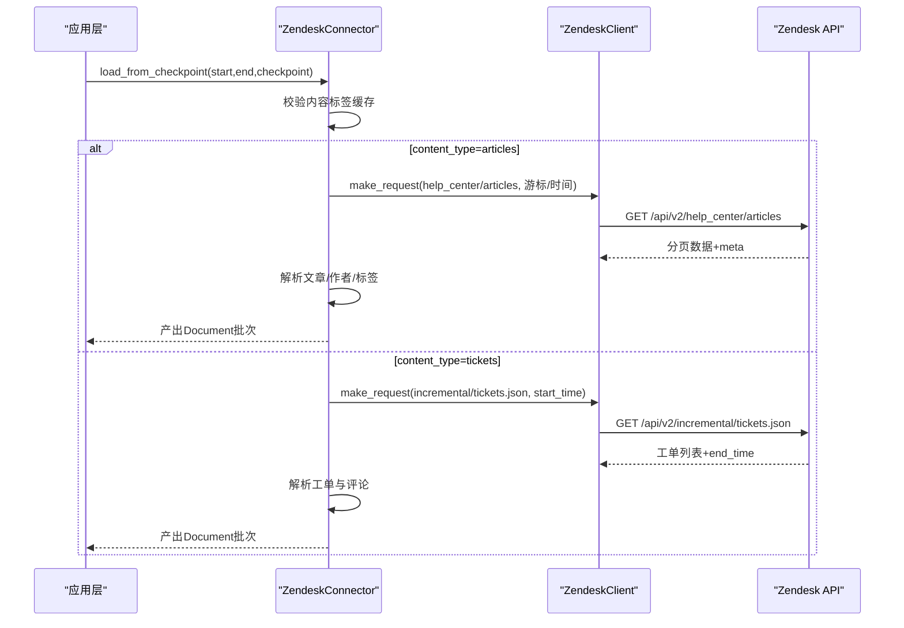
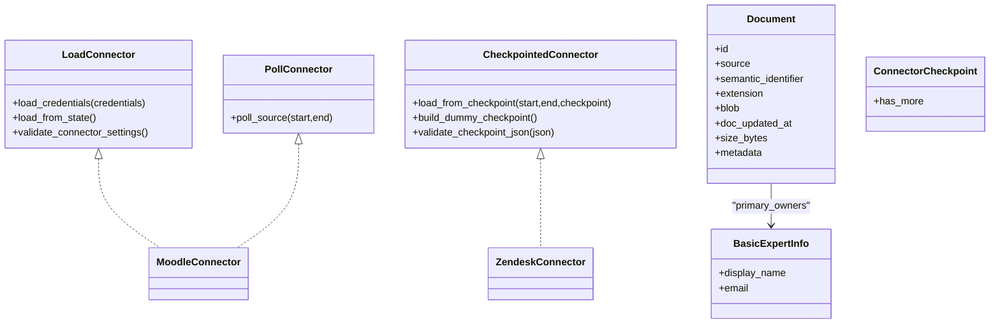
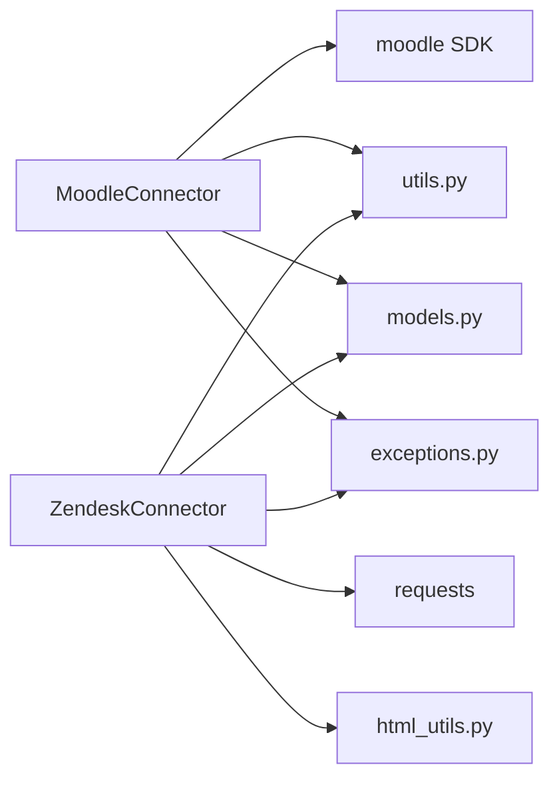

# 学习管理连接器

<cite>
**本文档引用的文件**
- [moodle_connector.py](file://common/data_source/moodle_connector.py)
- [zendesk_connector.py](file://common/data_source/zendesk_connector.py)
- [interfaces.py](file://common/data_source/interfaces.py)
- [models.py](file://common/data_source/models.py)
- [config.py](file://common/data_source/config.py)
- [utils.py](file://common/data_source/utils.py)
- [exceptions.py](file://common/data_source/exceptions.py)
- [html_utils.py](file://common/data_source/html_utils.py)
</cite>

## 目录
1. [简介](#简介)
2. [项目结构](#项目结构)
3. [核心组件](#核心组件)
4. [架构总览](#架构总览)
5. [详细组件分析](#详细组件分析)
6. [依赖分析](#依赖分析)
7. [性能考虑](#性能考虑)
8. [故障排查指南](#故障排查指南)
9. [结论](#结论)
10. [附录](#附录)

## 简介
本文件为学习管理连接器的实现文档，聚焦于两个关键系统：Moodle LMS（学习管理系统）与 Zendesk 支持系统。文档详细说明了以下内容：
- Moodle 课程、学习材料、用户活动、作业/测验等教育资源的获取与解析流程
- Zendesk 工单与帮助中心文章的抓取、分页与增量同步策略
- 数据模型设计与时间戳处理、元数据映射、权限与作者信息缓存
- 配置参数、环境变量与使用示例
- 教育与企业客服场景的最佳实践与注意事项

## 项目结构
学习管理连接器位于数据源模块中，采用“按系统拆分”的组织方式，每个系统一个独立的连接器类，统一遵循接口规范与通用工具。

**图表来源**
- [moodle_connector.py:1-540](file://common/data_source/moodle_connector.py#L1-L540)
- [zendesk_connector.py:1-667](file://common/data_source/zendesk_connector.py#L1-L667)
- [interfaces.py:1-420](file://common/data_source/interfaces.py#L1-L420)
- [models.py:1-314](file://common/data_source/models.py#L1-L314)
- [config.py:1-303](file://common/data_source/config.py#L1-L303)
- [utils.py:1-1286](file://common/data_source/utils.py#L1-L1286)
- [exceptions.py:1-30](file://common/data_source/exceptions.py#L1-L30)
- [html_utils.py:1-220](file://common/data_source/html_utils.py#L1-L220)

**章节来源**
- [moodle_connector.py:1-540](file://common/data_source/moodle_connector.py#L1-L540)
- [zendesk_connector.py:1-667](file://common/data_source/zendesk_connector.py#L1-L667)
- [interfaces.py:1-420](file://common/data_source/interfaces.py#L1-L420)
- [models.py:1-314](file://common/data_source/models.py#L1-L314)
- [config.py:1-303](file://common/data_source/config.py#L1-L303)
- [utils.py:1-1286](file://common/data_source/utils.py#L1-L1286)
- [exceptions.py:1-30](file://common/data_source/exceptions.py#L1-L30)
- [html_utils.py:1-220](file://common/data_source/html_utils.py#L1-L220)

## 核心组件
- Moodle 连接器（MoodleConnector）
  - 实现加载与轮询接口，支持全量拉取与增量更新
  - 解析课程结构、资源、页面、论坛、作业/测验、图书等模块类型
  - 统一生成文档对象，携带丰富的元数据与时间戳
- Zendesk 连接器（ZendeskConnector）
  - 支持帮助中心文章与工单两类内容的增量拉取
  - 基于游标与时间戳的分页策略，带速率限制与重试
  - 文章标签与作者信息缓存，提升性能与一致性

**章节来源**
- [moodle_connector.py:31-139](file://common/data_source/moodle_connector.py#L31-L139)
- [zendesk_connector.py:347-552](file://common/data_source/zendesk_connector.py#L347-L552)

## 架构总览
连接器遵循统一接口，通过检查点（Checkpoint）实现可恢复的增量同步；通用工具提供请求封装、重试与速率限制；HTML 工具用于帮助中心文章的文本提取。

**图表来源**
- [interfaces.py:21-103](file://common/data_source/interfaces.py#L21-L103)
- [moodle_connector.py:110-138](file://common/data_source/moodle_connector.py#L110-L138)
- [zendesk_connector.py:378-552](file://common/data_source/zendesk_connector.py#L378-L552)
- [utils.py:225-235](file://common/data_source/utils.py#L225-L235)
- [html_utils.py:162-220](file://common/data_source/html_utils.py#L162-L220)

## 详细组件分析

### Moodle 连接器（MoodleConnector）
- 初始化与凭据校验
  - 使用实例 URL 与 API Token 初始化客户端，并调用站点信息接口进行验证
  - 对无效令牌与权限不足进行专门异常处理
- 数据拉取
  - 全量：获取已注册课程，遍历课程内容（章节/模块），按类型解析
  - 增量：基于模块与文件的最新修改时间判断是否在时间窗口内更新
- 模块类型处理
  - 资源（resource）：下载文件内容，生成文档
  - 页面（page）：下载页面内容，生成文档
  - 讨论区（forum）：聚合讨论主题与内容，生成 Markdown 文档
  - 活动（assign/quiz）：解析描述文本，生成 Markdown 文档
  - 图书（book）：合并各章节内容，生成 Markdown 文档
- 元数据与时间戳
  - 统一记录课程、章节、模块、文件等标识与时间戳
  - 以最新时间戳作为文档更新时间，确保增量同步正确性

**图表来源**
- [moodle_connector.py:140-161](file://common/data_source/moodle_connector.py#L140-L161)
- [moodle_connector.py:162-199](file://common/data_source/moodle_connector.py#L162-L199)
- [moodle_connector.py:200-217](file://common/data_source/moodle_connector.py#L200-L217)
- [moodle_connector.py:219-278](file://common/data_source/moodle_connector.py#L219-L278)
- [moodle_connector.py:350-409](file://common/data_source/moodle_connector.py#L350-L409)
- [moodle_connector.py:411-458](file://common/data_source/moodle_connector.py#L411-L458)
- [moodle_connector.py:460-539](file://common/data_source/moodle_connector.py#L460-L539)

**章节来源**
- [moodle_connector.py:69-104](file://common/data_source/moodle_connector.py#L69-L104)
- [moodle_connector.py:110-138](file://common/data_source/moodle_connector.py#L110-L138)
- [moodle_connector.py:140-161](file://common/data_source/moodle_connector.py#L140-L161)
- [moodle_connector.py:162-199](file://common/data_source/moodle_connector.py#L162-L199)
- [moodle_connector.py:200-217](file://common/data_source/moodle_connector.py#L200-L217)
- [moodle_connector.py:219-278](file://common/data_source/moodle_connector.py#L219-L278)
- [moodle_connector.py:350-409](file://common/data_source/moodle_connector.py#L350-L409)
- [moodle_connector.py:411-458](file://common/data_source/moodle_connector.py#L411-L458)
- [moodle_connector.py:460-539](file://common/data_source/moodle_connector.py#L460-L539)

### Zendesk 连接器（ZendeskConnector）
- 客户端与认证
  - 使用子域、邮箱与令牌构造基础 URL 与认证信息
  - 包装请求函数，支持速率限制与重试，自动处理 429 与 403 等状态码
- 内容类型与拉取策略
  - 文章（articles）：基于游标分页，支持起止时间过滤
  - 工单（tickets）：基于增量接口，使用 end_time 作为下一次起点
- 文章与工单解析
  - 文章：提取标题、正文、标签、作者信息，生成纯文本文档
  - 工单：提取状态、优先级、标签、类型与评论，生成纯文本文档
- 缓存与性能
  - 内容标签映射与作者信息缓存，避免重复查询
  - 作者映射大小阈值控制，防止内存膨胀

**图表来源**
- [zendesk_connector.py:32-75](file://common/data_source/zendesk_connector.py#L32-L75)
- [zendesk_connector.py:105-139](file://common/data_source/zendesk_connector.py#L105-L139)
- [zendesk_connector.py:142-176](file://common/data_source/zendesk_connector.py#L142-L176)
- [zendesk_connector.py:200-246](file://common/data_source/zendesk_connector.py#L200-L246)
- [zendesk_connector.py:272-333](file://common/data_source/zendesk_connector.py#L272-L333)

**章节来源**
- [zendesk_connector.py:347-552](file://common/data_source/zendesk_connector.py#L347-L552)
- [zendesk_connector.py:361-376](file://common/data_source/zendesk_connector.py#L361-L376)
- [zendesk_connector.py:401-479](file://common/data_source/zendesk_connector.py#L401-L479)
- [zendesk_connector.py:481-552](file://common/data_source/zendesk_connector.py#L481-L552)
- [zendesk_connector.py:200-246](file://common/data_source/zendesk_connector.py#L200-L246)
- [zendesk_connector.py:272-333](file://common/data_source/zendesk_connector.py#L272-L333)

### 数据模型与接口
- 接口规范
  - LoadConnector/PollConnector：定义凭据加载、全量与增量拉取接口
  - CheckpointedConnector：定义检查点驱动的增量拉取协议
- 文档模型
  - Document：统一文档载体，包含 id、semantic_identifier、blob、doc_updated_at、metadata 等
  - BasicExpertInfo：专家/作者信息
  - ConnectorCheckpoint/ConnectorFailure：检查点与失败信息

**图表来源**
- [interfaces.py:21-103](file://common/data_source/interfaces.py#L21-L103)
- [models.py:88-154](file://common/data_source/models.py#L88-L154)

**章节来源**
- [interfaces.py:21-103](file://common/data_source/interfaces.py#L21-L103)
- [models.py:88-154](file://common/data_source/models.py#L88-L154)

## 依赖分析
- 外部依赖
  - Moodle：通过 Moodle 官方 Python SDK 进行 REST 调用
  - Zendesk：使用 requests 发送 HTTP 请求，结合速率限制装饰器
- 内部依赖
  - 通用工具：请求封装、重试、速率限制、分页批处理
  - HTML 工具：帮助中心文章正文提取与清洗
  - 异常体系：针对凭据缺失、过期、权限不足、速率限制等场景

**图表来源**
- [moodle_connector.py:11-26](file://common/data_source/moodle_connector.py#L11-L26)
- [zendesk_connector.py:8-18](file://common/data_source/zendesk_connector.py#L8-L18)
- [utils.py:225-235](file://common/data_source/utils.py#L225-L235)
- [html_utils.py:162-220](file://common/data_source/html_utils.py#L162-L220)
- [models.py:88-154](file://common/data_source/models.py#L88-L154)
- [exceptions.py:1-30](file://common/data_source/exceptions.py#L1-L30)

**章节来源**
- [moodle_connector.py:11-26](file://common/data_source/moodle_connector.py#L11-L26)
- [zendesk_connector.py:8-18](file://common/data_source/zendesk_connector.py#L8-L18)
- [utils.py:225-235](file://common/data_source/utils.py#L225-L235)
- [html_utils.py:162-220](file://common/data_source/html_utils.py#L162-L220)
- [models.py:88-154](file://common/data_source/models.py#L88-L154)
- [exceptions.py:1-30](file://common/data_source/exceptions.py#L1-L30)

## 性能考虑
- 批处理与分页
  - 使用批量生成器将文档输出分批，降低内存占用
  - Zendesk 使用游标与增量接口，避免全量扫描
- 速率限制与重试
  - 自动处理 429 与 403，指数退避与抖动
  - 可配置每分钟调用次数，避免触发平台限流
- 缓存策略
  - Zendesk 内容标签与作者映射缓存，减少重复请求
  - 作者映射大小阈值控制，防止缓存膨胀
- 时间戳与增量
  - Moodle 以模块/文件最新修改时间作为增量依据
  - Zendesk 以 end_time 或 updated_at 作为增量边界

**章节来源**
- [utils.py:797-811](file://common/data_source/utils.py#L797-L811)
- [zendesk_connector.py:45-75](file://common/data_source/zendesk_connector.py#L45-L75)
- [zendesk_connector.py:409-479](file://common/data_source/zendesk_connector.py#L409-L479)
- [moodle_connector.py:174-199](file://common/data_source/moodle_connector.py#L174-L199)
- [zendesk_connector.py:159-176](file://common/data_source/zendesk_connector.py#L159-L176)

## 故障排查指南
- Moodle
  - 凭据缺失或过期：抛出对应异常，需重新配置 Token
  - 权限不足：站点信息返回为空或访问异常，需确认 Web Services 权限
  - 模块解析失败：记录错误日志，不影响整体流程继续执行
- Zendesk
  - 401：凭据无效或过期，需重新配置
  - 403：权限不足，需确认 Help Center 与 Tickets 权限
  - 429：触发速率限制，调整 calls_per_minute 或等待 Retry-After
  - SupportProductInactive：账户未激活相应产品，无法索引工单
- 通用
  - 连接超时与网络波动：内置重试与指数退避
  - 大文件与长内容：注意内存与时间开销，必要时降低批大小或启用缓存

**章节来源**
- [moodle_connector.py:69-104](file://common/data_source/moodle_connector.py#L69-L104)
- [moodle_connector.py:140-149](file://common/data_source/moodle_connector.py#L140-L149)
- [zendesk_connector.py:593-616](file://common/data_source/zendesk_connector.py#L593-L616)
- [zendesk_connector.py:168-171](file://common/data_source/zendesk_connector.py#L168-L171)
- [utils.py:112-158](file://common/data_source/utils.py#L112-L158)

## 结论
学习管理连接器通过标准化接口与通用工具，实现了对 Moodle 与 Zendesk 的稳定集成。Moodle 关注课程与学习材料的结构化解析，Zendesk 则侧重帮助中心与工单的增量同步与权限信息缓存。结合批处理、速率限制与缓存策略，可在教育与企业客服场景中高效运行。

## 附录

### 配置参数与使用示例
- Moodle
  - 必填参数
    - moodle_token：API Token
    - moodle_url：实例 URL（末尾不带斜杠）
  - 行为说明
    - 全量拉取：load_from_state
    - 增量拉取：poll_source(start, end)，时间范围为 Unix 秒
- Zendesk
  - 必填参数
    - zendesk_subdomain：子域（支持完整 URL，内部会解析）
    - zendesk_email：授权邮箱
    - zendesk_token：API Token
  - 可选参数
    - calls_per_minute：每分钟请求数限制
    - content_type：articles 或 tickets
  - 环境变量
    - ZENDESK_CONNECTOR_SKIP_ARTICLE_LABELS：跳过指定标签的文章
- 通用
  - INDEX_BATCH_SIZE：默认批大小
  - REQUEST_TIMEOUT_SECONDS：请求超时（秒）

**章节来源**
- [moodle_connector.py:34-84](file://common/data_source/moodle_connector.py#L34-L84)
- [moodle_connector.py:122-138](file://common/data_source/moodle_connector.py#L122-L138)
- [zendesk_connector.py:350-376](file://common/data_source/zendesk_connector.py#L350-L376)
- [config.py:103-104](file://common/data_source/config.py#L103-L104)
- [config.py:17](file://common/data_source/config.py#L17)
- [config.py:279-281](file://common/data_source/config.py#L279-L281)

### 教育与企业客服最佳实践
- 教育场景（Moodle）
  - 优先索引课程结构与资源文件，关注文件类型与可见性
  - 使用增量同步定期更新，避免全量重复抓取
  - 对论坛讨论与作业/测验描述进行语义化处理，便于检索
- 企业客服（Zendesk）
  - 启用文章与工单双通道增量同步，保证时效性
  - 配置合理的 calls_per_minute，避免触发平台限流
  - 利用标签与作者缓存，提升解析效率与一致性
  - 对已删除工单进行过滤，避免无效数据进入知识库

**章节来源**
- [moodle_connector.py:219-278](file://common/data_source/moodle_connector.py#L219-L278)
- [moodle_connector.py:280-348](file://common/data_source/moodle_connector.py#L280-L348)
- [moodle_connector.py:411-458](file://common/data_source/moodle_connector.py#L411-L458)
- [zendesk_connector.py:401-479](file://common/data_source/zendesk_connector.py#L401-L479)
- [zendesk_connector.py:481-552](file://common/data_source/zendesk_connector.py#L481-L552)