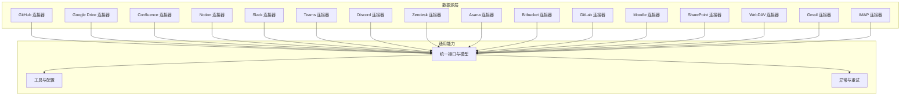
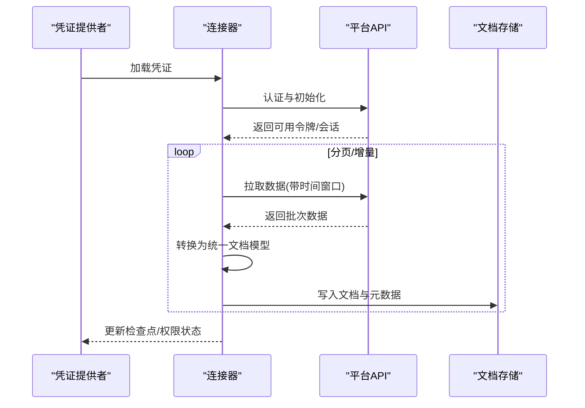
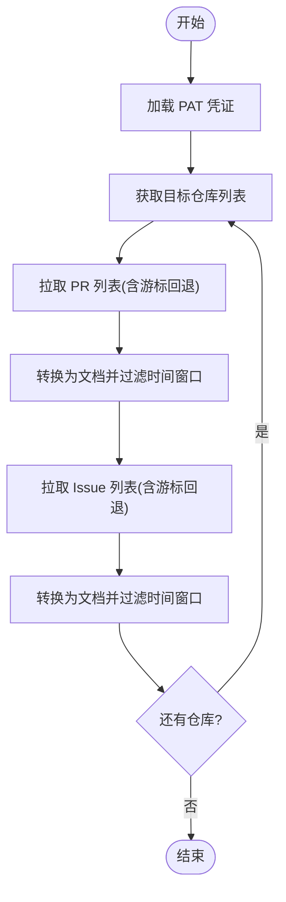
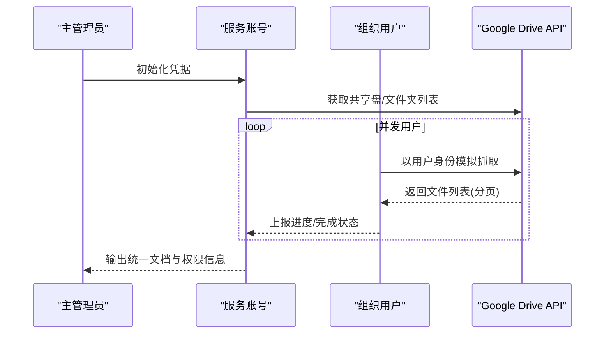
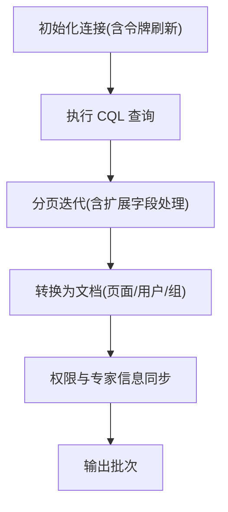
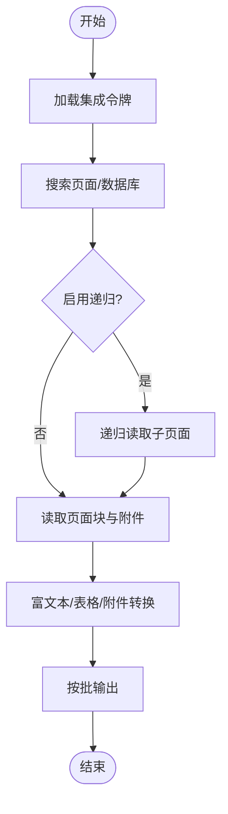
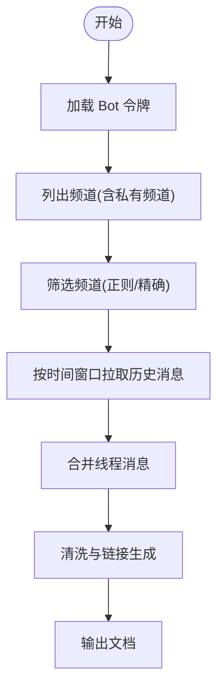
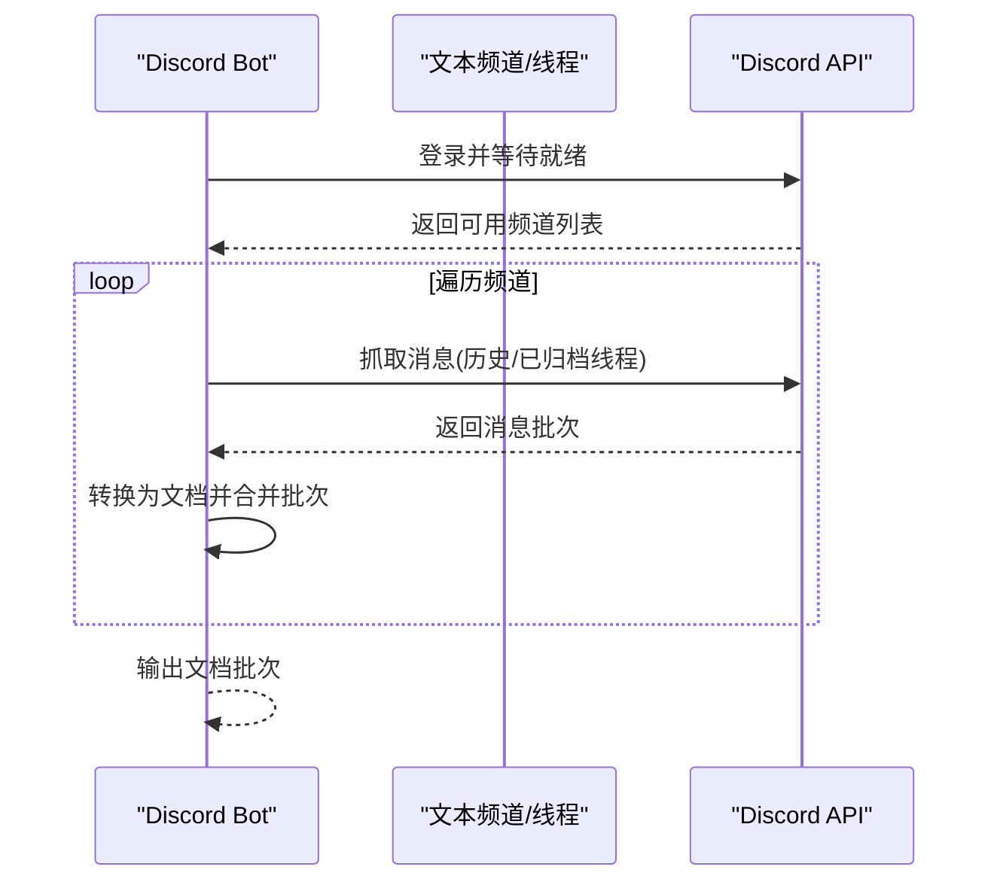
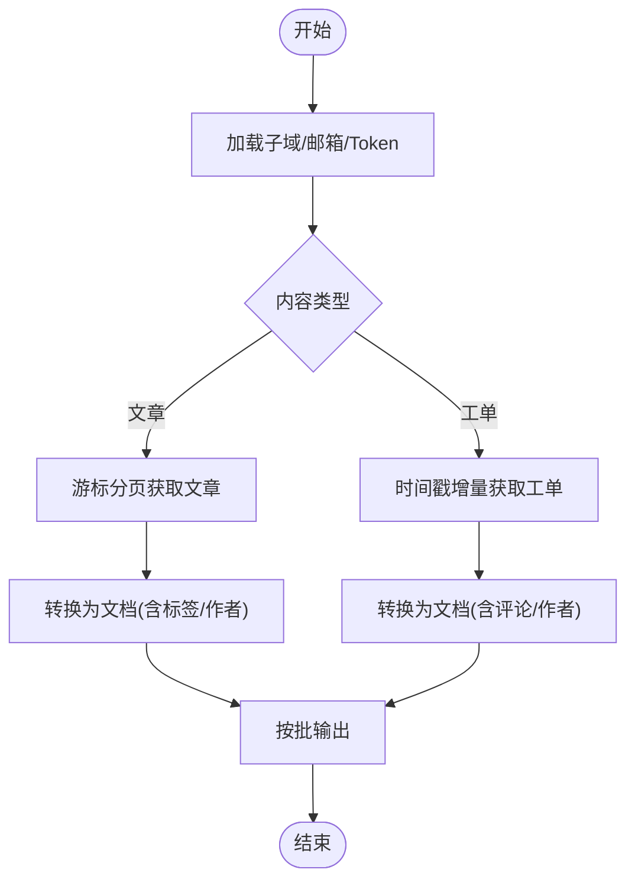
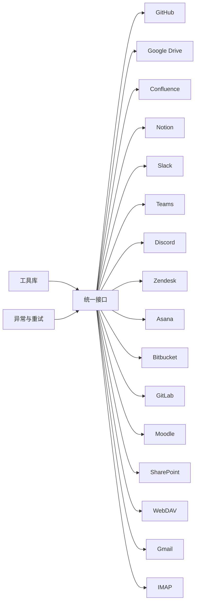

# 平台连接器实现

<cite>
**本文档引用的文件**
- [github/connector.py](file://common/data_source/github/connector.py)
- [google_drive/connector.py](file://common/data_source/google_drive/connector.py)
- [confluence_connector.py](file://common/data_source/confluence_connector.py)
- [notion_connector.py](file://common/data_source/notion_connector.py)
- [slack_connector.py](file://common/data_source/slack_connector.py)
- [teams_connector.py](file://common/data_source/teams_connector.py)
- [discord_connector.py](file://common/data_source/discord_connector.py)
- [zendesk_connector.py](file://common/data_source/zendesk_connector.py)
- [asana_connector.py](file://common/data_source/asana_connector.py)
- [bitbucket/connector.py](file://common/data_source/bitbucket/connector.py)
- [gitlab_connector.py](file://common/data_source/gitlab_connector.py)
- [moodle_connector.py](file://common/data_source/moodle_connector.py)
- [sharepoint_connector.py](file://common/data_source/sharepoint_connector.py)
- [webdav_connector.py](file://common/data_source/webdav_connector.py)
- [gmail_connector.py](file://common/data_source/gmail_connector.py)
- [imap_connector.py](file://common/data_source/imap_connector.py)
</cite>

## 目录
1. [简介](#简介)
2. [项目结构](#项目结构)
3. [核心组件](#核心组件)
4. [架构总览](#架构总览)
5. [详细组件分析](#详细组件分析)
6. [依赖关系分析](#依赖关系分析)
7. [性能考虑](#性能考虑)
8. [故障排除指南](#故障排除指南)
9. [结论](#结论)
10. [附录](#附录)

## 简介
本文件系统性梳理并总结了 RAGFlow 代码库中各类平台连接器的实现与技术要点，覆盖 GitHub、Google Drive、Confluence、Notion、Slack、Teams、Discord、Jira（Zendesk）、Asana、Bitbucket、GitLab、Moodle、SharePoint、WebDAV、Gmail、IMAP 等主流平台。文档从架构设计、数据模型映射、认证与权限、增量同步策略、错误处理与性能优化等方面进行深入解析，并提供配置参数说明与使用示例，帮助读者快速理解并部署各平台连接器。

## 项目结构
连接器主要位于 common/data_source 下，按平台划分目录，每个平台包含独立的连接器实现、工具模块与常量配置。整体采用“平台隔离 + 统一接口”的设计，便于扩展与维护。

图表来源
- [github/connector.py](file://common/data_source/github/connector.py)
- [google_drive/connector.py](file://common/data_source/google_drive/connector.py)
- [confluence_connector.py](file://common/data_source/confluence_connector.py)
- [notion_connector.py](file://common/data_source/notion_connector.py)
- [slack_connector.py](file://common/data_source/slack_connector.py)
- [teams_connector.py](file://common/data_source/teams_connector.py)
- [discord_connector.py](file://common/data_source/discord_connector.py)
- [zendesk_connector.py](file://common/data_source/zendesk_connector.py)
- [asana_connector.py](file://common/data_source/asana_connector.py)

章节来源
- [github/connector.py](file://common/data_source/github/connector.py)
- [google_drive/connector.py](file://common/data_source/google_drive/connector.py)
- [confluence_connector.py](file://common/data_source/confluence_connector.py)
- [notion_connector.py](file://common/data_source/notion_connector.py)
- [slack_connector.py](file://common/data_source/slack_connector.py)
- [teams_connector.py](file://common/data_source/teams_connector.py)
- [discord_connector.py](file://common/data_source/discord_connector.py)
- [zendesk_connector.py](file://common/data_source/zendesk_connector.py)
- [asana_connector.py](file://common/data_source/asana_connector.py)

## 核心组件
- 统一接口与模型：所有连接器遵循统一的接口契约，支持凭证加载、增量拉取、权限同步、检查点管理等能力，确保跨平台一致性。
- 工具与配置：提供速率限制、重试、分页、时间窗口过滤、文件类型处理等通用工具，降低重复实现成本。
- 异常与重试：针对各平台 API 的限流、鉴权失败、网络波动等场景，内置指数退避与降级策略，提升稳定性。

章节来源
- [github/connector.py](file://common/data_source/github/connector.py)
- [google_drive/connector.py](file://common/data_source/google_drive/connector.py)
- [confluence_connector.py](file://common/data_source/confluence_connector.py)
- [notion_connector.py](file://common/data_source/notion_connector.py)
- [slack_connector.py](file://common/data_source/slack_connector.py)
- [teams_connector.py](file://common/data_source/teams_connector.py)
- [discord_connector.py](file://common/data_source/discord_connector.py)
- [zendesk_connector.py](file://common/data_source/zendesk_connector.py)
- [asana_connector.py](file://common/data_source/asana_connector.py)

## 架构总览
下图展示了连接器的整体交互流程：凭证加载 → 源端数据拉取 → 文档生成与元数据提取 → 增量同步与权限同步 → 失败回滚与重试。

图表来源
- [github/connector.py](file://common/data_source/github/connector.py)
- [google_drive/connector.py](file://common/data_source/google_drive/connector.py)
- [confluence_connector.py](file://common/data_source/confluence_connector.py)
- [notion_connector.py](file://common/data_source/notion_connector.py)
- [slack_connector.py](file://common/data_source/slack_connector.py)
- [teams_connector.py](file://common/data_source/teams_connector.py)
- [discord_connector.py](file://common/data_source/discord_connector.py)
- [zendesk_connector.py](file://common/data_source/zendesk_connector.py)
- [asana_connector.py](file://common/data_source/asana_connector.py)

## 详细组件分析

### GitHub 连接器
- 认证方式：支持个人访问令牌（PAT），可配置自定义 Base URL；对组织/用户仓库进行批量获取。
- 数据模型：将 Pull Request 与 Issue 统一转换为 Document，保留标题、正文、标签、时间戳、作者等元信息。
- 增量同步：基于更新时间倒序遍历，支持偏移分页与游标回退两种策略，自动处理速率限制与游标过期。
- 权限同步：可选获取仓库外部访问权限，用于后续权限控制。
- 配置参数：仓库所有者、仓库列表、状态过滤、是否包含 PR/Issue、分页大小等。

图表来源
- [github/connector.py](file://common/data_source/github/connector.py)

章节来源
- [github/connector.py](file://common/data_source/github/connector.py)

### Google Drive 连接器
- 认证方式：支持 OAuth 与服务账号；服务账号模式支持多用户模拟与并发抓取。
- 数据模型：统一为 RetrievedDriveFile，包含文件元数据、用户邮箱、完成阶段等，便于权限同步与去重。
- 增量同步：支持 My Drive、共享盘、指定文件夹三种模式；分页抓取并记录游标，避免重复。
- 权限同步：通过用户邮箱与驱动 ID 映射，支持组织内权限校验。
- 配置参数：是否索引共享盘/我的盘/共享给我的文件、共享盘/文件夹 URL、特定用户邮箱、批大小等。

图表来源
- [google_drive/connector.py](file://common/data_source/google_drive/connector.py)

章节来源
- [google_drive/connector.py](file://common/data_source/google_drive/connector.py)

### Confluence 连接器
- 认证方式：支持个人访问令牌与 OAuth（云版）；动态刷新令牌并缓存。
- 数据模型：统一为 Document，支持页面、用户、组、权限等对象的增量检索。
- 增量同步：支持 CQL 查询与分页，自动替换问题扩展字段并逐项恢复。
- 权限同步：支持用户与组信息拉取，构建专家信息映射。
- 配置参数：是否云版、超时、分页限制、时区偏移、附件大小阈值等。

图表来源
- [confluence_connector.py](file://common/data_source/confluence_connector.py)

章节来源
- [confluence_connector.py](file://common/data_source/confluence_connector.py)

### Notion 连接器
- 认证方式：使用集成令牌（Bearer Token）。
- 数据模型：支持页面与数据库递归索引，块级内容抽取与富文本转换，附件下载与元数据提取。
- 增量同步：基于最后编辑时间排序，支持根页面递归与全量搜索。
- 配置参数：批大小、是否递归、根页面 ID 等。

图表来源
- [notion_connector.py](file://common/data_source/notion_connector.py)

章节来源
- [notion_connector.py](file://common/data_source/notion_connector.py)

### Slack 连接器
- 认证方式：Bot 令牌，支持连接错误重试与快速验证。
- 数据模型：消息转为文档，支持线程合并、专家信息、外部访问控制。
- 增量同步：按频道与时间窗口拉取历史消息，支持正则或精确频道筛选。
- 配置参数：频道列表/正则、批大小、线程数、过滤规则等。

图表来源
- [slack_connector.py](file://common/data_source/slack_connector.py)

章节来源
- [slack_connector.py](file://common/data_source/slack_connector.py)

### Teams 连接器
- 认证方式：使用 MSAL Confidentail Client 获取访问令牌，Graph 客户端访问 Teams。
- 数据模型：统一检查点与权限同步接口，当前实现为简化版本。
- 配置参数：批大小、凭证（租户/客户端/密钥）等。

章节来源
- [teams_connector.py](file://common/data_source/teams_connector.py)

### Discord 连接器
- 认证方式：Bot 令牌，异步抓取消息与线程历史。
- 数据模型：消息转文档，支持服务器与频道过滤、时间窗口与代理配置。
- 增量同步：按时间窗口与 Discord 历史接口分页抓取，支持合并批次。
- 配置参数：服务器 ID、频道名称、起始日期、批大小等。

图表来源
- [discord_connector.py](file://common/data_source/discord_connector.py)

章节来源
- [discord_connector.py](file://common/data_source/discord_connector.py)

### Zendesk 连接器（Jira 替代）
- 认证方式：子域 + 邮箱 + Token。
- 数据模型：文章与工单统一为 Document，支持评论聚合与作者映射。
- 增量同步：文章使用游标分页，工单使用时间戳增量；支持内容标签与作者缓存。
- 配置参数：内容类型（文章/工单）、每分钟调用次数限制等。

图表来源
- [zendesk_connector.py](file://common/data_source/zendesk_connector.py)

章节来源
- [zendesk_connector.py](file://common/data_source/zendesk_connector.py)

### Asana 连接器
- 认证方式：API Token，工作区/团队/项目过滤。
- 数据模型：任务文本与评论聚合，附件下载并转为文档。
- 增量同步：按修改时间窗口拉取任务，支持项目白名单与隐私控制。
- 配置参数：工作区 ID、项目 ID 列表、团队 ID、批大小等。

章节来源
- [asana_connector.py](file://common/data_source/asana_connector.py)

### Bitbucket、GitLab、Moodle、SharePoint、WebDAV、Gmail、IMAP
- Bitbucket：仓库/分支/文件增量抓取，支持权限与元数据映射。
- GitLab：项目/仓库/合并请求/问题索引，支持时间窗口与权限同步。
- Moodle：课程/资源/日志抓取，支持文件与元数据转换。
- SharePoint：站点/列表/文件抓取，支持增量与权限映射。
- WebDAV：标准协议适配，支持路径过滤与文件增量。
- Gmail：主题/正文/附件抽取，支持标签与时间窗口过滤。
- IMAP：邮件列表/附件下载，支持 UID 增量与权限映射。

章节来源
- [bitbucket/connector.py](file://common/data_source/bitbucket/connector.py)
- [gitlab_connector.py](file://common/data_source/gitlab_connector.py)
- [moodle_connector.py](file://common/data_source/moodle_connector.py)
- [sharepoint_connector.py](file://common/data_source/sharepoint_connector.py)
- [webdav_connector.py](file://common/data_source/webdav_connector.py)
- [gmail_connector.py](file://common/data_source/gmail_connector.py)
- [imap_connector.py](file://common/data_source/imap_connector.py)

## 依赖关系分析
- 统一接口：各连接器均实现统一的凭证加载、增量拉取、权限同步与检查点接口，保证行为一致。
- 工具复用：分页、重试、速率限制、时间窗口过滤、文件类型处理等工具在多个平台复用。
- 平台差异：不同平台在认证方式、API 限制、数据模型与权限模型上存在差异，但通过抽象层屏蔽差异。

图表来源
- [github/connector.py](file://common/data_source/github/connector.py)
- [google_drive/connector.py](file://common/data_source/google_drive/connector.py)
- [confluence_connector.py](file://common/data_source/confluence_connector.py)
- [notion_connector.py](file://common/data_source/notion_connector.py)
- [slack_connector.py](file://common/data_source/slack_connector.py)
- [teams_connector.py](file://common/data_source/teams_connector.py)
- [discord_connector.py](file://common/data_source/discord_connector.py)
- [zendesk_connector.py](file://common/data_source/zendesk_connector.py)
- [asana_connector.py](file://common/data_source/asana_connector.py)

## 性能考虑
- 速率限制与退避：各连接器普遍采用指数退避与限速控制，避免触发平台限流。
- 并发与批处理：Google Drive 支持多用户并发抓取；各连接器默认批大小可调，平衡吞吐与内存占用。
- 增量与去重：基于时间窗口与游标/UID 增量，减少重复抓取；统一文档 ID 用于去重。
- 缓存与映射：Confluence/Zendesk 使用专家与标签缓存，降低重复查询成本。
- 超时与重试：统一的超时与重试策略，提升网络波动下的稳定性。

## 故障排除指南
- 认证失败
  - GitHub/Confluence/Slack/Teams/Zendesk：检查令牌/密钥有效性与作用域；确认云版/自托管配置正确。
  - Notion/Discord/Gmail/IMAP：核对令牌与权限范围；确认 API 可达性。
- 速率限制
  - 各连接器内置退避与重试；适当降低批大小与并发度，或调整平台配额。
- 权限不足
  - Slack/Teams/Google Drive：确认 Bot/应用权限与成员加入状态；检查共享盘/频道可见性。
  - Confluence：确认用户/组权限与 API 可见性。
- 数据缺失
  - GitHub：游标过期时自动回退到偏移分页；检查仓库可见性与 PR/Iusse 状态。
  - Notion：确认页面/数据库共享与集成权限；检查富文本/附件解析。
  - Zendesk：确认 Help Center 与工单产品激活状态。
- 网络与超时
  - 设置代理与超时参数；必要时开启重试与降级策略。

章节来源
- [github/connector.py](file://common/data_source/github/connector.py)
- [google_drive/connector.py](file://common/data_source/google_drive/connector.py)
- [confluence_connector.py](file://common/data_source/confluence_connector.py)
- [notion_connector.py](file://common/data_source/notion_connector.py)
- [slack_connector.py](file://common/data_source/slack_connector.py)
- [teams_connector.py](file://common/data_source/teams_connector.py)
- [discord_connector.py](file://common/data_source/discord_connector.py)
- [zendesk_connector.py](file://common/data_source/zendesk_connector.py)
- [asana_connector.py](file://common/data_source/asana_connector.py)

## 结论
该代码库提供了高度一致且可扩展的平台连接器体系，通过统一接口与通用工具，有效屏蔽各平台差异。结合完善的增量同步、权限同步与错误处理机制，能够稳定地将多源异构数据转化为统一的文档模型，支撑后续的检索与分析需求。建议在生产环境中根据平台 API 限制与业务规模，合理配置批大小、并发度与重试策略，并持续监控与优化。

## 附录
- 配置参数清单（示例）
  - GitHub：repo_owner、repositories、state_filter、include_prs、include_issues、分页大小
  - Google Drive：include_shared_drives、include_my_drives、include_files_shared_with_me、shared_drive_urls、my_drive_emails、shared_folder_urls、specific_user_emails、批大小
  - Confluence：is_cloud、url、client_id/client_secret、时区偏移、附件大小阈值
  - Notion：integration_token、root_page_id、递归开关、批大小
  - Slack：bot_token、channels、channel_regex_enabled、批大小、线程数
  - Teams：tenant_id、client_id、client_secret、批大小
  - Discord：bot_token、server_ids、channel_names、start_date、批大小
  - Zendesk：subdomain、email、token、content_type、calls_per_minute
  - Asana：api_token、workspace_id、project_ids、team_id、批大小
  - 其他：Bitbucket/GitLab/Moodle/SharePoint/WebDAV/Gmail/IMAP 的平台特定参数与批大小