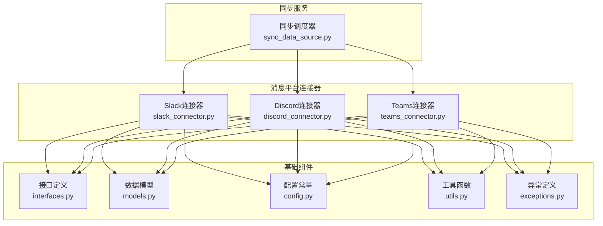
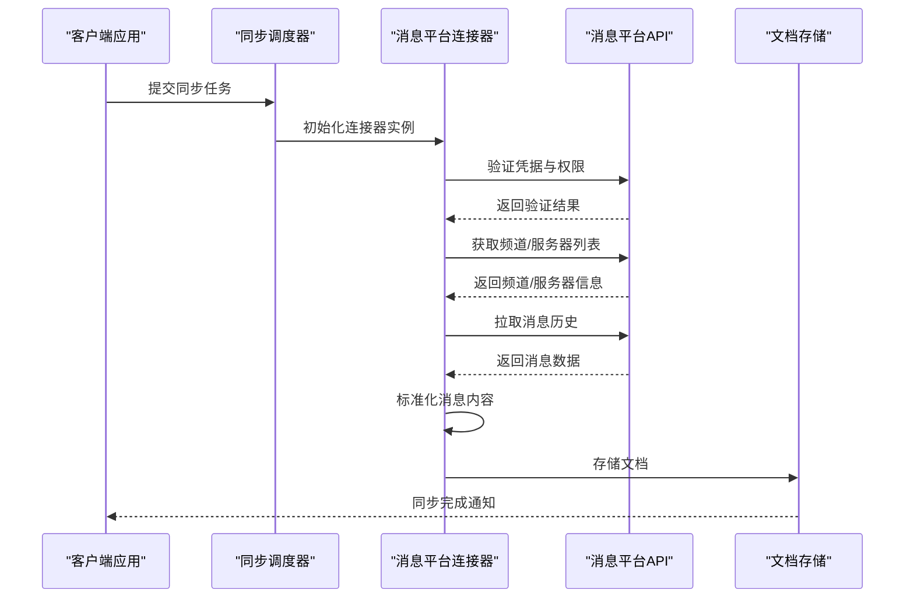
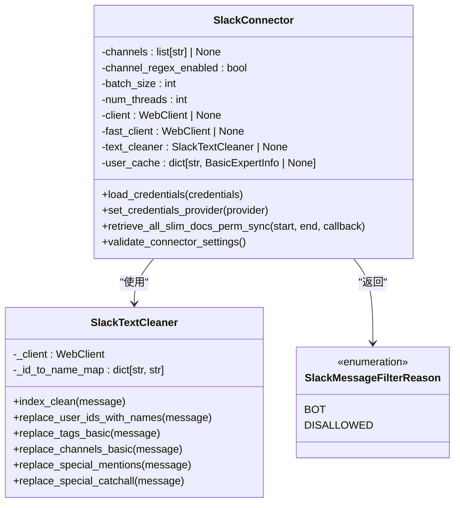
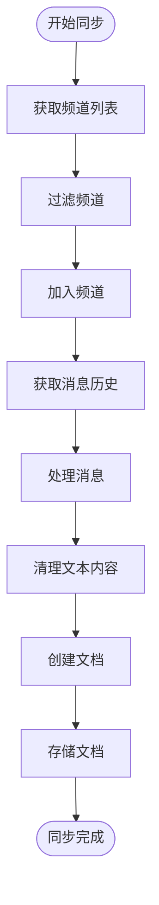
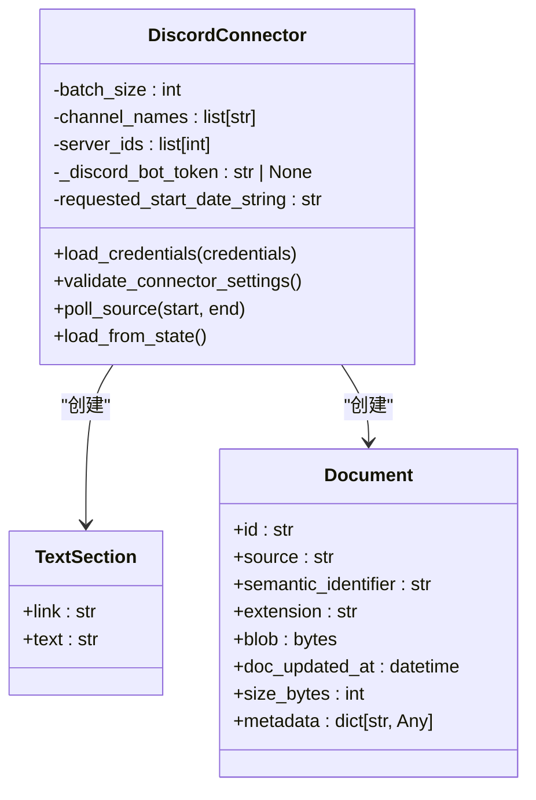
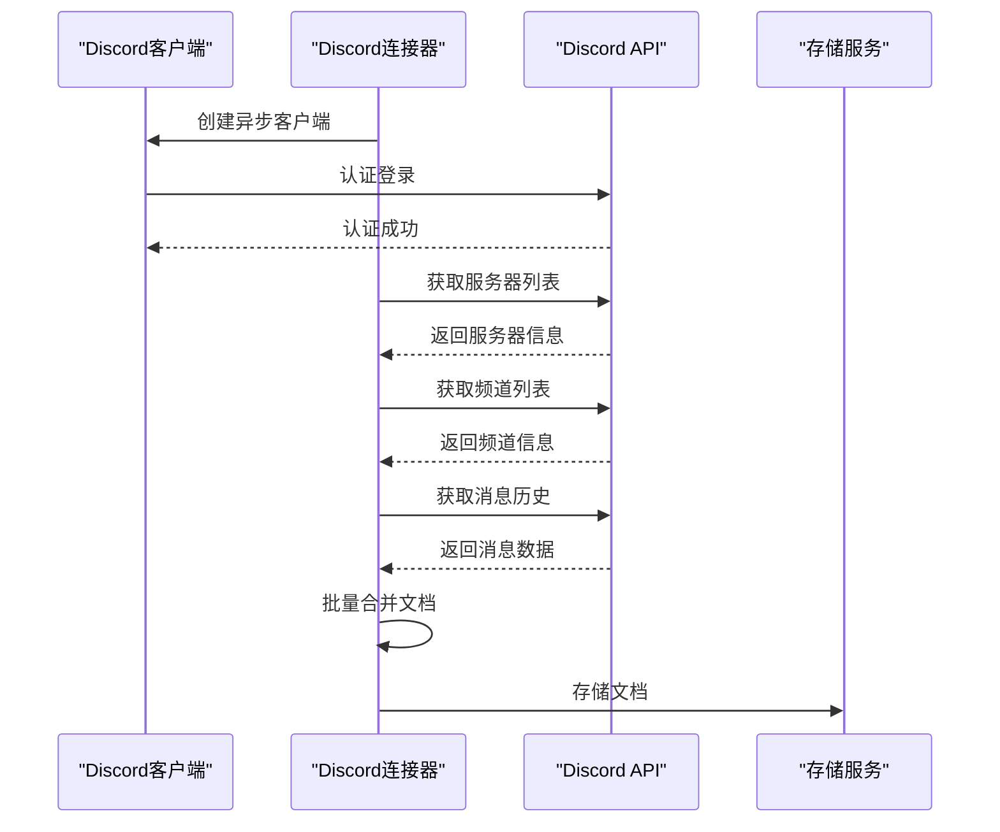
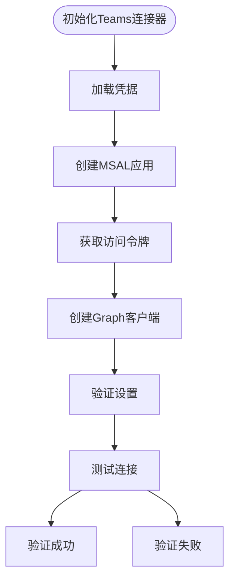
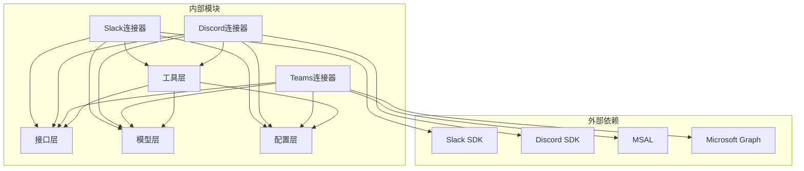

# 消息平台连接器

<cite>
**本文档引用的文件**
- [slack_connector.py](file://common/data_source/slack_connector.py)
- [discord_connector.py](file://common/data_source/discord_connector.py)
- [teams_connector.py](file://common/data_source/teams_connector.py)
- [interfaces.py](file://common/data_source/interfaces.py)
- [models.py](file://common/data_source/models.py)
- [config.py](file://common/data_source/config.py)
- [utils.py](file://common/data_source/utils.py)
- [exceptions.py](file://common/data_source/exceptions.py)
- [sync_data_source.py](file://rag/svr/sync_data_source.py)
</cite>

## 目录
1. [简介](#简介)
2. [项目结构](#项目结构)
3. [核心组件](#核心组件)
4. [架构概览](#架构概览)
5. [详细组件分析](#详细组件分析)
6. [依赖关系分析](#依赖关系分析)
5. [性能考虑](#性能考虑)
6. [故障排除指南](#故障排除指南)
7. [结论](#结论)

## 简介
本文件为消息平台连接器的详细实现文档，涵盖Slack、Microsoft Teams、Discord三大消息平台的API集成方式。文档深入介绍了频道、群组、私聊消息的获取与解析流程，包括消息历史检索、文件附件处理、用户信息获取等；阐述了消息内容的标准化处理，如何将不同平台的消息格式转换为统一的文档格式；并提供了实时消息监听机制与Webhook配置思路。同时，文档包含配置参数说明、使用示例以及针对高并发消息流的性能优化策略和错误重试机制。

## 项目结构
消息平台连接器位于common/data_source目录下，采用按平台拆分的模块化设计：
- slack_connector.py：Slack平台连接器实现
- discord_connector.py：Discord平台连接器实现  
- teams_connector.py：Microsoft Teams平台连接器实现
- interfaces.py：连接器接口定义
- models.py：数据模型定义
- config.py：配置常量与枚举
- utils.py：通用工具函数
- exceptions.py：异常类型定义
- sync_data_source.py：同步服务调度器（包含各平台同步逻辑）

**图表来源**
- [slack_connector.py:460-665](file://common/data_source/slack_connector.py#L460-L665)
- [discord_connector.py:231-342](file://common/data_source/discord_connector.py#L231-L342)
- [teams_connector.py:30-115](file://common/data_source/teams_connector.py#L30-L115)
- [interfaces.py:1-420](file://common/data_source/interfaces.py#L1-L420)
- [models.py:1-314](file://common/data_source/models.py#L1-L314)
- [config.py:1-303](file://common/data_source/config.py#L1-L303)
- [utils.py:1-1286](file://common/data_source/utils.py#L1-L1286)
- [exceptions.py:1-30](file://common/data_source/exceptions.py#L1-L30)
- [sync_data_source.py:356-382](file://rag/svr/sync_data_source.py#L356-L382)

**章节来源**
- [slack_connector.py:1-665](file://common/data_source/slack_connector.py#L1-L665)
- [discord_connector.py:1-342](file://common/data_source/discord_connector.py#L1-L342)
- [teams_connector.py:1-115](file://common/data_source/teams_connector.py#L1-L115)
- [interfaces.py:1-420](file://common/data_source/interfaces.py#L1-L420)
- [models.py:1-314](file://common/data_source/models.py#L1-L314)
- [config.py:1-303](file://common/data_source/config.py#L1-L303)
- [utils.py:1-1286](file://common/data_source/utils.py#L1-L1286)
- [exceptions.py:1-30](file://common/data_source/exceptions.py#L1-L30)
- [sync_data_source.py:356-382](file://rag/svr/sync_data_source.py#L356-L382)

## 核心组件
消息平台连接器基于统一的接口体系构建，主要包含以下核心组件：

### 接口层
- LoadConnector：加载型连接器接口
- PollConnector：轮询型连接器接口  
- CredentialsConnector：凭据管理接口
- SlimConnectorWithPermSync：简化权限同步连接器接口
- CheckpointedConnectorWithPermSync：检查点权限同步连接器接口

### 数据模型层
- Document：统一文档模型，包含ID、语义标识符、扩展名、字节内容、更新时间等
- TextSection：文本段落模型，包含链接和文本内容
- BasicExpertInfo：专家信息模型，用于用户信息获取
- ConnectorCheckpoint：连接器检查点模型

### 工具函数层
- make_paginated_slack_api_call：Slack API分页调用封装
- SlackTextCleaner：Slack文本清理工具类
- get_message_link：生成消息链接
- expert_info_from_slack_id：根据Slack用户ID获取专家信息

**章节来源**
- [interfaces.py:21-103](file://common/data_source/interfaces.py#L21-L103)
- [models.py:88-130](file://common/data_source/models.py#L88-L130)
- [utils.py:574-718](file://common/data_source/utils.py#L574-L718)

## 架构概览
消息平台连接器采用分层架构设计，通过统一的接口规范实现多平台适配：

**图表来源**
- [sync_data_source.py:356-382](file://rag/svr/sync_data_source.py#L356-L382)
- [slack_connector.py:575-637](file://common/data_source/slack_connector.py#L575-L637)
- [discord_connector.py:303-318](file://common/data_source/discord_connector.py#L303-L318)
- [teams_connector.py:67-86](file://common/data_source/teams_connector.py#L67-L86)

## 详细组件分析

### Slack连接器分析

#### 类结构设计

**图表来源**
- [slack_connector.py:461-527](file://common/data_source/slack_connector.py#L461-L527)
- [slack_connector.py:639-718](file://common/data_source/slack_connector.py#L639-L718)
- [slack_connector.py:294-298](file://common/data_source/slack_connector.py#L294-L298)

#### API集成流程
Slack连接器通过Slack SDK进行API调用，支持以下核心功能：

1. **频道管理**
   - 获取公共和私有频道列表
   - 过滤指定频道名称或正则表达式匹配
   - 处理已归档频道的特殊情况

2. **消息获取**
   - 分页获取频道消息历史
   - 支持时间范围过滤（oldest/latest参数）
   - 处理线程消息和回复

3. **内容标准化**
   - 用户ID到用户名的映射替换
   - 频道提及的格式化
   - 特殊标记的清理处理

**图表来源**
- [slack_connector.py:90-122](file://common/data_source/slack_connector.py#L90-L122)
- [slack_connector.py:125-153](file://common/data_source/slack_connector.py#L125-L153)
- [slack_connector.py:316-367](file://common/data_source/slack_connector.py#L316-L367)

#### 配置参数说明
- `channels`: 指定要同步的频道列表（可选）
- `channel_regex_enabled`: 是否启用正则表达式匹配频道名称
- `batch_size`: 批处理大小，默认2
- `num_threads`: 并发线程数，默认4
- `use_redis`: 是否使用Redis缓存（当前版本未实现）

**章节来源**
- [slack_connector.py:461-527](file://common/data_source/slack_connector.py#L461-L527)
- [slack_connector.py:575-637](file://common/data_source/slack_connector.py#L575-L637)
- [config.py:103-114](file://common/data_source/config.py#L103-L114)

### Discord连接器分析

#### 异步架构设计

**图表来源**
- [discord_connector.py:231-318](file://common/data_source/discord_connector.py#L231-L318)
- [discord_connector.py:23-70](file://common/data_source/discord_connector.py#L23-L70)
- [models.py:88-101](file://common/data_source/models.py#L88-L101)

#### 异步消息获取流程
Discord连接器采用异步编程模式，支持以下特性：

1. **服务器和频道过滤**
   - 支持按服务器ID过滤
   - 支持按频道名称过滤
   - 权限检查确保可读取历史

2. **消息历史获取**
   - 支持默认消息类型过滤
   - 自动处理活动线程和已归档线程
   - 时间范围限制（after/before参数）

3. **批量处理**
   - 支持批量文档合并
   - 自动批处理大小控制

**图表来源**
- [discord_connector.py:187-228](file://common/data_source/discord_connector.py#L187-L228)
- [discord_connector.py:94-166](file://common/data_source/discord_connector.py#L94-L166)

#### 配置参数说明
- `server_ids`: 服务器ID列表（可选）
- `channel_names`: 频道名称列表（可选）  
- `start_date`: 开始日期字符串（YYYY-MM-DD格式）
- `batch_size`: 批处理大小，默认2

**章节来源**
- [discord_connector.py:231-318](file://common/data_source/discord_connector.py#L231-L318)
- [discord_connector.py:303-318](file://common/data_source/discord_connector.py#L303-L318)

### Microsoft Teams连接器分析

#### 简化实现架构
Teams连接器采用简化的实现方式，主要提供以下功能：

1. **认证与授权**
   - 使用MSAL进行客户端凭据认证
   - 获取访问令牌用于Graph API调用
   - 支持租户ID、客户端ID、客户端密钥配置

2. **权限验证**
   - 基于Microsoft Graph API的连接性测试
   - 权限不足时的异常处理

3. **检查点机制**
   - Teams特定的检查点模型
   - 支持增量同步的待处理团队ID跟踪

**图表来源**
- [teams_connector.py:37-66](file://common/data_source/teams_connector.py#L37-L66)
- [teams_connector.py:67-82](file://common/data_source/teams_connector.py#L67-L82)

#### 配置参数说明
- `tenant_id`: Azure AD租户ID
- `client_id`: 应用程序客户端ID  
- `client_secret`: 客户端密钥
- `batch_size`: 批处理大小，默认5000

**章节来源**
- [teams_connector.py:30-115](file://common/data_source/teams_connector.py#L30-L115)

## 依赖关系分析

### 组件耦合关系

**图表来源**
- [slack_connector.py:12-15](file://common/data_source/slack_connector.py#L12-L15)
- [discord_connector.py:9-12](file://common/data_source/discord_connector.py#L9-L12)
- [teams_connector.py:5-7](file://common/data_source/teams_connector.py#L5-L7)

### 错误处理与重试机制
系统实现了多层次的错误处理和重试机制：

1. **Slack连接器重试**
   - 连接错误自动重试（URLError、ConnectionResetError等）
   - 固定间隔重试计算器
   - 最大重试次数配置

2. **通用HTTP请求重试**
   - 基于Retry-After头部的智能重试
   - 指数退避算法
   - 最大等待时间限制

3. **速率限制处理**
   - 自动检测429状态码
   - 动态计算等待时间
   - 超时后的指数退避

**章节来源**
- [slack_connector.py:507-526](file://common/data_source/slack_connector.py#L507-L526)
- [utils.py:112-158](file://common/data_source/utils.py#L112-L158)
- [utils.py:205-227](file://common/data_source/utils.py#L205-L227)

## 性能考虑

### 并发处理策略
1. **线程池管理**
   - Slack连接器支持可配置的并发线程数
   - 默认4个线程，可根据环境调整

2. **批量处理优化**
   - 统一批处理大小配置（INDEX_BATCH_SIZE）
   - Discord连接器支持批量文档合并
   - Teams连接器使用较大的批处理大小（5000）

3. **内存管理**
   - 文档对象的延迟序列化
   - 大文件的流式处理
   - 缓存机制减少重复API调用

### 缓存与优化
1. **用户信息缓存**
   - Slack用户ID到用户名的映射缓存
   - 减少users.info API调用频率

2. **URL缓存**
   - Slack工作区基础URL的LRU缓存
   - 避免重复的auth_test调用

3. **分页优化**
   - 统一的分页API调用封装
   - _SLACK_LIMIT参数控制单次请求数量

**章节来源**
- [config.py:103-114](file://common/data_source/config.py#L103-L114)
- [utils.py:556-561](file://common/data_source/utils.py#L556-L561)
- [utils.py:606-637](file://common/data_source/utils.py#L606-L637)

## 故障排除指南

### 常见问题与解决方案

#### Slack相关问题
1. **认证失败**
   - 检查bot_token是否正确
   - 确认应用具有必要的scopes（channels:read等）
   - 验证工作区连接性

2. **权限不足**
   - 添加缺少的scopes
   - 检查应用安装状态
   - 验证用户角色权限

3. **API限制**
   - 实现指数退避重试
   - 监控Retry-After响应头
   - 调整请求频率

#### Discord相关问题
1. **消息无法读取**
   - 确认Bot具有适当的权限
   - 检查服务器和频道的访问权限
   - 验证消息历史读取权限

2. **异步连接问题**
   - 检查网络连接和代理设置
   - 验证Bot令牌的有效性
   - 监控API限制和速率限制

#### Teams相关问题
1. **认证失败**
   - 验证租户ID、客户端ID、密钥配置
   - 检查应用程序注册和权限配置
   - 确认Microsoft Graph API访问权限

2. **连接超时**
   - 检查网络连接和防火墙设置
   - 验证Azure AD服务可用性
   - 调整超时参数

**章节来源**
- [slack_connector.py:575-637](file://common/data_source/slack_connector.py#L575-L637)
- [discord_connector.py:303-318](file://common/data_source/discord_connector.py#L303-L318)
- [teams_connector.py:67-82](file://common/data_source/teams_connector.py#L67-L82)
- [exceptions.py:4-30](file://common/data_source/exceptions.py#L4-L30)

## 结论
消息平台连接器提供了统一的接口来集成Slack、Discord和Microsoft Teams等主流消息平台。通过分层架构设计和标准化的数据模型，系统能够有效地处理不同平台的消息格式差异，并将其转换为统一的文档格式。连接器实现了完善的错误处理、重试机制和性能优化策略，能够应对高并发场景下的消息同步需求。

关键优势包括：
- 统一的接口规范，便于扩展新的消息平台
- 完善的错误处理和重试机制
- 高效的并发处理和内存管理
- 灵活的配置选项和过滤机制
- 标准化的文档输出格式

未来可以进一步完善的功能包括：实现更精细的增量同步、增强实时消息监听能力、扩展更多消息平台支持、优化大规模部署的性能表现等。