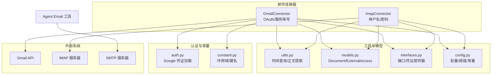
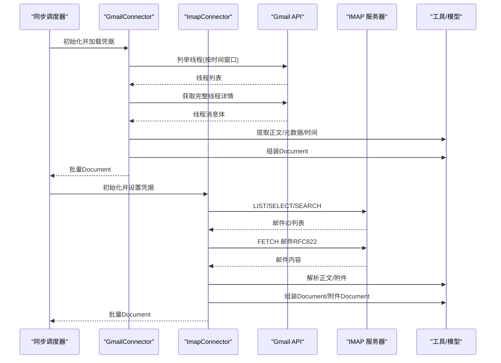
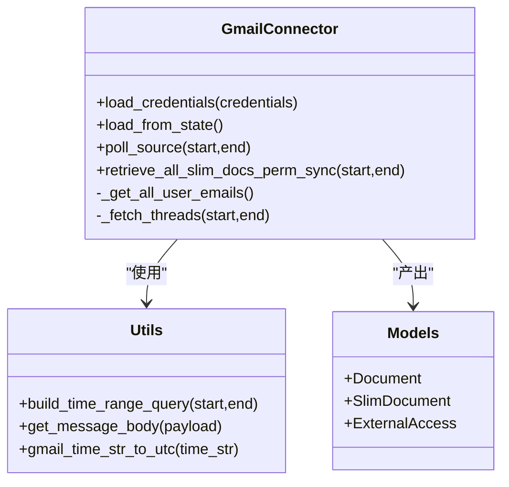
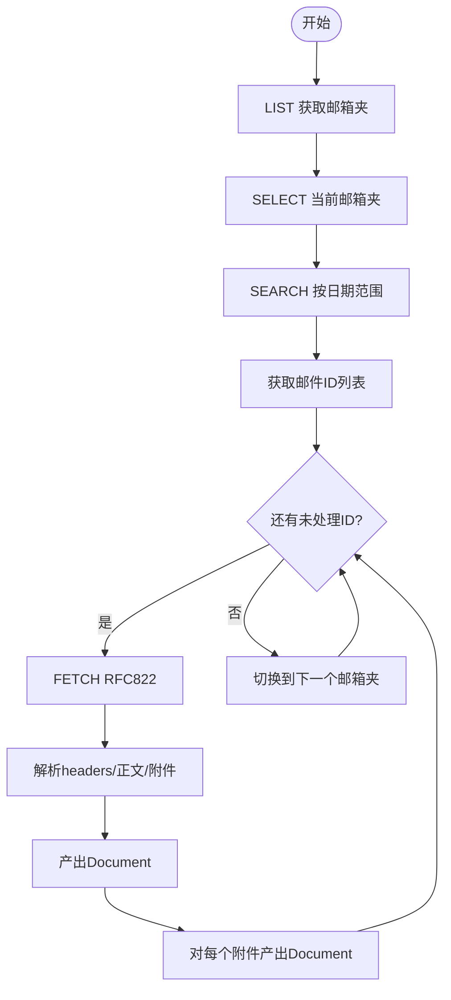
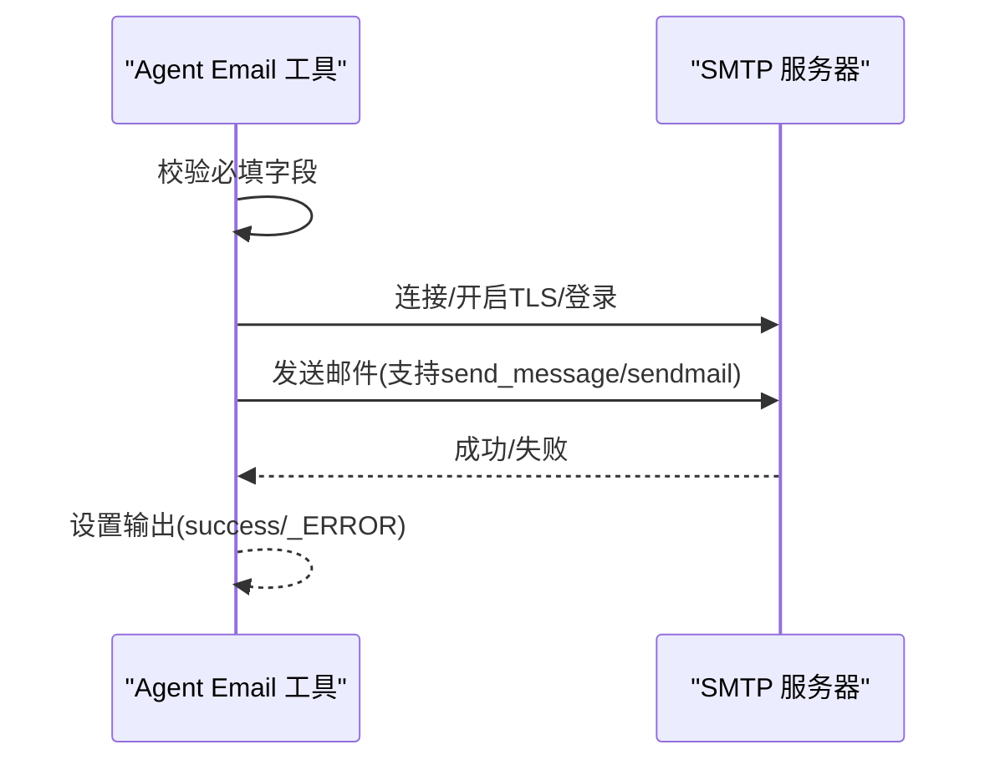
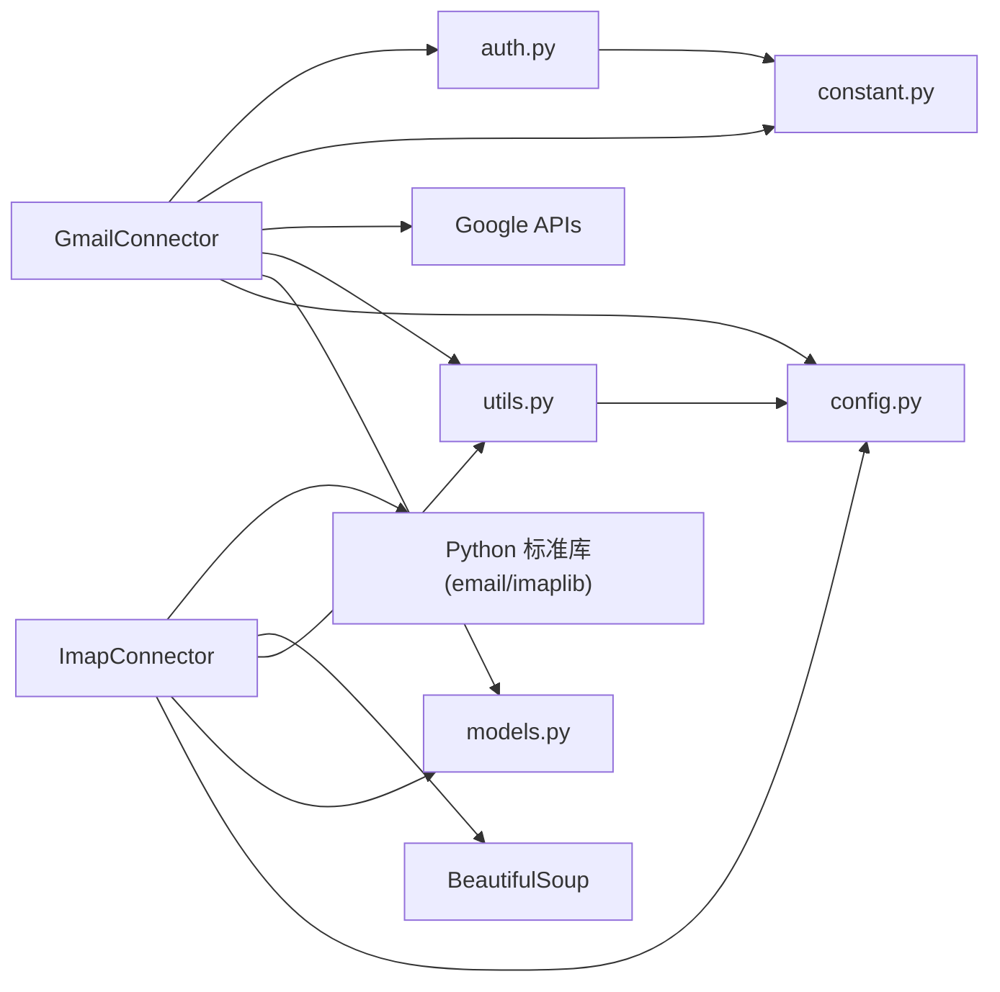

# 邮件平台连接器

<cite>
**本文引用的文件列表**
- [gmail_connector.py](file://common/data_source/gmail_connector.py)
- [imap_connector.py](file://common/data_source/imap_connector.py)
- [auth.py](file://common/data_source/google_util/auth.py)
- [constant.py](file://common/data_source/google_util/constant.py)
- [utils.py](file://common/data_source/utils.py)
- [models.py](file://common/data_source/models.py)
- [interfaces.py](file://common/data_source/interfaces.py)
- [config.py](file://common/data_source/config.py)
- [email.py](file://agent/tools/email.py)
- [sync_data_source.py](file://rag/svr/sync_data_source.py)
- [connector_app.py](file://api/apps/connector_app.py)
</cite>

## 目录
1. [简介](#简介)
2. [项目结构](#项目结构)
3. [核心组件](#核心组件)
4. [架构总览](#架构总览)
5. [详细组件分析](#详细组件分析)
6. [依赖关系分析](#依赖关系分析)
7. [性能考量](#性能考量)
8. [故障排查指南](#故障排查指南)
9. [结论](#结论)
10. [附录：配置与使用示例](#附录配置与使用示例)

## 简介
本文件面向“邮件平台连接器”的实现与使用，覆盖以下能力：
- Gmail API 与 IMAP 协议的集成与认证（OAuth 与用户名/密码）
- 邮件获取、解析、附件处理
- 邮件内容标准化（HTML 转文本、附件提取、邮件头解析）
- 搜索与筛选（按日期、发件人、主题等）
- 增量同步与批量处理策略
- 配置参数说明与使用示例
- 大量邮件场景下的性能优化建议

## 项目结构
邮件平台连接器主要由以下模块构成：
- Gmail 连接器：基于 Google APIs，支持 OAuth 与服务账号，按时间窗口拉取线程并转为文档
- IMAP 连接器：基于标准 IMAP 协议，支持用户名/密码认证，带检查点的增量同步
- 工具函数与模型：统一的文档模型、时间查询构建、权限模型、通用工具
- 接口层：统一的连接器接口、凭证提供器、检查点包装器
- 配置与常量：批量大小、阈值、OAuth 客户端信息、作用域等
- 发送邮件工具：Agent 工具，用于通过 SMTP 发送邮件
- 同步调度：后端任务调度器，负责启动增量或全量同步

图表来源
- [gmail_connector.py:144-317](file://common/data_source/gmail_connector.py#L144-L317)
- [imap_connector.py:143-340](file://common/data_source/imap_connector.py#L143-L340)
- [auth.py:37-127](file://common/data_source/google_util/auth.py#L37-L127)
- [constant.py:8-20](file://common/data_source/google_util/constant.py#L8-L20)
- [utils.py:732-790](file://common/data_source/utils.py#L732-L790)
- [models.py:88-128](file://common/data_source/models.py#L88-L128)
- [interfaces.py:21-103](file://common/data_source/interfaces.py#L21-L103)
- [config.py:103-124](file://common/data_source/config.py#L103-L124)
- [email.py:99-231](file://agent/tools/email.py#L99-L231)

章节来源
- [gmail_connector.py:144-317](file://common/data_source/gmail_connector.py#L144-L317)
- [imap_connector.py:143-340](file://common/data_source/imap_connector.py#L143-L340)
- [auth.py:37-127](file://common/data_source/google_util/auth.py#L37-L127)
- [constant.py:8-20](file://common/data_source/google_util/constant.py#L8-L20)
- [utils.py:732-790](file://common/data_source/utils.py#L732-L790)
- [models.py:88-128](file://common/data_source/models.py#L88-L128)
- [interfaces.py:21-103](file://common/data_source/interfaces.py#L21-L103)
- [config.py:103-124](file://common/data_source/config.py#L103-L124)
- [email.py:99-231](file://agent/tools/email.py#L99-L231)

## 核心组件
- GmailConnector：支持 OAuth 用户令牌与服务账号两种认证；按时间窗口检索线程，提取正文与元数据，生成文档对象
- ImapConnector：支持用户名/密码认证；通过 IMAP 列表与搜索，按检查点增量拉取邮件与附件
- 工具与模型：统一的 Document/ExternalAccess/SlimDocument 模型；时间范围查询构建；正文提取与时间转换
- 接口与凭证：统一的 Load/Poll/Slim/Checkpointed 接口；静态/动态凭证提供器
- 配置与常量：批量大小、大小阈值、OAuth 客户端信息、Gmail/Drive 作用域

章节来源
- [gmail_connector.py:144-317](file://common/data_source/gmail_connector.py#L144-L317)
- [imap_connector.py:143-340](file://common/data_source/imap_connector.py#L143-L340)
- [utils.py:732-790](file://common/data_source/utils.py#L732-L790)
- [models.py:88-128](file://common/data_source/models.py#L88-L128)
- [interfaces.py:21-103](file://common/data_source/interfaces.py#L21-L103)
- [config.py:103-124](file://common/data_source/config.py#L103-L124)

## 架构总览
Gmail 与 IMAP 的同步流程均遵循统一的“检查点驱动 + 批量输出”模式，支持增量与全量两种模式。Gmail 使用 Google APIs，IMAP 使用标准 IMAP 协议。

图表来源
- [gmail_connector.py:206-251](file://common/data_source/gmail_connector.py#L206-L251)
- [imap_connector.py:206-294](file://common/data_source/imap_connector.py#L206-L294)
- [utils.py:763-790](file://common/data_source/utils.py#L763-L790)

## 详细组件分析

### Gmail 连接器（OAuth/服务账号）
- 认证方式
  - OAuth 用户令牌：支持交互式与上传式两种；自动刷新与持久化新令牌
  - 服务账号：可直接以工作区用户身份访问
- 数据获取
  - 时间范围查询：通过 build_time_range_query 构建 after/before 查询串
  - 线程列表与详情：分页列举线程，再获取完整线程详情
  - 正文提取：从 payload.parts 中提取 text/plain 内容并解码
  - 元数据：解析 headers 中 from/cc/bcc/to/subject/date/labels
- 文档标准化
  - 组合多消息正文为单一 blob
  - 生成 Document 对象，包含 id、标题、扩展名、大小、更新时间、外部访问控制等
- 权限同步
  - 支持 SlimDocument 仅含 id 与权限信息，便于权限同步

图表来源
- [gmail_connector.py:144-317](file://common/data_source/gmail_connector.py#L144-L317)
- [utils.py:732-790](file://common/data_source/utils.py#L732-L790)
- [models.py:88-128](file://common/data_source/models.py#L88-L128)

章节来源
- [gmail_connector.py:173-182](file://common/data_source/gmail_connector.py#L173-L182)
- [gmail_connector.py:206-251](file://common/data_source/gmail_connector.py#L206-L251)
- [gmail_connector.py:271-316](file://common/data_source/gmail_connector.py#L271-L316)
- [utils.py:732-790](file://common/data_source/utils.py#L732-L790)
- [models.py:88-128](file://common/data_source/models.py#L88-L128)

### IMAP 连接器（用户名/密码）
- 认证与连接
  - 通过 set_credentials_provider 注入用户名/密码
  - 每次操作新建 IMAP4_SSL 实例，避免登录状态复用导致失败
- 增量同步与检查点
  - ImapCheckpoint 包含待处理邮箱夹列表与当前邮箱夹的待处理邮件ID队列
  - 分页拉取（PAGE_SIZE）并逐条产出 Document 与附件 Document
- 邮件解析
  - 解析 headers（subject/from/to/cc/date/message-id），支持 RFC2231 编码
  - 正文解析：遍历 multipart 子部分，优先提取 text/plain 或 text/html，使用 BeautifulSoup 清洗
  - 附件提取：walk 遍历，过滤 Content-Disposition 为 attachment 或 inline+filename，按大小阈值限制
- 权限同步
  - 可在产出 Document 时附带 ExternalAccess，包含所有收件人与发件人邮箱

图表来源
- [imap_connector.py:206-294](file://common/data_source/imap_connector.py#L206-L294)
- [imap_connector.py:396-420](file://common/data_source/imap_connector.py#L396-L420)
- [imap_connector.py:438-490](file://common/data_source/imap_connector.py#L438-L490)
- [imap_connector.py:492-525](file://common/data_source/imap_connector.py#L492-L525)

章节来源
- [imap_connector.py:143-340](file://common/data_source/imap_connector.py#L143-L340)
- [imap_connector.py:206-294](file://common/data_source/imap_connector.py#L206-L294)
- [imap_connector.py:396-420](file://common/data_source/imap_connector.py#L396-L420)
- [imap_connector.py:438-490](file://common/data_source/imap_connector.py#L438-L490)
- [imap_connector.py:492-525](file://common/data_source/imap_connector.py#L492-L525)

### 发送邮件工具（SMTP）
- 功能：通过 SMTP 发送邮件，支持 CC/BCC、HTML 内容、发送者名称编码
- 错误处理：认证失败、连接失败、SMTP 异常均有对应处理与重试
- 参数：SMTP 地址/端口、发件邮箱、授权码、发件人名称

图表来源
- [email.py:103-183](file://agent/tools/email.py#L103-L183)

章节来源
- [email.py:99-231](file://agent/tools/email.py#L99-L231)

## 依赖关系分析
- Gmail 依赖 Google APIs 与 Google 工具模块（认证、资源、常量）
- IMAP 依赖 Python 标准库 email/imaplib，以及 BeautifulSoup 进行 HTML 清洗
- 两者均依赖统一的 Document/ExternalAccess/SlimDocument 模型与接口
- 配置常量来自 config.py，如批量大小、大小阈值、OAuth 客户端信息

图表来源
- [gmail_connector.py:144-317](file://common/data_source/gmail_connector.py#L144-L317)
- [imap_connector.py:143-340](file://common/data_source/imap_connector.py#L143-L340)
- [auth.py:37-127](file://common/data_source/google_util/auth.py#L37-L127)
- [constant.py:8-20](file://common/data_source/google_util/constant.py#L8-L20)
- [utils.py:732-790](file://common/data_source/utils.py#L732-L790)
- [models.py:88-128](file://common/data_source/models.py#L88-L128)
- [config.py:103-124](file://common/data_source/config.py#L103-L124)

章节来源
- [gmail_connector.py:144-317](file://common/data_source/gmail_connector.py#L144-L317)
- [imap_connector.py:143-340](file://common/data_source/imap_connector.py#L143-L340)
- [auth.py:37-127](file://common/data_source/google_util/auth.py#L37-L127)
- [constant.py:8-20](file://common/data_source/google_util/constant.py#L8-L20)
- [utils.py:732-790](file://common/data_source/utils.py#L732-L790)
- [models.py:88-128](file://common/data_source/models.py#L88-L128)
- [config.py:103-124](file://common/data_source/config.py#L103-L124)

## 性能考量
- 批量大小与并发
  - Gmail/IMAP 默认批量大小较小（INDEX_BATCH_SIZE=2），适合稳定增量同步
  - 可通过配置项调整 batch_size/sync_batch_size
- 大小阈值
  - Gmail/IMAP 附件大小阈值默认约 10MB，避免大附件拖慢索引
- 增量同步
  - Gmail：按 after/before 时间窗口拉取，减少重复扫描
  - IMAP：检查点记录邮箱夹与邮件ID队列，断点续传
- 连接与会话
  - IMAP 每次新建连接实例，避免登录状态复用问题
- 错误与重试
  - Gmail/IMAP 对 404/403/Rate Limit 等异常有处理与跳过逻辑
  - 发送邮件工具具备重试与降级路径（send_message 失败回退 sendmail）

章节来源
- [config.py:103-124](file://common/data_source/config.py#L103-L124)
- [gmail_connector.py:238-240](file://common/data_source/gmail_connector.py#L238-L240)
- [imap_connector.py:259-263](file://common/data_source/imap_connector.py#L259-L263)
- [utils.py:723-730](file://common/data_source/utils.py#L723-L730)
- [email.py:112-183](file://agent/tools/email.py#L112-L183)

## 故障排查指南
- Gmail
  - 缺少作用域：抛出权限错误，提示补齐作用域
  - 邮箱未启用：识别特定错误并跳过该用户
  - 令牌刷新失败：日志记录异常，返回 None
- IMAP
  - 登录失败：抛出运行时错误，需检查用户名/密码
  - 选择邮箱夹失败：跳过该邮箱夹
  - 搜索/获取失败：抛出运行时错误，检查日期格式与服务器响应
- 发送邮件
  - 认证失败：提示检查邮箱与授权码
  - 连接失败：检查 SMTP 地址/端口
  - SMTP 异常：记录错误并重试

章节来源
- [gmail_connector.py:241-248](file://common/data_source/gmail_connector.py#L241-L248)
- [auth.py:147-156](file://common/data_source/google_util/auth.py#L147-L156)
- [imap_connector.py:198-204](file://common/data_source/imap_connector.py#L198-L204)
- [imap_connector.py:402-404](file://common/data_source/imap_connector.py#L402-L404)
- [imap_connector.py:413-416](file://common/data_source/imap_connector.py#L413-L416)
- [email.py:192-216](file://agent/tools/email.py#L192-L216)

## 结论
邮件平台连接器提供了对 Gmail 与 IMAP 的统一抽象，支持 OAuth 与用户名/密码两种认证方式，并通过检查点与批量输出实现高效、稳定的增量同步。Gmail 侧重于 Google 生态的 API 集成与权限模型，IMAP 则强调协议兼容性与本地化部署。配合合理的批量大小、大小阈值与错误处理策略，可在大规模邮件场景下保持良好性能与稳定性。

## 附录：配置与使用示例

### Gmail 配置要点
- 认证方式
  - OAuth 用户令牌：需提供 token、refresh_token、client_id/client_secret（或交互式）
  - 服务账号：提供服务账号密钥 JSON
- 关键参数
  - credentials：包含 google_tokens 或 google_service_account_key、google_primary_admin
  - batch_size：默认 2，可调大以提升吞吐
- 时间范围
  - 通过 poll_source(start,end) 或 load_from_state() 控制
- 作用域
  - Gmail: gmail.readonly、admin.directory.user.readonly、admin.directory.group.readonly

章节来源
- [gmail_connector.py:173-182](file://common/data_source/gmail_connector.py#L173-L182)
- [gmail_connector.py:262-269](file://common/data_source/gmail_connector.py#L262-L269)
- [constant.py:15-19](file://common/data_source/google_util/constant.py#L15-L19)
- [config.py:103](file://common/data_source/config.py#L103)

### IMAP 配置要点
- 认证方式
  - 用户名/密码：通过 set_credentials_provider 注入
- 关键参数
  - imap_host、imap_port、imap_mailbox（可选）
  - IMAP_CONNECTOR_SIZE_THRESHOLD：附件大小阈值，默认约 10MB
- 增量同步
  - 使用 build_dummy_checkpoint() 与 load_from_checkpoint() 驱动
  - 检查点包含待处理邮箱夹与邮件ID队列

章节来源
- [imap_connector.py:143-340](file://common/data_source/imap_connector.py#L143-L340)
- [config.py:275-277](file://common/data_source/config.py#L275-L277)

### OAuth 回调与 Web 授权
- Web OAuth 回调路由：/v1/connector/gmail/oauth/web/callback
- 回调参数：state、code、error
- 流程：Flow.from_client_config + fetch_token(code=code)

章节来源
- [connector_app.py:293-296](file://api/apps/connector_app.py#L293-L296)

### 同步调度与批处理
- 调度器根据 reindex/poll_range_start 决定全量或增量
- 读取 sync_batch_size 或 batch_size，若无效则回退到默认值
- 通过 CheckpointOutputWrapper 将生成器封装为三元组输出

章节来源
- [sync_data_source.py:292-298](file://rag/svr/sync_data_source.py#L292-L298)
- [sync_data_source.py:950-956](file://rag/svr/sync_data_source.py#L950-L956)
- [interfaces.py:300-342](file://common/data_source/interfaces.py#L300-L342)