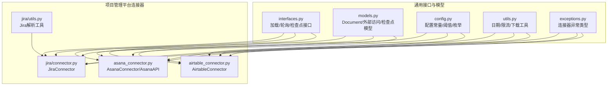
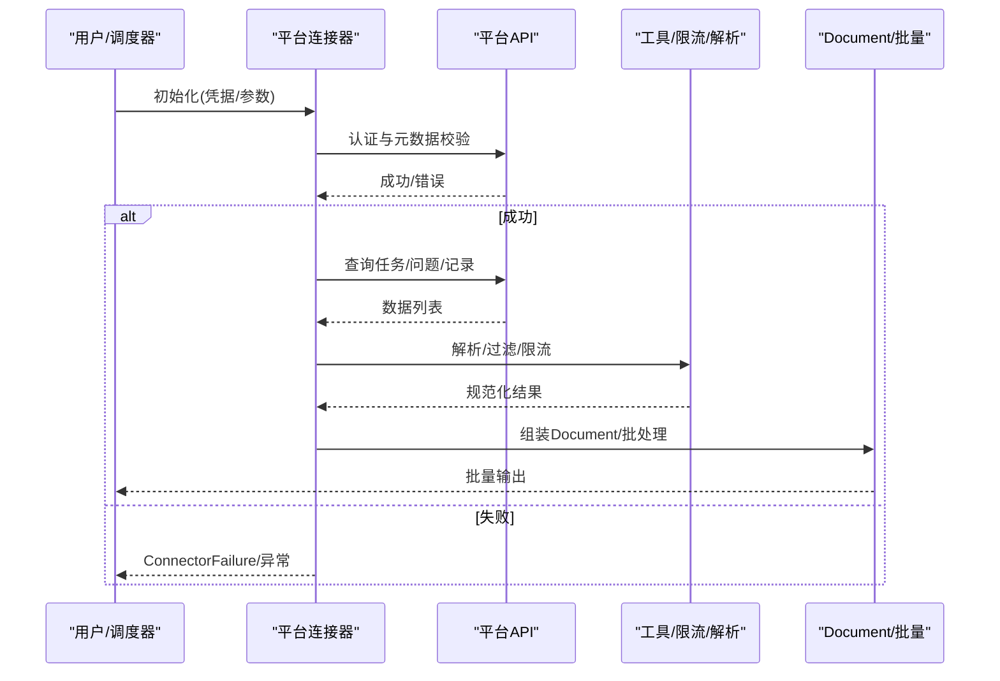
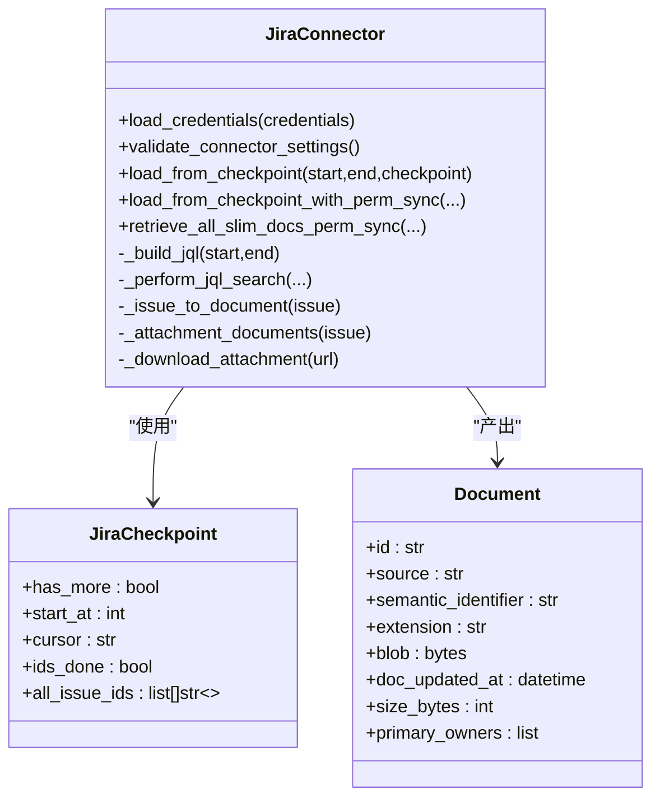
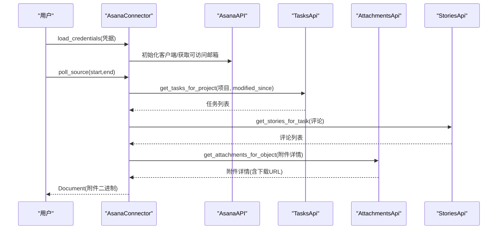
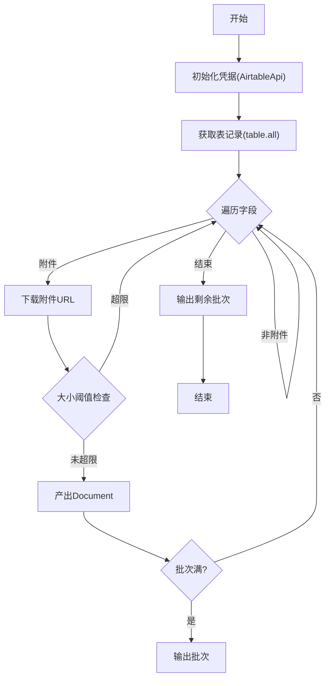
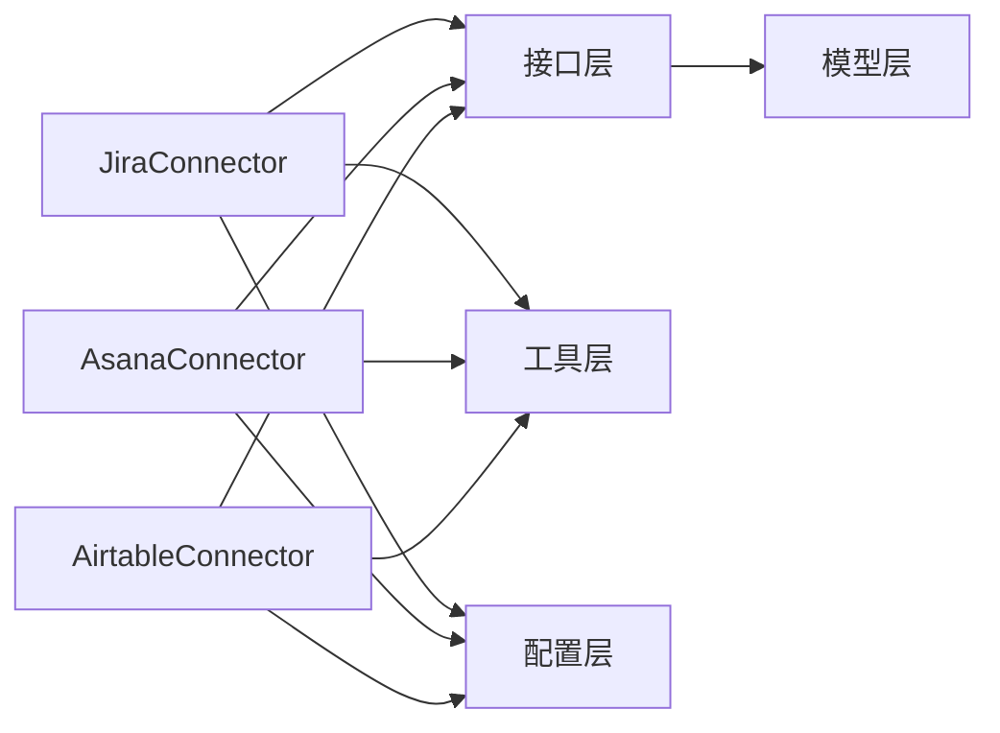

# 项目管理连接器

<cite>
**本文引用的文件**
- [common/data_source/jira/connector.py](file://common/data_source/jira/connector.py)
- [common/data_source/jira/utils.py](file://common/data_source/jira/utils.py)
- [common/data_source/asana_connector.py](file://common/data_source/asana_connector.py)
- [common/data_source/airtable_connector.py](file://common/data_source/airtable_connector.py)
- [common/data_source/config.py](file://common/data_source/config.py)
- [common/data_source/models.py](file://common/data_source/models.py)
- [common/data_source/interfaces.py](file://common/data_source/interfaces.py)
- [common/data_source/utils.py](file://common/data_source/utils.py)
- [common/data_source/exceptions.py](file://common/data_source/exceptions.py)
- [common/data_source/__init__.py](file://common/data_source/__init__.py)
</cite>

## 目录
1. [简介](#简介)
2. [项目结构](#项目结构)
3. [核心组件](#核心组件)
4. [架构总览](#架构总览)
5. [详细组件分析](#详细组件分析)
6. [依赖分析](#依赖分析)
7. [性能考虑](#性能考虑)
8. [故障排查指南](#故障排查指南)
9. [结论](#结论)
10. [附录](#附录)

## 简介
本文件面向项目管理连接器的实现与使用，重点覆盖以下内容：
- Jira、Asana、Airtable 等项目管理平台的 API 集成方式与差异
- 问题、任务、项目、时间线等项目管理概念在各平台中的获取与解析
- 将不同平台的任务结构标准化为统一知识管理格式的方法
- 权限处理与数据访问控制机制
- 配置参数说明与使用示例（含 API 端点、认证方式、筛选条件）
- 复杂项目关系与依赖的处理策略
- 增量同步的最佳实践

## 项目结构
项目管理连接器位于通用数据源模块中，采用“按平台拆分”的组织方式，每个平台一个独立文件，并共享公共接口、模型与工具函数。

图表来源
- [common/data_source/interfaces.py:21-46](file://common/data_source/interfaces.py#L21-L46)
- [common/data_source/models.py:88-101](file://common/data_source/models.py#L88-L101)
- [common/data_source/config.py:41-66](file://common/data_source/config.py#L41-L66)
- [common/data_source/utils.py:54-90](file://common/data_source/utils.py#L54-L90)
- [common/data_source/exceptions.py:4-30](file://common/data_source/exceptions.py#L4-L30)
- [common/data_source/jira/connector.py:82-122](file://common/data_source/jira/connector.py#L82-L122)
- [common/data_source/jira/utils.py:18-50](file://common/data_source/jira/utils.py#L18-L50)
- [common/data_source/asana_connector.py:39-60](file://common/data_source/asana_connector.py#L39-L60)
- [common/data_source/airtable_connector.py:22-41](file://common/data_source/airtable_connector.py#L22-L41)

章节来源
- [common/data_source/__init__.py:34-42](file://common/data_source/__init__.py#L34-L42)

## 核心组件
- 接口层：定义加载、轮询、检查点与权限同步的统一接口，确保各平台连接器行为一致。
- 模型层：统一的 Document、SlimDocument、ExternalAccess、ConnectorCheckpoint 等模型，支撑跨平台数据标准化。
- 工具层：日期解析、时区处理、限流重试、大小阈值检测、下载工具等，保障稳定性与一致性。
- 平台连接器：Jira、Asana、Airtable 的具体实现，负责调用平台 API、解析响应并产出标准化文档。

章节来源
- [common/data_source/interfaces.py:21-46](file://common/data_source/interfaces.py#L21-L46)
- [common/data_source/models.py:88-101](file://common/data_source/models.py#L88-L101)
- [common/data_source/config.py:103-107](file://common/data_source/config.py#L103-L107)
- [common/data_source/utils.py:54-90](file://common/data_source/utils.py#L54-L90)

## 架构总览
下图展示从平台 API 到统一文档输出的整体流程，以及权限与检查点的关键节点。

图表来源
- [common/data_source/interfaces.py:21-46](file://common/data_source/interfaces.py#L21-L46)
- [common/data_source/models.py:88-101](file://common/data_source/models.py#L88-L101)
- [common/data_source/utils.py:205-227](file://common/data_source/utils.py#L205-L227)

## 详细组件分析

### Jira 连接器
- 职责与能力
  - 支持云版与服务器版 Jira，自动识别 API 版本与时间轴精度。
  - 支持基于 JQL 或项目键的增量拉取，带检查点与重试。
  - 可选抽取评论与附件，支持标签过滤与邮箱黑名单。
  - 自动同步时区偏移，兼容分钟级时间戳与二次过滤去重。
- 关键实现要点
  - 凭据加载：支持 API Token、用户名+密码、以及 Atlassian Cloud 的作用域令牌。
  - 查询构建：自动生成 JQL，包含项目/标签/时间范围/排序。
  - 分页与批量：云版使用增强搜索+批量拉取，服务器版使用传统分页。
  - 文档生成：将问题描述、评论、附件摘要等整合为 Markdown 文档；附件单独作为文档输出。
  - 错误处理：针对 401/403/404/429 等状态码进行分类处理；对时间误差进行缓冲重试。
- 标准化字段
  - 使用统一的 Document 字段：id、source、semantic_identifier、extension、blob、doc_updated_at、size_bytes、primary_owners 等。
  - metadata 行为：通过头部注释或键值对形式保留关键元信息（如 key、url、summary、status、priority、issue_type、project、project_key、reporter、assignee、labels、created、updated）。
- 增量同步
  - 基于 updated 时间范围与检查点 start_at/cursor 实现增量。
  - 对 JQL 的分钟级精度与实际秒级过滤进行双重去重。

图表来源
- [common/data_source/jira/connector.py:70-122](file://common/data_source/jira/connector.py#L70-L122)
- [common/data_source/jira/connector.py:447-528](file://common/data_source/jira/connector.py#L447-L528)
- [common/data_source/models.py:88-101](file://common/data_source/models.py#L88-L101)

章节来源
- [common/data_source/jira/connector.py:82-122](file://common/data_source/jira/connector.py#L82-L122)
- [common/data_source/jira/connector.py:128-173](file://common/data_source/jira/connector.py#L128-L173)
- [common/data_source/jira/connector.py:206-230](file://common/data_source/jira/connector.py#L206-L230)
- [common/data_source/jira/connector.py:276-343](file://common/data_source/jira/connector.py#L276-L343)
- [common/data_source/jira/connector.py:357-409](file://common/data_source/jira/connector.py#L357-L409)
- [common/data_source/jira/connector.py:414-438](file://common/data_source/jira/connector.py#L414-L438)
- [common/data_source/jira/connector.py:447-528](file://common/data_source/jira/connector.py#L447-L528)
- [common/data_source/jira/connector.py:530-582](file://common/data_source/jira/connector.py#L530-L582)
- [common/data_source/jira/connector.py:671-704](file://common/data_source/jira/connector.py#L671-L704)
- [common/data_source/jira/connector.py:705-732](file://common/data_source/jira/connector.py#L705-L732)
- [common/data_source/jira/connector.py:733-751](file://common/data_source/jira/connector.py#L733-L751)
- [common/data_source/jira/connector.py:753-769](file://common/data_source/jira/connector.py#L753-L769)
- [common/data_source/jira/connector.py:771-787](file://common/data_source/jira/connector.py#L771-L787)
- [common/data_source/jira/connector.py:797-800](file://common/data_source/jira/connector.py#L797-L800)
- [common/data_source/jira/utils.py:18-50](file://common/data_source/jira/utils.py#L18-L50)

### Asana 连接器
- 职责与能力
  - 通过 Asana Tasks API 获取任务，支持工作区维度与可选项目白名单。
  - 抓取任务描述、创建者、截止日期、最后修改时间等元信息。
  - 抓取评论故事（Stories），并将其转为文本。
  - 下载附件为原始二进制，作为独立文档入库。
  - 支持私有项目与团队可见性过滤。
- 关键实现要点
  - 凭据加载：使用 API Token 初始化 Asana 客户端。
  - 项目过滤：根据工作区与团队设置决定是否处理私有项目。
  - 任务抓取：按项目分页获取任务，构造任务文本，附加评论与修改时间。
  - 附件下载：先列出附件，再展开获取下载地址，限制大小阈值。
  - 权限：通过工作区用户集合与项目成员集合推导可访问邮箱集合，用于文档的 primary_owners。
- 标准化字段
  - id：asana:{task_gid}:{attachment_gid}
  - source：ASANA
  - semantic_identifier：文件名
  - extension：文件扩展名
  - doc_updated_at：任务最后修改时间
  - primary_owners：工作区可访问邮箱集合

图表来源
- [common/data_source/asana_connector.py:39-60](file://common/data_source/asana_connector.py#L39-L60)
- [common/data_source/asana_connector.py:61-98](file://common/data_source/asana_connector.py#L61-L98)
- [common/data_source/asana_connector.py:99-175](file://common/data_source/asana_connector.py#L99-L175)
- [common/data_source/asana_connector.py:176-196](file://common/data_source/asana_connector.py#L176-L196)
- [common/data_source/asana_connector.py:198-222](file://common/data_source/asana_connector.py#L198-L222)
- [common/data_source/asana_connector.py:224-262](file://common/data_source/asana_connector.py#L224-L262)
- [common/data_source/asana_connector.py:264-310](file://common/data_source/asana_connector.py#L264-L310)
- [common/data_source/asana_connector.py:330-360](file://common/data_source/asana_connector.py#L330-L360)
- [common/data_source/asana_connector.py:362-382](file://common/data_source/asana_connector.py#L362-L382)
- [common/data_source/asana_connector.py:388-426](file://common/data_source/asana_connector.py#L388-L426)

章节来源
- [common/data_source/asana_connector.py:39-60](file://common/data_source/asana_connector.py#L39-L60)
- [common/data_source/asana_connector.py:61-98](file://common/data_source/asana_connector.py#L61-L98)
- [common/data_source/asana_connector.py:99-175](file://common/data_source/asana_connector.py#L99-L175)
- [common/data_source/asana_connector.py:176-196](file://common/data_source/asana_connector.py#L176-L196)
- [common/data_source/asana_connector.py:198-222](file://common/data_source/asana_connector.py#L198-L222)
- [common/data_source/asana_connector.py:224-262](file://common/data_source/asana_connector.py#L224-L262)
- [common/data_source/asana_connector.py:264-310](file://common/data_source/asana_connector.py#L264-L310)
- [common/data_source/asana_connector.py:330-360](file://common/data_source/asana_connector.py#L330-L360)
- [common/data_source/asana_connector.py:362-382](file://common/data_source/asana_connector.py#L362-L382)
- [common/data_source/asana_connector.py:388-426](file://common/data_source/asana_connector.py#L388-L426)

### Airtable 连接器
- 职责与能力
  - 以“记录-字段-附件”三层结构抓取数据，仅下载附件为原始二进制。
  - 支持全量索引与按更新时间轮询两种模式。
  - 通过大小阈值限制避免超大附件入库。
- 关键实现要点
  - 凭据加载：使用 Access Token 初始化 Airtable 客户端。
  - 全量抓取：遍历表中所有记录，提取字段值，过滤出附件列表。
  - 附件下载：请求下载 URL，按大小阈值过滤后产出 Document。
  - 更新时间：使用记录创建时间作为文档更新时间。
- 标准化字段
  - id：airtable:{record_id}:{attachment_id}
  - source：AIRTABLE
  - semantic_identifier：文件名
  - extension：文件扩展名
  - doc_updated_at：记录创建时间
  - blob：附件二进制

图表来源
- [common/data_source/airtable_connector.py:45-47](file://common/data_source/airtable_connector.py#L45-L47)
- [common/data_source/airtable_connector.py:58-73](file://common/data_source/airtable_connector.py#L58-L73)
- [common/data_source/airtable_connector.py:74-132](file://common/data_source/airtable_connector.py#L74-L132)
- [common/data_source/airtable_connector.py:134-152](file://common/data_source/airtable_connector.py#L134-L152)

章节来源
- [common/data_source/airtable_connector.py:22-41](file://common/data_source/airtable_connector.py#L22-L41)
- [common/data_source/airtable_connector.py:45-47](file://common/data_source/airtable_connector.py#L45-L47)
- [common/data_source/airtable_connector.py:58-73](file://common/data_source/airtable_connector.py#L58-L73)
- [common/data_source/airtable_connector.py:74-132](file://common/data_source/airtable_connector.py#L74-L132)
- [common/data_source/airtable_connector.py:134-152](file://common/data_source/airtable_connector.py#L134-L152)

## 依赖分析
- 组件耦合
  - 各连接器均依赖统一接口（LoadConnector/PollConnector/CheckpointedConnectorWithPermSync/SlimConnectorWithPermSync）与模型（Document/SlimDocument/ExternalAccess/ConnectorCheckpoint）。
  - 工具层提供日期解析、限流、大小阈值、下载等通用能力，降低重复实现。
- 外部依赖
  - Jira：jira 库、Atlassian 云/服务器 API 版本差异。
  - Asana：asana SDK、多 API 客户端（Tasks/Attachments/Stories/Users/Projects/Workspaces）。
  - Airtable：pyairtable、requests。
- 配置与阈值
  - 通过环境变量与配置常量统一管理批大小、大小阈值、时区偏移、API 版本等。

图表来源
- [common/data_source/interfaces.py:21-46](file://common/data_source/interfaces.py#L21-L46)
- [common/data_source/models.py:88-101](file://common/data_source/models.py#L88-L101)
- [common/data_source/config.py:103-107](file://common/data_source/config.py#L103-L107)
- [common/data_source/utils.py:54-90](file://common/data_source/utils.py#L54-L90)

章节来源
- [common/data_source/config.py:267-273](file://common/data_source/config.py#L267-L273)
- [common/data_source/config.py:200-213](file://common/data_source/config.py#L200-L213)

## 性能考虑
- 分页与批量
  - Jira 云版使用增强搜索+批量拉取，减少往返次数；服务器版使用传统分页。
  - Asana 与 Airtable 默认小批量输出，便于内存控制与并发处理。
- 限流与重试
  - 通用限流包装器对 429 与速率限制进行指数退避与 Retry-After 处理。
  - Jira 在特定时间误差场景下自动回退一小时重试，提升稳定性。
- 大小与阈值
  - 通过大小阈值与分块下载避免超大对象占用内存与存储。
- 并发与批处理
  - 建议在上层调度器中对多个连接器并行执行，结合批次大小与队列长度控制资源占用。

章节来源
- [common/data_source/utils.py:205-227](file://common/data_source/utils.py#L205-L227)
- [common/data_source/utils.py:602-604](file://common/data_source/utils.py#L602-L604)
- [common/data_source/config.py:103-107](file://common/data_source/config.py#L103-L107)
- [common/data_source/config.py:267-273](file://common/data_source/config.py#L267-L273)

## 故障排查指南
- 常见异常
  - 缺少凭据：抛出“缺少凭据”异常，需检查用户名/密码或 API Token。
  - 权限不足：401/403 明确提示无效或过期凭据、无权限访问资源。
  - 资源不存在：404 提示资源未找到。
  - 速率限制：429 或包含“Rate limit exceeded”的响应，触发限流重试。
  - Jira 时间误差：当 JQL 的 updated 字段出现无效错误时，自动回退一小时重试。
- 排查步骤
  - 校验凭据与平台版本（云/服务器）。
  - 检查网络与代理设置，确认 API 可达。
  - 查看日志中的失败条目与错误堆栈，定位具体环节（查询/解析/下载）。
  - 调整批次大小、大小阈值与重试策略，观察吞吐变化。
- 相关实现参考
  - 异常类型定义与处理分支。
  - 通用限流与重试包装器。
  - Jira 时间误差检测与缓冲重试。

章节来源
- [common/data_source/exceptions.py:4-30](file://common/data_source/exceptions.py#L4-L30)
- [common/data_source/utils.py:112-158](file://common/data_source/utils.py#L112-L158)
- [common/data_source/utils.py:602-604](file://common/data_source/utils.py#L602-L604)
- [common/data_source/jira/connector.py:259-274](file://common/data_source/jira/connector.py#L259-L274)

## 结论
本项目管理连接器通过统一接口与模型，实现了对 Jira、Asana、Airtable 的标准化接入。其核心优势在于：
- 统一的数据模型与文档结构，便于后续检索与分析。
- 完善的错误处理与限流机制，保障大规模运行的稳定性。
- 增量同步与检查点设计，满足持续索引需求。
- 对权限与访问控制的抽象，便于扩展到更复杂的权限体系。

## 附录

### 配置参数与使用示例
- 通用配置
  - 批次大小：INDEX_BATCH_SIZE（默认较小，适合增量与并发）
  - 大小阈值：JIRA/AIRTABLE/ASANA 对应阈值，超出则跳过
  - 时区偏移：JIRA_TIMEZONE_OFFSET，默认取本地时区
- Jira
  - 认证方式：API Token（云）或用户名+密码（服务器），可选作用域令牌
  - 查询方式：提供 project_key 或自定义 JQL；支持标签过滤与评论邮箱黑名单
  - 输出：Markdown 文档（含元数据与正文/评论/附件摘要），附件单独文档
- Asana
  - 认证方式：API Token
  - 查询方式：工作区 + 可选项目白名单；按 modified_since 过滤
  - 输出：任务文本 + 评论；附件二进制文档
- Airtable
  - 认证方式：Access Token
  - 查询方式：Base + 表名或ID；全量抓取或轮询
  - 输出：附件二进制文档

章节来源
- [common/data_source/config.py:103-107](file://common/data_source/config.py#L103-L107)
- [common/data_source/config.py:200-213](file://common/data_source/config.py#L200-L213)
- [common/data_source/config.py:267-273](file://common/data_source/config.py#L267-L273)
- [common/data_source/jira/connector.py:82-122](file://common/data_source/jira/connector.py#L82-L122)
- [common/data_source/jira/connector.py:128-173](file://common/data_source/jira/connector.py#L128-L173)
- [common/data_source/jira/connector.py:414-438](file://common/data_source/jira/connector.py#L414-L438)
- [common/data_source/asana_connector.py:330-360](file://common/data_source/asana_connector.py#L330-L360)
- [common/data_source/asana_connector.py:362-382](file://common/data_source/asana_connector.py#L362-L382)
- [common/data_source/airtable_connector.py:58-73](file://common/data_source/airtable_connector.py#L58-L73)
- [common/data_source/airtable_connector.py:134-152](file://common/data_source/airtable_connector.py#L134-L152)

### 处理复杂项目关系与依赖的策略
- 依赖与关系建模
  - 当前实现主要面向“任务/问题/记录”本身，不直接解析跨任务依赖关系。
  - 若需关系建模，建议在上层进行二次解析（如从评论/描述中抽取关联标识），并结合知识图谱构建。
- 项目边界与权限
  - Asana 私有项目与团队可见性过滤，确保只处理可访问项目。
  - Jira 通过权限同步接口与标签过滤，避免无关数据进入索引。
- 冲突与重复
  - JQL 分钟级与二次过滤的双重去重策略，避免重复索引。
  - 附件下载前的大小阈值检查，防止超大对象阻塞流程。

章节来源
- [common/data_source/asana_connector.py:107-124](file://common/data_source/asana_connector.py#L107-L124)
- [common/data_source/jira/connector.py:306-314](file://common/data_source/jira/connector.py#L306-L314)

### 增量同步最佳实践
- 时间窗口
  - 使用 updated 字段作为增量依据，起始时间可带缓冲（如 Jira 的一小时缓冲）。
- 检查点
  - 保存 start_at/cursor 与已处理 ID 列表，断点续跑。
- 批次与并发
  - 控制批次大小与并发度，避免触发平台限流。
- 错误恢复
  - 对 429/403 等进行指数退避；对 JQL 时间误差进行自动回退重试。

章节来源
- [common/data_source/jira/connector.py:245-257](file://common/data_source/jira/connector.py#L245-L257)
- [common/data_source/jira/connector.py:276-343](file://common/data_source/jira/connector.py#L276-L343)
- [common/data_source/utils.py:205-227](file://common/data_source/utils.py#L205-L227)