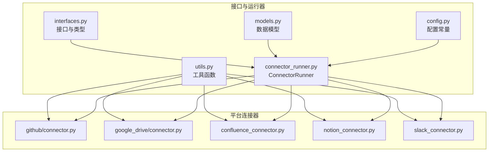
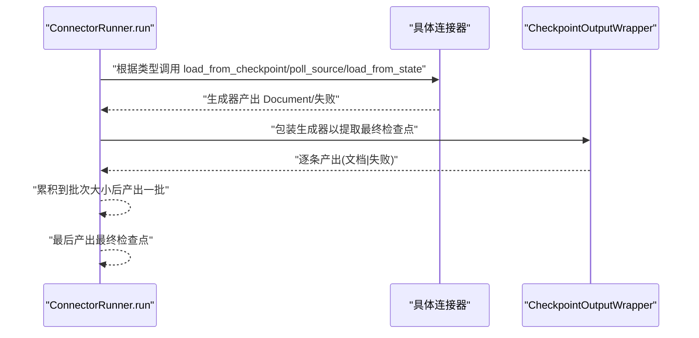
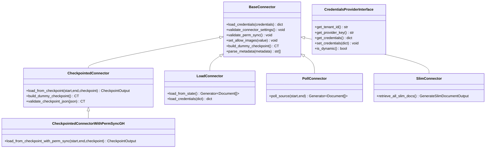
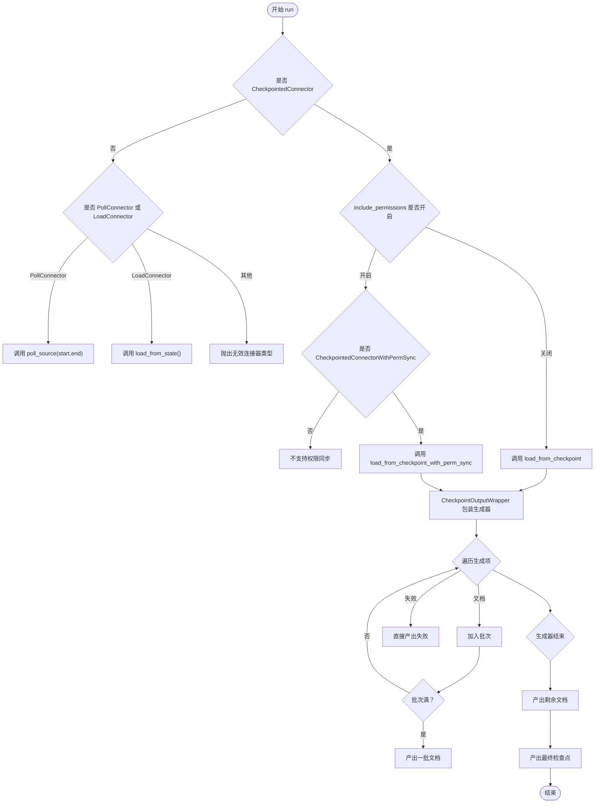
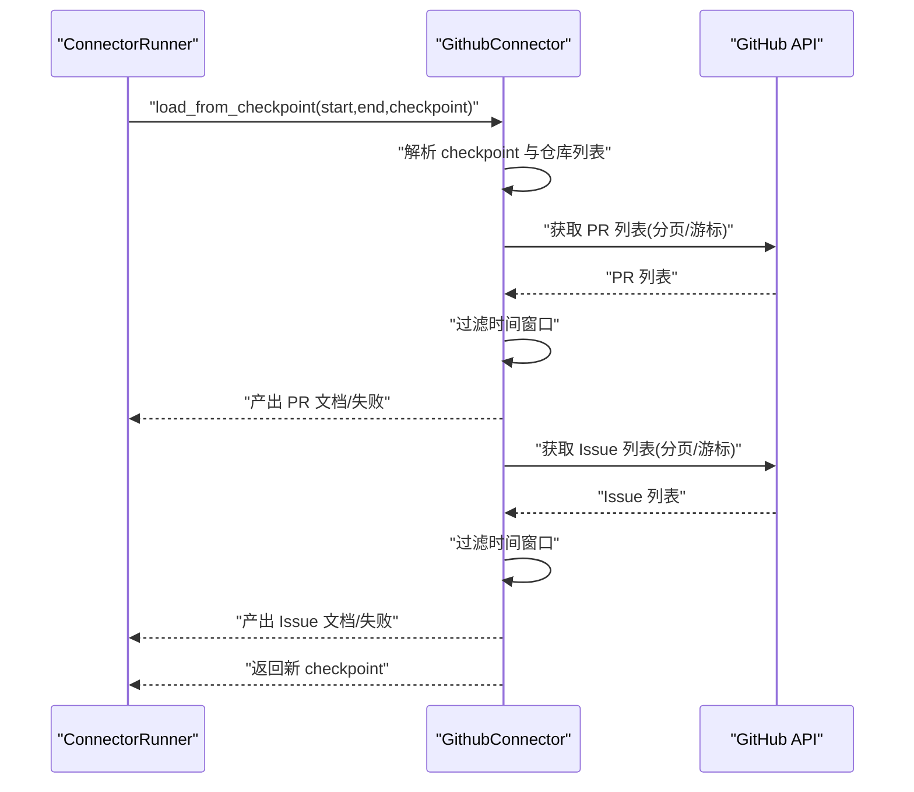
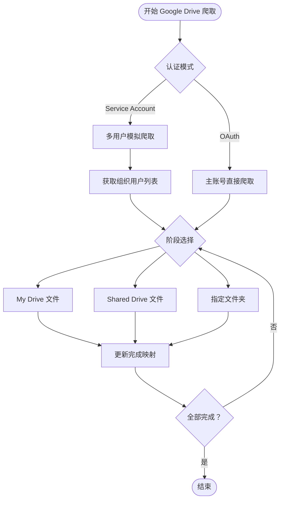
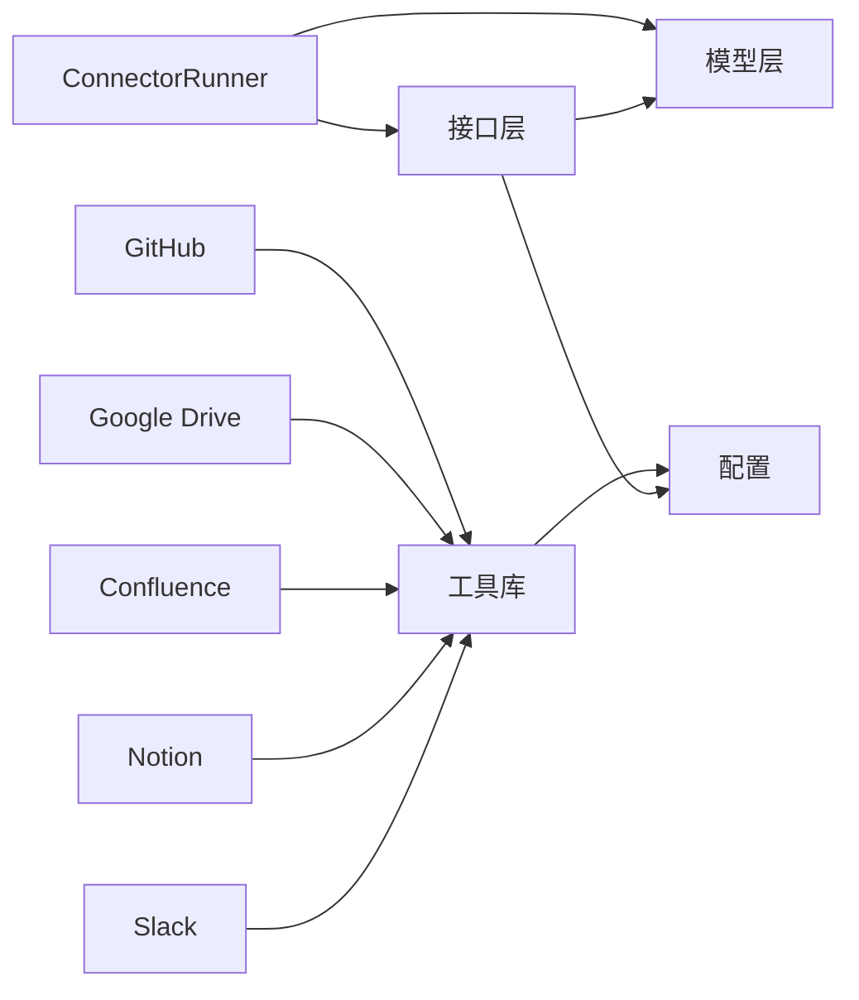

# 数据源连接器

<cite>
**本文引用的文件**
- [common/data_source/interfaces.py](file://common/data_source/interfaces.py)
- [common/data_source/connector_runner.py](file://common/data_source/connector_runner.py)
- [common/data_source/models.py](file://common/data_source/models.py)
- [common/data_source/config.py](file://common/data_source/config.py)
- [common/data_source/utils.py](file://common/data_source/utils.py)
- [common/data_source/github/connector.py](file://common/data_source/github/connector.py)
- [common/data_source/google_drive/connector.py](file://common/data_source/google_drive/connector.py)
- [common/data_source/confluence_connector.py](file://common/data_source/confluence_connector.py)
- [common/data_source/notion_connector.py](file://common/data_source/notion_connector.py)
- [common/data_source/slack_connector.py](file://common/data_source/slack_connector.py)
</cite>

## 目录
1. [简介](#简介)
2. [项目结构](#项目结构)
3. [核心组件](#核心组件)
4. [架构总览](#架构总览)
5. [详细组件分析](#详细组件分析)
6. [依赖关系分析](#依赖关系分析)
7. [性能考量](#性能考量)
8. [故障排查指南](#故障排查指南)
9. [结论](#结论)
10. [附录：配置与使用示例](#附录配置与使用示例)

## 简介
本指南面向开发者与运维人员，系统性讲解数据源连接器体系的设计与实现，覆盖接口抽象、运行时编排、各类数据源实现、生命周期管理、最佳实践与配置说明。目标是帮助你在最短时间内理解并高效扩展新的数据源连接器。

## 项目结构
数据源连接器位于 common/data_source 目录下，采用“接口层 + 运行器 + 模型 + 配置 + 工具 + 各平台实现”的分层组织方式：
- 接口层：定义统一的连接器抽象（如 CheckpointedConnector、PollConnector、SlimConnector 等）
- 运行器：ConnectorRunner 负责批量、异常日志、权限同步、时间窗口控制等横切能力
- 模型层：Document、SlimDocument、ConnectorCheckpoint、ConnectorFailure 等数据模型
- 配置层：DocumentSource、BlobType、常量与环境变量配置
- 工具层：通用请求重试、速率限制、并发下载、文本清洗、OAuth 辅助等
- 平台实现：GitHub、Google Drive、Confluence、Notion、Slack 等具体连接器

图表来源
- [common/data_source/interfaces.py:1-420](file://common/data_source/interfaces.py#L1-L420)
- [common/data_source/connector_runner.py:1-217](file://common/data_source/connector_runner.py#L1-L217)
- [common/data_source/models.py:1-314](file://common/data_source/models.py#L1-L314)
- [common/data_source/config.py:1-303](file://common/data_source/config.py#L1-L303)
- [common/data_source/utils.py:1-800](file://common/data_source/utils.py#L1-L800)
- [common/data_source/github/connector.py:1-973](file://common/data_source/github/connector.py#L1-L973)
- [common/data_source/google_drive/connector.py:1-1258](file://common/data_source/google_drive/connector.py#L1-L1258)
- [common/data_source/confluence_connector.py:1-2107](file://common/data_source/confluence_connector.py#L1-L2107)
- [common/data_source/notion_connector.py:1-656](file://common/data_source/notion_connector.py#L1-L656)
- [common/data_source/slack_connector.py:1-665](file://common/data_source/slack_connector.py#L1-L665)

章节来源
- [common/data_source/interfaces.py:1-420](file://common/data_source/interfaces.py#L1-L420)
- [common/data_source/connector_runner.py:1-217](file://common/data_source/connector_runner.py#L1-L217)
- [common/data_source/models.py:1-314](file://common/data_source/models.py#L1-L314)
- [common/data_source/config.py:1-303](file://common/data_source/config.py#L1-L303)
- [common/data_source/utils.py:1-800](file://common/data_source/utils.py#L1-L800)

## 核心组件
- 接口抽象
  - BaseConnector：统一加载凭据、元数据解析、校验钩子、图片允许策略等
  - CheckpointedConnector：支持断点续传的增量拉取，返回文档或失败，并最终返回新检查点
  - CheckpointedConnectorWithPermSyncGH：带权限同步的 GitHub 特化接口
  - LoadConnector/PollConnector/SlimConnector：分别对应“从状态加载”“按时间轮询”“仅获取文档ID（轻量）”
  - CredentialsProviderInterface：动态/静态凭据提供者抽象
- 运行器 ConnectorRunner
  - 统一封装批量产出、异常日志、权限同步开关、时间窗口、不同连接器类型的适配
- 数据模型
  - Document、SlimDocument、ConnectorCheckpoint、ConnectorFailure、ExternalAccess 等
- 配置与常量
  - DocumentSource、BlobType、索引批大小、超时、限流阈值、图像类型白名单等
- 工具库
  - 速率限制与重试、并发下载、文本清洗、OAuth 工具、字段提取、时间转换等

章节来源
- [common/data_source/interfaces.py:21-420](file://common/data_source/interfaces.py#L21-L420)
- [common/data_source/connector_runner.py:91-217](file://common/data_source/connector_runner.py#L91-L217)
- [common/data_source/models.py:88-155](file://common/data_source/models.py#L88-L155)
- [common/data_source/config.py:41-303](file://common/data_source/config.py#L41-L303)
- [common/data_source/utils.py:105-235](file://common/data_source/utils.py#L105-L235)

## 架构总览
ConnectorRunner 将不同类型的连接器统一编排，负责：
- 批量聚合：将小批次输出合并为指定大小的批次
- 权限同步：在 CheckpointedConnectorWithPermSync 的场景下启用
- 异常增强：捕获底层异常，附加本地变量上下文便于定位
- 时间窗口：对 Checkpointed/Poll 类连接器强制要求时间范围
- 检查点推进：从生成器中抽取最终检查点并回传

图表来源
- [common/data_source/connector_runner.py:119-196](file://common/data_source/connector_runner.py#L119-L196)
- [common/data_source/interfaces.py:257-343](file://common/data_source/interfaces.py#L257-L343)

章节来源
- [common/data_source/connector_runner.py:91-217](file://common/data_source/connector_runner.py#L91-L217)

## 详细组件分析

### 接口与类型体系
- BaseConnector
  - 负责凭据加载、元数据解析、校验钩子、图片策略、空检查点构建
  - 提供 parse_metadata 将字典元数据转为提示词可用字符串
- CheckpointedConnector
  - 规定 load_from_checkpoint(start, end, checkpoint) 的生成器协议
  - 生成器末尾必须返回新的检查点对象
- CheckpointedConnectorWithPermSyncGH
  - 增加带权限同步的变体方法
- Load/Poll/Slim Connector
  - 分别对应一次性/轮询/轻量三种模式
- CredentialsProviderInterface
  - 支持静态/动态凭据，提供租户ID、提供者键、进入/退出锁、凭据读写等

图表来源
- [common/data_source/interfaces.py:21-356](file://common/data_source/interfaces.py#L21-L356)

章节来源
- [common/data_source/interfaces.py:21-356](file://common/data_source/interfaces.py#L21-L356)

### ConnectorRunner 编排逻辑
- 批量聚合：batched_doc_ids/内部 doc_batch
- 权限同步：仅在 CheckpointedConnectorWithPermSync 下启用 include_permissions
- 异常增强：捕获异常栈顶帧的局部变量，输出到日志
- 时间窗口：强制要求 Checkpointed/Poll 类连接器提供时间范围
- 检查点推进：通过 CheckpointOutputWrapper 抽取最终检查点

图表来源
- [common/data_source/connector_runner.py:119-196](file://common/data_source/connector_runner.py#L119-L196)
- [common/data_source/interfaces.py:300-343](file://common/data_source/interfaces.py#L300-L343)

章节来源
- [common/data_source/connector_runner.py:91-217](file://common/data_source/connector_runner.py#L91-L217)

### GitHub 连接器
- 功能特性
  - 支持单仓库/多仓库/全组织仓库
  - 增量拉取 PR 与 Issue，支持偏移/游标两种分页策略
  - 基于时间窗口过滤，支持权限同步（外部访问）
  - 失败记录与重试（速率限制）
- 关键点
  - GithubConnectorCheckpoint：记录阶段、页码、游标、已检索数量
  - _get_batch_rate_limited：封装分页与速率限制重试
  - load_from_checkpoint/load_from_checkpoint_with_perm_sync：按时间窗口与权限同步产出文档
  - 文档元数据包含对象类型、状态、用户、标签、时间戳等

图表来源
- [common/data_source/github/connector.py:529-740](file://common/data_source/github/connector.py#L529-L740)
- [common/data_source/connector_runner.py:119-196](file://common/data_source/connector_runner.py#L119-L196)

章节来源
- [common/data_source/github/connector.py:1-973](file://common/data_source/github/connector.py#L1-L973)

### Google Drive 连接器
- 功能特性
  - 支持服务账号与 OAuth 两种认证
  - 多用户模拟（服务账号）、共享盘、我的驱动、特定文件夹爬取
  - 分阶段完成（My Drive → Shared Drive → Folder），支持断点续传
  - 文件大小阈值、图像策略、权限同步
- 关键点
  - GoogleDriveCheckpoint：记录完成阶段、当前对象、游标、已检索集合
  - _manage_service_account_retrieval：多线程模拟用户并行爬取
  - _checkpointed_retrieval：基于 seen 集合避免重复产出
  - 权限同步：通过 PermissionSyncContext 与 ExternalAccess

图表来源
- [common/data_source/google_drive/connector.py:508-599](file://common/data_source/google_drive/connector.py#L508-L599)
- [common/data_source/google_drive/connector.py:740-767](file://common/data_source/google_drive/connector.py#L740-L767)

章节来源
- [common/data_source/google_drive/connector.py:1-1258](file://common/data_source/google_drive/connector.py#L1-L1258)

### Confluence 连接器
- 功能特性
  - 自定义 Confluence 客户端，内置速率限制与重试
  - CQL 查询、分页、展开字段容错（问题字段替换）
  - 用户/组权限查询、显示名缓存、外部访问信息
  - 附件大小与类型过滤、HTML 清洗
- 关键点
  - OnyxConfluence：统一认证刷新、探活、分页与错误恢复
  - ConfluenceCheckpoint：记录下一页 URL
  - 权限同步：通过用户/组查询构建 ExternalAccess

章节来源
- [common/data_source/confluence_connector.py:63-800](file://common/data_source/confluence_connector.py#L63-L800)

### Notion 连接器
- 功能特性
  - 页面/数据库递归索引、块内容解析、表格转 HTML、富文本抽取
  - 附件下载与文档化、路径重建、时间窗口过滤
  - 集成令牌验证、权限校验
- 关键点
  - NotionConnector：同时实现 Load/Poll 接口
  - 递归索引可由根页面 ID 触发，或全空间搜索

章节来源
- [common/data_source/notion_connector.py:1-656](file://common/data_source/notion_connector.py#L1-L656)

### Slack 连接器
- 功能特性
  - 频道筛选（正则/名称）、消息历史与回复线程拉取
  - 文本清洗（用户/频道/特殊提及替换）、专家信息缓存
  - 过滤规则（机器人、非信息类子类型）
- 关键点
  - 默认过滤器与消息清理器
  - 简化版权限同步（通道级外部访问）

章节来源
- [common/data_source/slack_connector.py:1-665](file://common/data_source/slack_connector.py#L1-L665)

## 依赖关系分析
- 运行器依赖接口与模型
  - ConnectorRunner 依赖 CheckpointedConnector、PollConnector、LoadConnector、SlimConnector 及 CheckpointOutputWrapper
- 平台连接器依赖工具与配置
  - GitHub/Google Drive/Confluence/Notion/Slack 均依赖 utils 中的速率限制、并发、文本清洗、OAuth 等工具
- 配置贯穿全局
  - DocumentSource/BlobType、索引批大小、超时、图像类型、环境变量等

图表来源
- [common/data_source/connector_runner.py:1-217](file://common/data_source/connector_runner.py#L1-L217)
- [common/data_source/interfaces.py:1-420](file://common/data_source/interfaces.py#L1-L420)
- [common/data_source/models.py:1-314](file://common/data_source/models.py#L1-L314)
- [common/data_source/config.py:1-303](file://common/data_source/config.py#L1-L303)
- [common/data_source/utils.py:1-800](file://common/data_source/utils.py#L1-L800)

章节来源
- [common/data_source/connector_runner.py:1-217](file://common/data_source/connector_runner.py#L1-L217)
- [common/data_source/interfaces.py:1-420](file://common/data_source/interfaces.py#L1-L420)
- [common/data_source/utils.py:1-800](file://common/data_source/utils.py#L1-L800)

## 性能考量
- 批量与并发
  - 使用 INDEX_BATCH_SIZE 控制批次大小；Google Drive 使用 MAX_DRIVE_WORKERS 控制并发
- 速率限制与重试
  - 统一的速率限制与指数退避重试；对 429/403/特定错误进行差异化处理
- I/O 与内存
  - 对大文件设置大小阈值与分块读取；图像类型白名单减少不必要处理
- 权限同步
  - 仅在需要时启用 include_permissions，避免额外 API 调用

章节来源
- [common/data_source/config.py:103-128](file://common/data_source/config.py#L103-L128)
- [common/data_source/utils.py:105-235](file://common/data_source/utils.py#L105-L235)
- [common/data_source/google_drive/connector.py:45-49](file://common/data_source/google_drive/connector.py#L45-L49)

## 故障排查指南
- 常见错误与定位
  - HTTP 429/403：触发速率限制重试策略，检查 REQUEST_TIMEOUT_SECONDS、MAX_RETRIES
  - 认证失败：检查令牌有效性与作用域（Slack/Notion/Confluence）
  - 权限不足：确认 OAuth scopes 或服务账号授权范围
- 日志增强
  - ConnectorRunner 捕获异常并打印局部变量上下文，便于快速定位
- 平台特有问题
  - Confluence：问题字段替换、服务器端 500 的逐项恢复
  - GitHub：游标过期回退至偏移分页、速率限制重试
  - Google Drive：服务账号用户列表获取失败、特定文件夹重复爬取规避

章节来源
- [common/data_source/connector_runner.py:196-217](file://common/data_source/connector_runner.py#L196-L217)
- [common/data_source/confluence_connector.py:442-581](file://common/data_source/confluence_connector.py#L442-L581)
- [common/data_source/github/connector.py:99-218](file://common/data_source/github/connector.py#L99-L218)
- [common/data_source/google_drive/connector.py:508-599](file://common/data_source/google_drive/connector.py#L508-L599)

## 结论
该连接器体系通过清晰的接口抽象与运行器编排，实现了对多平台数据源的一致接入与扩展。借助统一的检查点、权限同步与异常增强机制，开发者可以快速实现新的连接器并稳定地集成到生产环境中。

## 附录：配置与使用示例

### 配置参数总览
- 环境变量
  - REQUEST_TIMEOUT_SECONDS：默认请求超时秒数
  - CONTINUE_ON_CONNECTOR_FAILURE：遇到部分失败是否继续
  - NOTION_CONNECTOR_DISABLE_RECURSIVE_PAGE_LOOKUP：禁用 Notion 递归索引
  - CONFLUENCE_*、GOOGLE_DRIVE_*、JIRA_*、SLACK_*、GMAIL_*、IMAP_* 等平台相关配置
- 常量
  - INDEX_BATCH_SIZE、SLACK_NUM_THREADS、DOWNLOAD_CHUNK_SIZE、IMAGE_MIME_TYPES 等

章节来源
- [common/data_source/config.py:16-303](file://common/data_source/config.py#L16-L303)

### 连接器开发最佳实践
- 接口选择
  - 若支持断点续传与时间窗口：实现 CheckpointedConnector
  - 若仅一次性/轮询：实现 Load/Poll 接口
  - 若需权限同步：实现 SlimConnectorWithPermSync 或 CheckpointedConnectorWithPermSync
- 错误处理
  - 明确区分“文档级失败”与“实体级失败”，使用 ConnectorFailure/DocumentFailure
  - 对速率限制与网络波动进行指数退避重试
- 性能优化
  - 合理设置批次大小与并发度
  - 使用大小阈值与图像白名单减少无效处理
  - 断点续传避免重复拉取
- 权限同步
  - 在 CheckpointedConnectorWithPermSync 下启用 include_permissions
  - 使用 ExternalAccess 描述外部访问与公开状态

章节来源
- [common/data_source/interfaces.py:71-103](file://common/data_source/interfaces.py#L71-L103)
- [common/data_source/models.py:9-66](file://common/data_source/models.py#L9-L66)
- [common/data_source/utils.py:105-235](file://common/data_source/utils.py#L105-L235)

### 使用示例（以 GitHub 为例）
- 初始化连接器
  - 设置仓库所有者与仓库列表/通配
  - 加载凭据（GitHub Token）
- 运行编排
  - 构造 ConnectorRunner，设置 batch_size、include_permissions、时间窗口
  - 调用 run(checkpoint) 获取批次与最终检查点
- 处理结果
  - 逐批消费文档，遇到失败记录 ConnectorFailure
  - 保存最终检查点用于下次增量

章节来源
- [common/data_source/github/connector.py:413-800](file://common/data_source/github/connector.py#L413-L800)
- [common/data_source/connector_runner.py:119-196](file://common/data_source/connector_runner.py#L119-L196)