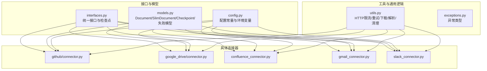
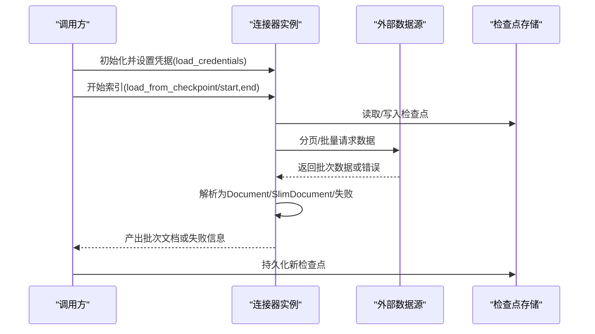
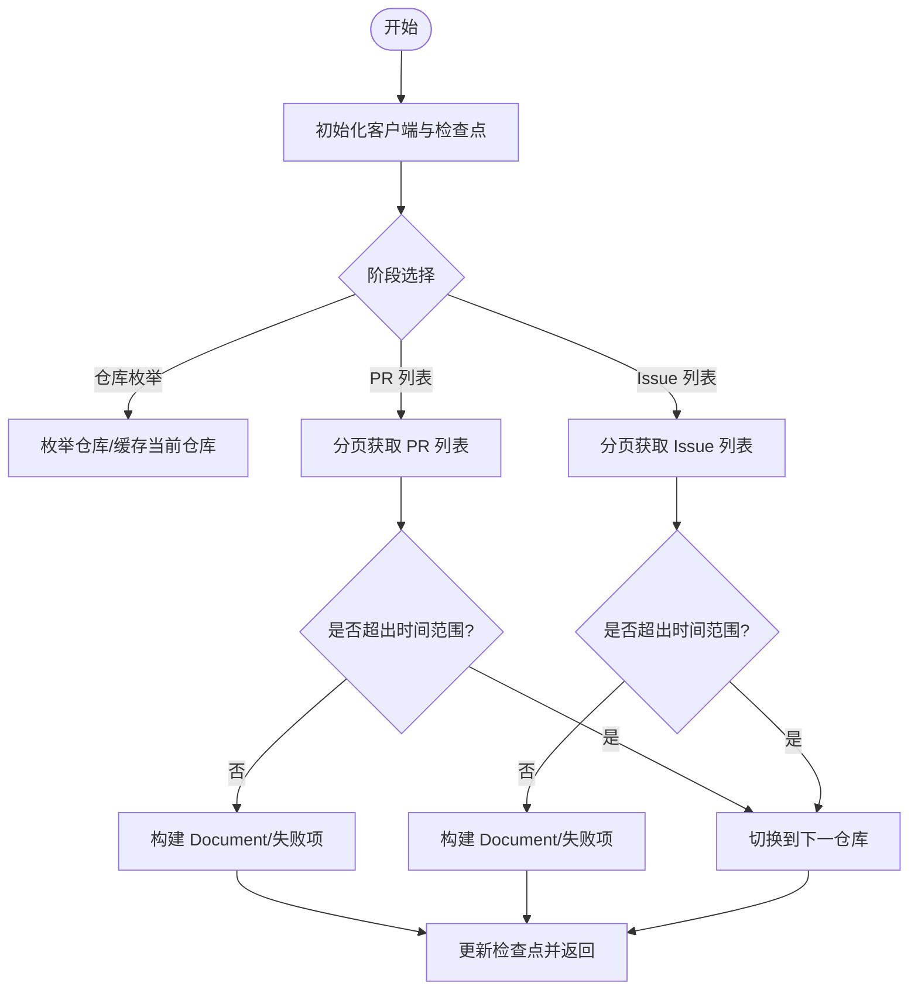
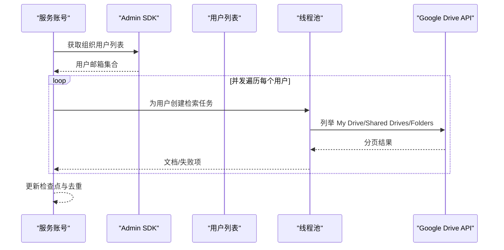
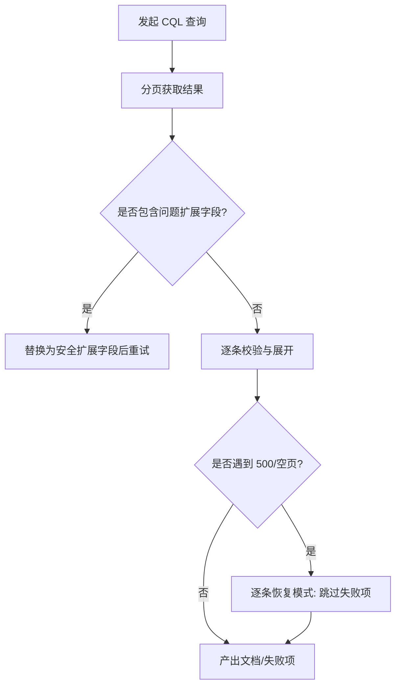
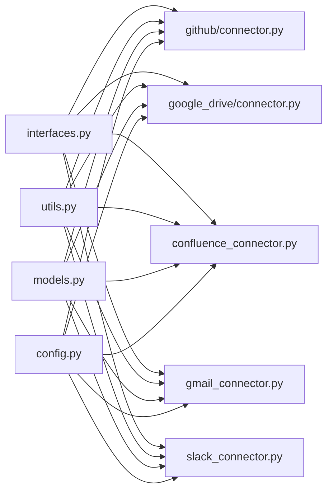

# 连接器开发指南

<cite>
**本文引用的文件**
- [common/data_source/interfaces.py](file://common/data_source/interfaces.py)
- [common/data_source/models.py](file://common/data_source/models.py)
- [common/data_source/config.py](file://common/data_source/config.py)
- [common/data_source/utils.py](file://common/data_source/utils.py)
- [common/data_source/exceptions.py](file://common/data_source/exceptions.py)
- [common/data_source/github/connector.py](file://common/data_source/github/connector.py)
- [common/data_source/google_drive/connector.py](file://common/data_source/google_drive/connector.py)
- [common/data_source/confluence_connector.py](file://common/data_source/confluence_connector.py)
- [common/data_source/gmail_connector.py](file://common/data_source/gmail_connector.py)
- [common/data_source/slack_connector.py](file://common/data_source/slack_connector.py)
</cite>

## 目录
1. [引言](#引言)
2. [项目结构](#项目结构)
3. [核心组件](#核心组件)
4. [架构总览](#架构总览)
5. [详细组件分析](#详细组件分析)
6. [依赖分析](#依赖分析)
7. [性能考虑](#性能考虑)
8. [故障排查指南](#故障排查指南)
9. [结论](#结论)
10. [附录](#附录)

## 引言
本指南面向需要在本项目中开发“数据源连接器”的工程师，系统讲解如何基于统一接口与模型体系，实现从外部系统拉取文档并进行索引的完整流程。内容涵盖接口继承、抽象方法实现、认证与配置加载、错误处理与重试、性能优化、内存管理、测试策略、部署与维护等。

## 项目结构
连接器开发的核心位于 common/data_source 目录，围绕以下层次组织：
- 接口与模型层：定义统一的连接器接口、检查点、文档与失败模型等
- 工具与配置层：通用工具函数、环境配置常量、限流与重试策略
- 具体连接器：GitHub、Google Drive、Confluence、Gmail、Slack 等

**图表来源**
- [common/data_source/interfaces.py:21-420](file://common/data_source/interfaces.py#L21-L420)
- [common/data_source/models.py:88-155](file://common/data_source/models.py#L88-L155)
- [common/data_source/config.py:1-303](file://common/data_source/config.py#L1-L303)
- [common/data_source/utils.py:1-800](file://common/data_source/utils.py#L1-L800)
- [common/data_source/github/connector.py:1-973](file://common/data_source/github/connector.py#L1-L973)
- [common/data_source/google_drive/connector.py:1-1258](file://common/data_source/google_drive/connector.py#L1-L1258)
- [common/data_source/confluence_connector.py:1-2107](file://common/data_source/confluence_connector.py#L1-L2107)
- [common/data_source/gmail_connector.py:1-346](file://common/data_source/gmail_connector.py#L1-L346)
- [common/data_source/slack_connector.py:1-665](file://common/data_source/slack_connector.py#L1-L665)

**章节来源**
- [common/data_source/interfaces.py:21-420](file://common/data_source/interfaces.py#L21-L420)
- [common/data_source/models.py:88-155](file://common/data_source/models.py#L88-L155)
- [common/data_source/config.py:1-303](file://common/data_source/config.py#L1-L303)

## 核心组件
- 统一接口族
  - 基类与检查点：BaseConnector、CheckpointedConnector、CheckpointOutputWrapper、CheckpointedConnectorWithPermSyncGH 等
  - 功能接口：LoadConnector（按状态加载）、PollConnector（轮询增量）、SlimConnector（仅ID/权限查询）、CredentialsConnector（凭据加载）
  - 权限同步：SlimConnectorWithPermSync、CheckpointedConnectorWithPermSync、CheckpointedConnectorWithPermSyncGH
- 数据模型
  - Document、SlimDocument、ConnectorCheckpoint、ConnectorFailure、ExternalAccess 等
- 配置与常量
  - 超时、批量大小、图片阈值、各平台 API 限制、OAuth 回调地址等
- 工具与异常
  - HTTP 限流与指数退避、S3/GCS/OSS/R2 客户端封装、文本/编码检测、Slack 文本清洗、Gmail 查询构造等
  - ConnectorMissingCredentialError、ConnectorValidationError、CredentialExpiredError、InsufficientPermissionsError、RateLimitTriedTooManyTimesError 等

**章节来源**
- [common/data_source/interfaces.py:21-420](file://common/data_source/interfaces.py#L21-L420)
- [common/data_source/models.py:88-155](file://common/data_source/models.py#L88-L155)
- [common/data_source/config.py:16-303](file://common/data_source/config.py#L16-L303)
- [common/data_source/utils.py:112-235](file://common/data_source/utils.py#L112-L235)
- [common/data_source/exceptions.py:4-30](file://common/data_source/exceptions.py#L4-L30)

## 架构总览
连接器遵循“接口驱动 + 检查点 + 权限同步”的设计范式：
- 统一接口约束：load_credentials、load_from_state/poll_source、load_from_checkpoint 等
- 检查点机制：通过 ConnectorCheckpoint 或自定义子类记录游标/阶段/进度，支持断点续跑
- 权限同步：可选地返回 ExternalAccess 以支持细粒度权限控制
- 并发与限流：利用线程池、分页迭代、指数退避与速率限制处理外部 API 的不稳定与配额限制

**图表来源**
- [common/data_source/interfaces.py:261-354](file://common/data_source/interfaces.py#L261-L354)
- [common/data_source/models.py:130-155](file://common/data_source/models.py#L130-L155)
- [common/data_source/utils.py:205-235](file://common/data_source/utils.py#L205-L235)

## 详细组件分析

### GitHub 连接器（复杂示例：带权限同步与多阶段/多分页）
- 设计要点
  - 多阶段：仓库枚举 → PR 列表 → Issue 列表 → 下一仓库
  - 多分页：偏移分页与游标回退策略；对 429/403/速率限制进行指数退避
  - 权限同步：根据仓库公开性与访问控制生成 ExternalAccess
  - 检查点：GithubConnectorCheckpoint 记录当前阶段、页码、游标、已处理数量
- 关键流程
  - load_credentials：初始化 Github 客户端（支持自定义 base_url）
  - load_from_checkpoint/load_from_checkpoint_with_perm_sync：按时间窗口过滤，生成 Document 或 ConnectorFailure
  - _get_batch_rate_limited：统一处理分页与回退策略
  - _convert_pr_to_document/_convert_issue_to_document：构建 Document 元数据与内容
- 错误与重试
  - RateLimitExceededException：触发休眠与重试
  - GithubException 中的“cursor”错误：自动切换到游标分页
  - 最大重试次数保护，避免无限循环

**图表来源**
- [common/data_source/github/connector.py:515-740](file://common/data_source/github/connector.py#L515-L740)

**章节来源**
- [common/data_source/github/connector.py:413-800](file://common/data_source/github/connector.py#L413-L800)
- [common/data_source/interfaces.py:345-354](file://common/data_source/interfaces.py#L345-L354)
- [common/data_source/models.py:88-128](file://common/data_source/models.py#L88-L128)

### Google Drive 连接器（服务账号并发与多用户模拟）
- 设计要点
  - 支持服务账号与 OAuth 两种凭据模式
  - 多用户模拟：通过 Admin SDK 获取组织用户列表，使用线程池并发遍历每个用户
  - 多路径检索：My Drive、Shared Drives、指定文件夹，结合分页令牌与完成映射
  - 权限同步：通过 ExternalAccess 表达共享范围
- 关键流程
  - load_credentials：解析主管理员邮箱与凭据，必要时注入默认共享“与我共享”
  - _manage_service_account_retrieval：组织用户与驱动器/文件夹集合，调度并发
  - _impersonate_user_for_retrieval：按阶段推进（My Drive → Shared Drive → Folder），处理分页与完成状态
  - _checkpointed_retrieval：统一更新检查点与去重
- 并发与限流
  - MAX_DRIVE_WORKERS 控制并发度
  - 分页批次（SHARED_DRIVE_PAGES_PER_CHECKPOINT、MY_DRIVE_PAGES_PER_CHECKPOINT）控制单次工作量

**图表来源**
- [common/data_source/google_drive/connector.py:508-598](file://common/data_source/google_drive/connector.py#L508-L598)

**章节来源**
- [common/data_source/google_drive/connector.py:112-767](file://common/data_source/google_drive/connector.py#L112-L767)
- [common/data_source/config.py:45-49](file://common/data_source/config.py#L45-L49)

### Confluence 连接器（动态凭据与 CQL 分页）
- 设计要点
  - OnyxConfluence 封装 Atlassian Confluence 客户端，内置凭据轮换与重试
  - CQL 查询与多级展开，支持分页与“逐条恢复”容错
  - 用户与组权限查询、附件与评论处理
- 关键流程
  - _renew_credentials：Redis 缓存 + OAuth 刷新 + Provider 写回
  - paginated_cql_retrieval：统一 CQL 分页，替换问题扩展字段
  - _paginate_url：处理 500/空页/游标等边界情况
- 错误与重试
  - _handle_http_error：429/403/速率限制消息识别与退避
  - 局部回退：逐条重试以跳过损坏项

**图表来源**
- [common/data_source/confluence_connector.py:498-684](file://common/data_source/confluence_connector.py#L498-L684)
- [common/data_source/utils.py:112-159](file://common/data_source/utils.py#L112-L159)

**章节来源**
- [common/data_source/confluence_connector.py:63-441](file://common/data_source/confluence_connector.py#L63-L441)
- [common/data_source/utils.py:112-159](file://common/data_source/utils.py#L112-L159)

### Gmail 连接器（只读/轮询）
- 设计要点
  - LoadConnector + PollConnector：一次性加载与按时间轮询
  - 线程转文档：将邮件线程转换为 Document，提取元数据与所有消息正文
  - 权限同步：通过 ExternalAccess 表达“仅该用户可见”
- 关键流程
  - load_from_state：全量拉取线程并分批产出
  - poll_source：按时间范围过滤并产出
  - retrieve_all_slim_docs_perm_sync：产出 SlimDocument 用于权限同步
- 错误处理
  - is_mail_service_disabled_error：跳过禁用邮箱
  - 权限不足时抛出 PermissionError 并提示 Scope

**章节来源**
- [common/data_source/gmail_connector.py:144-317](file://common/data_source/gmail_connector.py#L144-L317)

### Slack 连接器（简化版：仅权限同步）
- 设计要点
  - 采用 CredentialsConnector + SlimConnectorWithPermSync
  - 简化版未实现完整检查点，但保留了权限同步能力
- 关键流程
  - set_credentials_provider：初始化 WebClient 与重试策略
  - retrieve_all_slim_docs_perm_sync：按频道/消息生成 SlimDocument
  - validate_connector_settings：验证认证与权限范围

**章节来源**
- [common/data_source/slack_connector.py:461-638](file://common/data_source/slack_connector.py#L461-L638)

## 依赖分析
- 接口与实现耦合
  - 所有连接器均实现统一接口族，确保调用方无需关心具体实现差异
  - 检查点类型由连接器自定义，但必须满足 CheckpointedConnector 约定
- 外部依赖
  - GitHub：PyGithub、RateLimitExceededException
  - Google 生态：google-auth、google-api-python-client、service_account
  - Slack：slack_sdk、WebClient
  - Confluence：atlassian、requests
- 工具复用
  - HTTP 限流与重试：rl_requests、_handle_http_error
  - 并发与分页：ThreadPoolExecutor、make_paginated_slack_api_call、execute_paginated_retrieval
  - 存储与下载：S3 客户端工厂、read_stream_with_limit

**图表来源**
- [common/data_source/interfaces.py:21-420](file://common/data_source/interfaces.py#L21-L420)
- [common/data_source/utils.py:1-800](file://common/data_source/utils.py#L1-L800)
- [common/data_source/models.py:88-155](file://common/data_source/models.py#L88-L155)
- [common/data_source/config.py:1-303](file://common/data_source/config.py#L1-L303)

**章节来源**
- [common/data_source/interfaces.py:21-420](file://common/data_source/interfaces.py#L21-L420)
- [common/data_source/utils.py:1-800](file://common/data_source/utils.py#L1-L800)
- [common/data_source/models.py:88-155](file://common/data_source/models.py#L88-L155)
- [common/data_source/config.py:1-303](file://common/data_source/config.py#L1-L303)

## 性能考虑
- 并发与批处理
  - 使用线程池与分页令牌控制单次工作量，避免一次性拉取过多导致超时或内存峰值
  - 批大小（INDEX_BATCH_SIZE、SLIM_BATCH_SIZE、FOLDERS_PER_CHECKPOINT 等）需结合目标系统配额权衡
- 限流与退避
  - HTTP 429/403 与速率限制消息识别，采用指数退避与固定等待
  - 各平台特定限流：Slack 分页限制、GitHub 速率限制、Google API 限额
- 内存与 I/O
  - 流式读取与大小阈值控制（download_object/read_stream_with_limit）
  - 文本编码检测与错误处理，避免解码异常导致的资源泄漏
- 检查点与断点续跑
  - 检查点中保存游标/页码/阶段，减少重复工作
  - 对于长耗时任务，合理设置“心跳/进度回调”，便于监控与中断

**章节来源**
- [common/data_source/config.py:16-125](file://common/data_source/config.py#L16-L125)
- [common/data_source/utils.py:349-380](file://common/data_source/utils.py#L349-L380)
- [common/data_source/utils.py:205-235](file://common/data_source/utils.py#L205-L235)

## 故障排查指南
- 常见异常与定位
  - 凭据缺失/过期：ConnectorMissingCredentialError、CredentialExpiredError
  - 权限不足：InsufficientPermissionsError（如 Slack 缺少 scopes、Gmail 服务未启用）
  - 设置校验失败：ConnectorValidationError、UnexpectedValidationError
  - 速率限制过多：RateLimitTriedTooManyTimesError
- 定位步骤
  - 校验 load_credentials 是否成功、凭据是否正确
  - validate_connector_settings 输出详细错误信息（如 Slack invalid_auth/missing_scope）
  - 查看日志中的 Retry-After 与退避策略是否生效
  - 对于分页/游标场景，确认检查点是否正确更新
- 调试技巧
  - 在连接器中加入最小化探针（如 Confluence 的 probe_connection）
  - 使用较小批大小与较短时间窗口快速验证流程
  - 对外部 API 请求增加超时与重试包装

**章节来源**
- [common/data_source/exceptions.py:4-30](file://common/data_source/exceptions.py#L4-L30)
- [common/data_source/slack_connector.py:575-638](file://common/data_source/slack_connector.py#L575-L638)
- [common/data_source/confluence_connector.py:206-298](file://common/data_source/confluence_connector.py#L206-L298)

## 结论
通过统一接口、检查点与权限同步机制，本项目为连接器开发提供了清晰的框架与最佳实践。开发者应优先关注：
- 正确实现接口方法与检查点语义
- 妥善处理认证与凭据轮换
- 实施稳健的限流与重试策略
- 优化并发与批处理参数
- 提供完善的测试与排障手段

## 附录

### 开发步骤清单（从零到一）
- 选择接口基类：只读/轮询/带权限同步/带检查点
- 实现 load_credentials：加载并校验凭据
- 实现数据拉取：按分页/游标迭代，产出 Document 或 SlimDocument
- 实现检查点：记录游标/阶段/进度，支持断点续跑
- 实现权限同步：按需返回 ExternalAccess
- 添加错误处理：识别并优雅处理 429/403/权限不足等
- 编写测试：单元测试（小数据）、集成测试（真实 API）、端到端测试（完整流程）
- 部署与维护：版本管理、兼容性处理、升级策略（逐步迁移检查点格式）

### 测试策略与调试技巧
- 单元测试
  - Mock 外部 API，覆盖正常/异常分支与边界条件
  - 验证检查点序列化/反序列化与幂等性
- 集成测试
  - 使用沙箱环境或受限账户执行真实调用
  - 验证限流与退避行为
- 端到端测试
  - 从 load_from_state 到索引入库的完整链路
  - 验证权限同步与文档质量

### 版本管理与升级
- 检查点版本演进：为新旧格式提供兼容解析与迁移
- 接口向后兼容：新增方法建议提供默认实现或可选参数
- 配置项迁移：通过环境变量与默认值平滑过渡