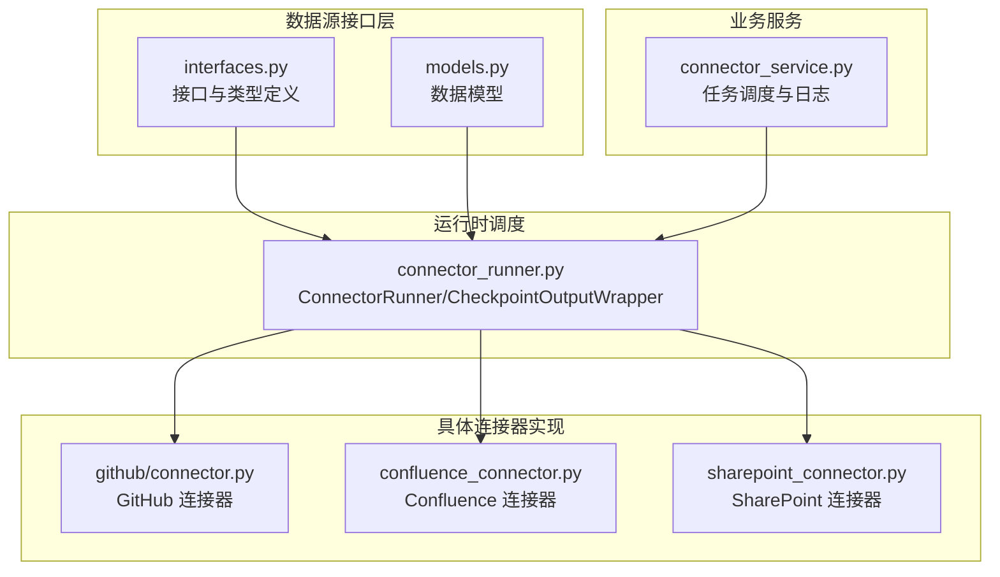
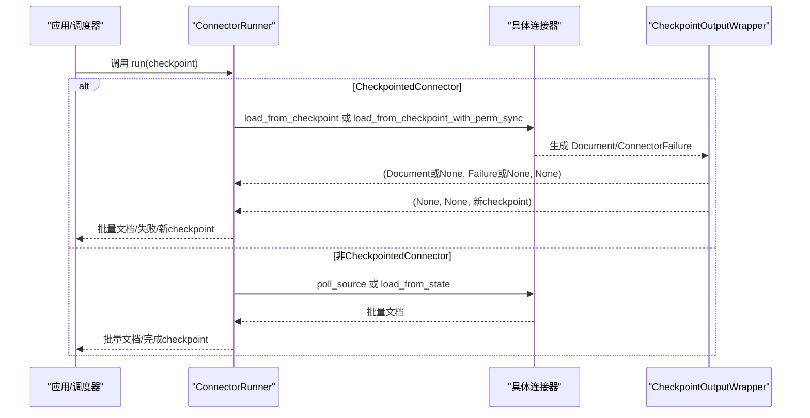
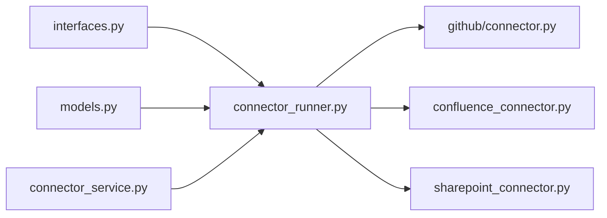

# 连接器接口规范

<cite>
**本文引用的文件列表**
- [interfaces.py](file://common/data_source/interfaces.py)
- [models.py](file://common/data_source/models.py)
- [connector_runner.py](file://common/data_source/connector_runner.py)
- [github_connector.py](file://common/data_source/github/connector.py)
- [confluence_connector.py](file://common/data_source/confluence_connector.py)
- [sharepoint_connector.py](file://common/data_source/sharepoint_connector.py)
- [connector_service.py](file://api/db/services/connector_service.py)
</cite>

## 目录
1. [简介](#简介)
2. [项目结构](#项目结构)
3. [核心组件](#核心组件)
4. [架构总览](#架构总览)
5. [详细组件分析](#详细组件分析)
6. [依赖关系分析](#依赖关系分析)
7. [性能考量](#性能考量)
8. [故障排查指南](#故障排查指南)
9. [结论](#结论)
10. [附录：最佳实践与示例路径](#附录最佳实践与示例路径)

## 简介
本技术文档面向连接器接口规范，系统化阐述以下核心接口的设计理念与实现要求：
- BaseConnector 及其泛型变体
- CheckpointedConnector（含权限同步）
- LoadConnector、PollConnector
- CredentialsConnector 及 CredentialsProviderInterface
- 关键方法：load_credentials、load_from_state、poll_source、retrieve_all_slim_docs 等
- 检查点机制：checkpoint 的创建、校验与更新流程
- 凭据管理：静态凭据与动态凭据的处理策略
- 最佳实践：错误处理、性能优化与扩展性建议
- 具体实现示例路径：GitHub、Confluence、SharePoint 等连接器

## 项目结构
连接器接口与模型定义集中在 common/data_source 目录，运行时调度在 common/data_source/connector_runner.py，业务侧任务调度在 api/db/services/connector_service.py 中。

图表来源
- [interfaces.py:1-420](file://common/data_source/interfaces.py#L1-L420)
- [models.py:1-314](file://common/data_source/models.py#L1-L314)
- [connector_runner.py:1-217](file://common/data_source/connector_runner.py#L1-L217)
- [github_connector.py:1-973](file://common/data_source/github/connector.py#L1-L973)
- [confluence_connector.py:1-2107](file://common/data_source/confluence_connector.py#L1-L2107)
- [sharepoint_connector.py:1-121](file://common/data_source/sharepoint_connector.py#L1-L121)
- [connector_service.py:1-303](file://api/db/services/connector_service.py#L1-L303)

章节来源
- [interfaces.py:1-420](file://common/data_source/interfaces.py#L1-L420)
- [models.py:1-314](file://common/data_source/models.py#L1-L314)
- [connector_runner.py:1-217](file://common/data_source/connector_runner.py#L1-L217)
- [connector_service.py:1-303](file://api/db/services/connector_service.py#L1-L303)

## 核心组件
- 接口族
  - BaseConnector：基础连接器抽象，提供通用能力与默认实现
  - CheckpointedConnector：带检查点的增量拉取接口
  - LoadConnector：从状态加载一次性数据
  - PollConnector：按时间窗口轮询增量数据
  - CredentialsConnector：凭据加载接口
  - SlimConnector/SlimConnectorWithPermSync：仅获取文档ID与权限信息的简化接口
  - CheckpointedConnectorWithPermSync：带权限同步的检查点接口
- 凭据提供器
  - CredentialsProviderInterface：凭据提供器抽象
  - StaticCredentialsProvider：静态凭据实现
- 数据模型
  - Document、SlimDocument、ConnectorCheckpoint、ConnectorFailure、SecondsSinceUnixEpoch 等

章节来源
- [interfaces.py:21-420](file://common/data_source/interfaces.py#L21-L420)
- [models.py:88-154](file://common/data_source/models.py#L88-L154)

## 架构总览
连接器运行时通过 ConnectorRunner 统一调度不同类型的连接器，支持批量输出、异常日志记录以及权限同步选项。CheckpointedConnector 的生成器协议确保“最终返回检查点”的约束，由 CheckpointOutputWrapper 将其转换为更易消费的三元组格式。

图表来源
- [connector_runner.py:91-217](file://common/data_source/connector_runner.py#L91-L217)
- [interfaces.py:261-342](file://common/data_source/interfaces.py#L261-L342)

## 详细组件分析

### BaseConnector 与派生接口
- 设计要点
  - 泛型参数 CT 约束为 ConnectorCheckpoint 子类，便于派生连接器自定义检查点字段
  - 提供 parse_metadata 默认实现，用于将文档元数据转为提示词上下文
  - 提供 validate_connector_settings、validate_perm_sync、set_allow_images 等可覆盖钩子
  - 提供 build_dummy_checkpoint 默认实现，便于非检查点连接器快速起步
- 关键方法
  - load_credentials(credentials: dict[str, Any]) -> dict[str, Any] | None
  - validate_connector_settings() -> None
  - set_allow_images(value: bool) -> None
  - build_dummy_checkpoint() -> CT

章节来源
- [interfaces.py:203-257](file://common/data_source/interfaces.py#L203-L257)

### CheckpointedConnector 与 CheckpointedConnectorWithPermSync
- 设计要点
  - load_from_checkpoint(start, end, checkpoint) 必须返回生成器，最终返回新的检查点
  - 生成器协议约定：中间产出 Document 或 ConnectorFailure；最终返回 CT
  - CheckpointOutputWrapper 将生成器转换为 (Document|None, Failure|None, Checkpoint|None) 的三元组序列
  - 带权限同步的变体增加 load_from_checkpoint_with_perm_sync 方法
- 关键方法
  - load_from_checkpoint(start, end, checkpoint) -> Generator[Document|ConnectorFailure, None, CT]
  - load_from_checkpoint_with_perm_sync(start, end, checkpoint) -> Generator[Document|ConnectorFailure, None, CT]
  - build_dummy_checkpoint() -> CT
  - validate_checkpoint_json(checkpoint_json: str) -> CT

章节来源
- [interfaces.py:261-342](file://common/data_source/interfaces.py#L261-L342)
- [connector_runner.py:300-342](file://common/data_source/connector_runner.py#L300-L342)

### LoadConnector 与 PollConnector
- 设计要点
  - LoadConnector：一次性从“状态”加载文档，适合全量索引
  - PollConnector：按时间窗口轮询增量，适合定时增量同步
- 关键方法
  - LoadConnector.load_from_state() -> Generator[list[Document], None, None]
  - PollConnector.poll_source(start, end) -> Generator[list[Document], None, None]

章节来源
- [interfaces.py:21-46](file://common/data_source/interfaces.py#L21-L46)

### CredentialsConnector 与 CredentialsProviderInterface
- 设计要点
  - CredentialsConnector：仅负责凭据加载
  - CredentialsProviderInterface：提供租户ID、唯一提供器键、凭据读写、动态/静态判定等
  - StaticCredentialsProvider：静态凭据实现，适用于无需动态刷新的场景
- 关键方法
  - CredentialsConnector.load_credentials(credentials: dict[str, Any]) -> dict[str, Any] | None
  - CredentialsProviderInterface.get_tenant_id() -> str | None
  - CredentialsProviderInterface.get_provider_key() -> str
  - CredentialsProviderInterface.get_credentials() -> dict[str, Any]
  - CredentialsProviderInterface.set_credentials(credential_json: dict[str, Any]) -> None
  - CredentialsProviderInterface.is_dynamic() -> bool
  - StaticCredentialsProvider.is_dynamic() -> bool

章节来源
- [interfaces.py:48-198](file://common/data_source/interfaces.py#L48-L198)

### 数据模型与类型别名
- Document：文档实体，包含 id、source、semantic_identifier、extension、blob、doc_updated_at、size_bytes、externale_access、primary_owners、metadata、doc_metadata 等
- SlimDocument：简化文档，仅包含 id 与 external_access
- ConnectorCheckpoint：检查点，has_more 标识是否继续
- ConnectorFailure：连接器失败，包含 failed_document/failed_entity/failure_message/exception
- SecondsSinceUnixEpoch：float 类型别名
- GenerateSlimDocumentOutput：简化文档生成器类型别名

章节来源
- [models.py:88-154](file://common/data_source/models.py#L88-L154)

### 典型实现示例

#### GitHub 连接器（CheckpointedConnectorWithPermSyncGH）
- 特点
  - 实现了带权限同步的检查点接口
  - 使用分页与游标重试策略，保证断点续传
  - 包含速率限制处理与重试逻辑
- 关键行为
  - 通过 ConnectorRunner.run(checkpoint) 驱动增量拉取
  - 在每次迭代中根据游标更新检查点
- 示例路径
  - [github_connector.py:1-973](file://common/data_source/github/connector.py#L1-L973)

章节来源
- [github_connector.py:1-973](file://common/data_source/github/connector.py#L1-L973)

#### Confluence 连接器（带凭据与权限同步）
- 特点
  - 自定义 ConfluenceCheckpoint，扩展 next_page_url 字段
  - 动态凭据：通过 Redis 缓存与分布式锁更新 OAuth 凭据
  - 支持 retrieve_all_slim_docs_perm_sync 与 load_from_checkpoint_with_perm_sync
- 示例路径
  - [confluence_connector.py:54-2107](file://common/data_source/confluence_connector.py#L54-L2107)

章节来源
- [confluence_connector.py:54-2107](file://common/data_source/confluence_connector.py#L54-L2107)

#### SharePoint 连接器（简化实现）
- 特点
  - 简化版实现，演示如何返回空结果并构建检查点
- 示例路径
  - [sharepoint_connector.py:91-121](file://common/data_source/sharepoint_connector.py#L91-L121)

章节来源
- [sharepoint_connector.py:91-121](file://common/data_source/sharepoint_connector.py#L91-L121)

## 依赖关系分析
- 接口到实现
  - BaseConnector/CheckpointedConnector 等接口被具体连接器实现
  - ConnectorRunner 依赖接口进行统一调度
- 模型依赖
  - 所有连接器均依赖 models.py 中的数据模型
- 业务集成
  - connector_service.py 负责任务调度、日志记录与状态管理，与 ConnectorRunner 协同工作

图表来源
- [interfaces.py:1-420](file://common/data_source/interfaces.py#L1-L420)
- [models.py:1-314](file://common/data_source/models.py#L1-L314)
- [connector_runner.py:1-217](file://common/data_source/connector_runner.py#L1-L217)
- [connector_service.py:1-303](file://api/db/services/connector_service.py#L1-L303)

章节来源
- [interfaces.py:1-420](file://common/data_source/interfaces.py#L1-L420)
- [models.py:1-314](file://common/data_source/models.py#L1-L314)
- [connector_runner.py:1-217](file://common/data_source/connector_runner.py#L1-L217)
- [connector_service.py:1-303](file://api/db/services/connector_service.py#L1-L303)

## 性能考量
- 分批输出与内存控制
  - ConnectorRunner 内置 batch_size 控制，避免单次批次过大导致内存压力
  - CheckpointOutputWrapper 将生成器转换为三元组，便于边消费边释放
- 检查点粒度
  - 合理设置检查点边界，减少重复拉取与网络开销
  - 对于大范围增量，优先使用 CheckpointedConnector 并启用权限同步
- 凭据缓存与刷新
  - 动态凭据建议结合 Redis 缓存与分布式锁，降低频繁刷新带来的延迟
- 轮询与速率限制
  - 轮询连接器应遵循目标系统的速率限制策略，必要时引入退避与重试

## 故障排查指南
- 异常日志增强
  - ConnectorRunner.run 在捕获异常时会记录最后帧的局部变量，便于定位问题
- 失败对象
  - ConnectorFailure 包含 failed_document/failed_entity/failure_message/exception，可用于统计与重试
- 任务调度
  - connector_service.py 提供任务状态管理、调度与清理逻辑，便于排查长时间未完成的任务

章节来源
- [connector_runner.py:196-217](file://common/data_source/connector_runner.py#L196-L217)
- [models.py:147-154](file://common/data_source/models.py#L147-L154)
- [connector_service.py:81-196](file://api/db/services/connector_service.py#L81-L196)

## 结论
该接口体系通过清晰的职责划分与严格的生成器协议，实现了对多种数据源的统一接入与高效调度。CheckpointedConnector 的检查点机制与 CredentialsProviderInterface 的凭据管理为大规模、长周期、多租户的索引任务提供了可靠保障。配合 ConnectorRunner 的批量与异常处理能力，开发者可以快速实现稳定、可扩展的连接器。

## 附录：最佳实践与示例路径

### 检查点机制最佳实践
- 创建检查点
  - 非检查点连接器：使用 BaseConnector.build_dummy_checkpoint() 返回 has_more=True 的初始检查点
  - 检查点连接器：实现 build_dummy_checkpoint() 返回自定义检查点对象
- 校验检查点
  - validate_checkpoint_json() 应严格解析 JSON 并返回强类型检查点对象
- 更新检查点
  - 生成器必须在末尾返回新的检查点；使用 CheckpointOutputWrapper 确保最终返回被正确提取

章节来源
- [interfaces.py:252-297](file://common/data_source/interfaces.py#L252-L297)
- [connector_runner.py:300-342](file://common/data_source/connector_runner.py#L300-L342)

### 凭据管理最佳实践
- 静态凭据
  - 使用 StaticCredentialsProvider，适用于无需动态刷新的场景
- 动态凭据
  - 使用分布式锁与 Redis 缓存，结合过期时间与刷新阈值，避免并发冲突
  - 在 ConfluenceConnector 中参考凭据刷新与缓存策略

章节来源
- [interfaces.py:156-198](file://common/data_source/interfaces.py#L156-L198)
- [confluence_connector.py:126-193](file://common/data_source/confluence_connector.py#L126-L193)

### 错误处理与重试
- 生成器中产出 ConnectorFailure，由上层统一处理
- 对于外部 API 限流，实现指数退避与最大重试次数
- 在 ConnectorRunner 中捕获异常并记录上下文，便于诊断

章节来源
- [models.py:147-154](file://common/data_source/models.py#L147-L154)
- [github_connector.py:158-200](file://common/data_source/github/connector.py#L158-L200)
- [connector_runner.py:196-217](file://common/data_source/connector_runner.py#L196-L217)

### 具体实现示例路径
- GitHub 增量拉取与权限同步
  - [github_connector.py:1-973](file://common/data_source/github/connector.py#L1-L973)
- Confluence 动态凭据与权限同步
  - [confluence_connector.py:54-2107](file://common/data_source/confluence_connector.py#L54-L2107)
- SharePoint 简化实现
  - [sharepoint_connector.py:91-121](file://common/data_source/sharepoint_connector.py#L91-L121)
- 运行时调度与批量输出
  - [connector_runner.py:91-217](file://common/data_source/connector_runner.py#L91-L217)
- 任务调度与日志
  - [connector_service.py:81-196](file://api/db/services/connector_service.py#L81-L196)