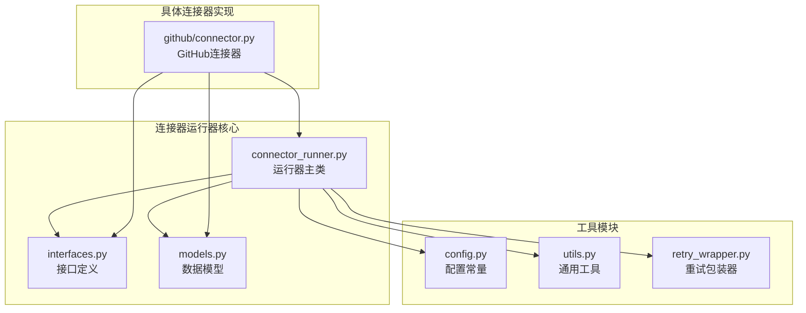
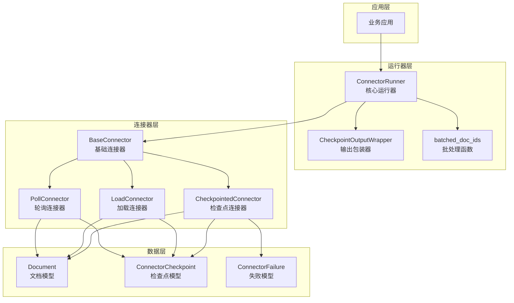
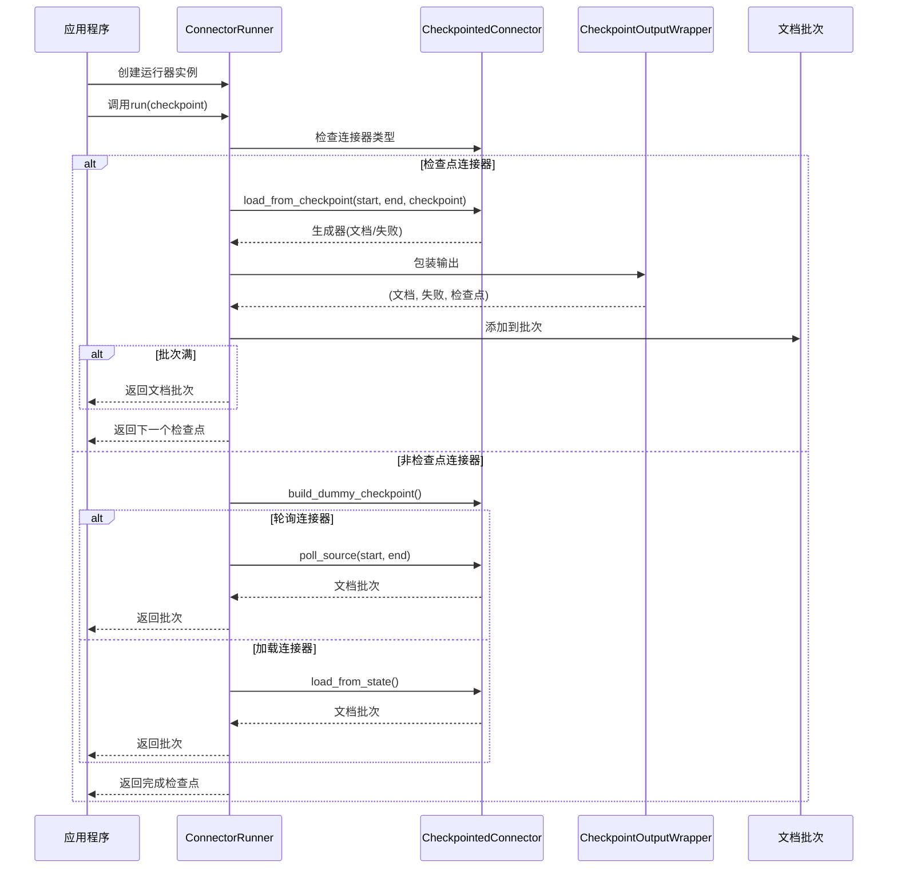
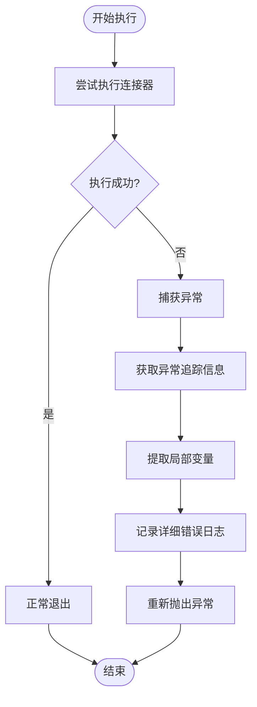
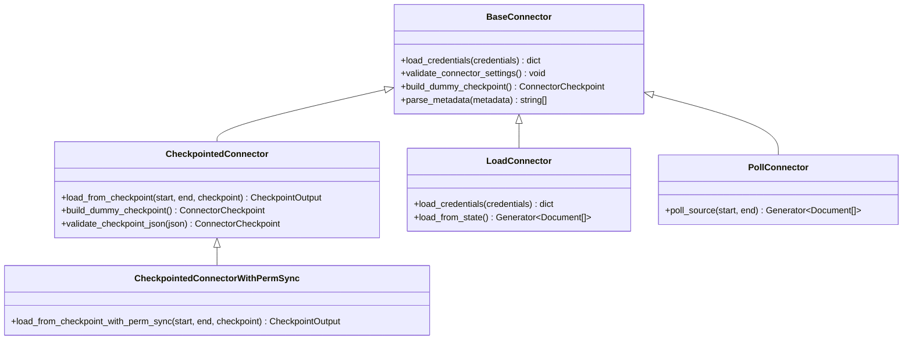
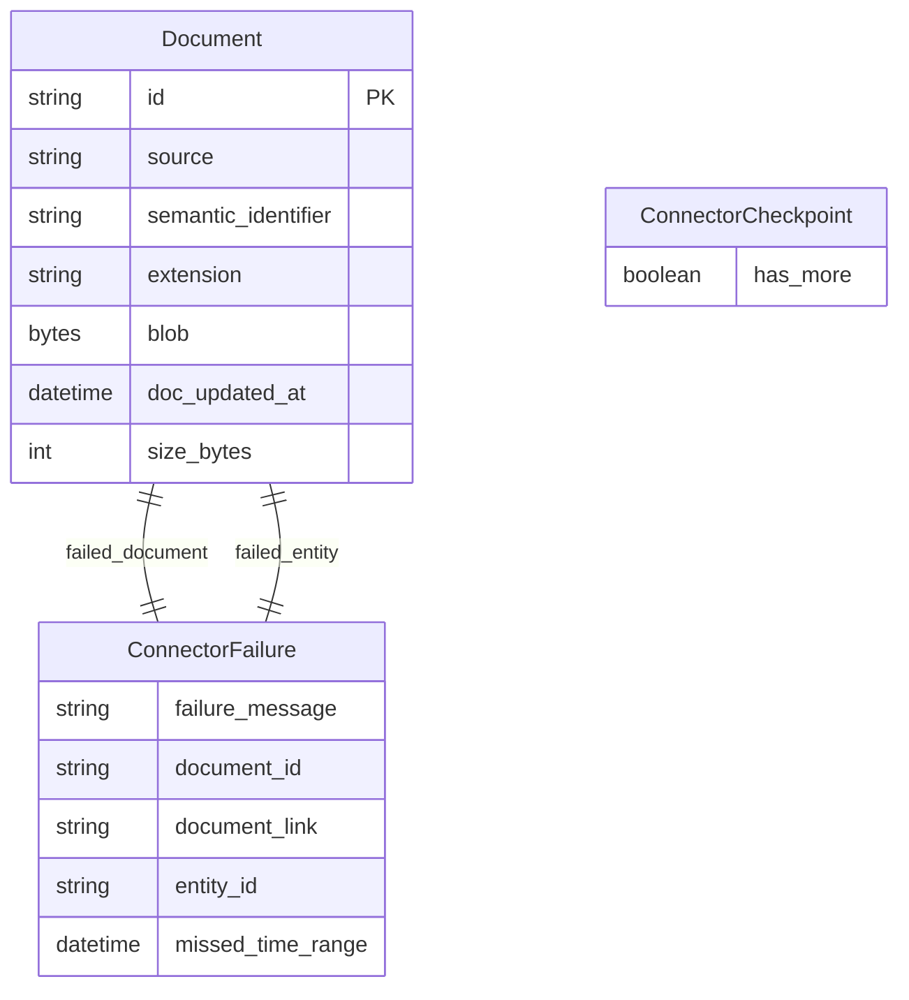
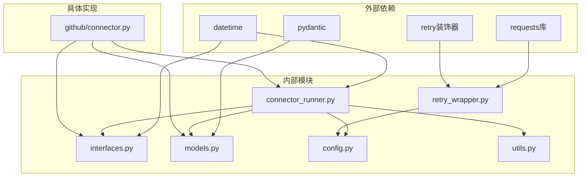

# 连接器运行器

<cite>
**本文档引用的文件**
- [connector_runner.py](file://common/data_source/connector_runner.py)
- [interfaces.py](file://common/data_source/interfaces.py)
- [models.py](file://common/data_source/models.py)
- [config.py](file://common/data_source/config.py)
- [utils.py](file://common/data_source/utils.py)
- [retry_wrapper.py](file://common/data_source/cross_connector_utils/retry_wrapper.py)
- [connector.py](file://common/data_source/github/connector.py)
</cite>

## 目录
1. [简介](#简介)
2. [项目结构](#项目结构)
3. [核心组件](#核心组件)
4. [架构概览](#架构概览)
5. [详细组件分析](#详细组件分析)
6. [依赖关系分析](#依赖关系分析)
7. [性能考虑](#性能考虑)
8. [故障排除指南](#故障排除指南)
9. [结论](#结论)
10. [附录](#附录)

## 简介

连接器运行器系统是RAGFlow平台中负责数据源连接和内容提取的核心组件。该系统提供了统一的接口来处理各种外部数据源，包括GitHub、Slack、Confluence、Google Drive等，支持批量处理、检查点管理、权限同步和异常处理等关键特性。

连接器运行器通过抽象化的接口设计，将不同类型的连接器（轮询式、加载式、检查点式）统一到一个一致的执行框架中，实现了灵活的数据抓取策略和高效的内容处理能力。

## 项目结构

连接器运行器系统主要位于`common/data_source`目录下，包含以下关键模块：



**图表来源**
- [connector_runner.py:1-217](file://common/data_source/connector_runner.py#L1-L217)
- [interfaces.py:1-420](file://common/data_source/interfaces.py#L1-L420)
- [models.py:1-314](file://common/data_source/models.py#L1-L314)

**章节来源**
- [connector_runner.py:1-217](file://common/data_source/connector_runner.py#L1-L217)
- [interfaces.py:1-420](file://common/data_source/interfaces.py#L1-L420)
- [models.py:1-314](file://common/data_source/models.py#L1-L314)

## 核心组件

### ConnectorRunner类

ConnectorRunner是连接器运行器的核心类，负责协调不同类型连接器的执行流程。其主要职责包括：

- **批量处理**：将文档按指定大小进行批处理，提高处理效率
- **异常日志记录**：增强异常信息的记录和调试能力
- **连接器类型统一**：将轮询式、加载式、检查点式连接器统一到单一接口

### 检查点输出包装器

CheckpointOutputWrapper类用于将连接器的原始输出格式转换为更易处理的格式，确保每个生成器都返回文档或失败信息，并在最后返回新的检查点。

### 批处理函数

batched_doc_ids函数实现了基于文档ID的批处理逻辑，支持根据检查点输出生成文档ID批次，便于后续的批量操作。

**章节来源**
- [connector_runner.py:91-217](file://common/data_source/connector_runner.py#L91-L217)
- [connector_runner.py:24-88](file://common/data_source/connector_runner.py#L24-L88)

## 架构概览

连接器运行器系统采用分层架构设计，通过接口抽象和泛型类型系统实现高度的可扩展性：



**图表来源**
- [connector_runner.py:91-217](file://common/data_source/connector_runner.py#L91-L217)
- [interfaces.py:203-342](file://common/data_source/interfaces.py#L203-L342)
- [models.py:88-154](file://common/data_source/models.py#L88-L154)

## 详细组件分析

### ConnectorRunner类详解

ConnectorRunner类是整个系统的核心，实现了统一的连接器执行框架：

#### 初始化参数
- `connector`: 基础连接器实例
- `batch_size`: 批处理大小，默认值由配置决定
- `include_permissions`: 是否包含权限同步
- `time_range`: 时间范围，用于轮询和检查点连接器

#### 运行流程



**图表来源**
- [connector_runner.py:119-195](file://common/data_source/connector_runner.py#L119-L195)

#### 异常处理机制

ConnectorRunner实现了增强的异常处理机制，能够捕获连接器执行过程中的异常并提供详细的调试信息：



**图表来源**
- [connector_runner.py:196-217](file://common/data_source/connector_runner.py#L196-L217)

**章节来源**
- [connector_runner.py:99-117](file://common/data_source/connector_runner.py#L99-L117)
- [connector_runner.py:119-195](file://common/data_source/connector_runner.py#L119-L195)
- [connector_runner.py:196-217](file://common/data_source/connector_runner.py#L196-L217)

### 接口体系

连接器运行器系统定义了完整的接口体系，支持不同类型的数据源连接：

#### 基础接口



**图表来源**
- [interfaces.py:203-342](file://common/data_source/interfaces.py#L203-L342)

#### 数据模型

系统使用Pydantic模型定义了标准的数据结构：



**图表来源**
- [models.py:88-154](file://common/data_source/models.py#L88-L154)

**章节来源**
- [interfaces.py:21-46](file://common/data_source/interfaces.py#L21-L46)
- [interfaces.py:261-297](file://common/data_source/interfaces.py#L261-L297)
- [models.py:88-154](file://common/data_source/models.py#L88-L154)

### 具体连接器实现

以GitHub连接器为例，展示了连接器运行器的实际应用场景：

#### GitHub连接器特性

GitHub连接器实现了完整的检查点机制，支持：
- 分页API调用和光标管理
- 速率限制处理和自动重试
- 权限同步和外部访问控制
- 错误恢复和断点续传

#### 使用示例

```python
# 初始化连接器
connector = GithubConnector(
    repo_owner="owner",
    repositories="repo",
    include_issues=True,
    include_prs=False,
)

# 设置凭据
connector.load_credentials({
    "github_access_token": "your_token"
})

# 创建时间范围
end_time = datetime.now(timezone.utc)
start_time = datetime.fromtimestamp(0, tz=timezone.utc)
time_range = (start_time, end_time)

# 初始化运行器
runner = ConnectorRunner(
    connector, 
    batch_size=10, 
    include_permissions=False, 
    time_range=time_range
)

# 获取初始检查点
checkpoint = connector.build_dummy_checkpoint()

# 执行连接器
while checkpoint.has_more:
    for doc_batch, failure, next_checkpoint in runner.run(checkpoint):
        if doc_batch:
            print(f"获取到 {len(doc_batch)} 个文档批次")
        if failure:
            print(f"处理失败: {failure.failure_message}")
        if next_checkpoint:
            checkpoint = next_checkpoint
```

**章节来源**
- [connector.py:932-973](file://common/data_source/github/connector.py#L932-L973)

## 依赖关系分析

连接器运行器系统具有清晰的依赖层次结构：



**图表来源**
- [connector_runner.py:1-16](file://common/data_source/connector_runner.py#L1-L16)
- [retry_wrapper.py:1-88](file://common/data_source/cross_connector_utils/retry_wrapper.py#L1-L88)

### 关键依赖关系

1. **接口依赖**：所有连接器必须实现相应的接口契约
2. **配置依赖**：运行器依赖全局配置常量进行行为控制
3. **工具依赖**：运行器使用通用工具函数处理常见任务
4. **模型依赖**：运行器使用标准化的数据模型进行数据交换

**章节来源**
- [connector_runner.py:1-16](file://common/data_source/connector_runner.py#L1-L16)
- [retry_wrapper.py:1-88](file://common/data_source/cross_connector_utils/retry_wrapper.py#L1-L88)

## 性能考虑

连接器运行器系统在设计时充分考虑了性能优化：

### 批处理优化
- **批量大小配置**：通过环境变量`SLIM_BATCH_SIZE`控制批处理大小
- **内存管理**：使用生成器模式避免大量内存占用
- **增量处理**：检查点机制支持断点续传，减少重复工作

### 并发控制
- **线程池配置**：通过`SLACK_NUM_THREADS`控制并发数量
- **速率限制**：内置速率限制处理，避免API限制
- **超时管理**：统一的请求超时配置

### 缓存策略
- **L1缓存**：使用`@lru_cache`装饰器缓存计算结果
- **会话复用**：重用HTTP会话减少连接开销
- **智能重试**：指数退避算法避免雪崩效应

**章节来源**
- [config.py:104-105](file://common/data_source/config.py#L104-L105)
- [config.py:124](file://common/data_source/config.py#L124)
- [utils.py:112-158](file://common/data_source/utils.py#L112-L158)

## 故障排除指南

### 常见问题及解决方案

#### 检查点相关问题
- **问题**：检查点为空导致运行器异常
- **原因**：连接器未正确返回检查点
- **解决**：检查连接器实现是否遵循检查点协议

#### 权限同步问题
- **问题**：权限同步失败
- **原因**：非检查点连接器尝试启用权限同步
- **解决**：仅对支持权限同步的连接器启用此功能

#### 批处理问题
- **问题**：批处理大小不生效
- **原因**：环境变量配置错误
- **解决**：检查`SLIM_BATCH_SIZE`环境变量设置

### 调试技巧

1. **启用详细日志**：查看运行器的调试输出
2. **检查异常追踪**：利用增强的异常处理机制获取详细信息
3. **验证配置**：确认所有必需的环境变量已正确设置

**章节来源**
- [connector_runner.py:107-110](file://common/data_source/connector_runner.py#L107-L110)
- [connector_runner.py:83-86](file://common/data_source/connector_runner.py#L83-L86)
- [connector_runner.py:196-217](file://common/data_source/connector_runner.py#L196-L217)

## 结论

连接器运行器系统通过精心设计的架构和完善的接口体系，为RAGFlow平台提供了强大而灵活的数据源连接能力。系统的主要优势包括：

1. **高度可扩展性**：通过接口抽象支持任意数量的新连接器实现
2. **强大的检查点机制**：支持断点续传和错误恢复
3. **统一的执行框架**：简化了不同类型连接器的使用方式
4. **完善的错误处理**：提供了详细的异常信息和调试支持
5. **性能优化**：批处理、并发控制和缓存策略确保高效运行

该系统为构建企业级知识抽取和索引平台奠定了坚实的基础，能够有效处理大规模数据源的批量处理需求。

## 附录

### 配置选项参考

| 配置项 | 类型 | 默认值 | 描述 |
|--------|------|--------|------|
| `REQUEST_TIMEOUT_SECONDS` | int | 60 | 请求超时时间（秒） |
| `SLIM_BATCH_SIZE` | int | 100 | 批处理大小 |
| `SLACK_NUM_THREADS` | int | 4 | Slack连接器并发线程数 |
| `CONTINUE_ON_CONNECTOR_FAILURE` | bool | True | 连接器失败时继续执行 |
| `DOWNLOAD_CHUNK_SIZE` | int | 1048576 | 下载块大小（字节） |

### 最佳实践

1. **合理设置批处理大小**：根据内存和网络条件调整`SLIM_BATCH_SIZE`
2. **启用适当的超时**：为长耗时操作设置合理的超时时间
3. **监控检查点进度**：定期检查检查点状态确保数据完整性
4. **使用权限同步**：对需要权限控制的数据源启用权限同步
5. **实施重试策略**：为不稳定的服务配置合适的重试机制