# API连接器

<cite>
**本文档引用的文件**
- [firecrawl_connector.py](file://intergrations/firecrawl/firecrawl_connector.py)
- [firecrawl_config.py](file://intergrations/firecrawl/firecrawl_config.py)
- [ragflow_integration.py](file://intergrations/firecrawl/ragflow_integration.py)
- [firecrawl_processor.py](file://intergrations/firecrawl/firecrawl_processor.py)
- [firecrawl_ui.py](file://intergrations/firecrawl/firecrawl_ui.py)
- [integration.py](file://intergrations/firecrawl/integration.py)
- [example_usage.py](file://intergrations/firecrawl/example_usage.py)
- [requirements.txt](file://intergrations/firecrawl/requirements.txt)
</cite>

## 目录
1. [简介](#简介)
2. [项目结构](#项目结构)
3. [核心组件](#核心组件)
4. [架构概览](#架构概览)
5. [详细组件分析](#详细组件分析)
6. [依赖关系分析](#依赖关系分析)
7. [性能考虑](#性能考虑)
8. [故障排除指南](#故障排除指南)
9. [结论](#结论)

## 简介

Firecrawl API连接器是RAGFlow平台的一个重要插件，用于集成Firecrawl的Web内容抓取能力。该连接器提供了完整的异步HTTP客户端实现，支持单URL抓取、网站爬取、批量处理等多种功能，并集成了智能的错误处理、重试策略和速率限制机制。

该连接器遵循RAGFlow的集成标准，提供了标准化的接口来处理Web内容的导入和处理工作流。通过使用现代的异步编程模式和高效的HTTP客户端，确保了在大规模内容抓取场景下的性能和可靠性。

## 项目结构

Firecrawl插件采用模块化设计，主要包含以下核心文件：

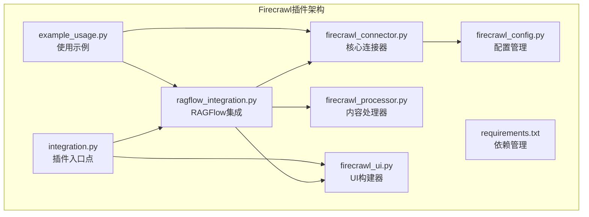

**图表来源**
- [firecrawl_connector.py:1-263](file://intergrations/firecrawl/firecrawl_connector.py#L1-L263)
- [firecrawl_config.py:1-80](file://intergrations/firecrawl/firecrawl_config.py#L1-L80)
- [ragflow_integration.py:1-176](file://intergrations/firecrawl/ragflow_integration.py#L1-L176)

**章节来源**
- [firecrawl_connector.py:1-263](file://intergrations/firecrawl/firecrawl_connector.py#L1-L263)
- [firecrawl_config.py:1-80](file://intergrations/firecrawl/firecrawl_config.py#L1-L80)
- [ragflow_integration.py:1-176](file://intergrations/firecrawl/ragflow_integration.py#L1-L176)

## 核心组件

### FirecrawlConnector类

FirecrawlConnector是整个插件的核心，负责与Firecrawl API的所有通信交互。它实现了完整的异步HTTP客户端功能，包括连接管理、请求处理、响应解析和错误处理。

**主要特性：**
- 异步HTTP客户端（基于aiohttp）
- 连接池管理和会话保持
- 智能速率限制和并发控制
- 自动重试机制
- 超时配置和错误处理

**章节来源**
- [firecrawl_connector.py:41-263](file://intergrations/firecrawl/firecrawl_connector.py#L41-L263)

### FirecrawlConfig类

配置管理类提供了灵活的配置选项，支持多种配置方式：
- 环境变量配置
- 字典配置
- JSON配置
- 验证和默认值设置

**配置参数：**
- `api_key`: Firecrawl API密钥（必需）
- `api_url`: API端点URL（默认：https://api.firecrawl.dev）
- `max_retries`: 最大重试次数（默认：3）
- `timeout`: 请求超时时间（默认：30秒）
- `rate_limit_delay`: 速率限制延迟（默认：1.0秒）
- `max_concurrent_requests`: 最大并发请求数（默认：5）

**章节来源**
- [firecrawl_config.py:11-80](file://intergrations/firecrawl/firecrawl_config.py#L11-L80)

### RAGFlowFirecrawlIntegration类

RAGFlow集成类作为插件的主要入口点，提供了面向RAGFlow平台的标准接口。它协调连接器、处理器和UI组件之间的交互。

**主要功能：**
- 单URL抓取和导入
- 网站爬取和导入
- 批量处理
- 连接测试
- 配置验证

**章节来源**
- [ragflow_integration.py:15-176](file://intergrations/firecrawl/ragflow_integration.py#L15-L176)

## 架构概览

Firecrawl插件采用分层架构设计，确保了良好的关注点分离和可维护性：

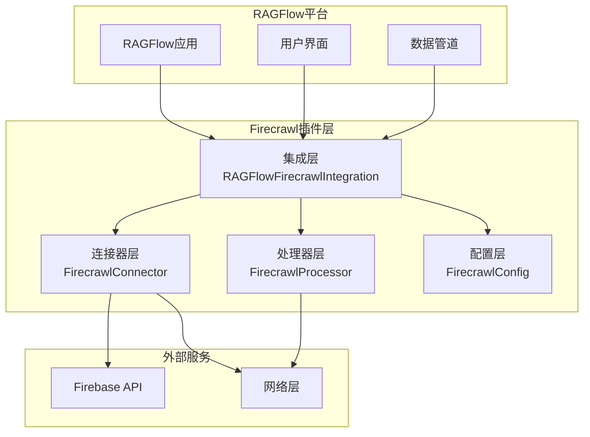

**图表来源**
- [ragflow_integration.py:15-176](file://intergrations/firecrawl/ragflow_integration.py#L15-L176)
- [firecrawl_connector.py:41-263](file://intergrations/firecrawl/firecrawl_connector.py#L41-L263)
- [firecrawl_processor.py:32-276](file://intergrations/firecrawl/firecrawl_processor.py#L32-L276)

## 详细组件分析

### 连接器类设计模式

FirecrawlConnector采用了多种设计模式来确保代码的可维护性和扩展性：

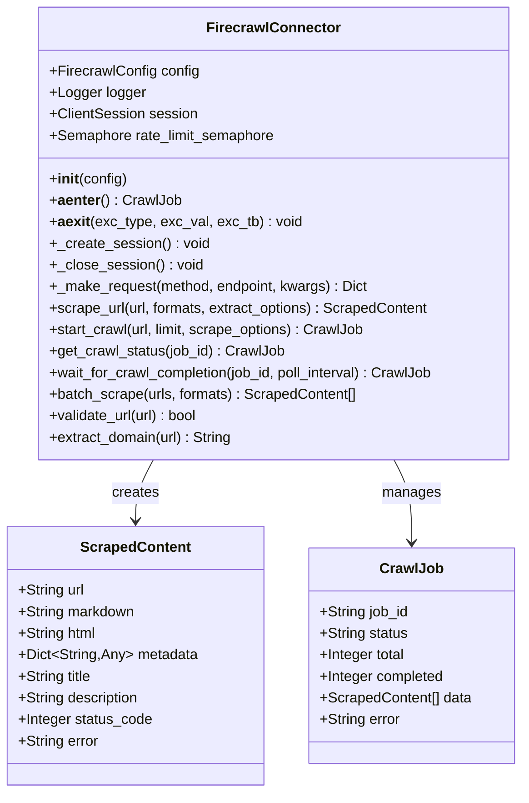

**图表来源**
- [firecrawl_connector.py:41-263](file://intergrations/firecrawl/firecrawl_connector.py#L41-L263)
- [firecrawl_connector.py:15-39](file://intergrations/firecrawl/firecrawl_connector.py#L15-L39)

### HTTP请求处理机制

连接器实现了完整的异步HTTP请求处理流程，包括请求构建、发送、响应处理和错误恢复：

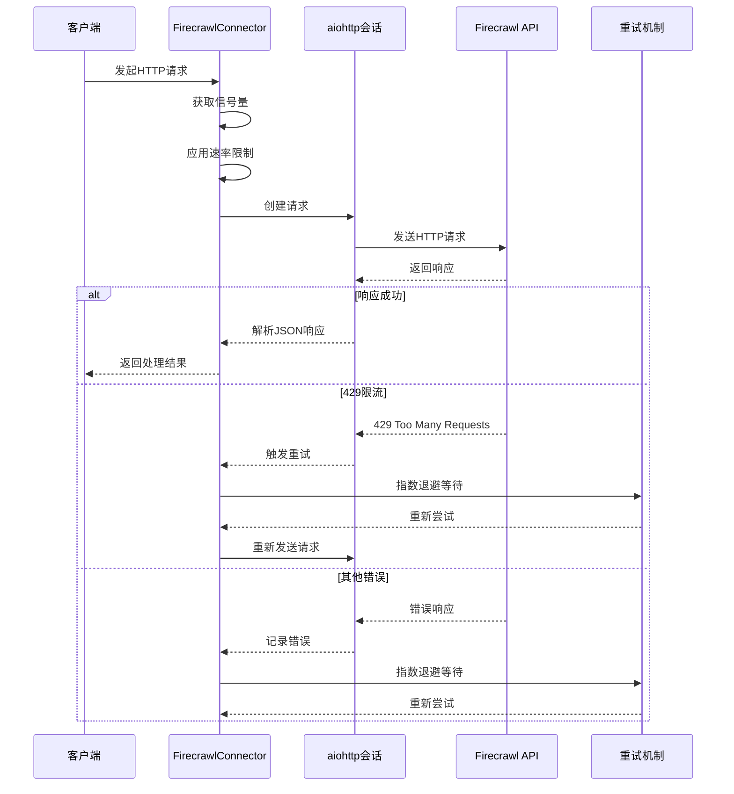

**图表来源**
- [firecrawl_connector.py:79-105](file://intergrations/firecrawl/firecrawl_connector.py#L79-L105)

### 数据模型设计

插件定义了清晰的数据模型来表示抓取的内容和爬取作业：

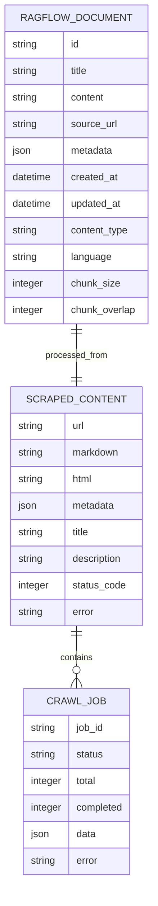

**图表来源**
- [firecrawl_connector.py:15-39](file://intergrations/firecrawl/firecrawl_connector.py#L15-L39)
- [firecrawl_processor.py:15-30](file://intergrations/firecrawl/firecrawl_processor.py#L15-L30)

**章节来源**
- [firecrawl_connector.py:15-263](file://intergrations/firecrawl/firecrawl_connector.py#L15-L263)
- [firecrawl_processor.py:15-276](file://intergrations/firecrawl/firecrawl_processor.py#L15-L276)

### API调用方法实现

#### 单URL抓取 (`scrape_url`)

单URL抓取方法提供了最基础的抓取功能，支持多种输出格式：

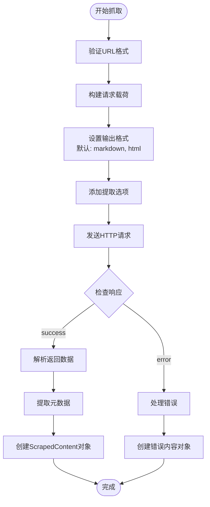

**图表来源**
- [firecrawl_connector.py:107-143](file://intergrations/firecrawl/firecrawl_connector.py#L107-L143)

#### 网站爬取 (`start_crawl` 和 `get_crawl_status`)

网站爬取功能支持从指定URL开始的整站抓取：

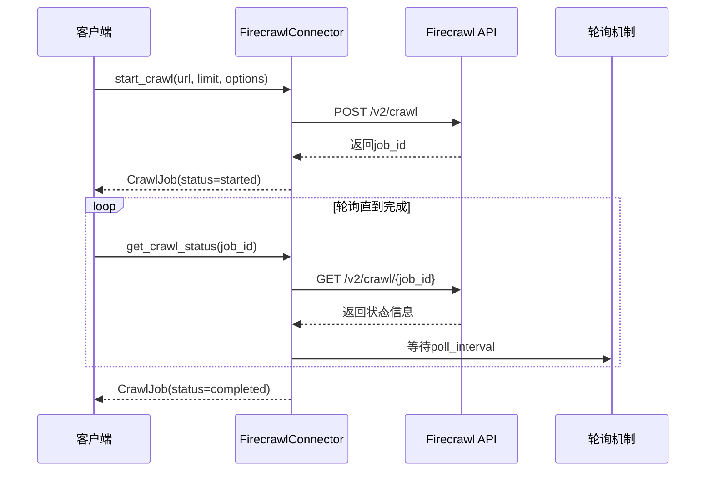

**图表来源**
- [firecrawl_connector.py:144-226](file://intergrations/firecrawl/firecrawl_connector.py#L144-L226)

#### 批量处理 (`batch_scrape`)

批量处理方法利用异步并发来提高处理效率：

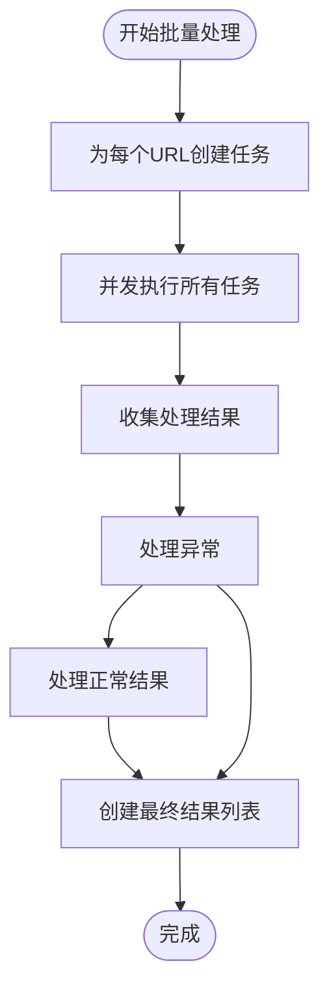

**图表来源**
- [firecrawl_connector.py:227-247](file://intergrations/firecrawl/firecrawl_connector.py#L227-L247)

**章节来源**
- [firecrawl_connector.py:107-247](file://intergrations/firecrawl/firecrawl_connector.py#L107-L247)

### 错误处理机制

插件实现了多层次的错误处理机制：

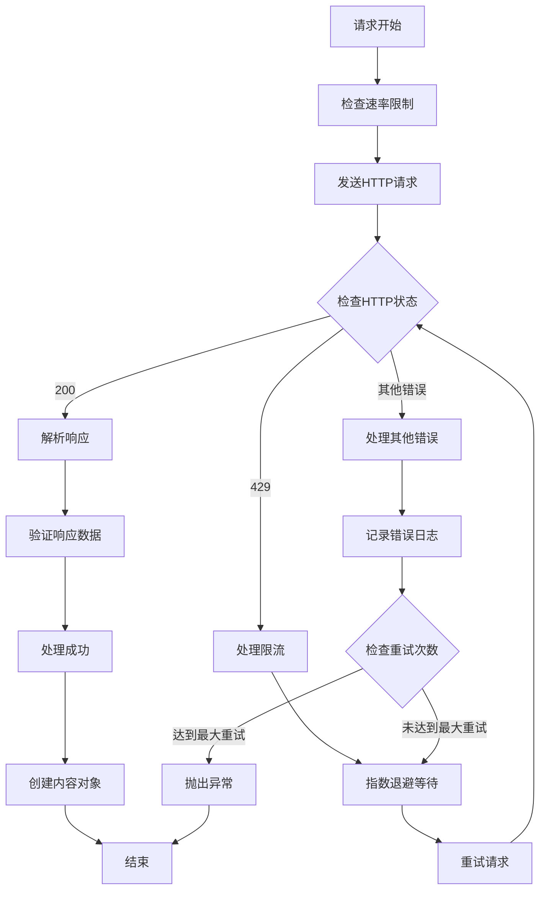

**图表来源**
- [firecrawl_connector.py:79-105](file://intergrations/firecrawl/firecrawl_connector.py#L79-L105)

**章节来源**
- [firecrawl_connector.py:79-105](file://intergrations/firecrawl/firecrawl_connector.py#L79-L105)

## 依赖关系分析

### 外部依赖

Firecrawl插件的依赖关系相对简洁且明确：

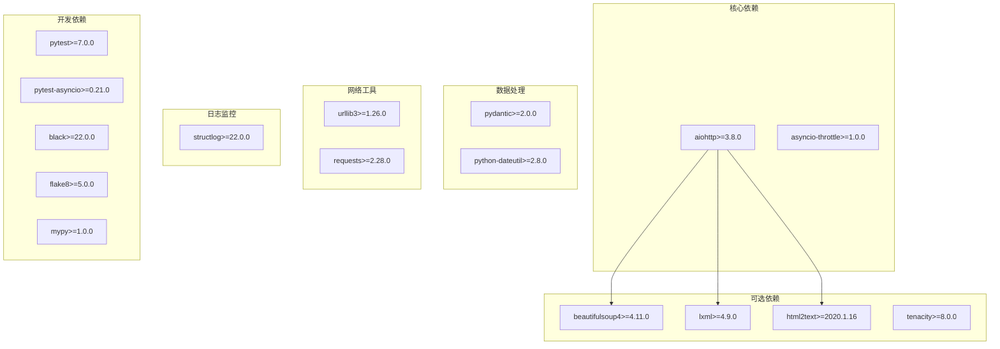

**图表来源**
- [requirements.txt:1-32](file://intergrations/firecrawl/requirements.txt#L1-L32)

### 内部依赖关系

插件内部各组件之间的依赖关系清晰明确：

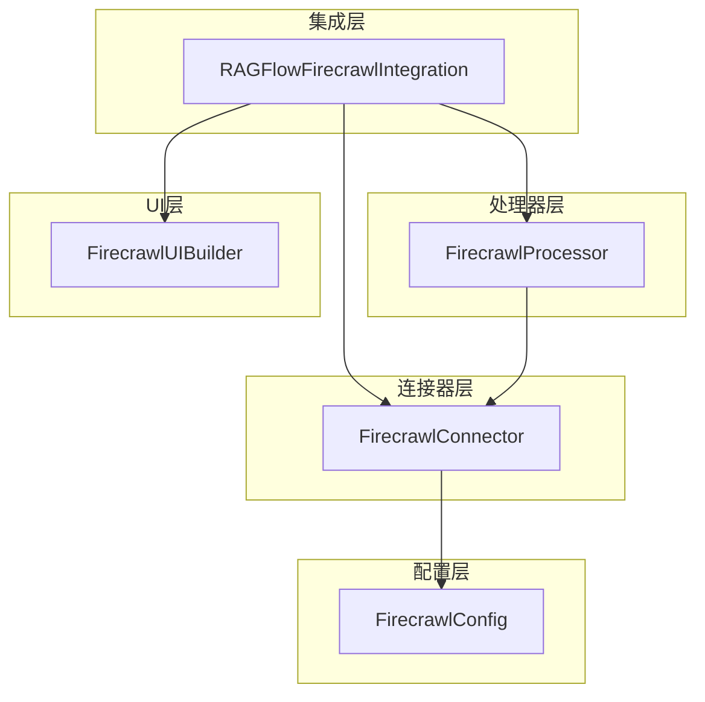

**图表来源**
- [firecrawl_connector.py:12](file://intergrations/firecrawl/firecrawl_connector.py#L12)
- [ragflow_integration.py:9-12](file://intergrations/firecrawl/ragflow_integration.py#L9-L12)

**章节来源**
- [requirements.txt:1-32](file://intergrations/firecrawl/requirements.txt#L1-L32)
- [firecrawl_connector.py:12](file://intergrations/firecrawl/firecrawl_connector.py#L12)
- [ragflow_integration.py:9-12](file://intergrations/firecrawl/ragflow_integration.py#L9-L12)

## 性能考虑

### 并发控制和速率限制

插件通过多种机制来确保高性能和稳定性：

1. **信号量控制**：使用`asyncio.Semaphore`限制最大并发请求数
2. **速率限制**：通过`rate_limit_delay`参数控制请求间隔
3. **指数退避**：对429错误和网络异常采用指数退避策略
4. **连接复用**：使用持久化的aiohttp会话减少连接开销

### 内存优化

- 使用异步生成器避免一次性加载大量数据
- 及时清理临时数据和中间结果
- 合理的超时设置防止内存泄漏

### 缓存策略

虽然当前版本没有实现缓存，但可以考虑：
- 对重复URL的响应进行缓存
- 缓存API端点的元数据
- 实现智能的增量更新机制

## 故障排除指南

### 常见问题和解决方案

#### API密钥认证失败

**症状**：连接测试失败，返回认证错误
**原因**：
- API密钥格式不正确
- API密钥已过期或被撤销
- 网络连接问题

**解决方案**：
1. 验证API密钥格式（必须以"fc-"开头）
2. 在Firecrawl控制台检查密钥状态
3. 确认网络连接正常

#### 速率限制错误

**症状**：频繁收到429状态码
**原因**：超出API配额限制

**解决方案**：
1. 增加`rate_limit_delay`参数值
2. 减少`max_concurrent_requests`参数值
3. 联系Firecrawl支持升级配额

#### 超时错误

**症状**：请求在指定时间内未完成
**原因**：
- 目标网站响应缓慢
- 网络延迟过高
- 超时设置过短

**解决方案**：
1. 增加`timeout`参数值
2. 检查目标网站可用性
3. 优化网络环境

#### 内容解析错误

**症状**：抓取到的内容格式不正确
**原因**：
- 目标网站结构变化
- 提取选项配置不当

**解决方案**：
1. 调整`extract_options`参数
2. 更新提取规则
3. 检查目标网站的robots.txt

**章节来源**
- [firecrawl_connector.py:79-105](file://intergrations/firecrawl/firecrawl_connector.py#L79-L105)
- [firecrawl_config.py:22-38](file://intergrations/firecrawl/firecrawl_config.py#L22-L38)

## 结论

Firecrawl API连接器是一个设计精良、功能完整的Web内容抓取解决方案。它成功地将复杂的异步HTTP通信、智能的错误处理和灵活的配置管理整合在一个统一的框架中。

**主要优势：**
- **异步架构**：充分利用现代Python的异步特性，提供高并发处理能力
- **健壮的错误处理**：多层错误处理和重试机制确保可靠性
- **灵活的配置**：支持多种配置方式和运行时调整
- **清晰的架构**：模块化设计便于维护和扩展
- **完整的集成**：与RAGFlow平台无缝集成

**适用场景：**
- 大规模Web内容抓取
- 知识库构建和维护
- 内容迁移和导入
- 网络监控和分析

该连接器为RAGFlow平台提供了强大的Web内容获取能力，是构建现代AI应用的重要基础设施组件。