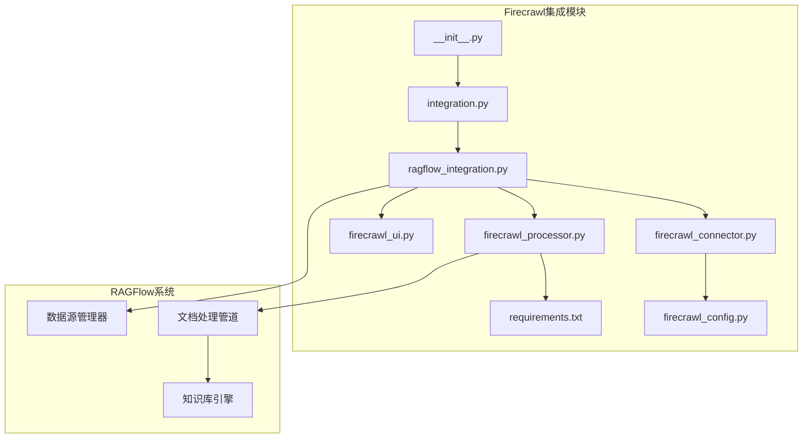
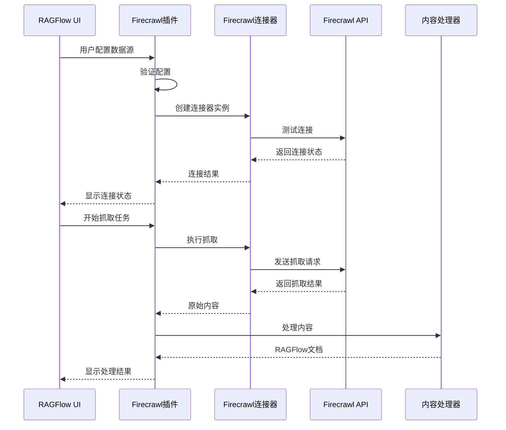
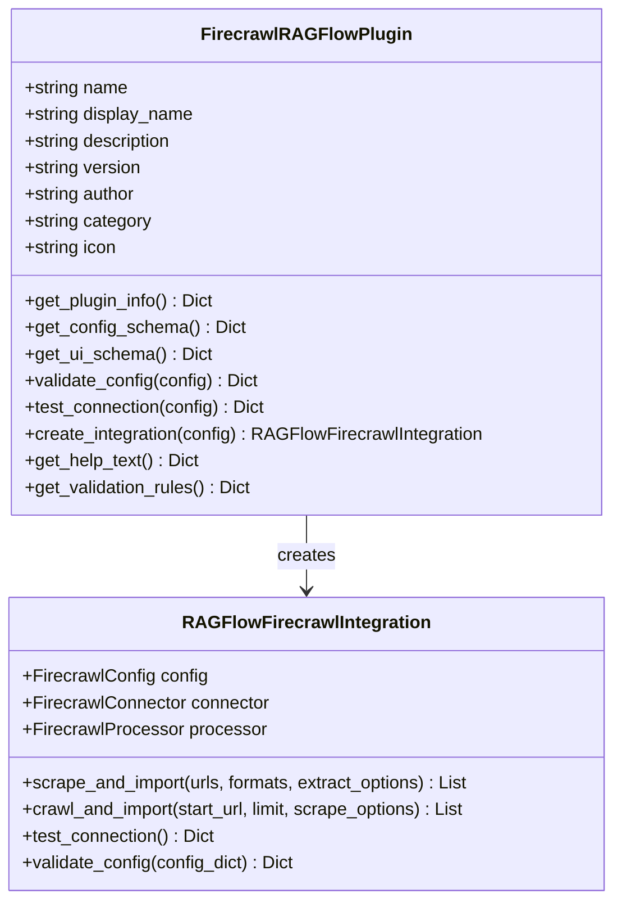
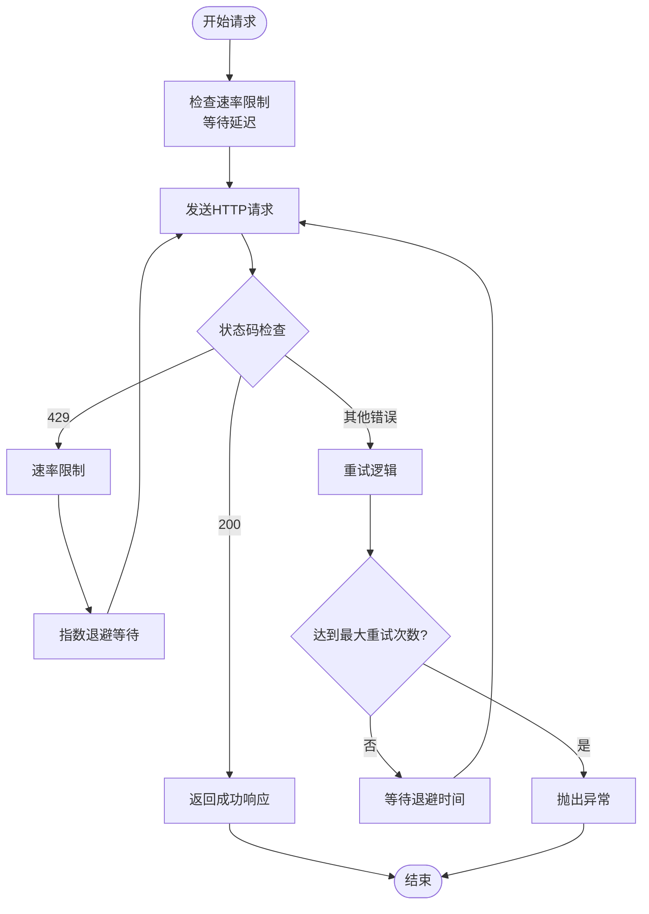
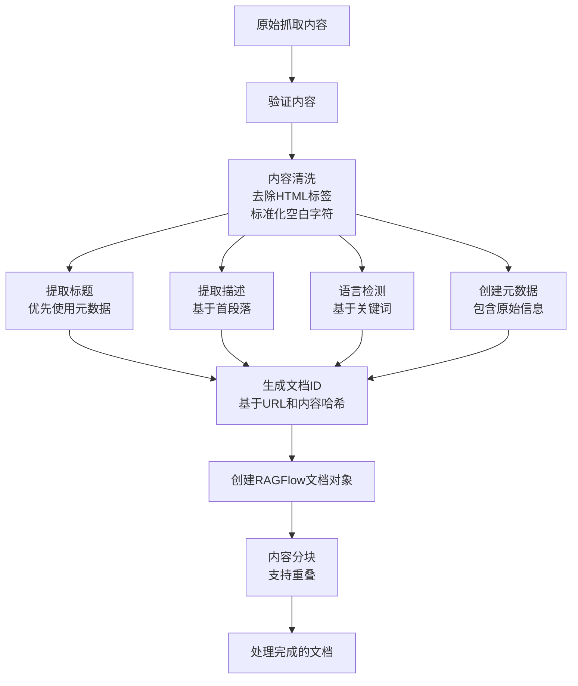
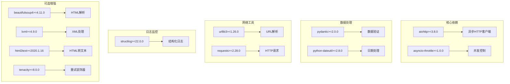
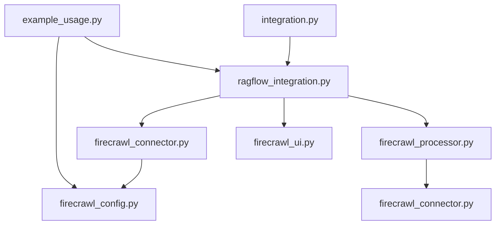

# Firecrawl搜索引擎集成

<cite>
**本文档引用的文件**
- [README.md](file://intergrations/firecrawl/README.md)
- [INSTALLATION.md](file://intergrations/firecrawl/INSTALLATION.md)
- [integration.py](file://intergrations/firecrawl/integration.py)
- [ragflow_integration.py](file://intergrations/firecrawl/ragflow_integration.py)
- [firecrawl_config.py](file://intergrations/firecrawl/firecrawl_config.py)
- [firecrawl_connector.py](file://intergrations/firecrawl/firecrawl_connector.py)
- [firecrawl_processor.py](file://intergrations/firecrawl/firecrawl_processor.py)
- [firecrawl_ui.py](file://intergrations/firecrawl/firecrawl_ui.py)
- [example_usage.py](file://intergrations/firecrawl/example_usage.py)
- [requirements.txt](file://intergrations/firecrawl/requirements.txt)
- [__init__.py](file://intergrations/firecrawl/__init__.py)
</cite>

## 目录
1. [简介](#简介)
2. [项目结构](#项目结构)
3. [核心组件](#核心组件)
4. [架构概览](#架构概览)
5. [详细组件分析](#详细组件分析)
6. [依赖关系分析](#依赖关系分析)
7. [性能考虑](#性能考虑)
8. [故障排除指南](#故障排除指南)
9. [结论](#结论)
10. [附录](#附录)

## 简介

Firecrawl搜索引擎集成是为RAGFlow构建的强大Web内容抓取解决方案。该集成将Firecrawl的先进Web抓取能力无缝集成到RAGFlow的AI工作流中，使用户能够直接从Web内容构建知识库。

### 主要特性

- **多模式抓取支持**：单URL抓取、网站爬取、批量处理
- **多种输出格式**：Markdown、HTML、链接、截图
- **智能内容处理**：自动内容清理、元数据提取、文档分块
- **健壮的错误处理**：重试机制、速率限制、超时处理
- **RAGFlow原生集成**：符合RAGFlow设计模式和编码标准

## 项目结构

Firecrawl集成采用模块化设计，每个组件都有明确的职责分工：



**图表来源**
- [integration.py:1-150](file://intergrations/firecrawl/integration.py#L1-L150)
- [ragflow_integration.py:1-176](file://intergrations/firecrawl/ragflow_integration.py#L1-L176)

**章节来源**
- [README.md:41-55](file://intergrations/firecrawl/README.md#L41-L55)
- [__init__.py:1-16](file://intergrations/firecrawl/__init__.py#L1-L16)

## 核心组件

### 配置管理系统

FirecrawlConfig类负责管理所有配置参数，包括API密钥、超时设置、重试机制等。

### 连接器层

FirecrawlConnector处理与Firecrawl API的所有通信，包括：
- 异步HTTP请求
- 速率限制控制
- 错误重试逻辑
- 并发请求管理

### 内容处理器

FirecrawlProcessor将Firecrawl的原始输出转换为RAGFlow可用的文档格式，包括：
- 内容清洗和标准化
- 元数据提取
- 文档分块
- 语言检测

### 用户界面集成

FirecrawlUIBuilder提供完整的UI组件，确保与RAGFlow的用户界面无缝集成。

**章节来源**
- [firecrawl_config.py:11-80](file://intergrations/firecrawl/firecrawl_config.py#L11-L80)
- [firecrawl_connector.py:41-263](file://intergrations/firecrawl/firecrawl_connector.py#L41-L263)
- [firecrawl_processor.py:32-276](file://intergrations/firecrawl/firecrawl_processor.py#L32-L276)
- [firecrawl_ui.py:18-260](file://intergrations/firecrawl/firecrawl_ui.py#L18-L260)

## 架构概览

Firecrawl集成遵循RAGFlow的插件架构模式，通过统一的接口与主系统交互：



**图表来源**
- [integration.py:67-84](file://intergrations/firecrawl/integration.py#L67-L84)
- [ragflow_integration.py:114-141](file://intergrations/firecrawl/ragflow_integration.py#L114-L141)

## 详细组件分析

### FirecrawlRAGFlowPlugin类

这是RAGFlow集成的主要入口点，实现了RAGFlow期望的插件接口：



**图表来源**
- [integration.py:18-93](file://intergrations/firecrawl/integration.py#L18-L93)
- [ragflow_integration.py:15-68](file://intergrations/firecrawl/ragflow_integration.py#L15-L68)

### FirecrawlConnector详细分析

连接器实现了异步HTTP客户端，支持并发请求和智能重试：



**图表来源**
- [firecrawl_connector.py:79-105](file://intergrations/firecrawl/firecrawl_connector.py#L79-L105)

### FirecrawlProcessor内容处理流程

内容处理器负责将原始抓取内容转换为RAGFlow可用的文档格式：



**图表来源**
- [firecrawl_processor.py:152-186](file://intergrations/firecrawl/firecrawl_processor.py#L152-L186)
- [firecrawl_processor.py:202-259](file://intergrations/firecrawl/firecrawl_processor.py#L202-L259)

**章节来源**
- [firecrawl_connector.py:41-263](file://intergrations/firecrawl/firecrawl_connector.py#L41-L263)
- [firecrawl_processor.py:32-276](file://intergrations/firecrawl/firecrawl_processor.py#L32-L276)

## 依赖关系分析

### 外部依赖

Firecrawl集成依赖以下主要外部库：



**图表来源**
- [requirements.txt:4-32](file://intergrations/firecrawl/requirements.txt#L4-L32)

### 内部依赖关系



**图表来源**
- [integration.py:11-12](file://intergrations/firecrawl/integration.py#L11-L12)
- [ragflow_integration.py:9-12](file://intergrations/firecrawl/ragflow_integration.py#L9-L12)

**章节来源**
- [requirements.txt:1-32](file://intergrations/firecrawl/requirements.txt#L1-L32)
- [integration.py:1-150](file://intergrations/firecrawl/integration.py#L1-L150)

## 性能考虑

### 并发控制

集成实现了多层并发控制机制：

1. **速率限制**：通过信号量控制最大并发请求数
2. **请求间隔**：可配置的请求延迟避免API限流
3. **异步处理**：使用asyncio实现非阻塞I/O操作

### 缓存和优化

- **内容哈希**：使用MD5哈希生成唯一文档ID
- **增量处理**：支持部分重新处理失败的任务
- **内存优化**：分块处理大文档，避免内存溢出

### 超时和重试策略

- **可配置超时**：5-300秒范围内的灵活超时设置
- **指数退避**：重试等待时间按2的幂次增长
- **最大重试次数**：1-10次的合理限制

## 故障排除指南

### 常见问题及解决方案

#### API密钥问题
- **症状**：连接测试失败，显示认证错误
- **原因**：API密钥格式不正确或已过期
- **解决**：确保API密钥以"fc-"开头且在Firecrawl仪表板有效

#### 速率限制问题
- **症状**：频繁收到429状态码
- **原因**：超出Firecrawl的请求限制
- **解决**：增加`rate_limit_delay`值，减少并发数

#### 超时问题
- **症状**：请求在指定时间内未完成
- **原因**：网络延迟或目标服务器响应慢
- **解决**：增加`timeout`值，检查网络连接

#### 内容处理错误
- **症状**：文档处理失败但API响应正常
- **原因**：内容格式不符合预期
- **解决**：检查`extract_options`配置，调整内容过滤规则

### 调试技巧

1. **启用详细日志**：设置日志级别为DEBUG查看详细信息
2. **检查网络连接**：验证防火墙和代理设置
3. **测试API端点**：直接调用Firecrawl API验证连接
4. **监控资源使用**：观察CPU和内存使用情况

**章节来源**
- [INSTALLATION.md:141-223](file://intergrations/firecrawl/INSTALLATION.md#L141-L223)
- [README.md:164-179](file://intergrations/firecrawl/README.md#L164-L179)

## 结论

Firecrawl搜索引擎集成为RAGFlow提供了强大而灵活的Web内容抓取能力。通过模块化的架构设计、完善的错误处理机制和丰富的配置选项，该集成能够满足各种复杂的RAG应用场景。

### 主要优势

1. **易用性**：简洁的API设计和直观的配置界面
2. **可靠性**：健壮的错误处理和重试机制
3. **性能**：高效的并发处理和内存优化
4. **扩展性**：模块化设计便于功能扩展和定制

### 未来发展方向

- 支持更多输出格式和内容类型
- 增强内容过滤和预处理功能
- 提供更精细的监控和报告功能
- 优化大规模数据处理性能

## 附录

### 安装配置指南

#### 快速开始

1. **获取API密钥**
   - 访问 [firecrawl.dev](https://firecrawl.dev)
   - 注册免费账户
   - 在仪表板复制API密钥（以"fc-"开头）

2. **安装依赖**
   ```bash
   pip install -r intergrations/firecrawl/requirements.txt
   ```

3. **配置RAGFlow**
   - 登录RAGFlow管理界面
   - 导航到"数据源" → "添加新数据源"
   - 选择"Firacrawl Web Scraper"
   - 输入API密钥并保存

#### 高级配置选项

| 参数 | 默认值 | 描述 | 范围 |
|------|--------|------|------|
| `api_key` | 必填 | Firecrawl API密钥 | 以"fc-"开头 |
| `api_url` | `https://api.firecrawl.dev` | API端点URL | 有效的HTTP地址 |
| `max_retries` | 3 | 最大重试次数 | 1-10次 |
| `timeout` | 30 | 请求超时时间 | 5-300秒 |
| `rate_limit_delay` | 1.0 | 请求间隔 | 0.1-10.0秒 |
| `max_concurrent_requests` | 5 | 最大并发请求数 | 1-20个 |

### 使用示例

#### 单URL抓取示例

```python
import asyncio
from intergrations.firecrawl.ragflow_integration import create_firecrawl_integration

async def single_url_example():
    config = {
        "api_key": "fc-your-api-key",
        "api_url": "https://api.firecrawl.dev",
        "max_retries": 3,
        "timeout": 30,
        "rate_limit_delay": 1.0
    }
    
    integration = create_firecrawl_integration(config)
    documents = await integration.scrape_and_import(["https://example.com"])
    
    for doc in documents:
        print(f"标题: {doc.title}")
        print(f"内容长度: {len(doc.content)}")

# 运行示例
asyncio.run(single_url_example())
```

#### 网站爬取示例

```python
async def crawl_example():
    integration = create_firecrawl_integration(config)
    
    documents = await integration.crawl_and_import(
        start_url="https://example.com",
        limit=50,
        scrape_options={
            "formats": ["markdown", "html"],
            "extractOptions": {
                "extractMainContent": True,
                "excludeTags": ["nav", "footer", "header"]
            }
        }
    )
    
    print(f"爬取了 {len(documents)} 个页面")

asyncio.run(crawl_example())
```

#### 批量处理示例

```python
async def batch_example():
    urls = [
        "https://example1.com",
        "https://example2.com",
        "https://example3.com"
    ]
    
    integration = create_firecrawl_integration(config)
    documents = await integration.scrape_and_import(
        urls=urls,
        formats=["markdown", "html"],
        extract_options={"extractMainContent": True}
    )
    
    # 对文档进行分块处理
    for doc in documents:
        chunks = integration.processor.chunk_content(
            doc, 
            chunk_size=1000, 
            chunk_overlap=200
        )
        print(f"文档分为 {len(chunks)} 个块")

asyncio.run(batch_example())
```

### 最佳实践

1. **配置优化**
   - 根据网络条件调整超时和重试设置
   - 合理设置速率限制避免API限制
   - 使用适当的并发数量平衡性能和稳定性

2. **内容质量**
   - 利用`extractOptions`过滤无关内容
   - 定期检查和更新抓取配置
   - 实施内容验证和清理流程

3. **监控和维护**
   - 设置日志记录和错误报告
   - 定期检查API配额和使用情况
   - 监控系统性能指标

4. **安全考虑**
   - 定期轮换API密钥
   - 实施访问控制和权限管理
   - 监控异常使用模式

**章节来源**
- [INSTALLATION.md:57-223](file://intergrations/firecrawl/INSTALLATION.md#L57-L223)
- [example_usage.py:1-262](file://intergrations/firecrawl/example_usage.py#L1-L262)