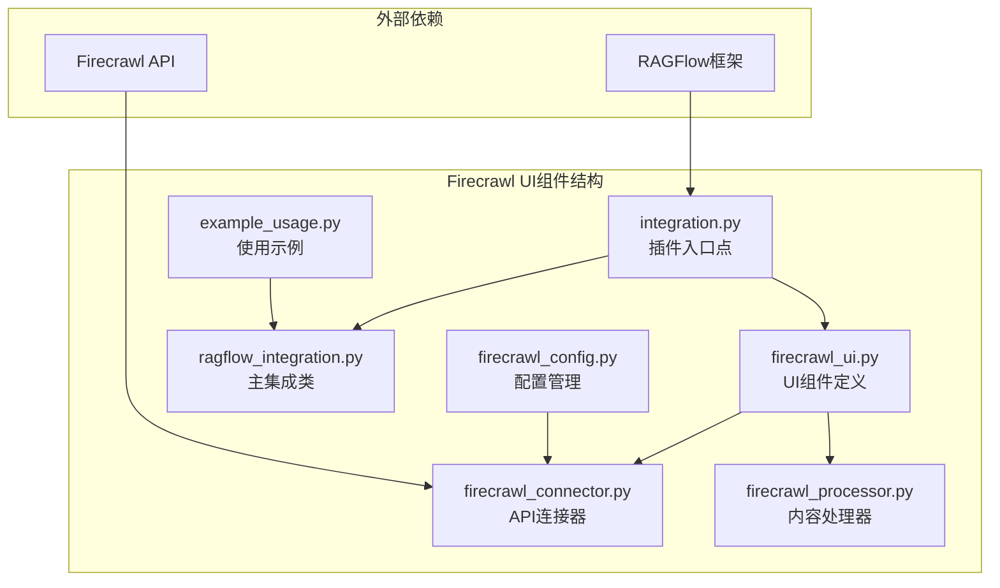
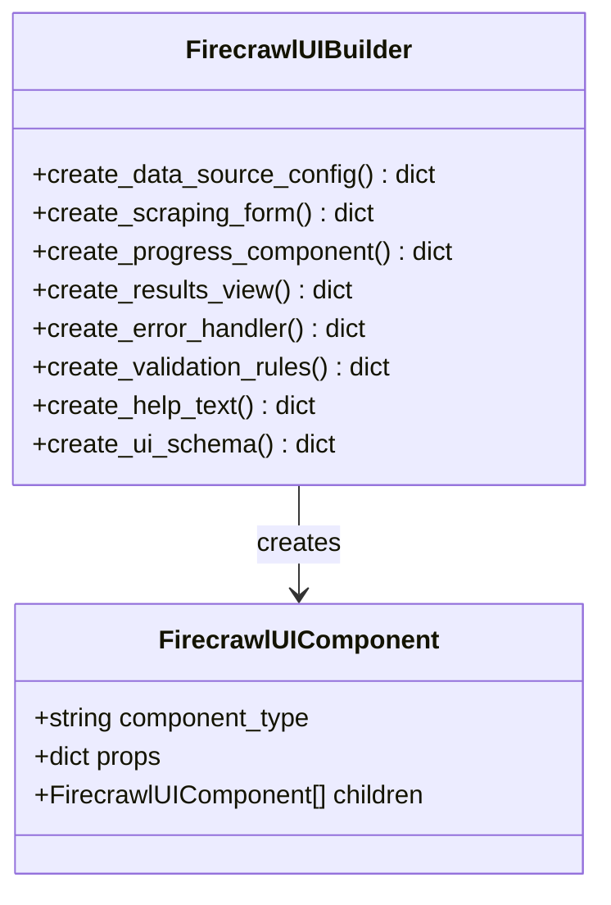
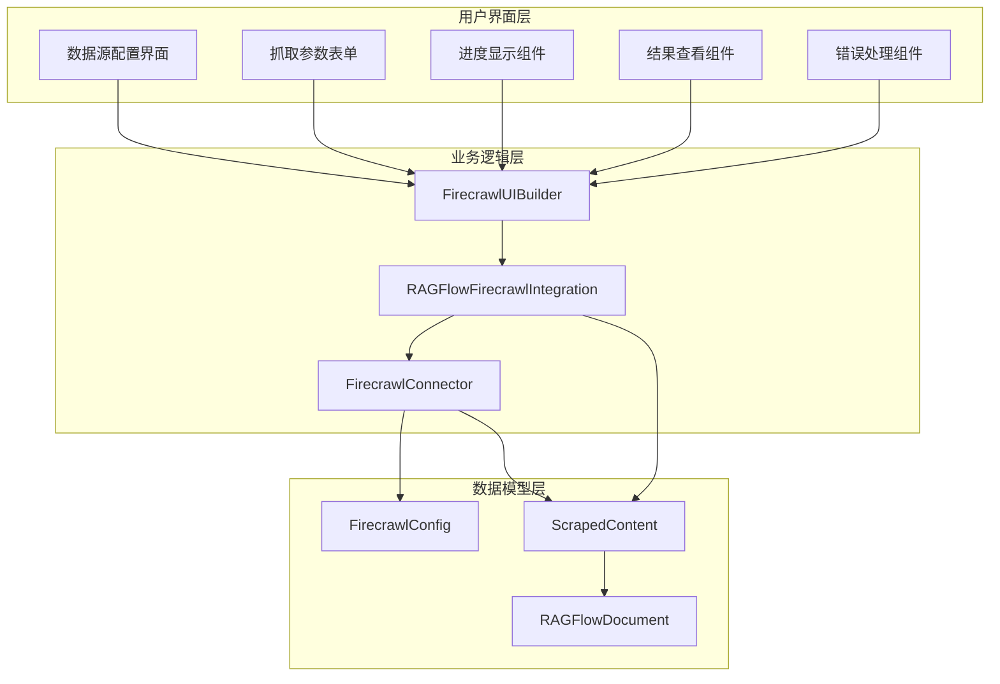
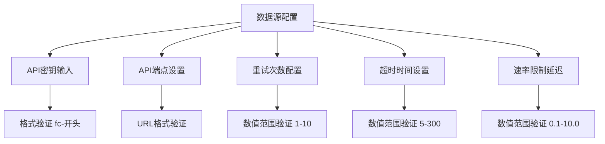
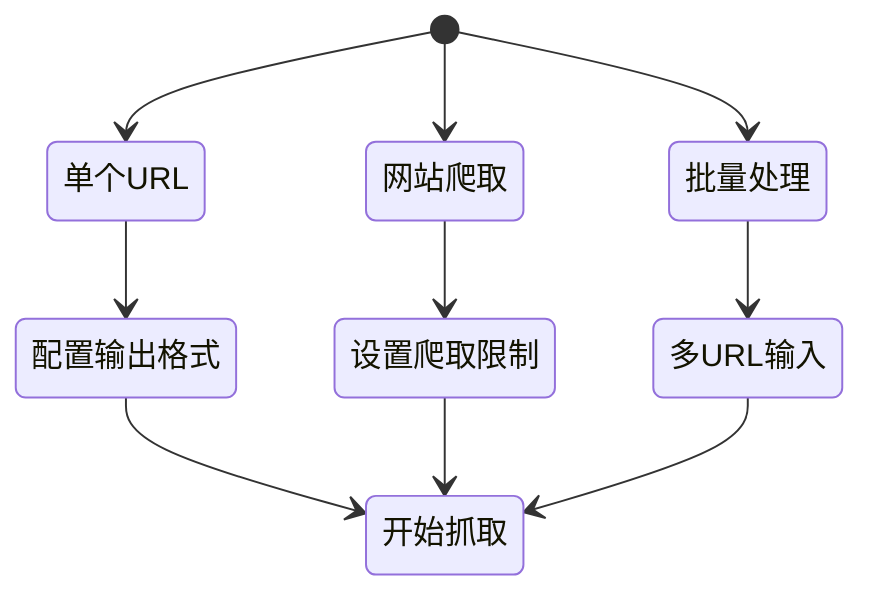
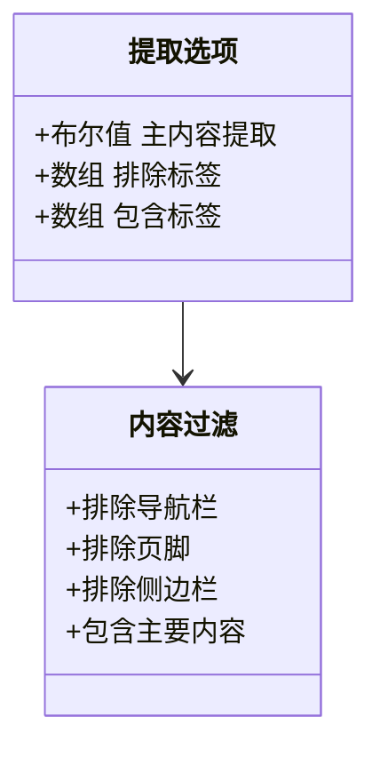
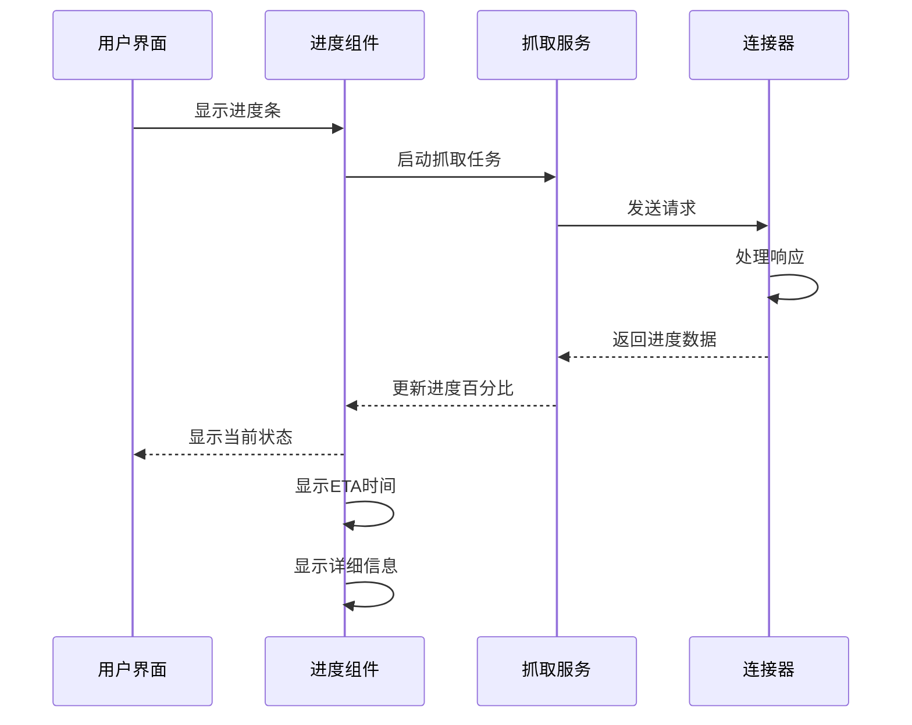
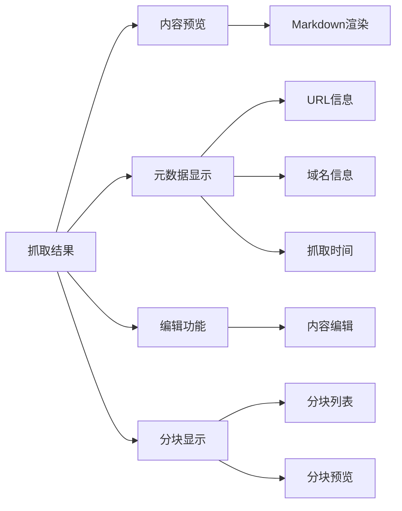
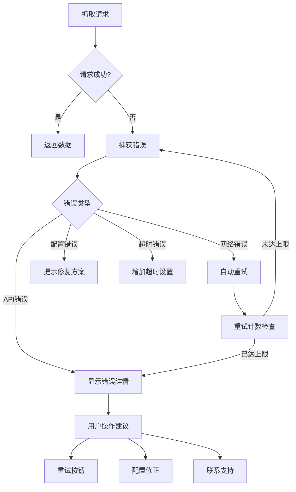
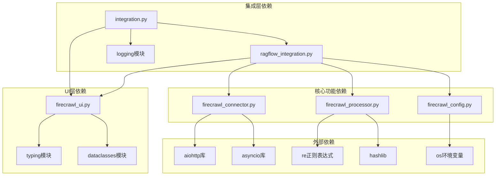

# UI组件

<cite>
**本文档引用的文件**
- [firecrawl_ui.py](file://intergrations/firecrawl/firecrawl_ui.py)
- [integration.py](file://intergrations/firecrawl/integration.py)
- [ragflow_integration.py](file://intergrations/firecrawl/ragflow_integration.py)
- [firecrawl_connector.py](file://intergrations/firecrawl/firecrawl_connector.py)
- [firecrawl_config.py](file://intergrations/firecrawl/firecrawl_config.py)
- [firecrawl_processor.py](file://intergrations/firecrawl/firecrawl_processor.py)
- [README.md](file://intergrations/firecrawl/README.md)
- [example_usage.py](file://intergrations/firecrawl/example_usage.py)
</cite>

## 目录
1. [简介](#简介)
2. [项目结构](#项目结构)
3. [核心组件](#核心组件)
4. [架构概览](#架构概览)
5. [详细组件分析](#详细组件分析)
6. [依赖关系分析](#依赖关系分析)
7. [性能考虑](#性能考虑)
8. [故障排除指南](#故障排除指南)
9. [结论](#结论)

## 简介

Firecrawl UI组件是RAGFlow集成系统中的关键部分，负责为Firecrawl网络爬虫功能提供用户界面支持。该组件实现了完整的UI架构，包括数据源配置界面、抓取选项设置、进度显示、错误提示等功能模块，使用户能够通过直观的图形界面配置和使用Firecrawl的Web内容抓取能力。

该UI组件遵循RAGFlow的集成模式，提供了标准化的数据源配置接口，支持多种抓取类型（单个URL、网站爬取、批量处理），并集成了完整的表单验证、错误处理和用户体验优化功能。

## 项目结构

Firecrawl UI组件位于`intergrations/firecrawl/`目录下，采用模块化设计，每个文件都有明确的职责分工：

**图表来源**
- [firecrawl_ui.py:1-260](file://intergrations/firecrawl/firecrawl_ui.py#L1-L260)
- [integration.py:1-150](file://intergrations/firecrawl/integration.py#L1-L150)

**章节来源**
- [firecrawl_ui.py:1-260](file://intergrations/firecrawl/firecrawl_ui.py#L1-L260)
- [README.md:41-55](file://intergrations/firecrawl/README.md#L41-L55)

## 核心组件

Firecrawl UI组件的核心由三个主要类组成：

### FirecrawlUIComponent类
这是UI组件的基础数据结构，用于表示和组织各种UI元素：

**图表来源**
- [firecrawl_ui.py:9-16](file://intergrations/firecrawl/firecrawl_ui.py#L9-L16)
- [firecrawl_ui.py:18-260](file://intergrations/firecrawl/firecrawl_ui.py#L18-L260)

### FirecrawlUIBuilder类
这个构建器类提供了创建各种UI组件的方法，包括配置界面、表单、进度条、结果视图和错误处理组件。

**章节来源**
- [firecrawl_ui.py:18-260](file://intergrations/firecrawl/firecrawl_ui.py#L18-L260)

## 架构概览

Firecrawl UI组件采用分层架构设计，从底层的配置管理到顶层的用户界面，形成了清晰的职责分离：

**图表来源**
- [integration.py:18-93](file://intergrations/firecrawl/integration.py#L18-L93)
- [ragflow_integration.py:15-158](file://intergrations/firecrawl/ragflow_integration.py#L15-L158)

## 详细组件分析

### 数据源配置界面

数据源配置界面是用户与Firecrawl集成交互的第一步，提供了API密钥输入、服务端点配置和基础参数设置功能。

#### 配置字段设计

**图表来源**
- [firecrawl_ui.py:32-76](file://intergrations/firecrawl/firecrawl_ui.py#L32-L76)

#### 表单验证机制

配置界面实现了多层次的验证机制：

1. **必需字段验证**：API密钥为必填项
2. **格式验证**：API密钥必须以"fc-"开头
3. **范围验证**：数值参数在合理范围内
4. **默认值设置**：提供合理的默认配置

**章节来源**
- [firecrawl_ui.py:22-76](file://intergrations/firecrawl/firecrawl_ui.py#L22-L76)

### 抓取选项设置

抓取选项表单提供了灵活的内容抓取配置，支持多种抓取模式和输出格式。

#### 抓取类型配置

**图表来源**
- [firecrawl_ui.py:79-161](file://intergrations/firecrawl/firecrawl_ui.py#L79-L161)

#### 输出格式选择

支持四种主要输出格式：
- **Markdown**：推荐用于RAG处理
- **HTML**：保留原始格式
- **链接**：提取页面中的所有链接
- **截图**：生成网页截图

#### 高级提取选项

**图表来源**
- [firecrawl_ui.py:134-159](file://intergrations/firecrawl/firecrawl_ui.py#L134-L159)

**章节来源**
- [firecrawl_ui.py:79-161](file://intergrations/firecrawl/firecrawl_ui.py#L79-L161)

### 进度显示组件

进度显示组件提供了实时的抓取状态监控，增强了用户体验。

#### 进度跟踪功能

**图表来源**
- [firecrawl_ui.py:164-175](file://intergrations/firecrawl/firecrawl_ui.py#L164-L175)

#### 进度信息展示

进度组件显示以下信息：
- **完成百分比**：当前任务完成进度
- **剩余时间估算**：基于历史数据的ETA计算
- **详细状态**：当前正在处理的URL或页面
- **统计信息**：成功/失败计数

**章节来源**
- [firecrawl_ui.py:164-175](file://intergrations/firecrawl/firecrawl_ui.py#L164-L175)

### 结果查看组件

结果查看组件允许用户预览和管理抓取的内容。

#### 结果展示功能

**图表来源**
- [firecrawl_ui.py:178-190](file://intergrations/firecrawl/firecrawl_ui.py#L178-L190)

#### 内容管理功能

结果组件提供以下功能：
- **内容预览**：实时查看抓取的网页内容
- **元数据查看**：显示URL、域名、抓取时间等信息
- **编辑功能**：允许用户修改和优化内容
- **分块显示**：将长内容分割为可管理的块

**章节来源**
- [firecrawl_ui.py:178-190](file://intergrations/firecrawl/firecrawl_ui.py#L178-L190)

### 错误处理组件

错误处理组件确保用户能够理解并解决抓取过程中遇到的问题。

#### 错误处理机制

**图表来源**
- [firecrawl_ui.py:193-205](file://intergrations/firecrawl/firecrawl_ui.py#L193-L205)

#### 错误恢复策略

错误处理组件实现了多种恢复策略：
- **自动重试**：对临时性网络问题进行重试
- **手动重试**：提供显式的重试按钮
- **错误详情**：显示具体的错误信息和原因
- **配置修正**：提供可能的解决方案建议

**章节来源**
- [firecrawl_ui.py:193-205](file://intergrations/firecrawl/firecrawl_ui.py#L193-L205)

## 依赖关系分析

Firecrawl UI组件的依赖关系体现了清晰的分层架构：

**图表来源**
- [integration.py:8-12](file://intergrations/firecrawl/integration.py#L8-L12)
- [ragflow_integration.py:6-12](file://intergrations/firecrawl/ragflow_integration.py#L6-L12)

**章节来源**
- [integration.py:8-12](file://intergrations/firecrawl/integration.py#L8-L12)
- [ragflow_integration.py:6-12](file://intergrations/firecrawl/ragflow_integration.py#L6-L12)

## 性能考虑

Firecrawl UI组件在设计时充分考虑了性能优化：

### 异步处理
- 使用asyncio进行非阻塞的API调用
- 支持并发请求处理
- 实现智能的速率限制

### 缓存策略
- 连接池复用HTTP会话
- 结果缓存避免重复抓取
- 元数据缓存减少处理开销

### 资源管理
- 自动资源清理和释放
- 内存使用优化
- 连接超时控制

## 故障排除指南

### 常见问题及解决方案

#### API密钥相关问题
- **问题**：API密钥验证失败
- **原因**：密钥格式不正确或权限不足
- **解决方案**：检查密钥格式（必须以"fc-"开头）和网络连接

#### 网络连接问题
- **问题**：无法连接到Firecrawl API
- **原因**：网络不稳定或API服务不可用
- **解决方案**：检查网络连接，稍后重试，或调整超时设置

#### 速率限制问题
- **问题**：请求被API拒绝
- **原因**：超出API速率限制
- **解决方案**：增加速率限制延迟，减少并发请求数量

#### 内容处理问题
- **问题**：抓取内容质量不佳
- **原因**：提取选项配置不当
- **解决方案**：调整排除/包含标签，优化提取选项

**章节来源**
- [firecrawl_ui.py:208-224](file://intergrations/firecrawl/firecrawl_ui.py#L208-L224)

## 结论

Firecrawl UI组件为RAGFlow提供了完整、易用的Web内容抓取界面。通过精心设计的组件架构、完善的表单验证、智能的错误处理和丰富的用户体验功能，该组件成功地将复杂的API功能封装为直观的图形界面。

该组件的主要优势包括：
- **模块化设计**：清晰的职责分离便于维护和扩展
- **完整的验证**：多层验证确保配置正确性
- **优秀的用户体验**：实时进度显示和错误提示
- **灵活的配置**：支持多种抓取模式和输出格式
- **健壮的错误处理**：自动重试和用户友好的错误信息

对于开发者而言，该组件提供了良好的扩展基础，可以根据具体需求添加新的UI组件、调整验证规则或增强错误处理能力。通过遵循现有的架构模式和设计原则，可以轻松地对UI组件进行定制和优化。