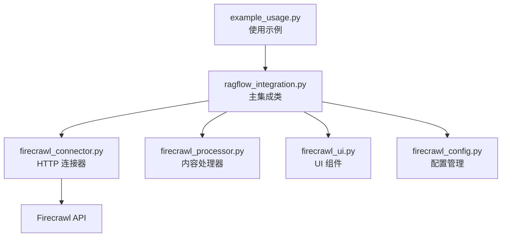
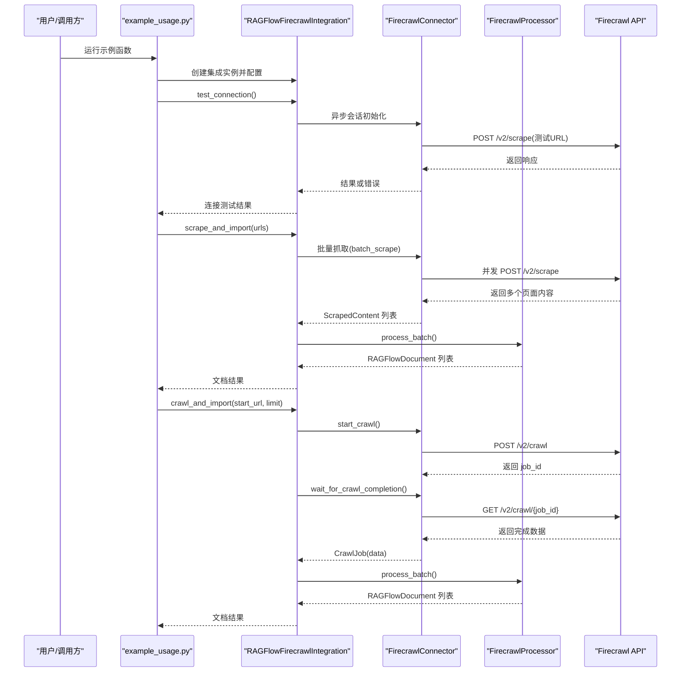
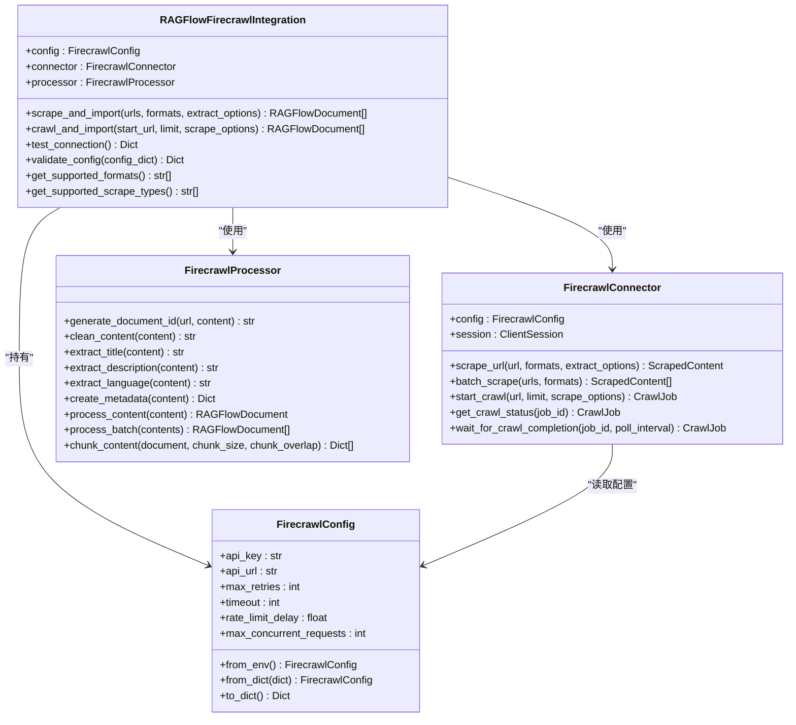

# 使用示例

<cite>
**本文引用的文件**
- [example_usage.py](file://intergrations/firecrawl/example_usage.py)
- [ragflow_integration.py](file://intergrations/firecrawl/ragflow_integration.py)
- [firecrawl_config.py](file://intergrations/firecrawl/firecrawl_config.py)
- [firecrawl_processor.py](file://intergrations/firecrawl/firecrawl_processor.py)
- [firecrawl_connector.py](file://intergrations/firecrawl/firecrawl_connector.py)
- [firecrawl_ui.py](file://intergrations/firecrawl/firecrawl_ui.py)
- [README.md](file://intergrations/firecrawl/README.md)
- [INSTALLATION.md](file://intergrations/firecrawl/INSTALLATION.md)
- [requirements.txt](file://intergrations/firecrawl/requirements.txt)
- [__init__.py](file://intergrations/firecrawl/__init__.py)
</cite>

## 目录
1. [简介](#简介)
2. [项目结构](#项目结构)
3. [核心组件](#核心组件)
4. [架构总览](#架构总览)
5. [详细组件分析](#详细组件分析)
6. [依赖关系分析](#依赖关系分析)
7. [性能与最佳实践](#性能与最佳实践)
8. [故障排查指南](#故障排查指南)
9. [结论](#结论)
10. [附录：输出格式与应用场景](#附录输出格式与应用场景)

## 简介
本文件面向希望在实际项目中使用 Firecrawl 集成进行网络内容抓取与导入的开发者，基于仓库中的 example_usage.py 提供系统化的使用示例与实现解析。内容涵盖：
- 单 URL 抓取、网站爬取、批量处理等核心场景
- 参数配置、错误处理、结果处理的关键步骤
- 输出格式选择（markdown、HTML、纯文本等）及其适用场景
- 性能优化建议（并发、限流、重试、资源管理）

## 项目结构
Firecrawl 集成位于 intergrations/firecrawl 目录，主要文件如下：
- example_usage.py：使用示例脚本，演示多种抓取场景与处理流程
- ragflow_integration.py：主集成类，封装连接器、处理器与 UI 架构
- firecrawl_connector.py：异步 HTTP 客户端，负责与 Firecrawl API 通信
- firecrawl_processor.py：内容处理器，将抓取结果转换为 RAGFlow 文档
- firecrawl_config.py：配置管理，支持字典/环境变量初始化与校验
- firecrawl_ui.py：UI 组件与验证规则，用于 RAGFlow 可视化配置
- README.md / INSTALLATION.md：安装与使用说明
- requirements.txt：Python 依赖清单
- __init__.py：包导出入口

图表来源
- [example_usage.py:1-262](file://intergrations/firecrawl/example_usage.py#L1-L262)
- [ragflow_integration.py:1-176](file://intergrations/firecrawl/ragflow_integration.py#L1-L176)
- [firecrawl_connector.py:1-263](file://intergrations/firecrawl/firecrawl_connector.py#L1-L263)
- [firecrawl_processor.py:1-276](file://intergrations/firecrawl/firecrawl_processor.py#L1-L276)
- [firecrawl_ui.py:1-260](file://intergrations/firecrawl/firecrawl_ui.py#L1-L260)
- [firecrawl_config.py:1-80](file://intergrations/firecrawl/firecrawl_config.py#L1-L80)

章节来源
- [README.md:41-56](file://intergrations/firecrawl/README.md#L41-L56)
- [INSTALLATION.md:11-56](file://intergrations/firecrawl/INSTALLATION.md#L11-L56)

## 核心组件
- 主集成类 RAGFlowFirecrawlIntegration：对外暴露 scrape_and_import、crawl_and_import、test_connection、validate_config 等方法，协调连接器与处理器
- 连接器 FirecrawlConnector：基于 aiohttp 的异步客户端，封装请求、重试、限流、爬虫作业状态轮询
- 处理器 FirecrawlProcessor：将 ScrapedContent 转换为 RAGFlowDocument，并提供分块能力
- 配置类 FirecrawlConfig：统一管理 API Key、超时、重试次数、速率限制等
- UI 构建器 FirecrawlUIBuilder：生成数据源配置、表单、进度条、结果视图、错误处理与帮助信息

章节来源
- [ragflow_integration.py:15-176](file://intergrations/firecrawl/ragflow_integration.py#L15-L176)
- [firecrawl_connector.py:41-263](file://intergrations/firecrawl/firecrawl_connector.py#L41-L263)
- [firecrawl_processor.py:32-276](file://intergrations/firecrawl/firecrawl_processor.py#L32-L276)
- [firecrawl_config.py:11-80](file://intergrations/firecrawl/firecrawl_config.py#L11-L80)
- [firecrawl_ui.py:18-260](file://intergrations/firecrawl/firecrawl_ui.py#L18-L260)

## 架构总览
下图展示了从调用到结果的端到端流程，包括连接测试、单页抓取、网站爬取、批量处理、内容清洗与分块。

图表来源
- [example_usage.py:12-201](file://intergrations/firecrawl/example_usage.py#L12-L201)
- [ragflow_integration.py:25-64](file://intergrations/firecrawl/ragflow_integration.py#L25-L64)
- [firecrawl_connector.py:107-247](file://intergrations/firecrawl/firecrawl_connector.py#L107-L247)
- [firecrawl_processor.py:188-200](file://intergrations/firecrawl/firecrawl_processor.py#L188-L200)

## 详细组件分析

### 示例一：单 URL 抓取
- 场景目标：对单一 URL 进行抓取，返回标题、URL、内容长度、语言、元数据等
- 关键步骤
  - 配置 API Key、API URL、重试次数、超时、速率限制
  - 创建集成实例并执行连接测试
  - 调用 scrape_and_import，传入单个 URL
  - 遍历返回的文档对象，打印关键字段
- 错误处理
  - 连接测试失败时提示检查 API Key
  - 抓取异常通过 try/except 捕获并打印错误信息
- 结果处理
  - 打印文档标题、来源 URL、内容长度、语言、元数据

章节来源
- [example_usage.py:12-47](file://intergrations/firecrawl/example_usage.py#L12-L47)
- [ragflow_integration.py:25-39](file://intergrations/firecrawl/ragflow_integration.py#L25-L39)

### 示例二：网站爬取
- 场景目标：从起始 URL 开始爬取整站，限制最大页面数，支持多种输出格式与内容提取选项
- 关键步骤
  - 配置同上
  - 调用 crawl_and_import，设置起始 URL、限制数量、抓取选项（formats、extractOptions）
  - 等待作业完成并获取数据
  - 打印每个页面的标题、URL、内容长度
- 抓取选项
  - formats：可选 markdown、html、links、screenshot
  - extractOptions：提取正文、排除标签、包含标签等
- 错误处理
  - 启动爬取失败或完成时失败均抛出异常

章节来源
- [example_usage.py:49-86](file://intergrations/firecrawl/example_usage.py#L49-L86)
- [ragflow_integration.py:41-64](file://intergrations/firecrawl/ragflow_integration.py#L41-L64)
- [firecrawl_connector.py:144-226](file://intergrations/firecrawl/firecrawl_connector.py#L144-L226)

### 示例三：批量处理
- 场景目标：同时抓取多个 URL，支持统一的输出格式与提取选项，并演示内容分块
- 关键步骤
  - 配置同上
  - 调用 scrape_and_import，传入 URL 列表与 formats、extract_options
  - 对每个文档调用 processor.chunk_content 进行分块
  - 打印分块数量与部分块元数据
- 分块策略
  - 基于 chunk_size 与 chunk_overlap 进行滑动窗口分块
  - 尽量按句号断句，避免截断语义

章节来源
- [example_usage.py:88-131](file://intergrations/firecrawl/example_usage.py#L88-L131)
- [firecrawl_processor.py:202-259](file://intergrations/firecrawl/firecrawl_processor.py#L202-L259)

### 示例四：内容处理与分块
- 场景目标：抓取后对内容进行清洗、分块，并输出块级元数据
- 关键步骤
  - 抓取单个 URL
  - 调用 processor.chunk_content 设置 chunk_size 与 chunk_overlap
  - 遍历块，打印块 ID、内容长度、元数据
- 清洗逻辑
  - 去除多余空白、HTML 标签、特殊字符
  - 规范化文本

章节来源
- [example_usage.py:133-172](file://intergrations/firecrawl/example_usage.py#L133-L172)
- [firecrawl_processor.py:45-59](file://intergrations/firecrawl/firecrawl_processor.py#L45-L59)
- [firecrawl_processor.py:202-259](file://intergrations/firecrawl/firecrawl_processor.py#L202-L259)

### 示例五：错误处理
- 场景目标：演示无效 API Key 的连接测试与抓取异常捕获
- 关键步骤
  - 使用无效 API Key 初始化集成
  - test_connection 返回失败信息
  - 抓取时捕获异常并打印错误

章节来源
- [example_usage.py:174-201](file://intergrations/firecrawl/example_usage.py#L174-L201)
- [ragflow_integration.py:114-141](file://intergrations/firecrawl/ragflow_integration.py#L114-L141)

### 示例六：配置校验
- 场景目标：验证不同配置组合的有效性，输出错误字段与原因
- 关键步骤
  - 准备多组配置（有效、API Key 格式错误、URL 错误、数值越界）
  - 调用 validate_config，逐项检查并输出错误

章节来源
- [example_usage.py:203-240](file://intergrations/firecrawl/example_usage.py#L203-L240)
- [ragflow_integration.py:70-108](file://intergrations/firecrawl/ragflow_integration.py#L70-L108)

### 类关系图（代码级）

图表来源
- [ragflow_integration.py:15-176](file://intergrations/firecrawl/ragflow_integration.py#L15-L176)
- [firecrawl_connector.py:41-263](file://intergrations/firecrawl/firecrawl_connector.py#L41-L263)
- [firecrawl_processor.py:32-276](file://intergrations/firecrawl/firecrawl_processor.py#L32-L276)
- [firecrawl_config.py:11-80](file://intergrations/firecrawl/firecrawl_config.py#L11-L80)

## 依赖关系分析
- 运行时依赖
  - aiohttp：异步 HTTP 客户端，支持连接池、超时、重试
  - pydantic：数据模型与序列化
  - python-dateutil：时间解析
  - beautifulsoup4/lxml/html2text：可选的内容清洗与 HTML 转文本
  - tenacity：可选的幂等重试
- 包导出
  - __init__.py 导出 FirecrawlConnector 与 FirecrawlConfig，便于外部直接引用

章节来源
- [requirements.txt:1-32](file://intergrations/firecrawl/requirements.txt#L1-L32)
- [__init__.py:12-16](file://intergrations/firecrawl/__init__.py#L12-L16)

## 性能与最佳实践
- 并发与限流
  - 连接器内部使用 asyncio.Semaphore 控制最大并发请求数
  - 每次请求前按配置的 rate_limit_delay 延迟，避免触发 API 限流
- 重试与指数退避
  - 请求失败时按 2^attempt 秒等待，最多尝试 max_retries 次
  - 针对 429 状态码自动退避
- 资源管理
  - 使用 async with 上下文管理会话生命周期，确保关闭
  - 批量抓取使用 asyncio.gather 并发执行，同时处理异常
- 内容处理
  - 清洗阶段去除多余空白、HTML 标签与特殊字符，提升后续 RAG 处理质量
  - 分块时尽量按句号断句，减少跨句切分带来的语义断裂
- 配置建议
  - API Key 必须以 fc- 开头；超时与重试次数需结合网络状况调整
  - 爬取网站时合理设置 crawl_limit，避免无界扩展
  - 输出格式优先选择 markdown，便于 RAG 系统解析与检索

章节来源
- [firecrawl_connector.py:48-105](file://intergrations/firecrawl/firecrawl_connector.py#L48-L105)
- [firecrawl_connector.py:227-247](file://intergrations/firecrawl/firecrawl_connector.py#L227-L247)
- [firecrawl_processor.py:45-59](file://intergrations/firecrawl/firecrawl_processor.py#L45-L59)
- [firecrawl_processor.py:202-259](file://intergrations/firecrawl/firecrawl_processor.py#L202-L259)
- [firecrawl_config.py:22-38](file://intergrations/firecrawl/firecrawl_config.py#L22-L38)

## 故障排查指南
- 连接测试失败
  - 检查 API Key 是否以 fc- 开头且未过期
  - 确认 API URL 正确，网络可达
  - 查看日志中是否有 429 或超时错误
- 爬取作业失败
  - 检查起始 URL 是否可访问
  - 适当提高 rate_limit_delay 与 timeout
  - 减少 crawl_limit 或调整 extractOptions
- 批量抓取异常
  - 捕获异常并记录失败 URL，避免整体中断
  - 分批提交，降低瞬时压力
- 内容为空或质量差
  - 调整 extractOptions 中的 include/exclude 标签
  - 优先使用 markdown 格式，必要时启用 HTML 清洗

章节来源
- [example_usage.py:174-201](file://intergrations/firecrawl/example_usage.py#L174-L201)
- [ragflow_integration.py:70-108](file://intergrations/firecrawl/ragflow_integration.py#L70-L108)
- [INSTALLATION.md:141-213](file://intergrations/firecrawl/INSTALLATION.md#L141-L213)

## 结论
通过上述示例与实现解析，开发者可以快速在实际项目中集成 Firecrawl，实现单 URL 抓取、网站爬取与批量处理，并根据 RAG 工作流需求选择合适的输出格式与分块策略。配合合理的并发、限流与重试机制，可在保证稳定性的同时提升吞吐效率。

## 附录：输出格式与应用场景
- markdown
  - 适合 RAG 处理，保留标题层级与结构，便于向量化与检索
- html
  - 适合网页展示与二次渲染，保留原始样式与链接
- links
  - 适合构建知识图谱或链接抽取任务
- screenshot
  - 适合视觉分析或网页快照归档

章节来源
- [ragflow_integration.py:143-149](file://intergrations/firecrawl/ragflow_integration.py#L143-L149)
- [firecrawl_ui.py:109-119](file://intergrations/firecrawl/firecrawl_ui.py#L109-L119)