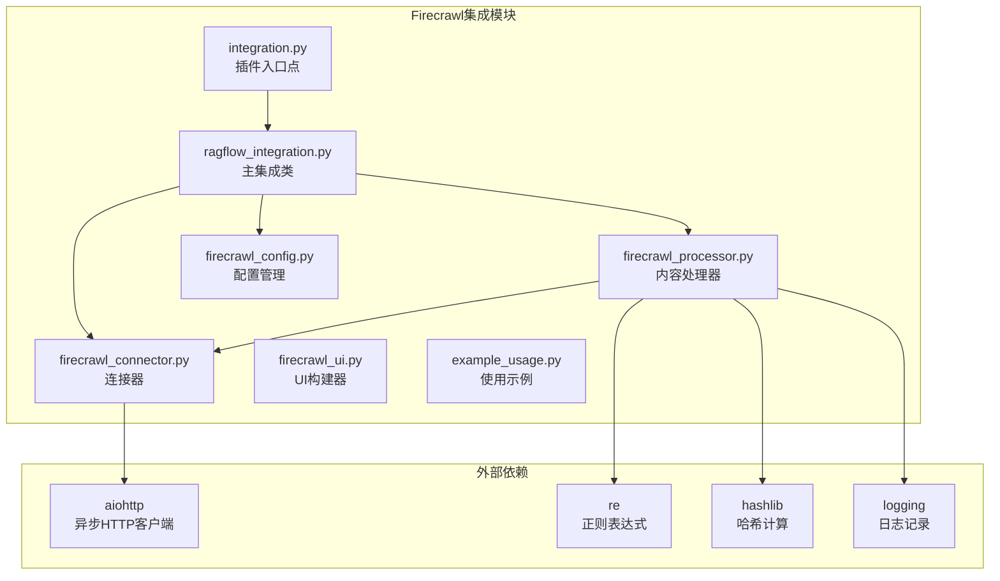
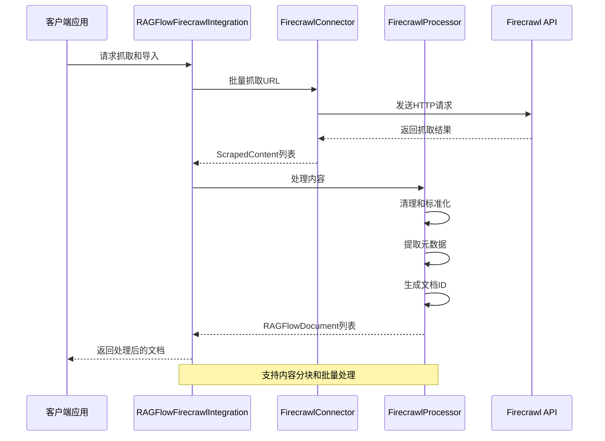
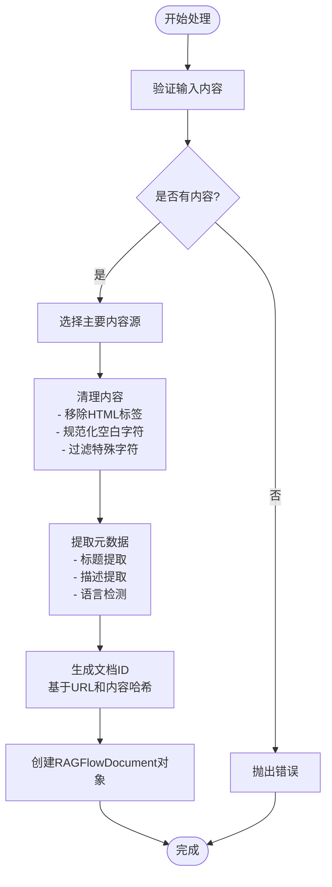
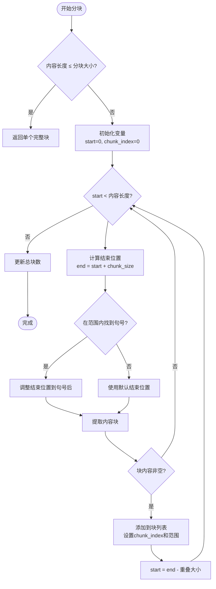
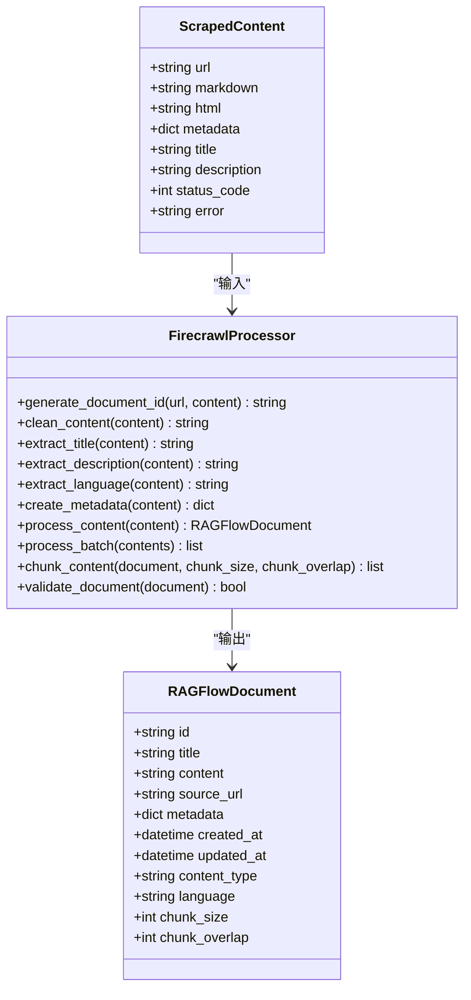
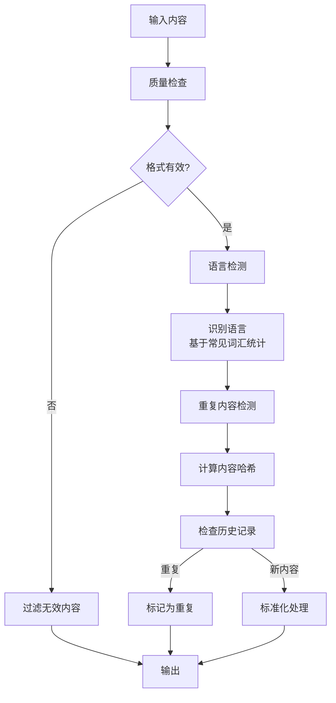
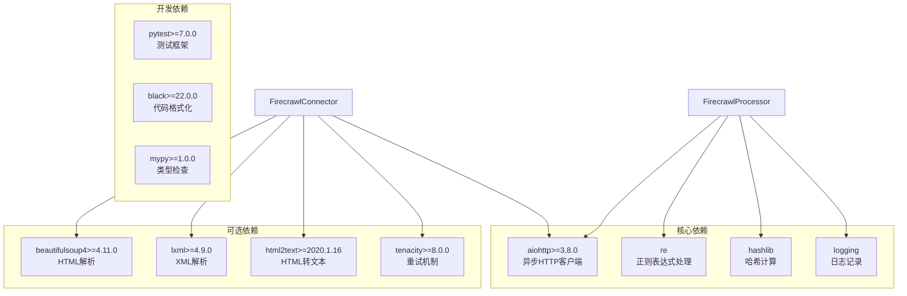
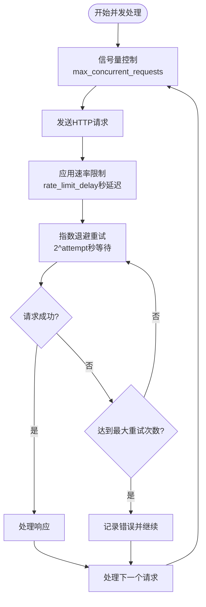
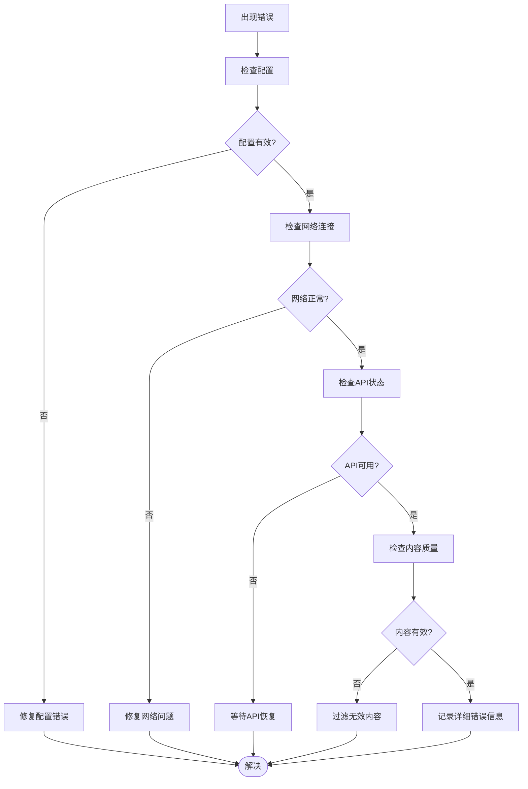

# 内容处理器

<cite>
**本文档引用的文件**
- [firecrawl_processor.py](file://intergrations/firecrawl/firecrawl_processor.py)
- [firecrawl_connector.py](file://intergrations/firecrawl/firecrawl_connector.py)
- [ragflow_integration.py](file://intergrations/firecrawl/ragflow_integration.py)
- [firecrawl_config.py](file://intergrations/firecrawl/firecrawl_config.py)
- [firecrawl_ui.py](file://intergrations/firecrawl/firecrawl_ui.py)
- [integration.py](file://intergrations/firecrawl/integration.py)
- [example_usage.py](file://intergrations/firecrawl/example_usage.py)
- [requirements.txt](file://intergrations/firecrawl/requirements.txt)
</cite>

## 目录
1. [简介](#简介)
2. [项目结构](#项目结构)
3. [核心组件](#核心组件)
4. [架构概览](#架构概览)
5. [详细组件分析](#详细组件分析)
6. [依赖关系分析](#依赖关系分析)
7. [性能考虑](#性能考虑)
8. [故障排除指南](#故障排除指南)
9. [结论](#结论)

## 简介

Firecrawl内容处理器是RAGFlow生态系统中的关键组件，负责将Firecrawl API返回的原始网页内容转换为RAGFlow可用的标准化文档格式。该处理器实现了从网页抓取到RAG-ready文档的完整管道，包括内容清理、格式标准化、元数据提取、文档分块等核心功能。

该系统支持多种内容格式（Markdown、HTML、纯文本），提供了强大的错误处理机制，并通过异步并发处理确保大规模内容处理的效率和稳定性。

## 项目结构

Firecrawl集成模块采用清晰的分层架构设计，每个组件都有明确的职责分工：

**图表来源**
- [firecrawl_processor.py:1-276](file://intergrations/firecrawl/firecrawl_processor.py#L1-L276)
- [firecrawl_connector.py:1-263](file://intergrations/firecrawl/firecrawl_connector.py#L1-L263)
- [ragflow_integration.py:1-176](file://intergrations/firecrawl/ragflow_integration.py#L1-L176)

**章节来源**
- [firecrawl_processor.py:1-276](file://intergrations/firecrawl/firecrawl_processor.py#L1-L276)
- [firecrawl_connector.py:1-263](file://intergrations/firecrawl/firecrawl_connector.py#L1-L263)
- [ragflow_integration.py:1-176](file://intergrations/firecrawl/ragflow_integration.py#L1-L176)

## 核心组件

### FirecrawlProcessor - 主要内容处理器

FirecrawlProcessor是整个系统的中枢，负责将Firecrawl抓取的内容转换为RAGFlow兼容的文档格式。其核心功能包括：

- **内容清理和标准化**：移除HTML标签、特殊字符，统一空白字符
- **元数据提取**：从多个来源提取标题、描述、语言等信息
- **文档ID生成**：基于URL和内容生成唯一标识符
- **内容分块**：将长文档分割为适合RAG处理的块
- **批量处理**：支持并发处理多个文档

### FirecrawlConnector - 异步连接器

FirecrawlConnector提供与Firecrawl API的异步通信能力，包含：

- **并发请求管理**：使用信号量控制最大并发请求数
- **重试机制**：指数退避重试策略处理临时错误
- **速率限制**：自动处理API速率限制
- **批量抓取**：并发抓取多个URL

### RAGFlowFirecrawlIntegration - 主集成类

RAGFlowFirecrawlIntegration作为高层接口，协调各个组件的工作：

- **工作流编排**：管理从抓取到导入的完整流程
- **配置验证**：确保配置参数的有效性
- **连接测试**：验证与Firecrawl API的连通性
- **错误处理**：提供统一的错误处理机制

**章节来源**
- [firecrawl_processor.py:32-276](file://intergrations/firecrawl/firecrawl_processor.py#L32-L276)
- [firecrawl_connector.py:41-263](file://intergrations/firecrawl/firecrawl_connector.py#L41-L263)
- [ragflow_integration.py:15-176](file://intergrations/firecrawl/ragflow_integration.py#L15-L176)

## 架构概览

Firecrawl内容处理器采用分层架构，每层都有明确的职责边界：

**图表来源**
- [ragflow_integration.py:25-64](file://intergrations/firecrawl/ragflow_integration.py#L25-L64)
- [firecrawl_connector.py:227-247](file://intergrations/firecrawl/firecrawl_connector.py#L227-L247)
- [firecrawl_processor.py:152-186](file://intergrations/firecrawl/firecrawl_processor.py#L152-L186)

## 详细组件分析

### 内容处理流程

内容处理的核心流程遵循严格的步骤顺序：

**图表来源**
- [firecrawl_processor.py:152-186](file://intergrations/firecrawl/firecrawl_processor.py#L152-L186)
- [firecrawl_processor.py:45-59](file://intergrations/firecrawl/firecrawl_processor.py#L45-L59)
- [firecrawl_processor.py:61-113](file://intergrations/firecrawl/firecrawl_processor.py#L61-L113)

### 文档分块算法

文档分块算法是RAG处理的关键组件，实现了智能的内容分割：

**图表来源**
- [firecrawl_processor.py:202-259](file://intergrations/firecrawl/firecrawl_processor.py#L202-L259)

#### 参数机制详解

**chunk_size参数**：
- 控制每个分块的最大字符数
- 默认值1000字符，适合大多数RAG模型的上下文窗口
- 影响检索精度和内存使用

**chunk_overlap参数**：
- 控制相邻分块之间的重叠字符数
- 默认值200字符，确保语义连续性
- 平衡内存使用和上下文完整性

### 多格式内容处理策略

系统支持多种输出格式，每种格式都有特定的处理策略：

**图表来源**
- [firecrawl_processor.py:15-30](file://intergrations/firecrawl/firecrawl_processor.py#L15-L30)
- [firecrawl_processor.py:32-276](file://intergrations/firecrawl/firecrawl_processor.py#L32-L276)

#### 格式处理差异

**Markdown格式**：
- 保留结构化信息（标题、列表、链接）
- 适合RAG处理，语义清晰
- 处理速度较快

**HTML格式**：
- 保持原始布局和样式
- 需要额外的清理步骤
- 适合需要保持视觉效果的场景

**纯文本格式**：
- 最简单的格式，处理开销最小
- 丢失结构化信息
- 适合快速处理大量内容

### 内容质量控制机制

系统实现了多层次的质量控制机制：

**图表来源**
- [firecrawl_processor.py:96-113](file://intergrations/firecrawl/firecrawl_processor.py#L96-L113)
- [firecrawl_processor.py:39-43](file://intergrations/firecrawl/firecrawl_processor.py#L39-L43)

#### 重复内容检测

系统使用MD5哈希算法检测重复内容：
- 基于URL和内容前缀生成哈希
- 防止相同内容的重复处理
- 减少存储空间和处理时间

#### 无效内容过滤

自动过滤以下类型的无效内容：
- 空内容或纯空白字符
- 抓取失败的页面
- 错误状态码的内容
- 超过配置限制的内容

#### 语言检测

基于词汇统计的语言检测：
- 英语：基于常用英语词汇
- 法语：基于常用法语词汇
- 德语：基于常用德语词汇
- 西班牙语：基于常用西班牙语词汇

**章节来源**
- [firecrawl_processor.py:39-113](file://intergrations/firecrawl/firecrawl_processor.py#L39-L113)

## 依赖关系分析

### 外部依赖管理

Firecrawl集成模块的依赖关系清晰且经过精心设计：

**图表来源**
- [requirements.txt:1-32](file://intergrations/firecrawl/requirements.txt#L1-L32)

### 组件耦合度分析

系统采用了低耦合的设计原则：

- **FirecrawlProcessor** 仅依赖基本Python库，减少外部依赖
- **FirecrawlConnector** 专门处理网络通信，职责单一
- **RAGFlowFirecrawlIntegration** 作为协调者，不直接处理业务逻辑
- **FirecrawlConfig** 独立管理配置，便于测试和替换

**章节来源**
- [requirements.txt:1-32](file://intergrations/firecrawl/requirements.txt#L1-L32)

## 性能考虑

### 内存管理策略

系统实现了多项内存优化措施：

1. **流式处理**：避免一次性加载大文件到内存
2. **分块处理**：文档按块处理，减少峰值内存使用
3. **及时释放**：处理完成后立即释放不需要的对象
4. **垃圾回收**：合理使用Python的垃圾回收机制

### 并发处理优化

**图表来源**
- [firecrawl_connector.py:79-105](file://intergrations/firecrawl/firecrawl_connector.py#L79-L105)

### 性能优化建议

1. **配置调优**：
   - 根据网络条件调整`max_concurrent_requests`
   - 合理设置`rate_limit_delay`平衡速度和稳定性
   - 优化`chunk_size`和`chunk_overlap`参数

2. **缓存策略**：
   - 缓存重复的抓取结果
   - 使用LRU缓存管理热门内容
   - 实现增量更新机制

3. **资源管理**：
   - 监控内存使用情况
   - 实现超时保护机制
   - 添加健康检查功能

## 故障排除指南

### 常见问题诊断

**图表来源**
- [firecrawl_processor.py:192-198](file://intergrations/firecrawl/firecrawl_processor.py#L192-L198)
- [firecrawl_connector.py:87-105](file://intergrations/firecrawl/firecrawl_connector.py#L87-L105)

### 错误处理机制

系统提供了多层次的错误处理：

1. **配置验证**：在初始化阶段验证所有配置参数
2. **网络异常**：处理连接超时、DNS解析失败等
3. **API错误**：处理429限流、500服务器错误等
4. **内容错误**：处理无效内容、格式错误等

### 调试和监控

- **详细日志记录**：记录所有重要操作和错误信息
- **性能指标**：监控处理时间和资源使用情况
- **健康检查**：定期检查系统状态和依赖服务

**章节来源**
- [firecrawl_processor.py:192-198](file://intergrations/firecrawl/firecrawl_processor.py#L192-L198)
- [firecrawl_connector.py:87-105](file://intergrations/firecrawl/firecrawl_connector.py#L87-L105)

## 结论

Firecrawl内容处理器是一个设计精良、功能完备的内容处理系统。它成功地将Firecrawl API的强大抓取能力与RAGFlow的文档处理需求相结合，提供了：

1. **高效的处理流程**：从抓取到导入的完整自动化管道
2. **灵活的格式支持**：支持多种输出格式，适应不同应用场景
3. **强大的质量控制**：多层次的质量保证机制
4. **优秀的性能表现**：通过异步并发和内存优化确保大规模处理能力
5. **完善的错误处理**：健壮的错误处理和恢复机制

该系统为RAGFlow生态系统的Web内容处理提供了坚实的基础，能够满足各种规模和复杂度的内容处理需求。通过合理的配置和优化，可以进一步提升处理效率和质量。