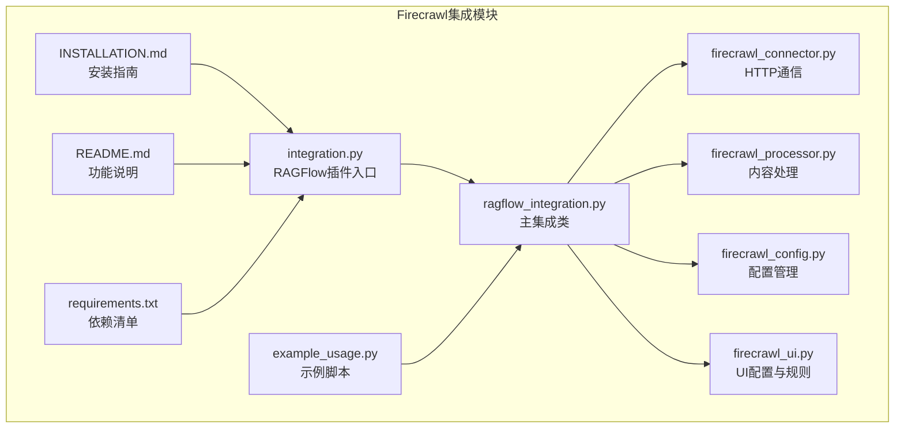
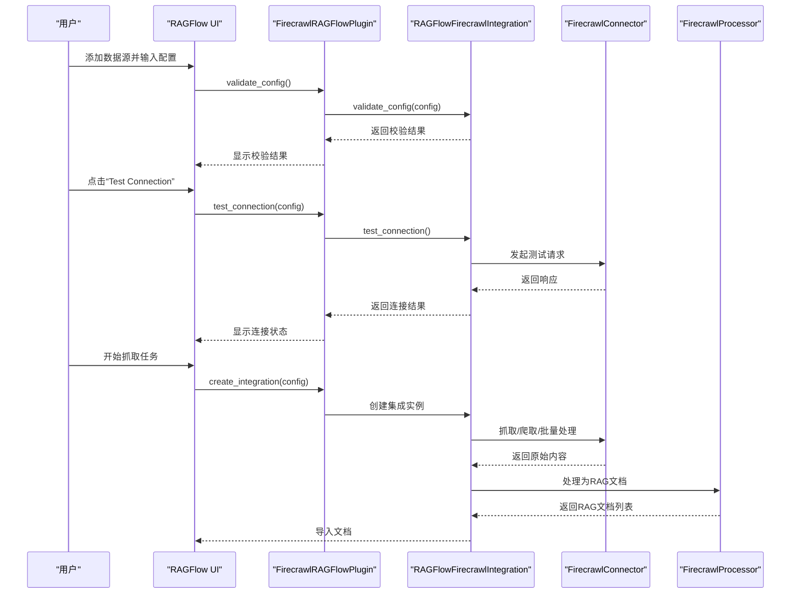
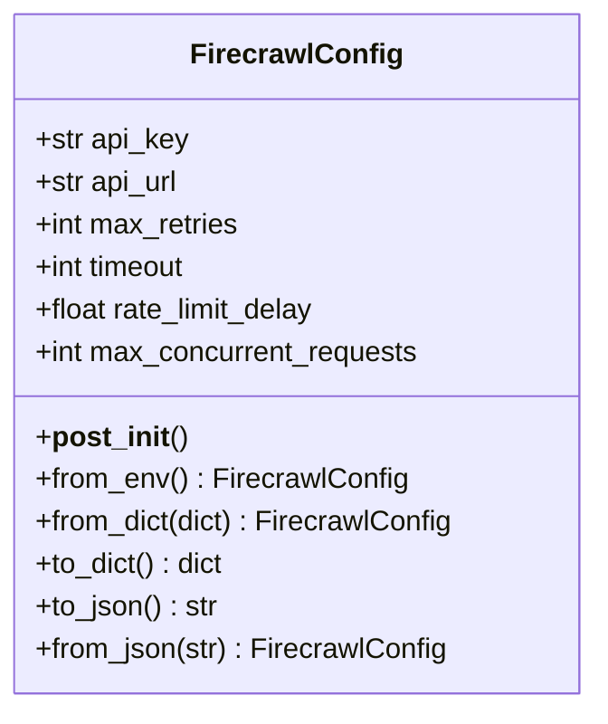
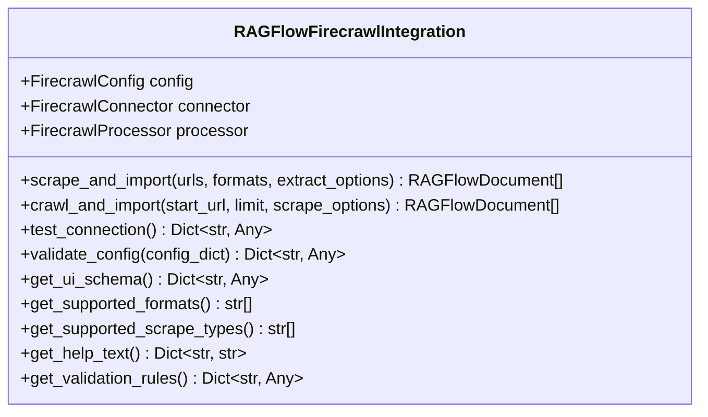
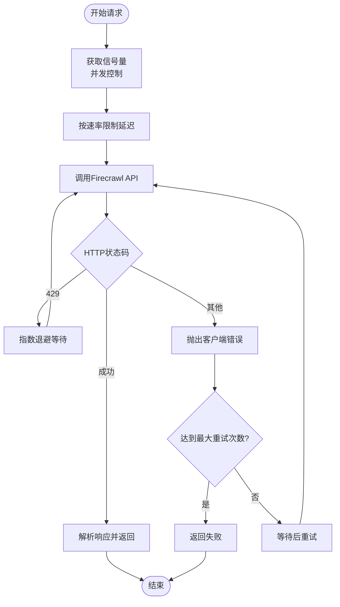
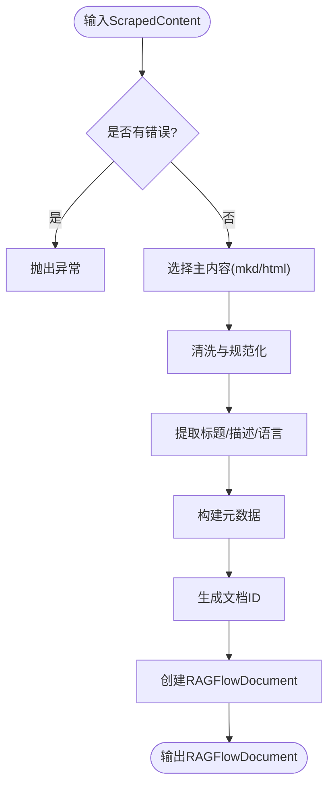

# 安装配置

<cite>
**本文引用的文件**
- [INSTALLATION.md](file://intergrations/firecrawl/INSTALLATION.md)
- [README.md](file://intergrations/firecrawl/README.md)
- [requirements.txt](file://intergrations/firecrawl/requirements.txt)
- [firecrawl_config.py](file://intergrations/firecrawl/firecrawl_config.py)
- [ragflow_integration.py](file://intergrations/firecrawl/ragflow_integration.py)
- [firecrawl_connector.py](file://intergrations/firecrawl/firecrawl_connector.py)
- [firecrawl_processor.py](file://intergrations/firecrawl/firecrawl_processor.py)
- [firecrawl_ui.py](file://intergrations/firecrawl/firecrawl_ui.py)
- [integration.py](file://intergrations/firecrawl/integration.py)
- [example_usage.py](file://intergrations/firecrawl/example_usage.py)
</cite>

## 目录
1. [简介](#简介)
2. [项目结构](#项目结构)
3. [前置条件与环境准备](#前置条件与环境准备)
4. [安装方法](#安装方法)
5. [依赖项与版本要求](#依赖项与版本要求)
6. [配置与API密钥获取](#配置与api密钥获取)
7. [安装验证与故障排除](#安装验证与故障排除)
8. [跨平台安装指南（Windows/Linux/macOS）](#跨平台安装指南windowslinuxmacos)
9. [常见问题与解决方案](#常见问题与解决方案)
10. [架构概览](#架构概览)
11. [详细组件分析](#详细组件分析)
12. [性能与最佳实践](#性能与最佳实践)
13. [结论](#结论)

## 简介
本指南面向需要在RAGFlow中集成Firecrawl的用户，提供从前置条件、API密钥获取、依赖安装到配置、验证与故障排除的完整流程。文档基于仓库中的Firecrawl集成模块，涵盖手动安装、开发模式安装以及通过pip安装三种方式，并对各组件职责、数据流与错误处理进行深入解析，帮助用户在不同操作系统上顺利完成安装并进行基础功能测试。

## 项目结构
Firecrawl集成位于intergrations/firecrawl目录下，主要文件包括：
- 安装与使用说明：INSTALLATION.md、README.md
- 核心实现：integration.py、ragflow_integration.py、firecrawl_connector.py、firecrawl_processor.py、firecrawl_config.py、firecrawl_ui.py
- 示例与依赖：example_usage.py、requirements.txt

图表来源
- [INSTALLATION.md:1-223](file://intergrations/firecrawl/INSTALLATION.md#L1-L223)
- [README.md:1-216](file://intergrations/firecrawl/README.md#L1-L216)
- [requirements.txt:1-32](file://intergrations/firecrawl/requirements.txt#L1-L32)
- [integration.py:1-150](file://intergrations/firecrawl/integration.py#L1-L150)
- [ragflow_integration.py:1-176](file://intergrations/firecrawl/ragflow_integration.py#L1-L176)
- [firecrawl_connector.py:1-263](file://intergrations/firecrawl/firecrawl_connector.py#L1-L263)
- [firecrawl_processor.py:1-276](file://intergrations/firecrawl/firecrawl_processor.py#L1-L276)
- [firecrawl_config.py:1-80](file://intergrations/firecrawl/firecrawl_config.py#L1-L80)
- [firecrawl_ui.py:1-260](file://intergrations/firecrawl/firecrawl_ui.py#L1-L260)
- [example_usage.py:1-262](file://intergrations/firecrawl/example_usage.py#L1-L262)

章节来源
- [INSTALLATION.md:1-223](file://intergrations/firecrawl/INSTALLATION.md#L1-L223)
- [README.md:41-55](file://intergrations/firecrawl/README.md#L41-L55)

## 前置条件与环境准备
- 运行中的RAGFlow实例（建议版本0.20.5或更高）
- Python 3.8及以上版本
- Firecrawl API密钥（可从firecrawl.dev免费注册获取）

章节来源
- [INSTALLATION.md:5-9](file://intergrations/firecrawl/INSTALLATION.md#L5-L9)
- [README.md:59-61](file://intergrations/firecrawl/README.md#L59-L61)

## 安装方法
支持以下三种安装方式：
- 手动安装：克隆仓库、安装依赖、复制插件目录、重启RAGFlow服务
- 使用pip安装：直接安装发布包（如可用）
- 开发模式安装：克隆仓库后以可编辑模式安装

章节来源
- [INSTALLATION.md:11-56](file://intergrations/firecrawl/INSTALLATION.md#L11-L56)

## 依赖项与版本要求
核心依赖与版本范围如下：
- aiohttp >= 3.8.0
- asyncio-throttle >= 1.0.0
- pydantic >= 2.0.0
- python-dateutil >= 2.8.0
- urllib3 >= 1.26.0
- requests >= 2.28.0
- structlog >= 22.0.0
- beautifulsoup4 >= 4.11.0（可选）
- lxml >= 4.9.0（可选）
- html2text >= 2020.1.16（可选）
- tenacity >= 8.0.0（可选）
- pytest >= 7.0.0（可选）
- pytest-asyncio >= 0.21.0（可选）
- black >= 22.0.0（可选）
- flake8 >= 5.0.0（可选）
- mypy >= 1.0.0（可选）

章节来源
- [requirements.txt:1-32](file://intergrations/firecrawl/requirements.txt#L1-L32)

## 配置与API密钥获取
- 获取API密钥：访问firecrawl.dev注册账号并复制以“fc-”开头的密钥
- 在RAGFlow界面添加数据源：选择“Firecrawl Web Scraper”，输入API密钥并配置其他选项
- 测试连接：点击“Test Connection”确认配置有效

章节来源
- [INSTALLATION.md:59-80](file://intergrations/firecrawl/INSTALLATION.md#L59-L80)
- [README.md:64-77](file://intergrations/firecrawl/README.md#L64-L77)

## 安装验证与故障排除
- 插件存在性验证：确认插件目录存在于RAGFlow的plugin路径下
- 运行示例脚本：在插件目录执行示例用法脚本进行端到端验证
- 查看RAGFlow日志：关注加载与注册信息，定位异常
- 常见问题排查：插件未显示、API密钥无效、连接超时、速率限制等

章节来源
- [INSTALLATION.md:104-139](file://intergrations/firecrawl/INSTALLATION.md#L104-L139)
- [INSTALLATION.md:141-213](file://intergrations/firecrawl/INSTALLATION.md#L141-L213)

## 跨平台安装指南（Windows/Linux/macOS）
- Windows
  - 确保已安装Python 3.8+，推荐使用虚拟环境隔离依赖
  - 使用命令行执行安装步骤，注意路径分隔符与权限
- Linux/macOS
  - 同样遵循上述步骤；若使用Docker Compose部署RAGFlow，请确保容器内网络可达Firecrawl API端点
  - 如需开发调试，可在宿主机运行示例脚本并观察日志输出

章节来源
- [INSTALLATION.md:13-56](file://intergrations/firecrawl/INSTALLATION.md#L13-L56)

## 常见问题与解决方案
- 插件未出现在RAGFlow界面
  - 检查插件目录是否正确放置于RAGFlow的plugin目录
  - 重启RAGFlow服务并查看日志
- API密钥无效
  - 确认密钥以“fc-”开头且处于激活状态
  - 检查配置中是否存在拼写错误
- 连接超时
  - 提高超时配置值
  - 检查本地网络连通性与API端点正确性
- 速率限制
  - 增大请求间隔（rate_limit_delay）
  - 减少并发请求数量
  - 关注Firecrawl用量配额

章节来源
- [INSTALLATION.md:143-163](file://intergrations/firecrawl/INSTALLATION.md#L143-L163)

## 架构概览
Firecrawl集成遵循RAGFlow插件模式，通过统一入口类暴露配置、UI、连接测试与集成实例创建能力。核心流程包括：配置校验、连接测试、内容抓取、内容处理与导入。

图表来源
- [integration.py:58-92](file://intergrations/firecrawl/integration.py#L58-L92)
- [ragflow_integration.py:70-157](file://intergrations/firecrawl/ragflow_integration.py#L70-L157)
- [firecrawl_connector.py:79-105](file://intergrations/firecrawl/firecrawl_connector.py#L79-L105)
- [firecrawl_processor.py:152-186](file://intergrations/firecrawl/firecrawl_processor.py#L152-L186)

## 详细组件分析

### 配置管理（FirecrawlConfig）
- 负责从字典或环境变量构建配置对象
- 提供参数范围校验（如重试次数、超时、速率限制等）
- 支持JSON序列化/反序列化

图表来源
- [firecrawl_config.py:11-79](file://intergrations/firecrawl/firecrawl_config.py#L11-L79)

章节来源
- [firecrawl_config.py:22-37](file://intergrations/firecrawl/firecrawl_config.py#L22-L37)
- [firecrawl_config.py:40-53](file://intergrations/firecrawl/firecrawl_config.py#L40-L53)

### 主集成类（RAGFlowFirecrawlIntegration）
- 提供抓取与导入、网站爬取与导入、连接测试、配置校验等接口
- 维护连接器与处理器实例，负责异步生命周期管理

图表来源
- [ragflow_integration.py:15-157](file://intergrations/firecrawl/ragflow_integration.py#L15-L157)

章节来源
- [ragflow_integration.py:25-64](file://intergrations/firecrawl/ragflow_integration.py#L25-L64)
- [ragflow_integration.py:114-141](file://intergrations/firecrawl/ragflow_integration.py#L114-L141)

### HTTP连接器（FirecrawlConnector）
- 基于aiohttp实现异步HTTP请求
- 内置速率限制与指数退避重试逻辑
- 支持单URL抓取、启动爬取任务、查询状态、等待完成、批量抓取

图表来源
- [firecrawl_connector.py:79-105](file://intergrations/firecrawl/firecrawl_connector.py#L79-L105)
- [firecrawl_connector.py:144-226](file://intergrations/firecrawl/firecrawl_connector.py#L144-L226)

章节来源
- [firecrawl_connector.py:79-105](file://intergrations/firecrawl/firecrawl_connector.py#L79-L105)
- [firecrawl_connector.py:144-226](file://intergrations/firecrawl/firecrawl_connector.py#L144-L226)

### 内容处理器（FirecrawlProcessor）
- 将抓取内容清洗、标准化并转换为RAGFlow文档格式
- 提供语言检测、元数据提取、文档ID生成与内容分块

图表来源
- [firecrawl_processor.py:152-186](file://intergrations/firecrawl/firecrawl_processor.py#L152-L186)

章节来源
- [firecrawl_processor.py:45-59](file://intergrations/firecrawl/firecrawl_processor.py#L45-L59)
- [firecrawl_processor.py:152-186](file://intergrations/firecrawl/firecrawl_processor.py#L152-L186)

### UI与配置（FirecrawlUIBuilder）
- 定义数据源配置Schema、抓取表单字段、进度组件、结果视图与错误处理组件
- 提供验证规则与帮助文本，支撑RAGFlow前端渲染与交互

章节来源
- [firecrawl_ui.py:22-76](file://intergrations/firecrawl/firecrawl_ui.py#L22-L76)
- [firecrawl_ui.py:78-161](file://intergrations/firecrawl/firecrawl_ui.py#L78-L161)
- [firecrawl_ui.py:208-235](file://intergrations/firecrawl/firecrawl_ui.py#L208-L235)

### 示例与测试（example_usage.py）
- 展示单URL抓取、网站爬取、批量处理、内容处理与分块、错误处理与配置校验等场景
- 可作为安装后的快速验证脚本

章节来源
- [example_usage.py:12-47](file://intergrations/firecrawl/example_usage.py#L12-L47)
- [example_usage.py:88-131](file://intergrations/firecrawl/example_usage.py#L88-L131)
- [example_usage.py:174-201](file://intergrations/firecrawl/example_usage.py#L174-L201)
- [example_usage.py:203-240](file://intergrations/firecrawl/example_usage.py#L203-L240)

## 性能与最佳实践
- 并发控制：通过信号量限制最大并发请求，避免触发API限速
- 重试策略：指数退避减少对上游的压力，同时提升稳定性
- 内容处理：优先使用Markdown输出，便于后续RAG处理；必要时启用HTML保留结构
- 分块策略：根据上下文窗口调整分块大小与重叠，平衡召回与检索效率

章节来源
- [firecrawl_connector.py:49-49](file://intergrations/firecrawl/firecrawl_connector.py#L49-L49)
- [firecrawl_connector.py:87-105](file://intergrations/firecrawl/firecrawl_connector.py#L87-L105)
- [firecrawl_processor.py:202-259](file://intergrations/firecrawl/firecrawl_processor.py#L202-L259)

## 结论
通过本指南，您可以在RAGFlow中完成Firecrawl集成的安装与配置，理解核心组件职责与数据流，并掌握常见问题的排查方法。建议在生产环境中结合自身网络与资源情况，合理设置超时、重试与并发参数，以获得稳定高效的Web内容抓取体验。