# 核心集成类

<cite>
**本文档中引用的文件**
- [ragflow_integration.py](file://intergrations/firecrawl/ragflow_integration.py)
- [integration.py](file://intergrations/firecrawl/integration.py)
- [firecrawl_connector.py](file://intergrations/firecrawl/firecrawl_connector.py)
- [firecrawl_processor.py](file://intergrations/firecrawl/firecrawl_processor.py)
- [firecrawl_ui.py](file://intergrations/firecrawl/firecrawl_ui.py)
- [firecrawl_config.py](file://intergrations/firecrawl/firecrawl_config.py)
- [example_usage.py](file://intergrations/firecrawl/example_usage.py)
- [__init__.py](file://intergrations/firecrawl/__init__.py)
- [README.md](file://intergrations/firecrawl/README.md)
</cite>

## 目录
1. [简介](#简介)
2. [项目结构](#项目结构)
3. [核心组件](#核心组件)
4. [架构概览](#架构概览)
5. [详细组件分析](#详细组件分析)
6. [依赖关系分析](#依赖关系分析)
7. [性能考虑](#性能考虑)
8. [故障排除指南](#故障排除指南)
9. [结论](#结论)
10. [附录](#附录)

## 简介

Firecrawl核心集成类是RAGFlow与Firecrawl Web爬虫服务之间的桥梁，实现了将Web内容无缝导入到RAG工作流中的完整解决方案。该集成类遵循RAGFlow的设计模式，提供了统一的接口来协调多个组件的工作流程，包括数据获取、内容处理、UI交互和配置管理。

本集成类的核心价值在于：
- **统一接口**：提供简洁的API供RAGFlow调用
- **错误处理**：完善的异常捕获和恢复机制
- **可扩展性**：模块化的架构设计支持功能扩展
- **用户体验**：友好的配置界面和帮助系统

## 项目结构

Firecrawl集成模块采用清晰的分层架构，每个文件都有明确的职责分工：

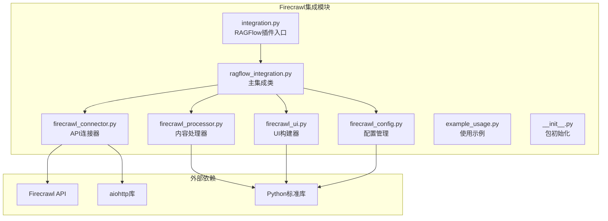

**图表来源**
- [ragflow_integration.py:1-176](file://intergrations/firecrawl/ragflow_integration.py#L1-L176)
- [integration.py:1-150](file://intergrations/firecrawl/integration.py#L1-L150)

**章节来源**
- [README.md:41-55](file://intergrations/firecrawl/README.md#L41-L55)
- [__init__.py:1-16](file://intergrations/firecrawl/__init__.py#L1-L16)

## 核心组件

### 主集成类：RAGFlowFirecrawlIntegration

`RAGFlowFirecrawlIntegration`是整个集成系统的核心，负责协调各个组件的工作。它提供了以下关键功能：

- **数据获取**：支持单URL抓取、网站爬取和批量处理
- **内容转换**：将Firecrawl输出转换为RAGFlow文档格式
- **配置管理**：验证和管理集成配置
- **连接测试**：验证与Firecrawl API的连通性
- **UI集成**：提供RAGFlow所需的UI配置和帮助信息

### 连接器：FirecrawlConnector

负责与Firecrawl API进行通信，实现了：
- **异步HTTP请求**：使用aiohttp库进行非阻塞网络调用
- **速率限制**：通过信号量控制并发请求数量
- **重试机制**：指数退避算法处理临时失败
- **会话管理**：自动化的连接生命周期管理

### 处理器：FirecrawlProcessor

专门处理内容转换逻辑，包括：
- **内容清洗**：去除HTML标签和特殊字符
- **元数据提取**：从原始内容中提取有用信息
- **文档生成**：创建符合RAGFlow格式的文档对象
- **内容分块**：将长文档分割为适合RAG处理的片段

### UI构建器：FirecrawlUIBuilder

提供完整的用户界面配置：
- **配置表单**：API密钥和参数设置界面
- **进度跟踪**：实时显示处理进度
- **结果展示**：格式化的处理结果视图
- **错误处理**：友好的错误提示和重试机制

**章节来源**
- [ragflow_integration.py:15-176](file://intergrations/firecrawl/ragflow_integration.py#L15-L176)
- [firecrawl_connector.py:41-263](file://intergrations/firecrawl/firecrawl_connector.py#L41-L263)
- [firecrawl_processor.py:32-276](file://intergrations/firecrawl/firecrawl_processor.py#L32-L276)
- [firecrawl_ui.py:18-260](file://intergrations/firecrawl/firecrawl_ui.py#L18-L260)

## 架构概览

整个集成系统采用分层架构设计，确保了高内聚低耦合的特性：

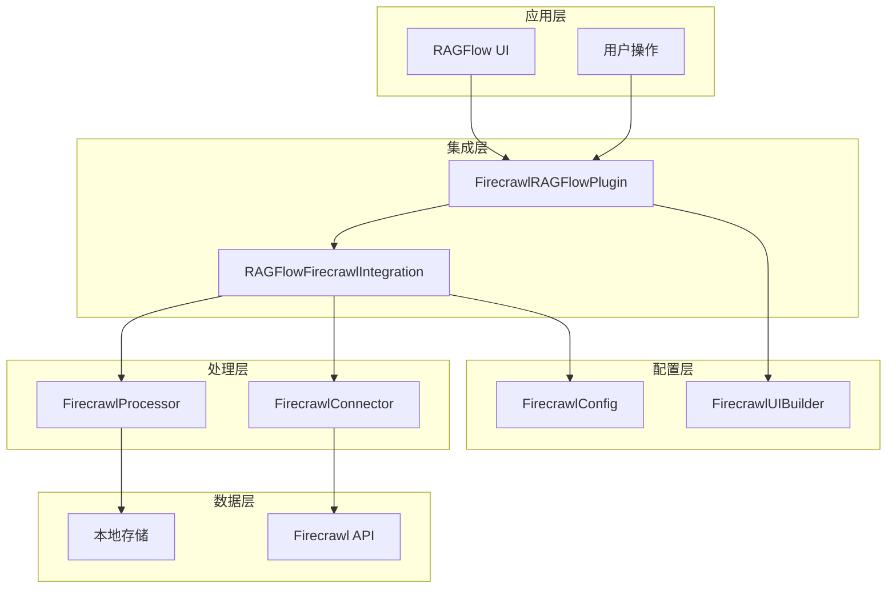

**图表来源**
- [integration.py:18-93](file://intergrations/firecrawl/integration.py#L18-L93)
- [ragflow_integration.py:15-176](file://intergrations/firecrawl/ragflow_integration.py#L15-L176)

### 数据流架构

系统的数据流遵循严格的处理顺序：

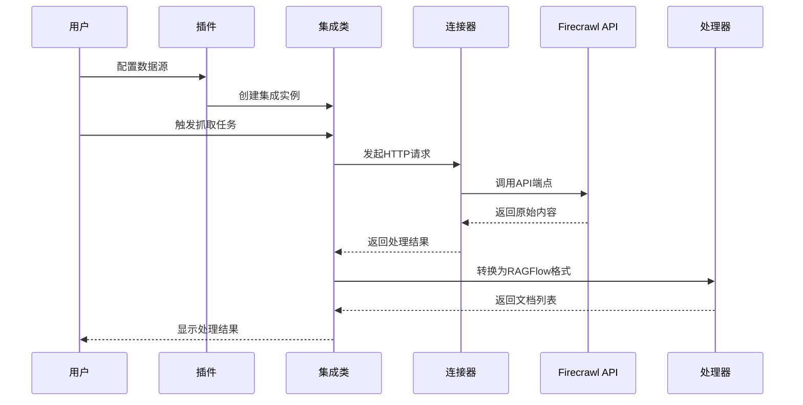

**图表来源**
- [ragflow_integration.py:25-64](file://intergrations/firecrawl/ragflow_integration.py#L25-L64)
- [firecrawl_connector.py:107-143](file://intergrations/firecrawl/firecrawl_connector.py#L107-L143)

## 详细组件分析

### RAGFlowFirecrawlIntegration 类分析

#### 类设计模式

该类采用了**策略模式**和**组合模式**的混合设计：

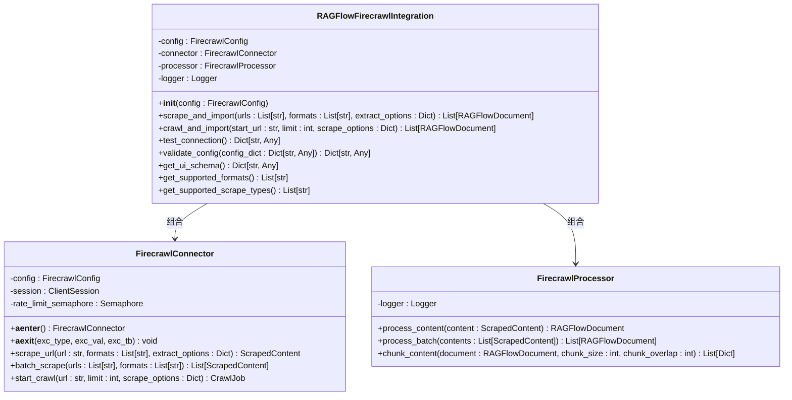

**图表来源**
- [ragflow_integration.py:15-176](file://intergrations/firecrawl/ragflow_integration.py#L15-L176)
- [firecrawl_connector.py:41-263](file://intergrations/firecrawl/firecrawl_connector.py#L41-L263)
- [firecrawl_processor.py:32-276](file://intergrations/firecrawl/firecrawl_processor.py#L32-L276)

#### 核心方法实现

##### 抓取和导入方法

`scrape_and_import`方法实现了批量URL抓取的核心逻辑：

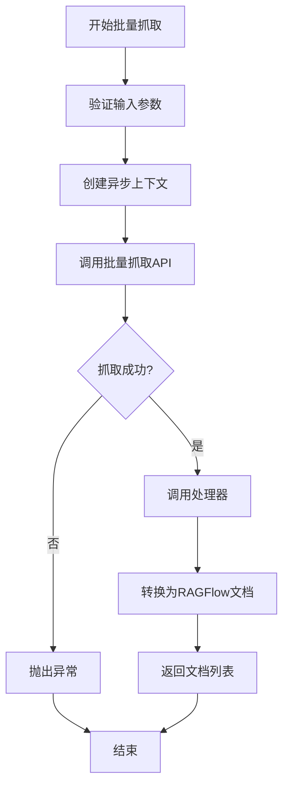

**图表来源**
- [ragflow_integration.py:25-39](file://intergrations/firecrawl/ragflow_integration.py#L25-L39)

##### 爬取和导入方法

`crawl_and_import`方法处理网站爬取的复杂流程：

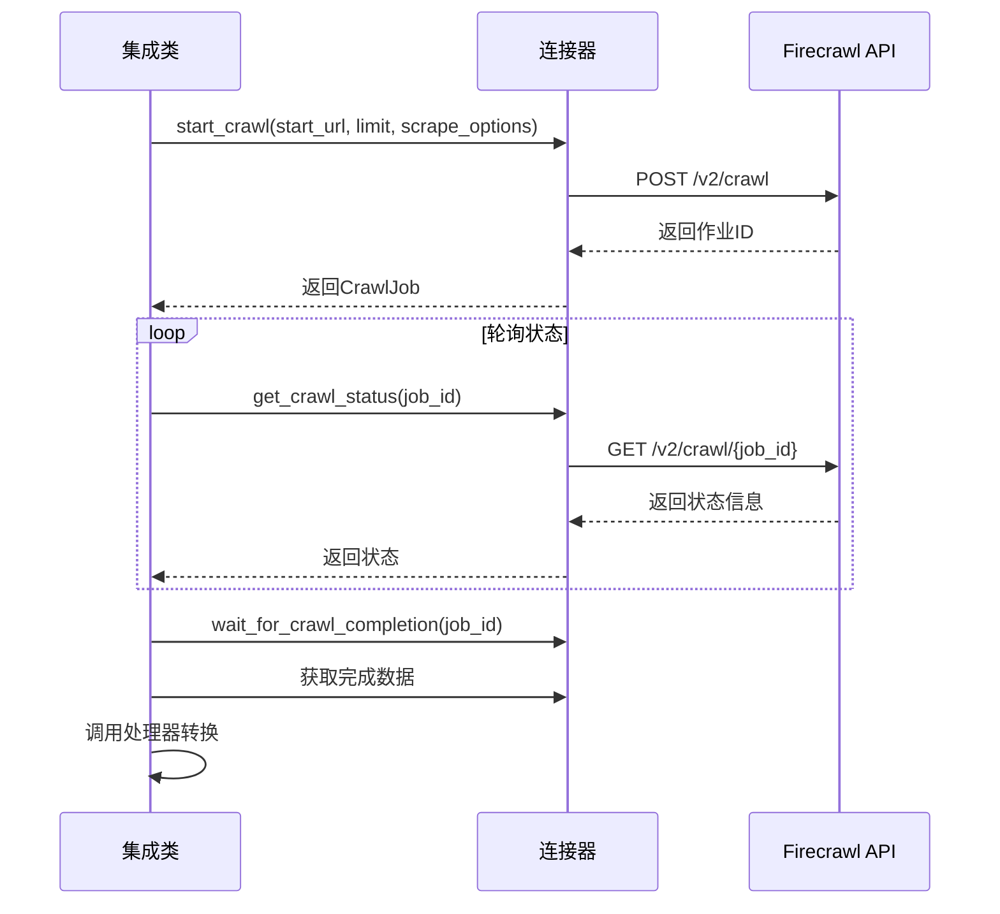

**图表来源**
- [ragflow_integration.py:41-64](file://intergrations/firecrawl/ragflow_integration.py#L41-L64)
- [firecrawl_connector.py:144-226](file://intergrations/firecrawl/firecrawl_connector.py#L144-L226)

#### 配置验证机制

集成类提供了全面的配置验证功能：

| 配置项 | 验证规则 | 默认值 | 必填 |
|--------|----------|--------|------|
| api_key | 以"fc-"开头的字符串 | - | 是 |
| api_url | 有效的HTTP/HTTPS URL | https://api.firecrawl.dev | 否 |
| max_retries | 整数，1-10 | 3 | 否 |
| timeout | 整数，5-300秒 | 30 | 否 |
| rate_limit_delay | 数字，0.1-10.0秒 | 1.0 | 否 |

**章节来源**
- [ragflow_integration.py:70-108](file://intergrations/firecrawl/ragflow_integration.py#L70-L108)
- [firecrawl_config.py:11-80](file://intergrations/firecrawl/firecrawl_config.py#L11-L80)

### FirecrawlConnector 类分析

#### 异步连接管理

连接器实现了完整的异步连接生命周期管理：

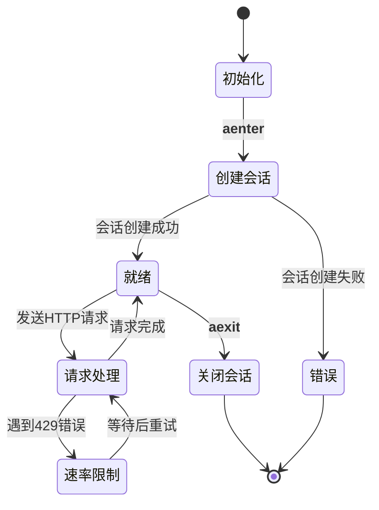

**图表来源**
- [firecrawl_connector.py:51-58](file://intergrations/firecrawl/firecrawl_connector.py#L51-L58)
- [firecrawl_connector.py:79-105](file://intergrations/firecrawl/firecrawl_connector.py#L79-L105)

#### 请求重试机制

连接器实现了智能的重试策略：

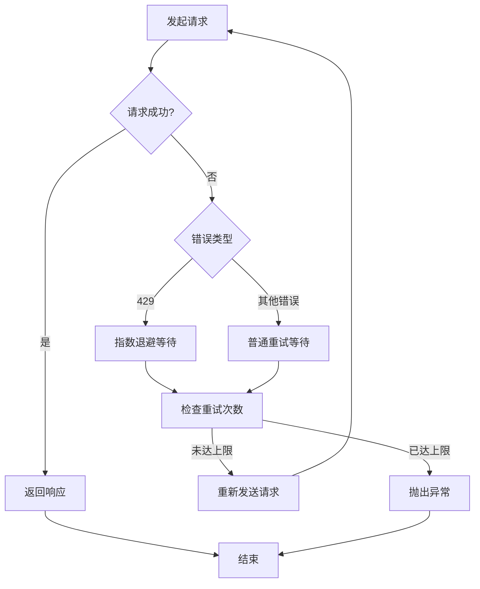

**图表来源**
- [firecrawl_connector.py:79-105](file://intergrations/firecrawl/firecrawl_connector.py#L79-L105)

**章节来源**
- [firecrawl_connector.py:41-263](file://intergrations/firecrawl/firecrawl_connector.py#L41-L263)

### FirecrawlProcessor 类分析

#### 内容处理流水线

处理器实现了多阶段的内容处理流程：

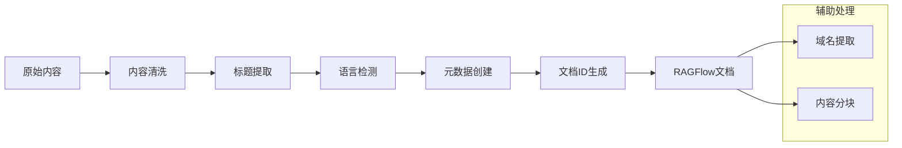

**图表来源**
- [firecrawl_processor.py:152-186](file://intergrations/firecrawl/firecrawl_processor.py#L152-L186)

#### 文档分块算法

处理器提供了智能的内容分块功能：

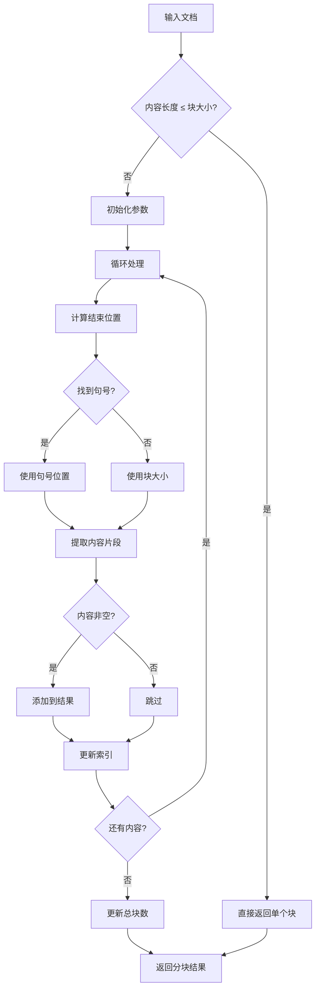

**图表来源**
- [firecrawl_processor.py:202-259](file://intergrations/firecrawl/firecrawl_processor.py#L202-L259)

**章节来源**
- [firecrawl_processor.py:32-276](file://intergrations/firecrawl/firecrawl_processor.py#L32-L276)

### FirecrawlUIBuilder 类分析

#### UI组件架构

UI构建器提供了完整的用户界面配置：

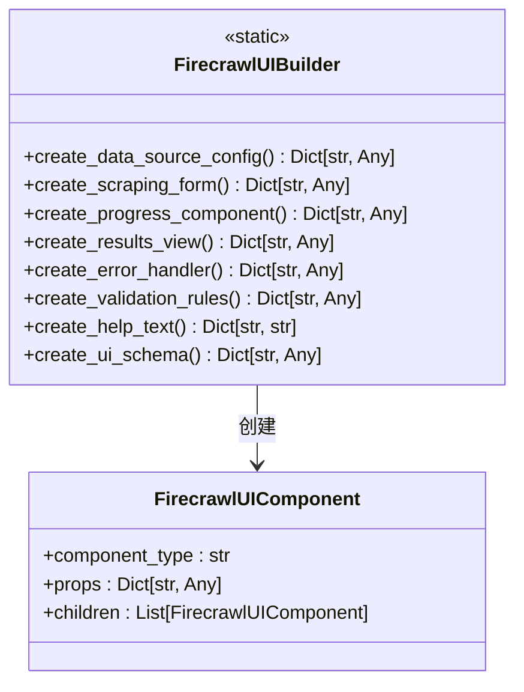

**图表来源**
- [firecrawl_ui.py:18-260](file://intergrations/firecrawl/firecrawl_ui.py#L18-L260)

#### 配置表单设计

UI构建器提供了灵活的配置表单：

| 字段名 | 类型 | 描述 | 默认值 | 条件 |
|--------|------|------|--------|------|
| api_key | string | Firecrawl API密钥 | - | 必填 |
| api_url | string | API端点URL | https://api.firecrawl.dev | 可选 |
| max_retries | integer | 最大重试次数 | 3 | 1-10 |
| timeout | integer | 超时时间(秒) | 30 | 5-300 |
| rate_limit_delay | number | 请求延迟(秒) | 1.0 | 0.1-10.0 |

**章节来源**
- [firecrawl_ui.py:22-76](file://intergrations/firecrawl/firecrawl_ui.py#L22-L76)

## 依赖关系分析

### 模块间依赖

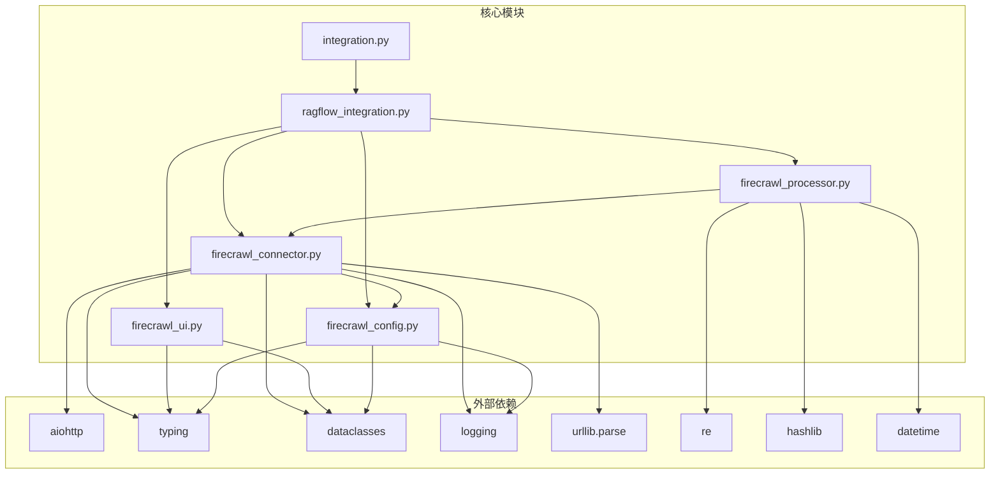

**图表来源**
- [ragflow_integration.py:9-12](file://intergrations/firecrawl/ragflow_integration.py#L9-L12)
- [firecrawl_connector.py:5-12](file://intergrations/firecrawl/firecrawl_connector.py#L5-L12)
- [firecrawl_processor.py:5-12](file://intergrations/firecrawl/firecrawl_processor.py#L5-L12)

### 外部库依赖

集成类依赖于以下Python标准库和第三方库：

| 库名称 | 版本要求 | 用途 |
|--------|----------|------|
| aiohttp | >=3.0.0 | 异步HTTP客户端 |
| typing | - | 类型注解 |
| dataclasses | - | 数据类定义 |
| logging | - | 日志记录 |
| urllib.parse | - | URL解析 |
| re | - | 正则表达式 |
| hashlib | - | 内容哈希 |
| datetime | - | 时间戳处理 |

**章节来源**
- [README.md:100-109](file://intergrations/firecrawl/README.md#L100-L109)

## 性能考虑

### 并发处理优化

集成类在多个层面实现了性能优化：

1. **异步I/O**：使用aiohttp实现非阻塞网络请求
2. **信号量控制**：通过`max_concurrent_requests`限制并发数量
3. **批量处理**：支持批量URL抓取减少API调用次数
4. **内存管理**：及时释放HTTP会话和中间结果

### 缓存策略

虽然当前版本没有实现缓存，但可以考虑以下优化方案：

- **内容缓存**：对已抓取的URL进行缓存
- **元数据缓存**：缓存URL的域名和状态信息
- **配置缓存**：缓存验证过的配置信息

### 监控和日志

集成类提供了详细的日志记录机制：

- **请求日志**：记录每次API调用的详细信息
- **错误日志**：捕获和记录所有异常情况
- **性能日志**：记录处理时间和资源使用情况

## 故障排除指南

### 常见问题及解决方案

#### API密钥验证失败

**症状**：连接测试失败，返回API密钥无效错误

**原因**：
- API密钥格式不正确（不是以"fc-"开头）
- API密钥已过期或被撤销
- 网络连接问题

**解决方案**：
1. 检查API密钥格式是否正确
2. 在Firecrawl官网重新生成API密钥
3. 验证网络连接和防火墙设置

#### 速率限制错误

**症状**：频繁遇到429状态码

**原因**：
- 请求过于频繁
- 并发请求过多
- 服务器端速率限制

**解决方案**：
1. 增加`rate_limit_delay`配置
2. 减少`max_concurrent_requests`数量
3. 实现更智能的重试策略

#### 内容处理错误

**症状**：某些页面无法正确转换为文档

**原因**：
- 页面结构复杂，Firecrawl无法正确解析
- 内容包含特殊字符或编码问题
- 网络超时导致内容不完整

**解决方案**：
1. 调整`extract_options`配置
2. 增加`timeout`值
3. 手动检查和清理有问题的URL

### 调试方法

#### 启用详细日志

```python
import logging
logging.basicConfig(level=logging.DEBUG)
```

#### 使用测试连接功能

```python
integration = create_firecrawl_integration(config)
result = await integration.test_connection()
print(result)
```

#### 分步调试

1. **配置验证**：先验证配置是否正确
2. **连接测试**：测试与Firecrawl API的连通性
3. **单URL测试**：从简单的URL开始测试
4. **批量测试**：逐步增加URL数量
5. **完整流程**：测试完整的抓取-处理-导入流程

**章节来源**
- [ragflow_integration.py:114-141](file://intergrations/firecrawl/ragflow_integration.py#L114-L141)
- [example_usage.py:174-201](file://intergrations/firecrawl/example_usage.py#L174-L201)

## 结论

Firecrawl核心集成类是一个设计精良、功能完整的系统，成功地将Firecrawl的Web爬虫能力与RAGFlow的RAG工作流相结合。该集成类的主要优势包括：

### 技术优势

1. **模块化设计**：清晰的分层架构便于维护和扩展
2. **异步处理**：高效的异步I/O处理大量并发请求
3. **健壮的错误处理**：完善的异常捕获和恢复机制
4. **灵活的配置**：支持多种配置方式和验证规则

### 架构优势

1. **可扩展性**：易于添加新的处理步骤和输出格式
2. **插件化设计**：支持第三方扩展和自定义集成
3. **标准化接口**：遵循RAGFlow的设计模式和约定
4. **用户友好**：提供完整的UI配置和帮助系统

### 改进建议

1. **缓存机制**：实现内容和元数据的缓存
2. **监控集成**：添加性能指标和健康检查
3. **批量优化**：进一步优化大批量处理的性能
4. **安全增强**：添加更多的安全验证和防护措施

该集成类为RAGFlow生态系统提供了强大的Web内容获取能力，是构建现代AI应用的重要基础设施。

## 附录

### 使用示例

#### 基本使用模式

```python
# 创建集成实例
config = {
    "api_key": "fc-your-api-key",
    "api_url": "https://api.firecrawl.dev",
    "max_retries": 3,
    "timeout": 30,
    "rate_limit_delay": 1.0
}

integration = create_firecrawl_integration(config)
```

#### 高级配置选项

```python
# 自定义提取选项
extract_options = {
    "extractMainContent": True,
    "excludeTags": ["nav", "footer", "header"],
    "includeTags": ["main", "article", "section"]
}

documents = await integration.scrape_and_import(
    urls=["https://example.com"],
    formats=["markdown", "html"],
    extract_options=extract_options
)
```

### 最佳实践

1. **配置管理**：使用环境变量管理敏感配置
2. **错误处理**：实现适当的异常捕获和重试逻辑
3. **性能优化**：根据实际需求调整并发和超时设置
4. **监控告警**：建立监控机制及时发现和解决问题

### 扩展指南

#### 添加新的处理步骤

1. 创建新的处理器类
2. 实现相应的处理方法
3. 在集成类中注册新处理器
4. 更新UI配置以支持新功能

#### 自定义输出格式

1. 在FirecrawlProcessor中添加新的格式处理逻辑
2. 更新配置验证规则
3. 修改UI表单以支持新格式
4. 测试新格式的兼容性和性能