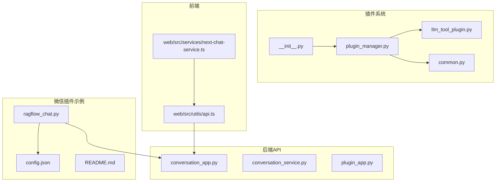
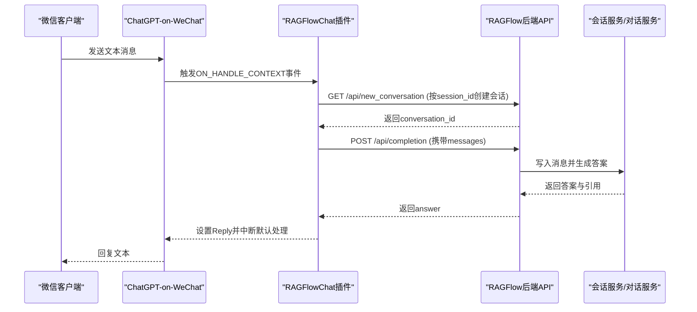
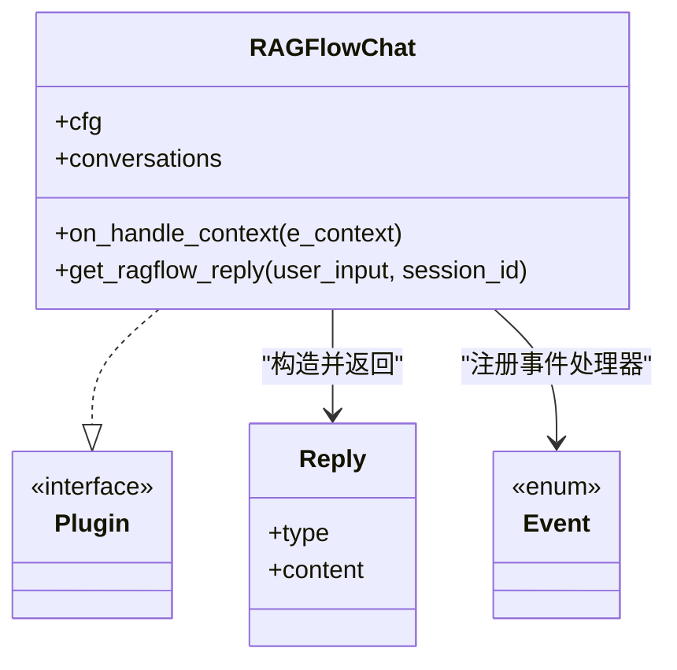
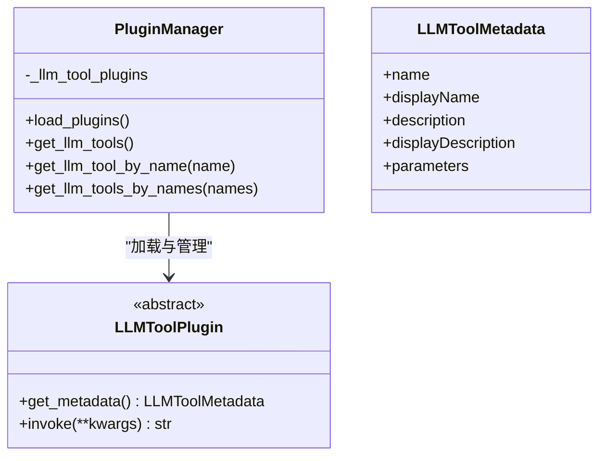
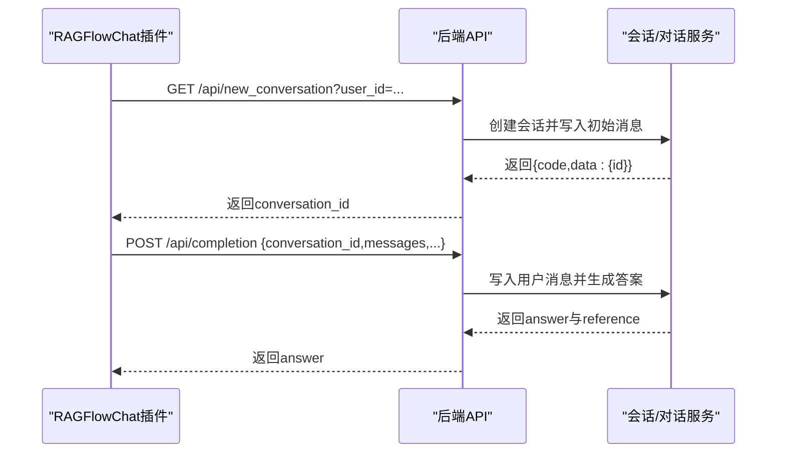
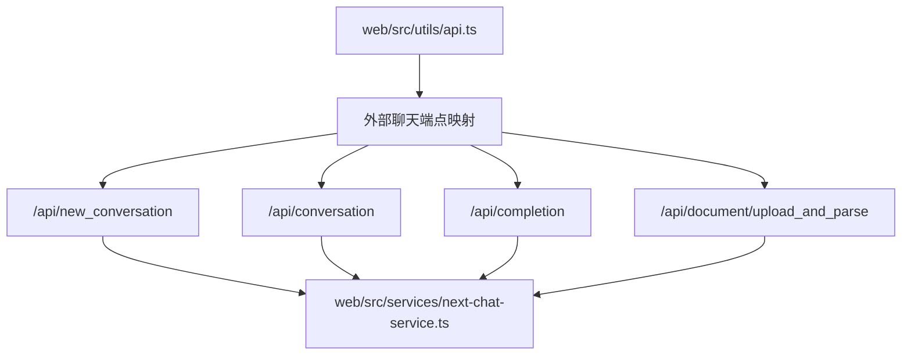
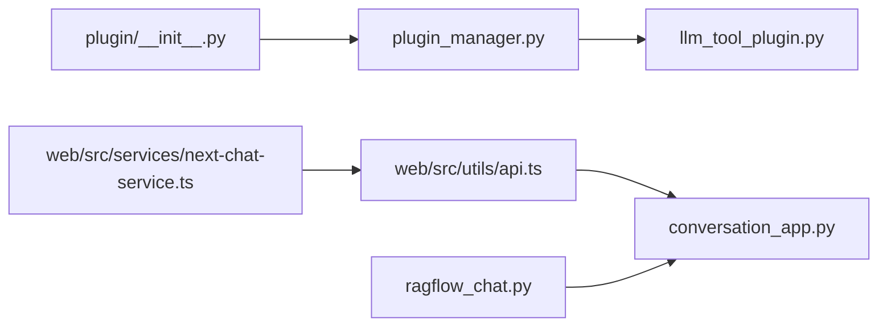
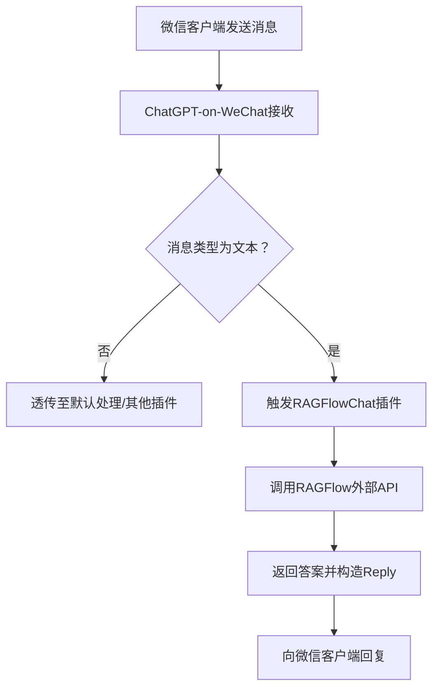

# 微信插件集成

<cite>
**本文引用的文件**
- [intergrations/chatgpt-on-wechat/plugins/ragflow_chat.py](file://intergrations/chatgpt-on-wechat/plugins/ragflow_chat.py)
- [intergrations/chatgpt-on-wechat/plugins/config.json](file://intergrations/chatgpt-on-wechat/plugins/config.json)
- [intergrations/chatgpt-on-wechat/plugins/README.md](file://intergrations/chatgpt-on-wechat/plugins/README.md)
- [plugin/plugin_manager.py](file://plugin/plugin_manager.py)
- [plugin/common.py](file://plugin/common.py)
- [plugin/llm_tool_plugin.py](file://plugin/llm_tool_plugin.py)
- [plugin/__init__.py](file://plugin/__init__.py)
- [api/apps/conversation_app.py](file://api/apps/conversation_app.py)
- [api/db/services/conversation_service.py](file://api/db/services/conversation_service.py)
- [api/apps/plugin_app.py](file://api/apps/plugin_app.py)
- [web/src/utils/api.ts](file://web/src/utils/api.ts)
- [web/src/services/next-chat-service.ts](file://web/src/services/next-chat-service.ts)
</cite>

## 目录
1. [简介](#简介)
2. [项目结构](#项目结构)
3. [核心组件](#核心组件)
4. [架构总览](#架构总览)
5. [详细组件分析](#详细组件分析)
6. [依赖分析](#依赖分析)
7. [性能考虑](#性能考虑)
8. [故障排除指南](#故障排除指南)
9. [结论](#结论)
10. [附录](#附录)

## 简介
本技术文档面向微信插件集成场景，围绕“ChatGPT-on-WeChat + RAGFlow”组合展开，系统性说明插件架构、消息路由、状态管理、RAGFlow聊天插件实现细节（消息处理、上下文管理、响应生成）、配置文件结构与参数、微信平台集成流程、插件开发与定制指南，以及部署与排障建议。读者可据此在微信生态中稳定运行基于RAGFlow的对话插件。

## 项目结构
本仓库包含多条主线：后端API服务、前端Web界面、插件系统、RAGFlow聊天能力、以及与ChatGPT-on-WeChat的集成示例。与微信插件集成直接相关的关键目录与文件如下：
- 插件示例：intergrations/chatgpt-on-wechat/plugins
  - ragflow_chat.py：微信插件核心实现
  - config.json：插件配置（API密钥、主机地址）
  - README.md：插件使用说明与配置要点
- 插件系统：plugin/
  - plugin_manager.py：插件加载与管理
  - llm_tool_plugin.py：LLM工具插件元数据与抽象
  - common.py：插件类型常量
  - __init__.py：全局插件管理器实例
- 后端API与RAGFlow聊天能力：api/apps/conversation_app.py、api/db/services/conversation_service.py
- 前端对接：web/src/utils/api.ts、web/src/services/next-chat-service.ts

图表来源
- [intergrations/chatgpt-on-wechat/plugins/ragflow_chat.py:1-128](file://intergrations/chatgpt-on-wechat/plugins/ragflow_chat.py#L1-128)
- [intergrations/chatgpt-on-wechat/plugins/config.json:1-5](file://intergrations/chatgpt-on-wechat/plugins/config.json#L1-5)
- [intergrations/chatgpt-on-wechat/plugins/README.md:1-58](file://intergrations/chatgpt-on-wechat/plugins/README.md#L1-58)
- [plugin/plugin_manager.py:1-46](file://plugin/plugin_manager.py#L1-46)
- [plugin/llm_tool_plugin.py:1-52](file://plugin/llm_tool_plugin.py#L1-52)
- [plugin/common.py:1-1](file://plugin/common.py#L1-1)
- [plugin/__init__.py:1-4](file://plugin/__init__.py#L1-4)
- [api/apps/conversation_app.py:1-200](file://api/apps/conversation_app.py#L1-200)
- [api/db/services/conversation_service.py:103-223](file://api/db/services/conversation_service.py#L103-L223)
- [api/apps/plugin_app.py:1-31](file://api/apps/plugin_app.py#L1-31)
- [web/src/utils/api.ts:140-316](file://web/src/utils/api.ts#L140-L316)
- [web/src/services/next-chat-service.ts:1-143](file://web/src/services/next-chat-service.ts#L1-L143)

章节来源
- [intergrations/chatgpt-on-wechat/plugins/ragflow_chat.py:1-128](file://intergrations/chatgpt-on-wechat/plugins/ragflow_chat.py#L1-128)
- [intergrations/chatgpt-on-wechat/plugins/config.json:1-5](file://intergrations/chatgpt-on-wechat/plugins/config.json#L1-5)
- [intergrations/chatgpt-on-wechat/plugins/README.md:1-58](file://intergrations/chatgpt-on-wechat/plugins/README.md#L1-58)
- [plugin/plugin_manager.py:1-46](file://plugin/plugin_manager.py#L1-46)
- [plugin/llm_tool_plugin.py:1-52](file://plugin/llm_tool_plugin.py#L1-52)
- [plugin/common.py:1-1](file://plugin/common.py#L1-1)
- [plugin/__init__.py:1-4](file://plugin/__init__.py#L1-4)
- [api/apps/conversation_app.py:1-200](file://api/apps/conversation_app.py#L1-200)
- [api/db/services/conversation_service.py:103-223](file://api/db/services/conversation_service.py#L103-L223)
- [api/apps/plugin_app.py:1-31](file://api/apps/plugin_app.py#L1-31)
- [web/src/utils/api.ts:140-316](file://web/src/utils/api.ts#L140-L316)
- [web/src/services/next-chat-service.ts:1-143](file://web/src/services/next-chat-service.ts#L1-L143)

## 核心组件
- 微信插件（RAGFlowChat）：基于ChatGPT-on-WeChat插件框架，拦截文本消息，调用RAGFlow外部API完成对话并返回结果。
- 插件系统（PluginManager）：负责加载嵌入式插件，暴露LLM工具清单，供上层服务或前端使用。
- 后端聊天API（conversation_app + conversation_service）：提供会话创建、消息写入、流式/非流式回答生成等能力；同时提供外部访问端点（/api/*）以适配微信插件直连。
- 前端API封装（web/src/utils/api.ts + next-chat-service.ts）：统一对外部API的URL映射与调用封装，支持外部聊天端点。

章节来源
- [intergrations/chatgpt-on-wechat/plugins/ragflow_chat.py:24-55](file://intergrations/chatgpt-on-wechat/plugins/ragflow_chat.py#L24-L55)
- [plugin/plugin_manager.py:11-46](file://plugin/plugin_manager.py#L11-L46)
- [api/apps/conversation_app.py:168-205](file://api/apps/conversation_app.py#L168-L205)
- [api/db/services/conversation_service.py:112-196](file://api/db/services/conversation_service.py#L112-L196)
- [web/src/utils/api.ts:140-316](file://web/src/utils/api.ts#L140-L316)
- [web/src/services/next-chat-service.ts:1-143](file://web/src/services/next-chat-service.ts#L1-L143)

## 架构总览
下图展示微信插件与RAGFlow后端的交互路径，以及插件系统与外部API的关系。

图表来源
- [intergrations/chatgpt-on-wechat/plugins/ragflow_chat.py:36-127](file://intergrations/chatgpt-on-wechat/plugins/ragflow_chat.py#L36-L127)
- [api/apps/conversation_app.py:168-205](file://api/apps/conversation_app.py#L168-L205)
- [api/db/services/conversation_service.py:112-196](file://api/db/services/conversation_service.py#L112-L196)
- [web/src/utils/api.ts:140-316](file://web/src/utils/api.ts#L140-L316)

## 详细组件分析

### 组件A：微信插件（RAGFlowChat）
- 职责与流程
  - 初始化时绑定事件处理器，监听上下文事件。
  - 文本消息进入时，提取内容与会话标识，调用RAGFlow外部API。
  - 首次对话通过“新建会话”端点获取conversation_id，并缓存到内存字典中，后续消息复用该ID。
  - 调用“completion”端点获取答案，封装为Reply并中断默认处理逻辑。
- 关键点
  - 仅处理文本消息，其他类型消息透传。
  - 使用Bearer Token进行鉴权，请求头包含Content-Type。
  - 错误处理覆盖缺失配置、HTTP错误码、异常抛出等场景。
- 状态管理
  - 以用户会话ID为键，维护conversation_id的内存缓存，便于跨消息保持上下文。

图表来源
- [intergrations/chatgpt-on-wechat/plugins/ragflow_chat.py:24-55](file://intergrations/chatgpt-on-wechat/plugins/ragflow_chat.py#L24-L55)
- [intergrations/chatgpt-on-wechat/plugins/ragflow_chat.py:56-127](file://intergrations/chatgpt-on-wechat/plugins/ragflow_chat.py#L56-L127)

章节来源
- [intergrations/chatgpt-on-wechat/plugins/ragflow_chat.py:24-55](file://intergrations/chatgpt-on-wechat/plugins/ragflow_chat.py#L24-L55)
- [intergrations/chatgpt-on-wechat/plugins/ragflow_chat.py:56-127](file://intergrations/chatgpt-on-wechat/plugins/ragflow_chat.py#L56-L127)

### 组件B：插件系统（PluginManager 与 LLMToolPlugin）
- 职责与流程
  - PluginManager扫描嵌入式插件目录，加载指定类型的插件（如llm_tools），并记录元数据。
  - 提供查询接口：获取全部工具、按名称获取、按名称列表批量获取。
  - LLMToolPlugin定义工具元数据结构（名称、描述、参数Schema）及抽象调用接口。
- 与外部API的关系
  - 通过/api/apps/plugin_app.py暴露LLM工具清单，供前端或上层服务消费。

图表来源
- [plugin/plugin_manager.py:11-46](file://plugin/plugin_manager.py#L11-L46)
- [plugin/llm_tool_plugin.py:22-52](file://plugin/llm_tool_plugin.py#L22-L52)
- [plugin/common.py:1-1](file://plugin/common.py#L1-1)
- [plugin/__init__.py:1-4](file://plugin/__init__.py#L1-4)
- [api/apps/plugin_app.py:24-31](file://api/apps/plugin_app.py#L24-L31)

章节来源
- [plugin/plugin_manager.py:11-46](file://plugin/plugin_manager.py#L11-L46)
- [plugin/llm_tool_plugin.py:1-52](file://plugin/llm_tool_plugin.py#L1-L52)
- [plugin/common.py:1-1](file://plugin/common.py#L1-1)
- [plugin/__init__.py:1-4](file://plugin/__init__.py#L1-4)
- [api/apps/plugin_app.py:1-31](file://api/apps/plugin_app.py#L1-31)

### 组件C：RAGFlow聊天API（会话与补全）
- 外部端点
  - 新建会话：GET /api/new_conversation
  - 获取会话：GET /api/conversation
  - 补全回答：POST /api/completion
  - 上传解析：POST /api/document/upload_and_parse
- 内部实现要点
  - 会话服务负责消息持久化、引用更新、答案生成。
  - 支持流式与非流式两种模式，内部异步生成并逐步更新会话。
  - 对消息进行过滤与规范化（忽略system消息、首条assistant消息等）。

图表来源
- [intergrations/chatgpt-on-wechat/plugins/ragflow_chat.py:71-127](file://intergrations/chatgpt-on-wechat/plugins/ragflow_chat.py#L71-L127)
- [api/apps/conversation_app.py:168-205](file://api/apps/conversation_app.py#L168-L205)
- [api/db/services/conversation_service.py:112-196](file://api/db/services/conversation_service.py#L112-L196)
- [web/src/utils/api.ts:140-316](file://web/src/utils/api.ts#L140-L316)

章节来源
- [api/apps/conversation_app.py:168-205](file://api/apps/conversation_app.py#L168-L205)
- [api/db/services/conversation_service.py:112-196](file://api/db/services/conversation_service.py#L112-L196)
- [web/src/utils/api.ts:140-316](file://web/src/utils/api.ts#L140-L316)

### 组件D：前端API封装与外部聊天
- 前端对后端API的统一映射，包含外部聊天相关端点：
  - /api/new_conversation
  - /api/conversation
  - /api/completion
  - /api/document/upload_and_parse
- next-chat-service.ts将这些端点注册为可调用的服务方法，供页面逻辑使用。

图表来源
- [web/src/utils/api.ts:140-316](file://web/src/utils/api.ts#L140-L316)
- [web/src/services/next-chat-service.ts:1-143](file://web/src/services/next-chat-service.ts#L1-L143)

章节来源
- [web/src/utils/api.ts:140-316](file://web/src/utils/api.ts#L140-L316)
- [web/src/services/next-chat-service.ts:1-143](file://web/src/services/next-chat-service.ts#L1-L143)

## 依赖分析
- 插件系统与后端API
  - 插件系统通过/api/apps/plugin_app.py暴露LLM工具清单，供上层消费。
  - 微信插件直接调用外部API（/api/*），不依赖插件系统中的嵌入式工具。
- 前后端依赖
  - 前端通过web/src/utils/api.ts集中管理后端API地址，next-chat-service.ts封装具体调用。
  - 后端conversation_app.py与conversation_service.py共同实现会话与回答生成。

图表来源
- [plugin/__init__.py:1-4](file://plugin/__init__.py#L1-4)
- [plugin/plugin_manager.py:11-46](file://plugin/plugin_manager.py#L11-L46)
- [plugin/llm_tool_plugin.py:1-52](file://plugin/llm_tool_plugin.py#L1-L52)
- [web/src/utils/api.ts:140-316](file://web/src/utils/api.ts#L140-L316)
- [web/src/services/next-chat-service.ts:1-143](file://web/src/services/next-chat-service.ts#L1-L143)
- [intergrations/chatgpt-on-wechat/plugins/ragflow_chat.py:24-55](file://intergrations/chatgpt-on-wechat/plugins/ragflow_chat.py#L24-L55)
- [api/apps/conversation_app.py:1-200](file://api/apps/conversation_app.py#L1-200)

章节来源
- [plugin/__init__.py:1-4](file://plugin/__init__.py#L1-4)
- [plugin/plugin_manager.py:11-46](file://plugin/plugin_manager.py#L11-L46)
- [plugin/llm_tool_plugin.py:1-52](file://plugin/llm_tool_plugin.py#L1-L52)
- [web/src/utils/api.ts:140-316](file://web/src/utils/api.ts#L140-L316)
- [web/src/services/next-chat-service.ts:1-143](file://web/src/services/next-chat-service.ts#L1-L143)
- [intergrations/chatgpt-on-wechat/plugins/ragflow_chat.py:24-55](file://intergrations/chatgpt-on-wechat/plugins/ragflow_chat.py#L24-L55)
- [api/apps/conversation_app.py:1-200](file://api/apps/conversation_app.py#L1-200)

## 性能考虑
- 连接与超时
  - 插件使用requests库发起HTTP请求，建议在生产环境配置合理的连接池与超时参数，避免阻塞。
- 会话缓存
  - 插件内以内存字典缓存conversation_id，适合单实例部署；若采用多实例或多进程，需引入共享缓存（如Redis）以保证一致性。
- 流式输出
  - 后端支持流式回答，前端可逐步渲染；插件当前未启用流式，如需低延迟体验，可在插件侧增加对流式响应的处理。
- 并发与限流
  - 对RAGFlow后端的调用应考虑限流与重试策略，避免上游过载导致失败率上升。

## 故障排除指南
- 配置问题
  - 缺失API密钥或主机地址：插件会返回提示信息，请检查插件配置文件与ChatGPT-on-WeChat根配置文件是否正确。
- 连接失败
  - HTTP状态码非200或异常：查看日志中的错误信息，确认RAGFlow服务可达、端口开放、网络策略允许。
- 会话创建失败
  - 后端返回code非0或消息体异常：检查后端会话服务状态、数据库连接、权限校验。
- 消息格式错误
  - 后端要求忽略system消息、首条assistant消息等：确保调用前对消息数组进行规范化处理。
- 日志定位
  - 插件在关键步骤打印调试与错误日志，结合后端服务日志定位问题。

章节来源
- [intergrations/chatgpt-on-wechat/plugins/ragflow_chat.py:62-95](file://intergrations/chatgpt-on-wechat/plugins/ragflow_chat.py#L62-L95)
- [intergrations/chatgpt-on-wechat/plugins/ragflow_chat.py:122-127](file://intergrations/chatgpt-on-wechat/plugins/ragflow_chat.py#L122-L127)
- [api/apps/conversation_app.py:168-205](file://api/apps/conversation_app.py#L168-L205)
- [api/db/services/conversation_service.py:112-196](file://api/db/services/conversation_service.py#L112-L196)

## 结论
本文从架构、组件、流程与配置四个维度梳理了微信插件与RAGFlow的集成方案。RAGFlowChat插件通过外部API实现与RAGFlow后端的无缝对接，结合会话服务与前端封装，形成完整的微信消息处理闭环。建议在生产环境中完善缓存、限流与监控，并遵循本文的配置与排障指引，以获得稳定可靠的微信插件服务。

## 附录

### 插件配置文件结构与参数
- 插件配置（plugins/ragflow_chat/config.json）
  - api_key：用于Bearer鉴权的API密钥
  - host_address：RAGFlow后端主机与端口
- ChatGPT-on-WeChat根配置（示例字段）
  - channel_type：通道类型（如wechatmp）
  - wechatmp_app_id / wechatmp_app_secret / wechatmp_token：公众号相关凭据
  - wechatmp_port：监听端口

章节来源
- [intergrations/chatgpt-on-wechat/plugins/config.json:1-5](file://intergrations/chatgpt-on-wechat/plugins/config.json#L1-5)
- [intergrations/chatgpt-on-wechat/plugins/README.md:14-47](file://intergrations/chatgpt-on-wechat/plugins/README.md#L14-L47)

### 微信平台集成流程（概念示意）

[此图为概念流程，无需图表来源]

### 插件开发与定制指南
- 接口规范
  - 继承插件基类并注册事件处理器（如ON_HANDLE_CONTEXT）。
  - 在事件回调中读取上下文、构造回复、设置事件动作（中断或继续）。
- 扩展开发
  - 参考LLMToolPlugin抽象，定义工具元数据与参数Schema，由插件系统统一暴露。
- 调试方法
  - 开启日志级别，关注HTTP请求/响应与异常堆栈。
  - 使用最小化消息输入复现问题，逐步缩小范围。

章节来源
- [intergrations/chatgpt-on-wechat/plugins/ragflow_chat.py:24-55](file://intergrations/chatgpt-on-wechat/plugins/ragflow_chat.py#L24-L55)
- [plugin/llm_tool_plugin.py:22-52](file://plugin/llm_tool_plugin.py#L22-L52)