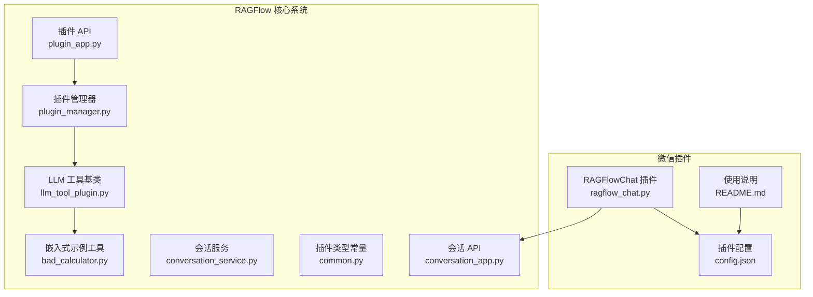
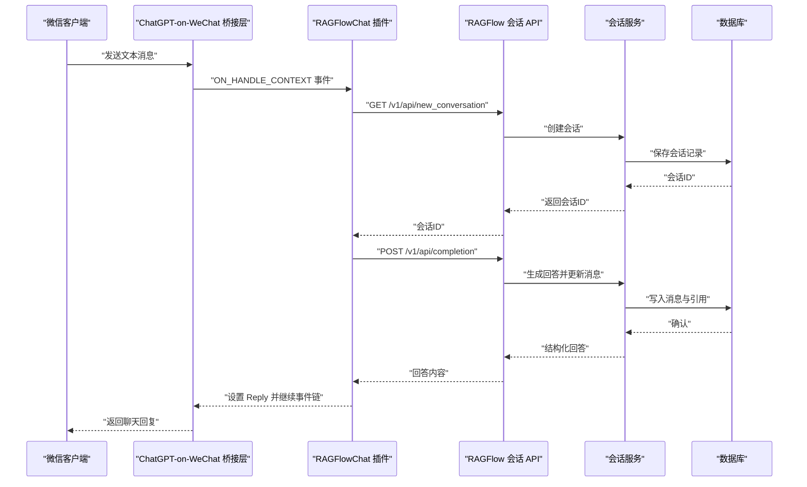
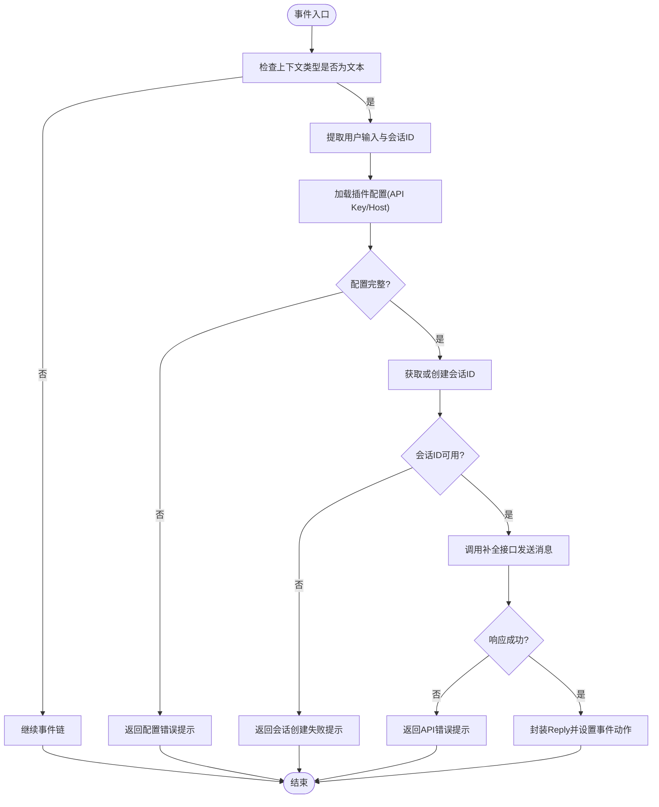
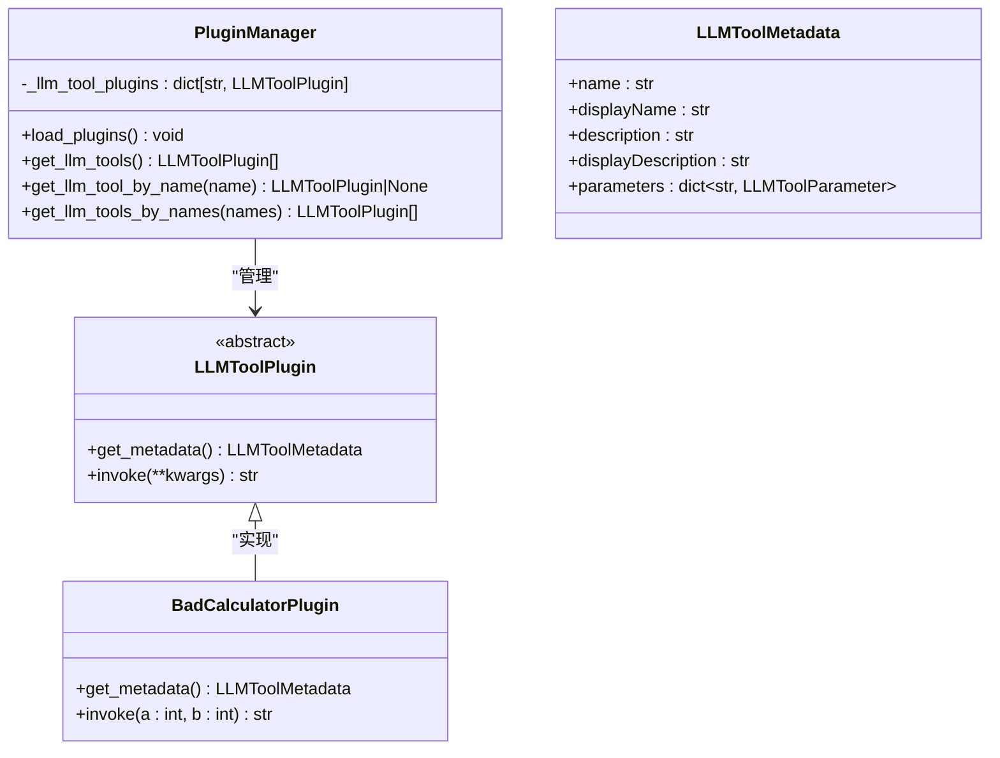
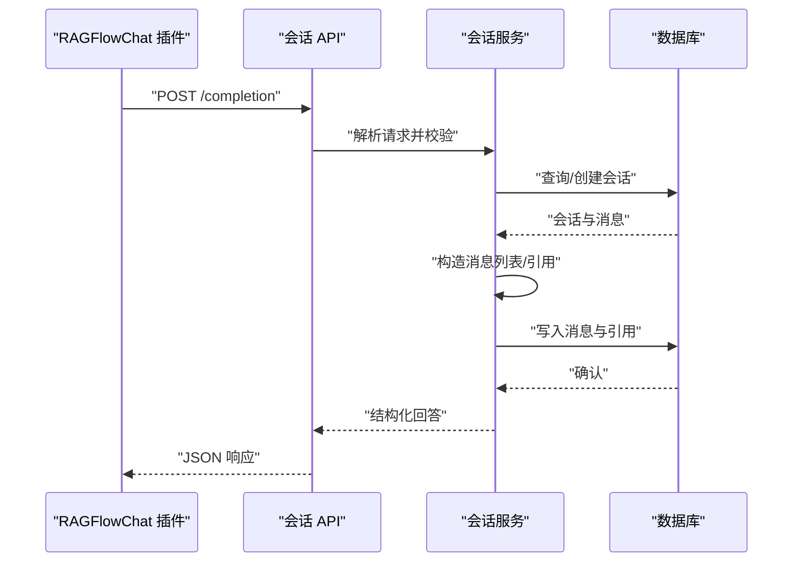
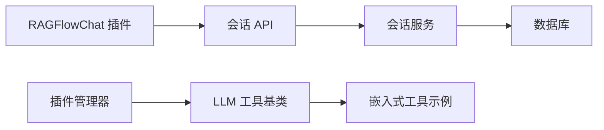

# 插件架构设计

<cite>
**本文引用的文件**
- [ragflow_chat.py](file://intergrations/chatgpt-on-wechat/plugins/ragflow_chat.py)
- [config.json](file://intergrations/chatgpt-on-wechat/plugins/config.json)
- [README.md](file://intergrations/chatgpt-on-wechat/plugins/README.md)
- [__init__.py](file://intergrations/chatgpt-on-wechat/plugins/__init__.py)
- [plugin_app.py](file://api/apps/plugin_app.py)
- [plugin_manager.py](file://plugin/plugin_manager.py)
- [common.py](file://plugin/common.py)
- [llm_tool_plugin.py](file://plugin/llm_tool_plugin.py)
- [bad_calculator.py](file://plugin/embedded_plugins/llm_tools/bad_calculator.py)
- [conversation_app.py](file://api/apps/conversation_app.py)
- [conversation_service.py](file://api/db/services/conversation_service.py)
</cite>

## 目录
1. [简介](#简介)
2. [项目结构](#项目结构)
3. [核心组件](#核心组件)
4. [架构总览](#架构总览)
5. [详细组件分析](#详细组件分析)
6. [依赖关系分析](#依赖关系分析)
7. [性能考量](#性能考量)
8. [故障排查指南](#故障排查指南)
9. [结论](#结论)
10. [附录](#附录)

## 简介
本文件面向“微信插件架构设计”，聚焦于基于 ChatGPT-on-WeChat 的 RAGFlow 聊天插件（RAGFlowChat）在 RAGFlow 核心系统中的集成方式与运行机制。文档从模块化设计、组件交互、生命周期管理、与核心系统的接口适配与数据转换、错误处理等方面进行系统性阐述，并给出最佳实践与扩展建议，帮助开发者理解并优化该插件体系。

## 项目结构
围绕微信插件与 RAGFlow 核心系统的集成，涉及以下关键目录与文件：
- 插件侧：intergrations/chatgpt-on-wechat/plugins
  - RAGFlow 聊天插件实现与配置
- 核心系统侧：api/apps 与 api/db/services
  - 对外 API 与会话服务
- 插件框架侧：plugin
  - 插件管理器、工具插件基类与元数据模型

图表来源
- [ragflow_chat.py:24-128](file://intergrations/chatgpt-on-wechat/plugins/ragflow_chat.py#L24-L128)
- [conversation_app.py:168-205](file://api/apps/conversation_app.py#L168-L205)
- [conversation_service.py:112-196](file://api/db/services/conversation_service.py#L112-L196)
- [plugin_app.py:24-30](file://api/apps/plugin_app.py#L24-L30)
- [plugin_manager.py:11-46](file://plugin/plugin_manager.py#L11-L46)
- [llm_tool_plugin.py:22-52](file://plugin/llm_tool_plugin.py#L22-L52)
- [common.py:1-1](file://plugin/common.py#L1-L1)
- [bad_calculator.py:5-38](file://plugin/embedded_plugins/llm_tools/bad_calculator.py#L5-L38)

章节来源
- [ragflow_chat.py:24-128](file://intergrations/chatgpt-on-wechat/plugins/ragflow_chat.py#L24-L128)
- [conversation_app.py:168-205](file://api/apps/conversation_app.py#L168-L205)
- [conversation_service.py:112-196](file://api/db/services/conversation_service.py#L112-L196)
- [plugin_app.py:24-30](file://api/apps/plugin_app.py#L24-L30)
- [plugin_manager.py:11-46](file://plugin/plugin_manager.py#L11-L46)
- [llm_tool_plugin.py:22-52](file://plugin/llm_tool_plugin.py#L22-L52)
- [common.py:1-1](file://plugin/common.py#L1-L1)
- [bad_calculator.py:5-38](file://plugin/embedded_plugins/llm_tools/bad_calculator.py#L5-L38)

## 核心组件
- 消息处理器（RAGFlowChat）
  - 负责拦截文本消息、调用 RAGFlow API 获取回复、封装为插件回复对象并控制事件流传递。
- 配置管理器（插件配置）
  - 提供 API Key 与主机地址等运行参数，支持插件按用户会话维护对话 ID。
- API 客户端（HTTP 请求）
  - 通过请求库访问 RAGFlow 的会话创建与补全接口，处理响应与异常。
- 插件管理器（核心系统）
  - 加载嵌入式 LLM 工具插件，暴露查询工具元数据的 API。
- LLM 工具基类与元数据
  - 规范工具元数据结构与调用接口，便于统一导出为 OpenAI Function Calling 格式。

章节来源
- [ragflow_chat.py:26-55](file://intergrations/chatgpt-on-wechat/plugins/ragflow_chat.py#L26-L55)
- [config.json:1-5](file://intergrations/chatgpt-on-wechat/plugins/config.json#L1-L5)
- [plugin_manager.py:17-29](file://plugin/plugin_manager.py#L17-L29)
- [llm_tool_plugin.py:22-52](file://plugin/llm_tool_plugin.py#L22-L52)

## 架构总览
RAGFlowChat 插件作为 ChatGPT-on-WeChat 的一个插件，通过事件回调接收用户文本消息，随后调用 RAGFlow 核心系统的会话 API 创建或获取会话，并向补全接口提交消息以获得答案。核心系统负责会话持久化、消息结构化与引用信息组织，并通过统一的 JSON 响应返回结果。

图表来源
- [ragflow_chat.py:36-127](file://intergrations/chatgpt-on-wechat/plugins/ragflow_chat.py#L36-L127)
- [conversation_app.py:168-205](file://api/apps/conversation_app.py#L168-L205)
- [conversation_service.py:112-196](file://api/db/services/conversation_service.py#L112-L196)

## 详细组件分析

### 组件一：消息处理器（RAGFlowChat）
- 职责
  - 监听文本消息事件，提取用户输入与会话标识。
  - 调用 RAGFlow API 创建或获取会话 ID。
  - 发送消息至补全接口，解析返回并封装为插件回复。
  - 控制事件流：成功则中断默认处理，否则继续后续插件或默认逻辑。
- 关键行为
  - 会话缓存：按用户 ID 缓存 conversation_id，避免重复创建。
  - 错误处理：对缺失配置、HTTP 异常、业务错误进行日志记录与友好提示。
- 数据流
  - 输入：上下文文本、会话 ID。
  - 输出：Reply 对象（文本类型），并设置事件动作。

图表来源
- [ragflow_chat.py:36-55](file://intergrations/chatgpt-on-wechat/plugins/ragflow_chat.py#L36-L55)
- [ragflow_chat.py:56-127](file://intergrations/chatgpt-on-wechat/plugins/ragflow_chat.py#L56-L127)

章节来源
- [ragflow_chat.py:26-55](file://intergrations/chatgpt-on-wechat/plugins/ragflow_chat.py#L26-L55)
- [ragflow_chat.py:56-127](file://intergrations/chatgpt-on-wechat/plugins/ragflow_chat.py#L56-L127)

### 组件二：配置管理器（插件配置）
- 职责
  - 提供插件运行所需的认证与目标主机信息。
  - 与插件初始化流程集成，确保后续 API 调用具备必要头信息。
- 使用要点
  - 配置项包含 API Key 与主机地址；需与 README 中的说明保持一致。
  - 插件内部将配置注入到请求头中，采用 Bearer 认证。

章节来源
- [config.json:1-5](file://intergrations/chatgpt-on-wechat/plugins/config.json#L1-L5)
- [README.md:38-49](file://intergrations/chatgpt-on-wechat/plugins/README.md#L38-L49)
- [ragflow_chat.py:58-69](file://intergrations/chatgpt-on-wechat/plugins/ragflow_chat.py#L58-L69)

### 组件三：API 客户端（HTTP 请求）
- 职责
  - 封装对 RAGFlow 会话与补全接口的调用。
  - 处理网络异常、HTTP 状态码与业务错误码，统一返回可读提示。
- 接口契约
  - 新建会话：GET /v1/api/new_conversation（携带 user_id）。
  - 补全回答：POST /v1/api/completion（携带 conversation_id、messages、quote、stream）。
- 返回格式
  - 统一为 JSON，包含 code、message、data 字段；成功时 data 包含 answer 或会话 ID。

章节来源
- [ragflow_chat.py:75-95](file://intergrations/chatgpt-on-wechat/plugins/ragflow_chat.py#L75-L95)
- [ragflow_chat.py:98-127](file://intergrations/chatgpt-on-wechat/plugins/ragflow_chat.py#L98-L127)

### 组件四：插件管理器（核心系统）
- 职责
  - 加载嵌入式 LLM 工具插件，构建工具名称到插件实例的映射。
  - 提供查询工具列表与按名称检索的接口。
- 元数据导出
  - 将工具元数据转换为 OpenAI Function Calling 所需的函数签名格式。

图表来源
- [plugin_manager.py:11-46](file://plugin/plugin_manager.py#L11-L46)
- [llm_tool_plugin.py:22-52](file://plugin/llm_tool_plugin.py#L22-L52)
- [bad_calculator.py:5-38](file://plugin/embedded_plugins/llm_tools/bad_calculator.py#L5-L38)

章节来源
- [plugin_manager.py:11-46](file://plugin/plugin_manager.py#L11-L46)
- [llm_tool_plugin.py:22-52](file://plugin/llm_tool_plugin.py#L22-L52)
- [bad_calculator.py:5-38](file://plugin/embedded_plugins/llm_tools/bad_calculator.py#L5-L38)

### 组件五：核心系统会话 API 与服务
- 会话 API
  - 提供 /completion 接口，接收 conversation_id 与 messages，返回结构化回答。
- 会话服务
  - 负责会话创建、消息追加、引用信息格式化与持久化。
  - 支持流式与非流式两种模式，统一输出 JSON 结构。

图表来源
- [conversation_app.py:168-205](file://api/apps/conversation_app.py#L168-L205)
- [conversation_service.py:112-196](file://api/db/services/conversation_service.py#L112-L196)

章节来源
- [conversation_app.py:168-205](file://api/apps/conversation_app.py#L168-L205)
- [conversation_service.py:112-196](file://api/db/services/conversation_service.py#L112-L196)

## 依赖关系分析
- 插件到核心系统
  - RAGFlowChat 通过 HTTP 直接调用核心系统提供的会话与补全接口。
- 核心系统到数据库
  - 会话服务通过 ORM 操作数据库，维护会话、消息与引用信息。
- 插件框架到工具插件
  - 插件管理器加载嵌入式工具插件，提供统一的元数据查询能力。

图表来源
- [ragflow_chat.py:75-127](file://intergrations/chatgpt-on-wechat/plugins/ragflow_chat.py#L75-L127)
- [conversation_app.py:168-205](file://api/apps/conversation_app.py#L168-L205)
- [conversation_service.py:112-196](file://api/db/services/conversation_service.py#L112-L196)
- [plugin_manager.py:17-29](file://plugin/plugin_manager.py#L17-L29)
- [llm_tool_plugin.py:22-52](file://plugin/llm_tool_plugin.py#L22-L52)
- [bad_calculator.py:5-38](file://plugin/embedded_plugins/llm_tools/bad_calculator.py#L5-L38)

章节来源
- [ragflow_chat.py:75-127](file://intergrations/chatgpt-on-wechat/plugins/ragflow_chat.py#L75-L127)
- [conversation_app.py:168-205](file://api/apps/conversation_app.py#L168-L205)
- [conversation_service.py:112-196](file://api/db/services/conversation_service.py#L112-L196)
- [plugin_manager.py:17-29](file://plugin/plugin_manager.py#L17-L29)
- [llm_tool_plugin.py:22-52](file://plugin/llm_tool_plugin.py#L22-L52)
- [bad_calculator.py:5-38](file://plugin/embedded_plugins/llm_tools/bad_calculator.py#L5-L38)

## 性能考量
- 会话复用
  - 插件侧按用户 ID 缓存 conversation_id，减少重复创建会话的开销。
- 流式输出
  - 核心系统支持流式回答，可降低首字节延迟；插件侧当前未启用流式，可根据需要调整。
- 错误快速失败
  - 配置缺失、HTTP 错误与业务错误均直接返回提示，避免无意义重试。
- 网络与超时
  - 建议在插件侧增加连接与读取超时配置，提升稳定性。

## 故障排查指南
- 常见问题与定位
  - 配置缺失：检查插件配置文件是否包含 API Key 与主机地址。
  - 连接失败：核对主机地址可达性与防火墙策略；关注 HTTP 状态码与异常日志。
  - 业务错误：查看返回 JSON 中的 code 与 message 字段，定位具体原因。
- 日志与可观测性
  - 插件在关键路径打印调试与错误日志，便于快速定位问题。
- 回退策略
  - 当 API 不可用时，插件选择继续事件链，避免阻塞其他插件处理。

章节来源
- [ragflow_chat.py:62-64](file://intergrations/chatgpt-on-wechat/plugins/ragflow_chat.py#L62-L64)
- [ragflow_chat.py:90-95](file://intergrations/chatgpt-on-wechat/plugins/ragflow_chat.py#L90-L95)
- [ragflow_chat.py:123-127](file://intergrations/chatgpt-on-wechat/plugins/ragflow_chat.py#L123-L127)

## 结论
RAGFlowChat 插件通过简洁的事件驱动与 HTTP 接口，实现了与 RAGFlow 核心系统的无缝集成。其模块化设计使得消息处理、配置管理与 API 调用职责清晰，配合核心系统的会话服务与数据库持久化，形成了稳定可靠的对话能力。未来可在流式输出、超时控制与工具生态方面进一步增强。

## 附录
- 最佳实践
  - 明确区分 ChatGPT-on-WeChat 根配置与插件配置，分别用于平台通道与 RAGFlow 通信。
  - 在生产环境为插件配置添加密钥管理与健康检查。
  - 对核心系统接口进行幂等与限流保护，避免突发流量冲击。
- 扩展指南
  - 基于 LLM 工具基类开发新的嵌入式工具，统一元数据与调用协议。
  - 通过插件管理器注册工具，利用现有 API 暴露工具清单。
  - 在插件侧引入重试与熔断策略，提升鲁棒性。