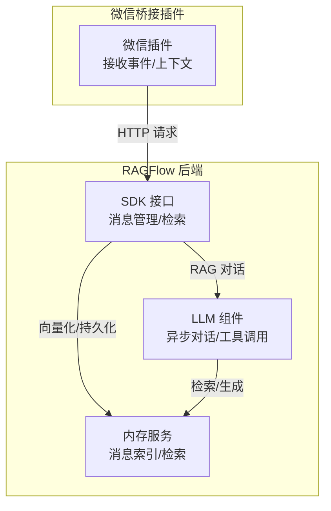
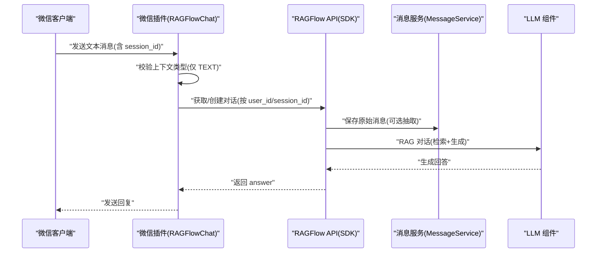
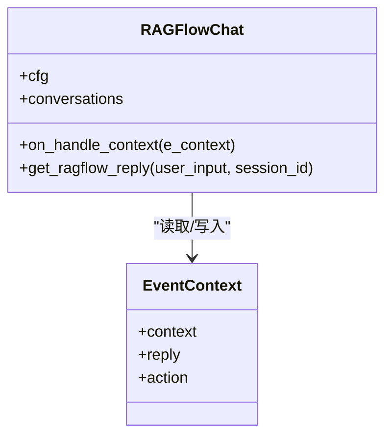
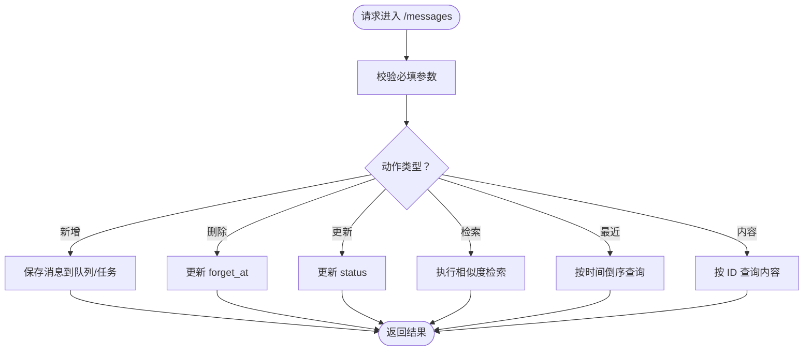
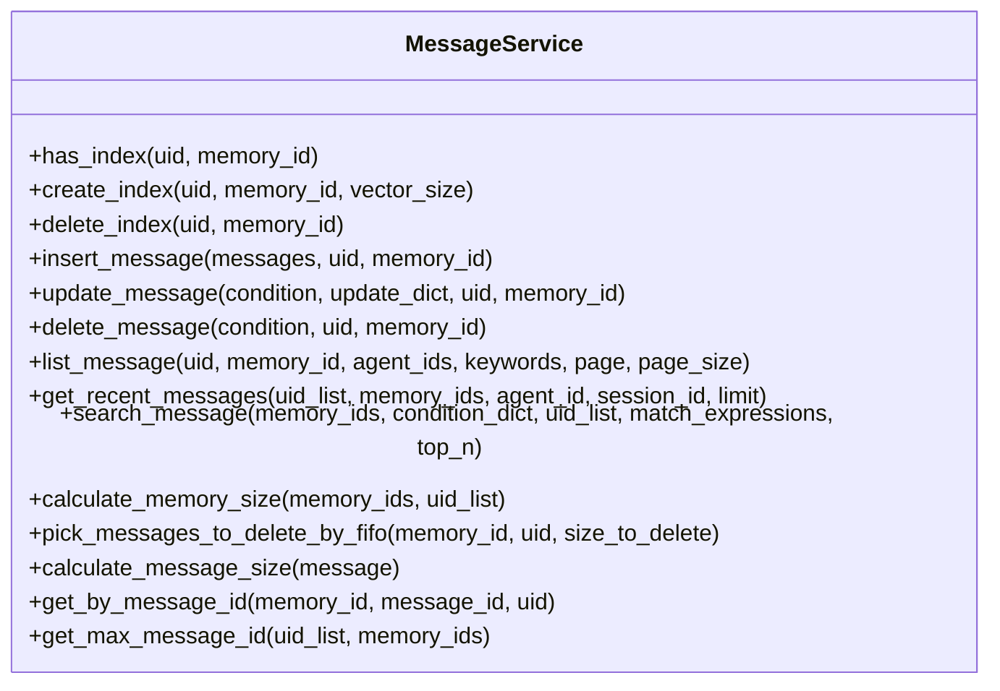
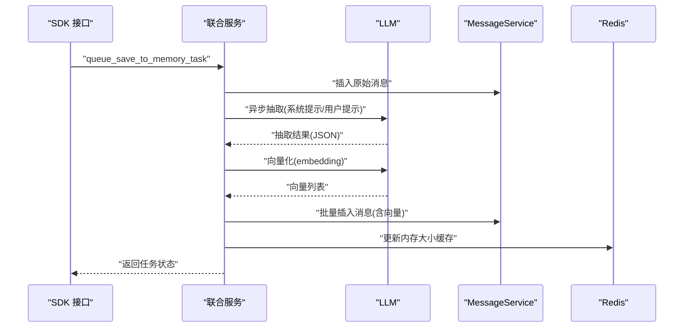
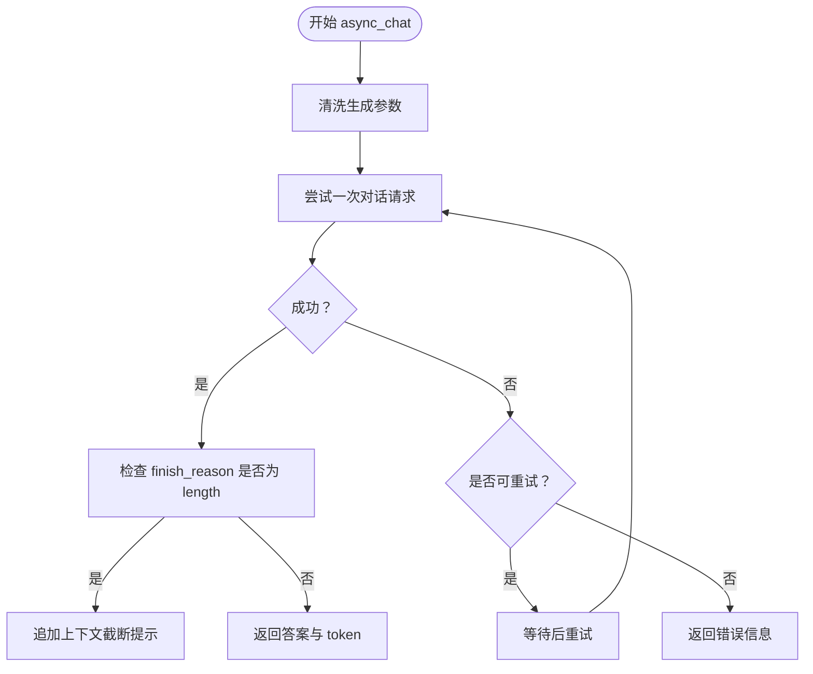
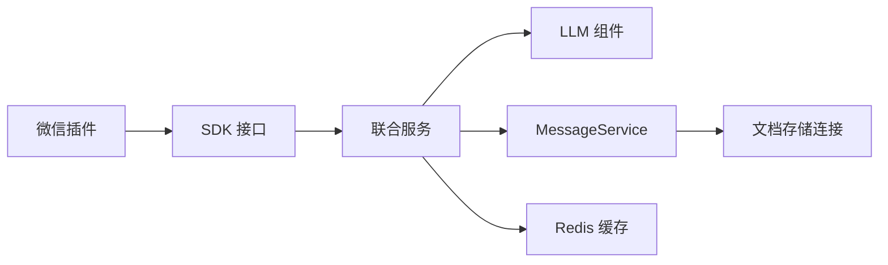

# 消息处理机制

<cite>
**本文引用的文件**
- [ragflow_chat.py](file://intergrations/chatgpt-on-wechat/plugins/ragflow_chat.py)
- [config.json](file://intergrations/chatgpt-on-wechat/plugins/config.json)
- [README.md](file://intergrations/chatgpt-on-wechat/plugins/README.md)
- [messages.py](file://api/apps/sdk/messages.py)
- [messages.py](file://memory/services/messages.py)
- [memory_message_service.py](file://api/db/joint_services/memory_message_service.py)
- [chat.py](file://api/apps/sdk/chat.py)
- [chat_model.py](file://rag/llm/chat_model.py)
</cite>

## 目录
1. [引言](#引言)
2. [项目结构](#项目结构)
3. [核心组件](#核心组件)
4. [架构总览](#架构总览)
5. [详细组件分析](#详细组件分析)
6. [依赖分析](#依赖分析)
7. [性能考虑](#性能考虑)
8. [故障排查指南](#故障排查指南)
9. [结论](#结论)
10. [附录](#附录)

## 引言
本技术文档围绕微信消息处理机制展开，系统性梳理从微信平台接收到的消息在 RAGFlow 中的接收、解析、路由、存储与响应全流程。重点覆盖：
- 文本消息、图片消息、语音消息等多模态消息的处理路径（以文本消息为主，其他类型通过桥接插件扩展）
- 消息上下文管理：会话状态维护、历史消息缓存、用户状态跟踪
- 消息过滤与预处理：敏感词过滤、格式标准化、内容验证
- 与 RAGFlow 聊天助手的集成：消息转发、响应生成、结果回传
- 性能优化策略与错误处理机制，保障稳定性与可靠性

## 项目结构
与微信消息处理直接相关的核心位置如下：
- 插件层：微信桥接插件，负责接收微信事件、提取用户输入、调用 RAGFlow API 并返回回复
- API 层：SDK 接口，提供消息增删改查、检索与最近消息查询
- 内存服务层：消息向量化索引、插入、更新、删除、检索与容量管理
- LLM 层：统一的异步对话接口与工具调用能力，支撑 RAGFlow 的问答与记忆抽取

图表来源
- [ragflow_chat.py:36-128](file://intergrations/chatgpt-on-wechat/plugins/ragflow_chat.py#L36-L128)
- [messages.py:27-159](file://api/apps/sdk/messages.py#L27-L159)
- [messages.py:27-295](file://memory/services/messages.py#L27-L295)
- [memory_message_service.py:38-439](file://api/db/joint_services/memory_message_service.py#L38-L439)
- [chat_model.py:484-496](file://rag/llm/chat_model.py#L484-L496)

章节来源
- [ragflow_chat.py:24-128](file://intergrations/chatgpt-on-wechat/plugins/ragflow_chat.py#L24-L128)
- [messages.py:27-159](file://api/apps/sdk/messages.py#L27-L159)
- [messages.py:27-295](file://memory/services/messages.py#L27-L295)
- [memory_message_service.py:38-439](file://api/db/joint_services/memory_message_service.py#L38-L439)
- [chat_model.py:484-496](file://rag/llm/chat_model.py#L484-L496)

## 核心组件
- 微信桥接插件（RAGFlowChat）：监听微信上下文事件，仅处理文本消息；根据会话 ID 获取或创建对话，调用 RAGFlow API 获取答案并回写回复
- SDK 消息接口：提供消息新增、删除、更新、检索、最近消息查询等能力
- 内存服务：负责消息向量化索引的创建与查询、消息插入/更新/删除、容量控制与 FIFO 清理策略
- LLM 组件：统一异步对话接口，支持流式输出、工具调用、重试与错误分类

章节来源
- [ragflow_chat.py:24-128](file://intergrations/chatgpt-on-wechat/plugins/ragflow_chat.py#L24-L128)
- [messages.py:27-159](file://api/apps/sdk/messages.py#L27-L159)
- [messages.py:27-295](file://memory/services/messages.py#L27-L295)
- [memory_message_service.py:38-439](file://api/db/joint_services/memory_message_service.py#L38-L439)
- [chat_model.py:484-496](file://rag/llm/chat_model.py#L484-L496)

## 架构总览
微信消息处理的整体流程如下：

图表来源
- [ragflow_chat.py:36-128](file://intergrations/chatgpt-on-wechat/plugins/ragflow_chat.py#L36-L128)
- [messages.py:45-91](file://memory/services/messages.py#L45-L91)
- [memory_message_service.py:38-91](file://api/db/joint_services/memory_message_service.py#L38-L91)
- [chat_model.py:484-496](file://rag/llm/chat_model.py#L484-L496)

## 详细组件分析

### 组件一：微信桥接插件（RAGFlowChat）
职责与行为：
- 注册事件处理器，监听 ON_HANDLE_CONTEXT 事件
- 仅处理 ContextType.TEXT 类型消息
- 使用 session_id 作为 user_id，维护每个用户的 conversation_id 映射
- 调用 RAGFlow API：
  - 新建对话：GET /v1/api/new_conversation
  - 发送消息并获取回答：POST /v1/api/completion
- 将回答封装为 Reply(TEXT)，写入 e_context['reply']，中断默认处理逻辑

图表来源
- [ragflow_chat.py:24-128](file://intergrations/chatgpt-on-wechat/plugins/ragflow_chat.py#L24-L128)

章节来源
- [ragflow_chat.py:24-128](file://intergrations/chatgpt-on-wechat/plugins/ragflow_chat.py#L24-L128)
- [config.json:1-5](file://intergrations/chatgpt-on-wechat/plugins/config.json#L1-L5)
- [README.md:1-58](file://intergrations/chatgpt-on-wechat/plugins/README.md#L1-L58)

### 组件二：SDK 消息接口
功能点：
- 新增消息：/messages（POST），入参包含 memory_id、agent_id、session_id、user_input、agent_response
- 删除消息：/messages/{memory_id}:{message_id}（DELETE），标记 forget_at
- 更新消息状态：/messages/{memory_id}:{message_id}（PUT），布尔 status
- 检索消息：/messages/search（GET），支持相似度阈值、关键词权重、top_n 等参数
- 最近消息：/messages（GET），按 limit 返回最近消息
- 获取消息内容：/messages/{memory_id}:{message_id}/content（GET）

图表来源
- [messages.py:27-159](file://api/apps/sdk/messages.py#L27-L159)

章节来源
- [messages.py:27-159](file://api/apps/sdk/messages.py#L27-L159)

### 组件三：内存服务（MessageService）
职责与能力：
- 索引管理：has_index/create_index/delete_index
- 消息 CRUD：insert_message/update_message/delete_message/get_by_message_id
- 列表与检索：list_message/get_recent_messages/search_message
- 容量与清理：calculate_memory_size/pick_messages_to_delete_by_fifo
- 其他：计算消息大小、最大 message_id 等

图表来源
- [messages.py:27-295](file://memory/services/messages.py#L27-L295)

章节来源
- [messages.py:27-295](file://memory/services/messages.py#L27-L295)

### 组件四：消息联合服务（memory_message_service）
职责与流程：
- 提取与嵌入：基于 LLM 抽取结构化记忆，生成向量并保存
- 队列与任务：将消息保存包装为任务，异步执行抽取与嵌入
- 检索融合：结合稠密向量与关键词检索，加权融合
- 缓存与容量控制：Redis 缓存内存大小，超过阈值按 FIFO 清理

图表来源
- [memory_message_service.py:332-439](file://api/db/joint_services/memory_message_service.py#L332-L439)
- [memory_message_service.py:172-214](file://api/db/joint_services/memory_message_service.py#L172-L214)
- [memory_message_service.py:217-248](file://api/db/joint_services/memory_message_service.py#L217-L248)

章节来源
- [memory_message_service.py:38-439](file://api/db/joint_services/memory_message_service.py#L38-L439)

### 组件五：LLM 组件（异步对话与工具调用）
能力概述：
- 统一异步对话接口 async_chat/async_chat_streamly
- 错误分类与指数退避重试
- 工具调用链路（含流式工具调用）
- 上下文长度截断提示

图表来源
- [chat_model.py:484-496](file://rag/llm/chat_model.py#L484-L496)
- [chat_model.py:184-206](file://rag/llm/chat_model.py#L184-L206)

章节来源
- [chat_model.py:484-496](file://rag/llm/chat_model.py#L484-L496)
- [chat_model.py:184-206](file://rag/llm/chat_model.py#L184-L206)

## 依赖分析
- 插件依赖微信桥接框架（Context/Reply/Event），通过注册事件钩子接入
- SDK 消息接口依赖内存服务与联合服务，完成消息持久化与检索
- 联合服务依赖 LLM 组件进行抽取与向量化，依赖 Redis 进行容量缓存
- 内存服务依赖底层文档存储连接（索引/查询/更新/删除）

图表来源
- [ragflow_chat.py:36-128](file://intergrations/chatgpt-on-wechat/plugins/ragflow_chat.py#L36-L128)
- [messages.py:27-159](file://api/apps/sdk/messages.py#L27-L159)
- [memory_message_service.py:38-439](file://api/db/joint_services/memory_message_service.py#L38-L439)
- [messages.py:27-295](file://memory/services/messages.py#L27-L295)

章节来源
- [ragflow_chat.py:36-128](file://intergrations/chatgpt-on-wechat/plugins/ragflow_chat.py#L36-L128)
- [messages.py:27-159](file://api/apps/sdk/messages.py#L27-L159)
- [memory_message_service.py:38-439](file://api/db/joint_services/memory_message_service.py#L38-L439)
- [messages.py:27-295](file://memory/services/messages.py#L27-L295)

## 性能考虑
- 异步与流式：LLM 组件支持异步与流式输出，降低首字节延迟
- 重试与退避：内置错误分类与指数退避，提升网络抖动下的成功率
- 向量化与检索：联合服务对抽取内容进行向量化并建立索引，检索时融合稠密与关键词
- 容量控制：基于 FIFO 的容量淘汰策略，避免内存无限增长
- 缓存：Redis 缓存内存大小，减少重复统计开销

章节来源
- [chat_model.py:184-206](file://rag/llm/chat_model.py#L184-L206)
- [memory_message_service.py:172-214](file://api/db/joint_services/memory_message_service.py#L172-L214)
- [messages.py:212-248](file://memory/services/messages.py#L212-L248)

## 故障排查指南
常见问题与定位建议：
- 插件配置缺失：确认 api_key 与 host_address 是否正确
- 对话创建失败：检查 HTTP 状态码与返回 message 字段
- 回答为空或异常：查看 LLM 错误分类与重试日志
- 检索结果不理想：调整相似度阈值与关键词权重
- 内存容量不足：检查 FIFO 清理是否生效，必要时增大阈值或优化抽取粒度

章节来源
- [ragflow_chat.py:56-128](file://intergrations/chatgpt-on-wechat/plugins/ragflow_chat.py#L56-L128)
- [chat_model.py:91-110](file://rag/llm/chat_model.py#L91-L110)
- [memory_message_service.py:192-203](file://api/db/joint_services/memory_message_service.py#L192-L203)

## 结论
该消息处理机制以微信桥接插件为核心入口，结合 SDK 消息接口、内存服务与 LLM 组件，形成“接收—解析—路由—存储—检索—生成—回传”的闭环。通过异步与流式、重试与错误分类、容量控制与缓存等手段，确保在多模态消息场景下的稳定性与性能。

## 附录
- 多模态扩展建议：图片/语音消息可通过微信插件扩展为多媒体上下文，再由联合服务进行 OCR/ASR 抽取与向量化
- 敏感词过滤：可在消息入库前增加内容校验与过滤步骤，结合黑名单与正则规则
- 格式标准化：统一消息字段命名与时间戳格式，便于检索与展示
- 用户状态跟踪：利用 session_id 与 user_id 维护用户画像与偏好，增强个性化检索