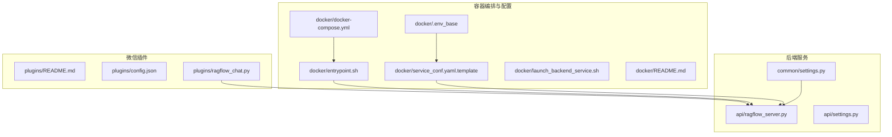
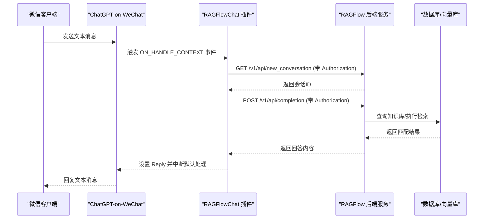
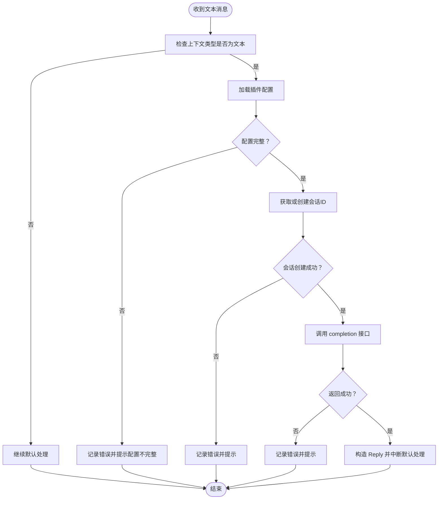
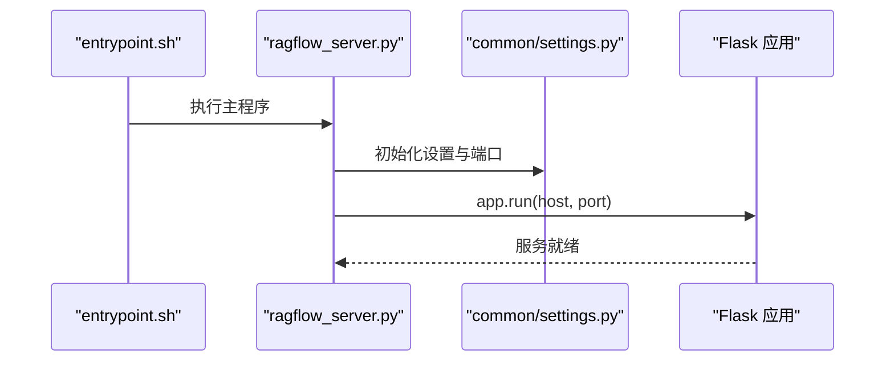
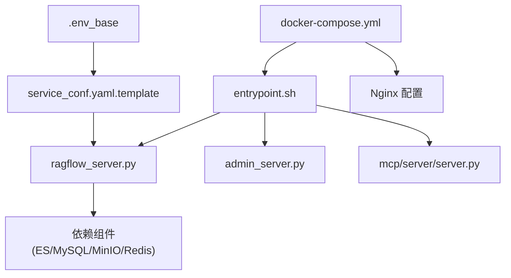
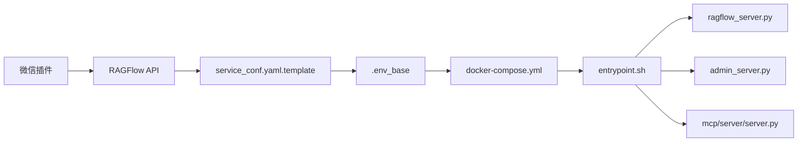

# 部署指南

<cite>
**本文引用的文件**
- [intergrations/chatgpt-on-wechat/plugins/README.md](file://intergrations/chatgpt-on-wechat/plugins/README.md)
- [intergrations/chatgpt-on-wechat/plugins/config.json](file://intergrations/chatgpt-on-wechat/plugins/config.json)
- [intergrations/chatgpt-on-wechat/plugins/ragflow_chat.py](file://intergrations/chatgpt-on-wechat/plugins/ragflow_chat.py)
- [docker/docker-compose.yml](file://docker/docker-compose.yml)
- [docker/README.md](file://docker/README.md)
- [docker/.env_base](file://docker/.env_base)
- [docker/service_conf.yaml.template](file://docker/service_conf.yaml.template)
- [docker/entrypoint.sh](file://docker/entrypoint.sh)
- [docker/launch_backend_service.sh](file://docker/launch_backend_service.sh)
- [api/ragflow_server.py](file://api/ragflow_server.py)
- [common/settings.py](file://common/settings.py)
- [api/settings.py](file://api/settings.py)
</cite>

## 目录
1. [简介](#简介)
2. [项目结构](#项目结构)
3. [核心组件](#核心组件)
4. [架构总览](#架构总览)
5. [详细组件分析](#详细组件分析)
6. [依赖关系分析](#依赖关系分析)
7. [性能考虑](#性能考虑)
8. [故障排查指南](#故障排查指南)
9. [结论](#结论)
10. [附录](#附录)

## 简介
本指南面向需要在多环境下部署“微信插件（基于 ChatGPT-on-WeChat）”与 RAGFlow 后端服务的工程团队，提供从环境准备、依赖安装、配置设置到服务启动的完整流程；并覆盖本地开发、测试、生产三类环境的差异化配置要点；同时给出微信平台接入（公众号/服务号）的配置与安全校验说明，以及常见部署问题排查、监控与日志配置建议、一键与自动化部署脚本使用方法。

## 项目结构
围绕微信插件与后端服务的部署，涉及以下关键目录与文件：
- 微信插件：位于 intergrations/chatgpt-on-wechat/plugins，包含插件源码与配置示例
- 后端服务：位于 api 与 docker 目录，包含服务入口、Docker 编排与环境变量模板
- 配置模板：位于 docker/service_conf.yaml.template 与 .env_base，用于生成运行时配置

**图示来源**
- [intergrations/chatgpt-on-wechat/plugins/ragflow_chat.py:1-128](file://intergrations/chatgpt-on-wechat/plugins/ragflow_chat.py#L1-L128)
- [api/ragflow_server.py:1-157](file://api/ragflow_server.py#L1-L157)
- [docker/docker-compose.yml:1-133](file://docker/docker-compose.yml#L1-L133)
- [docker/.env_base:1-280](file://docker/.env_base#L1-L280)
- [docker/service_conf.yaml.template:1-200](file://docker/service_conf.yaml.template#L1-L200)
- [docker/entrypoint.sh:1-273](file://docker/entrypoint.sh#L1-L273)
- [docker/launch_backend_service.sh:1-130](file://docker/launch_backend_service.sh#L1-L130)
- [docker/README.md:1-271](file://docker/README.md#L1-L271)

**章节来源**
- [docker/docker-compose.yml:1-133](file://docker/docker-compose.yml#L1-L133)
- [docker/README.md:1-271](file://docker/README.md#L1-L271)

## 核心组件
- 微信插件（RAGFlowChat）
  - 负责拦截文本消息、调用 RAGFlow API 获取回复、回传给 ChatGPT-on-WeChat 框架
  - 关键行为：创建会话、发送消息、解析返回结果、错误处理
- RAGFlow 后端服务
  - 通过 api/ragflow_server.py 启动 HTTP 服务，加载运行时配置与插件
  - 读取 common/settings.py 中的主机与端口、认证与存储等全局设置
- 容器化编排
  - 使用 docker-compose.yml 组合 Nginx、RAGFlow 服务、Admin/MCP 服务与依赖组件
  - 通过 .env_base 与 service_conf.yaml.template 注入环境变量与服务配置

**章节来源**
- [intergrations/chatgpt-on-wechat/plugins/ragflow_chat.py:24-128](file://intergrations/chatgpt-on-wechat/plugins/ragflow_chat.py#L24-L128)
- [api/ragflow_server.py:76-157](file://api/ragflow_server.py#L76-L157)
- [common/settings.py:225-231](file://common/settings.py#L225-L231)
- [docker/docker-compose.yml:1-133](file://docker/docker-compose.yml#L1-L133)
- [docker/service_conf.yaml.template:1-200](file://docker/service_conf.yaml.template#L1-L200)
- [docker/.env_base:148-157](file://docker/.env_base#L148-L157)

## 架构总览
下图展示微信插件与 RAGFlow 后端服务在容器中的交互关系与数据流：

**图示来源**
- [intergrations/chatgpt-on-wechat/plugins/ragflow_chat.py:36-128](file://intergrations/chatgpt-on-wechat/plugins/ragflow_chat.py#L36-L128)
- [api/ragflow_server.py:148-157](file://api/ragflow_server.py#L148-L157)

## 详细组件分析

### 微信插件（RAGFlowChat）
- 初始化与事件绑定
  - 加载配置、注册事件处理器（ON_HANDLE_CONTEXT），维护每个用户的会话映射
- 请求流程
  - 创建会话：调用 /v1/api/new_conversation 获取 conversation_id
  - 发送消息：调用 /v1/api/completion，携带 user 内容与 quote/stream 参数
  - 错误处理：对缺失配置、HTTP 错误、异常进行日志记录与友好提示
- 配置项
  - api_key：用于鉴权
  - host_address：RAGFlow 服务地址（如 127.0.0.1:9380）

**图示来源**
- [intergrations/chatgpt-on-wechat/plugins/ragflow_chat.py:36-128](file://intergrations/chatgpt-on-wechat/plugins/ragflow_chat.py#L36-L128)

**章节来源**
- [intergrations/chatgpt-on-wechat/plugins/README.md:1-58](file://intergrations/chatgpt-on-wechat/plugins/README.md#L1-L58)
- [intergrations/chatgpt-on-wechat/plugins/config.json:1-5](file://intergrations/chatgpt-on-wechat/plugins/config.json#L1-L5)
- [intergrations/chatgpt-on-wechat/plugins/ragflow_chat.py:24-128](file://intergrations/chatgpt-on-wechat/plugins/ragflow_chat.py#L24-L128)

### RAGFlow 后端服务（api/ragflow_server.py）
- 启动流程
  - 初始化日志、版本、基础配置与数据库表结构
  - 加载运行时配置与插件管理器
  - 启动 HTTP 服务（监听 HOST_IP 与 HOST_PORT）
- 进程管理
  - 提供信号处理（SIGINT/SIGTERM）以优雅关闭
  - 后台线程定期更新进度
- 配置来源
  - HOST_IP/HOST_PORT 来自 common/settings.py 的 get_base_config

**图示来源**
- [docker/entrypoint.sh:220-230](file://docker/entrypoint.sh#L220-L230)
- [api/ragflow_server.py:148-157](file://api/ragflow_server.py#L148-L157)
- [common/settings.py:225-231](file://common/settings.py#L225-L231)

**章节来源**
- [api/ragflow_server.py:76-157](file://api/ragflow_server.py#L76-L157)
- [common/settings.py:225-231](file://common/settings.py#L225-L231)

### 容器编排与配置（docker-compose 与模板）
- docker-compose.yml
  - 暴露 Web(HTTP/HTTPS)、API、Admin、MCP 端口
  - 挂载 Nginx 配置、日志目录、配置模板与启动脚本
  - 支持 GPU/CPU 两种 profiles
- .env_base
  - 定义各组件端口、镜像版本、时区、最大文件大小、批量参数等
  - 包含 Elasticsearch/OpenSearch/Infinity/OceanBase/SeekDB 等文档引擎选择
- service_conf.yaml.template
  - 定义 ragflow/admin 服务主机与端口、MySQL/MinIO/Redis 等连接参数
  - 可通过环境变量注入（如 TEI 嵌入服务地址）

**图示来源**
- [docker/docker-compose.yml:1-133](file://docker/docker-compose.yml#L1-L133)
- [docker/.env_base:148-157](file://docker/.env_base#L148-L157)
- [docker/service_conf.yaml.template:1-200](file://docker/service_conf.yaml.template#L1-L200)
- [docker/entrypoint.sh:220-273](file://docker/entrypoint.sh#L220-L273)

**章节来源**
- [docker/docker-compose.yml:1-133](file://docker/docker-compose.yml#L1-L133)
- [docker/README.md:200-271](file://docker/README.md#L200-L271)
- [docker/.env_base:1-280](file://docker/.env_base#L1-L280)
- [docker/service_conf.yaml.template:1-200](file://docker/service_conf.yaml.template#L1-L200)

## 依赖关系分析
- 微信插件依赖 RAGFlow 后端提供的会话创建与问答接口
- 后端服务依赖容器内配置（来自 service_conf.yaml.template 与 .env_base）
- entrypoint.sh 负责根据命令行参数启用/禁用组件，并启动对应进程
- launch_backend_service.sh 提供非容器场景下的后端服务启动与重试逻辑

**图示来源**
- [intergrations/chatgpt-on-wechat/plugins/ragflow_chat.py:75-127](file://intergrations/chatgpt-on-wechat/plugins/ragflow_chat.py#L75-L127)
- [docker/service_conf.yaml.template:1-200](file://docker/service_conf.yaml.template#L1-L200)
- [docker/.env_base:148-157](file://docker/.env_base#L148-L157)
- [docker/docker-compose.yml:1-133](file://docker/docker-compose.yml#L1-L133)
- [docker/entrypoint.sh:220-273](file://docker/entrypoint.sh#L220-L273)

**章节来源**
- [docker/launch_backend_service.sh:70-130](file://docker/launch_backend_service.sh#L70-L130)

## 性能考虑
- 批处理与并发
  - DOC_BULK_SIZE、EMBEDDING_BATCH_SIZE 控制文档分块与嵌入批大小
  - TEI 模型与资源限制影响推理吞吐
- 存储与索引
  - 文档引擎选择（Elasticsearch/OpenSearch/Infinity/OceanBase/SeekDB）影响查询性能
- 端口与网络
  - 确保宿主机与容器端口映射一致，避免反向代理层阻塞
- 日志与可观测性
  - 启用 DEBUG/更细粒度日志级别，结合容器日志收集与指标导出

[本节为通用指导，无需列出具体文件来源]

## 故障排查指南
- 端口冲突
  - 症状：服务无法启动或 Nginx 报错
  - 处理：修改 .env_base 中的 SVR_WEB_HTTP_PORT、SVR_WEB_HTTPS_PORT、SVR_HTTP_PORT 等映射端口
- 权限问题
  - 症状：容器内写入失败或挂载目录不可访问
  - 处理：确认挂载路径权限与 SELinux/AppArmor 配置；确保日志目录可写
- 网络连接
  - 症状：微信插件无法访问 RAGFlow API 或 API 无法连接依赖组件
  - 处理：检查容器网络、service_conf.yaml.template 中的主机名与端口、防火墙策略
- 认证失败
  - 症状：微信插件返回鉴权错误
  - 处理：核对 plugins/config.json 中的 api_key 与 host_address；确认后端未开启强制鉴权但前端未正确传递
- HTTPS 证书
  - 症状：浏览器提示证书不受信任或 Nginx 加载失败
  - 处理：按 docker/README.md 的 HTTPS 步骤替换证书与配置文件，确保域名解析与端口开放

**章节来源**
- [docker/README.md:200-271](file://docker/README.md#L200-L271)
- [intergrations/chatgpt-on-wechat/plugins/README.md:1-58](file://intergrations/chatgpt-on-wechat/plugins/README.md#L1-L58)

## 结论
通过统一的容器编排与配置模板，RAGFlow 后端服务可在本地、测试与生产环境快速部署；配合微信插件，可实现基于检索增强生成的知识问答能力。建议在生产环境启用 HTTPS、完善密钥与证书管理、配置监控与日志采集，并结合本文提供的故障排查清单与性能优化建议，构建稳定可靠的运维体系。

[本节为总结性内容，无需列出具体文件来源]

## 附录

### 环境准备与依赖安装
- 容器环境
  - 安装 Docker 与 Docker Compose，拉取镜像并按需切换 profiles（CPU/GPU）
- 非容器环境
  - 使用 docker/launch_backend_service.sh 启动后端服务，注意依赖库与 Python 环境

**章节来源**
- [docker/README.md:13-22](file://docker/README.md#L13-L22)
- [docker/launch_backend_service.sh:1-130](file://docker/launch_backend_service.sh#L1-L130)

### 不同部署环境的配置方法
- 本地开发
  - 使用默认端口映射与日志级别；可启用 DEBUG 模式观察初始化过程
- 测试环境
  - 调整 DOC_BULK_SIZE、EMBEDDING_BATCH_SIZE 以适配测试数据规模
- 生产环境
  - 启用 HTTPS、设置强密码、限制暴露端口、启用加密存储与审计日志

**章节来源**
- [docker/.env_base:214-221](file://docker/.env_base#L214-L221)
- [docker/README.md:200-271](file://docker/README.md#L200-L271)

### 微信平台接入配置
- 公众号/服务号
  - 在 README 中参考 wechatmp 类型的配置项，设置 channel_type、AppID、AppSecret、Token、端口等
- 服务器配置与安全验证
  - 确保服务器域名与 Token 校验通过；按 README 的 HTTPS 步骤配置证书与 Nginx
- 插件配置
  - 在 plugins/config.json 中填写 api_key 与 host_address，指向已部署的 RAGFlow 实例

**章节来源**
- [intergrations/chatgpt-on-wechat/plugins/README.md:14-58](file://intergrations/chatgpt-on-wechat/plugins/README.md#L14-L58)
- [intergrations/chatgpt-on-wechat/plugins/config.json:1-5](file://intergrations/chatgpt-on-wechat/plugins/config.json#L1-L5)

### 监控与日志配置
- 日志
  - 通过 entrypoint.sh 启动的服务会持续重启失败进程；结合容器日志查看详细堆栈
- 指标
  - 可在 docker-compose.yml 中启用 Prometheus 导出（按注释说明），并结合 Nginx/应用日志进行聚合

**章节来源**
- [docker/docker-compose.yml:48-51](file://docker/docker-compose.yml#L48-L51)
- [docker/entrypoint.sh:220-273](file://docker/entrypoint.sh#L220-L273)

### 一键部署与自动化部署
- Docker Compose
  - 使用 docker-compose.yml 一键启动所有服务与依赖；通过 .env_base 调整端口与镜像版本
- 自定义脚本
  - 可基于 docker/launch_backend_service.sh 与 docker/entrypoint.sh 封装自动化启动流程，支持参数化启停组件

**章节来源**
- [docker/docker-compose.yml:1-133](file://docker/docker-compose.yml#L1-L133)
- [docker/launch_backend_service.sh:70-130](file://docker/launch_backend_service.sh#L70-L130)
- [docker/entrypoint.sh:66-149](file://docker/entrypoint.sh#L66-L149)