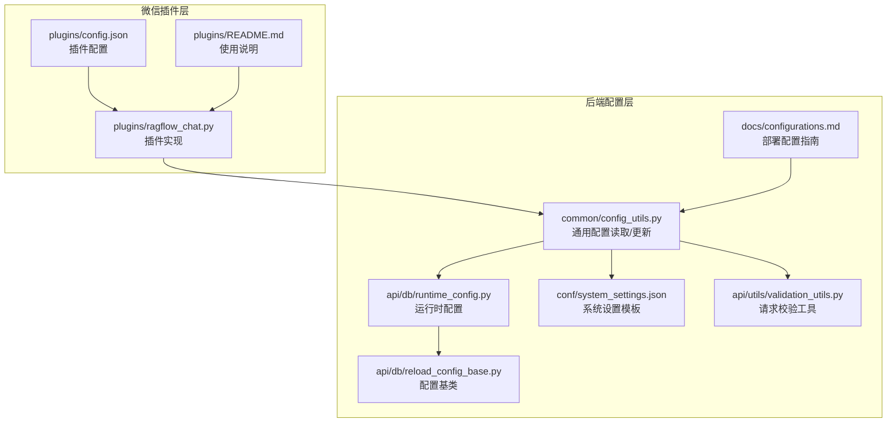
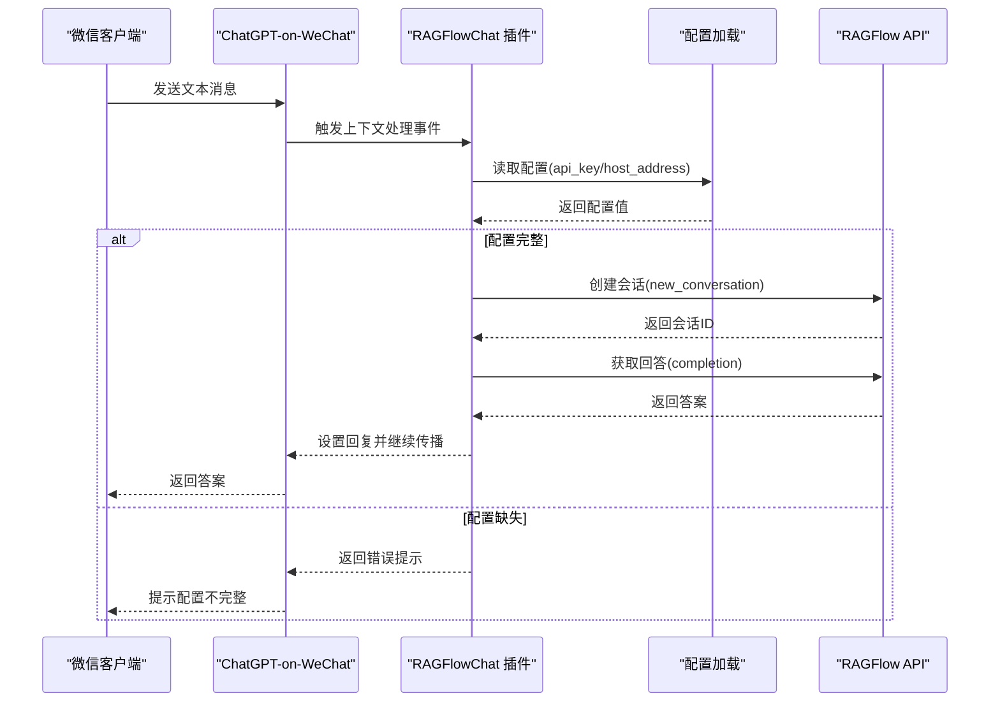
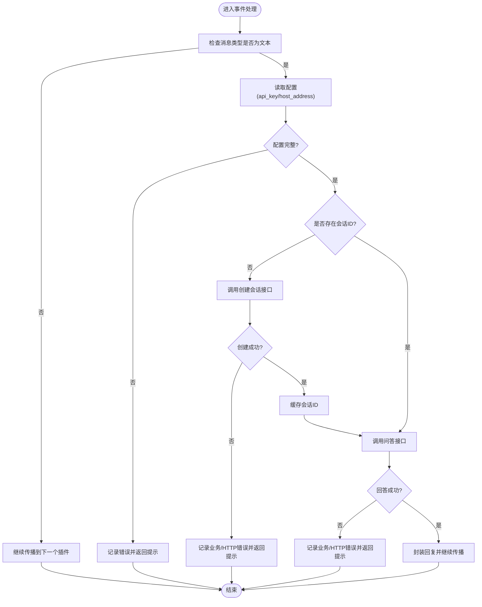
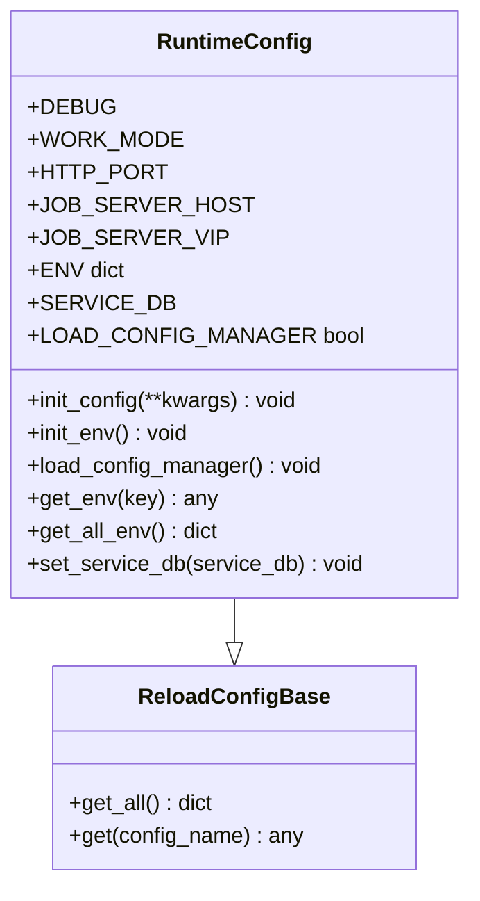
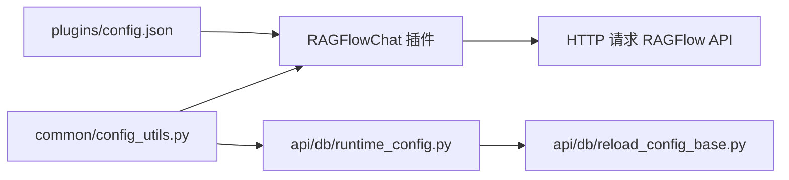

# 配置管理

<cite>
**本文引用的文件**
- [config.json](file://intergrations/chatgpt-on-wechat/plugins/config.json)
- [ragflow_chat.py](file://intergrations/chatgpt-on-wechat/plugins/ragflow_chat.py)
- [README.md](file://intergrations/chatgpt-on-wechat/plugins/README.md)
- [config_utils.py](file://common/config_utils.py)
- [runtime_config.py](file://api/db/runtime_config.py)
- [reload_config_base.py](file://api/db/reload_config_base.py)
- [validation_utils.py](file://api/utils/validation_utils.py)
- [system_settings.json](file://conf/system_settings.json)
- [configurations.md](file://docs/configurations.md)
</cite>

## 目录
1. [简介](#简介)
2. [项目结构](#项目结构)
3. [核心组件](#核心组件)
4. [架构总览](#架构总览)
5. [详细组件分析](#详细组件分析)
6. [依赖分析](#依赖分析)
7. [性能考虑](#性能考虑)
8. [故障排查指南](#故障排查指南)
9. [结论](#结论)
10. [附录](#附录)

## 简介
本文件面向“微信插件配置管理”的使用与维护，聚焦于微信生态（如企业微信、公众号）通过 ChatGPT-on-WeChat 框架集成 RAGFlow 的插件配置。内容涵盖：
- 插件配置文件 config.json 的结构与参数说明
- API 密钥、主机地址等关键参数的含义、设置方法与校验
- 不同使用场景下的配置示例（基础、高级、定制）
- 配置验证机制与错误处理流程
- 最佳实践与安全建议

## 项目结构
与微信插件配置直接相关的文件位于 integrations/chatgpt-on-wechat/plugins 目录，同时系统级配置由后端统一管理。

图表来源
- [config.json:1-5](file://intergrations/chatgpt-on-wechat/plugins/config.json#L1-L5)
- [ragflow_chat.py:1-128](file://intergrations/chatgpt-on-wechat/plugins/ragflow_chat.py#L1-L128)
- [README.md:1-58](file://intergrations/chatgpt-on-wechat/plugins/README.md#L1-L58)
- [config_utils.py:1-156](file://common/config_utils.py#L1-L156)
- [runtime_config.py:1-55](file://api/db/runtime_config.py#L1-L55)
- [reload_config_base.py:1-29](file://api/db/reload_config_base.py#L1-L29)
- [system_settings.json:1-64](file://conf/system_settings.json#L1-L64)
- [validation_utils.py:1-728](file://api/utils/validation_utils.py#L1-L728)
- [configurations.md:1-245](file://docs/configurations.md#L1-L245)

章节来源
- [config.json:1-5](file://intergrations/chatgpt-on-wechat/plugins/config.json#L1-L5)
- [ragflow_chat.py:1-128](file://intergrations/chatgpt-on-wechat/plugins/ragflow_chat.py#L1-L128)
- [README.md:1-58](file://intergrations/chatgpt-on-wechat/plugins/README.md#L1-L58)
- [config_utils.py:1-156](file://common/config_utils.py#L1-L156)
- [runtime_config.py:1-55](file://api/db/runtime_config.py#L1-L55)
- [reload_config_base.py:1-29](file://api/db/reload_config_base.py#L1-L29)
- [system_settings.json:1-64](file://conf/system_settings.json#L1-L64)
- [validation_utils.py:1-728](file://api/utils/validation_utils.py#L1-L728)
- [configurations.md:1-245](file://docs/configurations.md#L1-L245)

## 核心组件
- 插件配置文件：用于声明 RAGFlow API 的访问凭据与服务地址，供插件在运行时加载。
- 插件实现：负责从配置中读取凭据与地址，调用后端 API 完成会话创建与问答获取，并将结果回传给聊天框架。
- 后端配置工具：提供通用的配置读取、合并、更新与敏感信息脱敏展示能力；支持运行时配置对象与环境变量联动。
- 请求校验工具：提供统一的 JSON 请求解析与错误格式化能力，便于在 API 层面进行参数校验与错误反馈。
- 系统设置模板：提供系统级配置项的结构参考，便于理解配置字段类型与默认值。

章节来源
- [config.json:1-5](file://intergrations/chatgpt-on-wechat/plugins/config.json#L1-L5)
- [ragflow_chat.py:1-128](file://intergrations/chatgpt-on-wechat/plugins/ragflow_chat.py#L1-L128)
- [config_utils.py:1-156](file://common/config_utils.py#L1-L156)
- [validation_utils.py:1-728](file://api/utils/validation_utils.py#L1-L728)
- [system_settings.json:1-64](file://conf/system_settings.json#L1-L64)

## 架构总览
下图展示了微信插件配置在整体架构中的位置与交互路径。

图表来源
- [ragflow_chat.py:36-128](file://intergrations/chatgpt-on-wechat/plugins/ragflow_chat.py#L36-L128)
- [config.json:1-5](file://intergrations/chatgpt-on-wechat/plugins/config.json#L1-L5)

## 详细组件分析

### 插件配置文件 config.json
- 文件位置：intergrations/chatgpt-on-wechat/plugins/config.json
- 主要字段
  - api_key：RAGFlow API 访问令牌，用于鉴权
  - host_address：RAGFlow 服务地址与端口，形如 host:port
- 字段属性
  - 必填项：api_key、host_address
  - 默认值：无（需显式填写）
  - 类型：字符串
- 参数依赖
  - 两者缺一不可，否则插件会在运行时返回“配置不完整”的错误提示
- 设置方法
  - 在插件目录下创建或编辑 config.json，填入正确的 api_key 与 host_address
  - 保存后重启 ChatGPT-on-WeChat 以使变更生效

章节来源
- [config.json:1-5](file://intergrations/chatgpt-on-wechat/plugins/config.json#L1-L5)
- [ragflow_chat.py:56-65](file://intergrations/chatgpt-on-wechat/plugins/ragflow_chat.py#L56-L65)

### 插件实现 RAGFlowChat
- 初始化与事件绑定
  - 加载配置并绑定 ON_HANDLE_CONTEXT 事件
  - 维护每个用户的会话 ID 映射
- 文本消息处理
  - 仅处理文本类型消息
  - 从上下文提取用户输入与会话标识
- 会话创建与问答获取
  - 调用 /v1/api/new_conversation 获取会话 ID（若不存在则创建）
  - 调用 /v1/api/completion 获取回答
- 错误处理
  - 配置缺失：记录错误并返回提示
  - HTTP 异常：记录状态码与异常信息并返回友好提示
  - 业务错误：解析响应中的 code/message 并返回用户可见的错误信息

图表来源
- [ragflow_chat.py:36-128](file://intergrations/chatgpt-on-wechat/plugins/ragflow_chat.py#L36-L128)

章节来源
- [ragflow_chat.py:24-128](file://intergrations/chatgpt-on-wechat/plugins/ragflow_chat.py#L24-L128)

### 后端配置工具与运行时配置
- 通用配置读取与合并
  - 支持本地覆盖与全局配置合并
  - 提供敏感字段脱敏展示
  - 支持通过环境变量覆盖配置键值
- 运行时配置对象
  - 提供统一的配置读取接口与环境注入
  - 可动态启用配置管理器标志位
- 配置更新
  - 基于文件锁保证并发安全地写入 YAML 配置

图表来源
- [reload_config_base.py:16-29](file://api/db/reload_config_base.py#L16-L29)
- [runtime_config.py:20-55](file://api/db/runtime_config.py#L20-L55)

章节来源
- [config_utils.py:55-156](file://common/config_utils.py#L55-L156)
- [runtime_config.py:20-55](file://api/db/runtime_config.py#L20-L55)
- [reload_config_base.py:16-29](file://api/db/reload_config_base.py#L16-L29)

### 请求校验与错误格式化
- JSON 请求解析
  - Content-Type 校验
  - JSON 语法校验
  - 结构类型校验
  - Pydantic 模型校验与错误格式化
- 查询参数校验
  - 将查询参数合并到模型并进行校验
  - 自动移除额外字段
- 错误格式化
  - 输出包含字段路径、消息与截断后的输入值

章节来源
- [validation_utils.py:37-218](file://api/utils/validation_utils.py#L37-L218)

### 系统设置模板参考
- 提供系统级配置项的结构参考，包括布尔、字符串、整数等数据类型与默认值
- 便于理解配置字段的类型约束与取值范围

章节来源
- [system_settings.json:1-64](file://conf/system_settings.json#L1-L64)

## 依赖分析
- 插件对配置的依赖
  - 插件在初始化阶段加载配置，并在每次处理消息前读取 api_key 与 host_address
  - 若任一缺失，立即返回错误提示，避免后续网络请求
- 配置来源与优先级
  - 本地覆盖优先于全局配置
  - 环境变量可作为默认值兜底
- 后端配置工具与运行时配置
  - 通用配置工具负责读取与更新
  - 运行时配置对象提供统一访问入口

图表来源
- [config.json:1-5](file://intergrations/chatgpt-on-wechat/plugins/config.json#L1-L5)
- [ragflow_chat.py:24-128](file://intergrations/chatgpt-on-wechat/plugins/ragflow_chat.py#L24-L128)
- [config_utils.py:55-156](file://common/config_utils.py#L55-L156)
- [runtime_config.py:20-55](file://api/db/runtime_config.py#L20-L55)
- [reload_config_base.py:16-29](file://api/db/reload_config_base.py#L16-L29)

章节来源
- [config.json:1-5](file://intergrations/chatgpt-on-wechat/plugins/config.json#L1-L5)
- [ragflow_chat.py:24-128](file://intergrations/chatgpt-on-wechat/plugins/ragflow_chat.py#L24-L128)
- [config_utils.py:55-156](file://common/config_utils.py#L55-L156)
- [runtime_config.py:20-55](file://api/db/runtime_config.py#L20-L55)
- [reload_config_base.py:16-29](file://api/db/reload_config_base.py#L16-L29)

## 性能考虑
- 会话复用
  - 插件按用户维度缓存会话 ID，避免重复创建会话带来的开销
- 网络请求优化
  - 使用单次问答接口完成一次往返，减少不必要的请求次数
- 配置读取
  - 配置在插件初始化时一次性加载，运行期避免频繁 IO

章节来源
- [ragflow_chat.py:32-34](file://intergrations/chatgpt-on-wechat/plugins/ragflow_chat.py#L32-L34)
- [ragflow_chat.py:72-95](file://intergrations/chatgpt-on-wechat/plugins/ragflow_chat.py#L72-L95)
- [ragflow_chat.py:98-127](file://intergrations/chatgpt-on-wechat/plugins/ragflow_chat.py#L98-L127)

## 故障排查指南
- 常见错误与定位
  - 配置不完整：检查 config.json 是否包含 api_key 与 host_address
  - HTTP 连接失败：检查 host_address 是否可达，确认服务端口与协议
  - 业务错误：根据响应中的 code/message 判断具体原因
  - 异常抛出：查看日志中的异常堆栈定位问题
- 日志与调试
  - 插件在关键步骤输出调试日志，便于定位网络请求与业务处理阶段的问题
- 配置更新与生效
  - 修改配置后需重启 ChatGPT-on-WeChat 以加载新配置

章节来源
- [ragflow_chat.py:62-65](file://intergrations/chatgpt-on-wechat/plugins/ragflow_chat.py#L62-L65)
- [ragflow_chat.py:89-95](file://intergrations/chatgpt-on-wechat/plugins/ragflow_chat.py#L89-L95)
- [ragflow_chat.py:121-127](file://intergrations/chatgpt-on-wechat/plugins/ragflow_chat.py#L121-L127)
- [README.md:11-12](file://intergrations/chatgpt-on-wechat/plugins/README.md#L11-L12)

## 结论
- 微信插件配置以 config.json 为核心，明确声明 API 凭据与服务地址
- 插件在运行时严格校验配置完整性，并通过标准化的错误处理提升可观测性
- 后端配置工具与运行时配置提供了统一的配置读取、合并与更新能力
- 建议遵循最小权限原则与最小暴露原则，妥善保管 api_key，并定期轮换

## 附录

### 配置参数说明与设置方法
- api_key
  - 类型：字符串
  - 必填：是
  - 作用：用于 RAGFlow API 的身份认证
  - 设置：在插件配置文件中填写有效令牌
- host_address
  - 类型：字符串
  - 必填：是
  - 作用：RAGFlow 服务的主机与端口
  - 设置：填写服务实际监听的地址与端口

章节来源
- [config.json:1-5](file://intergrations/chatgpt-on-wechat/plugins/config.json#L1-L5)
- [ragflow_chat.py:56-65](file://intergrations/chatgpt-on-wechat/plugins/ragflow_chat.py#L56-L65)

### 使用场景与配置示例
- 基础配置
  - 适用于本地或内网部署的 RAGFlow 实例
  - 示例要点：填写正确的 api_key 与 host_address
- 高级配置
  - 多实例或多租户场景：为不同用户或群组配置独立的 host_address 或 api_key（需在上层系统中实现）
- 定制化配置
  - 结合后端配置工具，通过环境变量或本地覆盖实现差异化配置

章节来源
- [README.md:38-57](file://intergrations/chatgpt-on-wechat/plugins/README.md#L38-L57)
- [configurations.md:146-245](file://docs/configurations.md#L146-L245)

### 配置验证与错误处理
- 插件侧
  - 初始化时读取配置并校验必填项
  - 网络请求阶段捕获异常并返回用户可理解的提示
- 后端侧
  - 提供统一的 JSON 请求解析与错误格式化工具
  - 便于在 API 层面对请求参数进行结构化校验

章节来源
- [ragflow_chat.py:62-65](file://intergrations/chatgpt-on-wechat/plugins/ragflow_chat.py#L62-L65)
- [validation_utils.py:37-218](file://api/utils/validation_utils.py#L37-L218)

### 最佳实践与安全建议
- 安全
  - 严格保护 api_key，避免泄露至日志或前端
  - 仅在可信网络内暴露服务端口
  - 定期轮换 API 密钥
- 可靠性
  - 配置变更后及时重启服务以确保生效
  - 对外暴露的服务应具备健康检查与限流策略
- 可维护性
  - 使用环境变量作为默认值，结合本地覆盖实现灵活部署
  - 对敏感字段进行脱敏展示，避免在日志中泄露

章节来源
- [config_utils.py:78-109](file://common/config_utils.py#L78-L109)
- [configurations.md:14-31](file://docs/configurations.md#L14-L31)