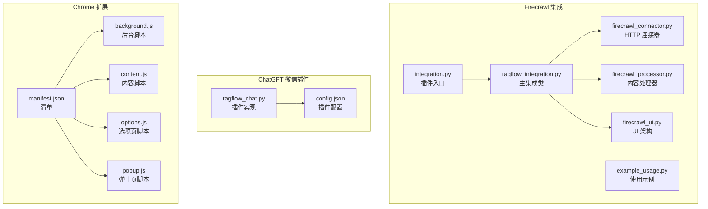
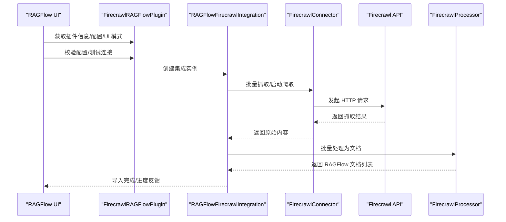
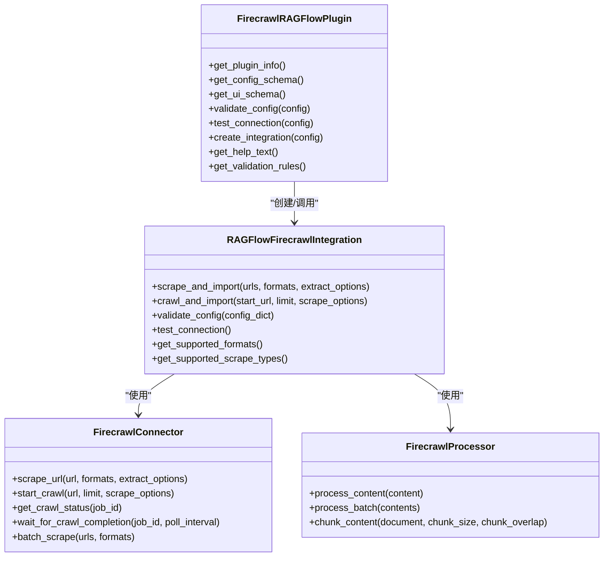
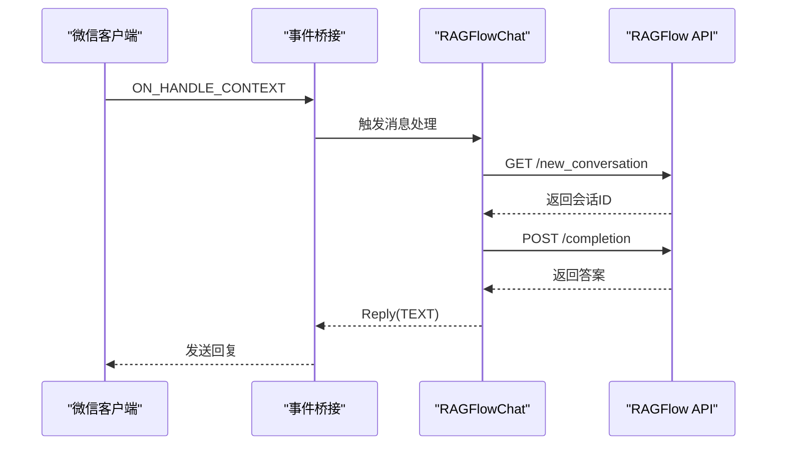
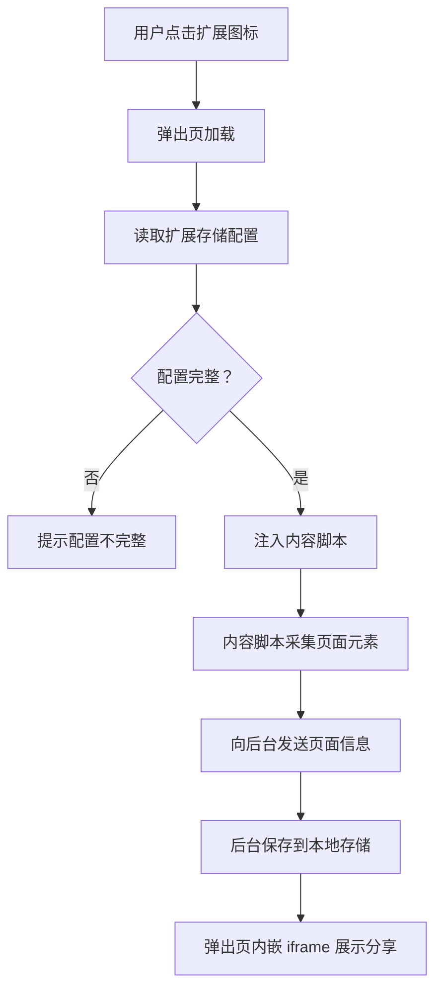
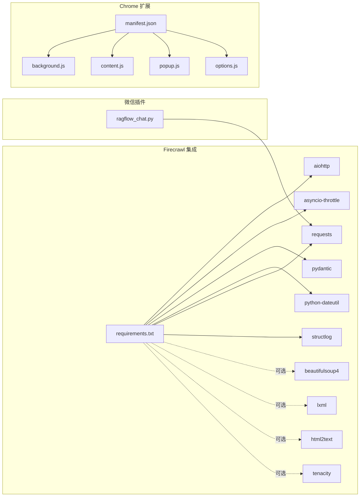

# 第三方集成

<cite>
**本文引用的文件**
- [intergrations/firecrawl/README.md](file://intergrations/firecrawl/README.md)
- [intergrations/firecrawl/integration.py](file://intergrations/firecrawl/integration.py)
- [intergrations/firecrawl/ragflow_integration.py](file://intergrations/firecrawl/ragflow_integration.py)
- [intergrations/firecrawl/firecrawl_connector.py](file://intergrations/firecrawl/firecrawl_connector.py)
- [intergrations/firecrawl/firecrawl_processor.py](file://intergrations/firecrawl/firecrawl_processor.py)
- [intergrations/firecrawl/firecrawl_ui.py](file://intergrations/firecrawl/firecrawl_ui.py)
- [intergrations/firecrawl/example_usage.py](file://intergrations/firecrawl/example_usage.py)
- [intergrations/firecrawl/requirements.txt](file://intergrations/firecrawl/requirements.txt)
- [intergrations/chatgpt-on-wechat/plugins/ragflow_chat.py](file://intergrations/chatgpt-on-wechat/plugins/ragflow_chat.py)
- [intergrations/chatgpt-on-wechat/plugins/config.json](file://intergrations/chatgpt-on-wechat/plugins/config.json)
- [intergrations/extension_chrome/manifest.json](file://intergrations/extension_chrome/manifest.json)
- [intergrations/extension_chrome/background.js](file://intergrations/extension_chrome/background.js)
- [intergrations/extension_chrome/content.js](file://intergrations/extension_chrome/content.js)
- [intergrations/extension_chrome/options.js](file://intergrations/extension_chrome/options.js)
- [intergrations/extension_chrome/popup.js](file://intergrations/extension_chrome/popup.js)
</cite>

## 目录
1. [简介](#简介)
2. [项目结构](#项目结构)
3. [核心组件](#核心组件)
4. [架构总览](#架构总览)
5. [详细组件分析](#详细组件分析)
6. [依赖关系分析](#依赖关系分析)
7. [性能与并发特性](#性能与并发特性)
8. [监控与日志](#监控与日志)
9. [故障排查](#故障排查)
10. [维护与升级策略](#维护与升级策略)
11. [结论](#结论)
12. [附录：配置与使用示例](#附录配置与使用示例)

## 简介
本指南面向需要在 RAGFlow 中集成第三方能力的开发者与运维人员，重点覆盖以下三类集成：
- Firecrawl 搜索引擎（网页抓取）集成：从 Firecrawl API 抓取网页内容并导入到 RAGFlow 文档处理流水线。
- ChatGPT 微信插件（基于 WeChat 的 Chat 插件）：通过事件钩子拦截用户消息，调用 RAGFlow 对话接口生成回复。
- Chrome 扩展：在浏览器中注入内容脚本，采集页面元素信息并通过弹出页嵌入分享对话。

文档将从架构、数据流、配置参数、API 调用、结果处理、错误处理、性能与监控、维护升级等方面进行系统化说明，并提供可操作的集成步骤与最佳实践。

## 项目结构
第三方集成位于仓库的 intergrations 目录下，按功能划分为三个子模块：
- firecrawl：Firecrawl 集成，包含连接器、处理器、UI 构建器、入口点与示例。
- chatgpt-on-wechat：微信聊天机器人插件，负责拦截消息并调用 RAGFlow 接口。
- extension_chrome：Chrome 扩展，包含清单、后台脚本、内容脚本、选项页与弹出页脚本。

图表来源
- [intergrations/firecrawl/integration.py:18-93](file://intergrations/firecrawl/integration.py#L18-L93)
- [intergrations/firecrawl/ragflow_integration.py:15-70](file://intergrations/firecrawl/ragflow_integration.py#L15-L70)
- [intergrations/firecrawl/firecrawl_connector.py:41-78](file://intergrations/firecrawl/firecrawl_connector.py#L41-L78)
- [intergrations/firecrawl/firecrawl_processor.py:32-60](file://intergrations/firecrawl/firecrawl_processor.py#L32-L60)
- [intergrations/firecrawl/firecrawl_ui.py:18-76](file://intergrations/firecrawl/firecrawl_ui.py#L18-L76)
- [intergrations/chatgpt-on-wechat/plugins/ragflow_chat.py:24-55](file://intergrations/chatgpt-on-wechat/plugins/ragflow_chat.py#L24-L55)
- [intergrations/extension_chrome/manifest.json:1-35](file://intergrations/extension_chrome/manifest.json#L1-L35)

章节来源
- [intergrations/firecrawl/README.md:41-56](file://intergrations/firecrawl/README.md#L41-L56)
- [intergrations/firecrawl/integration.py:18-93](file://intergrations/firecrawl/integration.py#L18-L93)
- [intergrations/chatgpt-on-wechat/plugins/ragflow_chat.py:24-55](file://intergrations/chatgpt-on-wechat/plugins/ragflow_chat.py#L24-L55)
- [intergrations/extension_chrome/manifest.json:1-35](file://intergrations/extension_chrome/manifest.json#L1-L35)

## 核心组件
- Firecrawl 集成
  - 插件入口与适配层：提供 RAGFlow 所需的插件元信息、配置模式、UI 模式、连接测试与工厂函数。
  - 主集成类：封装抓取与导入流程，支持单 URL、网站爬取、批量抓取；提供配置校验与连接测试。
  - 连接器：基于异步 HTTP 客户端，封装 Firecrawl API 的请求、重试、速率限制与并发控制。
  - 处理器：将 Firecrawl 输出转换为 RAGFlow 文档格式，执行清洗、标题/描述提取、语言识别、分块等。
  - UI 构建器：定义数据源配置、表单字段、进度组件、结果视图、错误处理与帮助文本。
- ChatGPT 微信插件
  - 插件类：注册事件钩子，拦截文本消息，调用 RAGFlow 对话接口，维护会话 ID 并返回回复。
  - 配置：通过配置文件读取 API Key 与主机地址。
- Chrome 扩展
  - 清单：声明权限、后台服务、动作弹窗、内容脚本与图标。
  - 后台脚本：监听消息，存储页面信息。
  - 内容脚本：采集页面输入元素与 iframe 内容，输出结构化文本。
  - 弹出页与选项页：读写扩展存储，拼装分享链接并在弹出页内嵌 iframe。

章节来源
- [intergrations/firecrawl/integration.py:18-93](file://intergrations/firecrawl/integration.py#L18-L93)
- [intergrations/firecrawl/ragflow_integration.py:15-70](file://intergrations/firecrawl/ragflow_integration.py#L15-L70)
- [intergrations/firecrawl/firecrawl_connector.py:41-78](file://intergrations/firecrawl/firecrawl_connector.py#L41-L78)
- [intergrations/firecrawl/firecrawl_processor.py:32-60](file://intergrations/firecrawl/firecrawl_processor.py#L32-L60)
- [intergrations/firecrawl/firecrawl_ui.py:18-76](file://intergrations/firecrawl/firecrawl_ui.py#L18-L76)
- [intergrations/chatgpt-on-wechat/plugins/ragflow_chat.py:24-55](file://intergrations/chatgpt-on-wechat/plugins/ragflow_chat.py#L24-L55)
- [intergrations/extension_chrome/manifest.json:1-35](file://intergrations/extension_chrome/manifest.json#L1-L35)

## 架构总览
下图展示 Firecrawl 集成在 RAGFlow 中的端到端工作流：插件入口将配置传递给主集成类，主集成类通过连接器访问 Firecrawl API，再由处理器将结果转换为 RAGFlow 文档，最终进入知识库或检索流程。

图表来源
- [intergrations/firecrawl/integration.py:58-84](file://intergrations/firecrawl/integration.py#L58-L84)
- [intergrations/firecrawl/ragflow_integration.py:25-64](file://intergrations/firecrawl/ragflow_integration.py#L25-L64)
- [intergrations/firecrawl/firecrawl_connector.py:79-106](file://intergrations/firecrawl/firecrawl_connector.py#L79-L106)
- [intergrations/firecrawl/firecrawl_processor.py:188-200](file://intergrations/firecrawl/firecrawl_processor.py#L188-L200)

## 详细组件分析

### Firecrawl 集成组件分析
- 插件入口与适配层
  - 提供插件元信息、配置模式、UI 模式、连接测试与工厂函数，满足 RAGFlow 的集成约定。
- 主集成类
  - 支持三种抓取方式：单 URL、网站爬取、批量抓取；提供配置校验、连接测试、帮助文本与验证规则。
- 连接器
  - 基于异步 HTTP 客户端，内置速率限制信号量、指数退避重试、超时控制与并发限制。
- 处理器
  - 将抓取内容清洗、标准化，提取标题/描述/语言，生成文档 ID 与元数据，并支持内容分块。
- UI 构建器
  - 定义数据源配置、表单字段、进度与结果视图、错误处理与帮助文本，形成完整的用户交互流程。

图表来源
- [intergrations/firecrawl/integration.py:18-93](file://intergrations/firecrawl/integration.py#L18-L93)
- [intergrations/firecrawl/ragflow_integration.py:15-70](file://intergrations/firecrawl/ragflow_integration.py#L15-L70)
- [intergrations/firecrawl/firecrawl_connector.py:41-78](file://intergrations/firecrawl/firecrawl_connector.py#L41-L78)
- [intergrations/firecrawl/firecrawl_processor.py:32-60](file://intergrations/firecrawl/firecrawl_processor.py#L32-L60)

章节来源
- [intergrations/firecrawl/integration.py:18-93](file://intergrations/firecrawl/integration.py#L18-L93)
- [intergrations/firecrawl/ragflow_integration.py:15-70](file://intergrations/firecrawl/ragflow_integration.py#L15-L70)
- [intergrations/firecrawl/firecrawl_connector.py:41-78](file://intergrations/firecrawl/firecrawl_connector.py#L41-L78)
- [intergrations/firecrawl/firecrawl_processor.py:32-60](file://intergrations/firecrawl/firecrawl_processor.py#L32-L60)
- [intergrations/firecrawl/firecrawl_ui.py:18-76](file://intergrations/firecrawl/firecrawl_ui.py#L18-L76)

### ChatGPT 微信插件组件分析
- 插件类
  - 注册上下文事件，拦截文本消息，调用 RAGFlow 新建会话与补全接口，维护用户级会话 ID，返回纯文本回复。
- 配置
  - 从配置文件读取 API Key 与主机地址，若缺失则记录错误并提示配置不完整。

图表来源
- [intergrations/chatgpt-on-wechat/plugins/ragflow_chat.py:36-55](file://intergrations/chatgpt-on-wechat/plugins/ragflow_chat.py#L36-L55)
- [intergrations/chatgpt-on-wechat/plugins/ragflow_chat.py:75-96](file://intergrations/chatgpt-on-wechat/plugins/ragflow_chat.py#L75-L96)
- [intergrations/chatgpt-on-wechat/plugins/ragflow_chat.py:98-110](file://intergrations/chatgpt-on-wechat/plugins/ragflow_chat.py#L98-L110)

章节来源
- [intergrations/chatgpt-on-wechat/plugins/ragflow_chat.py:24-55](file://intergrations/chatgpt-on-wechat/plugins/ragflow_chat.py#L24-L55)
- [intergrations/chatgpt-on-wechat/plugins/config.json:1-5](file://intergrations/chatgpt-on-wechat/plugins/config.json#L1-L5)

### Chrome 扩展组件分析
- 清单
  - 声明权限（活动标签页、脚本注入、存储）、后台服务、动作弹窗、内容脚本与图标。
- 后台脚本
  - 监听来自内容脚本的消息，保存页面信息到本地存储，并返回响应。
- 内容脚本
  - 采集页面输入元素、选择框、标题与段落等，遍历 iframe，输出结构化文本。
- 弹出页与选项页
  - 读取扩展存储中的基础地址、来源、鉴权与共享 ID，拼装分享链接并在弹出页内嵌 iframe；选项页用于保存配置。

图表来源
- [intergrations/extension_chrome/manifest.json:8-28](file://intergrations/extension_chrome/manifest.json#L8-L28)
- [intergrations/extension_chrome/background.js:5-16](file://intergrations/extension_chrome/background.js#L5-L16)
- [intergrations/extension_chrome/content.js:1-69](file://intergrations/extension_chrome/content.js#L1-L69)
- [intergrations/extension_chrome/popup.js:1-25](file://intergrations/extension_chrome/popup.js#L1-L25)
- [intergrations/extension_chrome/options.js:1-37](file://intergrations/extension_chrome/options.js#L1-L37)

章节来源
- [intergrations/extension_chrome/manifest.json:1-35](file://intergrations/extension_chrome/manifest.json#L1-L35)
- [intergrations/extension_chrome/background.js:1-17](file://intergrations/extension_chrome/background.js#L1-L17)
- [intergrations/extension_chrome/content.js:1-69](file://intergrations/extension_chrome/content.js#L1-L69)
- [intergrations/extension_chrome/options.js:1-37](file://intergrations/extension_chrome/options.js#L1-L37)
- [intergrations/extension_chrome/popup.js:1-25](file://intergrations/extension_chrome/popup.js#L1-L25)

## 依赖关系分析
- Firecrawl 集成依赖
  - 异步 HTTP 客户端与并发控制：aiohttp、asyncio-throttle
  - 数据处理与时间解析：pydantic、python-dateutil
  - 网络与 HTTP 工具：urllib3、requests
  - 日志与结构化日志：structlog
  - 可选增强：beautifulsoup4、lxml、html2text（内容清洗与解析）
  - 可选重试：tenacity（增强错误处理）
- ChatGPT 微信插件依赖
  - HTTP 请求：requests
  - 事件桥接与插件框架：bridge（上下文、回复类型、事件）
- Chrome 扩展依赖
  - 浏览器扩展 API：chrome.*（storage、scripting、tabs、runtime）

图表来源
- [intergrations/firecrawl/requirements.txt:1-32](file://intergrations/firecrawl/requirements.txt#L1-L32)
- [intergrations/chatgpt-on-wechat/plugins/ragflow_chat.py:17-22](file://intergrations/chatgpt-on-wechat/plugins/ragflow_chat.py#L17-L22)
- [intergrations/extension_chrome/manifest.json:8-28](file://intergrations/extension_chrome/manifest.json#L8-L28)

章节来源
- [intergrations/firecrawl/requirements.txt:1-32](file://intergrations/firecrawl/requirements.txt#L1-L32)

## 性能与并发特性
- Firecrawl 集成
  - 异步并发抓取：连接器使用信号量限制最大并发请求数，避免触发上游限流。
  - 指数退避重试：对 429/网络异常进行指数退避重试，提升稳定性。
  - 请求节流：通过配置项设置请求间隔，平衡吞吐与合规。
  - 批量处理：支持批量抓取，利用 gather 并行处理，降低总体延迟。
  - 内容分块：提供分块算法，按句边界切分，兼顾语义完整性与检索效率。
- Chrome 扩展
  - 内容脚本仅在当前标签页注入，避免全局性能影响。
  - 后台脚本与弹出页通过存储读写，减少重复计算。

章节来源
- [intergrations/firecrawl/firecrawl_connector.py:48-50](file://intergrations/firecrawl/firecrawl_connector.py#L48-L50)
- [intergrations/firecrawl/firecrawl_connector.py:87-105](file://intergrations/firecrawl/firecrawl_connector.py#L87-L105)
- [intergrations/firecrawl/firecrawl_processor.py:202-259](file://intergrations/firecrawl/firecrawl_processor.py#L202-L259)

## 监控与日志
- Firecrawl 集成
  - 结构化日志：使用结构化日志库记录请求、重试、错误与进度。
  - 连接测试：提供连接测试方法，返回成功/失败与错误详情。
  - 错误处理：捕获并记录异常，区分网络、速率限制与业务错误。
- ChatGPT 微信插件
  - 关键路径日志：记录配置缺失、HTTP 错误码、异常堆栈与响应内容。
- Chrome 扩展
  - 控制台日志：后台脚本与内容脚本打印调试信息，便于定位跨域与注入问题。

章节来源
- [intergrations/firecrawl/ragflow_integration.py:114-141](file://intergrations/firecrawl/ragflow_integration.py#L114-L141)
- [intergrations/chatgpt-on-wechat/plugins/ragflow_chat.py:62-95](file://intergrations/chatgpt-on-wechat/plugins/ragflow_chat.py#L62-L95)
- [intergrations/extension_chrome/background.js:6-16](file://intergrations/extension_chrome/background.js#L6-L16)

## 故障排查
- Firecrawl 集成
  - API Key 校验失败：确认以指定前缀开头且非空。
  - 连接测试失败：检查 API 地址、网络连通性与代理设置。
  - 速率限制：提高请求间隔或降低并发，观察返回的 429 行为。
  - 内容为空：检查目标站点 robots 与反爬策略，调整提取选项。
- ChatGPT 微信插件
  - 缺少配置：核对配置文件中的 API Key 与主机地址。
  - HTTP 错误：根据状态码定位新建会话或补全接口的问题。
  - 未返回回复：检查事件链路是否被中断（如后续插件覆盖）。
- Chrome 扩展
  - 跨域访问 iframe：内容脚本无法访问同源策略限制的 iframe，需在清单中声明相应权限或调整采集范围。
  - 注入失败：确认内容脚本匹配规则与权限声明，检查后台日志。

章节来源
- [intergrations/firecrawl/ragflow_integration.py:70-108](file://intergrations/firecrawl/ragflow_integration.py#L70-L108)
- [intergrations/chatgpt-on-wechat/plugins/ragflow_chat.py:62-95](file://intergrations/chatgpt-on-wechat/plugins/ragflow_chat.py#L62-L95)
- [intergrations/extension_chrome/content.js:40-50](file://intergrations/extension_chrome/content.js#L40-L50)

## 维护与升级策略
- 版本兼容性
  - Firecrawl API：关注端点变更与返回结构变化，保持连接器与处理器的健壮性。
  - RAGFlow 插件接口：遵循插件元信息、配置模式与 UI 模式的约定，确保升级平滑过渡。
- 依赖管理
  - 使用独立 requirements 文件，明确核心与可选依赖，定期更新安全补丁。
- 回滚机制
  - 采用灰度发布与配置开关，出现问题可快速回退到上一版本。
- 配置热更新
  - 插件与扩展均支持从配置中心或存储读取最新参数，避免频繁重启。

章节来源
- [intergrations/firecrawl/requirements.txt:1-32](file://intergrations/firecrawl/requirements.txt#L1-L32)
- [intergrations/firecrawl/integration.py:50-93](file://intergrations/firecrawl/integration.py#L50-L93)
- [intergrations/extension_chrome/options.js:18-35](file://intergrations/extension_chrome/options.js#L18-L35)

## 结论
本指南系统梳理了 Firecrawl、ChatGPT 微信插件与 Chrome 扩展三大第三方集成的架构与实现要点。通过统一的插件接口、结构化的日志与完善的错误处理，这些集成能够在生产环境中稳定运行。建议在部署前完成充分的配置校验与压力测试，并建立持续监控与回滚机制，以保障服务的高可用与可维护性。

## 附录：配置与使用示例
- Firecrawl 集成
  - 安装依赖：参考依赖文件安装所需包。
  - 配置参数：API Key、API 地址、最大重试次数、超时、请求间隔等。
  - 使用示例：参考示例脚本中的单 URL 抓取、网站爬取、批量处理、内容分块与错误处理。
- ChatGPT 微信插件
  - 配置文件：填写 API Key 与主机地址。
  - 集成步骤：将插件注册到微信机器人框架，确保事件钩子生效。
- Chrome 扩展
  - 清单权限：确保 activeTab、scripting、storage 权限已声明。
  - 页面注入：内容脚本自动采集页面元素，弹出页内嵌分享链接。

章节来源
- [intergrations/firecrawl/README.md:57-78](file://intergrations/firecrawl/README.md#L57-L78)
- [intergrations/firecrawl/README.md:100-109](file://intergrations/firecrawl/README.md#L100-L109)
- [intergrations/firecrawl/example_usage.py:12-47](file://intergrations/firecrawl/example_usage.py#L12-L47)
- [intergrations/firecrawl/example_usage.py:88-131](file://intergrations/firecrawl/example_usage.py#L88-L131)
- [intergrations/chatgpt-on-wechat/plugins/config.json:1-5](file://intergrations/chatgpt-on-wechat/plugins/config.json#L1-L5)
- [intergrations/extension_chrome/manifest.json:8-28](file://intergrations/extension_chrome/manifest.json#L8-L28)