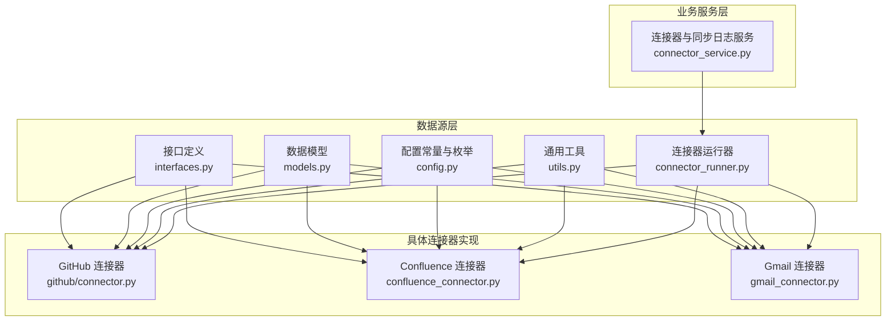
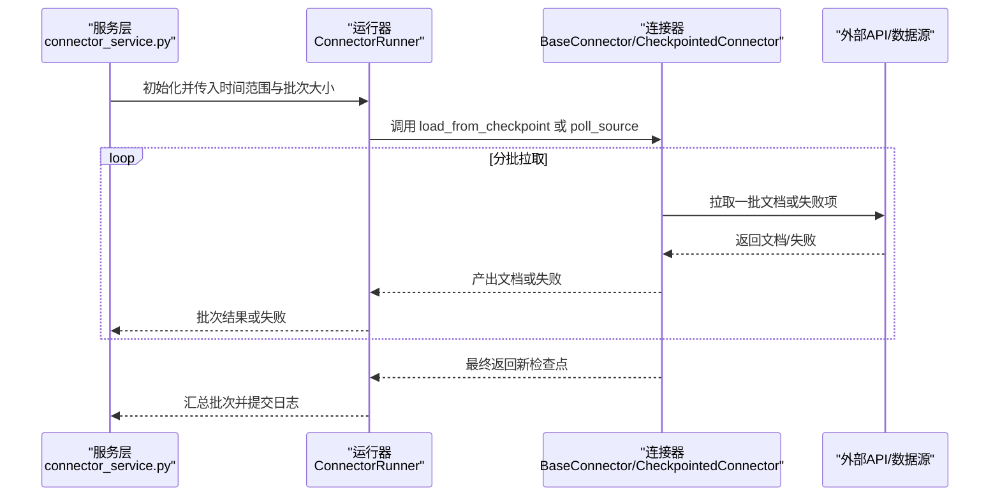
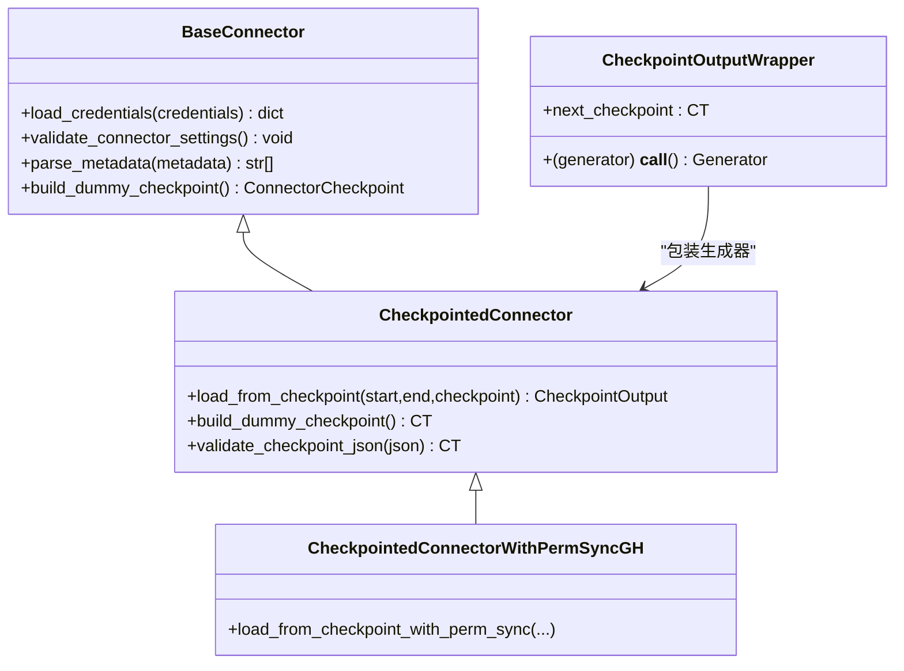
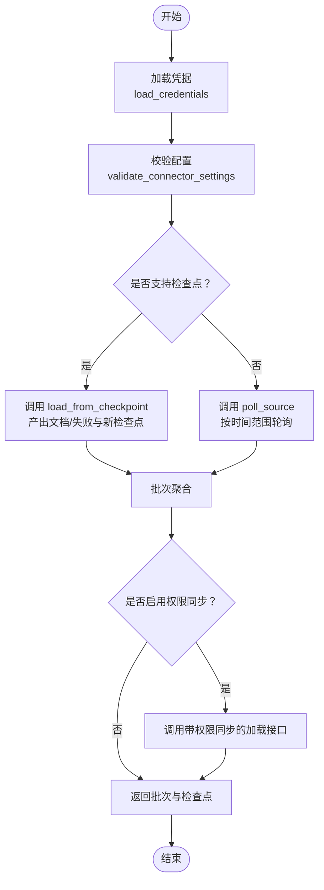
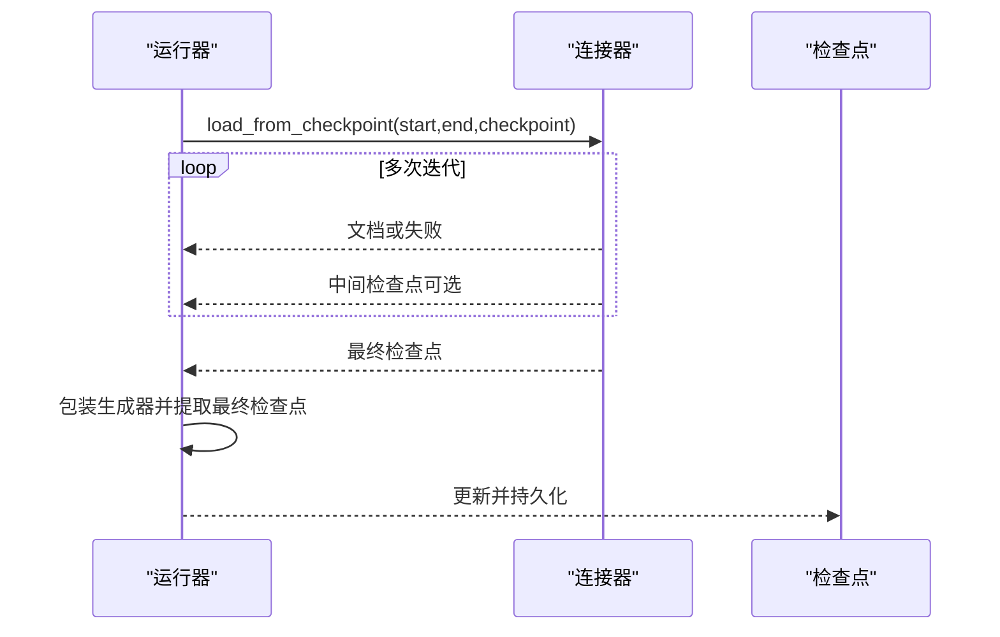
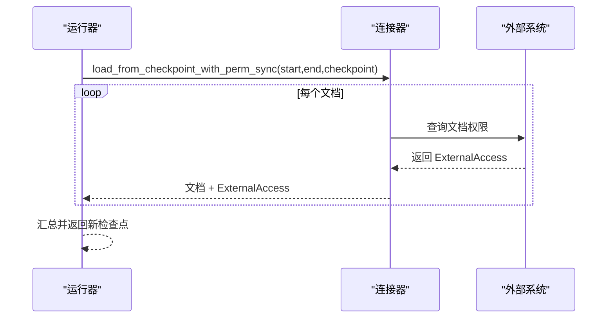
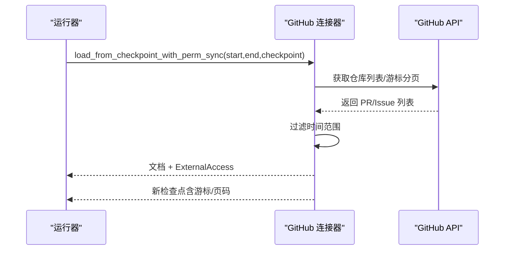
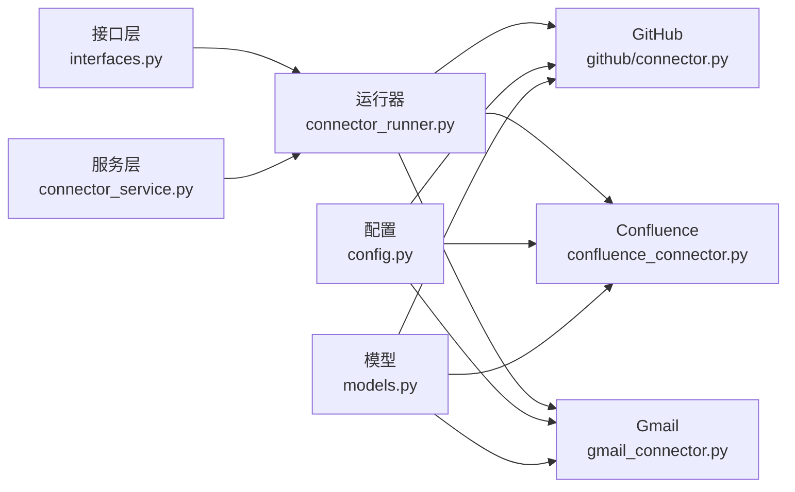

# 自定义集成开发

<cite>
**本文引用的文件**
- [接口定义（interfaces.py）](file://common/data_source/interfaces.py)
- [数据模型（models.py）](file://common/data_source/models.py)
- [配置常量与枚举（config.py）](file://common/data_source/config.py)
- [连接器运行器（connector_runner.py）](file://common/data_source/connector_runner.py)
- [服务层：连接器与同步日志（connector_service.py）](file://api/db/services/connector_service.py)
- [GitHub 连接器（connector.py）](file://common/data_source/github/connector.py)
- [Confluence 连接器（confluence_connector.py）](file://common/data_source/confluence_connector.py)
- [Gmail 连接器（gmail_connector.py）](file://common/data_source/gmail_connector.py)
- [通用工具（utils.py）](file://common/data_source/utils.py)
- [测试运行器（run_tests.py）](file://run_tests.py)
</cite>

## 目录
1. [简介](#简介)
2. [项目结构](#项目结构)
3. [核心组件](#核心组件)
4. [架构总览](#架构总览)
5. [详细组件分析](#详细组件分析)
6. [依赖分析](#依赖分析)
7. [性能考量](#性能考量)
8. [故障排除指南](#故障排除指南)
9. [结论](#结论)
10. [附录](#附录)

## 简介
本指南面向需要在系统中新增“自定义数据源与API集成”的开发者，围绕 BaseConnector 接口及其扩展接口，系统讲解如何实现新的连接器、配置参数、错误处理、生命周期与检查点机制、权限同步、配置管理最佳实践、测试策略以及调试与排障技巧。文档同时结合现有实现（如 GitHub、Confluence、Gmail）进行代码级剖析，帮助读者快速上手并高质量交付。

## 项目结构
- 数据源相关的核心位于 common/data_source 下，包含接口、模型、配置、工具与各具体连接器实现。
- 运行时调度与任务管理位于 api/db/services 下，负责连接器任务的调度、状态与日志记录。
- 测试入口位于根目录 run_tests.py，提供统一的测试执行方式与覆盖率统计。

图表来源
- [接口定义（interfaces.py）:203-288](file://common/data_source/interfaces.py#L203-L288)
- [连接器运行器（connector_runner.py）:91-173](file://common/data_source/connector_runner.py#L91-L173)
- [GitHub 连接器（connector.py）:413-791](file://common/data_source/github/connector.py#L413-L791)
- [Confluence 连接器（confluence_connector.py）:54-800](file://common/data_source/confluence_connector.py#L54-L800)
- [Gmail 连接器（gmail_connector.py）:144-317](file://common/data_source/gmail_connector.py#L144-L317)
- [服务层：连接器与同步日志（connector_service.py）:32-303](file://api/db/services/connector_service.py#L32-L303)

章节来源
- [接口定义（interfaces.py）:1-420](file://common/data_source/interfaces.py#L1-L420)
- [连接器运行器（connector_runner.py）:1-217](file://common/data_source/connector_runner.py#L1-L217)
- [服务层：连接器与同步日志（connector_service.py）:1-303](file://api/db/services/connector_service.py#L1-L303)

## 核心组件
- BaseConnector 及其变体：定义连接器抽象、检查点协议、权限同步接口与元数据解析能力。
- ConnectorRunner：封装检查点迭代、批次聚合、异常日志化与权限同步开关。
- 各连接器实现：以 GitHub、Confluence、Gmail 为例，展示如何实现 load_credentials、时间范围拉取、文档生成、失败回传与检查点返回。
- 配置与模型：Document/SlimDocument/ConnectorCheckpoint/ConnectorFailure 等模型支撑数据流转与错误处理。
- 服务层：负责任务调度、状态持久化与日志记录。

章节来源
- [接口定义（interfaces.py）:203-354](file://common/data_source/interfaces.py#L203-L354)
- [连接器运行器（connector_runner.py）:91-173](file://common/data_source/connector_runner.py#L91-L173)
- [数据模型（models.py）:88-154](file://common/data_source/models.py#L88-L154)

## 架构总览
下图展示了从服务层到连接器运行器再到具体连接器的数据流与控制流，以及权限同步与检查点的关键交互。

图表来源
- [服务层：连接器与同步日志（connector_service.py）:140-195](file://api/db/services/connector_service.py#L140-L195)
- [连接器运行器（connector_runner.py）:119-173](file://common/data_source/connector_runner.py#L119-L173)
- [接口定义（interfaces.py）:261-298](file://common/data_source/interfaces.py#L261-L298)

## 详细组件分析

### BaseConnector 与检查点协议
- BaseConnector 定义了 load_credentials、validate_connector_settings、parse_metadata、build_dummy_checkpoint 等通用能力。
- CheckpointedConnector 强制实现 load_from_checkpoint，并约定最终返回一个新检查点；CheckpointOutputWrapper 将生成器的“最后返回值”标准化为可消费的三元组输出。
- CheckpointedConnectorWithPermSyncGH 提供带权限同步的检查点加载接口。

图表来源
- [接口定义（interfaces.py）:203-354](file://common/data_source/interfaces.py#L203-L354)
- [连接器运行器（connector_runner.py）:300-343](file://common/data_source/connector_runner.py#L300-L343)

章节来源
- [接口定义（interfaces.py）:203-354](file://common/data_source/interfaces.py#L203-L354)
- [连接器运行器（connector_runner.py）:300-343](file://common/data_source/connector_runner.py#L300-L343)

### 生命周期与关键阶段
- 初始化：load_credentials 加载凭据；validate_connector_settings 做参数校验。
- 配置验证：validate_connector_settings 可覆盖以进行更严格的校验。
- 数据拉取：根据连接器类型调用 poll_source（轮询）或 load_from_checkpoint（带检查点）。
- 权限同步：通过 include_permissions 开关，使用带权限同步的加载接口。
- 状态保存：每次迭代结束后由运行器汇总批次并返回新的检查点。
- 清理：连接器内部可释放资源；运行器负责异常日志化与批次收尾。

图表来源
- [连接器运行器（connector_runner.py）:119-173](file://common/data_source/connector_runner.py#L119-L173)
- [接口定义（interfaces.py）:261-298](file://common/data_source/interfaces.py#L261-L298)

章节来源
- [连接器运行器（connector_runner.py）:91-173](file://common/data_source/connector_runner.py#L91-L173)

### 检查点机制实现原理
- 检查点对象用于记录游标、页码、已处理数量、光标URL等，确保断点续跑不丢失进度。
- 运行器通过 CheckpointOutputWrapper 统一从生成器中提取“最终返回的检查点”，并将其作为下一次迭代的输入。
- 具体连接器需保证：
  - 每次返回的检查点包含“has_more”等必要字段；
  - 在异常或中途退出时仍能返回一个可恢复的检查点；
  - 对于分页/游标的场景，正确维护当前页/游标与累计计数。

图表来源
- [连接器运行器（connector_runner.py）:148-168](file://common/data_source/connector_runner.py#L148-L168)
- [接口定义（interfaces.py）:261-298](file://common/data_source/interfaces.py#L261-L298)

章节来源
- [连接器运行器（connector_runner.py）:46-89](file://common/data_source/connector_runner.py#L46-L89)
- [接口定义（interfaces.py）:261-298](file://common/data_source/interfaces.py#L261-L298)

### 权限同步机制
- 权限同步通过 ExternalAccess 描述外部访问信息（公开性、邮箱集合、群组集合），并随文档或简化文档返回。
- 连接器可实现 retrieve_all_slim_docs_perm_sync 与 load_from_checkpoint_with_perm_sync，分别用于批量权限扫描与带权限的增量拉取。
- 运行器在 include_permissions=true 时自动选择带权限同步的加载路径。

图表来源
- [接口定义（interfaces.py）:57-92](file://common/data_source/interfaces.py#L57-L92)
- [数据模型（models.py）:9-66](file://common/data_source/models.py#L9-L66)
- [连接器运行器（connector_runner.py）:131-142](file://common/data_source/connector_runner.py#L131-L142)

章节来源
- [接口定义（interfaces.py）:57-92](file://common/data_source/interfaces.py#L57-L92)
- [数据模型（models.py）:9-66](file://common/data_source/models.py#L9-L66)
- [连接器运行器（connector_runner.py）:131-142](file://common/data_source/connector_runner.py#L131-L142)

### 配置管理最佳实践
- 配置来源与优先级：环境变量（如 REQUEST_TIMEOUT_SECONDS、CONTINUE_ON_CONNECTOR_FAILURE）、连接器内默认值与运行时参数。
- 参数验证：在 validate_connector_settings 中对必填字段、格式与范围进行校验；对无效参数抛出明确异常。
- 默认值与热更新：通过 config.py 统一管理常量与阈值；运行时可通过环境变量覆盖；注意避免硬编码敏感信息。
- 配置示例参考：
  - 请求超时、索引批次大小、失败容忍策略、各平台特定阈值（如附件大小限制、时间缓冲区）等。

章节来源
- [配置常量与枚举（config.py）:16-303](file://common/data_source/config.py#L16-L303)

### 错误处理与重试
- 运行器对连接器抛出的异常进行捕获与日志化，保留局部变量上下文，便于定位问题。
- 工具层提供统一的 HTTP 错误处理与指数退避策略，针对 429/403 等限流与速率限制场景进行等待与重试。
- 连接器内部应区分“可恢复错误”（如临时网络波动、API限流）与“不可恢复错误”（如凭据缺失、参数非法），并合理抛出异常。

章节来源
- [连接器运行器（connector_runner.py）:196-217](file://common/data_source/connector_runner.py#L196-L217)
- [通用工具（utils.py）:112-158](file://common/data_source/utils.py#L112-L158)

### 自定义连接器开发步骤
- 明确数据源类型与接口选择：是否需要检查点、是否支持权限同步。
- 实现 BaseConnector 的子类或 CheckpointedConnector 子类，至少实现：
  - load_credentials：加载并返回凭据字典（可选）。
  - load_from_checkpoint（或 poll_source/load_from_state）：按批次产出 Document 或 ConnectorFailure。
  - build_dummy_checkpoint/validate_checkpoint_json：提供空检查点与校验逻辑。
  - validate_connector_settings：参数与凭据校验。
- 若支持权限同步，实现 retrieve_all_slim_docs_perm_sync 与 load_from_checkpoint_with_perm_sync。
- 使用 ConnectorRunner.run 进行集成测试与上线前验证。

章节来源
- [接口定义（interfaces.py）:203-354](file://common/data_source/interfaces.py#L203-L354)
- [连接器运行器（connector_runner.py）:119-173](file://common/data_source/connector_runner.py#L119-L173)

### 典型实现参考

#### GitHub 连接器
- 支持检查点与权限同步，采用分页与游标回退策略，处理速率限制与错误重试。
- 关键点：多仓库遍历、PR/Issue 时间过滤、文档转换与失败回传、检查点游标维护。

图表来源
- [GitHub 连接器（connector.py）:529-740](file://common/data_source/github/connector.py#L529-L740)
- [接口定义（interfaces.py）:345-354](file://common/data_source/interfaces.py#L345-L354)

章节来源
- [GitHub 连接器（connector.py）:413-791](file://common/data_source/github/connector.py#L413-L791)

#### Confluence 连接器
- 自定义 Confluence 客户端，封装认证、探活、重试与分页；支持云/服务端差异。
- 关键点：CQL 构造、分页 URL 维护、用户与组权限查询、错误恢复与单条回退。

章节来源
- [Confluence 连接器（confluence_connector.py）:63-800](file://common/data_source/confluence_connector.py#L63-L800)

#### Gmail 连接器
- 支持轮询与状态加载，按线程聚合消息，构建 Document 并设置 ExternalAccess。
- 关键点：时间范围查询构造、多用户域邮箱枚举、权限映射与失败处理。

章节来源
- [Gmail 连接器（gmail_connector.py）:144-317](file://common/data_source/gmail_connector.py#L144-L317)

## 依赖分析
- 接口层与实现层解耦：BaseConnector/CheckpointedConnector 抽象与具体连接器之间通过接口契约通信。
- 运行器与连接器：运行器负责生命周期编排与异常日志化，连接器专注数据拉取与检查点维护。
- 服务层与运行器：服务层负责任务调度、状态持久化与日志记录，运行器负责具体执行。

图表来源
- [接口定义（interfaces.py）:203-354](file://common/data_source/interfaces.py#L203-L354)
- [连接器运行器（connector_runner.py）:91-173](file://common/data_source/connector_runner.py#L91-L173)
- [GitHub 连接器（connector.py）:413-791](file://common/data_source/github/connector.py#L413-L791)
- [Confluence 连接器（confluence_connector.py）:63-800](file://common/data_source/confluence_connector.py#L63-L800)
- [Gmail 连接器（gmail_connector.py）:144-317](file://common/data_source/gmail_connector.py#L144-L317)
- [配置常量与枚举（config.py）:16-303](file://common/data_source/config.py#L16-L303)
- [数据模型（models.py）:88-154](file://common/data_source/models.py#L88-L154)
- [服务层：连接器与同步日志（connector_service.py）:32-303](file://api/db/services/connector_service.py#L32-L303)

章节来源
- [接口定义（interfaces.py）:203-354](file://common/data_source/interfaces.py#L203-L354)
- [连接器运行器（connector_runner.py）:91-173](file://common/data_source/connector_runner.py#L91-L173)
- [服务层：连接器与同步日志（connector_service.py）:32-303](file://api/db/services/connector_service.py#L32-L303)

## 性能考量
- 批次大小与并发：通过 INDEX_BATCH_SIZE/SLIM_BATCH_SIZE 控制批次规模；合理设置线程数与超时，避免阻塞。
- 速率限制与退避：利用工具层的统一限流处理与指数退避策略，降低重试风暴风险。
- 检查点粒度：尽量细粒度地返回检查点（页/游标/计数），减少重复工作量。
- 缓存与复用：对用户/组信息、外部权限等进行本地缓存，减少重复查询。

## 故障排除指南
- 凭据与权限问题：确认凭据是否过期、作用域是否足够；在 validate_connector_settings 中加入显式校验。
- 速率限制与超时：关注 429/403 错误与 Retry-After 头；适当增大 REQUEST_TIMEOUT_SECONDS。
- 日志与上下文：运行器会记录异常栈与局部变量，优先查看最近帧的上下文信息。
- 断点续跑：确保检查点包含完整游标/页码信息，避免无限循环或跳过数据。

章节来源
- [连接器运行器（connector_runner.py）:196-217](file://common/data_source/connector_runner.py#L196-L217)
- [通用工具（utils.py）:112-158](file://common/data_source/utils.py#L112-L158)

## 结论
通过遵循 BaseConnector 接口与运行器契约，结合检查点与权限同步机制，开发者可以稳定地实现各类数据源的增量同步与断点续跑。配合完善的配置管理、错误处理与测试策略，能够显著提升集成质量与可维护性。

## 附录

### 测试策略
- 单元测试：针对连接器关键函数（如时间范围过滤、检查点序列化）编写用例。
- 集成测试：使用 ConnectorRunner.run 模拟真实拉取流程，验证批次产出与检查点恢复。
- 性能测试：在不同批次大小与并发条件下评估吞吐与延迟。
- 覆盖率：通过 run_tests.py 统一执行并生成覆盖率报告。

章节来源
- [测试运行器（run_tests.py）:42-234](file://run_tests.py#L42-L234)