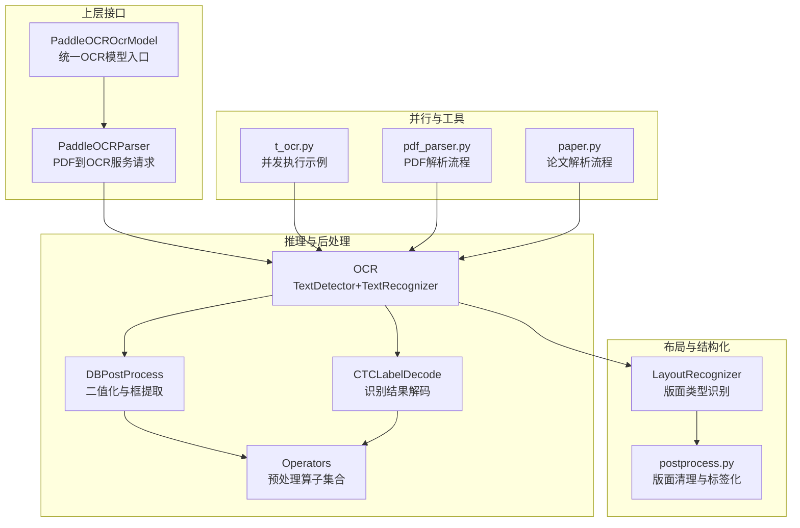
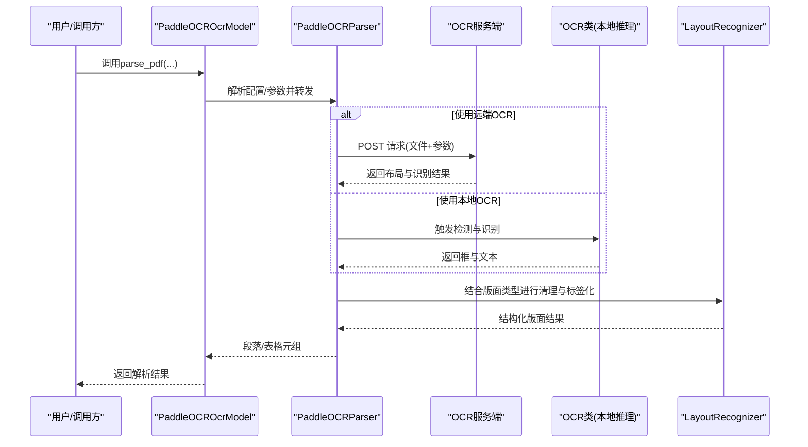
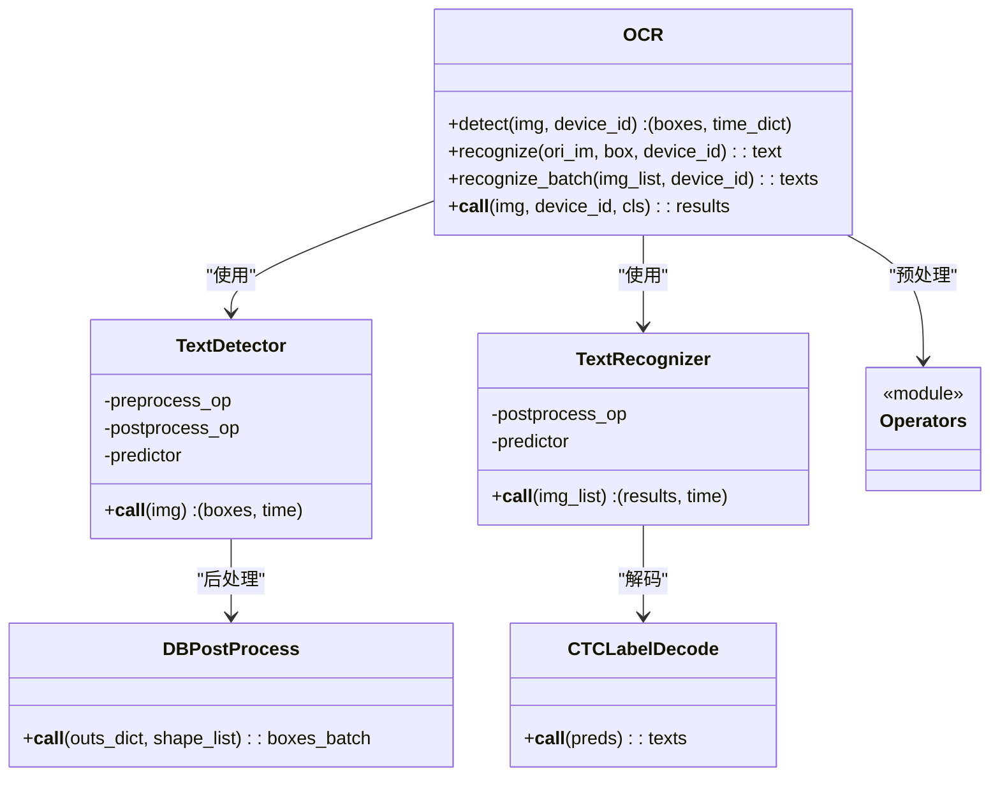
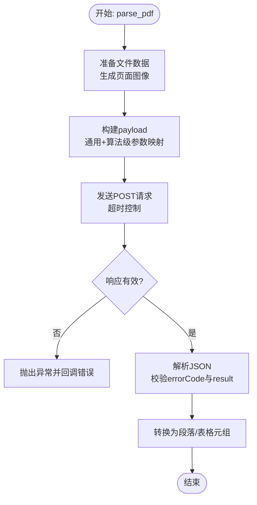
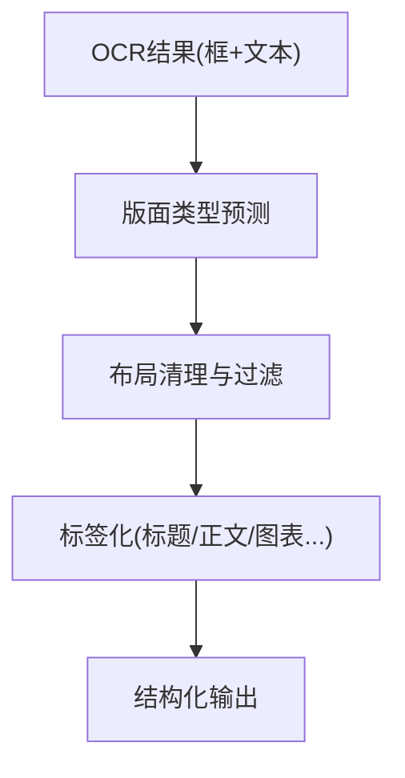
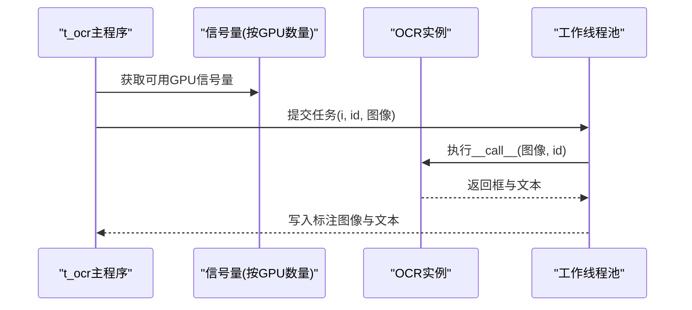
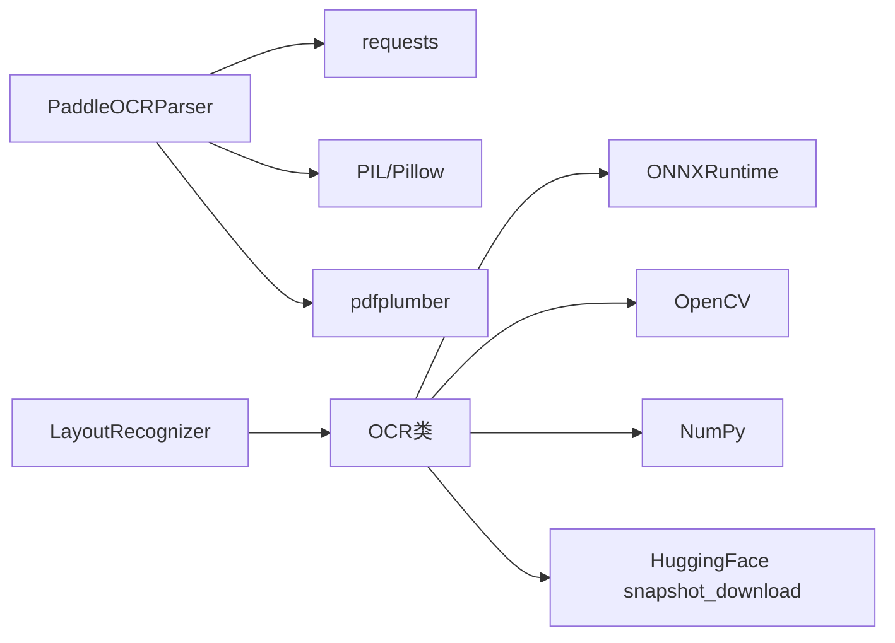

# OCR文字识别

<cite>
**本文引用的文件**
- [paddleocr_parser.py](file://deepdoc/parser/paddleocr_parser.py)
- [ocr_model.py](file://rag/llm/ocr_model.py)
- [ocr.py](file://deepdoc/vision/ocr.py)
- [postprocess.py](file://deepdoc/vision/postprocess.py)
- [operators.py](file://deepdoc/vision/operators.py)
- [layout_recognizer.py](file://deepdoc/vision/layout_recognizer.py)
- [t_ocr.py](file://deepdoc/vision/t_ocr.py)
- [pdf_parser.py](file://deepdoc/parser/pdf_parser.py)
- [paper.py](file://rag/app/paper.py)
- [constants.py](file://common/constants.py)
- [system_settings.json](file://conf/system_settings.json)
</cite>

## 目录
1. [简介](#简介)
2. [项目结构](#项目结构)
3. [核心组件](#核心组件)
4. [架构总览](#架构总览)
5. [详细组件分析](#详细组件分析)
6. [依赖关系分析](#依赖关系分析)
7. [性能考量](#性能考量)
8. [故障排查指南](#故障排查指南)
9. [结论](#结论)
10. [附录](#附录)

## 简介
本文件面向RAGFlow中的OCR文字识别能力，系统性梳理从底层推理到上层解析与后处理的完整链路，覆盖以下主题：
- OCR实现原理：文本检测（DB）与文本识别（CTC）两大阶段，以及ONNXRuntime推理与后处理解码。
- 多语言支持：通过字典表与CTC解码器支持多语言字符集；布局识别与版面重建提升跨语言文档理解。
- 后处理技术：框过滤、NMS、旋转裁剪、置信度阈值、版面标签化与内容格式化。
- 性能优化：GPU/CPU执行提供、线程数控制、显存限制与Arena收缩、并行设备分片、批处理与排序。
- 配置参数：OCR服务端调用参数、算法级参数映射、环境变量与运行时开关。
- 实战案例与最佳实践：如何在PDF解析流水线中启用OCR、如何进行多语言识别与版面重建。

## 项目结构
围绕OCR的关键模块分布如下：
- 深度学习推理与后处理：OCR类、TextDetector、TextRecognizer、DBPostProcess、CTCLabelDecode、各类预处理算子。
- 服务端集成：PaddleOCRParser负责将PDF转为图像、构建payload并调用远端OCR服务，解析返回结果为段落与表格。
- 上层封装：PaddleOCROcrModel作为统一入口，支持从配置或环境变量加载参数。
- 版面与布局：LayoutRecognizer系列用于版面类型识别与布局清理，辅助OCR结果结构化。
- 并行与工具：t_ocr示例脚本展示异步并发与GPU设备分发；pdf_parser与paper流程体现OCR在整体解析中的位置。

图表来源
- [ocr_model.py:98-149](file://rag/llm/ocr_model.py#L98-L149)
- [paddleocr_parser.py:150-289](file://deepdoc/parser/paddleocr_parser.py#L150-L289)
- [ocr.py:542-758](file://deepdoc/vision/ocr.py#L542-L758)
- [postprocess.py:25-39](file://deepdoc/vision/postprocess.py#L25-L39)
- [operators.py:27-734](file://deepdoc/vision/operators.py#L27-L734)
- [layout_recognizer.py:70-158](file://deepdoc/vision/layout_recognizer.py#L70-L158)
- [t_ocr.py:43-95](file://deepdoc/vision/t_ocr.py#L43-L95)
- [pdf_parser.py:1479-1515](file://deepdoc/parser/pdf_parser.py#L1479-L1515)
- [paper.py:35-69](file://rag/app/paper.py#L35-L69)

章节来源
- [ocr_model.py:98-149](file://rag/llm/ocr_model.py#L98-L149)
- [paddleocr_parser.py:150-289](file://deepdoc/parser/paddleocr_parser.py#L150-L289)
- [ocr.py:542-758](file://deepdoc/vision/ocr.py#L542-L758)
- [postprocess.py:25-39](file://deepdoc/vision/postprocess.py#L25-L39)
- [operators.py:27-734](file://deepdoc/vision/operators.py#L27-L734)
- [layout_recognizer.py:70-158](file://deepdoc/vision/layout_recognizer.py#L70-L158)
- [t_ocr.py:43-95](file://deepdoc/vision/t_ocr.py#L43-L95)
- [pdf_parser.py:1479-1515](file://deepdoc/parser/pdf_parser.py#L1479-L1515)
- [paper.py:35-69](file://rag/app/paper.py#L35-L69)

## 核心组件
- OCR类（TextDetector + TextRecognizer）
  - 文本检测：基于DB（Differentiable Binarization）网络，输出文本区域框与得分，配合DBPostProcess进行后处理。
  - 文本识别：基于CTC解码器，结合字典表与空白字符处理，输出文本与平均置信度。
  - 批处理与排序：按宽高比排序以提升批内填充效率，支持多GPU设备分片。
- 服务端集成（PaddleOCRParser）
  - 将PDF转换为图像数据，构造payload（含通用参数与算法级参数），调用远端OCR服务，解析为段落与表格。
  - 支持回调进度上报与错误处理。
- 上层封装（PaddleOCROcrModel）
  - 统一模型工厂名称“PaddleOCR”，从配置或环境变量解析API地址、算法与访问令牌。
- 布局识别（LayoutRecognizer）
  - 对OCR结果与版面类型进行匹配与清理，去除垃圾文本，生成结构化版面标签。
- 并行与工具（t_ocr、pdf_parser、paper）
  - 异步并发与GPU设备分发；在PDF解析与论文解析流程中嵌入OCR步骤。

章节来源
- [ocr.py:139-758](file://deepdoc/vision/ocr.py#L139-L758)
- [paddleocr_parser.py:150-289](file://deepdoc/parser/paddleocr_parser.py#L150-L289)
- [ocr_model.py:98-149](file://rag/llm/ocr_model.py#L98-L149)
- [layout_recognizer.py:70-158](file://deepdoc/vision/layout_recognizer.py#L70-L158)
- [t_ocr.py:43-95](file://deepdoc/vision/t_ocr.py#L43-L95)
- [pdf_parser.py:1479-1515](file://deepdoc/parser/pdf_parser.py#L1479-L1515)
- [paper.py:35-69](file://rag/app/paper.py#L35-L69)

## 架构总览
下图展示从PDF到结构化文本的端到端流程，包括本地推理与远端OCR两种路径。

图表来源
- [ocr_model.py:98-149](file://rag/llm/ocr_model.py#L98-L149)
- [paddleocr_parser.py:225-289](file://deepdoc/parser/paddleocr_parser.py#L225-L289)
- [ocr.py:542-758](file://deepdoc/vision/ocr.py#L542-L758)
- [layout_recognizer.py:70-158](file://deepdoc/vision/layout_recognizer.py#L70-L158)

## 详细组件分析

### OCR类与推理管线
- 文本检测（DB）
  - 输入图像经预处理算子链（如归一化、HWC转CHW、尺寸调整）进入检测模型。
  - 输出热力图，DBPostProcess将其二值化并提取多边形框，再进行去重与裁剪。
- 文本识别（CTC）
  - 对每个裁剪后的文本框进行识别，CTCLabelDecode将softmax输出解码为字符串与置信度。
  - 字典表可配置，支持空格字符；阿拉伯语等从右到左语言可通过反转处理。
- 批处理与排序
  - 按宽高比升序排序，减少padding开销；批大小可配置，提升吞吐。
- 设备与内存
  - ONNXRuntime会话选项支持CPU/GPU执行提供、线程数控制、显存限制与Arena收缩。

图表来源
- [ocr.py:542-758](file://deepdoc/vision/ocr.py#L542-L758)
- [postprocess.py:25-39](file://deepdoc/vision/postprocess.py#L25-L39)
- [operators.py:27-734](file://deepdoc/vision/operators.py#L27-L734)

章节来源
- [ocr.py:139-758](file://deepdoc/vision/ocr.py#L139-L758)
- [postprocess.py:41-371](file://deepdoc/vision/postprocess.py#L41-L371)
- [operators.py:27-734](file://deepdoc/vision/operators.py#L27-L734)

### 服务端集成与参数映射
- PaddleOCRParser
  - 将PDF转为字节流，生成页面图像用于裁剪定位。
  - 构建payload：通用参数（如美化Markdown、显示公式编号、可视化）与算法级参数（如版面检测、图表识别、提示标签等）映射至服务端字段。
  - 发送POST请求，解析JSON响应，校验错误码与结果结构。
  - 将布局解析结果转换为段落元组，并支持表格抽取占位。
- 参数映射
  - 通用字段映射：如“prettify_markdown”映射为“prettifyMarkdown”等。
  - 算法级字段映射：针对“PaddleOCR-VL”算法，将useDocOrientationClassify、layoutThreshold、temperature等参数映射到对应服务端键名。
- 回调与错误处理
  - 通过回调上报进度；对请求失败、非JSON响应、无效格式进行异常抛出。

图表来源
- [paddleocr_parser.py:225-373](file://deepdoc/parser/paddleocr_parser.py#L225-L373)

章节来源
- [paddleocr_parser.py:150-373](file://deepdoc/parser/paddleocr_parser.py#L150-L373)

### 布局识别与版面清理
- 版面识别
  - 对每页OCR结果与版面预测进行匹配，过滤低置信度与垃圾文本（如页码、CID占位符等）。
  - 使用Y轴优先排序与布局清理逻辑，合并相邻块，形成结构化版面。
- 标签化与内容格式化
  - 为不同版面类型（标题、正文、参考文献、图表、公式等）打标签，便于后续结构化输出与渲染。

图表来源
- [layout_recognizer.py:70-158](file://deepdoc/vision/layout_recognizer.py#L70-L158)
- [layout_recognizer.py:378-412](file://deepdoc/vision/layout_recognizer.py#L378-L412)

章节来源
- [layout_recognizer.py:70-158](file://deepdoc/vision/layout_recognizer.py#L70-L158)
- [layout_recognizer.py:378-412](file://deepdoc/vision/layout_recognizer.py#L378-L412)

### 并行与工具
- 并行执行
  - t_ocr示例脚本通过信号量限制GPU并发，按设备ID轮询分发任务，实现多GPU并行。
- PDF解析流程
  - 在pdf_parser中，根据PARALLEL_DEVICES创建多个TextDetector/TextRecognizer实例，按设备分片执行。
- 论文解析流程
  - paper流程中先生成页面图像，再进行布局分析与表格识别，最后合并文本并过滤。

图表来源
- [t_ocr.py:43-95](file://deepdoc/vision/t_ocr.py#L43-L95)
- [pdf_parser.py:1479-1515](file://deepdoc/parser/pdf_parser.py#L1479-L1515)

章节来源
- [t_ocr.py:43-95](file://deepdoc/vision/t_ocr.py#L43-L95)
- [pdf_parser.py:1479-1515](file://deepdoc/parser/pdf_parser.py#L1479-L1515)
- [paper.py:35-69](file://rag/app/paper.py#L35-L69)

## 依赖关系分析
- 组件耦合
  - OCR类内部组合TextDetector与TextRecognizer，二者共享后处理模块与算子链。
  - PaddleOCRParser依赖requests进行HTTP通信，依赖PIL与pdfplumber进行图像与PDF处理。
  - LayoutRecognizer依赖OCR结果与版面标签，进行版面清理与排序。
- 外部依赖
  - ONNXRuntime提供CPU/GPU执行提供；OpenCV与NumPy用于图像处理与数值计算。
  - HuggingFace snapshot_download用于模型下载与缓存。

图表来源
- [paddleocr_parser.py:29-30](file://deepdoc/parser/paddleocr_parser.py#L29-L30)
- [ocr.py:22-29](file://deepdoc/vision/ocr.py#L22-L29)
- [layout_recognizer.py:70-158](file://deepdoc/vision/layout_recognizer.py#L70-L158)

章节来源
- [paddleocr_parser.py:29-30](file://deepdoc/parser/paddleocr_parser.py#L29-L30)
- [ocr.py:22-29](file://deepdoc/vision/ocr.py#L22-L29)
- [layout_recognizer.py:70-158](file://deepdoc/vision/layout_recognizer.py#L70-L158)

## 性能考量
- 推理性能
  - 线程数控制：通过环境变量控制ONNXRuntime的intra/inter_op线程数，默认较小以避免CPU过载。
  - GPU显存限制：可设置OCR_GPU_MEM_LIMIT_MB与Arena扩展策略，必要时启用GPU Arena收缩以释放显存。
  - 多GPU分片：PARALLEL_DEVICES大于0时，按设备ID创建Detector/Recognizer实例，实现设备级并行。
- 数据处理
  - 批处理与排序：按宽高比排序减少padding，提高批内填充效率。
  - 预处理算子：标准化、尺寸调整、通道转换等，确保输入符合模型期望。
- I/O与并发
  - 远端OCR：合理设置请求超时与回调进度，避免阻塞。
  - 本地OCR：异步并发与信号量控制，避免GPU资源争用。

章节来源
- [ocr.py:71-136](file://deepdoc/vision/ocr.py#L71-L136)
- [constants.py:204-205](file://common/constants.py#L204-L205)
- [pdf_parser.py:1479-1515](file://deepdoc/parser/pdf_parser.py#L1479-L1515)
- [t_ocr.py:43-95](file://deepdoc/vision/t_ocr.py#L43-L95)

## 故障排查指南
- 远端OCR调用失败
  - 现象：请求异常或响应非JSON。
  - 排查：检查API URL与访问令牌、网络连通性、服务端错误码与返回结构。
  - 参考
    - [paddleocr_parser.py:335-373](file://deepdoc/parser/paddleocr_parser.py#L335-L373)
- 本地OCR模型缺失
  - 现象：无法找到模型文件路径。
  - 排查：确认模型目录存在，或允许自动下载；检查CUDA可用性与设备ID。
  - 参考
    - [ocr.py:71-136](file://deepdoc/vision/ocr.py#L71-L136)
- 显存不足或内存泄漏
  - 现象：GPU显存耗尽或进程内存持续增长。
  - 处理：降低批大小、设置OCR_GPU_MEM_LIMIT_MB、启用Arena收缩；及时关闭会话并触发GC。
  - 参考
    - [ocr.py:71-136](file://deepdoc/vision/ocr.py#L71-L136)
- 版面识别异常
  - 现象：版面类型误判或垃圾文本未清理。
  - 处理：调整布局阈值与NMS参数，检查OCR结果质量与版面标签映射。
  - 参考
    - [layout_recognizer.py:70-158](file://deepdoc/vision/layout_recognizer.py#L70-L158)

章节来源
- [paddleocr_parser.py:335-373](file://deepdoc/parser/paddleocr_parser.py#L335-L373)
- [ocr.py:71-136](file://deepdoc/vision/ocr.py#L71-L136)
- [layout_recognizer.py:70-158](file://deepdoc/vision/layout_recognizer.py#L70-L158)

## 结论
RAGFlow的OCR能力由“服务端OCR + 本地OCR推理”双路径构成，结合版面识别与后处理，实现从图像到结构化文本的高质量输出。通过合理的参数配置、并发调度与资源控制，可在多语言场景下获得稳定且高效的识别效果。建议在生产环境中：
- 明确OCR路径与参数来源（配置/环境变量）；
- 合理设置线程数与显存限制；
- 利用布局识别与版面清理提升结构化输出质量；
- 通过回调与日志监控识别进度与异常。

## 附录

### OCR配置参数详解
- 通用参数（PaddleOCRParser）
  - prettify_markdown：是否美化Markdown输出
  - show_formula_number：是否显示公式编号
  - visualize：是否输出可视化结果
  - request_timeout：请求超时（秒）
  - additional_params：附加请求参数
- 算法级参数（PaddleOCR-VL）
  - useDocOrientationClassify：是否进行文档方向分类
  - useDocUnwarping：是否进行文档去扭曲
  - useLayoutDetection：是否启用版面检测
  - useChartRecognition：是否启用图表识别
  - useSealRecognition：是否启用印章识别
  - useOcrForImageBlock：是否对图片块进行OCR
  - layoutThreshold：版面检测阈值
  - layoutNms：版面NMS开关
  - layoutUnclipRatio：版面框扩张比例
  - layoutMergeBboxesMode：框合并模式
  - layoutShapeMode：版面形状模式
  - promptLabel：提示标签
  - formatBlockContent：是否格式化块内容
  - repetitionPenalty/temperature/topP：采样参数
  - minPixels/maxPixels/maxNewTokens：约束参数
  - mergeLayoutBlocks：是否合并布局块
  - markdownIgnoreLabels：忽略的标签列表
  - vlmExtraArgs：VLM额外参数
  - restructurePages：是否重组页面
  - mergeTables：是否合并表格
  - relevelTitles：是否重排标题层级
- 环境变量
  - PADDLEOCR_API_URL：远端OCR服务地址
  - PADDLEOCR_ALGORITHM：算法名称（默认PaddleOCR-VL）
  - PADDLEOCR_ACCESS_TOKEN：访问令牌
  - OCR_GPU_MEM_LIMIT_MB：GPU显存上限（MB）
  - OCR_ARENA_EXTEND_STRATEGY：Arena扩展策略
  - OCR_INTRA_OP_NUM_THREADS/OCR_INTER_OP_NUM_THREADS：推理线程数
  - OCR_GPUMEM_ARENA_SHRINKAGE：启用GPU Arena收缩
  - PARALLEL_DEVICES：并行设备数（多GPU）

章节来源
- [paddleocr_parser.py:62-147](file://deepdoc/parser/paddleocr_parser.py#L62-L147)
- [paddleocr_parser.py:150-189](file://deepdoc/parser/paddleocr_parser.py#L150-L189)
- [ocr_model.py:101-138](file://rag/llm/ocr_model.py#L101-L138)
- [constants.py:204-205](file://common/constants.py#L204-L205)

### 多语言OCR支持策略
- 字典表与CTC解码
  - 通过character_dict_path指定字典文件，支持空格字符；阿拉伯语等语言可启用从右到左反转。
- 版面与结构化
  - 布局识别与标签化有助于区分不同语言区域，提升跨语言文档理解。
- 语言模型配置
  - 算法级参数中的temperature、topP、repetitionPenalty可用于采样策略微调，以适配不同语言特性。

章节来源
- [postprocess.py:262-371](file://deepdoc/vision/postprocess.py#L262-L371)
- [layout_recognizer.py:70-158](file://deepdoc/vision/layout_recognizer.py#L70-L158)
- [paddleocr_parser.py:62-92](file://deepdoc/parser/paddleocr_parser.py#L62-L92)

### OCR后处理技术
- 检测后处理（DBPostProcess）
  - 二值化、轮廓提取、框过滤与去重、多边形/四边形框生成。
- 识别后处理（CTCLabelDecode）
  - 去除空白字符、重复字符，输出文本与置信度。
- 版面清理（LayoutRecognizer）
  - 垃圾文本过滤、布局排序与合并、标签化。

章节来源
- [postprocess.py:41-371](file://deepdoc/vision/postprocess.py#L41-L371)
- [layout_recognizer.py:70-158](file://deepdoc/vision/layout_recognizer.py#L70-L158)

### 实际使用案例与最佳实践
- PDF解析中启用OCR
  - 在解析流程中调用PaddleOCROcrModel.parse_pdf，传入API地址与算法参数，结合回调监控进度。
  - 参考
    - [ocr_model.py:143-149](file://rag/llm/ocr_model.py#L143-L149)
    - [paddleocr_parser.py:225-289](file://deepdoc/parser/paddleocr_parser.py#L225-L289)
- 多语言识别
  - 通过字典表与采样参数调整，适配不同语言字符集与书写风格。
  - 参考
    - [postprocess.py:262-371](file://deepdoc/vision/postprocess.py#L262-L371)
    - [paddleocr_parser.py:62-92](file://deepdoc/parser/paddleocr_parser.py#L62-L92)
- 版面重建与结构化输出
  - 使用LayoutRecognizer进行版面清理与标签化，输出结构化段落与表格。
  - 参考
    - [layout_recognizer.py:70-158](file://deepdoc/vision/layout_recognizer.py#L70-L158)
- 并行加速
  - 通过t_ocr示例脚本与pdf_parser的多设备分片，实现GPU并行加速。
  - 参考
    - [t_ocr.py:43-95](file://deepdoc/vision/t_ocr.py#L43-L95)
    - [pdf_parser.py:1479-1515](file://deepdoc/parser/pdf_parser.py#L1479-L1515)

章节来源
- [ocr_model.py:143-149](file://rag/llm/ocr_model.py#L143-L149)
- [paddleocr_parser.py:225-289](file://deepdoc/parser/paddleocr_parser.py#L225-L289)
- [postprocess.py:262-371](file://deepdoc/vision/postprocess.py#L262-L371)
- [layout_recognizer.py:70-158](file://deepdoc/vision/layout_recognizer.py#L70-L158)
- [t_ocr.py:43-95](file://deepdoc/vision/t_ocr.py#L43-L95)
- [pdf_parser.py:1479-1515](file://deepdoc/parser/pdf_parser.py#L1479-L1515)