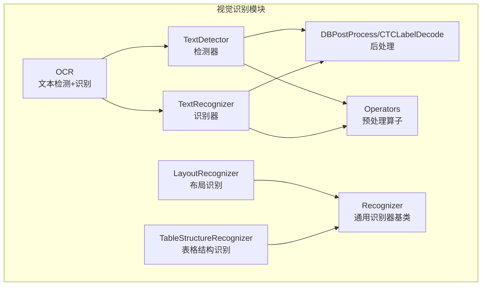
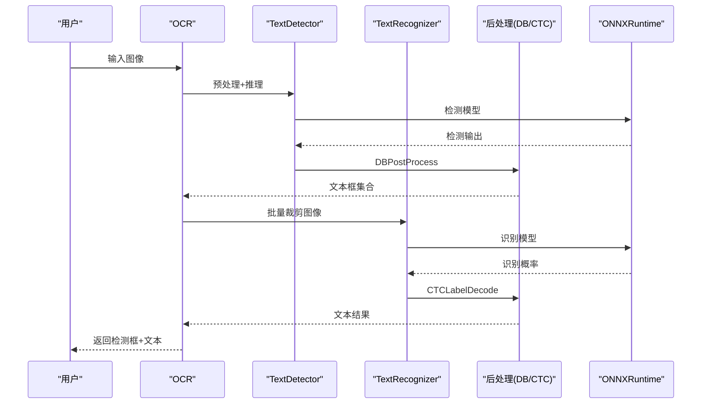
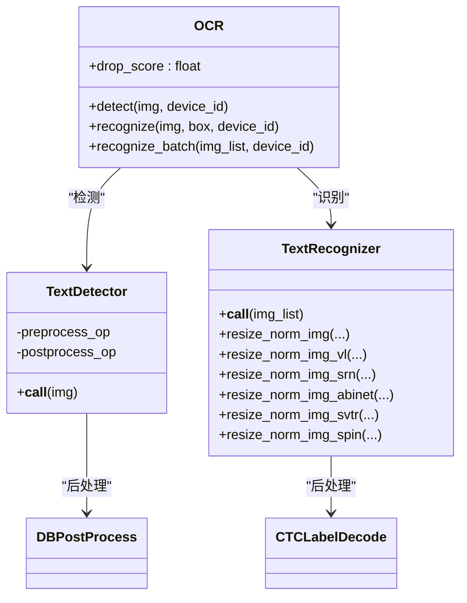
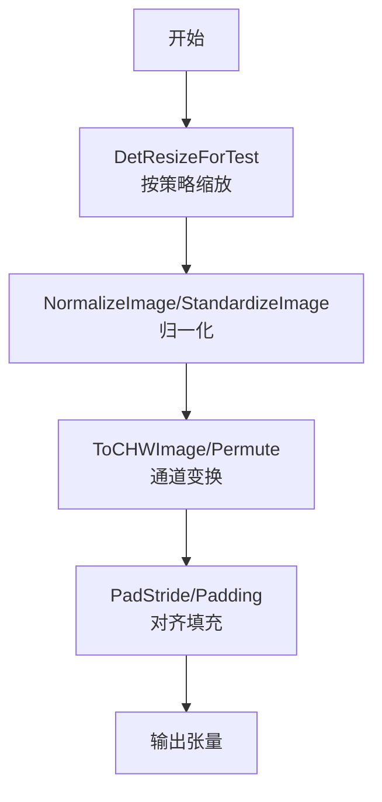
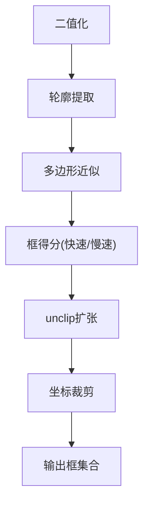
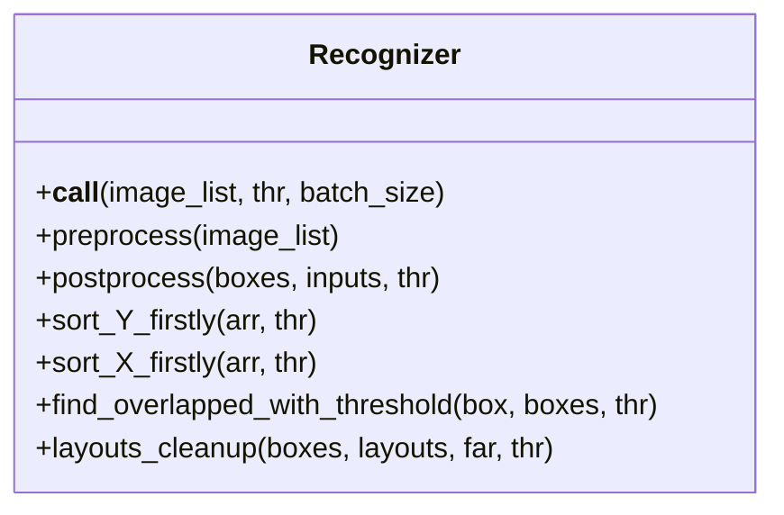
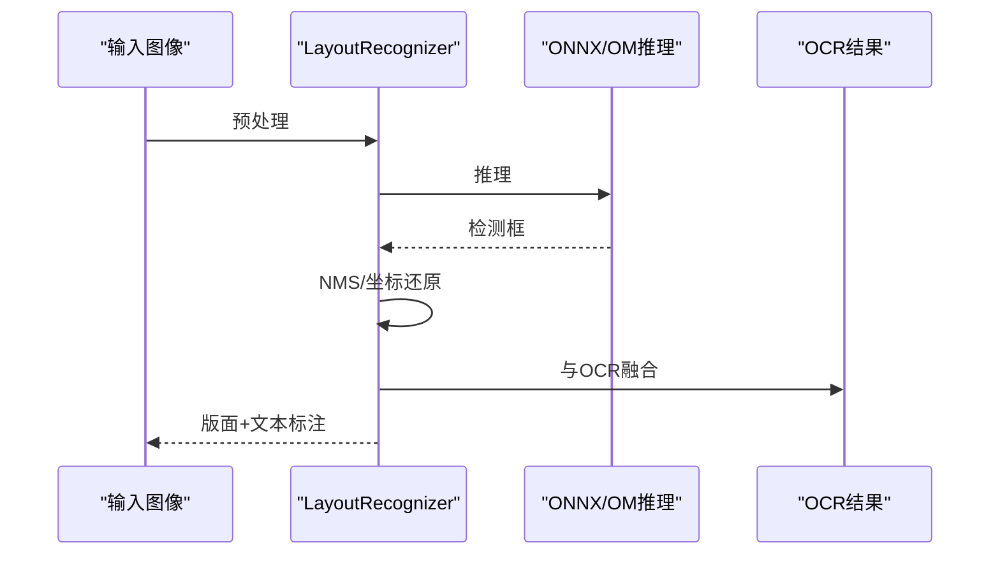
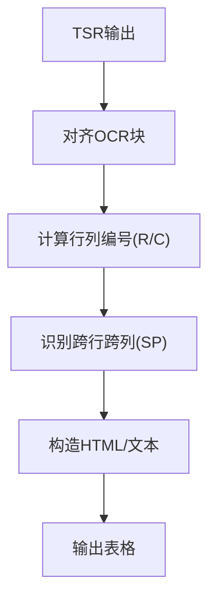
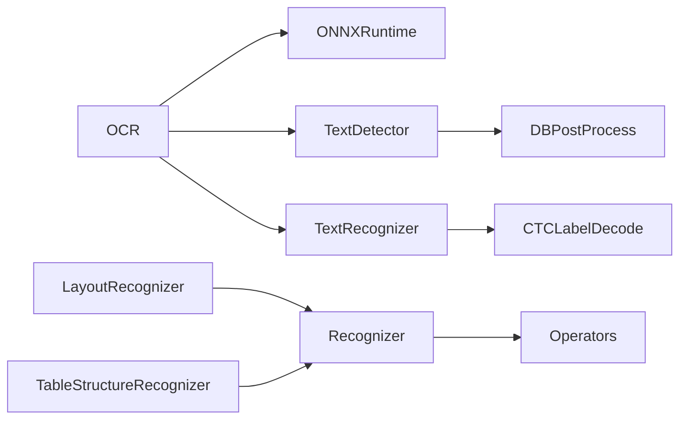

# 图像识别与处理

<cite>
**本文引用的文件**
- [deepdoc/vision/__init__.py](file://deepdoc/vision/__init__.py)
- [deepdoc/vision/ocr.py](file://deepdoc/vision/ocr.py)
- [deepdoc/vision/operators.py](file://deepdoc/vision/operators.py)
- [deepdoc/vision/postprocess.py](file://deepdoc/vision/postprocess.py)
- [deepdoc/vision/recognizer.py](file://deepdoc/vision/recognizer.py)
- [deepdoc/vision/layout_recognizer.py](file://deepdoc/vision/layout_recognizer.py)
- [deepdoc/vision/table_structure_recognizer.py](file://deepdoc/vision/table_structure_recognizer.py)
- [deepdoc/vision/t_recognizer.py](file://deepdoc/vision/t_recognizer.py)
- [deepdoc/parser/pdf_parser.py](file://deepdoc/parser/pdf_parser.py)
- [deepdoc/parser/docling_parser.py](file://deepdoc/parser/docling_parser.py)
</cite>

## 目录
1. [简介](#简介)
2. [项目结构](#项目结构)
3. [核心组件](#核心组件)
4. [架构总览](#架构总览)
5. [详细组件分析](#详细组件分析)
6. [依赖关系分析](#依赖关系分析)
7. [性能考量](#性能考量)
8. [故障排查指南](#故障排查指南)
9. [结论](#结论)
10. [附录](#附录)

## 简介
本技术文档聚焦于图像识别与处理能力，覆盖以下方面：
- 图像预处理：去噪、对比度调整、尺寸标准化、通道格式转换等
- 文本检测与识别：多模型适配、后处理解码、批量推理与旋转裁剪
- 布局识别与表格结构识别：版面元素分类、表格单元格与跨行跨列合并
- 图像增强与修复：插值、填充、归一化、NMS过滤
- 质量评估与优化：阈值与置信度策略、批大小与线程控制、GPU内存管理
- 配置参数与使用示例：环境变量、ONNX 推理会话、多设备并行
- 性能测试与调优建议：基于仓库内参数的实操建议

## 项目结构
本功能主要位于 deepdoc/vision 子模块，围绕 OCR、布局识别、表格结构识别三大任务构建，并通过统一的 Recognizer 抽象封装 ONNX 推理流程。

图示来源
- [deepdoc/vision/ocr.py:542-758](file://deepdoc/vision/ocr.py#L542-L758)
- [deepdoc/vision/postprocess.py:25-371](file://deepdoc/vision/postprocess.py#L25-L371)
- [deepdoc/vision/operators.py:1-734](file://deepdoc/vision/operators.py#L1-L734)
- [deepdoc/vision/recognizer.py:31-443](file://deepdoc/vision/recognizer.py#L31-L443)
- [deepdoc/vision/layout_recognizer.py:33-458](file://deepdoc/vision/layout_recognizer.py#L33-L458)
- [deepdoc/vision/table_structure_recognizer.py:30-613](file://deepdoc/vision/table_structure_recognizer.py#L30-L613)

章节来源
- [deepdoc/vision/__init__.py:22-90](file://deepdoc/vision/__init__.py#L22-L90)

## 核心组件
- OCR：统一入口，封装 TextDetector 与 TextRecognizer 的流水线，支持旋转裁剪与批量识别
- TextDetector：基于 DB 的文本区域检测，后处理采用 DBPostProcess
- TextRecognizer：文本识别器，支持多种归一化与模型输入格式
- Recognizer：通用识别器基类，封装 ONNX 推理、预处理、后处理与批处理
- 布局识别 LayoutRecognizer：版面元素识别与 OCR 结果融合
- 表格结构识别 TableStructureRecognizer：表格单元格、跨行跨列合并与 HTML 输出

章节来源
- [deepdoc/vision/ocr.py:542-758](file://deepdoc/vision/ocr.py#L542-L758)
- [deepdoc/vision/postprocess.py:25-371](file://deepdoc/vision/postprocess.py#L25-L371)
- [deepdoc/vision/recognizer.py:31-443](file://deepdoc/vision/recognizer.py#L31-L443)
- [deepdoc/vision/layout_recognizer.py:33-458](file://deepdoc/vision/layout_recognizer.py#L33-L458)
- [deepdoc/vision/table_structure_recognizer.py:30-613](file://deepdoc/vision/table_structure_recognizer.py#L30-L613)

## 架构总览
整体流程从图像输入到检测、识别、后处理与结果融合，支持多设备并行与 GPU 内存管理。

图示来源
- [deepdoc/vision/ocr.py:542-758](file://deepdoc/vision/ocr.py#L542-L758)
- [deepdoc/vision/postprocess.py:25-371](file://deepdoc/vision/postprocess.py#L25-L371)

## 详细组件分析

### OCR 组件
- 检测器 TextDetector
  - 预处理：DetResizeForTest、NormalizeImage、ToCHWImage、KeepKeys
  - 后处理：DBPostProcess（阈值、非极大值抑制、多边形/四边形）
- 识别器 TextRecognizer
  - 多种归一化方法：resize_norm_img、resize_norm_img_vl、resize_norm_img_srn、resize_norm_img_abinet、resize_norm_img_svtr、resize_norm_img_spin
  - 后处理：CTCLabelDecode
  - 批量推理与排序，按宽高比聚合以提升吞吐
- OCR 统一接口
  - detect/recognize/recognize_batch/调用，支持旋转裁剪与置信度过滤

图示来源
- [deepdoc/vision/ocr.py:420-758](file://deepdoc/vision/ocr.py#L420-L758)
- [deepdoc/vision/postprocess.py:25-371](file://deepdoc/vision/postprocess.py#L25-L371)

章节来源
- [deepdoc/vision/ocr.py:420-758](file://deepdoc/vision/ocr.py#L420-L758)
- [deepdoc/vision/postprocess.py:25-371](file://deepdoc/vision/postprocess.py#L25-L371)

### 预处理与尺寸标准化
- DetResizeForTest：按最大边/最小边/长边固定方式缩放，保证对齐到 32 或 128 的步长
- E2EResizeForTest：TotalText 数据集专用缩放策略
- ResizeNormalize：PIL 尺寸重采样与归一化
- GrayImageChannelFormat：灰度通道扩展与可选反相
- NormalizeImage/StandardizeImage：均值方差归一化
- Permute/ToCHWImage：通道顺序转换
- PadStride：FPN 对齐填充

图示来源
- [deepdoc/vision/operators.py:302-497](file://deepdoc/vision/operators.py#L302-L497)
- [deepdoc/vision/operators.py:587-620](file://deepdoc/vision/operators.py#L587-L620)
- [deepdoc/vision/operators.py:106-137](file://deepdoc/vision/operators.py#L106-L137)

章节来源
- [deepdoc/vision/operators.py:302-497](file://deepdoc/vision/operators.py#L302-L497)
- [deepdoc/vision/operators.py:587-620](file://deepdoc/vision/operators.py#L587-L620)
- [deepdoc/vision/operators.py:106-137](file://deepdoc/vision/operators.py#L106-L137)

### 后处理与解码
- DBPostProcess
  - 二值化、轮廓提取、多边形近似、unclip、分数计算、快速/慢速评分模式
- CTCLabelDecode
  - CTC 解码、空格处理、特殊字符映射

图示来源
- [deepdoc/vision/postprocess.py:41-259](file://deepdoc/vision/postprocess.py#L41-L259)

章节来源
- [deepdoc/vision/postprocess.py:25-371](file://deepdoc/vision/postprocess.py#L25-L371)

### 通用识别器 Recognizer
- 统一加载 ONNX 模型、输入/输出名称解析、批处理循环
- preprocess/postprocess 支持两类模型：带 scale_factor 的 YOLO 类与无 scale_factor 的通用类
- 提供排序、重叠判断、布局清理、NMS 过滤等工具方法

图示来源
- [deepdoc/vision/recognizer.py:31-443](file://deepdoc/vision/recognizer.py#L31-L443)

章节来源
- [deepdoc/vision/recognizer.py:31-443](file://deepdoc/vision/recognizer.py#L31-L443)

### 布局识别 LayoutRecognizer
- 支持 YOLOv10 与 Ascend OM 模式
- 预处理：Letterbox 缩放、边界填充、RGB 归一化、通道变换
- 后处理：NMS、坐标还原、布局类型映射、与 OCR 结果融合

图示来源
- [deepdoc/vision/layout_recognizer.py:164-238](file://deepdoc/vision/layout_recognizer.py#L164-L238)
- [deepdoc/vision/layout_recognizer.py:241-458](file://deepdoc/vision/layout_recognizer.py#L241-L458)

章节来源
- [deepdoc/vision/layout_recognizer.py:33-458](file://deepdoc/vision/layout_recognizer.py#L33-L458)

### 表格结构识别 TableStructureRecognizer
- 识别表格列、行、表头、跨行跨列等结构
- 与 OCR 结果对齐，计算行列编号、跨行跨列跨度，生成 HTML 或描述性文本

图示来源
- [deepdoc/vision/table_structure_recognizer.py:54-111](file://deepdoc/vision/table_structure_recognizer.py#L54-L111)
- [deepdoc/vision/table_structure_recognizer.py:151-350](file://deepdoc/vision/table_structure_recognizer.py#L151-L350)

章节来源
- [deepdoc/vision/table_structure_recognizer.py:30-613](file://deepdoc/vision/table_structure_recognizer.py#L30-L613)

### PDF 与页面图像处理
- PDFParser：基于 Docling 的页面图像提取与裁剪
- DoclingParser：页面转图像、位置标签提取、按标签裁剪

章节来源
- [deepdoc/parser/pdf_parser.py:117-143](file://deepdoc/parser/pdf_parser.py#L117-L143)
- [deepdoc/parser/docling_parser.py:87-143](file://deepdoc/parser/docling_parser.py#L87-L143)

## 依赖关系分析
- OCR 依赖 ONNXRuntime，支持 CPU/GPU Provider，具备线程与内存配置
- Recognizer 抽象出统一的预处理/后处理与批处理逻辑
- 布局与表格识别复用 Recognizer 的通用能力
- 工具函数如 nms、overlapped_area 在多个模块中被调用

图示来源
- [deepdoc/vision/ocr.py:71-136](file://deepdoc/vision/ocr.py#L71-L136)
- [deepdoc/vision/recognizer.py:31-53](file://deepdoc/vision/recognizer.py#L31-L53)
- [deepdoc/vision/layout_recognizer.py:33-62](file://deepdoc/vision/layout_recognizer.py#L33-L62)
- [deepdoc/vision/table_structure_recognizer.py:40-52](file://deepdoc/vision/table_structure_recognizer.py#L40-L52)

章节来源
- [deepdoc/vision/ocr.py:71-136](file://deepdoc/vision/ocr.py#L71-L136)
- [deepdoc/vision/recognizer.py:31-53](file://deepdoc/vision/recognizer.py#L31-L53)

## 性能考量
- 线程与内存
  - OCR_INTRA_OP_NUM_THREADS/OCR_INTER_OP_NUM_THREADS 控制 ONNXRuntime 线程数
  - OCR_GPU_MEM_LIMIT_MB 限制 GPU 显存
  - OCR_GPUMEM_ARENA_SHRINKAGE 可启用 GPU Arena 收缩释放显存
- 批大小与设备并行
  - settings.PARALLEL_DEVICES 控制多 GPU 并行实例数量
  - TextRecognizer.rec_batch_num 控制识别批大小
- 尺寸与对齐
  - DetResizeForTest 将尺寸对齐到 32/128 步长，减少模型侧 padding 开销
- 后处理
  - DBPostProcess 的阈值与 unclip_ratio 影响召回与稳定性
  - CTCLabelDecode 的置信度阈值 drop_score 控制最终输出

章节来源
- [deepdoc/vision/ocr.py:96-136](file://deepdoc/vision/ocr.py#L96-L136)
- [deepdoc/vision/ocr.py:139-176](file://deepdoc/vision/ocr.py#L139-L176)
- [deepdoc/vision/operators.py:346-429](file://deepdoc/vision/operators.py#L346-L429)
- [deepdoc/vision/postprocess.py:46-67](file://deepdoc/vision/postprocess.py#L46-L67)

## 故障排查指南
- 模型加载失败
  - 确认模型文件存在或自动下载路径正确
  - 检查 PARALLEL_DEVICES 与设备 ID 设置
- GPU 不可用
  - 确认 CUDA 可用与设备号有效
  - 调整 OCR_GPU_MEM_LIMIT_MB 与 arena 策略
- 推理异常
  - 检查预处理尺寸与模型输入形状是否匹配
  - 使用较小 batch_size 或降低分辨率以缓解 OOM
- 结果不理想
  - 调整 DBPostProcess 的阈值、box_thresh、unclip_ratio
  - 调整 drop_score 与 OCR 的置信度策略

章节来源
- [deepdoc/vision/ocr.py:71-136](file://deepdoc/vision/ocr.py#L71-L136)
- [deepdoc/vision/postprocess.py:46-67](file://deepdoc/vision/postprocess.py#L46-L67)

## 结论
该系统以 Recognizer 为核心抽象，结合 OCR、布局识别与表格结构识别，形成完整的图像识别与处理链路。通过可配置的预处理、后处理与推理参数，可在不同硬件与场景下取得较好的识别准确率与处理效率。建议在生产环境中结合业务场景动态调整阈值、批大小与线程配置，并利用 GPU 内存收缩策略避免显存溢出。

## 附录

### 配置参数与使用示例
- 环境变量
  - OCR_INTRA_OP_NUM_THREADS/OCR_INTER_OP_NUM_THREADS：控制 ONNXRuntime 线程
  - OCR_GPU_MEM_LIMIT_MB：限制 GPU 显存（MB）
  - OCR_ARENA_EXTEND_STRATEGY：GPU Arena 扩展策略
  - OCR_GPUMEM_ARENA_SHRINKAGE：启用 GPU Arena 收缩
  - PARALLEL_DEVICES：多 GPU 并行实例数
  - TABLE_STRUCTURE_RECOGNIZER_TYPE：tsr 模式（onnx/ascend）
  - TENSORRT_DLA_SVR：布局识别 DLA 服务地址
  - ASCEND_LAYOUT_RECOGNIZER_DEVICE_ID：Ascend 设备号
- 示例命令
  - 布局识别：python t_recognizer.py --inputs <路径> --mode layout --threshold 0.5
  - 表格结构识别：python t_recognizer.py --inputs <路径> --mode tsr --threshold 0.5

章节来源
- [deepdoc/vision/ocr.py:96-136](file://deepdoc/vision/ocr.py#L96-L136)
- [deepdoc/vision/layout_recognizer.py:58-61](file://deepdoc/vision/layout_recognizer.py#L58-L61)
- [deepdoc/vision/table_structure_recognizer.py:55-57](file://deepdoc/vision/table_structure_recognizer.py#L55-L57)
- [deepdoc/vision/t_recognizer.py:172-186](file://deepdoc/vision/t_recognizer.py#L172-L186)