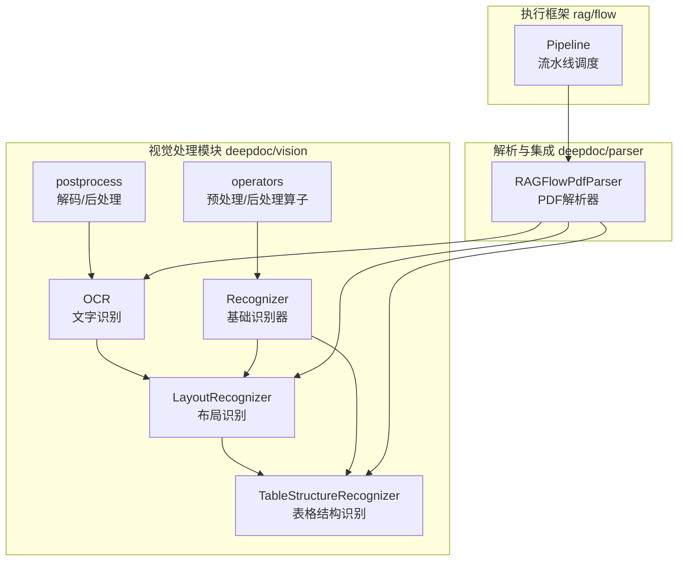
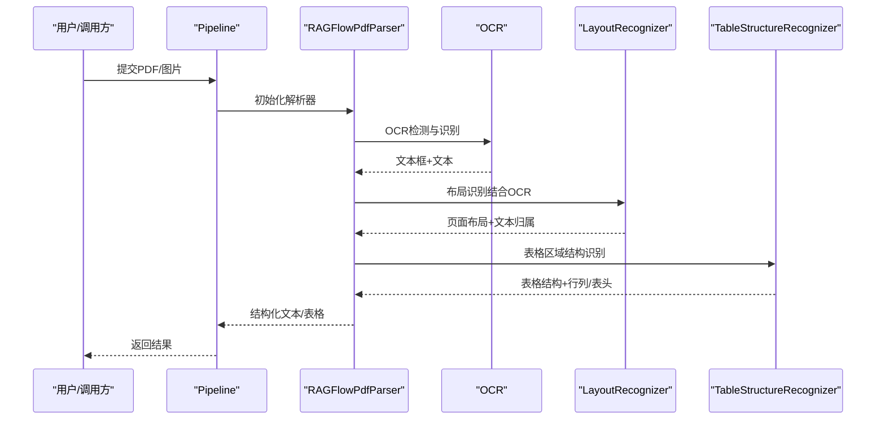
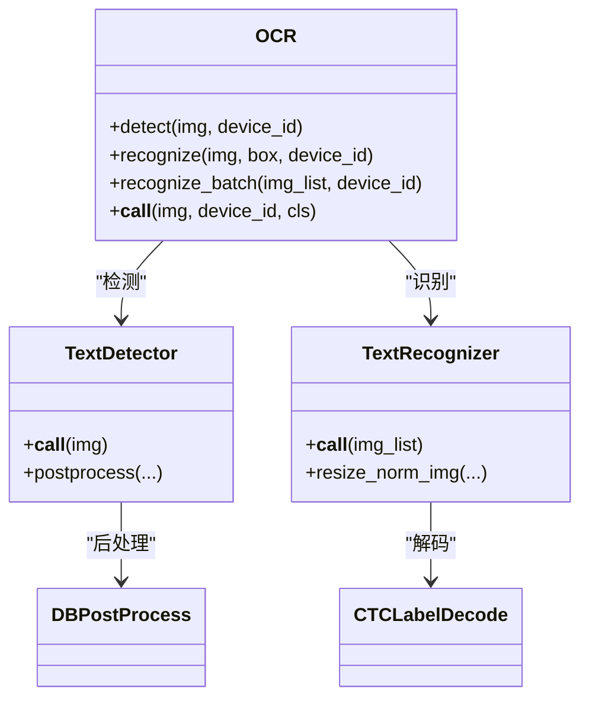
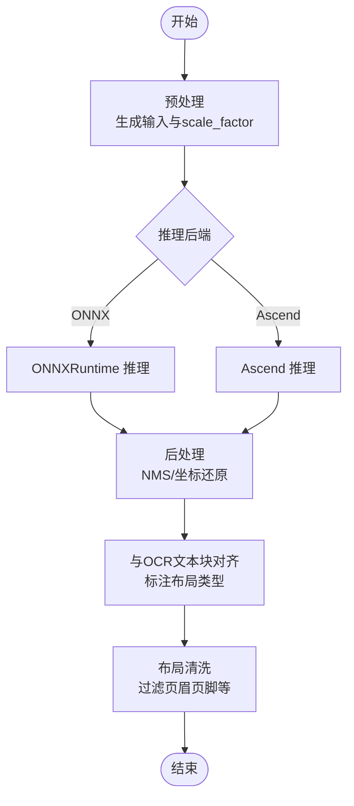
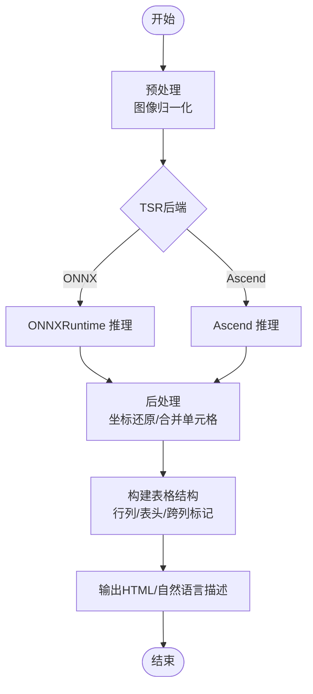
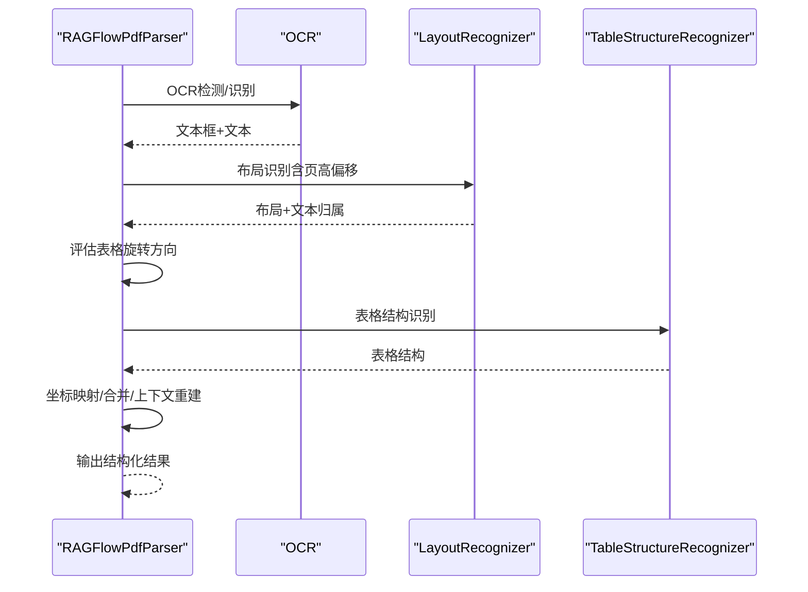
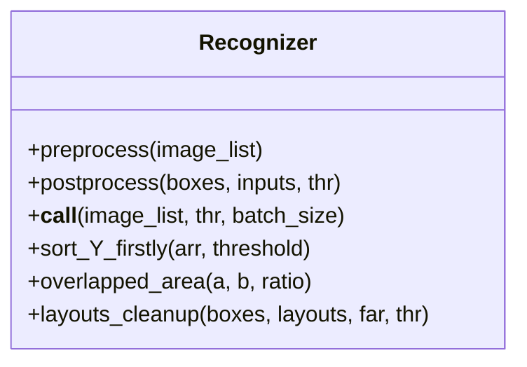
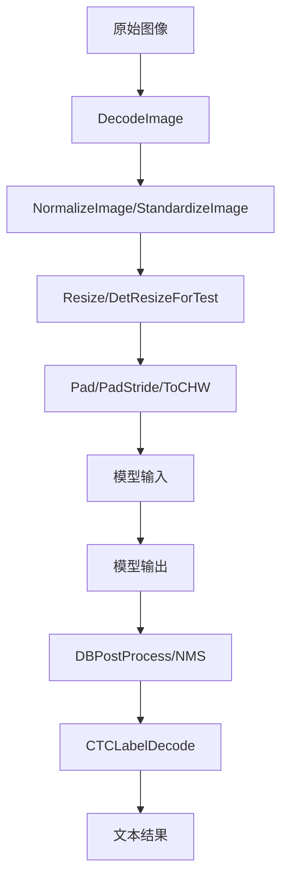
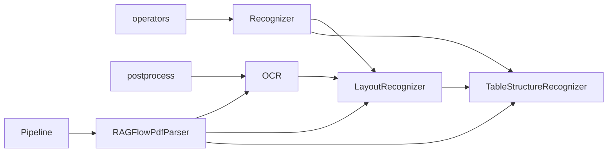

# 多模态处理

<cite>
**本文引用的文件**
- [deepdoc/vision/__init__.py](file://deepdoc/vision/__init__.py)
- [deepdoc/vision/ocr.py](file://deepdoc/vision/ocr.py)
- [deepdoc/vision/layout_recognizer.py](file://deepdoc/vision/layout_recognizer.py)
- [deepdoc/vision/table_structure_recognizer.py](file://deepdoc/vision/table_structure_recognizer.py)
- [deepdoc/vision/recognizer.py](file://deepdoc/vision/recognizer.py)
- [deepdoc/vision/operators.py](file://deepdoc/vision/operators.py)
- [deepdoc/vision/postprocess.py](file://deepdoc/vision/postprocess.py)
- [deepdoc/parser/pdf_parser.py](file://deepdoc/parser/pdf_parser.py)
- [rag/flow/pipeline.py](file://rag/flow/pipeline.py)
- [deepdoc/README.md](file://deepdoc/README.md)
- [deepdoc/README_zh.md](file://deepdoc/README_zh.md)
</cite>

## 目录
1. [简介](#简介)
2. [项目结构](#项目结构)
3. [核心组件](#核心组件)
4. [架构总览](#架构总览)
5. [详细组件分析](#详细组件分析)
6. [依赖关系分析](#依赖关系分析)
7. [性能考虑](#性能考虑)
8. [故障排查指南](#故障排查指南)
9. [结论](#结论)
10. [附录](#附录)

## 简介
本技术文档围绕多模态处理能力展开，重点覆盖图像识别与处理中的OCR文字识别、文档布局分析、表格结构识别等核心算法，并系统阐述多模态数据在系统内的统一处理架构、文本/图像/表格等异构数据的转换机制、视觉理解模型的应用（文档版面分析、关键信息抽取、格式保持）、多模态检索的实现思路、质量评估与优化策略、配置示例与性能调优建议，以及实用的故障诊断方法。目标是帮助开发者在RAGFlow中高效集成与优化多模态处理流程。

## 项目结构
多模态处理主要集中在 deepdoc 子模块的 vision 与 parser 包中，配合 rag.flow 的流水线执行框架，形成从图像到结构化文本与表格的完整链路。

**图表来源**
- [deepdoc/vision/ocr.py:542-758](file://deepdoc/vision/ocr.py#L542-L758)
- [deepdoc/vision/layout_recognizer.py:33-458](file://deepdoc/vision/layout_recognizer.py#L33-L458)
- [deepdoc/vision/table_structure_recognizer.py:30-613](file://deepdoc/vision/table_structure_recognizer.py#L30-L613)
- [deepdoc/vision/recognizer.py:31-443](file://deepdoc/vision/recognizer.py#L31-L443)
- [deepdoc/vision/operators.py:1-734](file://deepdoc/vision/operators.py#L1-L734)
- [deepdoc/vision/postprocess.py:25-371](file://deepdoc/vision/postprocess.py#L25-L371)
- [deepdoc/parser/pdf_parser.py:56-110](file://deepdoc/parser/pdf_parser.py#L56-L110)
- [rag/flow/pipeline.py:28-176](file://rag/flow/pipeline.py#L28-L176)

**章节来源**
- [deepdoc/vision/__init__.py:1-91](file://deepdoc/vision/__init__.py#L1-L91)
- [deepdoc/README.md:46-147](file://deepdoc/README.md#L46-L147)
- [deepdoc/README_zh.md:41-128](file://deepdoc/README_zh.md#L41-L128)

## 核心组件
- OCR（文字识别）：负责检测与识别图像中的文本，支持多GPU并行推理，具备旋转矫正与批量识别能力。
- 布局识别（LayoutRecognizer）：对文档页面进行版面分析，输出文本块与布局类型（文本、标题、图、表、公式等），并与OCR结果进行语义对齐。
- 表格结构识别（TableStructureRecognizer）：针对表格区域进行行列、表头、跨列/跨行等结构识别，并可生成HTML或自然语言描述。
- 基础识别器（Recognizer）：封装ONNX/Ascend推理、输入预处理、NMS/后处理、坐标映射等通用逻辑。
- PDF解析器（RAGFlowPdfParser）：整合OCR、布局识别、表格结构识别与上下文合并，输出结构化文本与表格内容。
- 执行流水线（Pipeline）：统一调度多模态处理组件，记录进度与日志，支持取消与异常处理。

**章节来源**
- [deepdoc/vision/ocr.py:542-758](file://deepdoc/vision/ocr.py#L542-L758)
- [deepdoc/vision/layout_recognizer.py:33-162](file://deepdoc/vision/layout_recognizer.py#L33-L162)
- [deepdoc/vision/table_structure_recognizer.py:30-112](file://deepdoc/vision/table_structure_recognizer.py#L30-L112)
- [deepdoc/vision/recognizer.py:31-112](file://deepdoc/vision/recognizer.py#L31-L112)
- [deepdoc/parser/pdf_parser.py:56-110](file://deepdoc/parser/pdf_parser.py#L56-L110)
- [rag/flow/pipeline.py:28-115](file://rag/flow/pipeline.py#L28-L115)

## 架构总览
多模态处理采用“先视觉、后结构”的分层架构：底层由OCR与布局识别提供几何与语义边界，上层通过表格结构识别与规则合并得到结构化内容。PDF解析器贯穿整条链路，负责页面级的坐标变换、旋转校正与上下文拼接。

**图表来源**
- [rag/flow/pipeline.py:117-176](file://rag/flow/pipeline.py#L117-L176)
- [deepdoc/parser/pdf_parser.py:56-110](file://deepdoc/parser/pdf_parser.py#L56-L110)
- [deepdoc/vision/ocr.py:669-758](file://deepdoc/vision/ocr.py#L669-L758)
- [deepdoc/vision/layout_recognizer.py:63-158](file://deepdoc/vision/layout_recognizer.py#L63-L158)
- [deepdoc/vision/table_structure_recognizer.py:54-111](file://deepdoc/vision/table_structure_recognizer.py#L54-L111)

## 详细组件分析

### OCR文字识别
- 功能要点
  - 文本检测与识别分离，支持多GPU并行推理，提升吞吐。
  - 自动旋转矫正：对倾斜文本块进行90°/270°旋转对比，选择更高置信度的识别结果。
  - 批量处理：按宽高比排序、批内归一化，减少填充与显存浪费。
  - ONNXRuntime后端：支持CPU/GPU执行，可配置线程数与显存上限。
- 关键路径
  - 文本检测：TextDetector + DBPostProcess
  - 文本识别：TextRecognizer + CTCLabelDecode
  - 旋转矫正：get_rotate_crop_image + 多方向OCR对比
- 性能与稳定性
  - 支持环境变量控制线程数与显存分配，便于资源受限场景调优。
  - 对异常重试与内存释放进行保护，避免长时间运行导致的资源泄漏。

**图表来源**
- [deepdoc/vision/ocr.py:420-758](file://deepdoc/vision/ocr.py#L420-L758)
- [deepdoc/vision/postprocess.py:41-260](file://deepdoc/vision/postprocess.py#L41-L260)
- [deepdoc/vision/postprocess.py:347-371](file://deepdoc/vision/postprocess.py#L347-L371)

**章节来源**
- [deepdoc/vision/ocr.py:542-758](file://deepdoc/vision/ocr.py#L542-L758)
- [deepdoc/vision/postprocess.py:25-371](file://deepdoc/vision/postprocess.py#L25-L371)

### 布局识别（LayoutRecognizer）
- 功能要点
  - 将OCR文本块与布局预测进行语义对齐，标注布局类型（文本、标题、图、表、公式等）。
  - 支持ONNX与Ascend两种推理后端，可按环境变量切换。
  - 清洗与去噪：基于重叠率与文本特征过滤页眉页脚等垃圾布局。
- 关键路径
  - 预处理：YOLO风格或通用预处理，生成scale_factor。
  - 推理：ONNXRuntime或Ascend InferSession。
  - 后处理：NMS与坐标还原，再与OCR文本块做重叠匹配。
- 与OCR融合
  - 通过重叠阈值与布局类型，将OCR文本归属到对应布局，便于后续表格/图的进一步处理。

**图表来源**
- [deepdoc/vision/layout_recognizer.py:164-238](file://deepdoc/vision/layout_recognizer.py#L164-L238)
- [deepdoc/vision/layout_recognizer.py:241-337](file://deepdoc/vision/layout_recognizer.py#L241-L337)
- [deepdoc/vision/layout_recognizer.py:339-458](file://deepdoc/vision/layout_recognizer.py#L339-L458)
- [deepdoc/vision/recognizer.py:283-408](file://deepdoc/vision/recognizer.py#L283-L408)

**章节来源**
- [deepdoc/vision/layout_recognizer.py:33-162](file://deepdoc/vision/layout_recognizer.py#L33-L162)
- [deepdoc/vision/recognizer.py:31-112](file://deepdoc/vision/recognizer.py#L31-L112)

### 表格结构识别（TableStructureRecognizer）
- 功能要点
  - 针对表格区域进行行列、表头、跨列/跨行等结构识别。
  - 支持ONNX与Ascend两种实现，可通过环境变量切换。
  - 输出标准化：对齐左右边界、计算合并单元格，生成HTML或自然语言描述。
- 关键路径
  - 预处理：图像转为网络输入张量。
  - 推理：ONNX或Ascend执行。
  - 后处理：坐标还原、合并单元格计算、行列/表头/跨列标记。
- 与OCR融合
  - 通过坐标映射与重叠匹配，将OCR文本归属到表格单元格，形成最终表格内容。

**图表来源**
- [deepdoc/vision/table_structure_recognizer.py:577-613](file://deepdoc/vision/table_structure_recognizer.py#L577-L613)
- [deepdoc/vision/table_structure_recognizer.py:151-350](file://deepdoc/vision/table_structure_recognizer.py#L151-L350)

**章节来源**
- [deepdoc/vision/table_structure_recognizer.py:30-112](file://deepdoc/vision/table_structure_recognizer.py#L30-L112)

### PDF解析器（RAGFlowPdfParser）
- 功能要点
  - 整合OCR、布局识别、表格结构识别，输出结构化文本与表格。
  - 表格自动旋转：评估0°/90°/180°/270°四种方向的OCR置信度，选择最优方向并重新OCR与坐标映射。
  - 上下文合并：基于垂直距离、布局类型、列编号等特征进行文本合并与段落重建。
- 关键路径
  - 页面级坐标累积（页高累加）。
  - 表格区域裁剪与旋转评估。
  - TSR结果与OCR文本的坐标映射与合并。
- 与流水线集成
  - 通过Pipeline统一调度，记录进度与异常，支持取消。

**图表来源**
- [deepdoc/parser/pdf_parser.py:56-110](file://deepdoc/parser/pdf_parser.py#L56-L110)
- [deepdoc/parser/pdf_parser.py:201-290](file://deepdoc/parser/pdf_parser.py#L201-L290)
- [deepdoc/parser/pdf_parser.py:292-395](file://deepdoc/parser/pdf_parser.py#L292-L395)
- [deepdoc/parser/pdf_parser.py:396-585](file://deepdoc/parser/pdf_parser.py#L396-L585)

**章节来源**
- [deepdoc/parser/pdf_parser.py:56-110](file://deepdoc/parser/pdf_parser.py#L56-L110)
- [deepdoc/parser/pdf_parser.py:201-290](file://deepdoc/parser/pdf_parser.py#L201-L290)
- [deepdoc/parser/pdf_parser.py:292-395](file://deepdoc/parser/pdf_parser.py#L292-L395)
- [deepdoc/parser/pdf_parser.py:396-585](file://deepdoc/parser/pdf_parser.py#L396-L585)

### 基础识别器（Recognizer）
- 功能要点
  - 统一封装ONNX/Ascend推理、输入构造、NMS与坐标还原。
  - 提供排序、重叠计算、布局清洗等工具函数，支撑上层布局与表格识别。
- 关键路径
  - preprocess：适配不同模型的输入格式（含scale_factor）。
  - postprocess：NMS/坐标还原/类别映射。
  - __call__：批处理循环与结果聚合。

**图表来源**
- [deepdoc/vision/recognizer.py:31-443](file://deepdoc/vision/recognizer.py#L31-L443)

**章节来源**
- [deepdoc/vision/recognizer.py:31-112](file://deepdoc/vision/recognizer.py#L31-L112)

### 预处理与后处理算子（operators/postprocess）
- 预处理（operators）
  - 图像解码、归一化、尺寸缩放、通道转换、填充等。
  - 支持不同模型的输入规范（如LinearResize/PadStride）。
- 后处理（postprocess）
  - DBPostProcess：二值化、轮廓提取、多边形近似、NMS。
  - CTCLabelDecode：CTC序列解码，支持空格字符与特殊字符表。

**图表来源**
- [deepdoc/vision/operators.py:27-270](file://deepdoc/vision/operators.py#L27-L270)
- [deepdoc/vision/postprocess.py:41-260](file://deepdoc/vision/postprocess.py#L41-L260)
- [deepdoc/vision/postprocess.py:347-371](file://deepdoc/vision/postprocess.py#L347-L371)

**章节来源**
- [deepdoc/vision/operators.py:1-734](file://deepdoc/vision/operators.py#L1-L734)
- [deepdoc/vision/postprocess.py:25-371](file://deepdoc/vision/postprocess.py#L25-L371)

## 依赖关系分析
- 模块耦合
  - OCR与布局识别、表格识别之间存在强依赖：布局识别依赖OCR文本块的几何与文本，表格识别依赖布局识别的表格区域定位。
  - Recognizer为OCR、Layout、TSR提供统一的推理接口与工具函数，降低重复代码。
- 外部依赖
  - ONNXRuntime（CPU/GPU）、Ascend InferSession（可选）、pdfplumber（PDF页面渲染）、sklearn（KMeans聚类）、xgboost（上下文合并特征模型）。
- 循环依赖
  - 未发现直接循环依赖；各模块职责清晰，通过接口与工具函数交互。

**图表来源**
- [deepdoc/vision/ocr.py:542-758](file://deepdoc/vision/ocr.py#L542-L758)
- [deepdoc/vision/layout_recognizer.py:33-162](file://deepdoc/vision/layout_recognizer.py#L33-L162)
- [deepdoc/vision/table_structure_recognizer.py:30-112](file://deepdoc/vision/table_structure_recognizer.py#L30-L112)
- [deepdoc/vision/recognizer.py:31-112](file://deepdoc/vision/recognizer.py#L31-L112)
- [deepdoc/parser/pdf_parser.py:56-110](file://deepdoc/parser/pdf_parser.py#L56-L110)
- [rag/flow/pipeline.py:28-115](file://rag/flow/pipeline.py#L28-L115)

**章节来源**
- [deepdoc/vision/__init__.py:1-91](file://deepdoc/vision/__init__.py#L1-L91)

## 性能考虑
- 并行与批处理
  - OCR支持多设备并行，通过PARALLEL_DEVICES配置；批大小与线程数可调，平衡吞吐与延迟。
- 推理后端选择
  - ONNXRuntime适合CPU/GPU通用场景；Ascend后端适合特定硬件加速场景，需正确设置设备ID与模型路径。
- 内存管理
  - 推理会话与模型缓存复用，避免重复加载；支持显存Arena收缩策略，降低峰值占用。
- 表格旋转校正
  - 自动旋转评估会增加额外OCR开销，可根据业务需求开启/关闭（环境变量控制）。
- 建议
  - 在GPU资源充足时优先使用GPU推理；对大批量文档，适当增大batch_size与线程数；对复杂表格可开启自动旋转以提升精度。

[本节为通用指导，无需具体文件引用]

## 故障排查指南
- 模型下载失败
  - 设置HF_ENDPOINT镜像源环境变量，参考视觉模块README中的指引。
- OCR识别质量差
  - 检查输入图像质量与分辨率；确认OCR置信度阈值设置合理；必要时调整旋转矫正策略。
- 布局识别误检/漏检
  - 调整布局识别阈值与NMS参数；检查预处理尺寸是否与模型输入一致。
- 表格结构识别错误
  - 确认表格区域裁剪是否准确；检查TSR后端类型与模型文件是否存在；必要时开启自动旋转。
- 流水线卡顿或崩溃
  - 查看Pipeline回调日志，定位耗时组件；检查Redis连接与任务状态更新；确保及时释放资源。

**章节来源**
- [deepdoc/README.md:46-147](file://deepdoc/README.md#L46-L147)
- [deepdoc/README_zh.md:41-128](file://deepdoc/README_zh.md#L41-L128)
- [rag/flow/pipeline.py:43-115](file://rag/flow/pipeline.py#L43-L115)

## 结论
RAGFlow的多模态处理以OCR为核心，结合布局识别与表格结构识别，形成从图像到结构化内容的完整链路。通过统一的Recognizer抽象、灵活的推理后端与完善的预/后处理管线，系统在准确性与性能之间取得良好平衡。建议在生产环境中根据硬件条件与业务需求，合理配置并调优相关参数，持续监控与迭代以获得更佳的处理效果。

[本节为总结性内容，无需具体文件引用]

## 附录

### 配置与环境变量清单
- OCR相关
  - OCR_INTRA_OP_NUM_THREADS：推理线程数（默认2）
  - OCR_INTER_OP_NUM_THREADS：推理线程数（默认2）
  - OCR_GPU_MEM_LIMIT_MB：GPU显存上限（MB，默认2048）
  - OCR_ARENA_EXTEND_STRATEGY：GPU Arena扩展策略
  - OCR_GPUMEM_ARENA_SHRINKAGE：启用GPU内存回收（1/0）
- 布局识别
  - LAYOUT_RECOGNIZER_TYPE：布局识别后端类型（onnx/ascend，默认onnx）
  - ASCEND_LAYOUT_RECOGNIZER_DEVICE_ID：Ascend设备ID（默认0）
- 表格结构识别
  - TABLE_STRUCTURE_RECOGNIZER_TYPE：TSR后端类型（onnx/ascend，默认onnx）
- 表格自动旋转
  - TABLE_AUTO_ROTATE：是否启用表格自动旋转（true/false，默认true）

**章节来源**
- [deepdoc/vision/ocr.py:96-136](file://deepdoc/vision/ocr.py#L96-L136)
- [deepdoc/vision/layout_recognizer.py:58-62](file://deepdoc/vision/layout_recognizer.py#L58-L62)
- [deepdoc/vision/table_structure_recognizer.py:54-65](file://deepdoc/vision/table_structure_recognizer.py#L54-L65)
- [deepdoc/parser/pdf_parser.py:75-90](file://deepdoc/parser/pdf_parser.py#L75-L90)