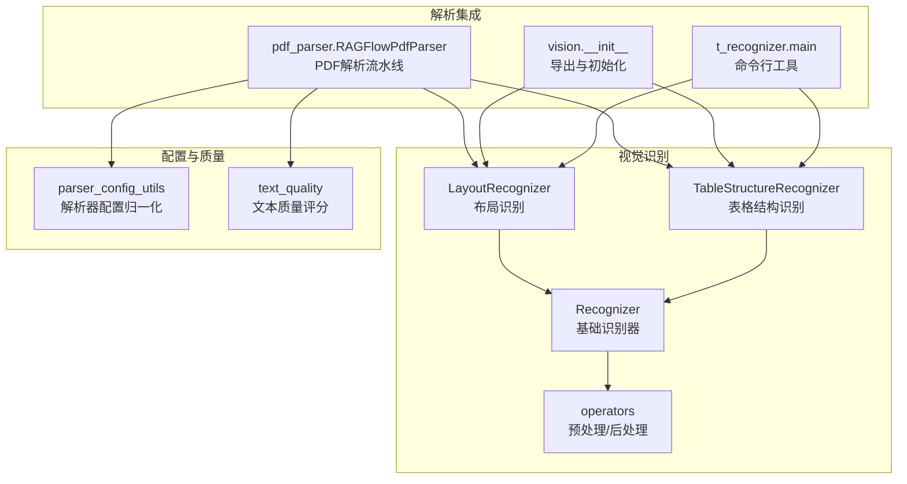
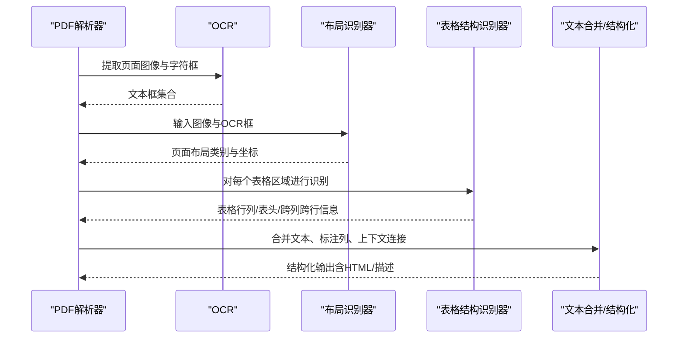
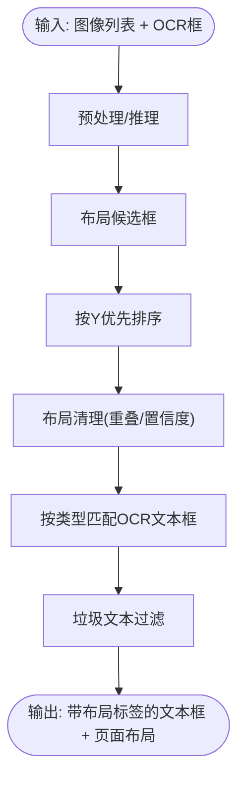
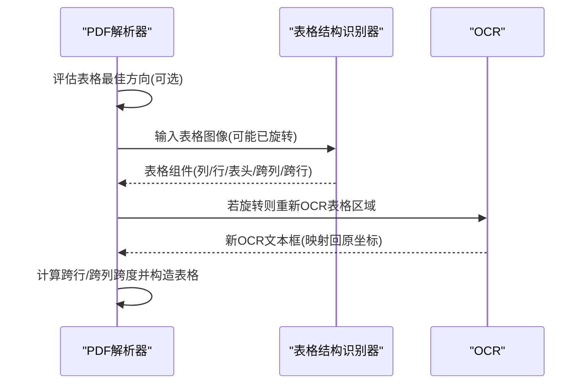
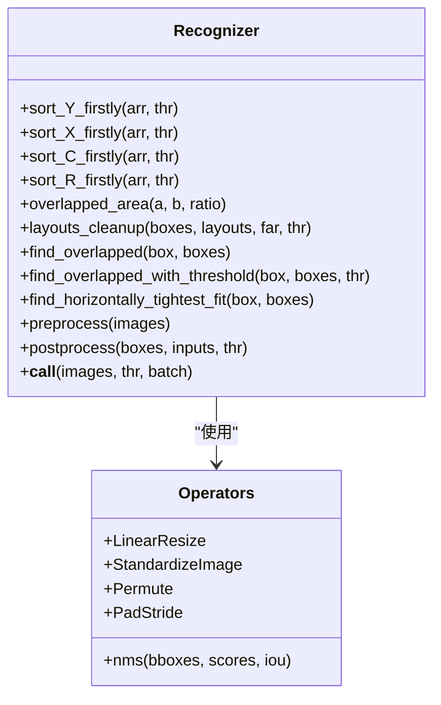
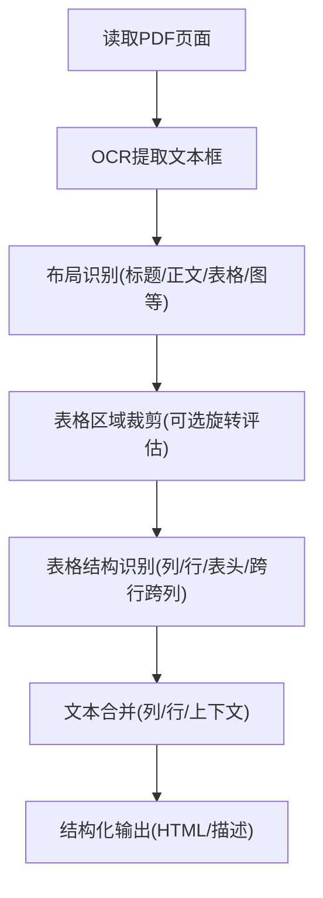
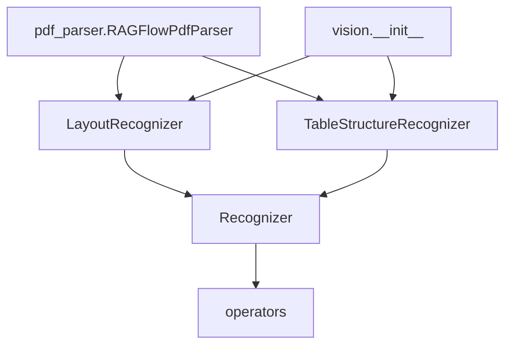

# 布局分析与结构识别

<cite>
**本文引用的文件**
- [layout_recognizer.py](file://deepdoc/vision/layout_recognizer.py)
- [table_structure_recognizer.py](file://deepdoc/vision/table_structure_recognizer.py)
- [recognizer.py](file://deepdoc/vision/recognizer.py)
- [operators.py](file://deepdoc/vision/operators.py)
- [pdf_parser.py](file://deepdoc/parser/pdf_parser.py)
- [__init__.py](file://deepdoc/vision/__init__.py)
- [t_recognizer.py](file://deepdoc/vision/t_recognizer.py)
- [parser_config_utils.py](file://common/parser_config_utils.py)
- [text_quality.py](file://common/text_quality.py)
</cite>

## 目录
1. [简介](#简介)
2. [项目结构](#项目结构)
3. [核心组件](#核心组件)
4. [架构总览](#架构总览)
5. [详细组件分析](#详细组件分析)
6. [依赖分析](#依赖分析)
7. [性能考虑](#性能考虑)
8. [故障排除指南](#故障排除指南)
9. [结论](#结论)
10. [附录](#附录)

## 简介
本技术文档聚焦于“布局分析与结构识别”能力，系统性阐述以下内容：
- 文档版面分析算法：页面元素检测、区域分割、布局分类与后处理
- 表格结构识别：表格边界检测、单元格定位、行列关系分析、跨页处理与旋转校正
- 复杂文档结构化处理：标题层级识别、段落分割、列表识别等
- 质量评估方法：准确性指标、错误检测、结果验证
- 配置选项与参数调优：模型选择、阈值、批大小、设备与加速器
- 实际应用案例与常见问题排查

## 项目结构
本功能主要位于 deepdoc/vision 子模块，配合 deepdoc/parser/pdf_parser 提供端到端流程集成，并通过 common/parser_config_utils 提供解析器配置标准化。

图示来源
- [layout_recognizer.py:33-158](file://deepdoc/vision/layout_recognizer.py#L33-L158)
- [table_structure_recognizer.py:30-111](file://deepdoc/vision/table_structure_recognizer.py#L30-L111)
- [recognizer.py:31-443](file://deepdoc/vision/recognizer.py#L31-L443)
- [operators.py:697-734](file://deepdoc/vision/operators.py#L697-L734)
- [pdf_parser.py:56-107](file://deepdoc/parser/pdf_parser.py#L56-L107)
- [__init__.py:22-90](file://deepdoc/vision/__init__.py#L22-L90)
- [t_recognizer.py:36-60](file://deepdoc/vision/t_recognizer.py#L36-L60)
- [parser_config_utils.py:20-35](file://common/parser_config_utils.py#L20-L35)
- [text_quality.py:312-348](file://common/text_quality.py#L312-L348)

章节来源
- [layout_recognizer.py:33-158](file://deepdoc/vision/layout_recognizer.py#L33-L158)
- [table_structure_recognizer.py:30-111](file://deepdoc/vision/table_structure_recognizer.py#L30-L111)
- [recognizer.py:31-443](file://deepdoc/vision/recognizer.py#L31-L443)
- [operators.py:697-734](file://deepdoc/vision/operators.py#L697-L734)
- [pdf_parser.py:56-107](file://deepdoc/parser/pdf_parser.py#L56-L107)
- [__init__.py:22-90](file://deepdoc/vision/__init__.py#L22-L90)
- [t_recognizer.py:36-60](file://deepdoc/vision/t_recognizer.py#L36-L60)
- [parser_config_utils.py:20-35](file://common/parser_config_utils.py#L20-L35)
- [text_quality.py:312-348](file://common/text_quality.py#L312-L348)

## 核心组件
- 基础识别器 Recognizer：统一的 ONNX 推理入口，提供排序、重叠判断、NMS、预处理/后处理模板
- 布局识别器 LayoutRecognizer：面向版面布局的识别与标签分配，支持多模型域与设备后端
- 表格结构识别器 TableStructureRecognizer：面向表格的行列/表头/跨列/跨行识别，支持 ONNX 与 Ascend
- PDF 解析器 RAGFlowPdfParser：串联 OCR、布局识别、表格识别、文本合并与结构化输出
- 命令行工具 t_recognizer：快速验证布局/表格识别结果
- 配置归一化 parser_config_utils：解析器名称与后端选择
- 文本质量 text_quality：对结构化后的文本进行质量评分

章节来源
- [recognizer.py:31-443](file://deepdoc/vision/recognizer.py#L31-L443)
- [layout_recognizer.py:33-158](file://deepdoc/vision/layout_recognizer.py#L33-L158)
- [table_structure_recognizer.py:30-111](file://deepdoc/vision/table_structure_recognizer.py#L30-L111)
- [pdf_parser.py:56-107](file://deepdoc/parser/pdf_parser.py#L56-L107)
- [t_recognizer.py:36-60](file://deepdoc/vision/t_recognizer.py#L36-L60)
- [parser_config_utils.py:20-35](file://common/parser_config_utils.py#L20-L35)
- [text_quality.py:312-348](file://common/text_quality.py#L312-L348)

## 架构总览
整体流程从 PDF 图像切片开始，依次执行 OCR 文本框提取、布局识别、表格结构识别、文本合并与结构化输出，并在必要时进行表格旋转校正与跨页处理。

图示来源
- [pdf_parser.py:586-650](file://deepdoc/parser/pdf_parser.py#L586-L650)
- [layout_recognizer.py:63-158](file://deepdoc/vision/layout_recognizer.py#L63-L158)
- [table_structure_recognizer.py:54-111](file://deepdoc/vision/table_structure_recognizer.py#L54-L111)
- [t_recognizer.py:36-60](file://deepdoc/vision/t_recognizer.py#L36-L60)

## 详细组件分析

### 布局识别器 LayoutRecognizer
- 功能要点
  - 使用 ONNX 或 Ascend 推理，输出页面级布局框（标题、正文、表格、图、公式、页眉页脚、参考文献等）
  - 将 OCR 文本框按布局覆盖关系进行标签分配，过滤垃圾文本
  - 对布局进行排序与清理，确保同一页面内布局与文本的对应关系
- 关键流程
  - 预处理与推理：统一走 Recognizer 的 preprocess/postprocess 流程
  - 标签分配：遍历布局类型，使用重叠度阈值匹配文本框，打上 layout_type 与 layoutno
  - 垃圾过滤：对页眉页脚等区域的文本进行保留策略判定，剔除重复或低价值文本
  - 输出：返回带布局标签的文本框与每页布局列表

图示来源
- [layout_recognizer.py:63-158](file://deepdoc/vision/layout_recognizer.py#L63-L158)
- [recognizer.py:55-176](file://deepdoc/vision/recognizer.py#L55-L176)

章节来源
- [layout_recognizer.py:33-158](file://deepdoc/vision/layout_recognizer.py#L33-L158)
- [recognizer.py:55-176](file://deepdoc/vision/recognizer.py#L55-L176)

### 表格结构识别器 TableStructureRecognizer
- 功能要点
  - 面向表格区域的细粒度识别：列、行、表头、跨列/跨行单元格
  - 对齐策略：根据行/列边界对齐，提升表格几何一致性
  - 表格构造：生成 HTML 或自然语言描述，自动计算跨行/跨列跨度
  - 跨页处理：基于 page_number 进行排序与对齐
  - 旋转校正：可选地对表格图像进行多角度评估与旋转，再进行识别与坐标映射
- 关键流程
  - 表格区域裁剪与可选旋转评估
  - 表格组件识别（列、行、表头、跨列/跨行）
  - 行列聚类与排序（按 R/C 标签分组）
  - 跨行/跨列跨度计算与单元格合并
  - 生成 HTML 或描述式表格

图示来源
- [pdf_parser.py:292-438](file://deepdoc/parser/pdf_parser.py#L292-L438)
- [table_structure_recognizer.py:54-111](file://deepdoc/vision/table_structure_recognizer.py#L54-L111)
- [table_structure_recognizer.py:496-575](file://deepdoc/vision/table_structure_recognizer.py#L496-L575)

章节来源
- [pdf_parser.py:292-438](file://deepdoc/parser/pdf_parser.py#L292-L438)
- [table_structure_recognizer.py:54-111](file://deepdoc/vision/table_structure_recognizer.py#L54-L111)
- [table_structure_recognizer.py:496-575](file://deepdoc/vision/table_structure_recognizer.py#L496-L575)

### 基础识别器 Recognizer 与预处理/后处理
- 排序与重叠
  - Y/X/R/C 优先排序，保证文本/表格的逻辑顺序
  - 重叠面积计算与阈值匹配，用于布局/表格组件关联
- 预处理/后处理
  - ONNX 推理路径：LinearResize + StandardizeImage + Permute + PadStride
  - 后处理：NMS、坐标反变换、类别筛选
- 批处理与设备
  - 支持批量推理与设备参数传递

图示来源
- [recognizer.py:55-407](file://deepdoc/vision/recognizer.py#L55-L407)
- [operators.py:205-270](file://deepdoc/vision/operators.py#L205-L270)
- [operators.py:646-673](file://deepdoc/vision/operators.py#L646-L673)
- [operators.py:710-734](file://deepdoc/vision/operators.py#L710-L734)

章节来源
- [recognizer.py:55-407](file://deepdoc/vision/recognizer.py#L55-L407)
- [operators.py:205-270](file://deepdoc/vision/operators.py#L205-L270)
- [operators.py:646-673](file://deepdoc/vision/operators.py#L646-L673)
- [operators.py:710-734](file://deepdoc/vision/operators.py#L710-L734)

### PDF 解析流水线 RAGFlowPdfParser
- OCR → 布局识别 → 表格识别 → 文本合并/结构化 → 跨页/旋转处理
- 列数估计：基于 KMeans 与轮廓聚类，结合 silhouette 分数选择最优列数
- 文本合并：同列/同行相邻文本合并，保留布局语义
- 表格旋转：对表格图像进行多角度评估，选择最佳方向并映射坐标

图示来源
- [pdf_parser.py:586-650](file://deepdoc/parser/pdf_parser.py#L586-L650)
- [pdf_parser.py:651-752](file://deepdoc/parser/pdf_parser.py#L651-L752)
- [pdf_parser.py:292-438](file://deepdoc/parser/pdf_parser.py#L292-L438)

章节来源
- [pdf_parser.py:586-752](file://deepdoc/parser/pdf_parser.py#L586-L752)
- [pdf_parser.py:292-438](file://deepdoc/parser/pdf_parser.py#L292-L438)

### 命令行工具 t_recognizer
- 支持两种模式：布局识别与表格结构识别
- 自动加载 LayoutRecognizer 或 TableStructureRecognizer 并输出可视化结果

章节来源
- [t_recognizer.py:36-60](file://deepdoc/vision/t_recognizer.py#L36-L60)
- [t_recognizer.py:61-169](file://deepdoc/vision/t_recognizer.py#L61-L169)

## 依赖分析
- 组件耦合
  - RAGFlowPdfParser 依赖 OCR、LayoutRecognizer、TableStructureRecognizer
  - LayoutRecognizer/TSR 基于 Recognizer 与 operators
  - 视觉模块通过 __init__.py 导出并被上层解析器使用
- 外部依赖
  - HuggingFace 模型下载与缓存
  - ONNX Runtime 推理
  - 可选 Ascend OM 模型（需要设备与驱动）

图示来源
- [pdf_parser.py:75-90](file://deepdoc/parser/pdf_parser.py#L75-L90)
- [layout_recognizer.py:48-57](file://deepdoc/vision/layout_recognizer.py#L48-L57)
- [table_structure_recognizer.py:40-52](file://deepdoc/vision/table_structure_recognizer.py#L40-L52)
- [__init__.py:22-90](file://deepdoc/vision/__init__.py#L22-L90)

章节来源
- [pdf_parser.py:75-90](file://deepdoc/parser/pdf_parser.py#L75-L90)
- [layout_recognizer.py:48-57](file://deepdoc/vision/layout_recognizer.py#L48-L57)
- [table_structure_recognizer.py:40-52](file://deepdoc/vision/table_structure_recognizer.py#L40-L52)
- [__init__.py:22-90](file://deepdoc/vision/__init__.py#L22-L90)

## 性能考虑
- 批处理与并发
  - Recognizer 默认批大小可调，建议根据 GPU 内存与吞吐权衡
  - PDF 解析器支持多设备并行限制，避免资源争用
- 预处理与后处理
  - 线性缩放与标准化减少推理前开销
  - NMS 与坐标反变换在后处理阶段完成，降低冗余计算
- 设备与加速
  - ONNX Runtime 与 Ascend OM 可选，按部署环境选择
  - TensorRT DLA 服务端可选，适合高吞吐场景
- 表格旋转
  - 多角度评估会增加计算成本，建议仅在识别精度显著提升时启用

章节来源
- [recognizer.py:415-437](file://deepdoc/vision/recognizer.py#L415-L437)
- [pdf_parser.py:72-74](file://deepdoc/parser/pdf_parser.py#L72-L74)
- [layout_recognizer.py:58-62](file://deepdoc/vision/layout_recognizer.py#L58-L62)

## 故障排除指南
- 布局识别误检/漏检
  - 调整布局识别阈值与 NMS 阈值；检查预处理尺寸与归一化是否一致
  - 确认垃圾文本过滤规则未误删有效文本
- 表格识别错位/跨行跨列错误
  - 检查表格旋转评估是否正确；必要时关闭自动旋转以对比结果
  - 校验列/行排序逻辑与重叠阈值
- 文本合并异常
  - 检查列数估计是否合理；调整相邻文本合并的 Y 方向阈值
- 模型加载失败
  - 确认 HuggingFace 镜像与网络可达；检查模型目录权限
- 设备/驱动问题
  - Ascend OM 文件存在性与设备号；TensorRT DLA 服务可用性

章节来源
- [layout_recognizer.py:383-457](file://deepdoc/vision/layout_recognizer.py#L383-L457)
- [table_structure_recognizer.py:577-612](file://deepdoc/vision/table_structure_recognizer.py#L577-L612)
- [pdf_parser.py:292-438](file://deepdoc/parser/pdf_parser.py#L292-L438)
- [recognizer.py:32-53](file://deepdoc/vision/recognizer.py#L32-L53)

## 结论
本方案通过“布局识别 + 表格结构识别 + 文本合并”的端到端流程，实现了对复杂文档的结构化理解。通过可配置的解析器与设备后端、完善的预处理/后处理管线以及表格旋转与跨页处理机制，能够在不同文档类型与硬件环境下获得稳定且高质量的结果。建议在生产环境中结合业务数据对阈值与模型进行针对性调优，并利用文本质量评分与人工抽检持续改进。

## 附录

### 配置选项与参数调优
- 布局识别
  - 识别器类型：ONNX 或 Ascend（通过环境变量选择）
  - 阈值与批大小：通过 Recognizer 的 thr 与 batch_size 控制
  - 垃圾文本过滤：可按需调整过滤规则
- 表格识别
  - TSR 类型：ONNX 或 Ascend（通过环境变量选择）
  - 旋转校正：auto_rotate 开关与评估阈值
  - 跨行/跨列跨度计算：基于重叠区域与边界对齐
- 文本合并
  - 列数估计：KMeans + 轮廓聚类 + 轮廓相似度
  - 合并阈值：Y 方向与 X 方向的邻接阈值
- 文本质量评估
  - 文本质量评分：基于有效字符比例、句子完整性和词汇多样性

章节来源
- [parser_config_utils.py:20-35](file://common/parser_config_utils.py#L20-L35)
- [layout_recognizer.py:63-158](file://deepdoc/vision/layout_recognizer.py#L63-L158)
- [table_structure_recognizer.py:54-111](file://deepdoc/vision/table_structure_recognizer.py#L54-L111)
- [pdf_parser.py:659-752](file://deepdoc/parser/pdf_parser.py#L659-L752)
- [text_quality.py:312-348](file://common/text_quality.py#L312-L348)