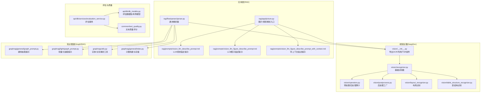
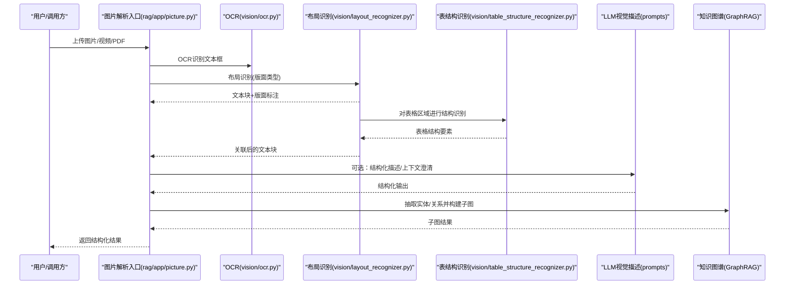
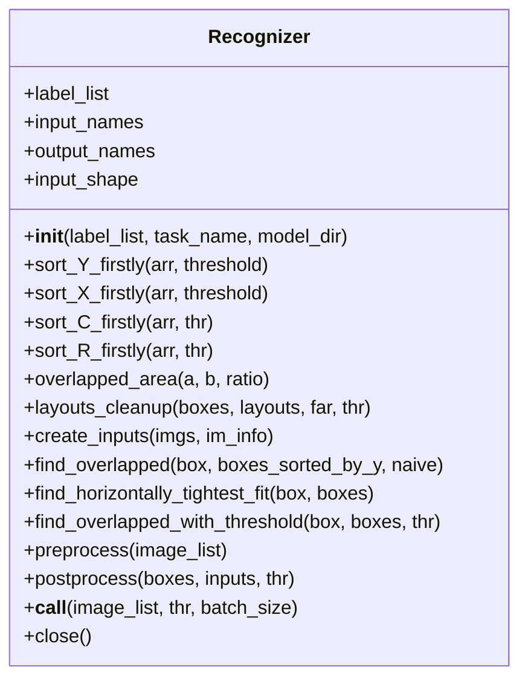
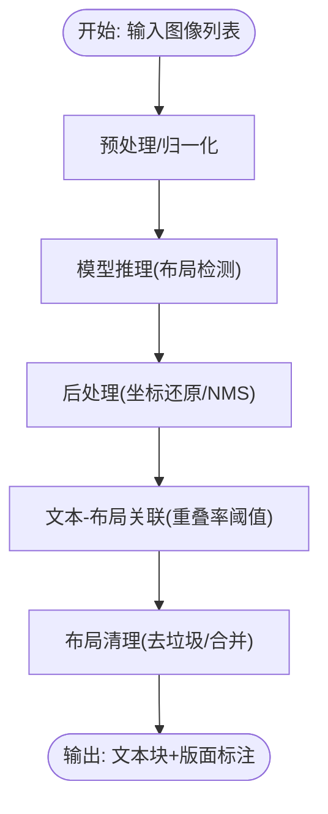
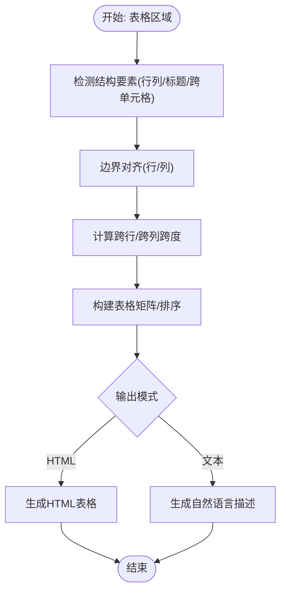
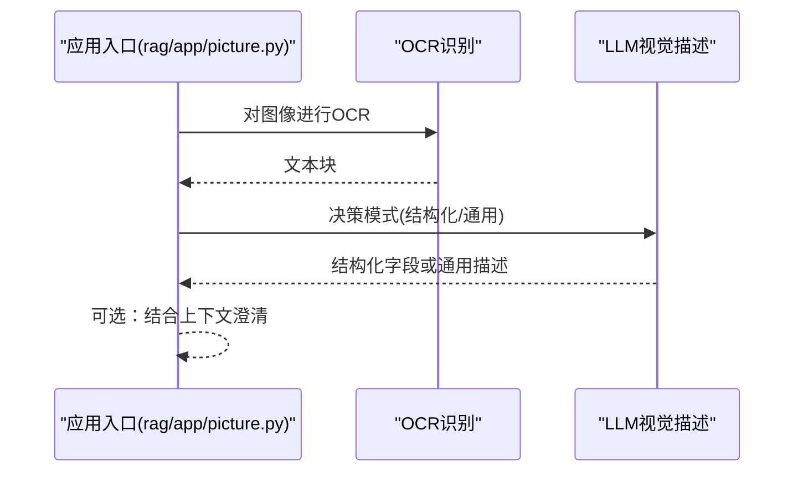
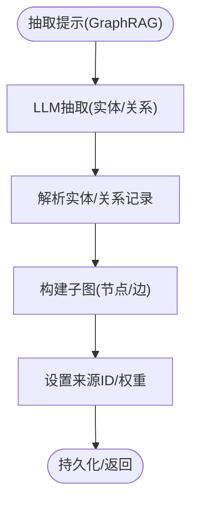
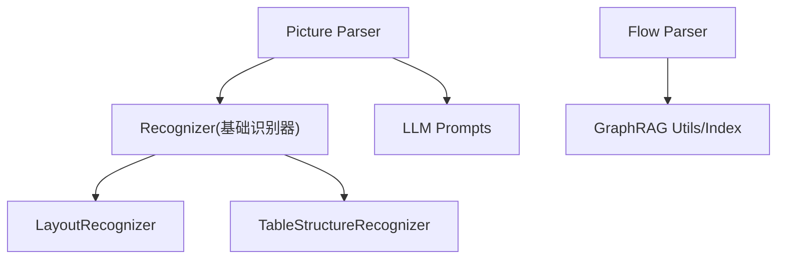

# 视觉理解与信息提取

<cite>
**本文引用的文件**
- [deepdoc/vision/__init__.py](file://deepdoc/vision/__init__.py)
- [deepdoc/vision/layout_recognizer.py](file://deepdoc/vision/layout_recognizer.py)
- [deepdoc/vision/table_structure_recognizer.py](file://deepdoc/vision/table_structure_recognizer.py)
- [deepdoc/vision/recognizer.py](file://deepdoc/vision/recognizer.py)
- [deepdoc/vision/operators.py](file://deepdoc/vision/operators.py)
- [deepdoc/vision/postprocess.py](file://deepdoc/vision/postprocess.py)
- [deepdoc/README.md](file://deepdoc/README.md)
- [deepdoc/README_zh.md](file://deepdoc/README_zh.md)
- [rag/app/picture.py](file://rag/app/picture.py)
- [rag/flow/parser/parser.py](file://rag/flow/parser/parser.py)
- [rag/prompts/vision_llm_describe_prompt.md](file://rag/prompts/vision_llm_describe_prompt.md)
- [rag/prompts/vision_llm_figure_describe_prompt.md](file://rag/prompts/vision_llm_figure_describe_prompt.md)
- [rag/prompts/vision_llm_figure_describe_prompt_with_context.md](file://rag/prompts/vision_llm_figure_describe_prompt_with_context.md)
- [graphrag/general/graph_prompt.py](file://graphrag/general/graph_prompt.py)
- [graphrag/light/graph_prompt.py](file://graphrag/light/graph_prompt.py)
- [graphrag/utils.py](file://graphrag/utils.py)
- [graphrag/general/index.py](file://graphrag/general/index.py)
- [api/db/services/evaluation_service.py](file://api/db/services/evaluation_service.py)
- [common/text_quality.py](file://common/text_quality.py)
- [api/db/db_models.py](file://api/db/db_models.py)
- [conf/system_settings.json](file://conf/system_settings.json)
</cite>

## 目录
1. [简介](#简介)
2. [项目结构](#项目结构)
3. [核心组件](#核心组件)
4. [架构总览](#架构总览)
5. [详细组件分析](#详细组件分析)
6. [依赖分析](#依赖分析)
7. [性能考虑](#性能考虑)
8. [故障排查指南](#故障排查指南)
9. [结论](#结论)
10. [附录](#附录)

## 简介
本技术文档聚焦于视觉理解与信息提取能力，系统性阐述以下主题：
- 视觉理解模型的应用：文档语义分析、关键信息抽取、格式保持与结构化输出
- 多模态信息融合：将视觉信息与文本信息有效结合，提升整体理解能力
- 结构化输出：元数据提取、关系建模、知识图谱构建
- 评估与质量控制：准确性、一致性、完整性等指标与流程
- 配置与优化：参数与算法调整策略，适配不同应用场景
- 实际使用场景与解决方案：常见问题诊断与处理

## 项目结构
围绕视觉理解与信息提取，相关模块主要分布在 deepdoc 视觉处理、rag 应用层、graphrag 知识图谱与评估体系中。下图展示与视觉理解直接相关的模块与交互：

**图表来源**
- [deepdoc/vision/__init__.py:83-91](file://deepdoc/vision/__init__.py#L83-L91)
- [deepdoc/vision/recognizer.py:31-53](file://deepdoc/vision/recognizer.py#L31-L53)
- [deepdoc/vision/operators.py:697-734](file://deepdoc/vision/operators.py#L697-L734)
- [deepdoc/vision/postprocess.py:25-38](file://deepdoc/vision/postprocess.py#L25-L38)
- [deepdoc/vision/layout_recognizer.py:33-56](file://deepdoc/vision/layout_recognizer.py#L33-L56)
- [deepdoc/vision/table_structure_recognizer.py:30-52](file://deepdoc/vision/table_structure_recognizer.py#L30-L52)
- [rag/app/picture.py:39-74](file://rag/app/picture.py#L39-L74)
- [rag/flow/parser/parser.py:603-636](file://rag/flow/parser/parser.py#L603-L636)
- [rag/prompts/vision_llm_describe_prompt.md:1-24](file://rag/prompts/vision_llm_describe_prompt.md#L1-L24)
- [rag/prompts/vision_llm_figure_describe_prompt.md:1-73](file://rag/prompts/vision_llm_figure_describe_prompt.md#L1-L73)
- [rag/prompts/vision_llm_figure_describe_prompt_with_context.md:1-83](file://rag/prompts/vision_llm_figure_describe_prompt_with_context.md#L1-L83)
- [graphrag/general/graph_prompt.py:8-23](file://graphrag/general/graph_prompt.py#L8-L23)
- [graphrag/light/graph_prompt.py:149-169](file://graphrag/light/graph_prompt.py#L149-L169)
- [graphrag/utils.py:233-271](file://graphrag/utils.py#L233-L271)
- [graphrag/general/index.py:428-463](file://graphrag/general/index.py#L428-L463)
- [api/db/services/evaluation_service.py:424-486](file://api/db/services/evaluation_service.py#L424-L486)
- [common/text_quality.py:312-348](file://common/text_quality.py#L312-L348)
- [api/db/db_models.py:1134-1155](file://api/db/db_models.py#L1134-L1155)

**章节来源**
- [deepdoc/README.md:46-147](file://deepdoc/README.md#L46-L147)
- [deepdoc/README_zh.md:41-128](file://deepdoc/README_zh.md#L41-L128)

## 核心组件
- 视觉识别器基础框架：统一的模型加载、输入预处理、推理执行与后处理流程，支持布局识别与表结构识别两类任务。
- 布局识别器：面向文档版面的多类别识别，支持多种后端（ONNX/TensorRT/Ascend），并提供布局清理与文本关联逻辑。
- 表结构识别器：针对表格区域进行行列/表头/跨单元格等结构要素识别，并生成HTML或自然语言描述。
- 图像解析入口：图片/视频统一入口，OCR识别与LLM视觉描述相结合，支撑多模态理解。
- 知识图谱抽取：基于提示词的实体与关系抽取，结合GraphRAG工具链完成子图构建与存储。
- 评估与质量控制：评估服务、用例模型与文本质量评分，形成闭环的质量保障。

**章节来源**
- [deepdoc/vision/recognizer.py:31-53](file://deepdoc/vision/recognizer.py#L31-L53)
- [deepdoc/vision/layout_recognizer.py:33-56](file://deepdoc/vision/layout_recognizer.py#L33-L56)
- [deepdoc/vision/table_structure_recognizer.py:30-52](file://deepdoc/vision/table_structure_recognizer.py#L30-L52)
- [rag/app/picture.py:39-74](file://rag/app/picture.py#L39-L74)
- [graphrag/general/graph_prompt.py:8-23](file://graphrag/general/graph_prompt.py#L8-L23)
- [graphrag/utils.py:233-271](file://graphrag/utils.py#L233-L271)
- [api/db/services/evaluation_service.py:424-486](file://api/db/services/evaluation_service.py#L424-L486)
- [common/text_quality.py:312-348](file://common/text_quality.py#L312-L348)

## 架构总览
视觉理解与信息提取的整体流程如下：
- 输入阶段：图片/视频/PDF页面进入解析入口，触发OCR与布局识别
- 视觉理解阶段：布局识别确定文本块所属版面类型，TSR对表格区域进行结构化解析
- 多模态融合阶段：将OCR文本与版面信息结合，必要时引入LLM进行结构化描述或上下文澄清
- 结构化输出阶段：生成Markdown/HTML/自然语言描述，同时抽取实体与关系，构建知识图谱子图
- 评估与质量控制：对生成内容进行质量评分与评估，持续优化参数与策略

**图表来源**
- [rag/app/picture.py:39-74](file://rag/app/picture.py#L39-L74)
- [deepdoc/vision/layout_recognizer.py:63-158](file://deepdoc/vision/layout_recognizer.py#L63-L158)
- [deepdoc/vision/table_structure_recognizer.py:54-111](file://deepdoc/vision/table_structure_recognizer.py#L54-L111)
- [rag/prompts/vision_llm_figure_describe_prompt.md:22-73](file://rag/prompts/vision_llm_figure_describe_prompt.md#L22-L73)
- [graphrag/general/index.py:428-463](file://graphrag/general/index.py#L428-L463)

## 详细组件分析

### 视觉识别器基础框架
- 统一模型加载：通过ORT会话加载模型，获取输入/输出名称与形状
- 预处理管线：支持线性缩放、标准化、通道变换与步长填充等
- 推理执行：批处理循环，按批次执行推理
- 后处理：坐标还原、NMS过滤、类别映射与阈值筛选

**图表来源**
- [deepdoc/vision/recognizer.py:31-53](file://deepdoc/vision/recognizer.py#L31-L53)
- [deepdoc/vision/recognizer.py:415-437](file://deepdoc/vision/recognizer.py#L415-L437)

**章节来源**
- [deepdoc/vision/recognizer.py:31-53](file://deepdoc/vision/recognizer.py#L31-L53)
- [deepdoc/vision/recognizer.py:283-312](file://deepdoc/vision/recognizer.py#L283-L312)
- [deepdoc/vision/recognizer.py:314-407](file://deepdoc/vision/recognizer.py#L314-L407)

### 布局识别器
- 支持多后端：ONNX/TensorRT DLA/Ascend OM
- 版面标签：文本、标题、图、图标题、表、表标题、页眉、页脚、参考文献、公式
- 文本与布局关联：计算重叠率，将OCR文本归属到对应版面类型
- 布局清理：去除垃圾布局（页眉/页脚/参考文献）并合并相邻版面

**图表来源**
- [deepdoc/vision/layout_recognizer.py:63-158](file://deepdoc/vision/layout_recognizer.py#L63-L158)

**章节来源**
- [deepdoc/vision/layout_recognizer.py:33-56](file://deepdoc/vision/layout_recognizer.py#L33-L56)
- [deepdoc/vision/layout_recognizer.py:99-158](file://deepdoc/vision/layout_recognizer.py#L99-L158)

### 表结构识别器
- 表结构标签：表、列、行、列标题、投影行标题、跨单元格
- 结构修复：对齐左右边界、对齐上下边界，修正行列跨度
- 输出形态：HTML表格或自然语言描述，支持跨页表格排序
- 上下文感知：可结合版面标题与上下文进行更准确的描述

**图表来源**
- [deepdoc/vision/table_structure_recognizer.py:54-111](file://deepdoc/vision/table_structure_recognizer.py#L54-L111)
- [deepdoc/vision/table_structure_recognizer.py:151-350](file://deepdoc/vision/table_structure_recognizer.py#L151-L350)

**章节来源**
- [deepdoc/vision/table_structure_recognizer.py:30-52](file://deepdoc/vision/table_structure_recognizer.py#L30-L52)
- [deepdoc/vision/table_structure_recognizer.py:151-350](file://deepdoc/vision/table_structure_recognizer.py#L151-L350)

### 图像解析入口与多模态融合
- 图片/视频统一入口：OCR识别文本，满足一定长度后进行分词与向量化
- LLM视觉描述：根据图示是否包含可枚举数据单元，选择结构化字段输出或通用内容描述
- 上下文增强：在存在上下文时，仅用于术语消歧，不作为新增信息来源

**图表来源**
- [rag/app/picture.py:39-74](file://rag/app/picture.py#L39-L74)
- [rag/prompts/vision_llm_figure_describe_prompt.md:22-73](file://rag/prompts/vision_llm_figure_describe_prompt.md#L22-L73)
- [rag/prompts/vision_llm_figure_describe_prompt_with_context.md:18-83](file://rag/prompts/vision_llm_figure_describe_prompt_with_context.md#L18-L83)

**章节来源**
- [rag/app/picture.py:39-74](file://rag/app/picture.py#L39-L74)
- [rag/prompts/vision_llm_figure_describe_prompt.md:1-73](file://rag/prompts/vision_llm_figure_describe_prompt.md#L1-L73)
- [rag/prompts/vision_llm_figure_describe_prompt_with_context.md:1-83](file://rag/prompts/vision_llm_figure_describe_prompt_with_context.md#L1-L83)

### 知识图谱构建与关系抽取
- 提示词驱动：通用/轻量化抽取提示，定义实体与关系抽取的格式与约束
- 实体/关系解析：从LLM输出中解析实体与关系记录，清洗与规范化
- 子图构建：将实体与关系写入子图，设置来源ID与权重，持久化存储

**图表来源**
- [graphrag/general/graph_prompt.py:8-23](file://graphrag/general/graph_prompt.py#L8-L23)
- [graphrag/light/graph_prompt.py:149-169](file://graphrag/light/graph_prompt.py#L149-L169)
- [graphrag/utils.py:233-271](file://graphrag/utils.py#L233-L271)
- [graphrag/general/index.py:428-463](file://graphrag/general/index.py#L428-L463)

**章节来源**
- [graphrag/general/graph_prompt.py:8-23](file://graphrag/general/graph_prompt.py#L8-L23)
- [graphrag/light/graph_prompt.py:149-169](file://graphrag/light/graph_prompt.py#L149-L169)
- [graphrag/utils.py:233-271](file://graphrag/utils.py#L233-L271)
- [graphrag/general/index.py:428-463](file://graphrag/general/index.py#L428-L463)

## 依赖分析
- 模块耦合
  - 视觉识别器基础类被布局识别器与表结构识别器继承复用
  - 图像解析入口依赖OCR与布局识别器；可选依赖LLM提示词
  - 知识图谱抽取依赖提示词与解析工具，最终写入子图索引
- 外部依赖
  - ONNX Runtime、OpenCV、NumPy、PIL等
  - HuggingFace Hub模型下载与缓存
  - 可选Ascend OM/TensorRT DLA推理后端

**图表来源**
- [deepdoc/vision/recognizer.py:31-53](file://deepdoc/vision/recognizer.py#L31-L53)
- [deepdoc/vision/layout_recognizer.py:33-56](file://deepdoc/vision/layout_recognizer.py#L33-L56)
- [deepdoc/vision/table_structure_recognizer.py:30-52](file://deepdoc/vision/table_structure_recognizer.py#L30-L52)
- [rag/app/picture.py:39-74](file://rag/app/picture.py#L39-L74)
- [graphrag/utils.py:233-271](file://graphrag/utils.py#L233-L271)
- [graphrag/general/index.py:428-463](file://graphrag/general/index.py#L428-L463)

**章节来源**
- [deepdoc/vision/recognizer.py:31-53](file://deepdoc/vision/recognizer.py#L31-L53)
- [rag/flow/parser/parser.py:603-636](file://rag/flow/parser/parser.py#L603-L636)

## 性能考虑
- 批处理与内存管理：识别器采用批处理循环，避免单张图像过大导致内存峰值；推理完成后及时释放资源
- 预处理与后处理：统一的预处理算子链与NMS后处理，减少重复计算与误检
- 后端选择：ONNX适合通用部署；TensorRT DLA/Ascend OM适合高性能推理场景
- 图像分辨率与缩放因子：合理设置缩放因子与目标尺寸，平衡精度与速度
- 布局清理与阈值：通过重叠率阈值与布局清理策略，减少冗余文本块，提升下游处理效率

[本节为通用指导，无需特定文件引用]

## 故障排查指南
- 模型加载失败
  - 现象：初始化识别器时报错或模型下载失败
  - 排查：确认HF_ENDPOINT环境变量、网络连通性与本地缓存路径权限
  - 参考：识别器初始化中的注释与异常处理
- 推理异常
  - 现象：推理报错或输出为空
  - 排查：检查输入形状、预处理参数与后处理阈值；确认模型后端可用
- 布局/表格识别不准确
  - 现象：版面类型错误或表格结构缺失
  - 排查：调整重叠率阈值、NMS阈值；确认图像清晰度与标注质量
- 文本质量与评估
  - 使用文本质量评分函数评估生成内容质量，结合评估服务汇总指标，定位问题根因

**章节来源**
- [deepdoc/vision/recognizer.py:32-48](file://deepdoc/vision/recognizer.py#L32-L48)
- [api/db/services/evaluation_service.py:424-486](file://api/db/services/evaluation_service.py#L424-L486)
- [common/text_quality.py:312-348](file://common/text_quality.py#L312-L348)

## 结论
本方案通过“视觉识别器基础框架 + 布局识别 + 表结构识别 + 多模态融合 + 知识图谱抽取”的完整链路，实现了从图像到结构化信息再到知识图谱的端到端能力。配合评估与质量控制机制，可在不同业务场景中持续优化参数与策略，确保准确性、一致性和完整性。

[本节为总结，无需特定文件引用]

## 附录

### 配置与优化策略
- 环境变量
  - HF_ENDPOINT：加速HuggingFace模型下载
  - TABLE_AUTO_ROTATE：控制表格自动旋转（默认开启）
  - TABLE_STRUCTURE_RECOGNIZER_TYPE：TSR后端选择（onnx/ascend）
  - TENSORRT_DLA_SVR：TensorRT DLA服务地址（可选）
  - ASCEND_LAYOUT_RECOGNIZER_DEVICE_ID：Ascend设备ID（可选）
- 系统设置
  - 参考系统设置JSON，了解通用系统参数项（邮件、白名单等）

**章节来源**
- [deepdoc/README.md:114-131](file://deepdoc/README.md#L114-L131)
- [deepdoc/README_zh.md:112-128](file://deepdoc/README_zh.md#L112-L128)
- [conf/system_settings.json:1-64](file://conf/system_settings.json#L1-L64)

### 实际使用场景与解决方案
- 场景1：扫描版PDF表格识别
  - 方案：启用表格自动旋转，提高OCR与TSR准确率
  - 参考：README中的表格自动旋转说明
- 场景2：多版面复杂文档
  - 方案：先布局识别再TSR，结合LLM进行结构化描述
  - 参考：布局识别与TSR实现、LLM提示词
- 场景3：知识图谱构建
  - 方案：抽取实体/关系，构建子图并持久化
  - 参考：GraphRAG提示词与子图构建流程

**章节来源**
- [deepdoc/README.md:107-131](file://deepdoc/README.md#L107-L131)
- [deepdoc/vision/layout_recognizer.py:63-158](file://deepdoc/vision/layout_recognizer.py#L63-L158)
- [deepdoc/vision/table_structure_recognizer.py:54-111](file://deepdoc/vision/table_structure_recognizer.py#L54-L111)
- [graphrag/general/index.py:428-463](file://graphrag/general/index.py#L428-L463)