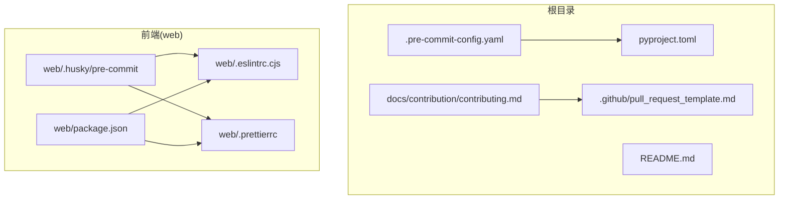
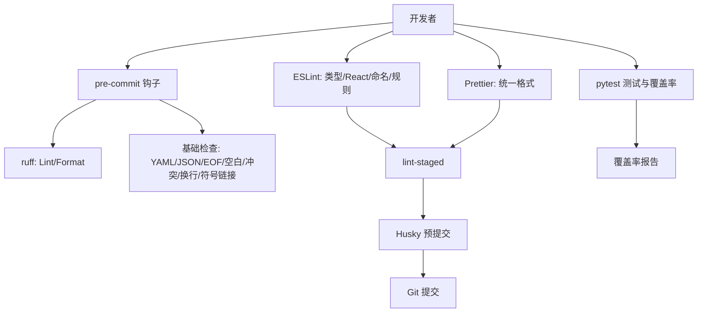
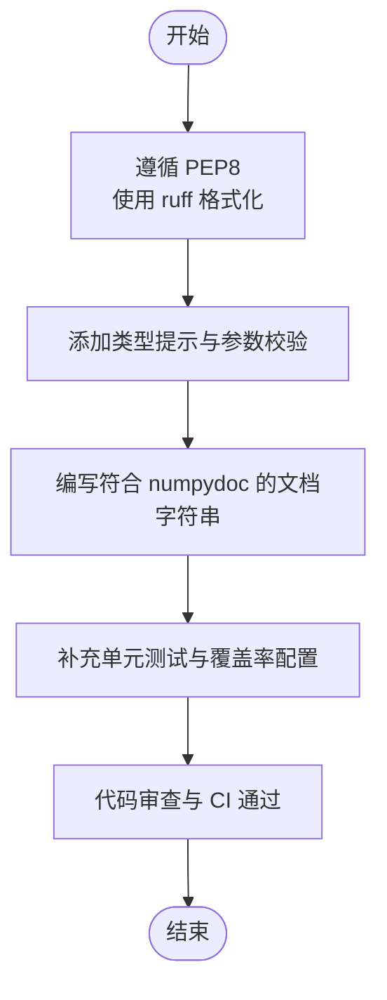
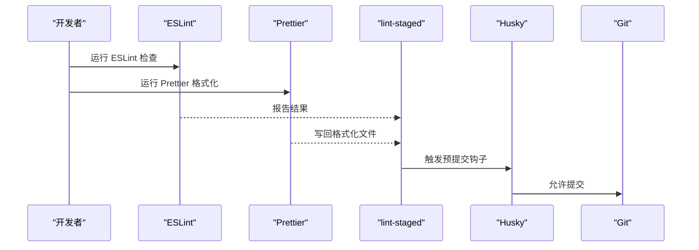
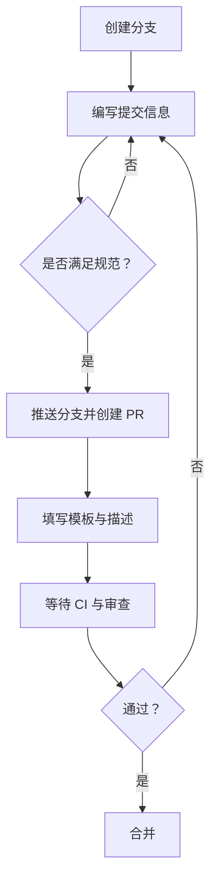
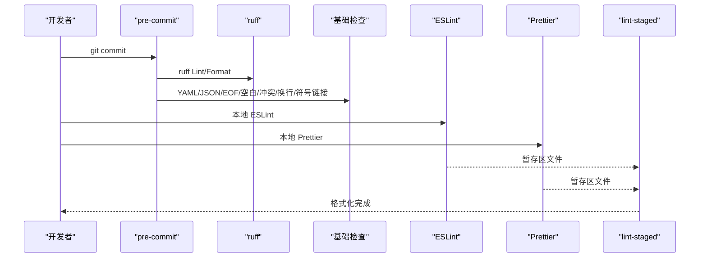
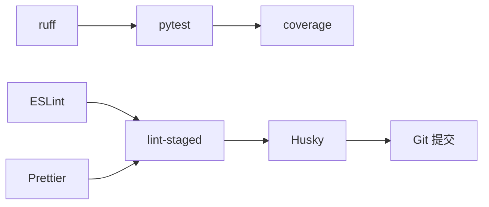

# 代码规范与约定

<cite>
**本文引用的文件**
- [.pre-commit-config.yaml](file://.pre-commit-config.yaml)
- [pyproject.toml](file://pyproject.toml)
- [web/.eslintrc.cjs](file://web/.eslintrc.cjs)
- [web/.prettierrc](file://web/.prettierrc)
- [web/package.json](file://web/package.json)
- [web/.husky/pre-commit](file://web/.husky/pre-commit)
- [docs/contribution/contributing.md](file://docs/contribution/contributing.md)
- [.github/pull_request_template.md](file://.github/pull_request_template.md)
- [check_comment_ascii.py](file://check_comment_ascii.py)
- [README.md](file://README.md)
</cite>

## 目录
1. [引言](#引言)
2. [项目结构](#项目结构)
3. [核心组件](#核心组件)
4. [架构总览](#架构总览)
5. [详细组件分析](#详细组件分析)
6. [依赖关系分析](#依赖关系分析)
7. [性能考虑](#性能考虑)
8. [故障排查指南](#故障排查指南)
9. [结论](#结论)
10. [附录](#附录)

## 引言
本指南面向开发者，系统性制定并统一本仓库的代码规范与约定，覆盖以下方面：
- Python 后端：PEP8 风格、命名约定、类型提示、函数与类设计原则、注释与文档生成规范、静态检查与格式化工具链。
- JavaScript/TypeScript 前端：ESLint 规则与插件、Prettier 格式化、组件设计模式与命名规范、脚手架与 Husky 预提交集成。
- Git 提交与分支：提交信息格式、分支命名、变更描述模板与 PR 模板。
- 代码审查清单：质量、安全、性能、可维护性与可测试性要点。
- 文档注释规范：函数、类、模块注释与文档生成约定。
- 预提交钩子：pre-commit、lint-staged、Husky 的配置与使用。
- 重构与优化：最佳实践与常见问题。

## 项目结构
本仓库采用多语言混合工程，后端以 Python 为主，前端以 TypeScript/Vite 为主，配合容器化部署与测试体系。关键规范落于根级与前端目录的配置文件中，并通过 CI/CD 与预提交钩子保障一致性。

**图示来源**
- [.pre-commit-config.yaml:1-20](file://.pre-commit-config.yaml#L1-L20)
- [pyproject.toml:190-227](file://pyproject.toml#L190-L227)
- [web/.eslintrc.cjs:1-74](file://web/.eslintrc.cjs#L1-L74)
- [web/.prettierrc:1-13](file://web/.prettierrc#L1-L13)
- [web/package.json:1-195](file://web/package.json#L1-L195)
- [web/.husky/pre-commit:1-2](file://web/.husky/pre-commit#L1-L2)
- [docs/contribution/contributing.md:30-59](file://docs/contribution/contributing.md#L30-L59)
- [.github/pull_request_template.md:1-13](file://.github/pull_request_template.md#L1-L13)

**章节来源**
- [README.md:315-386](file://README.md#L315-L386)
- [pyproject.toml:190-227](file://pyproject.toml#L190-L227)
- [web/package.json:7-21](file://web/package.json#L7-L21)

## 核心组件
- Python 后端规范与工具链
  - 使用 ruff 进行 Lint 与格式化，支持异步规则扩展与行宽控制。
  - pytest 配置路径、标记、输出与覆盖率策略。
  - 覆盖率源与排除规则。
- 前端规范与工具链
  - ESLint 扩展与插件：TypeScript、React、React Hooks、React Refresh、文件命名检查等。
  - Prettier 配置：单引号、尾随逗号、宽度、换行符等。
  - Vite 脚本与 lint-staged 集成，Husky 预提交触发。
- Git 工作流与 PR 模板
  - 贡献流程、PR 描述要求、CI 通过后合并。
  - PR 模板字段与类型选择。

**章节来源**
- [pyproject.toml:190-277](file://pyproject.toml#L190-L277)
- [web/.eslintrc.cjs:1-74](file://web/.eslintrc.cjs#L1-L74)
- [web/.prettierrc:1-13](file://web/.prettierrc#L1-L13)
- [web/package.json:7-21](file://web/package.json#L7-L21)
- [docs/contribution/contributing.md:30-59](file://docs/contribution/contributing.md#L30-L59)
- [.github/pull_request_template.md:1-13](file://.github/pull_request_template.md#L1-L13)

## 架构总览
整体规范架构围绕“工具链—钩子—流程—文档”四层展开，确保从开发到提交再到审查的一致性。

**图示来源**
- [.pre-commit-config.yaml:1-20](file://.pre-commit-config.yaml#L1-L20)
- [pyproject.toml:190-277](file://pyproject.toml#L190-L277)
- [web/.eslintrc.cjs:1-74](file://web/.eslintrc.cjs#L1-L74)
- [web/.prettierrc:1-13](file://web/.prettierrc#L1-L13)
- [web/.husky/pre-commit:1-2](file://web/.husky/pre-commit#L1-L2)
- [web/package.json:17-21](file://web/package.json#L17-L21)

## 详细组件分析

### Python 代码规范与约定
- 风格与格式
  - 使用 ruff 进行 Lint 与格式化，行宽限制与异步规则扩展已在配置中启用。
  - 排除特定文件与目录，避免对生成代码或特殊模块进行检查。
- 命名约定
  - 采用 Python 官方 PEP8 基本规范；结合项目内现有命名风格（如模块、服务、应用等）保持一致。
- 函数与类设计
  - 强制类型提示与参数校验，必要时使用验证器与数据类。
  - 公共接口需具备清晰文档字符串，遵循 numpydoc 规范以便自动化文档生成。
- 注释与文档
  - 单行注释与块注释遵循 PEP257；函数/类/模块文档字符串采用 numpydoc。
  - 确保所有公共方法与函数具备示例用法与输入输出说明。
- 静态检查与测试
  - pytest 路径、标记、输出与覆盖率策略已配置；覆盖率源与排除项明确。
  - 可选地在 CI 中执行覆盖率阈值检查，确保关键路径被覆盖。

**图示来源**
- [pyproject.toml:190-277](file://pyproject.toml#L190-L277)
- [check_comment_ascii.py:1-48](file://check_comment_ascii.py#L1-L48)

**章节来源**
- [pyproject.toml:190-277](file://pyproject.toml#L190-L277)
- [check_comment_ascii.py:1-48](file://check_comment_ascii.py#L1-L48)

### JavaScript/TypeScript 前端代码规范与约定
- ESLint 配置
  - 扩展推荐规则集：eslint:recommended、@typescript-eslint/recommended、plugin:react/recommended、plugin:react-hooks/recommended。
  - 关闭部分严格规则（如 any、空函数、非空断言），保留必要的变量前置定义警告。
  - 文件命名与文件夹命名强制 KEBAB_CASE，禁止不安全字符出现在 JSX 属性中。
- Prettier 配置
  - 单引号、尾随逗号、宽度、换行符等统一格式；通过插件组织导入与 packagejson。
- 组件设计模式
  - 建议采用函数组件 + Hooks 模式，配合类型安全的 props 与状态管理。
  - 表单与 UI 组件使用受控组件与验证器（如 @hookform/resolvers）。
- 脚手架与预提交
  - Vite 脚本提供开发、构建、预览、Storybook、测试入口。
  - lint-staged 与 Husky 预提交联动，确保提交前统一格式与基本检查。

**图示来源**
- [web/.eslintrc.cjs:1-74](file://web/.eslintrc.cjs#L1-L74)
- [web/.prettierrc:1-13](file://web/.prettierrc#L1-L13)
- [web/package.json:7-21](file://web/package.json#L7-L21)
- [web/.husky/pre-commit:1-2](file://web/.husky/pre-commit#L1-L2)

**章节来源**
- [web/.eslintrc.cjs:1-74](file://web/.eslintrc.cjs#L1-L74)
- [web/.prettierrc:1-13](file://web/.prettierrc#L1-L13)
- [web/package.json:7-21](file://web/package.json#L7-L21)

### Git 提交规范与分支命名
- 提交信息格式
  - 提交信息应简洁清晰，提供足够的上下文与变更说明，便于追踪与回溯。
- 分支命名规则
  - 建议采用功能/修复/文档/重构等前缀加短横线分隔的 KEBAB_CASE 命名，例如 feature/user-auth、fix/login-bug、docs/readme-update、refactor/api-client。
- 变更描述标准
  - 在 PR 描述中引用相关 Issue，说明背景、改动范围与影响，特别是破坏性变更与 API 变更需详细说明。
- PR 模板
  - 使用仓库提供的模板，勾选类型并填写问题描述与变更摘要。

**图示来源**
- [docs/contribution/contributing.md:30-59](file://docs/contribution/contributing.md#L30-L59)
- [.github/pull_request_template.md:1-13](file://.github/pull_request_template.md#L1-L13)

**章节来源**
- [docs/contribution/contributing.md:30-59](file://docs/contribution/contributing.md#L30-L59)
- [.github/pull_request_template.md:1-13](file://.github/pull_request_template.md#L1-L13)

### 代码审查检查清单
- 代码质量
  - 是否遵循 PEP8 与项目风格（Python）；ESLint 与 Prettier 是否通过（前端）。
  - 是否存在重复逻辑、过长函数与深层嵌套。
- 安全性
  - 输入校验与参数验证是否完善；敏感信息是否脱敏或外部化。
  - 前端是否存在 XSS 风险（如不受控的 innerHTML 或 JSX 字符实体）。
- 性能
  - 循环与递归是否合理；大对象深拷贝与序列化是否必要。
  - 前端组件渲染是否过度；是否使用懒加载与缓存。
- 可维护性
  - 命名是否语义化；注释是否清晰；错误处理是否完备。
- 可测试性
  - 是否新增单元测试；测试是否覆盖边界条件与异常路径。
- 文档与变更
  - 是否更新相关文档；变更日志与 PR 描述是否完整。

[本节为通用指导，无需具体文件引用]

### 文档注释规范
- Python
  - 函数/类/模块使用 numpydoc 风格的文档字符串，包含参数、返回值、异常与示例。
  - 保持 ASCII 注释与文档字符串，避免非 ASCII 字符导致的兼容性问题。
- 前端
  - 组件与工具函数使用 JSDoc 风格注释，描述用途、参数、返回值与注意事项。
  - Storybook 示例与文档同步更新。

**章节来源**
- [pyproject.toml:256-277](file://pyproject.toml#L256-L277)
- [check_comment_ascii.py:1-48](file://check_comment_ascii.py#L1-L48)

### 预提交钩子配置与使用
- Python
  - 使用 ruff 对 Python 代码进行 Lint 与格式化，自动修复错误。
  - 基础检查包括 YAML/JSON 校验、文件末尾换行、尾随空白、大小写冲突、合并冲突、行尾、符号链接等。
- 前端
  - Husky 在 pre-commit 阶段调用 lint-staged，对暂存区文件执行 Prettier 格式化。
  - ESLint 在本地与 CI 中运行，保证规则一致性。
- 使用步骤
  - 安装依赖后执行安装钩子命令，确保每次提交前自动格式化与检查。

**图示来源**
- [.pre-commit-config.yaml:1-20](file://.pre-commit-config.yaml#L1-L20)
- [pyproject.toml:190-227](file://pyproject.toml#L190-L227)
- [web/.eslintrc.cjs:1-74](file://web/.eslintrc.cjs#L1-L74)
- [web/.prettierrc:1-13](file://web/.prettierrc#L1-L13)
- [web/.husky/pre-commit:1-2](file://web/.husky/pre-commit#L1-L2)
- [web/package.json:17-21](file://web/package.json#L17-L21)

**章节来源**
- [.pre-commit-config.yaml:1-20](file://.pre-commit-config.yaml#L1-L20)
- [web/.husky/pre-commit:1-2](file://web/.husky/pre-commit#L1-L2)
- [web/package.json:7-21](file://web/package.json#L7-L21)

### 代码重构与优化最佳实践
- 重构原则
  - 小步快跑，优先拆分大函数与复杂类；保持单一职责与清晰接口。
  - 逐步引入类型提示与参数校验，提升可读性与健壮性。
- 性能优化
  - Python：减少全局变量与重复计算，使用生成器与惰性求值；避免在热路径中进行昂贵操作。
  - 前端：组件拆分与 memo 化；图片与资源懒加载；避免不必要的重渲染。
- 可靠性
  - 增强错误处理与超时控制；对外部依赖增加降级与重试机制。
- 可测试性
  - 为关键路径编写单元测试与集成测试；使用模拟与夹具隔离外部依赖。

[本节为通用指导，无需具体文件引用]

## 依赖关系分析
- Python 工具链
  - ruff 作为主要 Lint 与格式化工具，与 pytest、coverage 协同工作。
- 前端工具链
  - ESLint 与 Prettier 由 lint-staged 与 Husky 驱动，Vite 提供开发与构建环境。
- 工作流耦合
  - 贡献指南与 PR 模板约束了提交与审查流程，确保变更质量与可追溯性。

**图示来源**
- [pyproject.toml:190-277](file://pyproject.toml#L190-L277)
- [web/.eslintrc.cjs:1-74](file://web/.eslintrc.cjs#L1-L74)
- [web/.prettierrc:1-13](file://web/.prettierrc#L1-L13)
- [web/package.json:17-21](file://web/package.json#L17-L21)
- [web/.husky/pre-commit:1-2](file://web/.husky/pre-commit#L1-L2)

**章节来源**
- [pyproject.toml:190-277](file://pyproject.toml#L190-L277)
- [web/package.json:7-21](file://web/package.json#L7-L21)

## 性能考虑
- Python
  - 控制嵌套层级与循环复杂度；避免在热路径中进行 IO 与网络请求；合理使用缓存与连接池。
- 前端
  - 组件按需加载与分割；减少不必要的状态更新；使用虚拟滚动与懒加载图片。
- 工具链
  - 通过 ruff 与 lint-staged 快速发现潜在性能问题（如未使用的变量、过长函数）。

[本节为通用指导，无需具体文件引用]

## 故障排查指南
- Python
  - 若 Lint 报错，优先使用 ruff 自动修复；检查排除列表与规则配置。
  - 若测试失败，查看 pytest 输出与覆盖率报告，定位未覆盖路径。
- 前端
  - ESLint 报错通常与类型或命名规则相关；Prettier 报错多为格式问题。
  - Husky 预提交失败时，确认 lint-staged 与脚本执行权限。
- 提交与审查
  - PR 未通过 CI 时，检查日志并根据模板补充说明与变更细节。

**章节来源**
- [pyproject.toml:190-277](file://pyproject.toml#L190-L277)
- [web/.eslintrc.cjs:1-74](file://web/.eslintrc.cjs#L1-L74)
- [web/.prettierrc:1-13](file://web/.prettierrc#L1-L13)
- [web/package.json:7-21](file://web/package.json#L7-L21)
- [docs/contribution/contributing.md:57-59](file://docs/contribution/contributing.md#L57-L59)

## 结论
本指南基于仓库现有配置与贡献流程，建立了前后端统一的代码规范与约定。建议团队在日常开发中严格遵循：工具链自动检查、预提交钩子拦截、PR 模板与审查流程、文档注释与测试覆盖。通过持续的规范化与优化，提升代码质量、可维护性与协作效率。

[本节为总结，无需具体文件引用]

## 附录
- 开发启动与环境
  - 后端：安装依赖、启动依赖服务、启动后端与前端。
  - 前端：安装依赖、启动开发服务器。
- 贡献与发布
  - 遵循贡献指南与 PR 模板，确保 CI 通过后再合并。

**章节来源**
- [README.md:315-386](file://README.md#L315-L386)