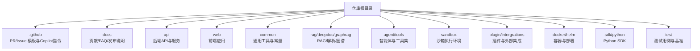
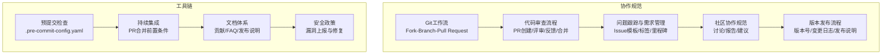
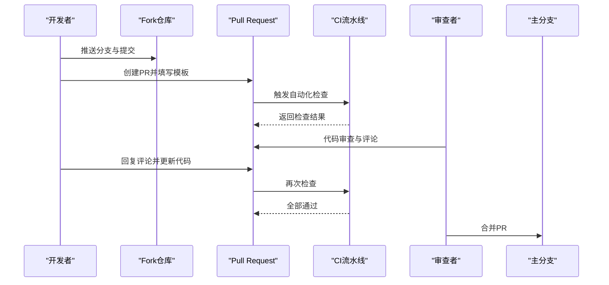
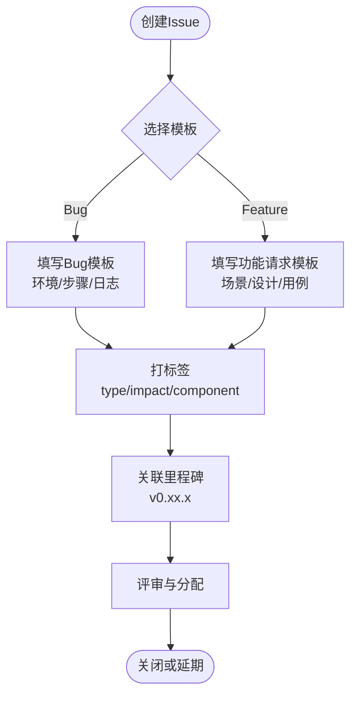
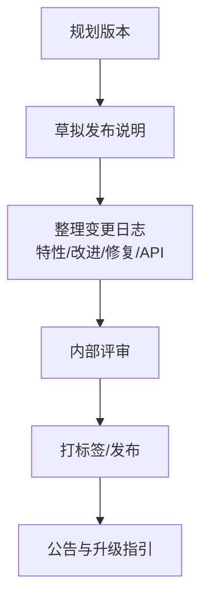
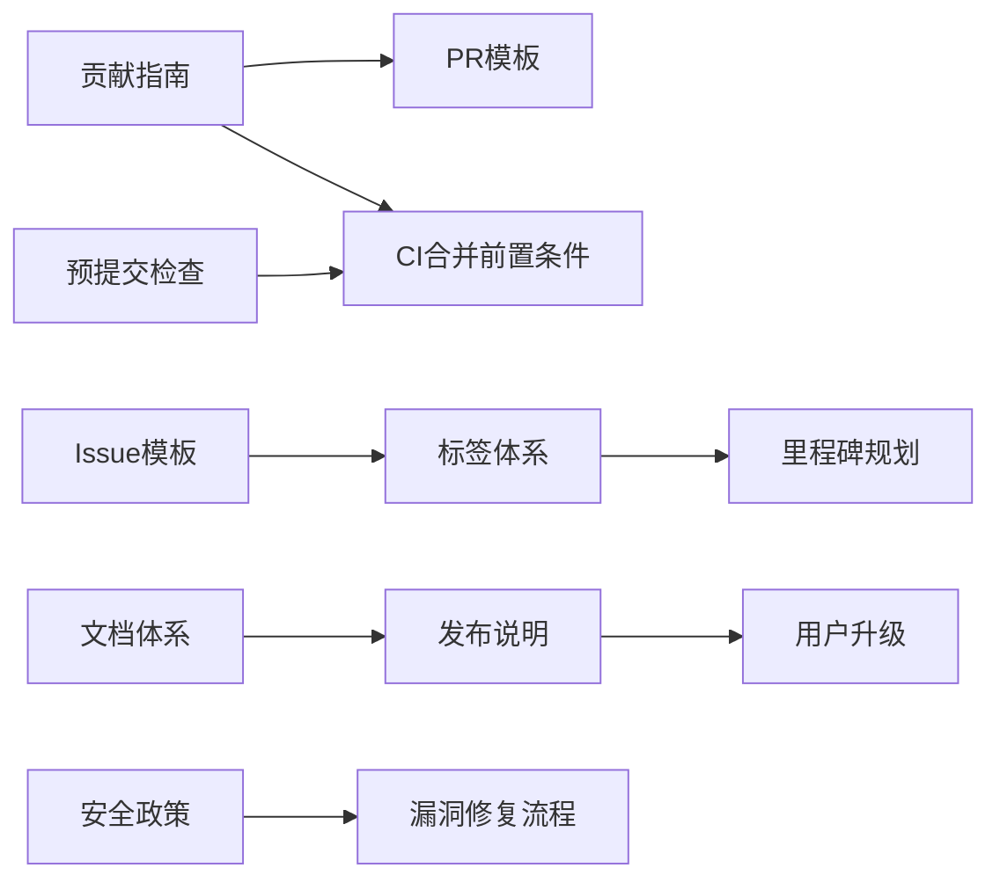

# 协作流程与规范

<cite>
**本文引用的文件**
- [pull_request_template.md](file://.github/pull_request_template.md)
- [bug_report.yml](file://.github/ISSUE_TEMPLATE/bug_report.yml)
- [feature_request.yml](file://.github/ISSUE_TEMPLATE/feature_request.yml)
- [contributing.md](file://docs/contribution/contributing.md)
- [README.md](file://README.md)
- [faq.mdx](file://docs/faq.mdx)
- [release_notes.md](file://docs/release_notes.md)
- [copilot-instructions.md](file://.github/copilot-instructions.md)
- [pre-commit配置](file://.pre-commit-config.yaml)
- [SECURITY.md](file://SECURITY.md)
</cite>

## 目录
1. [引言](#引言)
2. [项目结构](#项目结构)
3. [核心组件](#核心组件)
4. [架构总览](#架构总览)
5. [详细组件分析](#详细组件分析)
6. [依赖关系分析](#依赖关系分析)
7. [性能考虑](#性能考虑)
8. [故障排查指南](#故障排查指南)
9. [结论](#结论)
10. [附录](#附录)

## 引言
本文件面向开发者与贡献者，系统化建立 RAGFlow 的标准化协作流程与规范体系，覆盖 Git 工作流（Fork-Branch-Pull Request）、分支管理策略、代码审查流程、问题跟踪与需求管理、社区协作规范、版本发布流程、冲突解决与沟通协调方法，并提供新贡献者入门指导与常见问题解答。目标是提升协作效率、保证质量与一致性。

## 项目结构
RAGFlow 采用多模块分层组织：后端服务、前端界面、文档与示例、数据源与解析器、沙箱执行、插件与集成等。仓库根目录包含贡献指南、问题模板、Copilot 指令与预提交检查配置；docs 目录提供贡献、FAQ、发布说明等文档；.github 目录提供 PR 模板与 Issue 模板。

图表来源
- [README.md](file://README.md)
- [contributing.md](file://docs/contribution/contributing.md)

章节来源
- [README.md](file://README.md)
- [contributing.md](file://docs/contribution/contributing.md)

## 核心组件
- 贡献指南与流程：定义 Fork-Branch-Pull Request 标准流程、PR 描述要求、CI 合并前置条件。
- 问题模板：提供 Bug 报告与功能请求模板，规范信息收集与标签使用。
- 文档体系：贡献、FAQ、发布说明三类文档支撑协作与知识沉淀。
- 开发工具链：Pre-commit 规则、Copilot 指令、本地开发与测试流程。
- 安全政策：漏洞上报渠道与修复流程。

章节来源
- [contributing.md](file://docs/contribution/contributing.md)
- [bug_report.yml](file://.github/ISSUE_TEMPLATE/bug_report.yml)
- [feature_request.yml](file://.github/ISSUE_TEMPLATE/feature_request.yml)
- [faq.mdx](file://docs/faq.mdx)
- [release_notes.md](file://docs/release_notes.md)
- [copilot-instructions.md](file://.github/copilot-instructions.md)
- [pre-commit配置](file://.pre-commit-config.yaml)
- [SECURITY.md](file://SECURITY.md)

## 架构总览
协作架构由“流程规范 + 工具链 + 文档体系 + 安全治理”构成，贯穿从问题发现到版本发布的全生命周期。

图表来源
- [contributing.md](file://docs/contribution/contributing.md)
- [bug_report.yml](file://.github/ISSUE_TEMPLATE/bug_report.yml)
- [feature_request.yml](file://.github/ISSUE_TEMPLATE/feature_request.yml)
- [faq.mdx](file://docs/faq.mdx)
- [release_notes.md](file://docs/release_notes.md)
- [copilot-instructions.md](file://.github/copilot-instructions.md)
- [pre-commit配置](file://.pre-commit-config.yaml)
- [SECURITY.md](file://SECURITY.md)

## 详细组件分析

### Git 工作流与分支管理策略
- Fork-Branch-Pull Request 标准流程
  - Fork 仓库 → 创建本地分支 → 提交与推送 → 发起 PR → 代码审查 → CI 通过 → 合并。
  - 分支命名建议：按功能或修复类型命名，如 feat/xxx、fix/xxx、docs/xxx。
  - 提交信息：提供充分上下文，便于回溯与审阅。
- 分支管理策略
  - 主分支保持稳定，发布前进行版本标记与变更日志整理。
  - 功能分支短期存在，完成合并后及时删除，避免长期漂移。
  - 热修复分支从发布标签切出，修复后同时合并回主分支与当前维护分支。
- 合并规范
  - 必须通过所有 CI 检查。
  - 尽量使用 Squash 或 Rebase 合并，保持历史整洁。
  - 大型改动拆分为多个小 PR，增强可读性与可测试性。

章节来源
- [contributing.md](file://docs/contribution/contributing.md)

### 代码审查流程
- PR 创建
  - 填写 PR 模板，明确问题背景、变更范围与影响评估。
  - 关联相关 Issue 编号，便于追踪。
- 审查标准
  - 代码风格与格式统一（遵循预提交规则）。
  - 功能正确性与边界条件覆盖（新增/修改需配套测试）。
  - 性能与安全性评估（避免引入性能退化与安全风险）。
  - 文档更新（新增 API、配置项、行为变更需同步更新文档）。
- 反馈处理
  - 对每条评论逐条回复并修正，必要时补充测试或文档。
  - 修改后重新触发 CI，确保通过后再请求复审。
- 合并条件
  - 至少一名维护者批准。
  - 所有 CI 任务通过。
  - 无未处理的评论阻塞。

图表来源
- [pull_request_template.md](file://.github/pull_request_template.md)
- [contributing.md](file://docs/contribution/contributing.md)

章节来源
- [pull_request_template.md](file://.github/pull_request_template.md)
- [contributing.md](file://docs/contribution/contributing.md)

### 问题跟踪与需求管理
- Issue 模板
  - Bug 报告模板：包含自检勾选项、环境信息、实际/期望行为、复现步骤、附加信息等字段，确保可复现与可定位。
  - 功能请求模板：描述问题场景、期望特性、实现思路、文档/用例/设计说明等。
- 标签使用
  - 类型标签：bug、enhancement、documentation、refactor、performance 等。
  - 优先级标签：p0/p1/p2 等。
  - 组件标签：按模块划分（如 api、web、rag、agent 等）。
  - 迭代标签：与里程碑对齐（如 v0.23.1、v0.24.0）。
- 里程碑规划
  - 每个版本设定里程碑，将相关 Issue 关联至对应里程碑，定期回顾进度与阻塞项。
  - 发布前清理未完成任务，必要时延期至下一个里程碑。

图表来源
- [bug_report.yml](file://.github/ISSUE_TEMPLATE/bug_report.yml)
- [feature_request.yml](file://.github/ISSUE_TEMPLATE/feature_request.yml)

章节来源
- [bug_report.yml](file://.github/ISSUE_TEMPLATE/bug_report.yml)
- [feature_request.yml](file://.github/ISSUE_TEMPLATE/feature_request.yml)

### 社区协作规范
- 讨论参与
  - 使用 Discussions 进行开放式讨论，避免在 Issue 中混杂非问题内容。
  - 讨论主题清晰、结论可追溯，必要时形成文档或决策记录。
- 问题报告
  - 使用 Bug 模板，提供完整复现步骤与环境信息。
  - 避免重复报告，先搜索现有 Issue/PR。
- 功能建议
  - 明确业务价值与技术可行性，提供初步设计方案。
  - 与维护者沟通确认是否符合项目演进方向。

章节来源
- [contributing.md](file://docs/contribution/contributing.md)
- [README.md](file://README.md)

### 版本发布流程
- 版本号管理
  - 采用语义化版本（主.次.修订），发布前在发布说明中标注版本日期与关键变更。
  - 从 FAQ 可知版本号格式与含义，便于用户识别与升级。
- 变更日志维护
  - 发布说明按版本维护，记录新特性、改进、修复与模型支持变化。
  - API 变更与破坏性更改需重点标注。
- 发布说明编写
  - 概述版本亮点与迁移要点，提供升级指引与注意事项。
  - 对于重大变更，提供回滚与兼容性说明。

图表来源
- [release_notes.md](file://docs/release_notes.md)
- [faq.mdx](file://docs/faq.mdx)

章节来源
- [release_notes.md](file://docs/release_notes.md)
- [faq.mdx](file://docs/faq.mdx)

### 冲突解决与沟通协调
- 冲突解决
  - 优先通过分支隔离与小步快跑降低冲突概率。
  - 发生冲突时，及时同步上游变更并本地解决冲突，必要时请求协作者协助。
- 沟通协调
  - 重要设计决策在 Discussions 或评审会议中达成共识。
  - 对跨模块影响的变更，提前与相关模块负责人沟通。
- 工具辅助
  - 预提交钩子自动检查格式与冲突，减少低级问题进入 PR。
  - Copilot 指令帮助新成员快速理解项目布局与约定。

章节来源
- [contributing.md](file://docs/contribution/contributing.md)
- [pre-commit配置](file://.pre-commit-config.yaml)
- [copilot-instructions.md](file://.github/copilot-instructions.md)

### 新贡献者入门指导
- 环境准备
  - 阅读贡献指南，了解工作流与审查标准。
  - 安装依赖与工具（如 uv、pre-commit），运行本地服务验证环境。
- 第一次贡献
  - 从 Good First Issue 或文档改进入手，熟悉流程与代码风格。
  - 提交 PR 前确保通过本地测试与预提交检查。
- 持续参与
  - 关注发布说明与路线图，参与讨论与评审。
  - 积极反馈与分享最佳实践，推动团队协作优化。

章节来源
- [contributing.md](file://docs/contribution/contributing.md)
- [README.md](file://README.md)

## 依赖关系分析
协作流程与工具链之间存在强耦合关系：贡献指南约束 PR 行为，Issue 模板规范问题描述，预提交钩子保障代码质量，发布说明驱动版本节奏，安全政策保障漏洞闭环。

图表来源
- [contributing.md](file://docs/contribution/contributing.md)
- [bug_report.yml](file://.github/ISSUE_TEMPLATE/bug_report.yml)
- [feature_request.yml](file://.github/ISSUE_TEMPLATE/feature_request.yml)
- [pre-commit配置](file://.pre-commit-config.yaml)
- [release_notes.md](file://docs/release_notes.md)
- [SECURITY.md](file://SECURITY.md)

章节来源
- [contributing.md](file://docs/contribution/contributing.md)
- [bug_report.yml](file://.github/ISSUE_TEMPLATE/bug_report.yml)
- [feature_request.yml](file://.github/ISSUE_TEMPLATE/feature_request.yml)
- [pre-commit配置](file://.pre-commit-config.yaml)
- [release_notes.md](file://docs/release_notes.md)
- [SECURITY.md](file://SECURITY.md)

## 性能考虑
- 代码审查效率
  - 小而精的 PR 更易审查，减少往返次数。
  - 明确的模板与标签有助于快速定位问题类别与优先级。
- 测试与质量
  - 预提交检查自动修复格式与冲突，降低人工成本。
  - CI 通过率高意味着合并风险低，减少回滚与热修复。
- 文档与知识沉淀
  - 发布说明与 FAQ 降低重复问答成本，提升社区自助能力。

## 故障排查指南
- 常见问题定位
  - 查看发布说明中的已知问题与修复记录，确认是否为已知问题或需要升级。
  - 在 FAQ 中检索错误现象对应的排查步骤与解决方案。
- 安全问题
  - 严格遵循安全政策，通过受控渠道上报漏洞并等待修复方案。
- 协作问题
  - 若 PR 长时间无人响应，可在 Discussions 中寻求帮助或确认维护者排期。
  - 对审查意见不一致时，保留记录并在评审会议中达成共识。

章节来源
- [faq.mdx](file://docs/faq.mdx)
- [SECURITY.md](file://SECURITY.md)
- [contributing.md](file://docs/contribution/contributing.md)

## 结论
通过标准化的 Git 工作流、严格的代码审查、完善的 Issue 管理与文档体系、以及安全与发布流程，RAGFlow 能够在开放协作中保持高质量与高效率。建议团队持续优化预提交规则与评审流程，强化知识沉淀与新人引导，以进一步提升协作体验与交付质量。

## 附录
- 新贡献者快速通道
  - 阅读贡献指南与 README，安装依赖并通过本地启动验证。
  - 选择合适的 Issue（如 Good First Issue），提交 PR 并跟进审查意见。
- 维护者参考
  - 严格把控 PR 合并条件，确保文档与测试同步更新。
  - 利用标签与里程碑管理任务，定期回顾发布计划与风险。