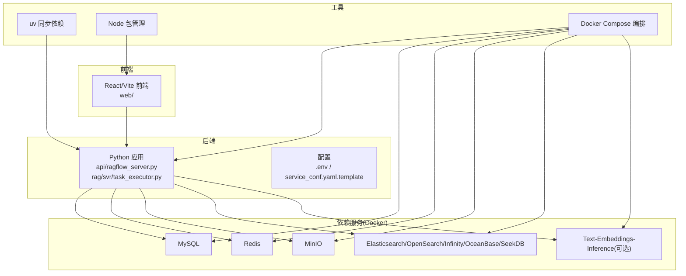
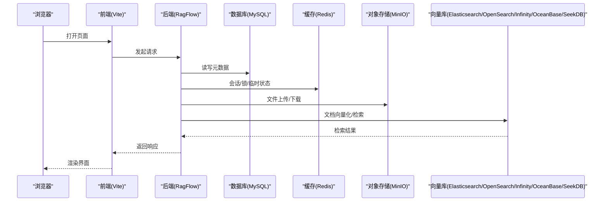
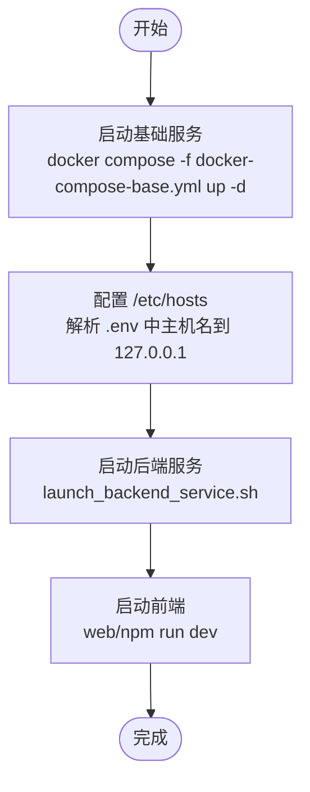
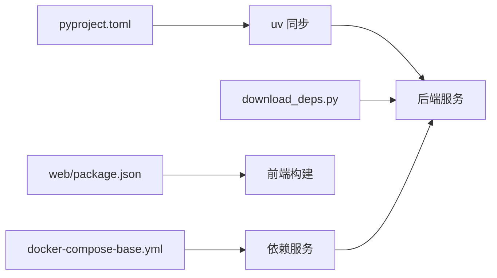

# 开发环境搭建

<cite>
**本文引用的文件**
- [README.md](file://README.md)
- [pyproject.toml](file://pyproject.toml)
- [docker/docker-compose.yml](file://docker/docker-compose.yml)
- [docker/docker-compose-base.yml](file://docker/docker-compose-base.yml)
- [docker/.env_base](file://docker/.env_base)
- [docker/launch_backend_service.sh](file://docker/launch_backend_service.sh)
- [download_deps.py](file://download_deps.py)
- [show_env.sh](file://show_env.sh)
- [run_tests.py](file://run_tests.py)
- [web/package.json](file://web/package.json)
- [admin/client/pyproject.toml](file://admin/client/pyproject.toml)
- [sdk/python/pyproject.toml](file://sdk/python/pyproject.toml)
</cite>

## 目录
1. [简介](#简介)
2. [项目结构](#项目结构)
3. [核心组件](#核心组件)
4. [架构总览](#架构总览)
5. [详细组件分析](#详细组件分析)
6. [依赖关系分析](#依赖关系分析)
7. [性能考虑](#性能考虑)
8. [故障排查指南](#故障排查指南)
9. [结论](#结论)
10. [附录](#附录)

## 简介
本指南面向开发者，帮助你从零搭建 RAGFlow 的本地开发环境。内容覆盖：
- Python 环境与虚拟环境配置
- 依赖安装（pip、Node.js、系统依赖）
- Docker 环境与容器编排、数据库初始化、开发服务器启动
- IDE 配置建议（VS Code、PyCharm）
- 调试与日志、性能分析
- 常见问题排查

## 项目结构
RAGFlow 采用多语言混合架构：后端服务以 Python 为主，前端基于 React/Vite，同时提供 Admin CLI 与 Python SDK。Docker Compose 统一编排后端服务与依赖组件（MySQL、Redis、MinIO、Elasticsearch/OpenSearch/Infinity/OceanBase/SeekDB 等）。

图表来源
- [docker/docker-compose.yml:1-133](file://docker/docker-compose.yml#L1-L133)
- [docker/docker-compose-base.yml:1-326](file://docker/docker-compose-base.yml#L1-L326)
- [docker/.env_base:1-280](file://docker/.env_base#L1-L280)
- [docker/launch_backend_service.sh:1-130](file://docker/launch_backend_service.sh#L1-L130)
- [web/package.json:1-195](file://web/package.json#L1-L195)

章节来源
- [README.md: 145-380:145-380](file://README.md#L145-L380)
- [docker/docker-compose.yml: 1-133:1-133](file://docker/docker-compose.yml#L1-L133)
- [docker/docker-compose-base.yml: 1-326:1-326](file://docker/docker-compose-base.yml#L1-L326)
- [docker/.env_base: 1-280:1-280](file://docker/.env_base#L1-L280)

## 核心组件
- 后端服务
  - 主服务：api/ragflow_server.py
  - 任务执行器：rag/svr/task_executor.py
- 依赖服务：MySQL、Redis、MinIO、Elasticsearch/OpenSearch/Infinity/OceanBase/SeekDB、可选 TEI 文本嵌入服务
- 前端：web/（Vite + React）
- 工具链：uv（依赖同步）、Node/npm（前端依赖）、Docker Compose（编排）

章节来源
- [docker/launch_backend_service.sh: 1-L130:1-130](file://docker/launch_backend_service.sh#L1-L130)
- [docker/docker-compose.yml: 1-L133:1-133](file://docker/docker-compose.yml#L1-L133)
- [docker/docker-compose-base.yml: 1-L326:1-326](file://docker/docker-compose-base.yml#L1-L326)
- [web/package.json: 1-L195:1-195](file://web/package.json#L1-L195)

## 架构总览
下图展示开发模式下的典型交互：浏览器访问前端，前端通过后端 API 访问数据库、对象存储与向量库；后端服务在本地或容器中运行。

图表来源
- [docker/docker-compose.yml: 1-L133:1-133](file://docker/docker-compose.yml#L1-L133)
- [docker/docker-compose-base.yml: 1-L326:1-326](file://docker/docker-compose-base.yml#L1-L326)
- [docker/.env_base: 1-L280:1-280](file://docker/.env_base#L1-L280)

## 详细组件分析

### Python 环境与依赖管理
- Python 版本
  - 支持范围：>=3.12,<3.15
  - 推荐使用 3.12.x
- 依赖管理工具
  - 使用 uv 进行依赖同步与安装
  - 项目根目录提供 pyproject.toml，声明后端主依赖与测试分组
- 安装步骤
  - 安装 uv（pipx install uv）
  - 在项目根目录执行 uv sync --python 3.12
  - 下载额外依赖：uv run download_deps.py
  - 可选：安装 pre-commit（pre-commit install）

章节来源
- [README.md: 317-330:317-330](file://README.md#L317-L330)
- [pyproject.toml: 1-L278:1-278](file://pyproject.toml#L1-L278)
- [download_deps.py: 1-L82:1-82](file://download_deps.py#L1-L82)

### Node.js 与前端依赖
- Node 版本要求：>=18.20.4
- 安装步骤
  - 进入 web/ 目录
  - npm install 安装前端依赖
  - npm run dev 启动前端开发服务器

章节来源
- [web/package.json: 1-L195:1-195](file://web/package.json#L1-L195)
- [README.md: 366-376:366-376](file://README.md#L366-L376)

### 系统级依赖与环境变量
- 系统要求
  - CPU >= 4 核；内存 >= 16 GB；磁盘 >= 50 GB
  - Docker >= 24.0.0；Docker Compose >= v2.26.1
  - Linux 需设置 vm.max_map_count>=262144
- 环境变量
  - docker/.env_base 提供默认环境变量模板，如 DOC_ENGINE、DEVICE、各服务端口、密码等
  - 可根据需要复制并修改 .env 或直接在 docker-compose 中覆盖

章节来源
- [README.md: 145-151:145-151](file://README.md#L145-L151)
- [docker/.env_base: 1-L280:1-280](file://docker/.env_base#L1-L280)

### Docker 环境与容器编排
- 启动依赖服务
  - 使用 docker/docker-compose-base.yml 启动 MySQL、Redis、MinIO、Elasticsearch/OpenSearch/Infinity/OceanBase/SeekDB、可选 TEI
  - 命令示例：docker compose -f docker/docker-compose-base.yml up -d
- 启动后端服务
  - 在项目根目录执行：source .venv/bin/activate；export PYTHONPATH=$(pwd)；bash docker/launch_backend_service.sh
- 启动前端
  - 进入 web/ 目录，npm install；npm run dev
- 停止服务
  - 开发完成后可使用 pkill -f "ragflow_server.py|task_executor.py" 停止后端进程

图表来源
- [README.md: 331-376:331-376](file://README.md#L331-L376)
- [docker/docker-compose-base.yml: 1-L326:1-326](file://docker/docker-compose-base.yml#L1-L326)
- [docker/launch_backend_service.sh: 1-L130:1-130](file://docker/launch_backend_service.sh#L1-L130)

章节来源
- [README.md: 331-376:331-376](file://README.md#L331-L376)
- [docker/docker-compose.yml: 1-L133:1-133](file://docker/docker-compose.yml#L1-L133)
- [docker/docker-compose-base.yml: 1-L326:1-326](file://docker/docker-compose-base.yml#L1-L326)

### 数据库初始化与服务健康检查
- MySQL 初始化
  - 通过 init.sql 初始化数据库结构
  - 健康检查：mysqladmin ping -uroot -p${MYSQL_PASSWORD}
- MinIO 初始化
  - 默认账户与密码在 .env 中配置
  - 健康检查：curl http://localhost:9000/minio/health/live
- 向量库选择
  - DOC_ENGINE 支持 elasticsearch、infinity、oceanbase、opensearch、seekdb
  - 切换时需更新 .env 并重启容器

章节来源
- [docker/docker-compose-base.yml: 176-L242:176-242](file://docker/docker-compose-base.yml#L176-L242)
- [docker/.env_base: 13-L280:13-280](file://docker/.env_base#L13-L280)

### 测试与覆盖率
- 单元测试入口
  - run_tests.py 提供统一测试运行器，支持覆盖率、并行、标记过滤等
- pytest 配置
  - pyproject.toml 中定义了 markers、addopts、coverage 等

章节来源
- [run_tests.py: 1-L275:1-275](file://run_tests.py#L1-L275)
- [pyproject.toml: 198-L278:198-278](file://pyproject.toml#L198-L278)

### Admin CLI 与 Python SDK
- Admin CLI
  - admin/client/pyproject.toml 定义 CLI 依赖与脚本入口
- Python SDK
  - sdk/python/pyproject.toml 定义 SDK 依赖与测试分组

章节来源
- [admin/client/pyproject.toml: 1-L28:1-28](file://admin/client/pyproject.toml#L1-L28)
- [sdk/python/pyproject.toml: 1-L32:1-32](file://sdk/python/pyproject.toml#L1-L32)

## 依赖关系分析
- Python 依赖
  - 通过 pyproject.toml 声明，使用 uv 同步
  - download_deps.py 用于下载模型与二进制资源
- 前端依赖
  - web/package.json 声明 React 生态与构建工具
- Docker 服务
  - docker-compose-base.yml 统一编排核心依赖服务
  - docker-compose.yml 基于 profiles 控制服务启停

图表来源
- [pyproject.toml: 1-L278:1-278](file://pyproject.toml#L1-L278)
- [download_deps.py: 1-L82:1-82](file://download_deps.py#L1-L82)
- [web/package.json: 1-L195:1-195](file://web/package.json#L1-L195)
- [docker/docker-compose-base.yml: 1-L326:1-326](file://docker/docker-compose-base.yml#L1-L326)

章节来源
- [pyproject.toml: 1-L278:1-278](file://pyproject.toml#L1-L278)
- [web/package.json: 1-L195:1-195](file://web/package.json#L1-L195)
- [docker/docker-compose-base.yml: 1-L326:1-326](file://docker/docker-compose-base.yml#L1-L326)

## 性能考虑
- 内存与线程池
  - MEM_LIMIT 可按宿主机内存调整
  - THREAD_POOL_MAX_WORKERS 控制线程池大小
- 向量库选择
  - 不同向量库对内存与磁盘水位有不同要求，建议结合硬件选择
- 嵌入服务
  - TEI 支持 CPU/GPU，按需启用以提升向量化性能

章节来源
- [docker/.env_base: 63-L280:63-280](file://docker/.env_base#L63-L280)
- [docker/docker-compose-base.yml: 244-L276:244-276](file://docker/docker-compose-base.yml#L244-L276)

## 故障排查指南
- 端口冲突
  - 修改 docker/.env_base 中对应服务端口（如 ES_PORT、MINIO_PORT、REDIS_PORT 等）
- 权限与健康检查失败
  - 检查 .env 中密码与账号是否正确
  - 查看容器健康检查输出（如 curl 命令）
- HuggingFace 访问受限
  - 设置 HF_ENDPOINT 环境变量使用镜像站
- jemalloc 缺失
  - 按操作系统安装 libjemalloc-dev 或 jemalloc
- vm.max_map_count 未设置
  - 在 Linux 上设置 sysctl vm.max_map_count=262144，并持久化

章节来源
- [docker/.env_base: 192-L204:192-204](file://docker/.env_base#L192-L204)
- [README.md: 347-358:347-358](file://README.md#L347-L358)
- [README.md: 158-178:158-178](file://README.md#L158-L178)

## 结论
按照本指南，你可以快速完成 RAGFlow 的开发环境搭建：先准备 Python 与 Node 环境，再通过 Docker Compose 启动依赖服务，最后分别启动后端与前端服务。遇到问题时，优先检查环境变量、端口占用与健康检查状态。

## 附录

### A. 环境检测脚本
- show_env.sh 可用于快速查看当前系统信息（发行版、内核、CPU、内存、Docker、Python 版本），便于诊断环境差异。

章节来源
- [show_env.sh: 1-L63:1-63](file://show_env.sh#L1-L63)

### B. 常用命令速查
- 后端服务启动
  - source .venv/bin/activate；export PYTHONPATH=$(pwd)；bash docker/launch_backend_service.sh
- 前端启动
  - cd web；npm install；npm run dev
- 停止后端
  - pkill -f "ragflow_server.py|task_executor.py"

章节来源
- [README.md: 359-385:359-385](file://README.md#L359-L385)
- [docker/launch_backend_service.sh: 1-L130:1-130](file://docker/launch_backend_service.sh#L1-L130)