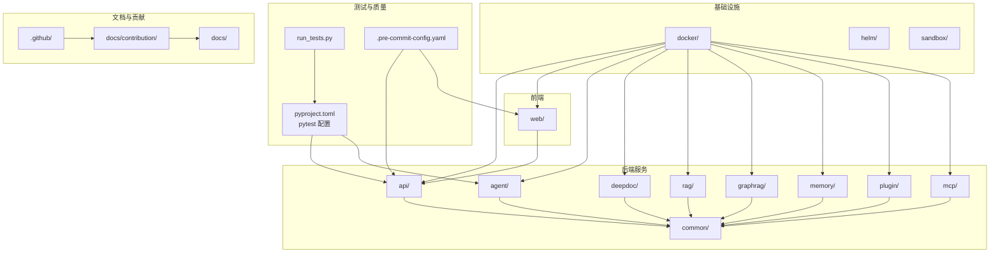
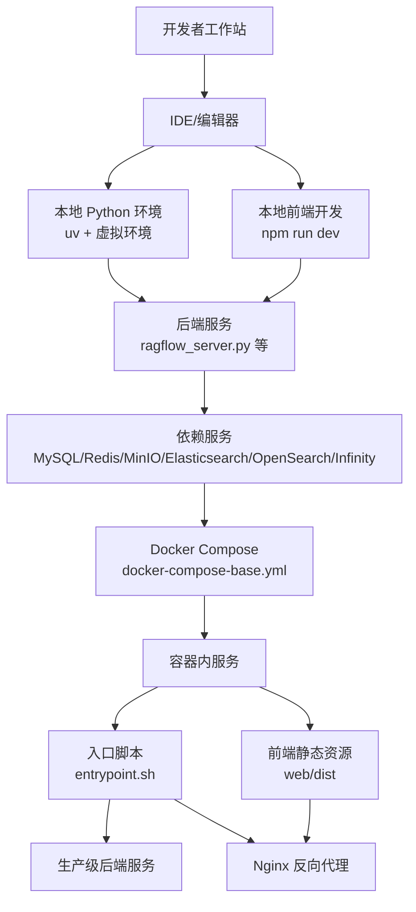
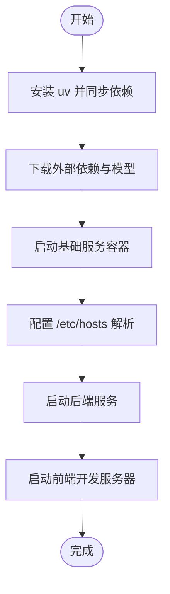
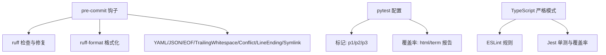
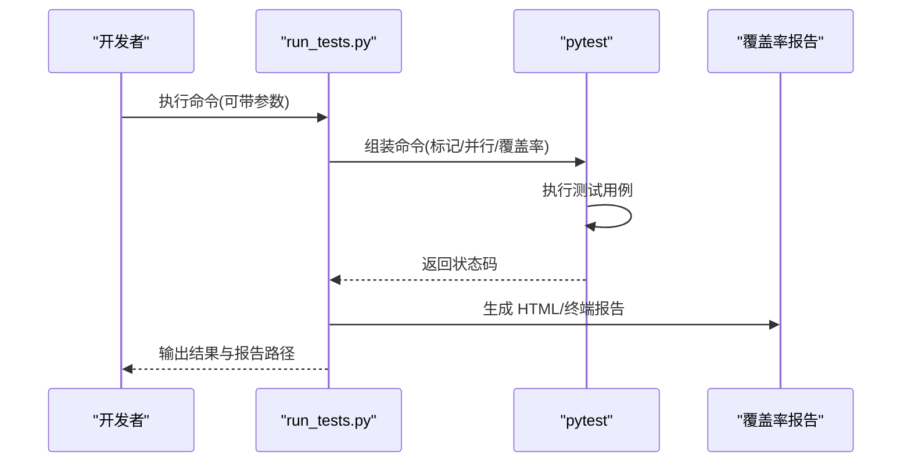
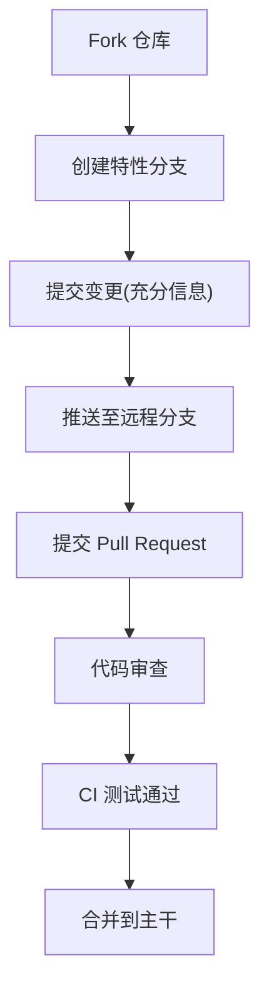
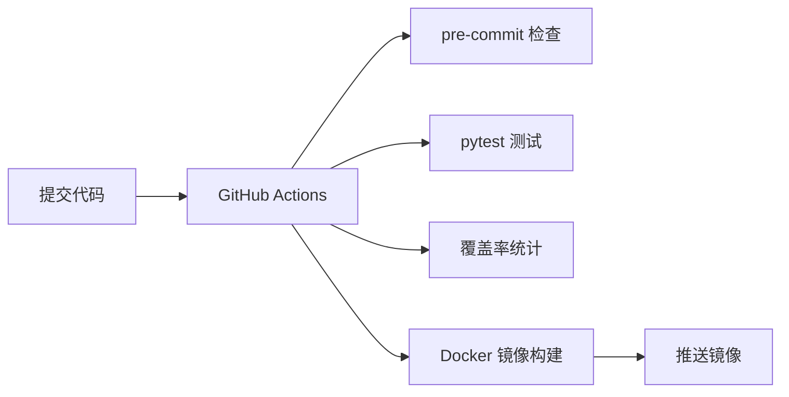
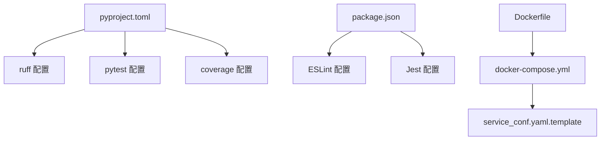

# 开发者指南

<cite>
**本文档引用的文件**
- [README.md](file://README.md)
- [pyproject.toml](file://pyproject.toml)
- [run_tests.py](file://run_tests.py)
- [contributing.md](file://docs/contribution/contributing.md)
- [.pre-commit-config.yaml](file://.pre-commit-config.yaml)
- [package.json](file://web/package.json)
- [tsconfig.json](file://web/tsconfig.json)
- [Dockerfile](file://Dockerfile)
- [docker-compose.yml](file://docker/docker-compose.yml)
- [service_conf.yaml.template](file://docker/service_conf.yaml.template)
- [pull_request_template.md](file://.github/pull_request_template.md)
- [.github/copilot-instructions.md](file://.github/copilot-instructions.md)
</cite>

## 目录
1. [简介](#简介)
2. [项目结构](#项目结构)
3. [核心组件](#核心组件)
4. [架构总览](#架构总览)
5. [详细组件分析](#详细组件分析)
6. [依赖关系分析](#依赖关系分析)
7. [性能考虑](#性能考虑)
8. [故障排查指南](#故障排查指南)
9. [结论](#结论)
10. [附录](#附录)

## 简介
本指南面向希望为 RAGFlow 贡献代码与文档的开发者，覆盖从开发环境搭建、代码规范、测试策略、Git 工作流、调试技巧、问题报告与功能请求、文档维护、CI/CD 配置到社区协作的全流程。内容基于仓库中的实际配置与脚本进行整理，确保可操作性与一致性。

## 项目结构
RAGFlow 采用多模块分层组织：后端服务（Python）、前端（React/Vite）、容器化与编排（Docker）、测试与基准（pytest/jest）、以及文档与贡献规范。下图展示主要目录与其职责映射：

图表来源
- [README.md: 143-250:143-250](file://README.md#L143-L250)
- [pyproject.toml: 158-228:158-228](file://pyproject.toml#L158-L228)
- [docker-compose.yml: 1-133:1-133](file://docker/docker-compose.yml#L1-L133)

章节来源
- [README.md: 143-250:143-250](file://README.md#L143-L250)
- [docker-compose.yml: 1-133:1-133](file://docker/docker-compose.yml#L1-L133)

## 核心组件
- 后端服务：提供 API、认证、数据处理、检索、任务执行等能力，位于 api/、agent/、deepdoc/、rag/、graphrag/、memory/、plugin/、mcp/ 等目录。
- 前端应用：基于 React/Vite 的单页应用，位于 web/，通过 API 与后端交互。
- 容器与编排：Dockerfile 定义镜像构建流程；docker-compose.yml 管理服务编排；helm/ 提供 Kubernetes 部署模板。
- 测试与质量：pytest 作为 Python 测试框架，run_tests.py 提供便捷的测试运行器；pre-commit 钩子保证代码质量；web/package.json 中包含前端测试与 lint 配置。
- 文档与贡献：docs/ 提供用户与开发者文档；docs/contribution/ 与 .github/ 下的模板定义贡献流程。

章节来源
- [pyproject.toml: 158-228:158-228](file://pyproject.toml#L158-L228)
- [run_tests.py: 34-190:34-190](file://run_tests.py#L34-L190)
- [.pre-commit-config.yaml: 1-20:1-20](file://.pre-commit-config.yaml#L1-L20)
- [package.json: 7-16:7-16](file://web/package.json#L7-L16)

## 架构总览
下图展示本地开发与容器化部署两种模式下的系统交互：

图表来源
- [README.md: 315-380:315-380](file://README.md#L315-L380)
- [Dockerfile: 188-224:188-224](file://Dockerfile#L188-L224)
- [docker-compose.yml: 1-133:1-133](file://docker/docker-compose.yml#L1-L133)
- [service_conf.yaml.template: 1-200:1-200](file://docker/service_conf.yaml.template#L1-L200)

章节来源
- [README.md: 315-380:315-380](file://README.md#L315-L380)
- [Dockerfile: 188-224:188-224](file://Dockerfile#L188-L224)
- [docker-compose.yml: 1-133:1-133](file://docker/docker-compose.yml#L1-L133)

## 详细组件分析

### 开发环境搭建
- Python 环境
  - 使用 uv 进行依赖同步与虚拟环境管理，要求 Python 版本范围在项目配置中声明。
  - 初始化步骤包括安装依赖、下载外部模型与资源、安装预提交钩子。
- 前端环境
  - 使用 npm 安装依赖，并通过 npm scripts 启动开发服务器。
  - TypeScript 编译配置严格，启用严格模式与路径别名。
- 依赖服务
  - 通过 docker-compose 启动 MySQL、Redis、MinIO、Elasticsearch/OpenSearch/Infinity 等服务。
  - 在 /etc/hosts 中添加解析以匹配 .env 中的服务主机名。
- 可选：HuggingFace 访问镜像与 jemalloc 安装

图表来源
- [README.md: 317-380:317-380](file://README.md#L317-L380)
- [pyproject.toml: 8, 178-188](file://pyproject.toml#L8,L178-L188)

章节来源
- [README.md: 317-380:317-380](file://README.md#L317-L380)
- [pyproject.toml: 8, 178-188](file://pyproject.toml#L8,L178-L188)

### 代码规范与约定
- Python 规范
  - 使用 ruff 进行 lint 与格式化，配置了最大行长、忽略规则与扩展规则。
  - pytest 配置包含标记体系（p1/p2/p3）、严格标记、彩色输出与覆盖率配置。
- 前端规范
  - ESLint 与 TypeScript 严格模式，Jest 单测与覆盖率。
  - Husky + lint-staged 自动化格式化与校验。
- Git 预提交
  - pre-commit 钩子检查 YAML/JSON、文件尾、空白字符、合并冲突、换行符与符号链接。

图表来源
- [.pre-commit-config.yaml: 1-20:1-20](file://.pre-commit-config.yaml#L1-L20)
- [pyproject.toml: 190-228:190-228](file://pyproject.toml#L190-L228)
- [package.json: 11, 162-170](file://web/package.json#L11,L162-L170)
- [tsconfig.json: 16-21:16-21](file://web/tsconfig.json#L16-L21)

章节来源
- [.pre-commit-config.yaml: 1-20:1-20](file://.pre-commit-config.yaml#L1-L20)
- [pyproject.toml: 190-228:190-228](file://pyproject.toml#L190-L228)
- [package.json: 11, 162-170](file://web/package.json#L11,L162-L170)
- [tsconfig.json: 16-21:16-21](file://web/tsconfig.json#L16-L21)

### 测试策略与方法
- 单元测试
  - run_tests.py 封装 pytest，支持覆盖率、并行执行、标记过滤与详细输出。
  - pytest 配置集中于 pyproject.toml，包含测试路径、标记、覆盖率源与排除项。
- 集成测试与端到端测试
  - 通过 test/ 目录组织用例，结合 Docker 与真实依赖服务进行集成验证。
- 前端测试
  - Jest 配置与覆盖率生成，Storybook 支持组件可视化测试。

图表来源
- [run_tests.py: 96-138:96-138](file://run_tests.py#L96-L138)
- [pyproject.toml: 198-228:198-228](file://pyproject.toml#L198-L228)

章节来源
- [run_tests.py: 34-190:34-190](file://run_tests.py#L34-L190)
- [pyproject.toml: 198-228:198-228](file://pyproject.toml#L198-L228)

### Git 工作流与协作规范
- 分支与提交
  - Fork 仓库，创建特性分支，提交信息需充分描述变更背景与影响。
- Pull Request
  - PR 描述需清晰、简洁，必要时关联 Issue；大型改动建议拆分为多个小 PR。
  - PR 需通过所有 CI 测试方可合并。
- 模板与说明
  - .github/pull_request_template.md 与 .github/copilot-instructions.md 提供标准化模板与最小运行说明。

图表来源
- [contributing.md: 30-59:30-59](file://docs/contribution/contributing.md#L30-L59)
- [pull_request_template.md: 1-13:1-13](file://.github/pull_request_template.md#L1-L13)
- [.github/copilot-instructions.md: 3-23:3-23](file://.github/copilot-instructions.md#L3-L23)

章节来源
- [contributing.md: 19-59:19-59](file://docs/contribution/contributing.md#L19-L59)
- [pull_request_template.md: 1-13:1-13](file://.github/pull_request_template.md#L1-L13)
- [.github/copilot-instructions.md: 3-23:3-23](file://.github/copilot-instructions.md#L3-L23)

### 调试技巧与工具使用
- 后端调试
  - 使用 uv 虚拟环境与 PYTHONPATH 启动后端服务，结合日志定位问题。
  - Docker 日志查看与容器健康检查有助于快速定位依赖服务异常。
- 前端调试
  - Vite 开发服务器热更新与浏览器 DevTools 结合使用。
  - Storybook 用于组件级调试与演示。
- 性能分析
  - 利用覆盖率报告与测试并行执行优化测试效率。
  - Docker 环境下可通过资源限制与日志聚合进行性能观测。

章节来源
- [README.md: 359-380:359-380](file://README.md#L359-L380)
- [docker-compose.yml: 1-133:1-133](file://docker/docker-compose.yml#L1-L133)
- [package.json: 8-15:8-15](file://web/package.json#L8-L15)

### 问题报告与功能请求
- Bug 报告
  - 通过 GitHub Issues 提交，提供复现步骤、期望行为与实际行为。
- 功能请求
  - 在 Discussions 中发起讨论或直接提交 PR，附带设计说明与测试用例。
- 文档与规范
  - 参考贡献指南与模板，确保信息完整、可追踪。

章节来源
- [contributing.md: 16-29:16-29](file://docs/contribution/contributing.md#L16-L29)

### 文档编写与维护
- 文档位置
  - docs/ 下的用户与开发者文档，docs/contribution/ 下的贡献指南。
- 更新流程
  - 修改后通过 PR 审查，确保术语一致、示例可运行、链接有效。
- 与代码同步
  - 关键变更需同步更新相关文档，避免脱节。

章节来源
- [contributing.md: 14](file://docs/contribution/contributing.md#L14)

### 持续集成与持续部署
- CI/CD 配置
  - 项目使用 GitHub Actions 工作流（.github/workflows/），配合 pytest、覆盖率与预提交检查。
- 构建与发布
  - Dockerfile 多阶段构建，包含 Python 与 Node.js 环境准备、依赖安装与前端打包。
  - docker-compose.yml 定义服务端口映射、卷挂载与环境变量注入。
- 配置管理
  - service_conf.yaml.template 提供统一的服务配置模板，支持多种存储与检索引擎切换。

图表来源
- [.pre-commit-config.yaml: 1-20:1-20](file://.pre-commit-config.yaml#L1-L20)
- [pyproject.toml: 198-228:198-228](file://pyproject.toml#L198-L228)
- [Dockerfile: 141-224:141-224](file://Dockerfile#L141-L224)
- [docker-compose.yml: 1-133:1-133](file://docker/docker-compose.yml#L1-L133)

章节来源
- [.pre-commit-config.yaml: 1-20:1-20](file://.pre-commit-config.yaml#L1-L20)
- [pyproject.toml: 198-228:198-228](file://pyproject.toml#L198-L228)
- [Dockerfile: 141-224:141-224](file://Dockerfile#L141-L224)
- [docker-compose.yml: 1-133:1-133](file://docker/docker-compose.yml#L1-L133)

### 社区参与与沟通
- 渠道
  - Discord、Twitter、GitHub Discussions 提供交流与反馈渠道。
- 行为准则
  - 遵循贡献指南，保持尊重与建设性的沟通。

章节来源
- [README.md: 401-406:401-406](file://README.md#L401-L406)
- [contributing.md: 16-18:16-18](file://docs/contribution/contributing.md#L16-L18)

## 依赖关系分析
- 语言与包管理
  - Python：uv 同步依赖，ruff 与 pytest 配置集中于 pyproject.toml。
  - JavaScript/TypeScript：npm 管理依赖，ESLint/TS 严格配置，Jest 单测。
- 容器与服务
  - Dockerfile 定义基础镜像、多阶段构建与运行时环境；docker-compose.yml 管理服务编排与端口映射。
- 配置与模板
  - service_conf.yaml.template 提供统一配置模板，支持多种后端服务与存储引擎。

图表来源
- [pyproject.toml: 190-278:190-278](file://pyproject.toml#L190-L278)
- [package.json: 162-170:162-170](file://web/package.json#L162-L170)
- [Dockerfile: 188-224:188-224](file://Dockerfile#L188-L224)
- [docker-compose.yml: 1-133:1-133](file://docker/docker-compose.yml#L1-L133)
- [service_conf.yaml.template: 1-200:1-200](file://docker/service_conf.yaml.template#L1-L200)

章节来源
- [pyproject.toml: 190-278:190-278](file://pyproject.toml#L190-L278)
- [package.json: 162-170:162-170](file://web/package.json#L162-L170)
- [Dockerfile: 188-224:188-224](file://Dockerfile#L188-L224)
- [docker-compose.yml: 1-133:1-133](file://docker/docker-compose.yml#L1-L133)
- [service_conf.yaml.template: 1-200:1-200](file://docker/service_conf.yaml.template#L1-L200)

## 性能考虑
- 测试并行化
  - run_tests.py 支持自动并行执行，充分利用多核 CPU 加速测试。
- 覆盖率与回归
  - pytest 覆盖率配置与报告生成，帮助识别未覆盖路径，降低回归风险。
- 容器资源
  - docker-compose.yml 支持 GPU 资源预留，便于加速深度学习任务。
- 依赖缓存
  - Docker 多阶段构建与缓存层策略减少重复安装时间。

章节来源
- [run_tests.py: 122-132:122-132](file://run_tests.py#L122-L132)
- [pyproject.toml: 231-278:231-278](file://pyproject.toml#L231-L278)
- [docker-compose.yml: 100-107:100-107](file://docker/docker-compose.yml#L100-L107)
- [Dockerfile: 141-179:141-179](file://Dockerfile#L141-L179)

## 故障排查指南
- 启动失败
  - 检查依赖服务健康状态与端口占用；确认 /etc/hosts 解析正确。
  - 查看容器日志与后端服务日志，定位初始化异常。
- 测试失败
  - 使用 run_tests.py 的详细输出与覆盖率报告定位问题；按标记筛选用例。
- 前端问题
  - 使用 Vite 开发服务器与浏览器 DevTools 调试；Storybook 快速验证组件。
- 依赖安装
  - 确认 uv 与 npm 镜像配置；必要时启用代理参数。

章节来源
- [README.md: 359-380:359-380](file://README.md#L359-L380)
- [docker-compose.yml: 1-133:1-133](file://docker/docker-compose.yml#L1-L133)
- [run_tests.py: 161-189:161-189](file://run_tests.py#L161-L189)

## 结论
本指南总结了 RAGFlow 的开发环境、规范、测试、Git 工作流、调试与运维要点。遵循这些流程与约定，能够显著提升开发效率与代码质量，促进团队协作与社区贡献。

## 附录
- 快速参考
  - 后端启动：激活虚拟环境、设置 PYTHONPATH、执行启动脚本。
  - 前端启动：进入 web 目录，安装依赖后运行开发服务器。
  - 测试运行：使用 run_tests.py 或 pytest 命令行工具。
  - 预提交：安装并运行 pre-commit 钩子。
  - 容器编排：根据 docker-compose.yml 启停服务，挂载配置与日志卷。

章节来源
- [README.md: 359-380:359-380](file://README.md#L359-L380)
- [run_tests.py: 96-138:96-138](file://run_tests.py#L96-L138)
- [.pre-commit-config.yaml: 1-20:1-20](file://.pre-commit-config.yaml#L1-L20)
- [docker-compose.yml: 1-133:1-133](file://docker/docker-compose.yml#L1-L133)