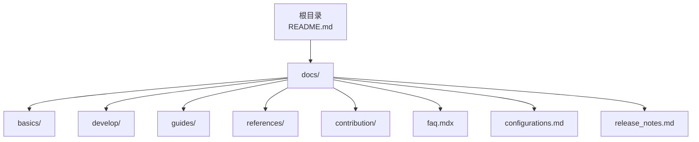
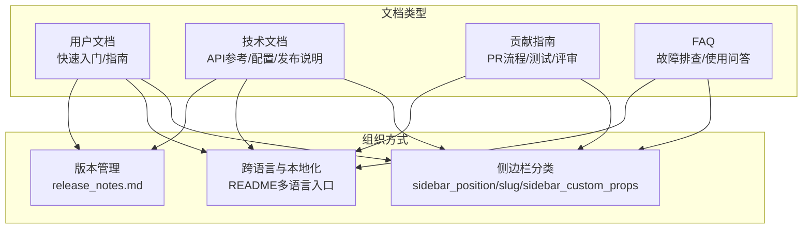
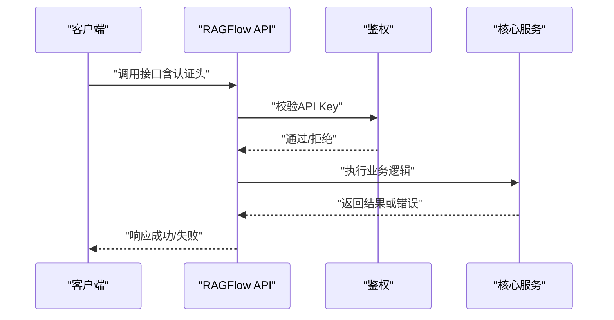
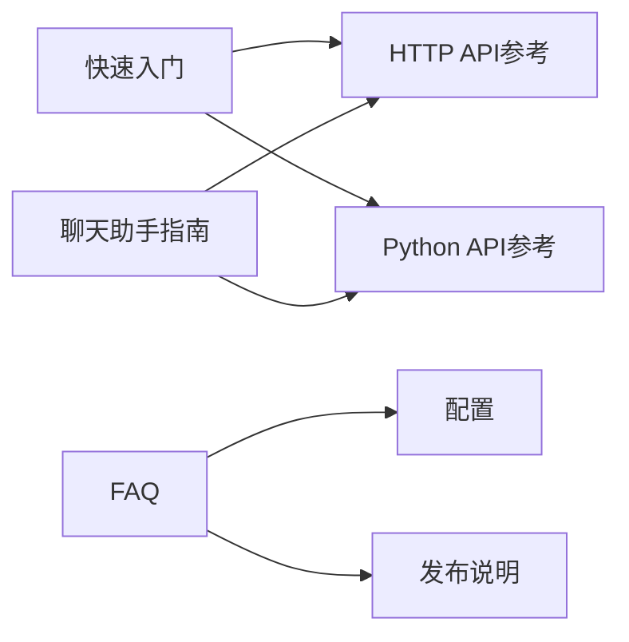

# 文档编写规范

<cite>
**本文引用的文件**
- [README.md](file://README.md)
- [docs/quickstart.mdx](file://docs/quickstart.mdx)
- [docs/references/http_api_reference.md](file://docs/references/http_api_reference.md)
- [docs/references/python_api_reference.md](file://docs/references/python_api_reference.md)
- [docs/contribution/contributing.md](file://docs/contribution/contributing.md)
- [docs/guides/admin/admin_ui.md](file://docs/guides/admin/admin_ui.md)
- [docs/guides/chat/start_chat.md](file://docs/guides/chat/start_chat.md)
- [docs/guides/dataset/configure_knowledge_base.md](file://docs/guides/dataset/configure_knowledge_base.md)
- [docs/faq.mdx](file://docs/faq.mdx)
- [docs/configurations.md](file://docs/configurations.md)
- [docs/release_notes.md](file://docs/release_notes.md)
</cite>

## 目录
1. [引言](#引言)
2. [项目结构](#项目结构)
3. [核心组件](#核心组件)
4. [架构总览](#架构总览)
5. [详细组件分析](#详细组件分析)
6. [依赖关系分析](#依赖关系分析)
7. [性能考量](#性能考量)
8. [故障排查指南](#故障排查指南)
9. [结论](#结论)
10. [附录](#附录)

## 引言
本规范面向RAGFlow项目的开发者与贡献者，旨在建立统一、可维护、高质量的文档编写标准与流程。内容覆盖文档类型与用途、结构与组织方式、Markdown与文档生成工具使用、API文档编写标准、示例代码规范、多语言支持与版本管理，以及文档质量检查清单。目标是提升文档的准确性、完整性与可读性，降低协作成本，加速知识传递。

## 项目结构
RAGFlow采用以“主题分类”为主的文档组织方式，通过Docusaurus（MDX）构建静态站点，配合侧边栏与分类目录实现清晰的知识导航。现有文档主要分为以下类别：
- 快速入门：引导用户从零开始部署与使用系统
- 指南：面向业务场景的操作步骤与最佳实践
- 参考：API与模型等权威参考
- 贡献：社区贡献流程与规范
- 常见问题：运维与使用中的常见问题与解答
- 配置：系统级配置与环境变量说明
- 发布说明：版本特性、改进与修复记录

图示来源
- [README.md](file://README.md)
- [docs/quickstart.mdx](file://docs/quickstart.mdx)
- [docs/references/http_api_reference.md](file://docs/references/http_api_reference.md)
- [docs/references/python_api_reference.md](file://docs/references/python_api_reference.md)
- [docs/contribution/contributing.md](file://docs/contribution/contributing.md)
- [docs/guides/admin/admin_ui.md](file://docs/guides/admin/admin_ui.md)
- [docs/guides/chat/start_chat.md](file://docs/guides/chat/start_chat.md)
- [docs/guides/dataset/configure_knowledge_base.md](file://docs/guides/dataset/configure_knowledge_base.md)
- [docs/faq.mdx](file://docs/faq.mdx)
- [docs/configurations.md](file://docs/configurations.md)
- [docs/release_notes.md](file://docs/release_notes.md)

章节来源
- [README.md](file://README.md)
- [docs/quickstart.mdx](file://docs/quickstart.mdx)

## 核心组件
- 快速入门：提供从安装到创建数据集、解析文件、启动聊天的端到端流程，强调前置条件与关键步骤确认
- 指南类文档：按功能模块组织，如管理员界面、聊天助手、数据集配置等，注重操作步骤与截图辅助
- API参考：HTTP与Python SDK的完整接口说明，含请求/响应示例、参数定义与错误码
- 贡献指南：PR工作流、测试要求、描述规范与评审流程
- 常见问题：按“通用特性/故障排查/使用方法”分段，便于检索
- 配置文档：Docker环境变量、Compose文件与服务配置模板说明
- 发布说明：版本特性、改进与修复记录，便于升级与迁移

章节来源
- [docs/guides/admin/admin_ui.md](file://docs/guides/admin/admin_ui.md)
- [docs/guides/chat/start_chat.md](file://docs/guides/chat/start_chat.md)
- [docs/guides/dataset/configure_knowledge_base.md](file://docs/guides/dataset/configure_knowledge_base.md)
- [docs/references/http_api_reference.md](file://docs/references/http_api_reference.md)
- [docs/references/python_api_reference.md](file://docs/references/python_api_reference.md)
- [docs/contribution/contributing.md](file://docs/contribution/contributing.md)
- [docs/faq.mdx](file://docs/faq.mdx)
- [docs/configurations.md](file://docs/configurations.md)
- [docs/release_notes.md](file://docs/release_notes.md)

## 架构总览
下图展示文档体系与内容类型的对应关系，帮助理解各类文档在知识地图中的定位与职责边界。

图示来源
- [docs/quickstart.mdx](file://docs/quickstart.mdx)
- [docs/references/http_api_reference.md](file://docs/references/http_api_reference.md)
- [docs/references/python_api_reference.md](file://docs/references/python_api_reference.md)
- [docs/contribution/contributing.md](file://docs/contribution/contributing.md)
- [docs/faq.mdx](file://docs/faq.mdx)
- [docs/configurations.md](file://docs/configurations.md)
- [docs/release_notes.md](file://docs/release_notes.md)
- [README.md](file://README.md)

## 详细组件分析

### 用户文档（快速入门与指南）
- 写作风格：步骤化、可复现、强调前置条件与确认点
- 结构要点：前置条件、安装步骤、关键配置、验证输出、截图与链接
- 示例路径：[快速开始](file://docs/quickstart.mdx)，[管理员界面](file://docs/guides/admin/admin_ui.md)，[聊天助手](file://docs/guides/chat/start_chat.md)，[数据集配置](file://docs/guides/dataset/configure_knowledge_base.md)

章节来源
- [docs/quickstart.mdx](file://docs/quickstart.mdx)
- [docs/guides/admin/admin_ui.md](file://docs/guides/admin/admin_ui.md)
- [docs/guides/chat/start_chat.md](file://docs/guides/chat/start_chat.md)
- [docs/guides/dataset/configure_knowledge_base.md](file://docs/guides/dataset/configure_knowledge_base.md)

### API文档（HTTP与Python SDK）
- 写作标准：
  - 接口描述：方法、URL、认证方式
  - 请求参数：字段名、类型、是否必填、取值范围与默认值
  - 响应说明：成功/失败结构、状态码、错误码与消息
  - 示例：最小可运行请求与典型响应片段
- 错误处理：统一错误码表与常见错误场景说明
- 示例路径：[HTTP API参考](file://docs/references/http_api_reference.md)，[Python API参考](file://docs/references/python_api_reference.md)

图示来源
- [docs/references/http_api_reference.md](file://docs/references/http_api_reference.md)
- [docs/references/python_api_reference.md](file://docs/references/python_api_reference.md)

章节来源
- [docs/references/http_api_reference.md](file://docs/references/http_api_reference.md)
- [docs/references/python_api_reference.md](file://docs/references/python_api_reference.md)

### 技术文档（配置与发布说明）
- 配置文档：明确环境变量、Compose文件与服务配置模板的关系，强调重启生效与端口映射
- 发布说明：按版本归档，突出新特性、改进与修复，便于升级与迁移
- 示例路径：[配置](file://docs/configurations.md)，[发布说明](file://docs/release_notes.md)

章节来源
- [docs/configurations.md](file://docs/configurations.md)
- [docs/release_notes.md](file://docs/release_notes.md)

### 贡献指南（社区协作）
- PR工作流：分支命名、提交信息、变更粒度与测试要求
- 描述规范：标题简洁、关联Issue、重大变更的设计细节
- 评审与合并：CI通过后合并
- 示例路径：[贡献指南](file://docs/contribution/contributing.md)

章节来源
- [docs/contribution/contributing.md](file://docs/contribution/contributing.md)

### 常见问题（FAQ）
- 分类组织：通用特性、故障排查、使用方法
- 检索友好：标题层级清晰、关键词突出
- 示例路径：[FAQ](file://docs/faq.mdx)

章节来源
- [docs/faq.mdx](file://docs/faq.mdx)

## 依赖关系分析
文档之间的依赖关系体现在“交叉引用”与“导航结构”上。例如：
- 快速入门中多次指向API参考与Python参考
- 指南类文档在“开始聊天”中引用API参考
- FAQ中回溯至配置与发布说明

图示来源
- [docs/quickstart.mdx](file://docs/quickstart.mdx)
- [docs/references/http_api_reference.md](file://docs/references/http_api_reference.md)
- [docs/references/python_api_reference.md](file://docs/references/python_api_reference.md)
- [docs/guides/chat/start_chat.md](file://docs/guides/chat/start_chat.md)
- [docs/faq.mdx](file://docs/faq.mdx)
- [docs/configurations.md](file://docs/configurations.md)
- [docs/release_notes.md](file://docs/release_notes.md)

章节来源
- [docs/quickstart.mdx](file://docs/quickstart.mdx)
- [docs/guides/chat/start_chat.md](file://docs/guides/chat/start_chat.md)
- [docs/faq.mdx](file://docs/faq.mdx)

## 性能考量
- 文档生成与渲染：合理使用组件（如表格、标签页、内嵌图表）避免过度复杂化页面
- 内容更新频率：发布说明与FAQ需及时同步，减少读者在不同渠道间切换的成本
- 多语言与本地化：README提供多语言入口，建议在文档中保留英文原文与翻译对照链接

## 故障排查指南
- 网络异常与初始化：确认服务完全初始化后再登录
- 解析卡顿与内存不足：检查日志、容器健康状态与资源限制
- Elasticsearch相关：核对vm.max_map_count、容器状态与端口映射
- 文件上传与存储：确认MinIO与对象存储配置正确
- 第三方模型访问：镜像站/HF端点、网络连通性与令牌配置

章节来源
- [docs/faq.mdx](file://docs/faq.mdx)
- [docs/configurations.md](file://docs/configurations.md)

## 结论
通过统一的文档类型与组织方式、严格的API与示例规范、完善的多语言与版本管理策略，以及持续的质量检查机制，RAGFlow的文档体系能够有效支撑用户与贡献者的知识获取与协作效率。建议在后续迭代中进一步完善自动化校验与多语言翻译流程，持续优化文档的可发现性与一致性。

## 附录

### 文档类型与用途
- 用户文档：面向最终用户，强调可操作性与可复现性
- 技术文档：面向工程师与运维，强调准确性与权威性
- 贡献指南：面向贡献者，强调流程规范与质量门槛
- 常见问题：面向使用者与支持团队，强调可检索性与时效性

### 结构与组织方式
- 目录规划：按“主题分类 + 子主题”的层级组织
- 章节划分：每个文档聚焦单一任务或主题，避免“大而全”
- 交叉引用：使用相对路径与锚点，保持内部链接稳定

### Markdown与文档生成工具
- 使用约定：
  - 标题层级：H1用于页面标题，H2起用于章节
  - 列表与断行：使用简洁列表，必要时使用段落说明
  - 代码块：标注语言，避免粘贴长文本
  - 图表：优先使用Mermaid，配合图示来源标注
- 工具链：基于Docusaurus（MDX），通过sidebar_position/slug/sidebar_custom_props控制侧边栏与路由

### API文档编写标准
- 接口描述：方法、URL、认证方式
- 请求参数：字段、类型、是否必填、默认值与取值范围
- 响应说明：成功/失败结构、状态码、错误码与消息
- 示例：最小可运行请求与典型响应片段
- 错误处理：统一错误码表与常见错误场景说明

### 示例代码编写规范
- 注释：解释关键步骤与参数含义
- 完整示例：提供可直接使用的最小化示例
- 可运行性：确保示例与当前版本兼容，必要时标注版本范围

### 多语言文档支持
- 翻译流程：以英文为基准，提供翻译对照与审核机制
- 本地化：README提供多语言入口，其他文档按需提供本地化版本
- 版本管理：发布说明与FAQ按版本归档，便于追踪变更

### 文档质量检查清单
- 准确性：接口参数、示例与实际行为一致
- 完整性：涵盖所有重要参数、错误码与使用场景
- 易读性：标题层级清晰、语言简洁、有必要的截图与图示
- 一致性：术语统一、风格一致、链接稳定
- 可维护性：遵循模板与流程，定期回顾与更新