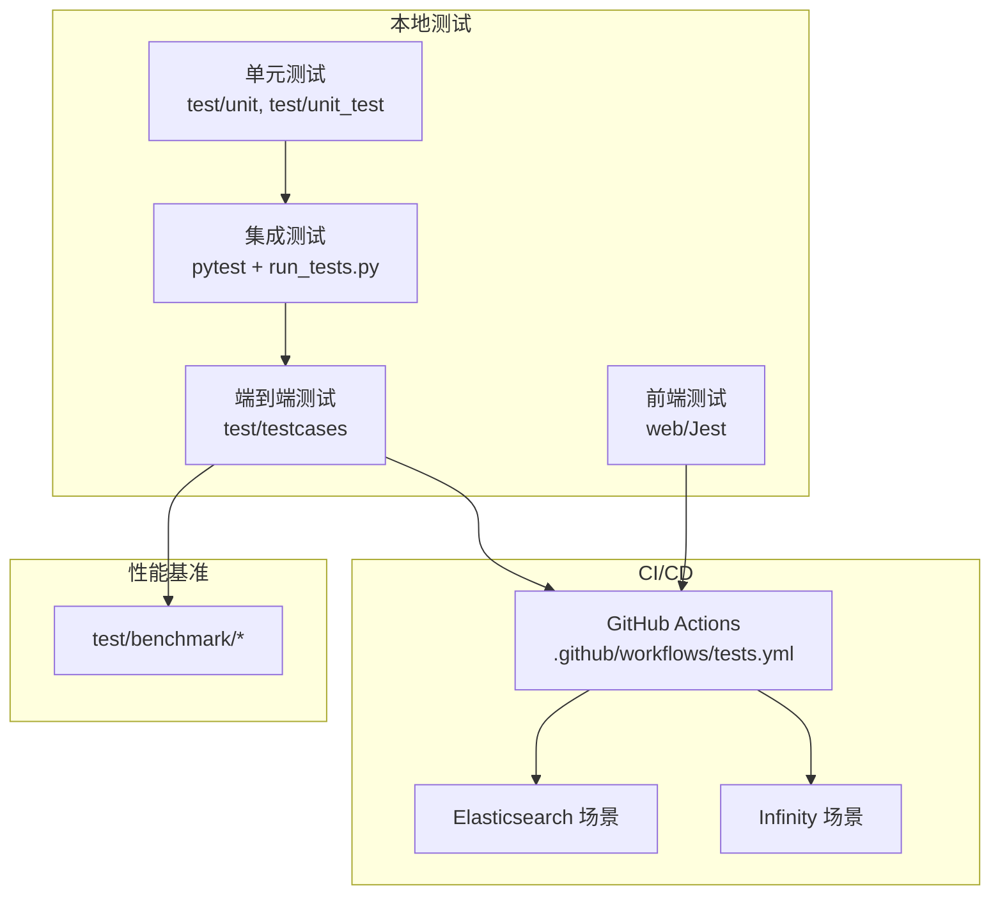
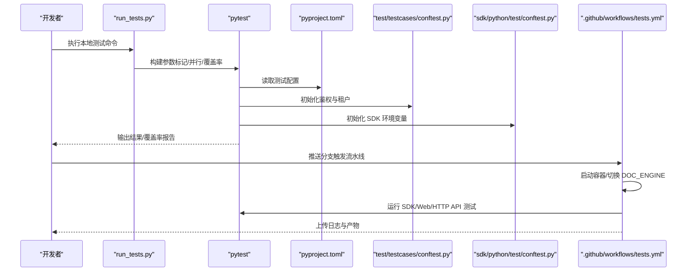
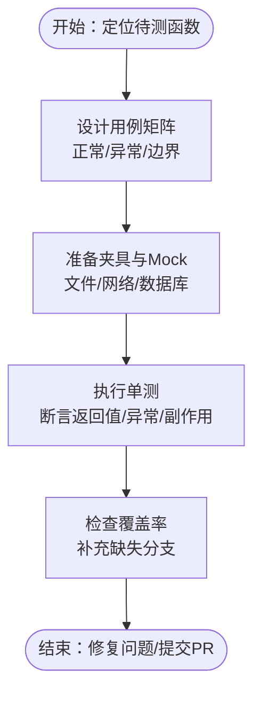
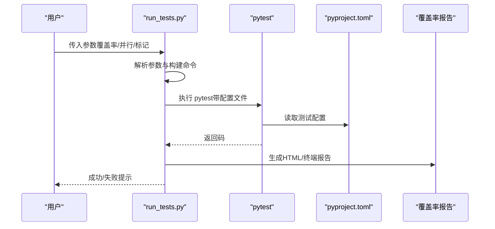
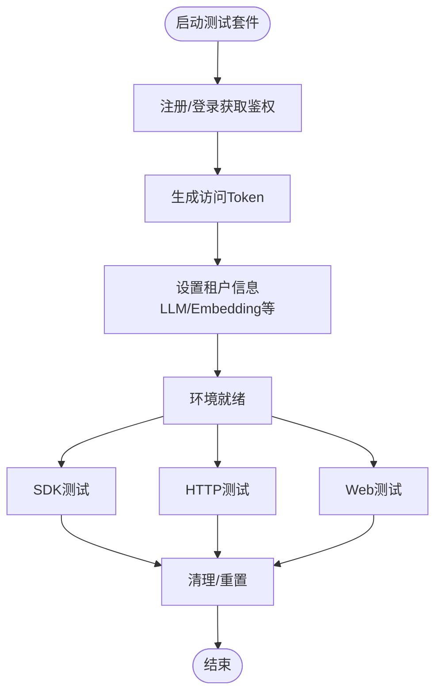
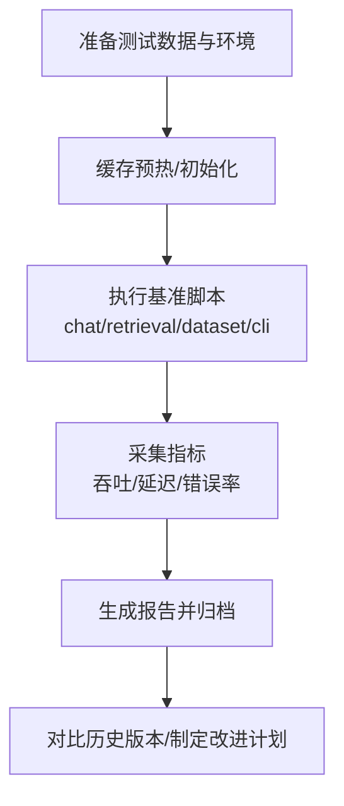
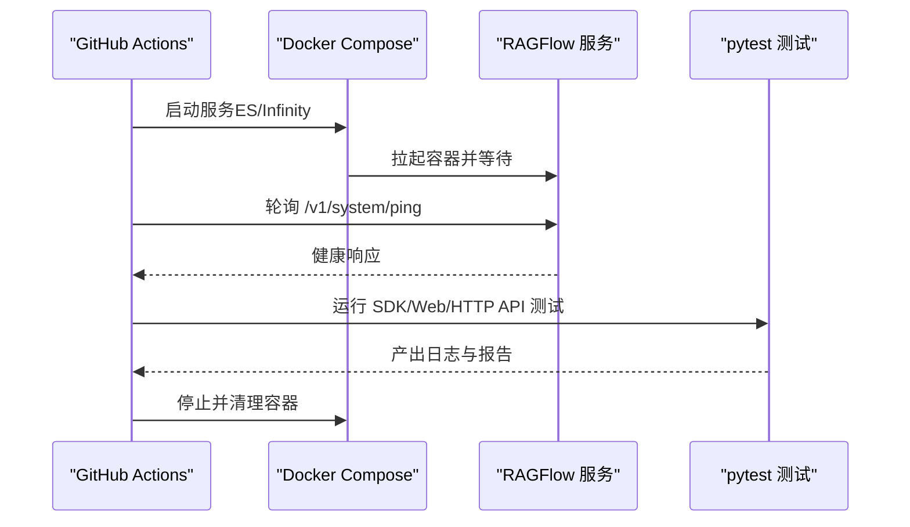
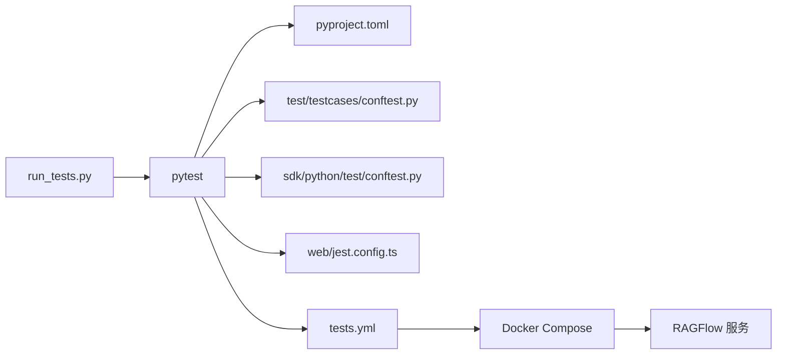

# 测试策略与实践

<cite>
**本文引用的文件**
- [pyproject.toml](file://pyproject.toml)
- [run_tests.py](file://run_tests.py)
- [test/README.md](file://test/README.md)
- [test/testcases/conftest.py](file://test/testcases/conftest.py)
- [sdk/python/test/conftest.py](file://sdk/python/test/conftest.py)
- [web/jest.config.ts](file://web/jest.config.ts)
- [.github/workflows/tests.yml](file://.github/workflows/tests.yml)
- [graspologic/pytest.ini](file://graspologic/pytest.ini)
- [test/unit/test_delete_query_construction.py](file://test/unit/test_delete_query_construction.py)
- [test/unit_test/common/test_string_utils.py](file://test/unit_test/common/test_string_utils.py)
- [test/benchmark/chat.py](file://test/benchmark/chat.py)
- [test/benchmark/retrieval.py](file://test/benchmark/retrieval.py)
- [test/benchmark/dataset.py](file://test/benchmark/dataset.py)
- [test/benchmark/cli.py](file://test/benchmark/cli.py)
- [test/benchmark/utils.py](file://test/benchmark/utils.py)
- [test/benchmark/report.py](file://test/benchmark/report.py)
- [test/benchmark/metrics.py](file://test/benchmark/metrics.py)
- [test/benchmark/run_chat.sh](file://test/benchmark/run_chat.sh)
- [test/benchmark/run_retrieval.sh](file://test/benchmark/run_retrieval.sh)
- [test/benchmark/run_retrieval_chat.sh](file://test/benchmark/run_retrieval_chat.sh)
- [sandbox/tests/sandbox_security_tests_full.py](file://sandbox/tests/sandbox_security_tests_full.py)
</cite>

## 目录
1. [引言](#引言)
2. [项目结构](#项目结构)
3. [核心组件](#核心组件)
4. [架构总览](#架构总览)
5. [详细组件分析](#详细组件分析)
6. [依赖关系分析](#依赖关系分析)
7. [性能考量](#性能考量)
8. [故障排查指南](#故障排查指南)
9. [结论](#结论)
10. [附录](#附录)

## 引言
本指南面向开发者，系统化梳理 RAGFlow 的测试策略与实践，覆盖测试金字塔（单元测试、集成测试、端到端测试）、测试框架选择与配置（pytest、Jest）、测试数据准备与管理、性能与压力测试、持续集成中的测试自动化、测试覆盖率要求与提升策略，以及测试驱动开发（TDD）与反向测试实践。文档以仓库现有测试体系为依据，结合配置文件与脚本，给出可操作的建议与流程图示。

## 项目结构
RAGFlow 的测试体系由多层构成：
- 单元测试：位于 test/unit 与 test/unit_test，覆盖通用工具与算法模块。
- 集成测试：通过 run_tests.py 统一调度 pytest，支持标记过滤、并行执行与覆盖率统计。
- 端到端测试：位于 test/testcases，按客户端类型（Python SDK、HTTP、Web）分层组织，配合 conftest 进行环境初始化与鉴权。
- 前端测试：web 目录下 Jest 配置用于前端组件与逻辑的单元测试。
- 性能基准：test/benchmark 提供检索、聊天、数据集与 CLI 的基准脚本与指标采集。
- 持续集成：.github/workflows/tests.yml 在不同文档引擎（Elasticsearch 与 Infinity）上运行端到端测试，并收集日志与产物。

图表来源
- [pyproject.toml](file://pyproject.toml)
- [run_tests.py](file://run_tests.py)
- [test/testcases/conftest.py](file://test/testcases/conftest.py)
- [web/jest.config.ts](file://web/jest.config.ts)
- [.github/workflows/tests.yml](file://.github/workflows/tests.yml)
- [test/benchmark/chat.py](file://test/benchmark/chat.py)

章节来源
- [pyproject.toml](file://pyproject.toml)
- [run_tests.py](file://run_tests.py)
- [test/README.md](file://test/README.md)

## 核心组件
- 测试框架与配置
  - 后端统一使用 pytest，配置于 pyproject.toml，包含标记系统（p1/p2/p3）、严格标记、简短回溯、禁用警告等。
  - 覆盖率配置在 pyproject.toml 中定义，源码路径与忽略规则明确。
  - run_tests.py 封装 pytest 调用，支持并行（pytest-xdist）、覆盖率（pytest-cov）与标记过滤。
- 端到端测试基座
  - test/testcases/conftest.py 定义测试级别（p1/p2/p3）与客户端类型（python_sdk/http/web），提供会话级鉴权与租户初始化。
  - sdk/python/test/conftest.py 为 SDK 测试提供 HOST_ADDRESS、鉴权与租户信息设置。
- 前端测试
  - web/jest.config.ts 配置浏览器目标、esbuild 转换器、覆盖率阈值与收集范围。
- 性能基准
  - test/benchmark 下包含检索、聊天、数据集与 CLI 的基准脚本与指标采集工具，配套 shell 脚本批量执行。
- CI/CD
  - .github/workflows/tests.yml 在 Elasticsearch 与 Infinity 两种文档引擎下运行 SDK/Web/HTTP API 测试，收集服务日志并清理资源。

章节来源
- [pyproject.toml](file://pyproject.toml)
- [run_tests.py](file://run_tests.py)
- [test/testcases/conftest.py](file://test/testcases/conftest.py)
- [sdk/python/test/conftest.py](file://sdk/python/test/conftest.py)
- [web/jest.config.ts](file://web/jest.config.ts)
- [test/benchmark/chat.py](file://test/benchmark/chat.py)
- [.github/workflows/tests.yml](file://.github/workflows/tests.yml)

## 架构总览
下图展示从本地到 CI 的测试执行链路，以及测试数据与环境准备的关键节点。

图表来源
- [run_tests.py](file://run_tests.py)
- [pyproject.toml](file://pyproject.toml)
- [test/testcases/conftest.py](file://test/testcases/conftest.py)
- [sdk/python/test/conftest.py](file://sdk/python/test/conftest.py)
- [.github/workflows/tests.yml](file://.github/workflows/tests.yml)

## 详细组件分析

### 单元测试：组织与最佳实践
- 目录分布
  - test/unit：少量独立用例示例，如查询构造删除逻辑。
  - test/unit_test：按功能域划分的通用工具与算法测试，例如字符串、时间、令牌等工具类。
- 编写要点
  - 使用 pytest 断言与参数化，优先针对纯函数与边界条件。
  - 通过夹具（fixture）模拟外部依赖，避免真实网络或数据库调用。
  - 保持用例粒度小、命名清晰，聚焦单一行为。
- 复杂度与性能
  - 工具类测试通常 O(1) 或 O(n) 线性复杂度，注意对极端输入（空值、超长、特殊字符）的覆盖。
  - 并行执行时避免共享状态，必要时使用独立临时目录或锁。

章节来源
- [test/unit/test_delete_query_construction.py](file://test/unit/test_delete_query_construction.py)
- [test/unit_test/common/test_string_utils.py](file://test/unit_test/common/test_string_utils.py)

### 集成测试：pytest 配置与 run_tests.py
- 配置要点
  - 标记系统：p1（冒烟）、p2（核心）、p3（全量）；通过 --level 切换表达式。
  - 严格模式：--strict-markers，确保标记定义一致。
  - 回溯与输出：--tb=short，彩色输出，禁用警告或将其视为错误。
  - 覆盖率：--cov 指向 common 源码目录，生成 HTML 与终端报告。
  - 并行：-n auto 或基于 CPU 核数的 -n N，加速执行。
- run_tests.py 行为
  - 解析参数：--coverage/--parallel/--verbose/-m/--test。
  - 构建命令：拼接 pytest 参数与 pyproject.toml 配置文件路径。
  - 执行与反馈：捕获返回码、中断信号与异常，生成覆盖率索引页。

图表来源
- [run_tests.py](file://run_tests.py)
- [pyproject.toml](file://pyproject.toml)

章节来源
- [pyproject.toml](file://pyproject.toml)
- [run_tests.py](file://run_tests.py)

### 端到端测试：客户端类型与环境准备
- 客户端类型
  - python_sdk：通过 SDK 测试夹具设置 HOST_ADDRESS、鉴权与租户信息。
  - http：直接调用后端 HTTP API，依赖 conftest 的鉴权与租户初始化。
  - web：前端 Web API 测试，配合 Jest 配置与覆盖率阈值。
- 环境准备
  - conftest 注册/登录，获取 Authorization 与新 Token。
  - 设置租户信息（LLM/Embedding/OCR/ASR/TTS），保证测试一致性。
  - 支持通过环境变量切换 DOC_ENGINE（Elasticsearch/Infinity）与测试级别（--level）。
- 数据准备与隔离
  - 使用一次性邮箱与固定密码，避免跨测试污染。
  - 通过夹具自动注入鉴权头，减少重复样板代码。
  - 对数据库/索引的增删改查应尽量在测试前后清理，或使用隔离的测试租户。

图表来源
- [test/testcases/conftest.py](file://test/testcases/conftest.py)
- [sdk/python/test/conftest.py](file://sdk/python/test/conftest.py)

章节来源
- [test/testcases/conftest.py](file://test/testcases/conftest.py)
- [sdk/python/test/conftest.py](file://sdk/python/test/conftest.py)
- [test/README.md](file://test/README.md)

### 前端测试：Jest 配置与覆盖率
- 配置要点
  - 目标浏览器、JS 转换器（esbuild）、自动 JSX 语法。
  - 覆盖收集范围限制在源代码目录，排除 .umi、dist、config、mock 等。
  - 全局覆盖率阈值（lines）设为 1，便于逐步提升。
- 最佳实践
  - 为组件与工具函数分别编写单元测试，使用 React Testing Library 或 Jest DOM。
  - 对异步逻辑使用 waitFor 与 act 包裹，确保 DOM 更新完成。
  - 通过 setupFilesAfterEnv 注入自定义断言与工具。

章节来源
- [web/jest.config.ts](file://web/jest.config.ts)

### 性能与压力测试：基准与指标
- 基准脚本
  - chat.py、retrieval.py、dataset.py、cli.py 提供典型场景的基准执行入口。
  - utils.py、metrics.py、report.py 提供指标采集与报告生成能力。
  - run_chat.sh、run_retrieval.sh、run_retrieval_chat.sh 提供一键执行脚本。
- 实施建议
  - 明确基线：在稳定环境（相同硬件、相同数据规模）下运行，记录吞吐、延迟与错误率。
  - 分层压测：先单接口，再端到端链路；逐步增加并发与数据量。
  - 可重复性：固定随机种子、缓存预热、关闭调试输出。
  - 报告归档：将指标与日志归档至 CI 产物，便于对比版本差异。

章节来源
- [test/benchmark/chat.py](file://test/benchmark/chat.py)
- [test/benchmark/retrieval.py](file://test/benchmark/retrieval.py)
- [test/benchmark/dataset.py](file://test/benchmark/dataset.py)
- [test/benchmark/cli.py](file://test/benchmark/cli.py)
- [test/benchmark/utils.py](file://test/benchmark/utils.py)
- [test/benchmark/report.py](file://test/benchmark/report.py)
- [test/benchmark/metrics.py](file://test/benchmark/metrics.py)
- [test/benchmark/run_chat.sh](file://test/benchmark/run_chat.sh)
- [test/benchmark/run_retrieval.sh](file://test/benchmark/run_retrieval.sh)
- [test/benchmark/run_retrieval_chat.sh](file://test/benchmark/run_retrieval_chat.sh)

### 持续集成：测试自动化与报告
- 流水线步骤
  - 启动服务：根据 COMPOSE_PROFILES 与 RAGFLOW_IMAGE 启动后端容器。
  - 等待健康：轮询 /v1/system/ping，确保服务可用。
  - 运行测试：分别在 Elasticsearch 与 Infinity 场景下执行 SDK/Web/HTTP API 测试。
  - 收集日志：复制 ragflow 日志到 ARTIFACTS_DIR，便于问题定位。
  - 清理资源：停止容器并移除残留镜像与容器。
- 最佳实践
  - 将测试与构建解耦，先构建镜像再运行测试。
  - 使用标签化日志与分步产物，缩短定位时间。
  - 对不稳定测试（网络/第三方 API）添加重试与降级策略。

图表来源
- [.github/workflows/tests.yml](file://.github/workflows/tests.yml)

章节来源
- [.github/workflows/tests.yml](file://.github/workflows/tests.yml)

### 测试覆盖率：要求与提升策略
- 当前配置
  - 源码目录：common。
  - 忽略路径：tests、test_*、__pycache__、.pytest_cache、虚拟环境、dist、migrations、setup.py 等。
  - 报告格式：HTML 与终端；最小覆盖率阈值为 0（可按需调整）。
- 提升策略
  - 逐步提高阈值：从 lines 1% 开始，逐模块提升至 80%+。
  - 关键路径优先：对业务核心模块（api/db/services、rag/*）优先补齐。
  - 用例质量：关注分支覆盖与异常路径覆盖，避免“为覆盖而覆盖”。
  - 工具辅助：结合覆盖率报告定位低覆盖区域，针对性补充用例。

章节来源
- [pyproject.toml](file://pyproject.toml)

### 测试驱动开发（TDD）与反向测试
- TDD 实践
  - 红—绿—重构循环：先写失败用例，再实现最小逻辑，最后重构。
  - 从简单到复杂：先覆盖基本场景，再扩展边界与异常。
  - 用例即文档：用例命名与断言描述应清晰表达预期行为。
- 反向测试
  - 针对已知缺陷编写回归用例，防止问题复现。
  - 对热点路径与性能瓶颈进行回归验证，确保修复不引入新问题。
  - 结合基准测试，验证修复后的性能影响。

## 依赖关系分析
- 组件耦合
  - run_tests.py 与 pytest 配置强耦合，通过 pyproject.toml 控制默认行为。
  - 端到端测试依赖 conftest 的鉴权与租户设置，形成稳定的前置条件。
  - 前端测试与后端 API 独立，但可通过环境变量共享 HOST_ADDRESS。
- 外部依赖
  - CI 依赖 Docker Compose 与后端镜像；测试前需确保服务可达。
  - 第三方模型与 API（如 ZHIPU AI）需正确配置密钥，否则测试会提前退出。

图表来源
- [run_tests.py](file://run_tests.py)
- [pyproject.toml](file://pyproject.toml)
- [test/testcases/conftest.py](file://test/testcases/conftest.py)
- [sdk/python/test/conftest.py](file://sdk/python/test/conftest.py)
- [web/jest.config.ts](file://web/jest.config.ts)
- [.github/workflows/tests.yml](file://.github/workflows/tests.yml)

章节来源
- [pyproject.toml](file://pyproject.toml)
- [run_tests.py](file://run_tests.py)
- [test/testcases/conftest.py](file://test/testcases/conftest.py)
- [sdk/python/test/conftest.py](file://sdk/python/test/conftest.py)
- [web/jest.config.ts](file://web/jest.config.ts)
- [.github/workflows/tests.yml](file://.github/workflows/tests.yml)

## 性能考量
- 单元测试
  - 优先无外部依赖的纯函数测试，减少 I/O 与网络开销。
  - 使用小型测试数据集，避免不必要的计算放大。
- 集成测试
  - 合理使用并行（-n auto），但注意磁盘与网络带宽上限。
  - 将高成本测试（如数据库重建）拆分为独立任务。
- 端到端测试
  - 通过标记系统（p1/p2/p3）控制执行范围，CI 中可先跑冒烟与核心用例。
  - 对第三方服务（LLM/Embedding）添加超时与重试，避免偶发失败拖慢整体。
- 基准测试
  - 固定硬件与数据规模，记录基线；每次变更后对比指标变化。
  - 将基准测试纳入 CI，形成“性能门禁”。

## 故障排查指南
- 本地测试失败
  - 检查 run_tests.py 输出与返回码；确认覆盖率报告路径是否生成。
  - 使用 --tb=long 获取完整堆栈，定位具体断言失败点。
- 端到端测试鉴权失败
  - 确认 HOST_ADDRESS、ZHIPU_AI_API_KEY 环境变量已设置。
  - 查看 conftest 的注册/登录流程与租户设置是否成功。
- CI 流水线超时
  - 检查服务健康检查轮询间隔与超时设置。
  - 查看 ARTIFACTS_DIR 中的日志尾部，定位阻塞点。
- 前端测试覆盖率低
  - 确认 collectCoverageFrom 覆盖范围与排除规则是否符合预期。
  - 逐步提升全局阈值，确保关键组件被覆盖。

章节来源
- [run_tests.py](file://run_tests.py)
- [test/testcases/conftest.py](file://test/testcases/conftest.py)
- [sdk/python/test/conftest.py](file://sdk/python/test/conftest.py)
- [.github/workflows/tests.yml](file://.github/workflows/tests.yml)
- [web/jest.config.ts](file://web/jest.config.ts)

## 结论
RAGFlow 的测试体系以 pytest 为核心，结合 run_tests.py 的统一入口、端到端测试的环境夹具与 CI 的多场景执行，形成了从单元到端到端的完整闭环。建议在现有基础上进一步完善覆盖率阈值、性能门禁与 TDD 文化，持续提升测试质量与交付效率。

## 附录
- 测试框架选择与配置
  - 后端：pytest（标记、并行、覆盖率、严格模式）。
  - 前端：Jest（esbuild 转换、覆盖率阈值、浏览器目标）。
  - 参考配置文件见 pyproject.toml、web/jest.config.ts、graspologic/pytest.ini。
- 测试数据与隔离
  - 使用夹具统一注册/登录/租户设置，避免跨用例污染。
  - 对数据库/索引操作建议在测试前后清理或使用隔离租户。
- 持续集成最佳实践
  - 将冒烟与核心测试放在 PR 验证阶段，全量测试放入 nightly。
  - 对不稳定测试添加重试与降级，保障流水线稳定性。