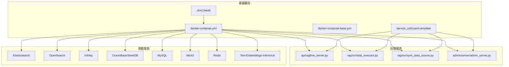
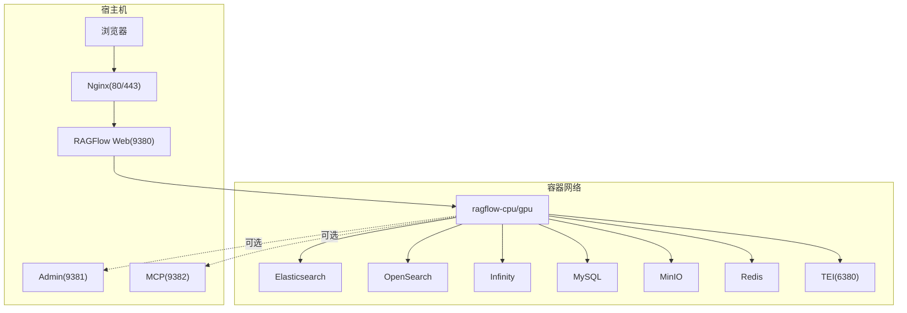
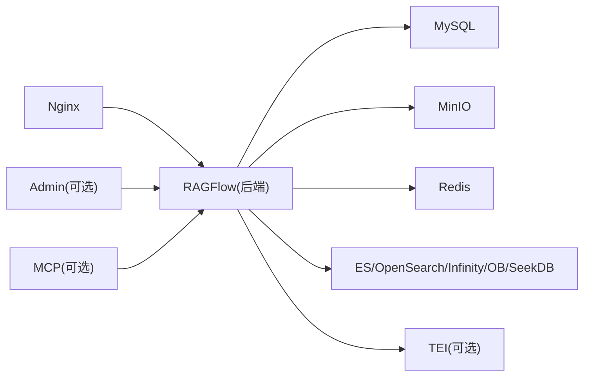

# 快速开始

<cite>
**本文引用的文件列表**
- [README.md](file://README.md)
- [docs/quickstart.mdx](file://docs/quickstart.mdx)
- [docs/configurations.md](file://docs/configurations.md)
- [docs/faq.mdx](file://docs/faq.mdx)
- [docs/develop/launch_ragflow_from_source.md](file://docs/develop/launch_ragflow_from_source.md)
- [docker/docker-compose.yml](file://docker/docker-compose.yml)
- [docker/docker-compose-base.yml](file://docker/docker-compose-base.yml)
- [docker/.env_base](file://docker/.env_base)
- [docker/service_conf.yaml.template](file://docker/service_conf.yaml.template)
- [docker/entrypoint.sh](file://docker/entrypoint.sh)
- [docker/README.md](file://docker/README.md)
</cite>

## 目录
1. [简介](#简介)
2. [项目结构](#项目结构)
3. [核心组件](#核心组件)
4. [架构总览](#架构总览)
5. [详细组件分析](#详细组件分析)
6. [依赖关系分析](#依赖关系分析)
7. [性能与资源建议](#性能与资源建议)
8. [故障排查指南](#故障排查指南)
9. [结论](#结论)
10. [附录](#附录)

## 简介
本指南面向首次接触 RAGFlow 的用户，提供从零到一的完整部署与使用路径。内容覆盖：
- 系统前置条件（硬件、软件依赖）
- 两种部署方式：Docker 一键部署与源码编译部署
- 环境配置要点（vm.max_map_count、Docker 准备、.env 配置）
- 首次登录与基础使用（默认账号密码、界面导航、基础功能体验）
- 常见部署问题与故障排除
- 最短时间上手体验 RAGFlow 的核心能力

## 项目结构
RAGFlow 采用多模块分层设计，后端以 Python 为主，前端基于 Web 技术，容器化通过 Docker Compose 编排。核心目录与职责概览：
- docker：Docker 镜像、Compose 文件、入口脚本、服务配置模板
- api：后端服务入口与路由
- web：前端页面与交互
- docs：官方文档与快速开始、配置、FAQ 等
- 其他子模块：检索增强、Agent、解析器、存储、工具等

图表来源
- [docker/docker-compose.yml:1-133](file://docker/docker-compose.yml#L1-L133)
- [docker/docker-compose-base.yml:1-326](file://docker/docker-compose-base.yml#L1-L326)
- [docker/service_conf.yaml.template:1-200](file://docker/service_conf.yaml.template#L1-L200)

章节来源
- [README.md:143-251](file://README.md#L143-L251)
- [docs/quickstart.mdx:40-244](file://docs/quickstart.mdx#L40-L244)

## 核心组件
- 后端服务
  - Web 服务：Nginx + Python Web 服务，对外提供 HTTP 接口
  - 任务执行器：负责文档解析、向量化、索引等后台任务
  - 数据同步：从外部数据源拉取并入库
  - 管理服务：可选的管理接口
- 依赖服务
  - 搜索引擎：Elasticsearch 或 OpenSearch（默认）
  - AI 引擎：Infinity、OceanBase、SeekDB（可选）
  - 存储：MySQL、MinIO、Redis
  - 嵌入模型：可选 TEI（text-embeddings-inference）CPU/GPU
- 前端
  - Web 界面，支持数据集管理、文件解析、检索测试、聊天对话等

章节来源
- [docker/docker-compose.yml:4-133](file://docker/docker-compose.yml#L4-L133)
- [docker/docker-compose-base.yml:1-326](file://docker/docker-compose-base.yml#L1-L326)
- [docker/entrypoint.sh:220-273](file://docker/entrypoint.sh#L220-L273)

## 架构总览
下图展示 Docker 一键部署时各组件的交互关系与端口映射，以及服务间依赖。

图表来源
- [docker/docker-compose.yml:31-95](file://docker/docker-compose.yml#L31-L95)
- [docker/docker-compose-base.yml:2-326](file://docker/docker-compose-base.yml#L2-L326)

## 详细组件分析

### 1) 前置条件与环境准备
- 硬件要求
  - CPU ≥ 4 核；内存 ≥ 16 GB；磁盘 ≥ 50 GB
- 软件依赖
  - Docker ≥ 24.0.0；Docker Compose ≥ v2.26.1
  - macOS 用户可按需启用 gVisor（用于沙箱代码执行）
- 关键系统参数
  - Linux：确保 vm.max_map_count ≥ 262144，并持久化到 /etc/sysctl.conf
  - macOS/Windows：按文档指引设置相应值

章节来源
- [README.md:145-180](file://README.md#L145-L180)
- [docs/quickstart.mdx:28-184](file://docs/quickstart.mdx#L28-L184)

### 2) Docker 一键部署
- 步骤概览
  1) 设置 vm.max_map_count 并持久化
  2) 克隆仓库并切换到稳定版本标签
  3) 使用 docker compose 启动（CPU/GPU 可选）
  4) 查看日志确认初始化完成
  5) 浏览器访问 http://<服务器IP>（默认 80 端口可省略）
  6) 在 service_conf.yaml.template 中配置默认 LLM API Key
- 端口与服务
  - Web：80/443（Nginx），9380（后端 API）
  - 管理：9381（可选）
  - MCP：9382（可选）
  - TEI：6380（可选，CPU/GPU）

章节来源
- [README.md:185-250](file://README.md#L185-L250)
- [docs/quickstart.mdx:194-244](file://docs/quickstart.mdx#L194-L244)
- [docker/docker-compose.yml:31-95](file://docker/docker-compose.yml#L31-L95)

### 3) 源码编译部署（开发调试）
- 适用场景：需要本地调试或二次开发
- 步骤概览
  1) 安装 uv、Python 依赖
  2) 启动基础依赖服务（docker-compose -f docker/docker-compose-base.yml up -d）
  3) 配置 /etc/hosts 将 es01/infinity/mysql/minio/redis 解析到 127.0.0.1
  4) 运行后端服务（entrypoint.sh 或直接运行 ragflow_server.py、task_executor.py）
  5) 启动前端（web 目录 npm install && npm run dev）
- 注意事项
  - 如无法访问 HuggingFace，可在 .env 中设置 HF_ENDPOINT
  - 需安装 jemalloc 并在启动时 preload

章节来源
- [docs/develop/launch_ragflow_from_source.md:27-150](file://docs/develop/launch_ragflow_from_source.md#L27-L150)
- [docker/entrypoint.sh:151-273](file://docker/entrypoint.sh#L151-L273)

### 4) 环境配置与关键文件
- .env/.env_base
  - 控制服务端口、数据库密码、对象存储、Redis、时区、镜像源、TEI 模型与端口等
  - 支持切换文档引擎（Elasticsearch/OpenSearch/Infinity/OceanBase/SeekDB）
- service_conf.yaml.template
  - 生成 conf/service_conf.yaml，定义后端服务连接信息（MySQL、MinIO、Redis、ES/OpenSearch/Infinity/OceanBase/SeekDB）
  - 可配置默认 LLM 工厂与 API Key
- docker-compose.yml 与 docker-compose-base.yml
  - 组合出完整的运行环境，包含 Nginx、后端、依赖服务、可选 TEI、Kibana、Sandbox 等

章节来源
- [docker/.env_base:1-280](file://docker/.env_base#L1-L280)
- [docker/service_conf.yaml.template:1-200](file://docker/service_conf.yaml.template#L1-L200)
- [docker/docker-compose.yml:1-133](file://docker/docker-compose.yml#L1-L133)
- [docker/docker-compose-base.yml:1-326](file://docker/docker-compose-base.yml#L1-L326)

### 5) 首次登录与基础使用
- 登录
  - 默认访问 http://<服务器IP>（不带端口）
  - 若出现“网络异常”提示，请先确认后端已完全初始化（查看容器日志）
- 配置 LLM
  - 在 UI 中添加所需 LLM 工厂并填写 API Key
  - 可在“系统模型设置”中选择默认模型（聊天、嵌入、图像转文本等）
- 创建数据集
  - 上传文件（PDF/DOC/DOCX/TXT/MD/CSV/XLSX/PPT/PPTX/JPEG/PNG/TIF/GIF 等）
  - 选择嵌入模型与分块策略，启动解析
- 检索测试
  - 在数据集页面进行检索测试，验证召回与引用
- 创建聊天助手
  - 选择数据集、设定空响应兜底策略、选择模型，开始对话

章节来源
- [docs/quickstart.mdx:246-359](file://docs/quickstart.mdx#L246-L359)
- [docs/configurations.md:225-245](file://docs/configurations.md#L225-L245)

## 依赖关系分析
- 组件耦合
  - 后端服务依赖 MySQL、MinIO、Redis、ES/OpenSearch/Infinity/OceanBase/SeekDB
  - TEI 为可选嵌入服务，独立于主服务
  - Nginx 作为反向代理，统一暴露 Web 与 API
- 端口与网络
  - 容器间通过自定义 bridge 网络通信
  - 外部通过宿主机端口映射访问
- 可选组件
  - Admin/MCP/Sandbox/Kibana 等可通过 Compose profiles 或命令行开关启用

图表来源
- [docker/docker-compose.yml:4-133](file://docker/docker-compose.yml#L4-L133)
- [docker/docker-compose-base.yml:1-326](file://docker/docker-compose-base.yml#L1-L326)

章节来源
- [docker/docker-compose.yml:4-133](file://docker/docker-compose.yml#L4-L133)
- [docker/docker-compose-base.yml:1-326](file://docker/docker-compose-base.yml#L1-L326)

## 性能与资源建议
- 资源规划
  - 至少 16 GB 内存，推荐 32 GB+ 以支撑大规模解析与检索
  - 磁盘预留：至少 50 GB 可用空间（含日志、数据与缓存）
- 文档解析吞吐
  - 通过 DOC_BULK_SIZE 与 EMBEDDING_BATCH_SIZE 调整批处理大小，平衡速度与内存占用
- 搜索引擎
  - Elasticsearch/OpenSearch 需要合理设置 vm.max_map_count，避免“无法连接集群”
- 嵌入服务
  - TEI 支持 CPU/GPU，GPU 可显著提升向量化速度
- 网络与并发
  - 合理设置 MEM_LIMIT，避免容器被 OOM Killer 杀死
  - Redis 用于缓存与会话，注意内存上限

章节来源
- [docker/.env_base:63-212](file://docker/.env_base#L63-L212)
- [docs/faq.mdx:480-483](file://docs/faq.mdx#L480-L483)

## 故障排查指南

### 1) 初始化未完成导致“网络异常”
- 现象
  - 登录时报“网络异常”，后端尚未完全初始化
- 处理
  - 查看容器日志，等待“Running on all addresses”输出后再访问
- 参考
  - [docs/faq.mdx:204-224](file://docs/faq.mdx#L204-L224)

章节来源
- [docs/faq.mdx:204-224](file://docs/faq.mdx#L204-L224)

### 2) 无法连接 Elasticsearch 集群
- 现象
  - “Cannot connect to ES cluster”或容器反复重启
- 处理
  - 检查 vm.max_map_count 是否设置为 ≥ 262144，并持久化
  - 确认 ES 健康检查状态
- 参考
  - [docs/faq.mdx:312-333](file://docs/faq.mdx#L312-L333)

章节来源
- [docs/faq.mdx:312-333](file://docs/faq.mdx#L312-L333)

### 3) PDF 解析卡在低百分比或接近完成阶段
- 现象
  - 解析停滞在极低或接近完成阶段
- 处理
  - 重试解析；检查后端进程是否存在；确认网络可达 hf-mirror.com 或 huggingface.com
  - 若接近完成被杀，考虑提高 MEM_LIMIT
- 参考
  - [docs/faq.mdx:235-270](file://docs/faq.mdx#L235-L270)

章节来源
- [docs/faq.mdx:235-270](file://docs/faq.mdx#L235-L270)

### 4) 无法访问 HuggingFace
- 现象
  - 下载 OCR 模型失败，报找不到缓存文件
- 处理
  - 在 .env 中启用 HF_ENDPOINT 指向镜像站
  - 或手动下载资源并挂载到容器
- 参考
  - [docs/faq.mdx:154-182](file://docs/faq.mdx#L154-L182)

章节来源
- [docs/faq.mdx:154-182](file://docs/faq.mdx#L154-L182)

### 5) 端口冲突或访问错误
- 现象
  - 提示 404 或端口错误
- 处理
  - 确保使用 http://<IP>（默认 80 端口可省略）
  - 如修改了端口映射，确保防火墙放行并正确映射
- 参考
  - [docs/faq.mdx:342-345](file://docs/faq.mdx#L342-L345)

章节来源
- [docs/faq.mdx:342-345](file://docs/faq.mdx#L342-L345)

### 6) 切换文档引擎（Elasticsearch ↔ Infinity）
- 步骤
  - 停止容器并删除卷（数据会丢失）
  - 在 .env 中设置 DOC_ENGINE=infinity
  - 重新启动
- 参考
  - [README.md:273-295](file://README.md#L273-L295)

章节来源
- [README.md:273-295](file://README.md#L273-L295)

## 结论
通过本指南，您可以在最短时间内完成 RAGFlow 的部署与初始化，并基于 Web 界面完成数据集创建、文件解析、检索测试与聊天对话等核心体验。遇到问题时，优先检查 vm.max_map_count、容器健康状态与日志输出，并根据 FAQ 中的指引逐项排查。若需更灵活的开发调试，可参考源码编译部署流程。

## 附录

### A. Docker 一键部署（步骤清单）
- 设置 vm.max_map_count 并持久化
- 克隆仓库并切换到稳定版本标签
- 使用 docker compose 启动（CPU/GPU）
- 查看日志确认初始化完成
- 浏览器访问 http://<服务器IP>
- 在 service_conf.yaml.template 中配置默认 LLM API Key

章节来源
- [README.md:185-250](file://README.md#L185-L250)
- [docs/quickstart.mdx:194-244](file://docs/quickstart.mdx#L194-L244)

### B. 源码编译部署（步骤清单）
- 安装 uv 与 Python 依赖
- 启动基础依赖服务（docker-compose-base.yml）
- 配置 /etc/hosts 与 service_conf.yaml
- 运行后端服务（entrypoint.sh 或直接运行）
- 启动前端（web 目录 npm install && npm run dev）

章节来源
- [docs/develop/launch_ragflow_from_source.md:27-150](file://docs/develop/launch_ragflow_from_source.md#L27-L150)

### C. 常用配置项速查
- 环境变量（.env/.env_base）
  - DOC_ENGINE、DEVICE、MEM_LIMIT、MYSQL_*、MINIO_*、REDIS_*、TEI_*、HF_ENDPOINT、MAX_CONTENT_LENGTH、DOC_BULK_SIZE、EMBEDDING_BATCH_SIZE、REGISTER_ENABLED、SANDBOX_*、LOG_LEVELS 等
- 服务配置（service_conf.yaml.template）
  - ragflow、mysql、minio、redis、es/os/infinity/oceanbase/seekdb、user_default_llm、oauth 等

章节来源
- [docker/.env_base:1-280](file://docker/.env_base#L1-L280)
- [docker/service_conf.yaml.template:1-200](file://docker/service_conf.yaml.template#L1-L200)