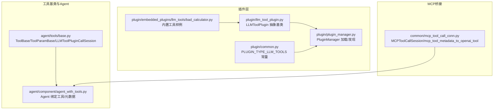
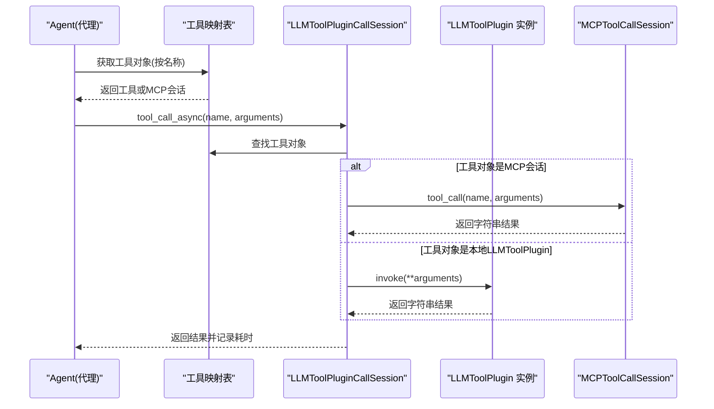
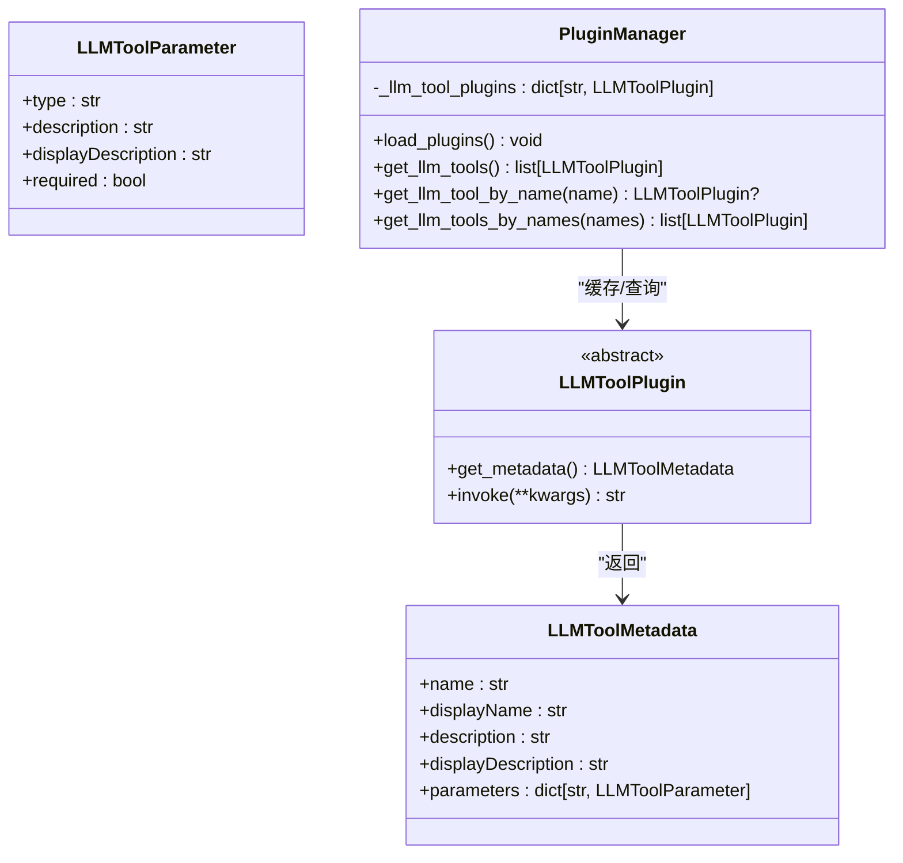
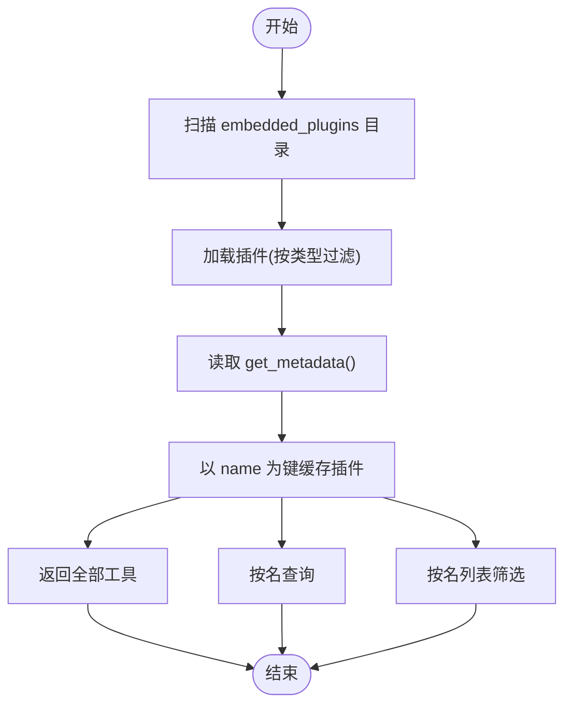
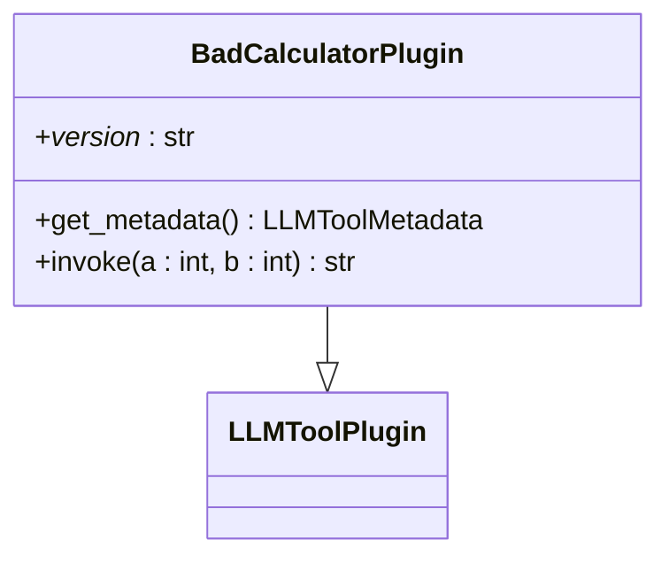
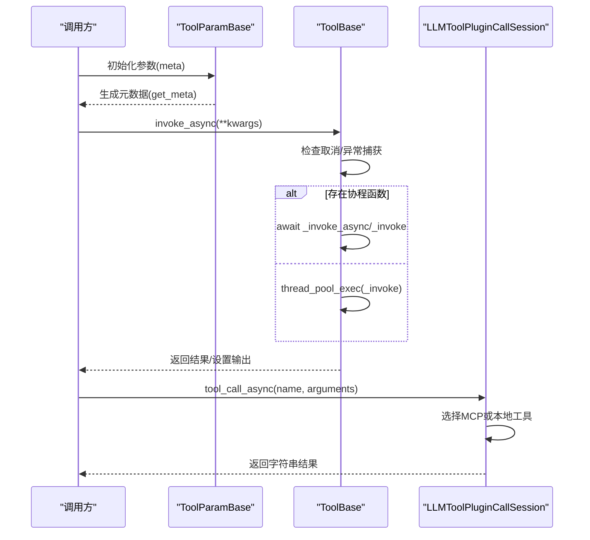
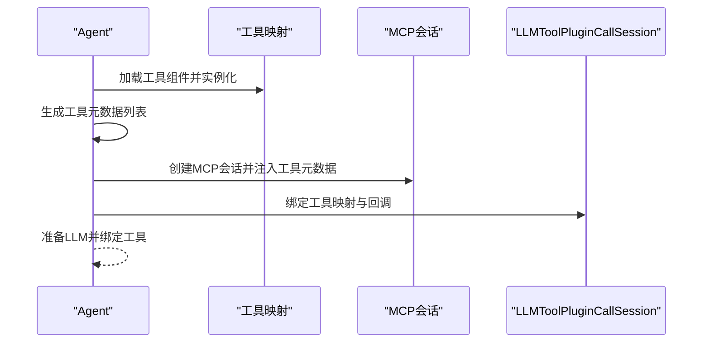
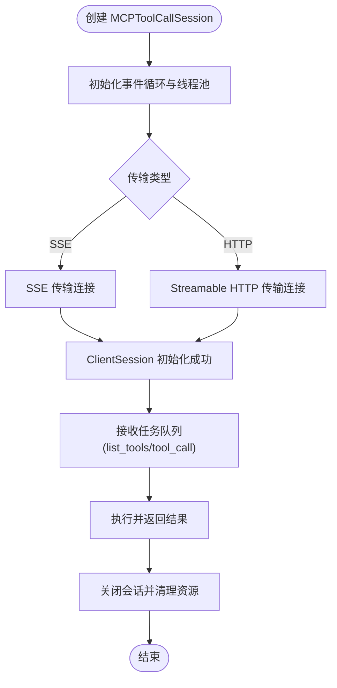
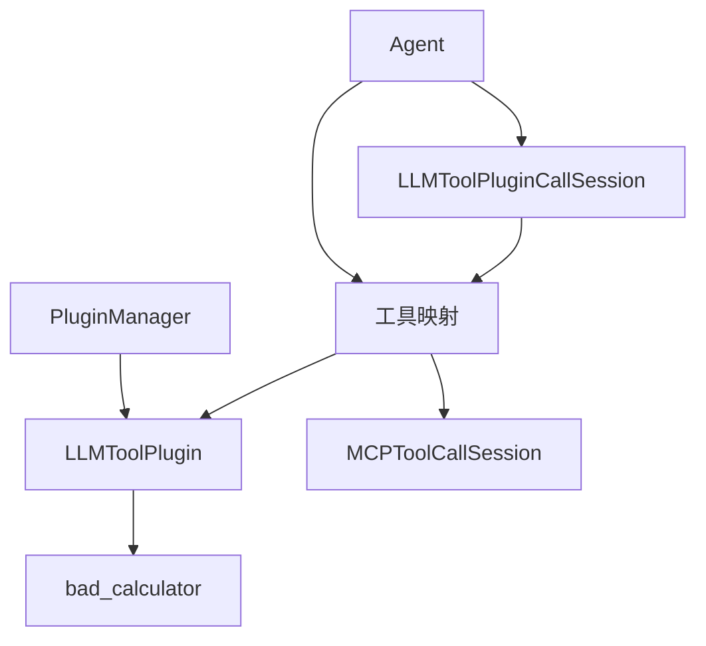

# LLM工具插件

<cite>
**本文引用的文件**
- [plugin/llm_tool_plugin.py](file://plugin/llm_tool_plugin.py)
- [plugin/plugin_manager.py](file://plugin/plugin_manager.py)
- [plugin/embedded_plugins/llm_tools/bad_calculator.py](file://plugin/embedded_plugins/llm_tools/bad_calculator.py)
- [plugin/common.py](file://plugin/common.py)
- [plugin/__init__.py](file://plugin/__init__.py)
- [agent/tools/base.py](file://agent/tools/base.py)
- [agent/tools/code_exec.py](file://agent/tools/code_exec.py)
- [agent/tools/exesql.py](file://agent/tools/exesql.py)
- [agent/tools/retrieval.py](file://agent/tools/retrieval.py)
- [agent/component/agent_with_tools.py](file://agent/component/agent_with_tools.py)
- [common/mcp_tool_call_conn.py](file://common/mcp_tool_call_conn.py)
</cite>

## 目录
1. [简介](#简介)
2. [项目结构](#项目结构)
3. [核心组件](#核心组件)
4. [架构总览](#架构总览)
5. [详细组件分析](#详细组件分析)
6. [依赖关系分析](#依赖关系分析)
7. [性能考虑](#性能考虑)
8. [故障排查指南](#故障排查指南)
9. [结论](#结论)
10. [附录](#附录)

## 简介
本文件面向LLM工具插件的开发者与使用者，系统性阐述基于RAGFlow的LLM工具插件体系：从LLMToolPlugin基类设计、工具接口定义、参数校验、执行流程，到插件开发规范、注册与发现机制、配置管理、测试与调试、性能优化与最佳实践。文中以内置的bad_calculator计算器插件为例，展示标准开发模式，并结合Agent组件与工具基类，说明工具在实际工作流中的调用路径与错误处理策略。

## 项目结构
围绕“LLM工具插件”的关键模块分布如下：
- 插件框架与基类：plugin/llm_tool_plugin.py 定义了工具元数据模型与抽象基类；plugin/plugin_manager.py 提供插件加载与发现能力；plugin/common.py 定义插件类型常量；plugin/__init__.py 暴露全局管理器。
- 内置工具样例：plugin/embedded_plugins/llm_tools/bad_calculator.py 展示最小可用工具实现。
- 工具基类与Agent集成：agent/tools/base.py 提供通用工具参数、元数据生成、同步/异步调用会话；agent/component/agent_with_tools.py 将工具与LLM绑定，支持MCP工具桥接。
- MCP工具桥接：common/mcp_tool_call_conn.py 提供MCP服务器连接、工具枚举与调用封装。
- 其他工具示例（用于对比与参考）：agent/tools/code_exec.py、agent/tools/exesql.py、agent/tools/retrieval.py。

图表来源
- [plugin/llm_tool_plugin.py:1-52](file://plugin/llm_tool_plugin.py#L1-L52)
- [plugin/plugin_manager.py:1-46](file://plugin/plugin_manager.py#L1-L46)
- [plugin/common.py:1-1](file://plugin/common.py#L1-L1)
- [plugin/embedded_plugins/llm_tools/bad_calculator.py:1-38](file://plugin/embedded_plugins/llm_tools/bad_calculator.py#L1-L38)
- [agent/tools/base.py:1-216](file://agent/tools/base.py#L1-L216)
- [agent/component/agent_with_tools.py:1-200](file://agent/component/agent_with_tools.py#L1-L200)
- [common/mcp_tool_call_conn.py:1-326](file://common/mcp_tool_call_conn.py#L1-L326)

章节来源
- [plugin/llm_tool_plugin.py:1-52](file://plugin/llm_tool_plugin.py#L1-L52)
- [plugin/plugin_manager.py:1-46](file://plugin/plugin_manager.py#L1-L46)
- [plugin/common.py:1-1](file://plugin/common.py#L1-L1)
- [plugin/embedded_plugins/llm_tools/bad_calculator.py:1-38](file://plugin/embedded_plugins/llm_tools/bad_calculator.py#L1-L38)
- [agent/tools/base.py:1-216](file://agent/tools/base.py#L1-L216)
- [agent/component/agent_with_tools.py:1-200](file://agent/component/agent_with_tools.py#L1-L200)
- [common/mcp_tool_call_conn.py:1-326](file://common/mcp_tool_call_conn.py#L1-L326)

## 核心组件
- LLMToolPlugin 抽象基类与元数据模型
  - LLMToolParameter/LLMToolMetadata：定义工具参数与元信息的数据结构，包含名称、描述、显示名、是否必填等。
  - LLMToolPlugin：通过装饰器声明父类型为“llm_tools”，强制实现get_metadata；默认invoke抛出未实现异常，便于子类覆盖。
  - llm_tool_metadata_to_openai_tool：将内部元数据转换为OpenAI风格的function工具描述，便于与LLM对接。
- PluginManager 插件管理器
  - 负责扫描embedded_plugins目录下的插件，按类型过滤并缓存工具实例，提供按名查询与批量筛选能力。
- 内置工具样例：bad_calculator
  - 展示最小实现：实现get_metadata返回固定元数据；实现invoke执行加法并加100（演示用途）。
- 工具基类与调用会话
  - ToolParamBase/ToolBase：统一参数初始化、校验、元数据生成、同步/异步调用封装与异常处理。
  - LLMToolPluginCallSession：将工具调用包装为异步回调，支持线程池执行与MCP工具对象。
- MCP桥接
  - MCPToolCallSession：连接MCP服务器，支持SSE与Streamable HTTP两种传输，提供list_tools与call_tool能力。
  - mcp_tool_metadata_to_openai_tool：将MCP Tool元数据映射为OpenAI函数工具描述。

章节来源
- [plugin/llm_tool_plugin.py:7-52](file://plugin/llm_tool_plugin.py#L7-L52)
- [plugin/plugin_manager.py:11-46](file://plugin/plugin_manager.py#L11-L46)
- [plugin/embedded_plugins/llm_tools/bad_calculator.py:5-38](file://plugin/embedded_plugins/llm_tools/bad_calculator.py#L5-L38)
- [agent/tools/base.py:34-216](file://agent/tools/base.py#L34-L216)
- [common/mcp_tool_call_conn.py:42-326](file://common/mcp_tool_call_conn.py#L42-L326)

## 架构总览
下图展示了从Agent发起工具调用到具体工具执行的关键路径，包括本地插件与MCP工具的统一接入。

图表来源
- [agent/component/agent_with_tools.py:106-114](file://agent/component/agent_with_tools.py#L106-L114)
- [agent/tools/base.py:50-75](file://agent/tools/base.py#L50-L75)
- [common/mcp_tool_call_conn.py:205-219](file://common/mcp_tool_call_conn.py#L205-L219)

章节来源
- [agent/component/agent_with_tools.py:81-114](file://agent/component/agent_with_tools.py#L81-L114)
- [agent/tools/base.py:50-75](file://agent/tools/base.py#L50-L75)
- [common/mcp_tool_call_conn.py:42-219](file://common/mcp_tool_call_conn.py#L42-L219)

## 详细组件分析

### LLMToolPlugin 抽象基类与元数据
- 设计要点
  - 使用TypedDict定义参数与元数据结构，保证静态类型安全与文档一致性。
  - 通过装饰器声明父类型，配合插件库自动发现与注册。
  - 默认invoke抛出未实现异常，强制子类覆盖，避免误用。
  - 提供元数据到OpenAI函数工具的转换函数，便于与主流LLM对接。
- 开发规范
  - 元数据字段：name、displayName、description、displayDescription、parameters。
  - 参数字段：type、description、displayDescription、required；可扩展enum等。
  - 子类需实现get_metadata；若需要异步执行，可提供invoke_async并由调用方自动识别协程函数。

图表来源
- [plugin/llm_tool_plugin.py:22-52](file://plugin/llm_tool_plugin.py#L22-L52)
- [plugin/plugin_manager.py:11-46](file://plugin/plugin_manager.py#L11-L46)

章节来源
- [plugin/llm_tool_plugin.py:7-52](file://plugin/llm_tool_plugin.py#L7-L52)
- [plugin/plugin_manager.py:11-46](file://plugin/plugin_manager.py#L11-L46)

### PluginManager 插件加载与发现
- 功能
  - 扫描embedded_plugins目录，使用插件库加载所有插件。
  - 过滤类型为“llm_tools”的插件，读取其元数据并以工具名作为键缓存。
  - 提供查询接口：全部工具列表、按名获取、按名列表筛选。
- 注意事项
  - 日志输出包含插件类型与版本，便于运维追踪。
  - 缓存字典键为工具元数据中的name字段，应确保唯一性。

图表来源
- [plugin/plugin_manager.py:17-46](file://plugin/plugin_manager.py#L17-L46)

章节来源
- [plugin/plugin_manager.py:17-46](file://plugin/plugin_manager.py#L17-L46)

### 内置工具样例：bad_calculator
- 结构
  - 继承LLMToolPlugin，实现get_metadata返回固定元数据（含两个必填数字参数）。
  - 实现invoke执行加法并额外加100，日志记录输入参数。
- 开发要点
  - 元数据中的name必须与缓存键一致，displayName/displayDescription支持国际化占位符。
  - 参数required为True时，调用方需确保传入对应键值，避免运行期错误。
  - 返回值为字符串，便于LLM直接消费或后续处理。

图表来源
- [plugin/embedded_plugins/llm_tools/bad_calculator.py:5-38](file://plugin/embedded_plugins/llm_tools/bad_calculator.py#L5-L38)
- [plugin/llm_tool_plugin.py:22-31](file://plugin/llm_tool_plugin.py#L22-L31)

章节来源
- [plugin/embedded_plugins/llm_tools/bad_calculator.py:5-38](file://plugin/embedded_plugins/llm_tools/bad_calculator.py#L5-L38)

### 工具基类与调用会话：ToolBase/ToolParamBase/LLMToolPluginCallSession
- ToolParamBase
  - 从meta["parameters"]初始化inputs与属性默认值，支持enum、required等字段。
  - get_meta生成OpenAI风格的function描述，包含name、description与parameters。
- ToolBase
  - 同步/异步invoke封装：自动检查取消状态、异常捕获、输出设置、耗时统计。
  - 异步优先：若存在invoke_async或_invoke_async且为协程，则直接await；否则在线程池执行。
- LLMToolPluginCallSession
  - 接收工具映射与回调，tool_call_async根据对象类型选择MCP或本地invoke执行。
  - 记录调用耗时并回调上层记录指标。

图表来源
- [agent/tools/base.py:77-181](file://agent/tools/base.py#L77-L181)
- [agent/tools/base.py:50-75](file://agent/tools/base.py#L50-L75)

章节来源
- [agent/tools/base.py:34-216](file://agent/tools/base.py#L34-L216)

### Agent与工具集成
- Agent在构造阶段
  - 为每个工具组件创建实例，生成工具元数据列表，并将工具映射到命名空间（含索引后缀）。
  - 对于MCP工具，创建MCPToolCallSession并将工具元数据转换为OpenAI函数描述加入tool_meta。
  - 创建LLMToolPluginCallSession并绑定至聊天模型，准备工具调用。
- 调用流程
  - Agent根据工具元数据向LLM请求函数调用，LLMToolPluginCallSession负责解析并分发到具体工具或MCP会话。

图表来源
- [agent/component/agent_with_tools.py:84-114](file://agent/component/agent_with_tools.py#L84-L114)

章节来源
- [agent/component/agent_with_tools.py:81-114](file://agent/component/agent_with_tools.py#L81-L114)

### MCP工具桥接
- MCPToolCallSession
  - 支持SSE与Streamable HTTP两种传输，建立ClientSession并维护任务队列。
  - 提供list_tools与call_tool能力，将结果转为文本字符串返回。
  - 提供超时控制与异常封装，关闭时清理事件循环与线程池。
- mcp_tool_metadata_to_openai_tool
  - 将MCP Tool对象或字典映射为OpenAI函数工具描述，便于Agent统一绑定。

图表来源
- [common/mcp_tool_call_conn.py:42-219](file://common/mcp_tool_call_conn.py#L42-L219)

章节来源
- [common/mcp_tool_call_conn.py:42-326](file://common/mcp_tool_call_conn.py#L42-L326)

## 依赖关系分析
- 组件耦合
  - LLMToolPlugin与PluginManager：通过插件库自动发现与缓存，低耦合高内聚。
  - Agent与工具：通过工具映射与元数据解耦，支持本地与MCP工具统一调用。
  - MCP桥接：对上屏蔽底层传输差异，对下统一封装调用协议。
- 外部依赖
  - 插件库：用于插件发现与加载。
  - MCP客户端：用于与外部MCP服务器通信。
  - 线程池：用于阻塞式工具执行，避免阻塞事件循环。

图表来源
- [plugin/plugin_manager.py:17-46](file://plugin/plugin_manager.py#L17-L46)
- [agent/component/agent_with_tools.py:84-114](file://agent/component/agent_with_tools.py#L84-L114)
- [agent/tools/base.py:50-75](file://agent/tools/base.py#L50-L75)
- [common/mcp_tool_call_conn.py:42-219](file://common/mcp_tool_call_conn.py#L42-L219)

章节来源
- [plugin/plugin_manager.py:17-46](file://plugin/plugin_manager.py#L17-L46)
- [agent/component/agent_with_tools.py:84-114](file://agent/component/agent_with_tools.py#L84-L114)
- [agent/tools/base.py:50-75](file://agent/tools/base.py#L50-L75)
- [common/mcp_tool_call_conn.py:42-219](file://common/mcp_tool_call_conn.py#L42-L219)

## 性能考虑
- 线程池与异步
  - ToolBase在非协程场景使用线程池执行，避免阻塞事件循环；合理设置线程池大小与超时时间。
  - LLMToolPluginCallSession优先检测协程函数，减少不必要的线程切换。
- 超时与取消
  - 工具组件普遍使用超时装饰器，防止长时间阻塞；调用方应检查取消状态并及时中断。
- MCP调用
  - MCPToolCallSession提供请求级超时与任务队列，避免积压；关闭时清理事件循环与线程池，防止资源泄漏。
- 输出与格式化
  - 工具返回字符串，便于LLM直接消费；复杂结构建议序列化为JSON字符串，避免类型不兼容。
- 缓存策略
  - 可在工具内部对昂贵操作进行缓存（如网络请求、数据库查询），注意键的构建与失效策略。

## 故障排查指南
- 插件未被发现
  - 检查插件文件是否位于embedded_plugins目录，且继承LLMToolPlugin并实现get_metadata。
  - 确认插件类型常量与父类装饰器一致。
- 工具调用失败
  - 检查参数required字段是否缺失；确认参数类型与范围（enum、数值范围）。
  - 若为MCP工具，检查MCP服务器连接、认证头与传输类型配置。
- 异常与日志
  - ToolBase在异常时会设置_ERROR输出并记录日志；关注输出中的错误信息定位问题。
  - MCPToolCallSession在超时或连接失败时返回明确错误提示。
- 调试技巧
  - 使用Agent的调试面板查看参数与输出；必要时在工具中增加日志记录关键路径。
  - 对于MCP工具，可在前端界面触发“刷新工具”按钮获取最新工具清单。

章节来源
- [agent/tools/base.py:139-180](file://agent/tools/base.py#L139-L180)
- [common/mcp_tool_call_conn.py:153-219](file://common/mcp_tool_call_conn.py#L153-L219)

## 结论
RAGFlow的LLM工具插件体系以LLMToolPlugin抽象基类为核心，结合PluginManager实现自动发现与缓存，配合Agent与工具基类完成统一的调用与生命周期管理。内置bad_calculator展示了最小实现范式，MCP桥接则扩展了外部工具生态。通过规范的元数据定义、参数校验、异常处理与性能优化策略，开发者可以快速构建稳定高效的工具插件。

## 附录
- 开发规范摘要
  - 插件类结构：继承LLMToolPlugin，实现get_metadata与invoke（或invoke_async）。
  - 元数据配置：name唯一、description清晰、参数required明确、支持enum与默认值。
  - 异常处理：遵循ToolBase的异常捕获与输出约定，避免静默失败。
  - 注册与发现：确保插件位于embedded_plugins目录，类型常量与父类装饰器一致。
- 配置管理要点
  - 参数传递：严格匹配参数类型与必填项；对复杂参数建议序列化为字符串。
  - 结果格式化：统一返回字符串；如需结构化数据，推荐JSON字符串。
  - 缓存策略：对昂贵操作进行缓存，注意键构建与失效策略。
- 测试与调试
  - 单元测试：针对invoke逻辑与边界条件编写测试；对MCP工具模拟服务器响应。
  - 集成测试：在Agent中组合多个工具，验证调用链路与错误传播。
  - 调试：利用日志与输出窗口定位问题；对MCP工具使用前端“刷新工具”功能。