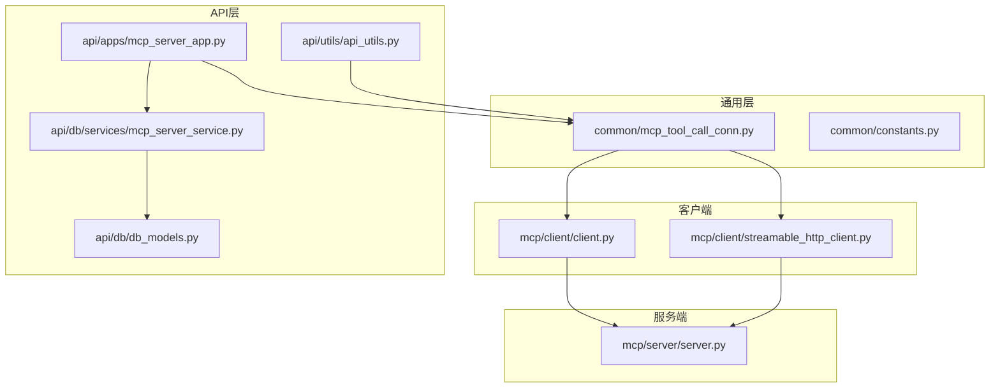
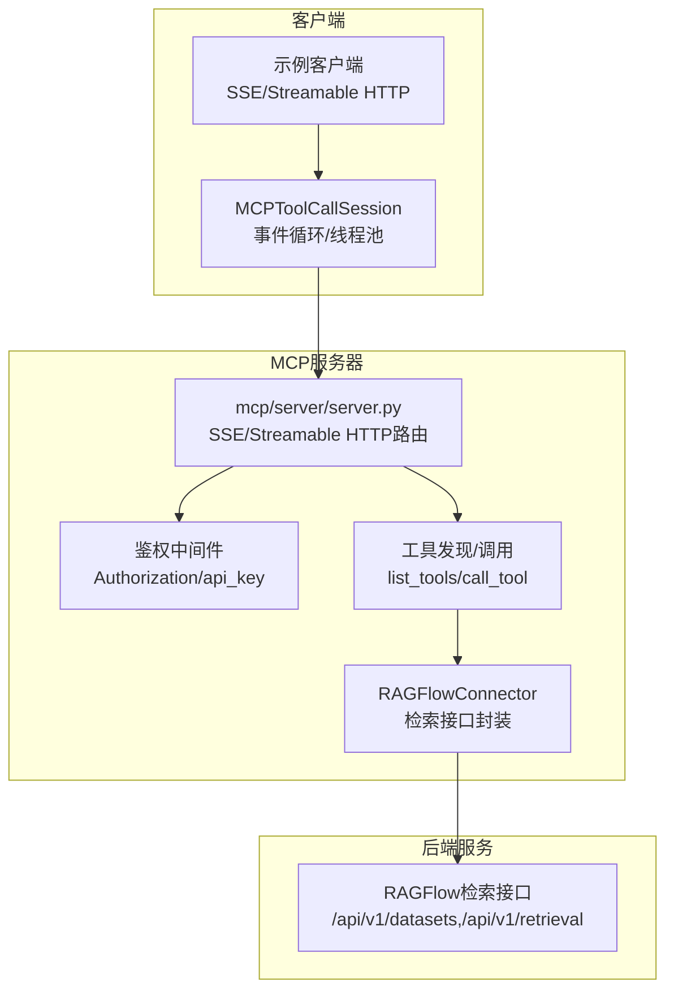
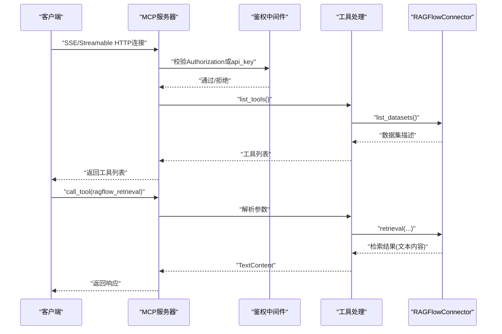
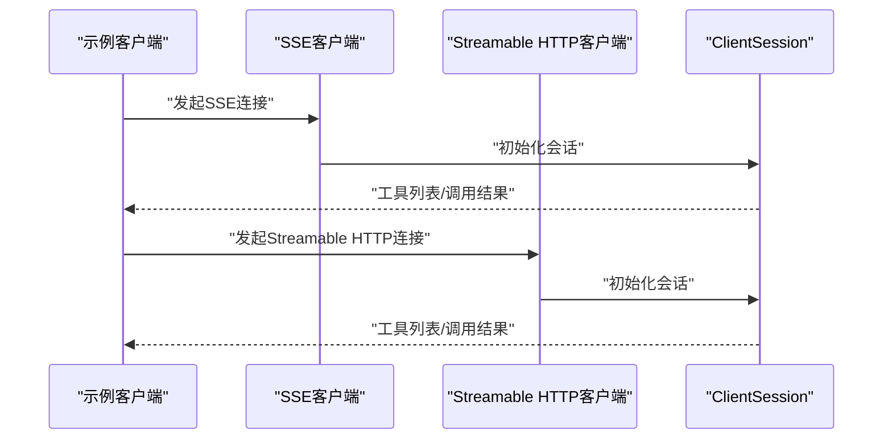
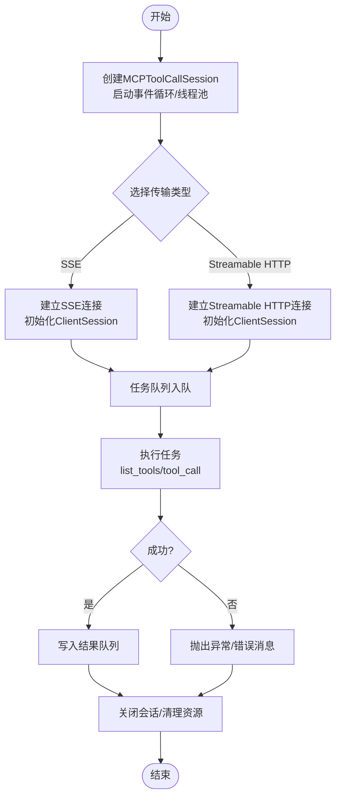
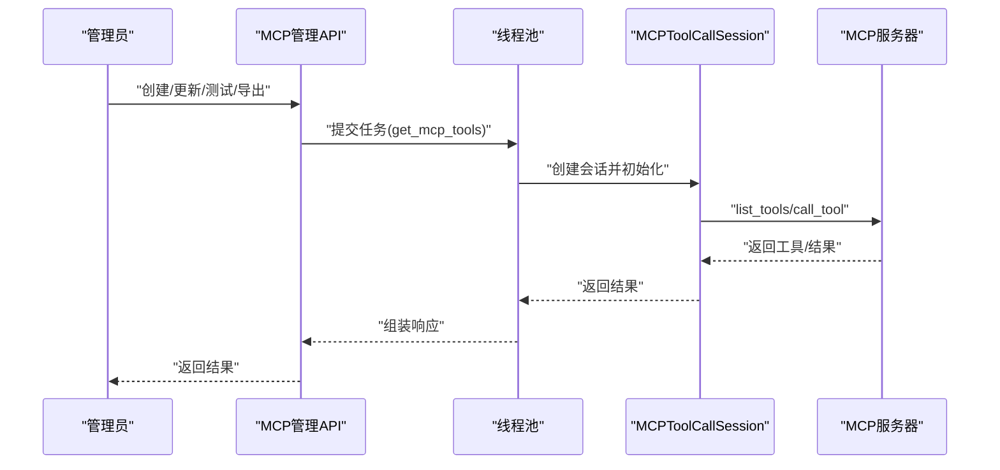
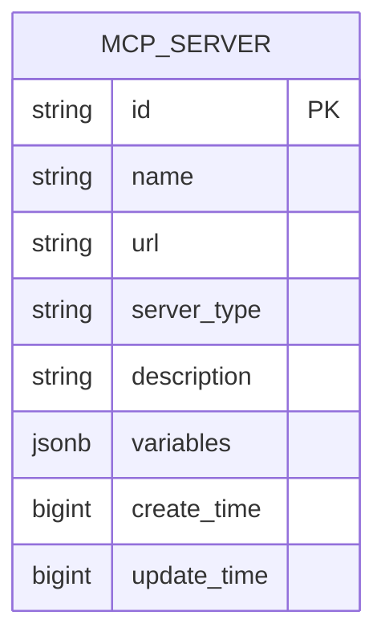
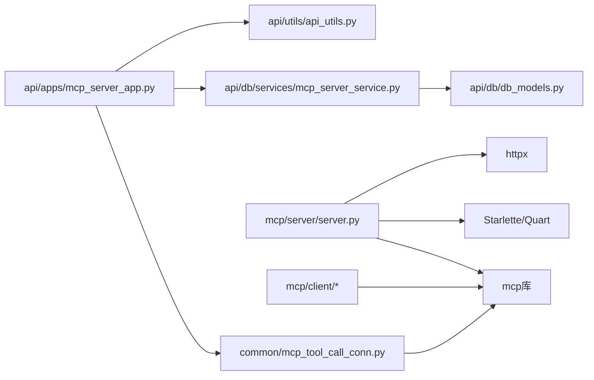

# MCP协议支持

<cite>
**本文引用的文件**
- [mcp/client/client.py](file://mcp/client/client.py)
- [mcp/client/streamable_http_client.py](file://mcp/client/streamable_http_client.py)
- [mcp/server/server.py](file://mcp/server/server.py)
- [common/mcp_tool_call_conn.py](file://common/mcp_tool_call_conn.py)
- [api/apps/mcp_server_app.py](file://api/apps/mcp_server_app.py)
- [api/db/services/mcp_server_service.py](file://api/db/services/mcp_server_service.py)
- [api/db/db_models.py](file://api/db/db_models.py)
- [common/constants.py](file://common/constants.py)
- [api/utils/api_utils.py](file://api/utils/api_utils.py)
</cite>

## 目录
1. [简介](#简介)
2. [项目结构](#项目结构)
3. [核心组件](#核心组件)
4. [架构总览](#架构总览)
5. [详细组件分析](#详细组件分析)
6. [依赖分析](#依赖分析)
7. [性能考虑](#性能考虑)
8. [故障排查指南](#故障排查指南)
9. [结论](#结论)
10. [附录](#附录)

## 简介
本文件面向RAGFlow中MCP（Model Context Protocol）协议的支持实现，系统性阐述协议基础、服务器与客户端实现、消息类型与处理流程、安全机制、调试与监控、性能优化与最佳实践。文档以仓库现有代码为依据，结合架构图与流程图帮助读者快速理解并高效使用MCP能力。

## 项目结构
围绕MCP协议支持的相关模块分布如下：
- mcp/server：MCP服务器实现，提供SSE与Streamable HTTP两种传输模式，封装工具发现与调用逻辑。
- mcp/client：示例客户端，演示如何通过SSE或Streamable HTTP与MCP服务器交互。
- common：通用工具与会话封装，负责跨线程事件循环、任务队列、超时控制、连接关闭与清理。
- api/apps：后端管理接口，提供MCP服务器的增删改查、工具列表拉取、工具测试、导入导出等功能。
- api/db：数据库模型与服务，持久化MCP服务器配置及变量缓存。
- common/constants：常量定义，包括MCP服务器类型枚举等。

**图表来源**
- [mcp/client/client.py:1-48](file://mcp/client/client.py#L1-L48)
- [mcp/client/streamable_http_client.py:1-37](file://mcp/client/streamable_http_client.py#L1-L37)
- [mcp/server/server.py:1-715](file://mcp/server/server.py#L1-L715)
- [common/mcp_tool_call_conn.py:1-326](file://common/mcp_tool_call_conn.py#L1-L326)
- [api/apps/mcp_server_app.py:1-440](file://api/apps/mcp_server_app.py#L1-L440)
- [api/db/services/mcp_server_service.py:1-93](file://api/db/services/mcp_server_service.py#L1-L93)
- [api/db/db_models.py:975-1020](file://api/db/db_models.py#L975-L1020)
- [api/utils/api_utils.py:1-200](file://api/utils/api_utils.py#L1-L200)

**章节来源**
- [mcp/client/client.py:1-48](file://mcp/client/client.py#L1-L48)
- [mcp/client/streamable_http_client.py:1-37](file://mcp/client/streamable_http_client.py#L1-L37)
- [mcp/server/server.py:1-715](file://mcp/server/server.py#L1-L715)
- [common/mcp_tool_call_conn.py:1-326](file://common/mcp_tool_call_conn.py#L1-L326)
- [api/apps/mcp_server_app.py:1-440](file://api/apps/mcp_server_app.py#L1-L440)
- [api/db/services/mcp_server_service.py:1-93](file://api/db/services/mcp_server_service.py#L1-L93)
- [api/db/db_models.py:975-1020](file://api/db/db_models.py#L975-L1020)
- [common/constants.py:150-160](file://common/constants.py#L150-L160)
- [api/utils/api_utils.py:1-200](file://api/utils/api_utils.py#L1-L200)

## 核心组件
- MCP服务器（mcp/server/server.py）
  - 支持SSE与Streamable HTTP两种传输模式，通过命令行参数与环境变量控制启用状态与行为。
  - 提供工具发现与工具调用接口，内置鉴权中间件与API密钥绑定逻辑。
  - 封装RAGFlowConnector用于访问后端检索接口，实现数据集与文档元数据缓存。
- MCP客户端（mcp/client/*）
  - 示例SSE客户端与Streamable HTTP客户端，展示如何初始化会话、列举工具、调用工具。
- 通用会话封装（common/mcp_tool_call_conn.py）
  - 统一的MCPToolCallSession，负责在独立事件循环与线程池中建立与维护MCP连接，支持SSE与Streamable HTTP两种传输。
  - 提供任务队列、超时控制、错误处理与资源清理。
- API应用（api/apps/mcp_server_app.py）
  - 提供MCP服务器的CRUD、工具列表、工具测试、导入导出等管理接口。
  - 集成线程池执行工具发现与测试，返回标准化结果。
- 数据模型与服务（api/db/*）
  - MCPServer模型与服务类，提供查询、分页、去重校验、删除等数据库操作。
- 常量定义（common/constants.py）
  - 定义MCP服务器类型枚举（SSE、Streamable HTTP），以及返回码、状态枚举等。

**章节来源**
- [mcp/server/server.py:38-715](file://mcp/server/server.py#L38-L715)
- [mcp/client/client.py:1-48](file://mcp/client/client.py#L1-L48)
- [mcp/client/streamable_http_client.py:1-37](file://mcp/client/streamable_http_client.py#L1-L37)
- [common/mcp_tool_call_conn.py:1-326](file://common/mcp_tool_call_conn.py#L1-L326)
- [api/apps/mcp_server_app.py:1-440](file://api/apps/mcp_server_app.py#L1-L440)
- [api/db/db_models.py:975-1020](file://api/db/db_models.py#L975-L1020)
- [api/db/services/mcp_server_service.py:1-93](file://api/db/services/mcp_server_service.py#L1-L93)
- [common/constants.py:150-160](file://common/constants.py#L150-L160)

## 架构总览
下图展示了从客户端到服务器再到后端检索服务的整体链路，以及API层对MCP服务器的管理与缓存。

**图表来源**
- [mcp/server/server.py:495-580](file://mcp/server/server.py#L495-L580)
- [mcp/server/server.py:500-527](file://mcp/server/server.py#L500-L527)
- [mcp/server/server.py:376-493](file://mcp/server/server.py#L376-L493)
- [mcp/server/server.py:58-130](file://mcp/server/server.py#L58-L130)
- [mcp/client/client.py:22-42](file://mcp/client/client.py#L22-L42)
- [mcp/client/streamable_http_client.py:20-31](file://mcp/client/streamable_http_client.py#L20-L31)
- [common/mcp_tool_call_conn.py:59-114](file://common/mcp_tool_call_conn.py#L59-L114)

## 详细组件分析

### MCP服务器实现（mcp/server/server.py）
- 启动与传输模式
  - 支持SSE与Streamable HTTP两种传输，可通过命令行开关与环境变量控制启用状态。
  - 在host模式下，通过中间件校验Authorization头或api_key；在self-host模式下绑定固定API Key。
- 工具发现与调用
  - list_tools：动态生成工具描述，内含输入Schema与默认值，支持分页、阈值、权重等参数。
  - call_tool：根据工具名路由至具体实现，当前仅支持“ragflow_retrieval”工具。
- 检索接口封装（RAGFlowConnector）
  - 提供数据集列表、检索调用、文档元数据缓存与字段映射。
  - 缓存策略：基于LRU与TTL，避免频繁查询后端接口。
- 会话生命周期
  - 使用Server lifespan管理上下文，确保连接释放与日志输出。

**图表来源**
- [mcp/server/server.py:340-374](file://mcp/server/server.py#L340-L374)
- [mcp/server/server.py:376-444](file://mcp/server/server.py#L376-L444)
- [mcp/server/server.py:447-492](file://mcp/server/server.py#L447-L492)
- [mcp/server/server.py:58-130](file://mcp/server/server.py#L58-L130)

**章节来源**
- [mcp/server/server.py:38-715](file://mcp/server/server.py#L38-L715)

### MCP客户端集成（mcp/client/*）
- SSE客户端
  - 展示如何通过ssec_client建立SSE连接，随后初始化ClientSession并进行工具列举与调用。
- Streamable HTTP客户端
  - 展示如何通过streamablehttp_client建立双向流，初始化ClientSession并执行相同操作。
- 典型流程
  - 建立连接 → 初始化会话 → 列举工具 → 调用工具 → 处理响应。

**图表来源**
- [mcp/client/client.py:22-42](file://mcp/client/client.py#L22-L42)
- [mcp/client/streamable_http_client.py:20-31](file://mcp/client/streamable_http_client.py#L20-L31)

**章节来源**
- [mcp/client/client.py:1-48](file://mcp/client/client.py#L1-L48)
- [mcp/client/streamable_http_client.py:1-37](file://mcp/client/streamable_http_client.py#L1-L37)

### 通用会话封装（common/mcp_tool_call_conn.py）
- 设计要点
  - 单实例弱引用集合，便于全局清理。
  - 独立事件循环与线程池，隔离阻塞与异步任务。
  - 统一的任务队列，支持list_tools与tool_call两类任务。
  - 超时控制与异常捕获，保证会话稳定。
  - 支持SSE与Streamable HTTP两种传输类型，自动替换模板变量。
- 关键流程
  - 连接建立 → 会话初始化 → 任务入队 → 结果出队 → 错误处理 → 资源清理。

**图表来源**
- [common/mcp_tool_call_conn.py:42-152](file://common/mcp_tool_call_conn.py#L42-L152)
- [common/mcp_tool_call_conn.py:153-218](file://common/mcp_tool_call_conn.py#L153-L218)

**章节来源**
- [common/mcp_tool_call_conn.py:1-326](file://common/mcp_tool_call_conn.py#L1-L326)

### API管理接口（api/apps/mcp_server_app.py）
- 功能概览
  - 列表/详情：按租户维度查询MCP服务器，支持关键词与分页。
  - 创建/更新：校验名称唯一性、URL有效性、类型合法性；通过线程池执行工具发现，缓存工具元数据。
  - 删除/导入/导出：批量删除与导入导出，导入时自动去重与重命名。
  - 测试工具：对指定工具进行测试调用，返回结果。
  - 缓存工具：将工具元数据写入服务器变量，便于前端启用/禁用。
- 关键流程
  - 接收请求 → 参数校验 → 服务端会话初始化 → 工具发现/测试 → 结果返回 → 清理会话。

**图表来源**
- [api/apps/mcp_server_app.py:70-123](file://api/apps/mcp_server_app.py#L70-L123)
- [api/apps/mcp_server_app.py:298-342](file://api/apps/mcp_server_app.py#L298-L342)
- [api/apps/mcp_server_app.py:344-375](file://api/apps/mcp_server_app.py#L344-L375)
- [api/apps/mcp_server_app.py:401-440](file://api/apps/mcp_server_app.py#L401-L440)

**章节来源**
- [api/apps/mcp_server_app.py:1-440](file://api/apps/mcp_server_app.py#L1-L440)

### 数据模型与服务（api/db/*）
- MCPServer模型
  - 存储服务器标识、名称、URL、类型、描述、变量（含工具缓存）、时间戳等。
- 服务类
  - 提供按租户查询、分页、关键词过滤、去重校验、删除等操作。
- 与API协作
  - API层在创建/更新时调用服务类完成持久化，并在导入导出时读取/写入变量。

**图表来源**
- [api/db/db_models.py:975-1020](file://api/db/db_models.py#L975-L1020)

**章节来源**
- [api/db/db_models.py:975-1020](file://api/db/db_models.py#L975-L1020)
- [api/db/services/mcp_server_service.py:1-93](file://api/db/services/mcp_server_service.py#L1-L93)

### 常量与工具（common/constants.py, api/utils/api_utils.py）
- 常量
  - MCPServerType：SSE与Streamable HTTP类型枚举。
- 工具
  - API工具函数提供请求体解析、参数校验、错误响应、线程池执行等通用能力，被API层广泛使用。

**章节来源**
- [common/constants.py:150-160](file://common/constants.py#L150-L160)
- [api/utils/api_utils.py:150-198](file://api/utils/api_utils.py#L150-L198)

## 依赖分析
- 组件耦合
  - API层依赖通用会话封装与服务类，形成清晰的职责边界。
  - 服务器层依赖mcp库的Server与传输组件，同时封装RAGFlow检索接口。
  - 客户端示例依赖mcp库的SSE与Streamable HTTP客户端。
- 外部依赖
  - mcp库：提供Server、ClientSession、SSE与Streamable HTTP传输抽象。
  - Quart/Starlette：提供ASGI应用与路由、中间件。
  - httpx：异步HTTP客户端，用于后端检索接口调用。
  - Peewee：ORM，用于数据库操作。

**图表来源**
- [api/apps/mcp_server_app.py:1-440](file://api/apps/mcp_server_app.py#L1-L440)
- [common/mcp_tool_call_conn.py:1-326](file://common/mcp_tool_call_conn.py#L1-L326)
- [api/db/services/mcp_server_service.py:1-93](file://api/db/services/mcp_server_service.py#L1-L93)
- [api/db/db_models.py:975-1020](file://api/db/db_models.py#L975-L1020)
- [mcp/server/server.py:1-715](file://mcp/server/server.py#L1-L715)
- [mcp/client/client.py:1-48](file://mcp/client/client.py#L1-L48)
- [mcp/client/streamable_http_client.py:1-37](file://mcp/client/streamable_http_client.py#L1-L37)
- [api/utils/api_utils.py:1-200](file://api/utils/api_utils.py#L1-L200)

**章节来源**
- [mcp/server/server.py:1-715](file://mcp/server/server.py#L1-L715)
- [mcp/client/client.py:1-48](file://mcp/client/client.py#L1-L48)
- [mcp/client/streamable_http_client.py:1-37](file://mcp/client/streamable_http_client.py#L1-L37)
- [common/mcp_tool_call_conn.py:1-326](file://common/mcp_tool_call_conn.py#L1-L326)
- [api/apps/mcp_server_app.py:1-440](file://api/apps/mcp_server_app.py#L1-L440)
- [api/db/services/mcp_server_service.py:1-93](file://api/db/services/mcp_server_service.py#L1-L93)
- [api/db/db_models.py:975-1020](file://api/db/db_models.py#L975-L1020)
- [api/utils/api_utils.py:1-200](file://api/utils/api_utils.py#L1-L200)

## 性能考虑
- 传输模式选择
  - SSE适合简单场景与浏览器兼容；Streamable HTTP具备更好的吞吐与低延迟特性，建议优先使用。
- 连接与会话
  - 使用线程池与独立事件循环隔离阻塞，避免阻塞主线程；合理设置超时，防止资源泄漏。
- 缓存策略
  - 服务器侧对数据集与文档元数据采用LRU+TTL缓存，降低后端检索压力；客户端侧可复用会话减少重复握手。
- 并发与批处理
  - API层使用线程池并发执行工具发现与测试，缩短等待时间；注意线程池大小与任务超时配置。
- 资源清理
  - 明确的会话关闭与实例清理逻辑，避免内存泄漏与句柄泄露。

[本节为通用指导，无需特定文件引用]

## 故障排查指南
- 认证失败
  - 检查Authorization头或api_key是否正确传递；host模式下必须提供Bearer Token或api_key。
- 连接超时
  - 调整超时参数，检查网络连通性与服务器负载；确认SSE/Streamable HTTP端点可达。
- 工具不可用
  - 使用“测试工具”接口验证MCP服务器可用性；检查工具Schema与参数类型。
- 会话异常
  - 查看会话关闭流程与异常捕获逻辑；确保在finally块中清理资源。
- 日志与监控
  - 服务器端与客户端均输出关键日志；建议结合系统日志与指标监控定位问题。

**章节来源**
- [mcp/server/server.py:500-527](file://mcp/server/server.py#L500-L527)
- [common/mcp_tool_call_conn.py:76-114](file://common/mcp_tool_call_conn.py#L76-L114)
- [api/apps/mcp_server_app.py:344-375](file://api/apps/mcp_server_app.py#L344-L375)

## 结论
RAGFlow对MCP协议的支持覆盖了从服务器实现、客户端示例、通用会话封装到API管理与数据库持久化的完整链路。通过SSE与Streamable HTTP双传输模式、完善的鉴权与缓存策略、以及统一的会话管理与错误处理，系统在易用性与性能之间取得了良好平衡。建议在生产环境中优先采用Streamable HTTP，并结合缓存与超时策略进一步优化体验。

[本节为总结，无需特定文件引用]

## 附录

### MCP协议消息类型与处理流程
- 工具发现（list_tools）
  - 服务器返回工具清单，包含名称、描述与输入Schema。
- 工具调用（call_tool）
  - 客户端传入工具名与参数，服务器解析并执行对应逻辑，返回文本内容。
- 流式响应
  - 当前实现返回单条TextContent；如需流式，可在服务器端扩展为多段事件。

**章节来源**
- [mcp/server/server.py:376-444](file://mcp/server/server.py#L376-L444)
- [mcp/server/server.py:447-492](file://mcp/server/server.py#L447-L492)

### 安全机制与认证方式
- 自托管模式（self-host）
  - 通过命令行参数或环境变量绑定固定API Key，适用于单租户场景。
- 托管模式（host）
  - 中间件校验Authorization头（Bearer Token）或api_key，适用于多租户场景。
- 建议
  - 生产环境优先使用Bearer Token并通过HTTPS传输；定期轮换密钥。

**章节来源**
- [mcp/server/server.py:340-374](file://mcp/server/server.py#L340-L374)
- [mcp/server/server.py:500-527](file://mcp/server/server.py#L500-L527)

### 插件开发指南（基于现有实现的扩展思路）
- 插件接口
  - 参考RAGFlowConnector的retrieval方法，封装新的检索逻辑或外部服务调用。
- 元数据配置
  - 在list_tools中定义工具名称、描述与输入Schema；在call_tool中实现路由与参数解析。
- 错误处理
  - 统一抛出types.TextContent异常，确保客户端可读性。

**章节来源**
- [mcp/server/server.py:58-130](file://mcp/server/server.py#L58-L130)
- [mcp/server/server.py:376-444](file://mcp/server/server.py#L376-L444)
- [mcp/server/server.py:447-492](file://mcp/server/server.py#L447-L492)

### 调试工具与监控方法
- 服务器端
  - 启用日志输出，关注会话初始化、工具发现与调用过程。
- 客户端
  - 使用示例客户端快速验证SSE与Streamable HTTP；记录超时与错误信息。
- API层
  - 使用“测试工具”接口与“导入/导出”功能验证配置与工具缓存。

**章节来源**
- [mcp/server/server.py:659-681](file://mcp/server/server.py#L659-L681)
- [mcp/client/client.py:22-42](file://mcp/client/client.py#L22-L42)
- [mcp/client/streamable_http_client.py:20-31](file://mcp/client/streamable_http_client.py#L20-L31)
- [api/apps/mcp_server_app.py:298-342](file://api/apps/mcp_server_app.py#L298-L342)

### 性能优化策略与最佳实践
- 传输选择：优先使用Streamable HTTP；在受限环境下使用SSE。
- 缓存：利用服务器与客户端缓存减少重复请求；合理设置TTL。
- 超时：为会话初始化与工具调用设置合理超时，避免长时间阻塞。
- 并发：通过线程池并发执行工具发现与测试，缩短等待时间。
- 资源：确保会话关闭与实例清理，避免资源泄漏。

**章节来源**
- [common/mcp_tool_call_conn.py:153-218](file://common/mcp_tool_call_conn.py#L153-L218)
- [mcp/server/server.py:58-130](file://mcp/server/server.py#L58-L130)