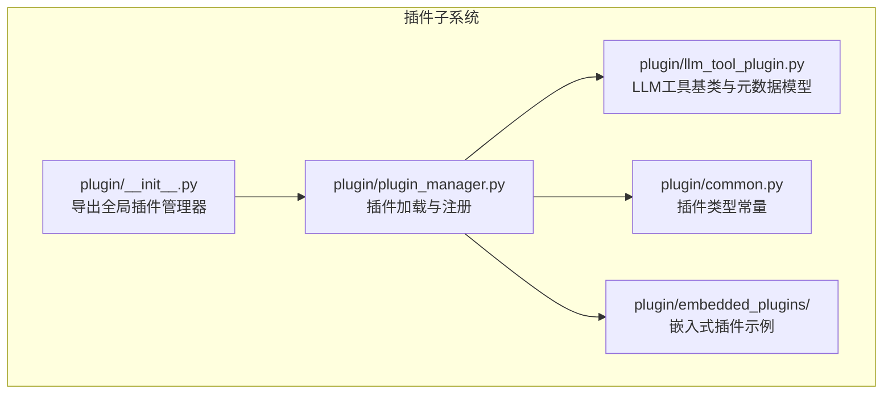
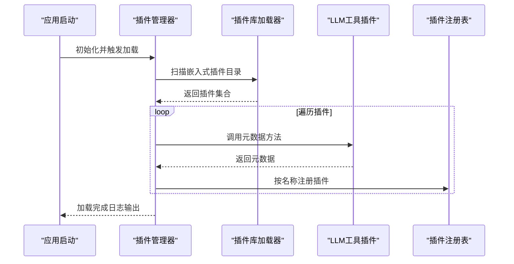
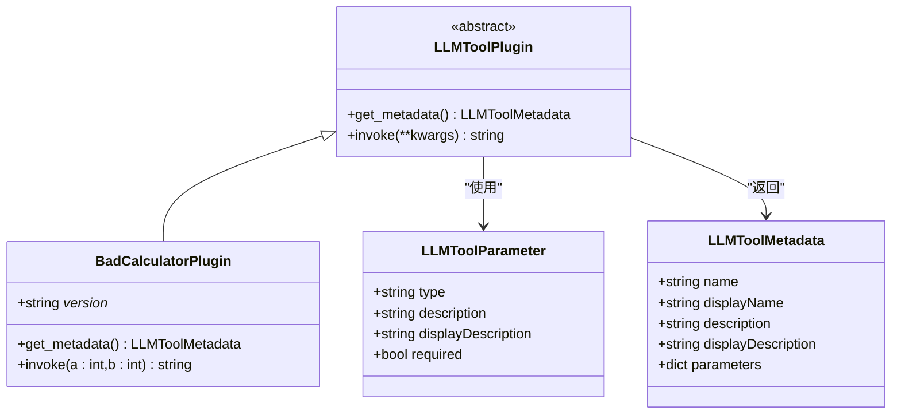
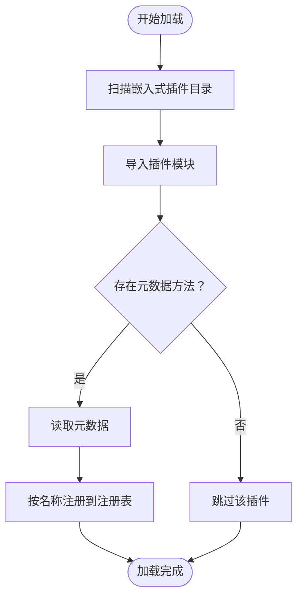
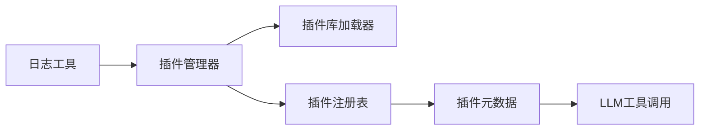

# 插件开发指南

<cite>
**本文引用的文件**
- [plugin/README.md](file://plugin/README.md)
- [plugin/README_zh.md](file://plugin/README_zh.md)
- [plugin/__init__.py](file://plugin/__init__.py)
- [plugin/common.py](file://plugin/common.py)
- [plugin/plugin_manager.py](file://plugin/plugin_manager.py)
- [plugin/llm_tool_plugin.py](file://plugin/llm_tool_plugin.py)
- [plugin/embedded_plugins/llm_tools/bad_calculator.py](file://plugin/embedded_plugins/llm_tools/bad_calculator.py)
- [pyproject.toml](file://pyproject.toml)
- [run_tests.py](file://run_tests.py)
- [Dockerfile](file://Dockerfile)
- [conf/service_conf.yaml](file://conf/service_conf.yaml)
- [common/log_utils.py](file://common/log_utils.py)
</cite>

## 目录
1. [简介](#简介)
2. [项目结构](#项目结构)
3. [核心组件](#核心组件)
4. [架构总览](#架构总览)
5. [详细组件分析](#详细组件分析)
6. [依赖分析](#依赖分析)
7. [性能考虑](#性能考虑)
8. [故障排除指南](#故障排除指南)
9. [结论](#结论)
10. [附录](#附录)

## 简介
本指南面向希望为 RAGFlow 开发插件（尤其是 LLM 工具插件）的开发者，覆盖从需求分析、设计规划、编码实现、测试验证、调试定位，到打包发布与维护升级的全流程。RAGFlow 的插件系统基于内置的插件库加载机制，当前支持的插件类型为 LLM 工具（llm_tools）。通过遵循本文档的结构化流程与最佳实践，您可以高效地完成插件开发并在生产环境中稳定运行。

## 项目结构
RAGFlow 插件体系位于独立的 plugin 目录中，核心由以下部分组成：
- 插件类型常量与元数据模型定义
- 插件基类与元数据转换工具
- 插件管理器：负责扫描、加载与注册插件
- 嵌入式插件示例：演示如何编写一个可用的 LLM 工具插件
- 全局插件管理器实例导出，便于其他模块统一访问

图表来源
- [plugin/__init__.py:1-4](file://plugin/__init__.py#L1-L4)
- [plugin/common.py:1-1](file://plugin/common.py#L1-L1)
- [plugin/llm_tool_plugin.py:1-52](file://plugin/llm_tool_plugin.py#L1-L52)
- [plugin/plugin_manager.py:1-46](file://plugin/plugin_manager.py#L1-L46)
- [plugin/embedded_plugins/llm_tools/bad_calculator.py:1-38](file://plugin/embedded_plugins/llm_tools/bad_calculator.py#L1-L38)

章节来源
- [plugin/README.md:1-98](file://plugin/README.md#L1-L98)
- [plugin/README_zh.md:1-99](file://plugin/README_zh.md#L1-L99)
- [plugin/__init__.py:1-4](file://plugin/__init__.py#L1-L4)
- [plugin/common.py:1-1](file://plugin/common.py#L1-L1)
- [plugin/llm_tool_plugin.py:1-52](file://plugin/llm_tool_plugin.py#L1-L52)
- [plugin/plugin_manager.py:1-46](file://plugin/plugin_manager.py#L1-L46)
- [plugin/embedded_plugins/llm_tools/bad_calculator.py:1-38](file://plugin/embedded_plugins/llm_tools/bad_calculator.py#L1-L38)

## 核心组件
- 插件类型常量：定义当前支持的插件类型字符串，确保加载器与注册逻辑一致。
- LLM 工具插件基类：约定插件必须实现的接口（元数据描述与调用入口），并提供元数据到 OpenAI 工具格式的转换函数。
- 插件管理器：扫描嵌入式插件目录，使用插件库加载器动态导入插件，读取元数据并按名称注册，提供查询接口。
- 嵌入式示例插件：演示如何编写一个具备版本号、元数据与调用逻辑的插件。

章节来源
- [plugin/common.py:1-1](file://plugin/common.py#L1-L1)
- [plugin/llm_tool_plugin.py:1-52](file://plugin/llm_tool_plugin.py#L1-L52)
- [plugin/plugin_manager.py:1-46](file://plugin/plugin_manager.py#L1-L46)
- [plugin/embedded_plugins/llm_tools/bad_calculator.py:1-38](file://plugin/embedded_plugins/llm_tools/bad_calculator.py#L1-L38)

## 架构总览
RAGFlow 插件系统采用“约定 + 动态加载”的架构：
- 插件文件放置于嵌入式插件目录，管理器递归扫描并加载。
- 每个插件需继承基类并实现元数据与调用方法；管理器读取元数据并按名称注册。
- 外部组件通过管理器按名称检索插件，从而实现 LLM 对工具的动态发现与调用。

图表来源
- [plugin/plugin_manager.py:17-29](file://plugin/plugin_manager.py#L17-L29)
- [plugin/llm_tool_plugin.py:22-31](file://plugin/llm_tool_plugin.py#L22-L31)
- [plugin/embedded_plugins/llm_tools/bad_calculator.py:12-37](file://plugin/embedded_plugins/llm_tools/bad_calculator.py#L12-L37)

## 详细组件分析

### 组件一：插件类型与元数据模型
- 插件类型常量：统一标识插件类型，避免硬编码带来的不一致。
- 元数据模型：定义工具名称、显示名称、描述、参数列表等字段，支持前端国际化占位符。
- 参数模型：定义参数类型、描述、显示描述与必填标记。
- 元数据到 OpenAI 工具格式转换：将内部元数据映射为标准函数工具结构，便于与 LLM 协同。

图表来源
- [plugin/llm_tool_plugin.py:7-52](file://plugin/llm_tool_plugin.py#L7-L52)
- [plugin/embedded_plugins/llm_tools/bad_calculator.py:5-37](file://plugin/embedded_plugins/llm_tools/bad_calculator.py#L5-L37)

章节来源
- [plugin/llm_tool_plugin.py:1-52](file://plugin/llm_tool_plugin.py#L1-L52)
- [plugin/common.py:1-1](file://plugin/common.py#L1-L1)
- [plugin/embedded_plugins/llm_tools/bad_calculator.py:1-38](file://plugin/embedded_plugins/llm_tools/bad_calculator.py#L1-L38)

### 组件二：插件管理器
- 负责扫描嵌入式插件目录，使用插件库加载器导入插件。
- 读取每个插件的元数据，按名称注册到内存字典中，便于后续查询。
- 提供按名称或名称列表批量查询插件的能力。

图表来源
- [plugin/plugin_manager.py:17-45](file://plugin/plugin_manager.py#L17-L45)

章节来源
- [plugin/plugin_manager.py:1-46](file://plugin/plugin_manager.py#L1-L46)

### 组件三：嵌入式插件示例（坏计算器）
- 展示了插件的基本结构：类名、版本号、元数据方法与调用方法。
- 调用方法中可记录日志，便于调试与审计。
- 元数据中可使用前端国际化占位符，提升多语言支持能力。

章节来源
- [plugin/embedded_plugins/llm_tools/bad_calculator.py:1-38](file://plugin/embedded_plugins/llm_tools/bad_calculator.py#L1-L38)

### 组件四：全局插件管理器
- 在插件包初始化时创建全局实例，供应用其他模块统一访问。
- 应用启动阶段应先初始化并加载插件，再对外提供服务。

章节来源
- [plugin/__init__.py:1-4](file://plugin/__init__.py#L1-L4)

## 依赖分析
- 插件系统依赖插件库加载器，用于动态导入插件模块。
- 插件系统与应用的其他模块解耦，仅通过管理器暴露查询接口。
- 插件示例展示了如何在调用方法中使用日志记录，便于问题定位。

图表来源
- [plugin/plugin_manager.py:1-46](file://plugin/plugin_manager.py#L1-L46)
- [common/log_utils.py:67-86](file://common/log_utils.py#L67-L86)

章节来源
- [plugin/plugin_manager.py:1-46](file://plugin/plugin_manager.py#L1-L46)
- [common/log_utils.py:67-86](file://common/log_utils.py#L67-L86)

## 性能考虑
- 插件加载：建议在应用启动阶段一次性完成插件扫描与注册，避免运行时重复扫描。
- 插件调用：在插件调用方法中尽量减少外部 I/O，必要时使用异步或缓存策略。
- 日志记录：合理使用日志级别，避免在高频路径中产生大量日志。
- 并行与并发：若插件涉及外部服务调用，注意连接池与超时控制，防止阻塞主线程。

## 故障排除指南
- 插件未被加载
  - 检查插件文件是否位于嵌入式插件目录且符合命名规范。
  - 确认插件类继承了正确的基类并实现了必需方法。
  - 查看启动日志中是否有加载失败的提示信息。
- 插件元数据缺失或不正确
  - 确保元数据方法返回的字段完整，特别是名称与参数定义。
  - 若使用前端国际化占位符，请确认前端资源中对应键值存在。
- 插件调用异常
  - 在插件调用方法中增加日志记录，捕获并记录异常上下文。
  - 使用最小化输入复现问题，逐步缩小范围。
- 测试与覆盖率
  - 使用统一的测试运行脚本执行单元测试与覆盖率统计。
  - 通过并行执行加速测试，结合标记筛选特定场景。

章节来源
- [plugin/plugin_manager.py:17-29](file://plugin/plugin_manager.py#L17-L29)
- [plugin/embedded_plugins/llm_tools/bad_calculator.py:35-37](file://plugin/embedded_plugins/llm_tools/bad_calculator.py#L35-L37)
- [run_tests.py:96-138](file://run_tests.py#L96-L138)

## 结论
RAGFlow 的插件系统提供了清晰的扩展点与标准化的开发流程。通过遵循本文档的结构化步骤与最佳实践，您可以快速完成插件的设计、实现、测试与发布，并在生产环境中保持良好的稳定性与可维护性。

## 附录

### A. 开发流程总览
- 需求分析：明确插件功能边界、输入输出与调用场景。
- 设计规划：确定插件类型、元数据结构与调用协议。
- 编码实现：创建插件文件，继承基类并实现元数据与调用方法。
- 本地测试：编写单元测试与集成测试，验证核心逻辑与边界条件。
- 调试定位：利用日志与断点调试，排查异常与性能瓶颈。
- 打包发布：准备版本信息与依赖清单，构建可分发包并发布。
- 维护升级：关注向后兼容性与版本迁移策略，及时处理废弃项。

### B. 目录与文件组织
- 插件根目录：plugin
  - 插件类型常量：plugin/common.py
  - 插件基类与元数据模型：plugin/llm_tool_plugin.py
  - 插件管理器：plugin/plugin_manager.py
  - 嵌入式插件示例：plugin/embedded_plugins/llm_tools/bad_calculator.py
  - 全局插件管理器导出：plugin/__init__.py
- 配置与环境
  - 项目依赖与测试配置：pyproject.toml
  - 服务配置模板：conf/service_conf.yaml
  - Docker 构建：Dockerfile
- 测试与运行
  - 统一测试运行脚本：run_tests.py
  - 日志工具：common/log_utils.py

章节来源
- [plugin/README.md:1-98](file://plugin/README.md#L1-L98)
- [plugin/README_zh.md:1-99](file://plugin/README_zh.md#L1-L99)
- [pyproject.toml:1-278](file://pyproject.toml#L1-L278)
- [conf/service_conf.yaml:1-159](file://conf/service_conf.yaml#L1-L159)
- [Dockerfile:1-224](file://Dockerfile#L1-L224)
- [run_tests.py:1-275](file://run_tests.py#L1-L275)
- [common/log_utils.py:67-86](file://common/log_utils.py#L67-L86)